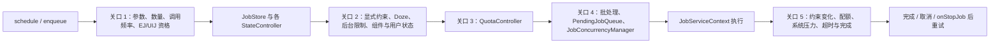

# 5.23 Android 17 JobScheduler 系统级五维节流架构

JobScheduler 决定一项后台工作能否被系统接收、何时变为 ready、何时获得执行槽、能运行多久，以及为何被停止。WorkManager 在现代 Android 上经常借助 JobScheduler 执行持久工作，但它还有自己的数据库、约束合并和重试策略；排障时要区分 Jetpack 状态与平台 Job 状态。

“五维节流”是本章为了阅读源码而采用的分析框架，并非 AOSP 中一个正式命名的架构。Android 17 / `android-17.0.0_r1` 的实现分布在 `JobSchedulerService`、多种 `StateController`、`QuotaController`、`PendingJobQueue`、`JobConcurrencyManager`、`JobServiceContext` 和 `JobRestriction` 中。把它们简化成一张“优先级越高，CPU 配额越多”的表，会遗漏绝大多数等待原因。

本章把一次 Job 的生命周期分成五个关口：

1. 调度请求是否被接收；
2. 显式与隐式约束是否满足；
3. 普通 Job 或 expedited job（EJ）是否还有配额；
4. ready Job 是否通过批处理、排序和并发分配；
5. 运行中的 Job 是否达到停止条件。

下面的图用于展示这五个关口及其主要源码所有者：



同一时刻可能有多个关口不通过。Android 17 的 pending reason API 可以同时返回多项原因，所以“当前看到 quota”不等于网络、Doze 或系统优化已经满足。

## 关口一：调度请求先要被系统接收

### JobInfo 校验与每应用数量上限

`JobInfo.Builder.build()` 会拒绝互相冲突或缺失的配置。例如：

- EJ 不能是 periodic，也不能设置 minimum latency 或 override deadline；
- UIJ 不能是 periodic、prefetch 或 device-idle Job；
- Android 17 中的 user-initiated data transfer job 必须指定网络；
- `PRIORITY_MAX` 只允许 EJ 或 UIJ 使用；
- high priority 不能用于 periodic 或 prefetch Job。

从 Android 12 开始，每个应用最多保存 150 个 Job，EJ 也计入。超过上限、组件不可用、权限不足或参数不合法时，`schedule()` 可能返回 `RESULT_FAILURE` 或抛出相应异常。收到失败后立刻无条件重试，只会制造调度风暴。

### 250 次/分钟只针对 persisted Job

Android 17 的 API rate quota 位于 `scheduleAsPackage()` 入口，但源码先检查 `job.isPersisted()`。AOSP 默认配置为：

- `aq_schedule_count = 250`；
- `aq_schedule_window_ms = 60_000`；
- 配置值小于 250 时会被钳到 250；
- 计数键按 user、source package 和 persisted-schedule category 维护。

因此，“所有 `schedule()` 调用都受 250 次/分钟限制”并不准确。该分支针对 persisted Job 的 `schedule()` / `enqueue()` 高频调用；普通非持久 Job 仍应避免频繁重提，因为调度、替换和持久状态更新都有系统成本。

超限行为也不是“所有线上应用立刻抛 `IllegalStateException`”：

- 系统会记录严重日志，并以 buggy reason 限制该应用；
- `aq_schedule_throw_exception` 默认开启，但源码只对 debuggable app 抛 `LimitExceededException`；
- `aq_schedule_return_failure` 默认关闭，设备配置可以改成返回 `RESULT_FAILURE`；
- 非 debuggable app 的直接表现取决于这些开关和后续后台限制。

这条配额与 EJ 运行时配额是两套机制。一个 persisted EJ 可能同时受到调度频率检查和 EJ 资格检查。

### 首次调度 EJ 会检查剩余 EJ 配额

`JobSchedulerService` 创建 `JobStatus` 后，对 requested EJ 调用 `QuotaController.isWithinEJQuotaLocked()`。配额不足时，首次 `schedule()` 直接返回 `RESULT_FAILURE`，Job 不进入 JobStore。

失败后由系统重调度的 EJ 有不同规则：JobScheduler 不再向应用暴露一次新的 `schedule()` 返回值；若此时 EJ 配额不足，重调度项会降为普通 Job。运行时应使用 `JobParameters.isExpeditedJob()` 判断本次是否仍享有 EJ 语义。

WorkManager 的 expedited work 由 `OutOfQuotaPolicy` 决定如何退化。常见的 `RUN_AS_NON_EXPEDITED_WORK_REQUEST` 会把工作转为普通 work，不能把它误诊为“EJ 静默丢失”。

### UIJ 有资格与权限检查

`setUserInitiated(true)` 从 API 34 提供。Android 17 中，UIJ 要求：

- 持有 `RUN_USER_INITIATED_JOBS`；
- 在前台或允许启动 Activity 的状态下调度；
- 对数据传输 Job 指定有效网络；
- 在运行时提供用户可见通知；
- 使用 `PRIORITY_MAX`，且不能同时标成 EJ。

条件不满足时可能在 build、schedule 或运行阶段失败。UIJ 面向用户刚刚发起且需要持续反馈的传输，不适合周期同步和后台预取。

## 关口二：ready 需要显式与隐式条件同时成立

Android 17 创建了以下主要 controller：

- `PrefetchController`；
- `FlexibilityController`；
- `ConnectivityController`；
- `TimeController`；
- `IdleController`；
- `BatteryController`；
- `StorageController`；
- `BackgroundJobsController`；
- `ContentObserverController`；
- `DeviceIdleJobsController`；
- `QuotaController`；
- `ComponentController`。

这些 controller 共同维护 `JobStatus` 的 constraint bits。应用声明的 charging、battery-not-low、storage-not-low、network、minimum latency、content trigger 和 device idle 都只是其中一部分。App Standby、后台限制、Doze、组件可用性、source user 是否启动、应用是否正在备份以及系统优化条件也会影响 ready。

`JobSchedulerService.areComponentsInPlaceLocked()` 还会检查：

- Job 是否仍在 JobStore；
- source user 是否已启动；
- source UID 是否正在执行备份；
- 是否命中 `JobRestriction`；
- `JobService` 组件是否仍可用。

所以，`JobStatus.isReady()` 为 true 仍不必然立即执行，后面还有组件、限制和并发分配。

### `requiresDeviceIdle` 与 Doze 是两个概念

`setRequiresDeviceIdle(true)` 表示应用希望在设备不活跃时执行，由 `IdleController` 处理。Doze 是 `DeviceIdleJobsController` 管理的设备级限制。一个 Job 满足 requested idle constraint，不代表它已获得在 Deep Doze 中自由执行的权限。

Doze maintenance window 也没有“固定每 1–2 小时一次”的平台承诺。普通 Job 可能等待 maintenance，EJ/UIJ 和 allowlist 情况有不同规则，最终还要满足应用自己声明的硬约束。

### 系统优化条件会逐步放宽

从 Android 14 起，JobScheduler 可以在任务没有 deadline 压力时，等待更合适的电量、充电、idle 或不计费网络状态。`FlexibilityController` 会随生命周期推进逐步放宽这些偏好；应用明确声明的 required constraints 不会因此消失。

开发者看到 `PENDING_JOB_REASON_JOB_SCHEDULER_OPTIMIZATION` 时，应先确认任务是否允许延后，而不是把它当成配额耗尽。

## 关口三：QuotaController 计的是执行会话

### 桶值映射

Android 17 的公开 Standby Bucket 值为：

| Bucket | 公开值 | JobScheduler 内部 index |
|---|---:|---:|
| `EXEMPTED` | 5 | 6 |
| `ACTIVE` | 10 | 0 |
| `WORKING_SET` | 20 | 1 |
| `FREQUENT` | 30 | 2 |
| `RARE` | 40 | 3 |
| `RESTRICTED` | 45 | 5 |
| `NEVER` | 50 | 4 |

内部映射使用区间比较，以便接受介于标准值之间的设备状态。旧稿中 `ACTIVE=20`、`NEVER=45` 等数值与 `UsageStatsManager` 不符。

### 普通 Job 的 Android 17 默认值

下面是 `android-17.0.0_r1` 在 quota-default adjustment compat override 未开启时的默认值：

| Bucket | 执行时长 / 滚动窗口 | Job 数 / 窗口 | session 数 / 窗口 |
|---|---:|---:|---:|
| `EXEMPTED` | 20 min / 40 min | 75 | 75 |
| `ACTIVE` | 20 min / 60 min | 75 | 75 |
| `WORKING_SET` | 10 min / 4 h | 120 | 10 |
| `FREQUENT` | 10 min / 12 h | 200 | 8 |
| `RARE` | 10 min / 24 h | 48 | 3 |
| `RESTRICTED` | 10 min / 24 h | 10 | 1 |
| `NEVER` | 0 | 0 | 0 |

另有每分钟 20 个 Job 和 20 个 session 的 rate limit。相邻 session 在 5 秒范围内可合并统计。时间、Job 数、session 数任一耗尽，都可能让应用 out of quota。

这里的“执行时长”是 elapsed realtime 上的 package execution session，并非某线程消耗的 CPU time。`QuotaController.Timer` 在该包第一个需要计费的后台 Job 开始时启动，在末尾一个结束时生成一段 `TimingSession`。多个 Job 并行运行期间，elapsed time 不会按 Job 数简单相加，但每个启动的后台 Job 仍会增加 Job count。

普通 Job 还受一个 24 小时内最多 4 小时执行会话的二级上限。`QuotaController.DEFAULT_MAX_EXECUTION_TIME_MS = 4h` 描述的是包级滚动统计，不是“单个 Job 可以运行 4 小时”。

### 哪些时间不计普通后台配额

`isWithinQuotaLocked()` 和 `Timer.shouldTrackLocked()` 可以确认以下主要豁免：

- UIJ 不计普通 quota；
- 符合条件的 top-started Job 不计；
- source UID 当前在 foreground 时不计；
- 充电时普通 bucket quota 通常 free。

`RESTRICTED` 是例外：即使充电，它仍要满足额外约束。充电也不会使单个 Job 获得无限运行时间；运行上限由 `JobSchedulerService` 的 runtime 规则另行计算。

### EJ 使用独立的 24 小时滚动额度

| Bucket | EJ 默认额度 / 24 h |
|---|---:|
| `EXEMPTED` | 60 min |
| `ACTIVE` | 30 min |
| `WORKING_SET` | 15 min |
| `FREQUENT` | 10 min |
| `RARE` | 10 min |
| `RESTRICTED` | 5 min |
| `NEVER` | 0 |

EJ 的 foreground、top app、temporary allowlist 和用户交互奖励规则比普通 quota 更复杂。一次 dump 中看到的剩余额度可能包含奖励或 grace period，不能只用 Standby Bucket 表反推。

直接 JobScheduler EJ 与 WorkManager 生成的 JobScheduler EJ，只要归属于同一 user/package，就由同一个 `QuotaController` 账本统计。WorkManager 的 fallback 策略可以让配额不足的工作以普通 Job 继续等待。

## 关口四：ready 后还要排队与争取槽位

### PendingJobQueue 的顺序

Android 17 的 `PendingJobQueue.AppJobQueue` 比较器大致按以下顺序处理同一应用队列：

1. shell override state；
2. requested UIJ；
3. requested EJ；
4. 同一 namespace 内的 effective priority；
5. framework 计算的 bias；
6. enqueue time。

外层队列再在各应用队列之间按队首时间和 override 状态取任务，并可一次拉取同一应用的少量 Job，减少进程反复启动。它不是“全系统按 priority → bucket → FIFO”排序；应用设置的 priority 从 Android 14 起只用于自己同一 namespace 内的排序。

`RESTRICTED` 普通 Job 会被强制批处理。EJ 和 UIJ 即使来源应用处于 restricted bucket，也不会走这条 forced-batch 分支，但仍可能被其他资格、约束或 restriction 拦住。

### 并发基线由 RAM 分档

`JobConcurrencyManager.DEFAULT_CONCURRENCY_LIMIT` 的 Android 17 基线为：

| 设备条件 | steady-state concurrency limit |
|---|---:|
| low-RAM device | 8 |
| 非 low-RAM，RAM ≤ 6 GB | 16 |
| 6 GB < RAM ≤ 8 GB | 20 |
| 8 GB < RAM ≤ 12 GB | 32 |
| RAM > 12 GB | 40 |

DeviceConfig 可在 1–64 范围内调整基线。这个数字仍不是每一时刻的实际可运行数：`WorkTypeConfig` 会按亮屏状态和 memory trim level 计算 `maxTotal`，并为不同 work type 预留或限制槽位。

### memory trim 改的是并发配置

Android 17 的默认 `maxTotal` 比例如下，乘数作用于当前 concurrency limit：

| memory trim | 亮屏 | 熄屏 |
|---|---:|---:|
| normal | 0.75 | 1.00 |
| moderate | 0.50 | 0.90 |
| low | 0.40 | 0.60 |
| critical | 0.40 | 0.40 |

源码按 `ProcessStats.ADJ_MEM_FACTOR_*` 选择配置。它没有把 `RARE` 暂停、`FREQUENT` 配额减半，也没有通过 `LowMemDetector` 修改 Standby Bucket 时长；旧稿把这些行为写进 Android 17，但对应源码不存在。

每包默认并发限制为：

- EJ：3；
- regular：steady-state limit 的一半。

这两个限制在系统已有足够空槽时会放宽，TOP app 也不受每包限制。UIJ/EJ 的即时性特权和“等待过久”策略还可能临时创建或替换执行 context，所以 steady-state limit 不是绝不越过的硬墙。

### Work type 比 priority 更接近并发调度语言

`JobConcurrencyManager` 把任务分类为：

- `TOP`；
- `FGS`；
- `UI`；
- `EJ`；
- `BG`；
- `BGUSER_IMPORTANT`；
- `BGUSER`。

每个 screen/memory 配置都为这些 work type 设置 minimum 和 maximum。并发分配先考虑任务能否作为某个 work type 运行，再判断 package limit、空闲 context、抢占和等待时间。

### priority 不控制 CPU 频率

`JobInfo.Builder.setPriority()` 从 API 33 提供，数值为：

| Priority | 数值 | 约束 |
|---|---:|---|
| `MIN` | 100 | 最容易延后 |
| `LOW` | 200 | 可让位于更重要工作 |
| `DEFAULT` | 300 | 普通默认值 |
| `HIGH` | 400 | 非 periodic、非 prefetch |
| `MAX` | 500 | 只允许 EJ / UIJ |

priority 会影响同一 namespace 内排序、thermal restriction 和某些 foreground runtime 规则。失败重试还会逐步降低 effective priority。它不会直接写 cpufreq、uclamp、EAS placement 或 ADPF session，也不能换算成“CPU 分配百分比”。

## Thermal、Doze 与 memory pressure 不能混成一个开关

### ThermalStatusRestriction

Thermal 由独立的 `ThermalStatusRestriction` 判断，不使用 `WorkTypeConfig` 的 memory trim 比例：

| Thermal 状态 | Android 17 的主要限制 |
|---|---|
| `NONE` | 不因 thermal 限制 Job |
| `LIGHT` | 限制 `MIN`；`LOW` 仅可在已运行且未 overtime 等条件下继续，前台 bias 豁免 |
| `MODERATE` | UIJ 可运行；EJ 仅在首次尝试或已运行且未 overtime 等条件下运行；HIGH 普通 Job 仅能在已运行且未 overtime 时继续 |
| `SEVERE` 及以上 | 限制所有非 TOP-bias Job |

这里的限制依据还包含 previous attempts、当前是否运行和是否 overtime，不能简化成“moderate 后并发乘 0.5”。

### Doze、Battery Saver 与低电量

Doze 和 Battery Saver 会影响 ready、网络、运行后的抢占与停止。应用声明的 `requiresBatteryNotLow` 由 `BatteryController` 处理；系统低电量状态也可能通过灵活约束和系统健康策略延后工作。

`android-17.0.0_r1` 没有“电量低于某阈值，就把普通 Job 最小保证从 10 分钟改成 5 分钟、EJ 从 3 分钟改成 1 分钟”的实现。相反，runtime 常量更新代码把 regular minimum 钳在至少 10 分钟，把 EJ minimum 钳在至少 1 分钟，AOSP 默认仍为 3 分钟。没有正式标签源码支持的 Beta 说法不应保留。

## 关口五：开始运行不等于可以一直运行

Android 17 启动 Job 时，`JobServiceContext` 分别记录：

- `mMinExecutionGuaranteeMillis`；
- `mMaxExecutionTimeMillis`；
- 当前执行开始时间；
- pending stop reason。

默认 runtime 规则可以概括为：

| Job 类型 | 默认 minimum | 常规 maximum 计算 |
|---|---:|---|
| regular | 10 min | 最多 30 min，并受普通 quota 剩余量和 timeout safeguard 约束 |
| EJ | 3 min | 最多 10 min，并受 EJ quota 剩余量约束 |
| UIJ | 6 h | 通常最多 12 h；重复 timeout 等 safeguard 可降低上限 |

这些是系统调度时使用的保证与上限，不是应用可以依赖的事务期限。取消、用户停止、组件失效、进程崩溃以及部分约束变化仍会结束工作。Android 12 起，普通 Job 达到 10 分钟后，如果系统资源充足，可以继续运行；系统繁忙、Battery Saver、Deep Doze、thermal restriction、并发超限或有更合适的 pending Job 时，也可以在 minimum 之后停止它。

`RUNTIME_CUMULATIVE_UI_LIMIT_MS = 24h` 也不是“UIJ 每天有 24 小时配额”。源码在因失败而重调度时继承 cumulative execution time；同一任务累计达到阈值后会被系统降级 UIJ 语义。

应用必须在 `onStopJob()` 中读取 `JobParameters.getStopReason()`，保存幂等进度，并按原因决定是否重试。返回 `true` 只表示请求 JobScheduler 依据 backoff 重调度；它不保证立刻重跑。

## WorkManager 如何映射

WorkManager 的具体行为取决于 Jetpack 版本和 scheduler backend。在使用 `SystemJobScheduler` 时，常见映射包括：

| WorkManager | JobScheduler |
|---|---|
| Work constraints | `JobInfo` 的 network、charging、battery、storage 等约束 |
| initial delay / periodic work | Job timing 与 WorkManager 自己的状态 |
| expedited work | requested EJ |
| `RUN_AS_NON_EXPEDITED_WORK_REQUEST` | EJ 不可用时按普通 work 继续 |
| retry / backoff | WorkManager 状态机与 JobScheduler backoff 共同参与 |

两个边界容易混淆：

- WorkManager 使用自己的数据库恢复工作，不能由“工作可跨重启”推断生成的 `JobInfo.isPersisted()` 为 true；250 次/分钟的 persisted schedule quota 要看最终 JobInfo。
- Worker 被停止可能来自 WorkManager 取消、约束变化、JobScheduler stop、进程死亡或库自身策略。只看 `Worker.Result` 无法定位平台 pending reason。

对小于 10 分钟、允许延后和重试的持久后台工作，WorkManager 通常更省实现成本。明确的用户发起大文件传输可以评估 UIJ；需要立即处理且耗时短的后台工作可以评估 expedited work。API 选择应跟用户可见性、持续时间和可中断性对应。

## Android 12 到 Android 17 的关键边界

| 版本 | 与本章相关的公开变化 |
|---|---|
| Android 12 / API 31 | EJ API；每应用 Job 上限从 100 增至 150；普通 Job 到 10 分钟后可在系统允许时继续 |
| Android 13 / API 33 | `setPriority()` 成为公开 API |
| Android 14 / API 34 | UIJ；应用 priority 只用于自己同一 namespace 内排序；系统可加入可逐步放宽的优化约束 |
| Android 16 / API 36 | `getPendingJobReasons()` 和 `getPendingJobReasonsHistory()` |
| Android 17 / API 37 | `getPendingJobReasonStats()` 汇总各 pending reason 的累计持续时间 |

Android 17 的调试 API是本章明确的新能力。源码中没有新增一套“低电量 runtime 折半”的正式规则。

## 诊断：按五个关口收集证据

### 应用内先记录调度与停止

至少记录：

- Job ID、namespace、priority、EJ/UIJ 标记；
- `schedule()` 返回值或异常；
- requested constraints；
- `onStartJob()` / `onStopJob()` 单调时钟；
- `JobParameters.isExpeditedJob()` / `isUserInitiatedJob()`；
- stop reason、重试次数与已完成进度。

Android 17 的 pending reason stats 可以补上“哪种原因累计等待最久”。下面的示例用于读取一个仍处于 pending 状态的 Job：

```kotlin
if (Build.VERSION.SDK_INT >= 37) {
    val scheduler = getSystemService(JobScheduler::class.java)
    val stats: Map<Int, Duration> =
        scheduler.getPendingJobReasonStats(JOB_ID)

    stats.forEach { (reason, duration) ->
        Log.d("JobDebug", "reason=$reason, pending=${duration.toMillis()}ms")
    }
}
```

返回 map 为空，可能表示 Job 几乎没有等待；Job 不存在或已不再 pending 时会抛 `IllegalArgumentException`。多个原因可在同一时段同时存在，因此各 duration 相加常常大于实际墙钟等待时间。统计不会跨重启保存，并在 Job 成功完成或取消时清除。

### shell 侧核对当前状态

下面的命令用于查看 Job、桶位、DeviceConfig 和一次受控执行：

```bash
adb shell dumpsys jobscheduler
adb shell cmd jobscheduler get-job-state PACKAGE_NAME JOB_ID
adb shell am get-standby-bucket PACKAGE_NAME
adb shell device_config list job_scheduler

adb shell cmd jobscheduler run --satisfied PACKAGE_NAME JOB_ID
```

`get-job-state` 只给出 pending、active、ready、waiting 等粗粒度状态；详细约束、quota、execution stats、active context 和 stop history 要回到 `dumpsys jobscheduler`。`run --satisfied` 只在约束满足时启动，适合验证服务本身；`run --force` 会绕过部分技术约束，不适合证明真实调度策略没有问题。

建议从 dumpsys 依次检查：

1. Job 是否存在、namespace 和 source UID 是否正确；
2. requested 与 satisfied constraints；
3. effective standby bucket；
4. quota controller 的 execution time、Job count、session count；
5. requested EJ 与 running-as-EJ 是否一致；
6. pending reason、override state 和 batching；
7. active jobs、work type、package concurrency 和 runtime limits；
8. thermal、memory trim、Battery Saver 与 Doze 状态。

### Perfetto 适合回答“何时运行”

Android 17 的 `JobServiceContext` 在 system_server trace 中创建 `JobScheduler` async slice，Job 完成时结束。`QuotaController` 也会在同一 track 写入部分 quota 状态 instant event。API 35 起，应用还可用 `JobInfo.Builder.setTraceTag()` 提供自己的 trace tag。

Perfetto 能把 Job 运行区间与 sched、CPU frequency、Binder、network 和 power 状态对齐，但 AOSP 没有保证独立的 `JobConcurrencyManager counter` 或“剩余 quota counter”轨道。配额数值仍以 dumpsys 和 API 为主，trace 用于核对开始、结束、抢占和 Host 线程负载。

## 排障决策表

| 现象 | 优先检查 |
|---|---|
| `schedule()` 直接失败 | JobInfo 合法性、150 Job 上限、EJ/UIJ 资格、组件和权限 |
| debuggable 构建抛 `LimitExceededException` | persisted Job 是否在 60 秒内反复 schedule/enqueue |
| Job 存在但 constraints unsatisfied | network、charging、battery、storage、timing、content trigger |
| constraints satisfied 仍 pending | quota、App Standby、Doze、thermal、后台限制、系统优化 |
| ready 很久仍不运行 | batching、全局 work-type limit、package concurrency、内存 trim |
| requested EJ 运行时变成普通 Job | 是否为失败后重调度，或 WorkManager 使用了 fallback |
| 运行约 10 分钟后停止 | stop reason、系统压力、pending replacement、普通 runtime 上限 |
| UIJ 很早结束 | 用户可见通知、权限、网络、timeout safeguard、用户停止 |
| 不同设备行为不同 | build、DeviceConfig、compat change、Standby Bucket 和 OEM restriction |

## 常见误判

| 误判 | Android 17 源码结论 |
|---|---|
| 五个维度都通过才叫 `JobStatus.isReady()` | ready、组件、restriction、batching 和并发分属不同阶段 |
| 250 次/分钟限制所有 Job | 对应入口分支只统计 persisted Job |
| persisted quota 超限会让所有线上应用崩溃 | 默认异常只对 debuggable app；其余行为受配置与后台限制影响 |
| Standby 配额是 CPU time | QuotaController 统计 package 的 elapsed execution session |
| `MAX_EXECUTION_TIME_MS=4h` 是单 Job 上限 | 它是普通 quota 的包级 24 小时滚动上限 |
| ACTIVE 仍是 10 min / 1 h | Android 17 当前默认是 20 min / 1 h |
| priority 数值越小越高 | `MIN=100`，`MAX=500` |
| priority 在所有应用之间全局排序 | Android 14 起只比较同一 namespace 的应用内任务 |
| high priority 直接提升 CPU 频率 | JobScheduler 不控制 cpufreq 或 ADPF |
| RAM 分档值就是实际并发数 | screen、memory trim、work type 和等待策略会继续调整 |
| memory pressure 会把 RARE 暂停、FREQUENT 配额减半 | `JobConcurrencyManager` 切换 work-type 并发配置，没有这套 bucket 改写 |
| thermal 通过 memory trim ratio 调并发 | thermal 使用独立 `ThermalStatusRestriction` |
| Android 17 低电量时 regular minimum 降为 5 min | 正式标签中没有该实现，regular minimum 仍至少 10 min |
| Doze maintenance 固定每 1–2 小时 | 平台不承诺固定间隔 |
| `getPendingJobReasonStats()` 的 duration 可直接相加 | 多个原因可重叠，相加会重复计算墙钟时间 |

## 参考资料

- [JobScheduler API reference](https://developer.android.com/reference/android/app/job/JobScheduler)：Job 数量、runtime 历史、pending reasons 与 schedule 返回值。
- [Android 17 JobDebugInfo APIs](https://developer.android.com/about/versions/17/features#job-debugging)：`getPendingJobReasonStats()` 的新增行为。
- [JobInfo.Builder API reference](https://developer.android.com/reference/android/app/job/JobInfo.Builder)：priority、EJ、UIJ、约束和 API 版本。
- [Background data transfer options](https://developer.android.com/develop/background-work/background-tasks/data-transfer-options)：WorkManager、EJ、UIJ 与 FGS 的适用边界。
- [JobSchedulerService.java（android-17.0.0_r1）](https://cs.android.com/android/platform/superproject/+/android-17.0.0_r1:frameworks/base/apex/jobscheduler/service/java/com/android/server/job/JobSchedulerService.java)：调度入口、controller 注册、runtime 与 Android 17 stats API 服务端。
- [QuotaController.java（android-17.0.0_r1）](https://cs.android.com/android/platform/superproject/+/android-17.0.0_r1:frameworks/base/apex/jobscheduler/service/java/com/android/server/job/controllers/QuotaController.java)：普通/EJ 配额、session 计时、充电和前台豁免。
- [PendingJobQueue.java（android-17.0.0_r1）](https://cs.android.com/android/platform/superproject/+/android-17.0.0_r1:frameworks/base/apex/jobscheduler/service/java/com/android/server/job/PendingJobQueue.java)：应用内排序与跨应用取队列。
- [JobConcurrencyManager.java（android-17.0.0_r1）](https://cs.android.com/android/platform/superproject/+/android-17.0.0_r1:frameworks/base/apex/jobscheduler/service/java/com/android/server/job/JobConcurrencyManager.java)：RAM 基线、work type、memory trim、package limit 与抢占。
- [JobServiceContext.java（android-17.0.0_r1）](https://cs.android.com/android/platform/superproject/+/android-17.0.0_r1:frameworks/base/apex/jobscheduler/service/java/com/android/server/job/JobServiceContext.java)：minimum/maximum runtime、trace 与停止流程。
- [ThermalStatusRestriction.java（android-17.0.0_r1）](https://cs.android.com/android/platform/superproject/+/android-17.0.0_r1:frameworks/base/apex/jobscheduler/service/java/com/android/server/job/restrictions/ThermalStatusRestriction.java)：thermal threshold 与 priority/EJ/UIJ 限制。
