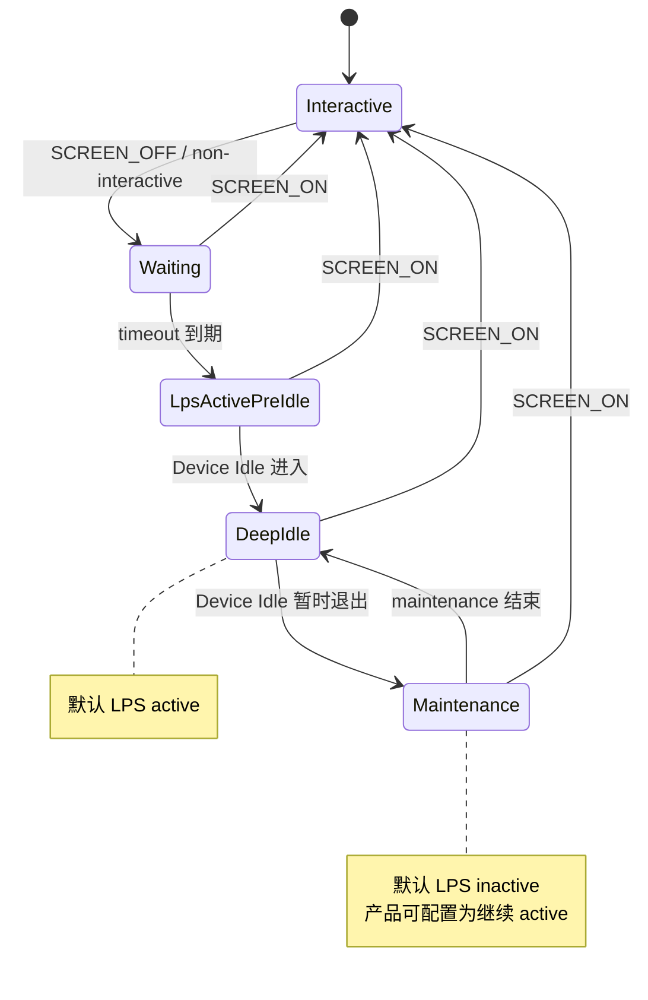
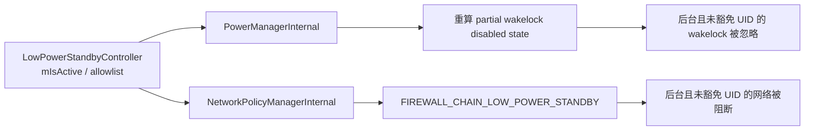

# 5.25 Android Low Power Standby 深度休眠与后台任务性能边界

Low Power Standby（LPS）从 Android 13 / API 33 提供公开查询 API。设备在一段非交互时间后，可以忽略后台应用持有的 partial wakelock，并通过独立防火墙链阻断其网络。它适合需要压低长时间待机功耗的产品，但 AOSP 把该能力设为可选：通用 framework 默认既不声明支持，也不默认开启，设备产品通过 resource overlay 决定是否采用。

本章以 Android 17 / `android-17.0.0_r1` 为源码锚点。LPS 的直接限制只有两类：wakelock 和网络。JobScheduler、AlarmManager、Sync、FCM、SensorService、ADPF、CPU hotplug 与 DVFS 没有由 `LowPowerStandbyController` 直接设置的规则。它们可能因 Doze 同时生效、网络不可用、CPU 无法被应用 wakelock 保持唤醒而呈现间接变化，排障时必须分开归因。

## 与 Doze、App Standby 和 Hibernation 的边界

| 机制 | 作用范围 | 主要触发 | 直接限制 |
|---|---|---|---|
| Doze | 设备级 | 非交互、设备 idle 状态机等 | 网络、partial wakelock、Job、Sync、普通 Alarm 等 |
| Low Power Standby | 设备级，但按 UID 判断豁免 | 已启用、非交互超时、maintenance 策略 | 网络和 partial wakelock |
| App Standby Bucket | 应用级 | 使用历史与系统策略 | Job、Alarm、网络等配额或机会 |
| App Hibernation | 应用级 | 长期未使用与豁免筛选 | Force stop、缓存回收、权限自动重置等 |

LPS 会观察 deep device idle 的进入和退出，以识别 maintenance window；它没有复用 Doze 的全部限制。LPS 甚至可以在设备第一次进入 Deep Doze 之前就激活，只要设备已经非交互并超过 LPS timeout。

原稿把 Doze 写成“不禁用 wakelock”也不准确。Android 17 的 `PowerManagerService` 对 Doze 和 LPS 都会计算 partial wakelock 的 disabled state，只是两者使用的 proc-state 门槛与 allowlist 不同。

## Android 17 状态机

### 支持、开启、活跃是三个状态

理解 LPS 时，先区分以下字段：

| 字段 | 含义 |
|---|---|
| `mSupportedConfig` | 产品 overlay 是否声明支持 |
| `mIsEnabled` | 支持前提下，Settings 中的 LPS 开关是否开启 |
| `mIsActive` | 此刻是否正在执行网络/wakelock 限制 |
| `mIsInteractive` | 设备当前是否可交互 |
| `mStandbyTimeoutConfig` | 非交互后等待多久才可激活 |
| `mIdleSinceNonInteractive` | 本轮灭屏后是否进入过 deep device idle |
| `mIsDeviceIdle` | 当前是否处于 deep device idle |
| `mActiveDuringMaintenance` | maintenance 期间是否仍保持 LPS |

Android 17 的核心判定可以按源码写成：

```text
active =
    forceActive
    OR (
        enabled
        AND NOT interactive
        AND nonInteractiveTimeoutExpired
        AND (NOT maintenanceMode OR activeDuringMaintenance)
    )

maintenanceMode = idleSinceNonInteractive AND NOT isDeviceIdle
```

这段表达式用于说明状态机条件。常规应用无法设置 `forceActive`；该入口是受权限保护的 Test/System API。默认 `activeDuringMaintenance=false`，所以设备进入过 Deep Doze 后，暂时退出 idle 的 maintenance window 会解除 LPS 限制。

### 从灭屏到 maintenance

下面的图用于展示一次典型状态变化：



图中的 `LpsActivePreIdle` 很重要：Doze 尚未进入 deep idle 时，LPS 已经可以限制后台网络和 wakelock。看到 Job 仍在运行但网络被阻断，并不矛盾。

### AOSP 默认资源值

Android 17 通用 framework 配置为：

```xml
<bool name="config_lowPowerStandbySupported">false</bool>
<bool name="config_lowPowerStandbyEnabledByDefault">false</bool>
<integer name="config_lowPowerStandbyNonInteractiveTimeout">5000</integer>
```

这段配置用于说明 AOSP 基线：不做产品 overlay 时，LPS 不受支持；5 秒 timeout 只有在产品把 support 打开后才有意义。不能由 Android TV、手机或车机形态推断某台设备一定启用，必须读目标 build。

运行时设置包括：

- `Settings.Global.LOW_POWER_STANDBY_ENABLED`
- `Settings.Global.LOW_POWER_STANDBY_ACTIVE_DURING_MAINTENANCE`

`mIsEnabled` 的计算包含 `mSupportedConfig`。因此，把 settings 值改成 `1` 也无法在 `config_lowPowerStandbySupported=false` 的设备上启用 LPS。

## 执行路径：两个消费者

`PowerManagerService` 创建 `LowPowerStandbyController`。当 `mIsActive` 改变时，controller 通知两个 system_server 内部服务：



图中没有 JobScheduler、AlarmManager 或 SensorService 分支。若这些子系统表现异常，应继续核对 Doze、Battery Saver、App Standby、后台启动限制和应用自身的网络依赖。

### Wakelock 门槛

Android 17 只在以下条件同时满足时，因 LPS 禁用应用的 partial wakelock：

- LPS active；
- owner UID 不在 LPS allowlist；
- UID 进程仍存在；
- proc state 比 `PROCESS_STATE_BOUND_TOP` 更不重要。

TOP 与 bound-TOP 场景不会被这一分支禁用。普通 foreground service 的 proc state 仍可能低于该门槛，所以官方 API 文档明确写着：LPS 也限制运行 FGS 的应用。持有 phone-call FGS 只有在当前 LPS policy 允许 `ONGOING_CALL` reason 时，才可能进入 LPS allowlist。

“禁用”表示 framework 忽略 wakelock 对 suspend 的贡献，并不等于应用对象自动 `release()`。API 33 的 `WakeLock.setStateListener()` 可以观察 framework 是否把该 wakelock 置为 enabled/disabled，但 disabled 原因还可能来自其他电源规则。

### 网络门槛

NetworkPolicy 使用 `FIREWALL_CHAIN_LOW_POWER_STANDBY`。当 LPS active 时，以下 UID 可继续联网：

- proc state 为 TOP 或更重要；
- 位于 LPS allowlist；
- system 等其他 NetworkPolicy allowed reason 在最终 blocked-reason 计算中适用。

普通 FGS 不因“前台服务”这个标签自动通过 TOP 门槛。Connectivity 的 Network 对象也可能仍然存在；LPS 是 per-UID 防火墙限制，所以“设备有网”与“该后台 UID 能收发数据”可以同时成立。

## Policy、豁免与 allowed reason

Android 14 / API 34 增加了面向普通应用的查询：

- `isExemptFromLowPowerStandby()`
- `isAllowedInLowPowerStandby(int reason)`
- `isAllowedInLowPowerStandby(String feature)`

`isExemptFromLowPowerStandby()` 检查调用包是否在 LPS policy 的 exempt packages 中；LPS 关闭时也返回 true。两个 `isAllowed...` 查询描述当前 policy 是否允许某个 reason 或 feature，不能证明调用 UID 此刻正因该 reason 获得豁免。

Android 17 定义三个 allowed reason：

| Reason | 含义 |
|---|---|
| `VOICE_INTERACTION` | 活跃语音交互 session |
| `TEMP_POWER_SAVE_ALLOWLIST` | 临时 power-save allowlist |
| `ONGOING_CALL` | 正在通话，包括 phone-call 类型 FGS |

Android 17 默认 policy 的 exempt package 集合为空，只允许 `VOICE_INTERACTION` reason，allowed feature 集合为空。产品可以通过受 `MANAGE_LOW_POWER_STANDBY` / `DEVICE_POWER` 权限保护的 System API 设置自定义 policy；policy 持久化在 `/data/system/low_power_standby_policy.xml`。

这也解释了两个常见误区：

- 常规电池优化 allowlist 不自动等于 LPS exempt packages；
- 高优先级 FCM 可能带来的 temporary allowlist，只有 policy 允许 `TEMP_POWER_SAVE_ALLOWLIST` 时才有机会豁免 LPS。

普通应用无法自行加入 LPS policy，也不应承诺通过申请忽略 battery optimization 来恢复 LPS 下的网络或 wakelock。

### Standby ports

Android 17 还包含 Low Power Standby ports 机制。持有 `SET_LOW_POWER_STANDBY_PORTS` 的系统级调用方可以申请在 LPS 中保持指定 TCP/UDP port 开放，但请求只有在调用包本身被 policy 豁免且 DeviceConfig `low_power_standby/enable_standby_ports` 开启时才生效。

这是受权限保护的 System API，不能作为三方即时通讯应用的通用保活方案。公开常量 `FEATURE_WAKE_ON_LAN_IN_LOW_POWER_STANDBY` 也只用于查询 policy 是否允许 wake-on-LAN / wake-on-WLAN feature。

## LPS 对常见后台能力的准确影响

| 能力 | LPS 直接做什么 | 工程判断 |
|---|---|---|
| partial wakelock | 后台、未豁免 UID 的锁被忽略 | CPU 可能在 callback 尚未结束时重新 suspend |
| 网络 | 后台、未豁免 UID 进入 LPS firewall block | 现有 socket 可超时，重试不应忙循环 |
| FGS | 不因 FGS 身份自动杀进程，也不自动豁免 | 普通 FGS 仍可能失去网络和 wakelock 效果 |
| JobScheduler | controller 没有直接暂停 Job | Doze/Standby/constraints 仍可能推迟；运行中的 Job 也可能无网 |
| AlarmManager | controller 没有直接改 Alarm 交付 | 闹钟触发不保证应用能持锁或联网 |
| SyncAdapter | controller 没有直接改 sync 调度 | 同期 Doze 与网络 block 会影响完成 |
| FCM | 没有内置“高优先级总可达”例外 | 是否可达取决于 policy、UID 状态和传输链路 |
| Sensor / NNAPI / ADPF | 没有 LPS 专用调用 | 不要把频率、batching 或推理延迟直接归因给 LPS |

Expedited Job 和 `setExactAndAllowWhileIdle()` 解决的是各自调度域的问题，不会清除 LPS firewall，也不会让被禁用的应用 wakelock重新生效。任务“被调起”与任务“能完成网络工作”需要分别验证。

## 应用侧适配

### 查询能力边界

下面的 Kotlin 示例用于查询 LPS 的全局开关和当前包的 policy 属性：

```kotlin
val powerManager = getSystemService(PowerManager::class.java)

if (Build.VERSION.SDK_INT >= 33) {
    val enabled = powerManager.isLowPowerStandbyEnabled
    Log.d("Lps", "enabled=$enabled")
}

if (Build.VERSION.SDK_INT >= 34) {
    val exempt = powerManager.isExemptFromLowPowerStandby
    val callsAllowed = powerManager.isAllowedInLowPowerStandby(
        PowerManager.LOW_POWER_STANDBY_ALLOWED_REASON_ONGOING_CALL
    )
    Log.d("Lps", "exempt=$exempt, callsAllowedByPolicy=$callsAllowed")
}
```

`enabled` 不是 active state；`callsAllowed` 也不是“我的 UID 当前正在通话且已豁免”。普通 SDK 没有查询 `mIsActive` 的直接 API，`isLowPowerStandbySupported()` 还是受权限保护的 System API。

`ACTION_LOW_POWER_STANDBY_ENABLED_CHANGED` 只报告开关变化，不报告每一次 active/inactive 转换。应用可以结合自身 lifecycle、wakelock state listener、network callback 和请求失败证据做诊断，不应自行用 `isDeviceIdleMode()` 推导 LPS active。

### 网络状态与重试

推荐把 LPS 当成“后台网络暂时不可用”的一种来源：

1. 请求必须可重试、可去重；
2. 使用指数退避和 jitter；
3. 持久化待发送队列与进度；
4. 收到可用 network callback 后触发一次合并重试；
5. 用户进入前台时立即刷新必要状态；
6. 不用短周期 Alarm 或 expedited work 反复撞防火墙。

`ConnectivityManager.NetworkCallback.onBlockedStatusChanged()` 可以提供“该 Network 对调用 UID 是否被系统策略阻断”的信号，但 boolean 不携带唯一原因。要确认 LPS，仍需在测试设备上对照 system_server 状态。

### Wakelock 失效要按中断设计

如果工作依赖 partial wakelock：

- 把长操作拆成可提交的小单元；
- 每个单元完成后持久化 checkpoint；
- 网络写入使用幂等 request ID；
- 不把 `WakeLock.isHeld()` 当成 CPU 一定保持运行的证据；
- API 33+ 可用 state listener 记录 enable/disable 时序；
- 从前台恢复后续跑未完成项。

音视频流、长连接和后台上传都可能因网络 block 中断。已经缓冲在本地的数据是否继续播放，取决于媒体栈、进程状态和设备 suspend 行为，不能统一写成“FGS 一定继续”或“一定被杀”。

## 调试与验证

### 先确认设备支持

下面的命令用于读取 Android 17 controller 的完整状态：

```bash
adb shell dumpsys power | grep -A40 "Low Power Standby Controller:"
```

重点字段包括：

- `mSupportedConfig`
- `mIsEnabled`
- `mIsActive`
- `mStandbyTimeoutConfig`
- `mIsInteractive`
- `mIdleSinceNonInteractive`
- `mIsDeviceIdle`
- `Allowed UIDs`
- policy identifier、exempt packages、allowed reasons、allowed features

若 `mSupportedConfig=false`，修改 Settings 不会激活 LPS。此时需要支持 LPS 的产品镜像或正确的 resource overlay，不能靠 shell 开关补齐 framework capability。

### 在支持设备上复现 active

下面的流程用于启用 LPS、让设备进入非交互状态，并在 timeout 后检查 active：

```bash
old_enabled="$(adb shell settings get global low_power_standby_enabled)"
old_maintenance="$(adb shell settings get global low_power_standby_active_during_maintenance)"

adb shell settings put global low_power_standby_enabled 1
adb shell settings put global low_power_standby_active_during_maintenance 0
adb shell cmd power sleep

# 等待时间必须大于 dumpsys 中的 mStandbyTimeoutConfig。
adb shell dumpsys power | grep -A40 "Low Power Standby Controller:"

adb shell cmd power wakeup

if [ "$old_enabled" = "null" ]; then
  adb shell settings delete global low_power_standby_enabled
else
  adb shell settings put global low_power_standby_enabled "$old_enabled"
fi

if [ "$old_maintenance" = "null" ]; then
  adb shell settings delete global low_power_standby_active_during_maintenance
else
  adb shell settings put global low_power_standby_active_during_maintenance "$old_maintenance"
fi
```

命令会在旧值为 `null` 时删除对应 setting，避免把字符串 `null` 写回数据库。测试前还应关闭 AOD、dream 或其他会影响 interactive 状态的产品行为，并用 dumpsys 结果确认，而非只假设屏幕已经关闭。

Android 17 的 `cmd power` 没有公开的 `force-low-power-standby-active` 子命令。`PowerManager.forceLowPowerStandbyActive()` 是受权限保护的 Test API，普通 shell 流程应走真实的非交互 timeout。

### 核对 wakelock 与网络执行端

下面的命令用于同时检查 PowerManager 和 NetworkPolicy 的 LPS 状态：

```bash
adb shell dumpsys power
adb shell dumpsys netpolicy | grep -i -A8 -B4 low.power.standby
```

PowerManager 侧应看到 controller 的 `mIsActive=true`，以及主状态中的 `mLowPowerStandbyActive=true`。NetworkPolicy 侧应看到 LPS active、allowlist 和相关 blocked/allowed reason。目标应用必须处于后台 proc state，且不在 LPS allowlist，测试才会命中限制。

为验证网络，应让同一请求分别在 TOP、普通 FGS、纯后台三种 proc state 执行，并记录 socket error、blocked callback 和 UID firewall state。为验证 wakelock，应使用 `WakeLockStateListener` 或 dumpsys 中的 disabled state，而不能只比较 `isHeld()`。

### Perfetto 与功耗数据

Android 17 没有承诺一条名为 `LowPowerStandby` 的专用 Perfetto counter。NetworkPolicy 代码会写 `setLowPowerStandbyActive`、`updateRulesForLowPowerStandbyUL` 等 trace slice；PowerManager 还可观察 suspend、wakeup 与 wakelock。

下面的 SQL 用于在已经包含 network/system_server 与 power 数据源的 trace 中寻找相关 slice：

```sql
SELECT ts, dur, name
FROM slice
WHERE name GLOB '*LowPowerStandby*'
ORDER BY ts;
```

查不到 slice 不能证明 LPS 未生效，因为 trace 配置可能没有打开对应 category。可靠顺序是先保存 active 前后两份 `dumpsys power` / `dumpsys netpolicy`，再用 Perfetto 对齐 suspend、CPU 调度、网络请求和应用日志。

Battery Historian 中 CPU running、network 和 wakelock 的减少只说明结果，不能单独证明原因是 LPS。Doze、应用空闲、网络断开和工作负载变化都可能产生相似图形。

## 性能实验设计

LPS 的价值主要体现在待机功耗，应用风险主要体现在恢复延迟和后台可用性。建议至少记录：

| 指标 | 目的 |
|---|---|
| 非交互到 `mIsActive=true` 的时间 | 验证产品 timeout |
| active 期间 suspend residency / wakeups | 验证待机功耗机制 |
| TOP、FGS、后台 UID 的网络成功率 | 验证 proc-state 门槛 |
| wakelock enabled/disabled 时序 | 验证 PowerManager 执行 |
| 长连接重建耗时 | 评估用户唤醒后的恢复 |
| 消息端到端延迟 | 评估 policy 和传输路径 |
| Doze maintenance 前后状态 | 区分 LPS 与 Doze |
| allowlist / allowed reason | 解释设备与版本差异 |

不要预填“消息必然延迟 15–30 分钟”“NPU 推理慢 10–100 倍”或“CPU 大核全部离线”等数字。Android 17 LPS 源码没有给出这些结论；它只改变网络和 wakelock 资格。需要功耗或时延数字时，应在目标 build、目标 SoC 和固定网络环境上实测。

## Android 13 到 Android 17 的版本边界

| 版本 | 可确认的公开边界 |
|---|---|
| Android 13 / API 33 | `isLowPowerStandbyEnabled()`、enabled-changed broadcast、wakelock state listener |
| Android 14 / API 34 | `isExemptFromLowPowerStandby()`、reason/feature policy 查询与三类 allowed reason |
| Android 15–17 / API 35–37 | Android 17 仍保留 support/enabled/active 状态机、custom policy、allowlist 和 standby ports；本章不假设未验证的设备形态扩展 |

Android 17 源码中没有“折叠屏合盖”“暗光传感器提前触发”“Battery Usage Stats 新增 LPS 维度”这些通用平台规则。OEM 可以在 overlay、policy 和更下层电源栈中做产品差异，但结论必须以目标设备的配置、dumpsys 和厂商文档为证据。

## 常见误判

| 误判 | Android 17 结论 |
|---|---|
| `isLowPowerStandbyEnabled()` 表示当前 active | 它只返回全局 enabled |
| LPS 必须等 Deep Doze 才激活 | 非交互 timeout 后即可激活 |
| LPS 有自己的 Job/Alarm/Sync 调度规则 | controller 直接控制网络与 partial wakelock |
| 普通 FGS 自动豁免 | 官方文档明确包含 FGS；普通 FGS 仍可能受限 |
| 高优先级 FCM 必然可达 | temporary allowlist 还要被当前 LPS policy 允许 |
| exact alarm 或 expedited job 可以穿过网络防火墙 | 调度机会不等于网络权限 |
| 电池优化白名单等于 LPS policy exemption | 两套名单和 policy 语义不同 |
| LPS 会直接降低 CPU/GPU/NPU 频率 | 源码没有该调用；频率变化属于负载与下层电源策略 |
| `isDeviceIdleMode()==true` 才代表 LPS active | LPS 可在初始 pre-idle 阶段 active |
| maintenance 一定解除 LPS | 默认解除，产品可设置 active during maintenance |

## 参考资料

- [PowerManager API reference](https://developer.android.com/reference/android/os/PowerManager)：enabled、exemption、allowed reason/feature 与公开版本。
- [LowPowerStandbyController.java（android-17.0.0_r1）](https://cs.android.com/android/platform/superproject/+/android-17.0.0_r1:frameworks/base/services/core/java/com/android/server/power/LowPowerStandbyController.java)：active 状态机、policy、allowlist、standby ports 与 dumpsys。
- [PowerManagerService.java（android-17.0.0_r1）](https://cs.android.com/android/platform/superproject/+/android-17.0.0_r1:frameworks/base/services/core/java/com/android/server/power/PowerManagerService.java)：partial wakelock disabled state 与 Binder API。
- [NetworkPolicyManagerService.java（android-17.0.0_r1）](https://cs.android.com/android/platform/superproject/+/android-17.0.0_r1:frameworks/base/services/core/java/com/android/server/net/NetworkPolicyManagerService.java)：LPS firewall chain、TOP 门槛和 blocked reason。
- [NetworkPolicyManager.java（android-17.0.0_r1）](https://cs.android.com/android/platform/superproject/+/android-17.0.0_r1:frameworks/base/core/java/android/net/NetworkPolicyManager.java)：`isProcStateAllowedWhileInLowPowerStandby()`。
- [framework config.xml（android-17.0.0_r1）](https://cs.android.com/android/platform/superproject/+/android-17.0.0_r1:frameworks/base/core/res/res/values/config.xml)：support、enabled-by-default 与 non-interactive timeout 的 AOSP 默认值。
