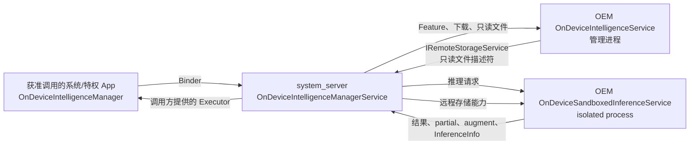

# 5.30 Android 17 OnDeviceIntelligence：服务编排、资源隔离与性能边界

`android-17.0.0_r1` 的 `frameworks/base` 和 `packages/modules/NeuralNetworks` 中都没有 `FoundationModelManager` 类。Android 17 的系统入口是 `OnDeviceIntelligenceManager`。平台源码中另有一组受发布开关控制的 `OnDeviceModel`、Embedding 和 Image Description 接口，也没有使用 `FoundationModelManager` 这个名称。

以下统一讨论 Android 17 的实际实现。OnDeviceIntelligence（下文简称 ODI）负责权限检查、服务发现、IPC 转发、只读数据校验、连接管理和部分调用方优先级处理；模型格式、运行时、NPU 选择、批处理、抢占和内存复用由设备厂商的服务实现。

源码锚点如下：

- Android 平台：`android-17.0.0_r1`，API 37。
- ODI framework 与 system_server 代码：`frameworks/base/packages/NeuralNetworks/`。
- 可模块化实现：`packages/modules/NeuralNetworks` 的同名 Android 17 标签。
- Linux 内核锚点 `android17-6.18-2026-06_r6` 中没有可直接验证的 ODI 专用调度代码。

## 结论边界

| 问题 | Android 17 源码结论 |
|---|---|
| App 侧入口是什么 | `OnDeviceIntelligenceManager`，属于 `@SystemApi` |
| 普通第三方 App 能否直接使用 | 通常不能；核心方法要求 `USE_ON_DEVICE_INTELLIGENCE`，其保护级别为 `signature\|privileged` |
| 框架是否自带模型或推理引擎 | 不带；OEM 服务解释 `Feature`、请求参数和结果 |
| 推理是否在独立进程 | 是；推理 Service 必须声明 `isolatedProcess` |
| 框架是否实现模型任务优先级队列 | 没有这项通用实现；Android 17 会根据调用方前后台状态调整与推理 Service 的绑定调度级别 |
| `BUSY`、`SUSPENDED` 是否证明 AOSP 有抢占调度器 | 不能；它们是 OEM 服务可返回的错误语义 |
| `SharedMemory` 是否等于零拷贝 | 不等于；源码只保证允许传递并限制为只读 |
| `InferenceInfo` 是否自动完成 NPU 功耗归因 | 不会；它只有 UID 和时间字段，且依赖推理服务上报 |
| ODI 是否一定编进 `framework.jar` | 不一定；Android 17 同时保留平台实现和 `com.android.neuralnetworks` APEX 方案，由发布开关选择 |

## Android 17 的源码位置与模块边界

早期版本的 ODI 代码位于 `core/java` 和 `services/core/java`。到 `android-17.0.0_r1`，相关代码已迁到以下位置：

| 层次 | Android 17 路径 | 所在进程 |
|---|---|---|
| 系统客户端 API | `packages/NeuralNetworks/framework/{module,platform}/java/android/app/ondeviceintelligence/` | 获准调用的系统或特权 App |
| OEM Service API | `packages/NeuralNetworks/framework/{module,platform}/java/android/service/ondeviceintelligence/` | OEM 管理进程与隔离推理进程 |
| system_server 实现 | `packages/NeuralNetworks/service/{module,platform}/java/com/android/server/ondeviceintelligence/` | `system_server` |

`module` 与 `platform` 是两套受构建配置选择的源码变体。`frameworks/base/Android.bp` 会根据 `RELEASE_ONDEVICE_INTELLIGENCE_MODULE` 决定是否加入平台实现；`services/Android.bp` 也会在 system_server 的平台源码与模块 stub 之间选择。另一方面，`packages/modules/NeuralNetworks/apex/Android.bp` 可以把 ODI 的 bootclasspath 和 system-server classpath fragment 放进 `com.android.neuralnetworks` APEX。

由此可以得到更准确的更新边界：

- ODI 是 Android 系统服务，API 仍属于 System API。
- Android 17 源码支持 APEX 模块形态，也保留平台内置形态。
- 某台设备采用哪一种形态，要看产品的 release flag 和构建产物，不能只根据 Java 包名判断。

可从以下 Android 17 源码核对：

- [`frameworks/base/Android.bp`](https://android.googlesource.com/platform/frameworks/base/+/refs/tags/android-17.0.0_r1/Android.bp)
- [`frameworks/base/packages/NeuralNetworks/framework/Android.bp`](https://android.googlesource.com/platform/frameworks/base/+/refs/tags/android-17.0.0_r1/packages/NeuralNetworks/framework/Android.bp)
- [`packages/modules/NeuralNetworks/apex/Android.bp`](https://android.googlesource.com/platform/packages/modules/NeuralNetworks/+/refs/tags/android-17.0.0_r1/apex/Android.bp)

## 两个 OEM Service，不要只看沙箱进程

ODI 不是单个“推理服务”。设备厂商需要提供两个职责不同的 Service：

| Service | 配置资源 | 主要职责 | 进程约束 |
|---|---|---|---|
| `OnDeviceIntelligenceService` | `config_defaultOnDeviceIntelligenceService` | Feature 查询、详情、下载、模型文件与配置管理 | 普通受保护 Service |
| `OnDeviceSandboxedInferenceService` | `config_defaultOnDeviceSandboxedInferenceService` | token 信息、一次性推理、流式推理、处理状态更新 | 必须是 isolated process |

下面的图用于说明一次请求经过哪些组件，以及模型文件为何不用让隔离进程自行访问存储。



图中的 `system_server` 是可信中介。它在隔离推理服务连接后注册 `IRemoteStorageService`，推理服务再通过这个受控接口取得只读文件描述符。隔离进程无需获得管理服务的文件访问身份。

`OnDeviceIntelligenceManagerService` 还把两个远端 Service 固定绑定到 `UserHandle.SYSTEM`。源码给出的理由是推理进程内存开销较大，不适合按 Android 用户各建一份实例。这里的“单实例”指 system_server 使用 SYSTEM 用户下的共享服务连接；OEM 是否在服务内部并行多个模型上下文，依然由厂商代码决定。

## 权限和 Service 声明

Android 17 在 `core/res/AndroidManifest.xml` 中定义了三项关键权限：

| 权限 | protectionLevel | 使用者 |
|---|---|---|
| `android.permission.USE_ON_DEVICE_INTELLIGENCE` | `signature\|privileged` | 调用 Manager API 的系统或特权组件 |
| `android.permission.BIND_ON_DEVICE_INTELLIGENCE_SERVICE` | `signature` | OEM 的管理 Service |
| `android.permission.BIND_ON_DEVICE_SANDBOXED_INFERENCE_SERVICE` | `signature` | OEM 的隔离推理 Service |

两个 `BIND_*` 权限都是 `signature`，管理 Service 的绑定权限并不是 `signature|privileged`。`USE_ON_DEVICE_INTELLIGENCE` 还带有 `allowedInPrivateComputeCore` permission flag，但这不改变普通第三方 App 无法直接获得该权限的事实。

下面的 manifest 片段只用于展示推理 Service 必须满足的声明约束：

```xml
<service
    android:name=".VendorSandboxedInferenceService"
    android:permission="android.permission.BIND_ON_DEVICE_SANDBOXED_INFERENCE_SERVICE"
    android:isolatedProcess="true"
    android:externalService="false">
    <intent-filter>
        <action android:name=
            "android.service.ondeviceintelligence.OnDeviceSandboxedInferenceService" />
    </intent-filter>
</service>
```

权限名包含 `BIND_ON_DEVICE_...`，不能省略 `BIND_ONDEVICE_...`。system_server 会检查配置组件的绑定权限，并要求推理 Service 带 `FLAG_ISOLATED_PROCESS`、不能是 external service。产品 manifest 还需与 framework resource 中配置的 ComponentName 对上。

`isolatedProcess` 应理解为“使用临时隔离 UID，不能继承宿主应用的一般权限与数据访问身份”。它不表示进程没有任何可用系统调用，也不表示它不能读取 system_server 明确传入的 FD。它仍可通过已经授予的 Binder 能力与管理侧协作。

相关源码：

- [`AndroidManifest.xml`](https://android.googlesource.com/platform/frameworks/base/+/refs/tags/android-17.0.0_r1/core/res/AndroidManifest.xml)
- [`OnDeviceIntelligenceManagerService.java`](https://android.googlesource.com/platform/frameworks/base/+/refs/tags/android-17.0.0_r1/packages/NeuralNetworks/service/platform/java/com/android/server/ondeviceintelligence/OnDeviceIntelligenceManagerService.java)
- [`OnDeviceSandboxedInferenceService.java`](https://android.googlesource.com/platform/frameworks/base/+/refs/tags/android-17.0.0_r1/packages/NeuralNetworks/framework/platform/java/android/service/ondeviceintelligence/OnDeviceSandboxedInferenceService.java)

## `Feature` 是开放协议，不是固定模型目录

`OnDeviceIntelligenceManager` 的常规使用顺序是：

1. 用 `listFeatures()` 或 `getFeature()` 查询设备提供的能力。
2. 用 `getFeatureDetails()` 查询需要额外计算的状态或详情。
3. 必要时用 `requestFeatureDownload()` 请求准备该 Feature 所需文件。
4. 用 `requestTokenInfo()`、`processRequest()` 或 `processRequestStreaming()` 执行请求。

`Feature` 包含 `id`、`name`、`modelName`、`type`、`variant` 和 `featureParams`。这些字段提供发现与路由信息，却没有规定模型文件格式、tokenizer、输入 key 或输出 schema。AOSP 类注释也建议 OEM 再提供一层契约更明确的 SDK 或库。

这会带来两个工程结论：

- 不同设备即使都暴露 ODI，Feature ID 和 Bundle 内容也未必兼容。
- 调用方必须先做 capability discovery，不能把某个 OEM 的 Feature 常量当成 Android 公共标准。

Android 17 的 platform 变体还包含 `OnDeviceModel`、Embedding 和 Image Description API，其中部分受 `FLAG_ON_DEVICE_INTELLIGENCE_26Q2` 控制。它们体现了接口继续演进，但不能据此给所有 Android 17 产品假定相同能力。需要以目标设备的 build flag、System API surface 和运行时 Feature 列表为准。

## 请求是异步的，回调线程由双方分别控制

`processRequest()` 是异步调用。Manager 负责发起 Binder 请求，完成结果通过 `ProcessingCallback` 返回；流式版本通过 `StreamingProcessingCallback` 多次返回 partial result，再以成功或失败结束。

调用方必须传入 `Executor`。Manager 的 Binder stub 会清理 Binder calling identity，再把客户端回调投递到这个 Executor。选错 Executor 会直接影响用户感知：

- 把反序列化、文本拼接或图片处理放到主线程，会造成 UI 卡顿。
- 使用无界线程池消费高频 partial result，可能把一次模型请求放大成线程和对象分配压力。
- 单线程 Executor 可以保持结果顺序，但回调内的慢任务会累积等待。

服务侧还有另一层线程边界。`OnDeviceSandboxedInferenceService` 的 Binder stub 会把 `onTokenInfoRequest()`、`onProcessRequest()`、`onProcessRequestStreaming()` 等入口投递到该 Service 的主 Looper。OEM 实现不能在这些抽象方法中长时间占用主线程，应尽快把计算提交到有界的推理执行器。基类的 `getCallbackExecutor()` 默认也基于异步主线程 Handler；厂商可按自身回调模型覆盖。

框架中的 cached thread pool 主要用于关闭 Bundle 资源、转发配置或广播等系统工作。它不是 NPU 请求队列，也不会替 OEM 决定模型并发度。

## IPC 次数不能写成固定常量

一次最简非流式请求通常会经过 App → system_server → 推理 Service，以及反向结果回调。不过，“固定四次 Binder 事务”不适合作为 Android 17 结论，原因有四个：

- `CancellationSignal` 和 `ProcessingSignal` 会建立额外的远端 transport。
- 推理 Service 可以通过 `onDataAugmentRequest()` 发起一次或多次往返。
- 流式请求的每个 `onPartialResult()` 都会增加回调事务。
- 推理 Service 可能通过 `IRemoteStorageService` 请求模型或配置文件。

Binder 驱动调度、Java stub、system_server 转发和调用方 Executor 排队都可能计入端到端延迟。应在目标设备上用 Perfetto 的 Binder 与线程调度轨迹测量，不要套用“Binder 必然是亚毫秒”一类固定经验值。

流式输出也不等同于 token-by-token。Bundle 里装一个 token、多个 token、图片 tile 或其他内容，均由 OEM 协议决定。较小的分块有利于缩短首批结果时间，却会增加 Binder 事务、对象分配和回调调度次数。批量大小需要在 TTFT、输出平滑度和 IPC 开销之间实测。

## 三种 RequestType 的准确含义

Android 17 定义了三个整数常量：

| RequestType | 值 | 框架承诺 |
|---|---:|---|
| `REQUEST_TYPE_INFERENCE` | 0 | 请求 OEM 服务执行其定义的推理 |
| `REQUEST_TYPE_PREPARE` | 1 | 提示远端提前准备环境，例如推理运行时 |
| `REQUEST_TYPE_EMBEDDINGS` | 2 | 请求 OEM 服务处理 embedding 类任务 |

`REQUEST_TYPE_PREPARE` 只是开放协议中的请求类型。framework 不会自行加载权重、编译计算图或固定模型驻留时间。一次 prepare 是否有效、准备哪些资源、结果持续多久、能否与前台推理并发，都要看 OEM 服务。

更稳妥的预热策略是：

- 只在用户很可能马上使用该能力时发起 prepare，避免无效常驻和热量积累。
- 记录 prepare 成功后第一笔 inference 的 TTFT，并与冷启动样本分开统计。
- 页面离开或需求取消时传递 `CancellationSignal`，但仍要验证 OEM 是否及时响应。
- 遇到 `PROCESSING_ERROR_BUSY` 时按源码注释做有上限的指数退避；不要无限重试。

隐藏的 `Settings.Secure` 超时项面向系统集成、调试和 OEM 配置，不是普通调用方的性能旋钮。特权客户端也不应为了少一次冷启动就擅自延长全局解绑时间。

## Bundle 校验：只读边界不代表零拷贝

system_server 在把请求送入隔离进程前调用 `BundleUtil.sanitizeInferenceParams()`。Android 17 的实际校验规则包括：

- Bundle 不能包含 `IBinder`。
- 原始类型、字符串、数组等 `PersistableBundle` 可表示的值可以直接 marshalling。
- `ParcelFileDescriptor` 必须以只读模式打开。
- `SharedMemory` 会被限制为 `PROT_READ`。
- `Bitmap` 必须不可变。
- inference 请求可以包含 `CursorWindow`、嵌套 Bundle，以及受支持的 PFD/Bitmap 数组。
- 返回 Bundle 会再次校验；其允许集合与请求侧并不完全相同。

system_server 在转发完成后异步关闭自己持有的 PFD、`CursorWindow`、`SharedMemory` 和 `Bitmap` 等资源。这个清理动作解决的是中介进程的资源生命周期，不能代替客户端和 OEM 服务管理各自收到的对象。

对性能分析来说，需要分开三个概念：

1. **绕过 Binder 内联大数据**：PFD 或 `SharedMemory` 可以避免把大块 payload 塞进 Binder Parcel。
2. **共享物理页**：是否共享取决于文件映射和 runtime 的使用方式。
3. **推理引擎零拷贝**：runtime 仍可能做格式转换、解码、量化布局重排或拷入加速器专用内存。

AOSP 只证明第一项机制可用，并对访问权限做约束。`ParcelFileDescriptor` 或 `SharedMemory` 不足以证明模型权重必然 `mmap`，也不能证明 CPU、NPU 之间没有拷贝。

相关源码：

- [`OnDeviceIntelligenceManager.java`](https://android.googlesource.com/platform/frameworks/base/+/refs/tags/android-17.0.0_r1/packages/NeuralNetworks/framework/module/java/android/app/ondeviceintelligence/OnDeviceIntelligenceManager.java)
- [`BundleUtil.java`](https://android.googlesource.com/platform/frameworks/base/+/refs/tags/android-17.0.0_r1/packages/NeuralNetworks/service/module/java/com/android/server/ondeviceintelligence/BundleUtil.java)

## Data Augment 是通用回调，不是内置 RAG

`ProcessingCallback` 和 `StreamingProcessingCallback` 都允许推理服务调用 `onDataAugmentRequest()`，让客户端补充一份 Bundle。framework 只负责把请求和响应转发、校验与清理。

OEM 可以用它实现 RAG、按需读取私有上下文、补图或追加约束，但 AOSP 没有内置 retrieval、向量库、网络访问或 prompt 拼装。把它称为“框架内部 RAG”会把厂商协议误写成平台能力。

这类回调对时延很敏感。客户端应避免在回调 Executor 上排队很久，并为数据库、文件或网络来源分别记录耗时。服务端也要为“等待 augment 数据”设置可观测的状态和超时，否则总推理时长只能看到一段无法解释的空白。

## Android 17 的调度行为：连接提权，不是模型队列

Android 17 的 `OnDeviceIntelligenceManagerService` 会跟踪每个调用 UID 的活动推理数，并监听 UID importance：

- 请求开始时增加该 UID 的活动 job 计数。
- 调用方处于 `IMPORTANCE_FOREGROUND` 或更高优先级时，system_server 建立一个共享的高优先级推理 Service 连接。
- 该连接带 `BIND_SCHEDULE_LIKE_TOP_APP`，使绑定服务按接近 top app 的方式参与进程调度。
- 前台 UID 不再有活动 job，或其 importance 降低后，system_server 释放对应的高优先级需求；没有任何高优先级 UID 时断开共享连接。

这段代码能证明的是**进程绑定调度优先级**。它没有按照模型、token 数、deadline 或业务类型维护推理任务优先队列，也没有操作 NPU DVFS。

`OnDeviceIntelligenceException` 中的两个错误码容易引起误读：

- `PROCESSING_ERROR_BUSY`（9）：服务忙，注释建议调用方指数退避。
- `PROCESSING_ERROR_SUSPENDED`（13）：推理因更高优先级任务而暂停。

这些常量定义了跨 OEM 的错误表达方式。谁更高优先级、请求是否排队、何时抢占、是否恢复原任务，都由 OEM 推理服务和 runtime 决定。`InferenceInfo.suspendedTimeMs` 只提供记录暂停时长的字段，也不能证明 AOSP 执行了抢占。

ODI 与 ADPF 可以由 OEM 组合使用：推理服务可以自行创建 Performance Hint Session，厂商 runtime 也可以控制加速器。但 `android-17.0.0_r1` 的 ODI Manager API 没有把 ADPF session、目标时长或 NPU 频点作为标准请求参数。两者没有自动耦合关系。

相关源码：

- [`OnDeviceIntelligenceManagerService.java`](https://android.googlesource.com/platform/frameworks/base/+/refs/tags/android-17.0.0_r1/packages/NeuralNetworks/service/platform/java/com/android/server/ondeviceintelligence/OnDeviceIntelligenceManagerService.java)
- [`OnDeviceIntelligenceException.java`](https://android.googlesource.com/platform/frameworks/base/+/refs/tags/android-17.0.0_r1/packages/NeuralNetworks/framework/module/java/android/app/ondeviceintelligence/OnDeviceIntelligenceException.java)
- [`Context.java` 中的绑定标志](https://android.googlesource.com/platform/frameworks/base/+/refs/tags/android-17.0.0_r1/core/java/android/content/Context.java)

## 连接、解绑和调用超时

常规推理连接使用 `BIND_FOREGROUND_SERVICE | BIND_INCLUDE_CAPABILITIES`。`RemoteOnDeviceSandboxedInferenceService` 还定义了：

- ServiceConnector request timeout：默认 1 小时。
- 空闲自动解绑：默认 30 秒，由隐藏的 `ON_DEVICE_INFERENCE_UNBIND_TIMEOUT_MS` 覆盖。

system_server 对多数非流式操作又使用 `getIdleTimeoutMs()`，默认也是 1 小时。这里的 idle timeout 表示等待回调进展的上限，不应直接解释为“模型最多执行一小时”：

- 非流式请求返回的 future 使用 `orTimeout()`。
- 流式请求没有固定总时长的 `orTimeout()`；`ListenableStreamingResponseCallback` 关注长时间没有 partial 或终态回调的情况。
- 下载同样可能运行很久，框架依据 progress callback 检测停滞。

自动解绑也不等于进程会在第 30 秒立刻死亡，更不保证模型缓存同时消失。Service 进程生命周期还受 ActivityManager、其他绑定和 OEM 自身进程结构影响。评估冷启动时，应从 trace 中确认 bind、process start、模型打开、runtime 初始化各自的时间。

源码锚点：[`RemoteOnDeviceSandboxedInferenceService.java`](https://android.googlesource.com/platform/frameworks/base/+/refs/tags/android-17.0.0_r1/packages/NeuralNetworks/service/platform/java/com/android/server/ondeviceintelligence/RemoteOnDeviceSandboxedInferenceService.java)。

## `InferenceInfo` 能做什么，不能做什么

Android 17 的 `InferenceInfo` 只有四个字段：

- 调用方 `uid`
- `startTimeMillis`
- `endTimeMillis`
- `suspendedTimeMillis`

system_server 的 `InferenceInfoStore` 保存最近约 3 小时的记录。记录来源是推理服务通过专用回调或结果 Bundle 上报的数据；framework 无法从驱动侧自动推断这些时间。`getLatestInferenceInfo()` 需要 `DUMP` 权限，适合系统诊断和受控的归因组件，不是普通 App 的遥测 API。

“ODI 已把 NPU rail 功耗自动分摊给调用 UID”没有源码依据：

- `InferenceInfo` 没有能量、功率、加速器类型或 rail ID 字段。
- `InferenceInfoStore` 只解析、保留并按时间查询记录。
- `OnDeviceIntelligenceManagerLocal.getInferenceServiceUid()` 暴露隔离推理进程 UID；Android 17 中可见的消费者用于 PackageManager 识别该 isolated compute app 的宿主身份，并不能证明 BatteryStats 已据此分摊能量。
- AOSP ODI 代码没有把 `InferenceInfo` 与 PowerStats HAL、BatteryStats 或厂商 NPU 计数器自动关联。

OEM 可以在设备实现中把这些时间段与 SoC 能量计数器结合，但那是一项额外的归因设计。并发请求、共享 rail、runtime 前后处理和暂停时间都会影响分摊模型，不能简单按墙钟时长等比例计算。

还有一个测量细节：`InferenceInfo` 使用 epoch milliseconds，适合跨进程记录时间点；客户端测量 TTFT 和调用耗时时应使用单调时钟，例如 `SystemClock.elapsedRealtimeNanos()`，避免系统时间校准造成跳变。

相关源码：

- [`InferenceInfo.java`](https://android.googlesource.com/platform/frameworks/base/+/refs/tags/android-17.0.0_r1/packages/NeuralNetworks/framework/module/java/android/app/ondeviceintelligence/InferenceInfo.java)
- [`InferenceInfoStore.java`](https://android.googlesource.com/platform/frameworks/base/+/refs/tags/android-17.0.0_r1/packages/NeuralNetworks/service/module/java/com/android/server/ondeviceintelligence/InferenceInfoStore.java)
- [`OnDeviceIntelligenceManagerLocal.java`](https://android.googlesource.com/platform/frameworks/base/+/refs/tags/android-17.0.0_r1/packages/NeuralNetworks/service/module/java/com/android/server/ondeviceintelligence/OnDeviceIntelligenceManagerLocal.java)

## 怎样测一套 OEM 实现

缺少设备、模型、输入长度、温控状态或 runtime 证据的 TTFT、token/s、内存和并发数字不能作为 ODI 基线。测量应先定义场景，再记录分布。

### 场景维度

- 冷进程、已绑定但模型未准备、模型已准备三种状态分开。
- 固定 Feature、模型版本、输入 token 数、输出上限和采样参数。
- 分开记录前台调用与后台调用。
- 记录电量、充电状态、屏幕状态、thermal severity 和环境温度。
- 单请求与多调用方并发分别测试。

### 时延指标

| 指标 | 起点 | 终点 | 用途 |
|---|---|---|---|
| Feature 查询延迟 | `listFeatures()` 调用前 | 回调开始 | 观察服务连接与管理侧响应 |
| Prepare 时长 | prepare 调用前 | 终态回调 | 判断预热成本 |
| TTFT/首批结果时间 | streaming 调用前 | 第一次 `onPartialResult()` | 观察冷启动与 prefill |
| partial 间隔 | 相邻 partial 回调 | 下一次 partial 回调 | 观察输出节奏和回调拥塞 |
| 总时长 | 请求调用前 | 成功或失败回调 | 用户等待与资源占用 |
| augment 等待 | augment 回调进入 | 补充数据送回 | 区分客户端数据准备耗时 |
| 取消收敛时间 | 调用 cancel | 推理停止并回调 | 验证取消是否被 runtime 执行 |

如果 OEM 一个 partial Bundle 包含多个 token，就不能直接用 partial 次数计算 token/s。token 数应来自双方约定的响应字段或 tokenizer 结果。

### 资源和公平性指标

- 隔离推理进程的 RSS、PSS、swap、FD 数和峰值。
- App、system_server、推理进程的 CPU time 与 runnable delay。
- Binder transaction 大小、频率和 callback Executor 排队时间。
- `BUSY`、`SUSPENDED`、取消和 service unavailable 的次数。
- `suspendedTimeMillis` 与前后台切换的对应关系。
- 设备可见的 GPU/NPU/devfreq counter、thermal throttling 和能量计数器；缺少厂商 counter 时明确标成“不可观测”。

不要给跨设备统一的合格数字。一个 500 MB 模型和一个数 GB 模型、短分类和长文本生成、DSP 与 NPU 后端之间没有可比较的固定阈值。团队应按产品 SLA 设 P50/P90/P99、功耗预算和内存上限。

## Perfetto 与日志观测

在 `android-17.0.0_r1` 的 ODI framework/service 目录中，没有足以覆盖模型加载、prefill、decode 和 NPU 执行阶段的通用 `Trace.beginSection()` 埋点。因此，Perfetto 默认能回答“哪个进程何时运行、Binder 在哪里等待”，却未必能解释厂商 runtime 内部阶段。

建议同时准备三层标记：

- 客户端：请求发起、首个 partial、终态、augment 起止和取消。
- system_server：结合 Binder transaction、线程调度和 service bind 事件定位中介等待。
- OEM 推理服务：模型文件打开、runtime 初始化、编译、prefill、decode、结果打包和资源释放。

若 trace 中出现 NPU 或 GPU counter，还要确认它来自哪个厂商数据源、单位是什么、是否覆盖该加速器。没有 counter 时，只能报告“当前 trace 配置不可见”，不能把 CPU 空闲时间当作 NPU 执行证据。

## OEM 实现检查表

### Service 与线程

- 两个 Service 的 ComponentName、action、绑定权限和 isolated 标志均通过 system_server 校验。
- `OnDeviceSandboxedInferenceService` 的主线程入口只做轻量检查和任务提交。
- 推理执行器有明确的并发上限、队列上限、取消策略和过载返回值。
- partial result 做适度批量发送，避免每个极小片段都触发 Binder 与对象分配。

### 模型和文件

- 管理 Service 只通过受控的只读 FD 向隔离进程提供文件。
- 模型版本与 `Feature`/`FeatureDetails` 可对应，更新期间有一致性处理。
- prepare、加载、卸载和自动解绑后的缓存行为都有测试证据。
- runtime 是否 mmap、是否复制到加速器内存、峰值 PSS 各自测量，不从 API 类型推断。

### 客户端协议

- Bundle schema、单位、必填字段和版本协商写进 OEM SDK。
- 回调 Executor 不负责长时间 I/O 或 UI 重任务。
- `CancellationSignal`、`ProcessingSignal`、augment 和 streaming 都覆盖超时及异常测试。
- `BUSY` 使用有上限的退避；`SUSPENDED` 的恢复或重试规则由 OEM 文档明确。

### 诊断与功耗

- OEM 服务可靠上报 `InferenceInfo`，并校验 start/end/suspended 的时间关系。
- 延迟使用单调时钟测量，`InferenceInfo` 的 epoch 时间只用于事件对齐。
- 若声称按 App 归因 NPU 能量，必须给出 PowerStats/厂商计数器来源、并发分摊算法和误差范围。
- Perfetto 能区分 bind、模型准备、prefill、decode 和回调等待。

## 版本演进说明

ODI 的 System API 和系统服务代码在 2024 年进入 AOSP，属于 Android 15 开发周期内出现的受开关控制能力。此后源码位置、异常类型、模块形态和 API 集合持续变化。对 Android 15、16 的分析应使用各自标签，不能把 Android 17 的目录和行为倒推到旧版本。

当前结论只以 `android-17.0.0_r1` / API 37 为准：

- 实际 Manager 是 `OnDeviceIntelligenceManager`。
- ODI 可采用平台实现或 `com.android.neuralnetworks` APEX 形态。
- framework 提供安全的服务编排和前台绑定提权，不提供通用模型调度器。
- `InferenceInfo` 是由 OEM 上报的 UID/时间元数据，不是自动功耗计量结果。
- 性能结论必须在具体 Feature、模型、runtime 和 SoC 上测量。

[适用版本：Android 15（API 35）至 Android 17（API 37）；当前验证锚点：Android 17 / API 37 / `android-17.0.0_r1`]
