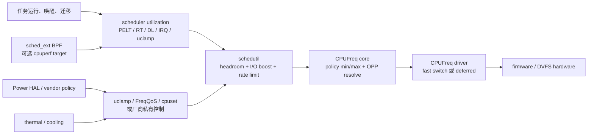

# 5.32 Android 17 / 6.18 r6：sched_ext BPF 与 schedutil 的 CPU 性能目标

<!-- outline-start -->
## 要点

### 🔹 1. Android 17 CPU 调频现状

- 默认采用 schedutil governor（基于 PELT 信号，参见 5.28 节）
- DVFS Headroom API 已在 5.29 节覆盖（Android 17 GPU DVFS）
- Power HAL 与 schedutil 闭环已在 17.21 节覆盖（SoC 厂商层）

### 🔹 2. BPF 在 DVFS 路径的可能切入点

- `bpf_cpufreq_hook`：Linux 6.10 新增的 cpufreq BPF hook
- Android 17 GKI 是否启用此 hook：受 GKI 配置限制
- 与 SoC 厂商 cpufreq driver（如高通 `qcom-cpufreq-hw`、联发科 `mtk-cpufreq-hw`）的兼容性

### 🔹 3. schedutil 闭环与 Power HAL 的层级

```
应用层 (PowerManager / ADPF)
   ↓
Power HAL (libperfmgr / libpowerhal)
   ↓
schedutil governor (内核)
   ↓
cpufreq driver (SoC 厂商)
```

- BPF 可在 governor → driver 路径插入观测点
- `[待验证]` 厂商层是否会消费 BPF 数据：取决于厂商 HAL 实现，公开文档无统一描述

### 🔹 4. 与 ML 调度器、EEVDF 的协同

- 与 1.59 节 ML 调度器：ML 调度器影响进程优先级 → EEVDF 影响 CPU 时间 → schedutil 影响 CPU 频率
- 与 5.31 节 EEVDF：BPF 可观测 EEVDF 决策，但**不修改**调度器本身
- `[待验证]` "BPF 深度集成"对频率决策的实际影响：理论上仅观测，不参与决策

### 🔹 5. AIW 基准版本边界声明

- AIW 主线为 `android-17.0.0_r1`，**必须**锚定此版本
- Linux 6.10 视角仅作历史演进参考与延伸阅读
- `[待验证]` Android 17 GKI 是否升级到 6.10 主线：截至本文撰写时 GKI 仍以 6.6/6.12 为主流

## 扩展

### 🔸 扩展点 1：BPF for thermal（与 5.12 节呼应）

- thermal governor 与 BPF 的协同
- `[待补充]`

### 🔸 扩展点 2：BPF for GPU DVFS（与 5.29 节呼应）

- GPU DVFS headroom 路径上 BPF 探针
- `[待补充]`

### 🔸 扩展点 3：BPF 与 sched_ext（与 17.4 节呼应）

- sched_ext 在 6.18 中默认启用，BPF 是否能影响 sched_ext 调度决策
- `[待补充]`

<!-- outline-end -->

## 审阅说明：以 6.18 r6 纠正旧提纲

上面的 outline 是 Hermes/OpenClaw 使用的受保护区域，原样保留。它记录了最初的研究方向，但其中两项判断不能继续当作正文结论：

1. `android17-6.18-2026-06_r6` 中不存在名为 `bpf_cpufreq_hook` 的符号、tracepoint 或 BPF kfunc。
2. BPF 也不只用于观测。启用 sched_ext 后，BPF 调度器可以调用 `scx_bpf_cpuperf_set()` 设置相对 CPU 性能目标，schedutil 会消费这个目标。

标题中的 Linux 6.10 只能视为旧素材的历史线索。sched_ext 在上游主线 Linux 6.12 才合入；如果某篇 6.10 时期的材料讨论了同名能力，它描述的可能是合入前 patch set，不能直接代表 Linux 6.10 主线，更不能代表 Android 17 GKI。

本章正文统一采用以下锚点：

- Android 平台：Android 17 / API 37 / `android-17.0.0_r1`。
- Android common kernel：`android17-6.18-2026-06_r6`，提交 `bcbd6575c301ef871ea15e7ac0fc83909e17ef56`。
- 上游版本演进只用于解释来源，当前行为以 Android 17 的精确内核标签为准。

> **Draft-polish 2026-07-29**（run `20260729-233815-draft-polish-0f709bd6`）：补全 frontmatter（`last_verified`、`last_verified_against`、`confidence: high`、`sources`、`pipeline_stage`、`task6_state`、`task9_state`），状态从 `draft` 推进至 `ready-for-review`。正文未新增结论；受保护 outline 原样保留。源码锚点均指向 `android17-6.18-2026-06_r6` 精确标签。

> **Review-finalize 2026-07-30**（run `20260730-081538-6891b85b`）：深度复核通过，状态推进至 `finalized`。核对项：(1) schedutil 计算路径（`cpufreq_update_util` → `effective_cpu_util` → `sugov_effective_cpu_perf` + `map_util_perf` → `get_next_freq` → fast-switch/deferred）与 6.18 r6 一致；(2) `scx_bpf_cpuperf_cap/cur/set()` 三 kfunc、`SCX_CPUPERF_ONE == SCHED_CAPACITY_SCALE`、写入 `rq->scx.cpuperf_target` 后触发 `cpufreq_update_util()` 的调用链准确；(3) "不存在通用 `bpf_cpufreq_hook`" 的否定结论正确，且正文正确区分 tracepoint / `android_vh_map_util_freq` vendor hook / SCX kfunc 三类接口；(4) full/partial switch（`SCX_OPS_SWITCH_PARTIAL`、`scx_switched_all()`）描述准确；(5) schedutil DVFS headroom 与 Android SDK Headroom API 的区分清晰。受保护 outline 中的 `bpf_cpufreq_hook`、"BPF 仅观测"等错误已由正文"审阅说明"显式纠正，符合 AIW 受保护 outline 处理规范。未修改正文技术结论；仅推进 frontmatter 状态。已知非阻塞项：本章暂未出现在 `src/SUMMARY.md`（5.31→5.33 之间缺 5.32 条目），但本 lane 规则禁止编辑 SUMMARY，留待目录治理 lane 处理。

## Android 17 的 CPUFreq 基线

### GKI 编进 schedutil，不等于每台设备正在使用

Android 17 的 arm64 GKI defconfig 启用了 `CONFIG_CPU_FREQ=y`。`drivers/cpufreq/Kconfig` 对 ARM/ARM64 的默认 governor 选择是 `CPU_FREQ_DEFAULT_GOV_SCHEDUTIL`，该选项会进一步选择 `CPU_FREQ_GOV_SCHEDUTIL`。

这能证明 GKI 构建具备 schedutil，也能解释新策略启动时的默认选择。它不能证明所有 Android 17 产品在运行时都使用 schedutil：

- OEM 可以在启动脚本或电源策略中切换 governor。
- 某些 CPUFreq driver 可能采用硬件协调或有不同的 fast-switch 能力。
- 每个 policy 可以覆盖不同 CPU 集群，governor 和频率限制都按 policy 生效。
- thermal、FreqQoS 和固件仍可限制最终 OPP。

设备分析应先读取 `scaling_governor` 与 `scaling_driver`，再讨论 schedutil。仅凭 GKI defconfig 或 SoC 品牌下结论是不够的。

### schedutil 的实际计算路径

普通 fair-class 工作负载下，6.18 r6 的核心步骤是：

1. 调度器在 enqueue、dequeue、tick、wakeup 等时机更新 PELT 和其他 utilization 信号。
2. `cpufreq_update_util()` 调用当前 CPU 注册的 update-util hook。
3. schedutil 通过 `effective_cpu_util()` 合并 fair、RT、DL、IRQ、uclamp 等约束，并处理 I/O wait boost。
4. `sugov_effective_cpu_perf()` 用 `map_util_perf()` 加入 DVFS headroom。
5. `get_next_freq()` 把 utilization/capacity 映射到原始目标，再由 `cpufreq_driver_resolve_freq()` 对齐到 policy min/max 和驱动支持的频点。
6. 支持 fast switch 时直接调用驱动；否则经 irq work 和 `sugov` kthread 延后执行 `__cpufreq_driver_target()`。

下面的图用于区分“负载估计”“策略约束”和“硬件执行”，避免把 Power HAL 写成每次调频都经过的串行中转站。



图中有多条并行影响路径。Power HAL 往往通过 uclamp、FreqQoS、cpuset、调度属性或厂商接口改变约束；schedutil 仍由调度器 utilization 事件驱动。具体 Power HAL 实现可能选择其他旋钮，因此不能把“App → Power HAL → schedutil → driver”当作每次调频的函数调用栈。

### headroom 不是 Android Headroom API

`sugov_effective_cpu_perf()` 注释中的 “dvfs headroom” 指 schedutil 为利用率留出的频率余量。6.18 r6 的 `get_next_freq()` 注释仍用 `C = 1.25` 说明 80% utilization/capacity 附近的映射拐点。

它与 Android SDK 的 `SystemHealthManager.getCpuHeadroom()`、`getGpuHeadroom()` 没有调用关系：

- schedutil headroom 参与内核的目标频率计算。
- SDK Headroom API 返回一段窗口内可用计算余量的估计。
- 两者都使用 “headroom” 一词，但数据源、方向和消费者不同。

## Android 6.18 r6 中的 BPF 调频入口

### 没有通用 `bpf_cpufreq_hook`

在精确内核标签中，对 `bpf_cpufreq`、`cpufreq_bpf`、`bpf_cpufreq_hook` 和 cpufreq struct_ops 的源码检索均无结果。`drivers/cpufreq/cpufreq.c` 也没有注册一个可让任意 BPF 程序替换 governor 的 cpufreq BPF hook。

容易混淆的接口有三类：

| 接口 | 能否改变决策 | 面向谁 |
|---|---|---|
| `power:cpu_frequency`、`power:cpu_frequency_limits` tracepoint | 否，只记录 CPUFreq 事件 | ftrace、Perfetto、获准的 BPF tracing 程序 |
| `android_vh_map_util_freq` vendor hook | 可以让注册者提供 `next_freq` | Android vendor kernel module |
| `scx_bpf_cpuperf_set()` | 可以设置 sched_ext 的相对性能目标 | 获准的 sched_ext、tracing 或 syscall 类型 BPF 程序；SCX 需处于活动状态 |

`android_vh_map_util_freq` 虽然以 trace hook 机制声明并导出，但它带有可写的 `next_freq` 和 `need_freq_update` 指针，是 Android Vendor Hook，不是名为 `bpf_cpufreq_hook` 的 BPF API。厂商模块可以注册该 hook 修改 util→freq 映射；是否有模块注册，必须检查产品 vendor module 和运行时。

### sched_ext 的三个 cpuperf kfunc

6.18 r6 的 `kernel/sched/ext.c` 提供：

- `scx_bpf_cpuperf_cap(cpu)`：查询该 CPU 相对系统最强 CPU 的容量。
- `scx_bpf_cpuperf_cur(cpu)`：查询该 CPU 当前相对性能。
- `scx_bpf_cpuperf_set(cpu, perf)`：设置 `[0, SCX_CPUPERF_ONE]` 范围内的相对性能目标。

`SCX_CPUPERF_ONE` 等于 `SCHED_CAPACITY_SCALE`。`scx_bpf_cpuperf_set()` 会把目标写入 `rq->scx.cpuperf_target`，随后调用 `cpufreq_update_util()`。schedutil 的 `sugov_get_util()` 从 `scx_cpuperf_target()` 读出该值，再与 RT、DL、IRQ、uclamp 和 I/O boost 等约束合并。

调用关系可以概括为：

`sched_ext BPF → scx_bpf_cpuperf_set() → rq->scx.cpuperf_target → cpufreq_update_util() → schedutil → CPUFreq driver`

这是一条能影响频率选择的路径，但它仍有明确边界：

- BPF 设置的是相对性能目标，不是 kHz，也不是某个硬件 OPP 索引。
- policy min/max、thermal cap、FreqQoS 和驱动频率表仍会限制结果。
- CPU policy 可能包含多个 CPU，最终频点与硬件域划分有关。
- fast switch、固件延迟和硬件自治会影响目标生效时间。
- 这些 kfunc 属于 sched_ext 接口。6.18 r6 把该组注册给 `STRUCT_OPS`、`TRACING` 和 `SYSCALL` BPF program type；程序仍须通过 verifier 与 Android 安全策略，并且 `scx_root` 不存在时 set 操作直接返回。

内核自带的 `tools/sched_ext/scx_qmap.bpf.c` 给出了可运行的示例：它按任务权重队列选择 0%、25%、50%、75%、100% 的相对目标，再调用 `scx_bpf_cpuperf_set()`。源码也特意说明这只是 cpuperf 功能演示，不是可直接用于产品的调频策略。

### full switch 与 partial switch

只有加载并启用 sched_ext BPF scheduler 后，cpuperf 目标才进入这条路径。`CONFIG_SCHED_CLASS_EXT=y` 只代表功能被编进内核。

sched_ext 有两种运行范围：

- **full switch**：没有设置 `SCX_OPS_SWITCH_PARTIAL` 时，普通 fair-class 任务也交给 sched_ext。此时 `scx_switched_all()` 为真，schedutil 不再叠加 CFS utilization boost，主要跟随 BPF cpuperf target，再合并其他调度类和系统约束。
- **partial switch**：设置 `SCX_OPS_SWITCH_PARTIAL` 后，只有显式采用 `SCHED_EXT` policy 的任务由 BPF 调度；普通任务仍由 fair/EEVDF 处理。schedutil 会同时考虑 SCX target 与 fair-class utilization。

这也修正了“ML 调度器 → EEVDF → schedutil”的固定描述。未启用 sched_ext 时，普通任务由 fair/EEVDF 路径管理；full-switch sched_ext 启用后，这批任务不再由 EEVDF 决定运行顺序。二者是哪种关系，取决于 sched_ext 是否加载及其 flags。

### 可用、已启用、产品采用是三件事

Android 17 GKI 的 `arch/arm64/configs/gki_defconfig` 启用了：

- `CONFIG_BPF_SYSCALL`
- `CONFIG_BPF_JIT`
- `CONFIG_BPF_JIT_ALWAYS_ON`
- `CONFIG_SCHED_CLASS_EXT`
- `CONFIG_DEBUG_INFO_BTF`

这些配置满足 sched_ext 的主要构建条件，但不表示开机已有 BPF scheduler：

- sched_ext 文档明确说明，加载 BPF scheduler 之前它不接管任务。
- 加载需要匹配的 BPF object、userspace loader、BTF/CO-RE 兼容性和 verifier 通过。
- Android 还会受 bpfloader、SELinux、能力检查和产品启动配置限制。
- sched_ext 的 ops、常量和 `scx_bpf_*` kfunc 没有稳定 ABI 保证，升级 kernel tag 后必须重新验证。

普通 Android App 不能因为 GKI 打开了 BPF 就加载调度器。产品化需要平台和内核团队共同维护，并为失败回退、watchdog、热问题与兼容性负责。

## 与 CPUFreq driver 的关系

`scx_bpf_cpuperf_set()` 最终仍走 schedutil 和 CPUFreq core，因此不会绕开具体 SoC driver。6.18 r6 中可以看到 `qcom-cpufreq-hw`、`mtk-cpufreq-hw`、SCMI CPUFreq 等驱动，它们对 fast switch、频率表、policy 范围和硬件写入方式有不同实现。

以 fast switch 为例：

- 支持时，schedutil 可以在 scheduler context 中调用 `cpufreq_driver_fast_switch()`。
- 不支持时，schedutil 先排 irq work，再由专用 kthread 调用 `__cpufreq_driver_target()`。
- 即使驱动声明 fast switch，固件或硬件完成电压/频率转换仍可能需要时间。

因此，BPF 调用到返回的成本、`cpu_frequency` tracepoint 的时间和物理时钟稳定的时间不能视为同一个时刻。性能实验应同时记录请求、CPUFreq 事件、调度行为和可获得的硬件 counter。

## Power HAL 与 BPF 的边界

Android 17 的标准 Power HAL AIDL 没有“加载 BPF DVFS 策略”或“向 `scx_bpf_cpuperf_set()` 写值”的接口。Power HAL 提供 mode、boost 和 session 类契约，设备实现再把它们映射到 uclamp、FreqQoS、cpuset、vendor sysfs、驱动接口或其他机制。

可能出现两种 OEM 扩展：

1. Power HAL 或厂商 daemon 读取 BPF map/trace 数据，再调整系统控制项。
2. OEM 直接部署 sched_ext BPF scheduler，让任务排队和 cpuperf target 来自同一个 BPF 策略。

第一种多了一段 userspace 采样与控制延迟；第二种处于 scheduler fast path，风险和验证成本更高。两者都不是 AOSP Power HAL 的默认行为。看到设备包含 BPF object、vendor hook module 或自定义 Power HAL，只能说明有候选组件，还要沿运行时调用和 attach 状态确认。

## Thermal 与 GPU：目前没有对称接口

在 `android17-6.18-2026-06_r6` 中，没有找到与 `scx_bpf_cpuperf_set()` 对称的通用 thermal BPF controller 或 GPU/devfreq BPF controller。

- thermal 子系统可以通过 cooling device、FreqQoS 或 driver/firmware 限制 CPU policy。
- BPF tracing 在权限允许时可以观察现有 thermal、scheduler、CPUFreq 事件。
- GPU DVFS 多数走 devfreq 或厂商驱动；可见 tracepoint 和 counter 随设备实现变化。
- Android SDK 的 GPU Headroom API 也不会把结果送进一个通用内核 BPF GPU 调频 hook。

因此，“BPF for thermal/GPU”适合作为实验方向，不能写成 Android 17 已提供的统一平台能力。若 OEM 自行实现，需要说明 hook 名称、加载主体、数据更新周期、控制输出和失效回退。

## 如何在设备上确认

下面这些命令用于先确认 governor、driver 与 sched_ext 状态。部分节点只在 userdebug/root 环境可读。

```bash
adb shell 'for p in /sys/devices/system/cpu/cpufreq/policy*; do
  echo "$p"
  cat "$p/scaling_driver" "$p/scaling_governor" \
      "$p/scaling_min_freq" "$p/scaling_max_freq" 2>/dev/null
done'

adb shell cat /sys/kernel/sched_ext/state
adb shell cat /sys/kernel/sched_ext/root/ops
adb shell cat /sys/kernel/sched_ext/enable_seq
```

第一组输出按 CPUFreq policy 展示驱动、governor 和当前上下限。sched_ext 的 `state` 为 `disabled` 时，不能把任何调频行为归因给 SCX BPF；`root/ops` 给出已加载 scheduler 名称，`enable_seq` 可以帮助判断本次启动中是否曾加载过。

进一步采集 Perfetto/ftrace 时，优先关注：

| 目标 | 事件或数据 | 注意点 |
|---|---|---|
| 任务何时 runnable/运行 | `sched_wakeup`、`sched_switch` | 用于解释 utilization 变化 |
| CPUFreq 报告的频率 | `power:cpu_frequency` | 是 CPUFreq core 报告值，不一定等于瞬时实测时钟 |
| policy 上下限变化 | `power:cpu_frequency_limits` | 可关联 thermal、FreqQoS、Power HAL 行为 |
| SCX 是否工作 | `/sys/kernel/sched_ext/*`、sched_ext trace/events | config=y 本身不够 |
| BPF cpuperf 目标 | OEM 自定义 trace 或 BPF map | AOSP 没有默认 Perfetto track |
| 热约束 | thermal 事件、thermal service 状态 | 先确认数据源和单位 |

如果要证明 BPF 改变了频率，至少要形成以下证据序列：

1. 确认目标 sched_ext BPF scheduler 已 attach。
2. 记录它写入的 cpuperf target。
3. 对齐 `cpufreq_update_util` 之后的 schedutil 决策或 CPUFreq tracepoint。
4. 同时记录 policy min/max，排除 thermal 或 Power HAL 限制。
5. 比较有无 BPF scheduler 的同场景 P50/P90 延迟、能量和热稳定结果。

只看到 `cpu_frequency` 变化，不能说明变化由 BPF 触发；只看到 BPF 程序已加载，也不能说明 driver 接受了目标频点。

## 工程风险

### 控制环振荡

BPF scheduler 如果根据短窗口队列长度频繁改变 cpuperf target，schedutil 自身又有 PELT、I/O boost、DVFS headroom 和 rate limit，外部还有 Power HAL 与 thermal cap。多个控制器时间常数不匹配时，容易出现目标频率来回摆动、能量增加或热限频提前。

产品策略至少需要：

- target 上升与下降采用不同阈值或保持时间。
- 限制单位时间内的变化幅度和次数。
- thermal severity 上升时优先服从 cap。
- SCX 退出或 verifier/runtime 错误时回到可预测的 fair+schedutil 行为。

### 目标尺度误读

`scx_bpf_cpuperf_set()` 的输入是相对性能尺度。异构 CPU 上，`cpuperf_cap()` 与 `cpuperf_cur()` 的含义不同：

- `cap` 表示该 CPU 相对系统最大 CPU 的能力。
- `cur` 表示该 CPU 相对自身最大性能的当前水平。
- 跨集群比较时需要把两者组合，不能把同一个 `perf` 值解释成相同 kHz 或相同性能。

### ABI 与升级

sched_ext 文档明确声明其 BPF API 没有稳定性保证。Android GKI 保证的内核模块接口与 sched_ext BPF kfunc 的演进不是同一个承诺。升级到新的 Android common kernel tag 时，应重新生成 `vmlinux.h`、重新编译、跑 verifier/功能测试，并复核 cpuperf 与 schedutil 的实现。

## 源码锚点

- [`kernel/sched/cpufreq_schedutil.c`](https://android.googlesource.com/kernel/common/+/refs/tags/android17-6.18-2026-06_r6/kernel/sched/cpufreq_schedutil.c)：schedutil utilization、SCX target、headroom、rate limit 与 fast/deferred 路径。
- [`kernel/sched/ext.c`](https://android.googlesource.com/kernel/common/+/refs/tags/android17-6.18-2026-06_r6/kernel/sched/ext.c)：`scx_bpf_cpuperf_cap/cur/set()` 及对 `cpufreq_update_util()` 的调用。
- [`tools/sched_ext/scx_qmap.bpf.c`](https://android.googlesource.com/kernel/common/+/refs/tags/android17-6.18-2026-06_r6/tools/sched_ext/scx_qmap.bpf.c)：cpuperf 示例及“仅用于演示”的源码说明。
- [`arch/arm64/configs/gki_defconfig`](https://android.googlesource.com/kernel/common/+/refs/tags/android17-6.18-2026-06_r6/arch/arm64/configs/gki_defconfig)：BPF、BTF、sched_ext 与 CPUFreq 构建配置。
- [`drivers/cpufreq/Kconfig`](https://android.googlesource.com/kernel/common/+/refs/tags/android17-6.18-2026-06_r6/drivers/cpufreq/Kconfig)：ARM64 默认 governor 与 schedutil 配置关系。
- [`include/trace/hooks/sched.h`](https://android.googlesource.com/kernel/common/+/refs/tags/android17-6.18-2026-06_r6/include/trace/hooks/sched.h)：Android `android_vh_map_util_freq` vendor hook 声明。
- [`include/trace/events/power.h`](https://android.googlesource.com/kernel/common/+/refs/tags/android17-6.18-2026-06_r6/include/trace/events/power.h)：`cpu_frequency` 与 `cpu_frequency_limits` tracepoint。
- [上游 Linux v6.12 的 `kernel/sched/ext.c`](https://github.com/torvalds/linux/blob/v6.12/kernel/sched/ext.c)：sched_ext 进入主线后的 cpuperf kfunc 实现；v6.10 同路径尚不存在。
- [Linux sched_ext 官方文档](https://docs.kernel.org/scheduler/sched-ext.html)：运行状态、full/partial switch、错误回退与 ABI 稳定性说明。

## 本章结论

Android 17 / 6.18 r6 没有通用的 `bpf_cpufreq_hook`。可验证的直接控制接口位于 sched_ext：BPF scheduler 通过 `scx_bpf_cpuperf_set()` 设置相对性能目标，schedutil 再结合其他 utilization 与约束选择 CPUFreq 目标。

这条路径比“BPF 只能观察 DVFS”更强，也比“BPF 直接写 CPU 频率”更受约束。是否生效取决于 sched_ext 是否加载、运行模式、schedutil governor、policy 限制、CPUFreq driver 和硬件实现。Power HAL、thermal 与 GPU DVFS 仍是另外的控制面，Android 17 没有把它们统一成一个 BPF DVFS API。

[适用版本：Android 17 / API 37；内核验证锚点：`android17-6.18-2026-06_r6`]
