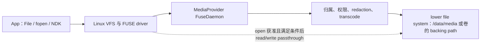

# vold、MediaProvider 与 FUSE：共享存储 I/O 路径

共享存储把挂载与权限控制面、文件数据面以及 MediaProvider 元数据管理叠在一起。定位 I/O 问题时，应先识别请求实际走的是直接文件、FUSE 还是 `ContentResolver` 路径，再分析跨进程与逐项访问成本。

## 排障范围

`/storage/emulated/0/DCIM/Camera/a.jpg` 看起来是一条普通路径，背后却包含挂载会话、调用方身份、媒体归属、权限、元数据脱敏、兼容转码和底层文件系统访问。只用“FUSE 慢”或“UFS 慢”概括所有耗时，很难得到可复现的结论。FUSE（Filesystem in Userspace）是用户空间文件系统机制；UFS（Universal Flash Storage）是 Android 设备常用的闪存接口标准，两者位于不同层。

本文回答三个排障问题：

1. `vold`（volume daemon，卷管理守护进程）、MediaProvider 和 FUSE 各自在什么时候参与。
2. 直接路径、MediaStore URI、SAF（Storage Access Framework，存储访问框架）URI 和 App 私有路径的成本为何不同。
3. Android 17 设备上怎样确认 passthrough、FUSE BPF、文件系统与块 I/O 的实际状态。

当前源码锚点为 Android 17 / API 37 / `android-17.0.0_r1`，内核锚点为 `android17-6.18-2026-06_r6`。

## 先分清控制面与数据面

这里的控制面负责建立挂载、配置策略和判断权限；数据面负责实际传输文件内容。区分两者，才能判断一次慢读取是在会话准备、访问检查，还是数据搬运阶段发生。

### `vold` 管卷和挂载会话

`vold` 负责发现存储卷、准备挂载点、处理用户切换、挂载/卸载卷和响应设备插拔。它不在每个 `open()`、`read()`、`write()` 请求中判断媒体权限。

下面的 Android 17 源码片段用于定位 `vold` 把 FUSE 会话交给上层的位置：

```cpp
res = MountUserFuse(user_id, getInternalPath(), label, &fd);
if (res != 0) {
    return res;
}

mFuseMounted = true;
auto callback = getMountCallback();
if (callback) {
    callback->onVolumeChecking(
            std::move(fd), getPath(), getInternalPath(), &is_ready);
}
```

代码位于 `system/vold/model/EmulatedVolume.cpp` 的 `EmulatedVolume::doMount()`。`MountUserFuse()` 建立挂载并返回 FUSE 设备 fd（file descriptor，文件描述符），随后 mount callback（挂载回调）接管会话准备。普通文件打开变慢时，除非同时发生卷状态变化、用户切换或挂载错误，否则不应先追查 `vold` 的 CPU 使用情况。

Android 17 的同一文件还会为 FUSE 配置 read-ahead（预读）和 dirty ratio（脏页比例），并按 `IsFuseBpfEnabled()` 选择 bind mount（绑定挂载）或 FUSE BPF 相关路径。BPF 是允许内核运行受限程序的机制，这里用于处理部分 FUSE 操作。这些都属于产品与会话配置，不能仅凭 Android 版本号推断具体开关。

### MediaProvider 模块启动 FUSE 守护进程

MediaProvider 中的 `ExternalStorageServiceImpl.onStartSession()` 接收 session id（会话标识）、FUSE 设备 fd、上层路径和底层路径，创建 `FuseDaemon` 并调用 `start()`。`FuseDaemon.run()` 最终进入阻塞式的 `native_start()`，持续读取内核提交的 FUSE 请求。

MediaProvider 同时负责两种角色：

- 作为 ContentProvider（跨进程数据提供组件），维护媒体索引并处理 MediaStore 的查询、插入、更新、删除和打开 URI。
- 作为共享存储 FUSE handler（请求处理器），根据 UID（Linux 用户标识）、包归属、权限、脱敏与转码状态处理文件系统请求。

这两种入口最终可能访问同一份底层文件，但 Binder（Android 进程间通信机制）查询、Provider 打开文件和直接路径进入 FUSE 的前半段不同。`content://` URI 是通过 ContentProvider 标识数据的地址，不能简化成“换一种字符串表示的 `/storage` 路径”。

## 两类常见 I/O 路径

### 直接文件路径

下面的图用于展示没有命中 BPF 或 passthrough（数据直通）时的关键节点，以及文件打开后可能缩短的数据路径：



图中的 VFS 是 Linux 虚拟文件系统抽象层，FUSE driver 是对应的内核驱动。redaction 指敏感元数据脱敏，transcode 指兼容格式转码；lower file system 是实际保存数据的底层文件系统，backing path 是它对应的真实路径。

目录 lookup（名称查找）、`getattr()`（读取属性）、`readdir()`（枚举目录项）、打开文件和数据读写属于不同请求。passthrough 只会在文件打开获准且条件满足后缩短该文件后续的数据传输；路径可见性、打开权限，以及是否需要脱敏或转码，仍由 MediaProvider 决定。

### MediaStore 与其他 Provider URI

MediaStore 查询先通过 Binder 进入 MediaProvider 数据库。打开某个媒体 URI 时，Provider 可以根据访问模式、缓存一致性、脱敏和转码要求返回合适的 fd。Android 17 的 `FuseDaemon.shouldOpenWithFuse()` 也表明，Provider 打开的 fd 是否还要回到 FUSE 路径，要根据文件和锁状态决定。

官方文档还建议，大批量操作使用 ContentProvider 的批处理能力，减少逐个路径进入 FUSE 的元数据操作。这里的“非 FUSE 优化路径”是指优化访问入口和批处理方式，媒体内容仍然位于底层文件系统和块设备上。

SAF URI 经过 `DocumentsProvider`，提供者可能是本地文件系统、USB 盘或云端服务。它不保证低延迟，也不保证能够转换成普通路径。App 应按 `ContentResolver` 接口约定使用流或 fd，并处理 Provider 进程被终止、授权撤销和远端读取失败。

App 内部目录 `/data/user/<userId>/<package>/` 不属于共享存储 FUSE 挂载。App-specific external（App 专属外部存储）目录位于外部存储命名空间，但 AOSP 对 `Android/data` 与 `Android/obb` 使用专门的绕过或加速路径。Android 17 中，该实现还会随 FUSE BPF 和 bind mount 配置变化，因此两类目录的安全与性能模型并不完全相同。

## FUSE 的成本出现在哪些操作

Android 11 的 FUSE 调优包含 read-ahead、writeback cache（回写缓存）、权限缓存、App 专属目录绕过和 all-files（所有文件访问）批量操作优化。官方曾在调优后的 Pixel 2 上比较直接路径与 MediaStore：顺序读取接近，FUSE 顺序写略差，随机读写在该测试中最高可慢约两倍。这个结果只能说明随机小 I/O 更容易暴露用户态转发成本，不能外推为 Android 17 或任意设备的固定倍率。

| 访问模式 | 可能放大的环节 | 优先检查 |
| --- | --- | --- |
| 单个大文件顺序读 | 首次打开、缓存未命中、底层 read-ahead | 分别测量打开耗时和持续吞吐；确认是否 passthrough |
| 小块随机读写 | 多次 FUSE 请求、页缓存、文件系统与闪存尾延迟 | 请求大小、随机偏移、FUSE/块事件重合情况 |
| 大目录枚举 | `readdir`、lookup、属性读取、权限与索引一致性 | 文件数、目录层级、是否可以改用 MediaStore 查询 |
| 批量创建/删除/改名 | 元数据更新、逐项权限检查、MediaProvider 数据库更新 | 单项耗时分布、事务/批处理边界、失败重试 |
| 脱敏或兼容转码 | 不能进入普通 passthrough，可能产生额外 CPU 与临时数据 | `ACCESS_MEDIA_LOCATION`、转码状态、FuseDaemon 日志 |
| SAF/云端 URI | Provider Binder 调用、网络、缓存与远端限流 | 分开观察 Provider 身份、Binder 等待、网络和本地 I/O |

文件很大时，底层 I/O 耗时可能超过 FUSE overhead（额外开销）；文件数量很多时，元数据和策略判断可能比数据传输更耗时。性能实验应同时记录文件数量、大小分布、操作类型、缓存冷热和授权状态。

## passthrough 与 FUSE BPF 的边界

先区分三种经常被混写成“直通”的能力：

| 路径 | FUSE 页缓存 | `read`/`write` 是否到 daemon | lower filesystem 怎样参与 |
|---|---|---|---|
| 普通缓存 FUSE | 使用 | 缓存未命中、回写等情况需要 | daemon 再访问 lower fs（底层文件系统） |
| `FOPEN_DIRECT_IO` | 对该 open 绕过 | 仍然需要 | daemon 处理 FUSE 请求；direct I/O（直接 I/O）不同于 lower-fs 直通 |
| FUSE passthrough | 数据路径不使用 FUSE 页缓存 | `open` 需要；获准后的数据 I/O 通常不需要 | 内核通过本次 open 绑定的 backing file（底层文件对象）转发 |
| FUSE BPF + backing | 取决于操作 | BPF/backing 已处理的操作可以不交给 daemon | inode/dentry（索引节点/目录项）关联 backing path，BPF 决定保留、移除或替换 |

`direct_io` 只改变 FUSE 页缓存语义。没有 passthrough 或 BPF backing 时，请求仍经 `/dev/fuse` 到 MediaProvider。passthrough 也不会绕过 Scoped Storage（分区存储）：归属、权限、redaction（元数据脱敏）和转码都在 `open` 阶段判断。

### passthrough 是逐文件打开决策

Android 12 支持 FUSE passthrough。由 Android 11 升级到 Android 12 的设备受冻结内核限制，无法仅通过系统升级获得该能力；以 Android 12 出厂且使用官方支持内核的设备才具备当时的启用条件。

Android 17 MediaProvider 仍会先检查内核能力：

```cpp
const char* filename = "/sys/fs/fuse/features/fuse_passthrough";
if (contents == "supported\n") {
    return true;
}
```

仅看到 sysfs（内核导出的运行时属性接口）返回 `supported` 还不够，它只表示内核具备 upstream（Linux 上游）passthrough 能力。产品属性、FUSE 协商结果和单次文件打开条件也必须满足。

下面两行用于说明文件级决策：

```cpp
bool passthrough = !redaction_needed && transforms_complete;
bool direct_io = open_info_direct_io && !passthrough;
```

文件需要位置元数据脱敏，或者转码尚未完成时，MediaProvider 不能让后续读取绕过 daemon。passthrough 主要减少已获准文件在 `read`/`write` 数据搬运阶段的开销，对目录枚举、MediaStore 查询和首次 `open` 没有同等作用。

Android 17 的源码同时兼容 Android 早期 passthrough 接口与 upstream FUSE passthrough。上游协议按以下顺序建立：daemon 打开 lower-fs 文件，向 FUSE connection（连接会话）注册并取得 `backing_id`，再在 open 回复中携带 `FOPEN_PASSTHROUGH` 与该 ID。内核随后为这次 FUSE open 创建独立的 backing file，文件关闭后绑定关系结束。

内核的 `backing_file_read_iter()` / `backing_file_write_iter()` 省去的是 FUSE 数据请求往返；VFS、lower filesystem、fscrypt（Linux 文件系统加密层）、页缓存、块层和闪存仍在路径中。passthrough 写还会获取 inode lock（文件对象锁），并更新 FUSE inode 属性及缓存状态。多个 writer（写入方）访问同一 inode 时，passthrough 仍然需要并发协调。

`FOPEN_PASSTHROUGH` 与 `FOPEN_DIRECT_IO` 可以同时出现。在该组合下，Android 17 内核允许 read/write 继续发给 FUSE server（服务端），而 mmap（内存映射）使用 backing file。看到 passthrough 标志时，仍需结合整组 open flags（打开标志）判断各操作去向。

### `iomode` 保护缓存与 backing 一致性

`iomode` 记录一次 FUSE 文件打开所采用的 I/O 模式。Android 17 的 `fuse_file` 区分 cached（缓存）、uncached（非缓存）与 passthrough 模式。cached I/O 不能和破坏缓存一致性的 direct write（直接写）任意并发；同一 FUSE inode 也不能同时绑定互相冲突的 backing file。Android common kernel 为 MediaProvider 的 mixed-mode（混合模式）用例放宽了一条上游 `-ETXTBSY` 拒绝分支，但仍保留 backing file 冲突检查、direct-write 锁和 passthrough write 的 inode lock。

这类 Android 补丁解决的是合法组合的兼容性，不意味着任意多个进程和缓存模式都能无额外成本地并发访问同一文件。

### FUSE BPF 当前主要服务 App 专属目录

`android17-6.18-2026-06_r6` 的 GKI（Generic Kernel Image，通用内核镜像）配置包含 `CONFIG_FUSE_FS=y` 与 `CONFIG_FUSE_BPF=y`。Android 17 MediaProvider 源码注明，FUSE BPF 当前限制在 `Android/data` 与 `Android/obb`，通过 backing fd 把符合规则的请求交给底层文件系统。

这仍然是条件性能力：

- 内核编译开关存在，不等于产品运行时已经启用。
- 当前 MediaProvider 源码的路径范围不应扩写到整个共享媒体目录。
- 路径归属和 Zygote（Android 应用进程孵化器）的 App data isolation（应用数据隔离）仍参与访问控制。
- `FuseDaemon.cpp` 在 lookup 返回中使用 `FUSE_ACTION_KEEP`、`FUSE_ACTION_REMOVE` 或 `FUSE_ACTION_REPLACE` 安装、移除或替换 BPF/backing 关系。

`vold` 提供了另一半边界：`IsFuseBpfEnabled()` 为 false 时，它把 lower fs 的 `Android/data` 和 `Android/obb` bind mount 到用户可见的目录树；启用 BPF 时跳过这组 bind mount，由 FUSE BPF/backing 路径负责相应操作。这套机制主要服务受保护的 App 专属目录，并非 `DCIM`、`Pictures` 或 `Download` 的通用加速开关。

## Scoped Storage 下的 App 场景

### 相册与媒体列表

相册列表优先查询 MediaStore，projection（查询返回列）只保留界面和分页所需字段，例如 `_ID`、`DATE_TAKEN`、`MIME_TYPE`、`WIDTH`、`HEIGHT`。用户打开详情、编辑或上传时，再通过 URI 打开具体文件。

不要为了得到“文件路径”而先查询整个媒体库，再对每个项目执行 `stat()`。这会同时引入数据库查询、FUSE 元数据请求和缩略图解码。确有 native（本地代码）库只接受 fd 时，可以用 `ParcelFileDescriptor.detachFd()` 明确移交 fd 所有权；库只接受路径时，再评估复制到私有工作目录的成本。

### 图片编辑、视频处理与断点续传

随机改写、临时分片和中间产物适合放在内部私有目录。处理完成后，把成品作为一次受控写入提交到 MediaStore。这样可以把高频随机 I/O 留在不经过共享存储策略的路径，并避免半成品被其他 App 扫描。

Android 10 及更高版本写入媒体时可以使用 `IS_PENDING`：创建条目后保持待发布状态，写完并完成必要的同步处理后再发布。崩溃恢复还要记录未完成的 URI，不能只依赖进程内状态。

### 文档与 Downloads

用户选择的 PDF、压缩包等文档使用 SAF。App 自己生成并希望用户长期保留的下载文件，可按官方 API 写入 Downloads。不要递归扫描整个下载目录寻找某一个用户文件；持久化 URI 权限后直接访问目标。

Provider 可能返回不支持 seek（随机定位）的管道 fd。调用前应检查业务是否需要随机访问；需要时复制到受控的临时文件，并在操作结束后清理。

### 日志导出、备份与聊天媒体迁移

日志在内部目录滚动写，用户触发导出时再复制或分享。备份和聊天媒体迁移应维护待处理清单，以增量方式扫描与重试，避免每次失败后重新遍历整个共享存储。

批量删除、回收、收藏或写入其他 App 创建的媒体时，应使用平台提供的用户确认与批量请求 API。每批数量要结合目标设备、Binder payload（单次通信携带的数据）、取消粒度和失败恢复测试决定，不使用脱离实际负载的固定数字。

## 诊断：先证明慢在哪一层

### 记录最小环境信息

下面的命令用于确认平台、内核、实际挂载和 FUSE 能力，不会修改设备状态：

```bash
adb shell getprop ro.build.version.release
adb shell getprop ro.build.version.sdk
adb shell getprop ro.build.fingerprint
adb shell uname -r
adb shell 'cat /proc/mounts | grep -E "fuse|sdcardfs|emulated|media_rw|ext4|f2fs"'
adb shell 'cat /sys/fs/fuse/features/fuse_passthrough 2>/dev/null'
adb shell 'dumpsys -l | grep -i media'
```

`/proc/mounts` 展示的是实际挂载，不能用机型宣传页代替。passthrough sysfs 文件缺失或无输出，只表示无法从该入口确认能力，不能单独证明功能已经关闭。`dumpsys -l` 的服务名会随系统构建变化；应先列出服务，再选择具体的 `dumpsys` 命令，不要预设一定存在 `dumpsys media_provider`。

### Perfetto 观察点

一轮有用的 Trace（性能跟踪）至少要覆盖：

1. App 主线程、工作线程与 Binder 调用。
2. MediaProvider 进程、Binder 线程和 FUSE session（会话）线程。
3. `sched_switch`、`sched_wakeup`，区分 CPU 竞争与睡眠等待。
4. `block/block_rq_issue`、`block/block_rq_complete`，以及目标设备支持的 ext4/F2FS/writeback 事件。
5. App 自定义 async slice（异步跟踪区间）：分别为查询、打开、首字节、完整读写和发布媒体计时。

主线程处于 `D`（不可中断睡眠）状态，说明它正在等待内核资源，但不能据此直接判定问题来自 FUSE。Binder、块 I/O、文件系统锁和驱动等待都可能出现相似表现，需要结合调用栈、目标线程活动和块事件判断。

对于目录扫描，建议记录：

- 文件/目录项数量与深度。
- `getdents64`（读取目录项）、`statx`/`newfstatat`（读取文件属性）、`openat`（打开文件）次数。
- MediaStore 查询返回行数和 projection。
- 首次扫描与热缓存扫描分别耗时。

### 先枚举 FUSE 跟踪点，再判断数据路径

`android17-6.18-2026-06_r6` 的 `fs/fuse/fuse_trace.h` 定义了 `fuse_request_send` 与 `fuse_request_end` 两个 tracepoint（内核跟踪点）。产品内核可能裁剪事件，采集前应先读取 tracefs（内核跟踪文件系统）的 `available_events`：

```bash
adb shell su 0 sh -c '
TRACE=/sys/kernel/tracing
[ -d "$TRACE/events" ] || TRACE=/sys/kernel/debug/tracing
grep "^fuse:" "$TRACE/available_events"
'
```

受控 I/O 窗口中出现 `FUSE_READ` 或 `FUSE_WRITE` send（发送）事件，说明相应请求进入 daemon。只有 `FUSE_OPEN` 而没有 read/write，可能符合 passthrough/BPF backing，也可能是页缓存命中、测试未产生预期 syscall（系统调用）、读取失败或采集窗口不完整。还要按时间对齐文件来源、冷暖缓存、MediaProvider 日志、应用 syscall，以及底层文件系统和块层事件。

### `strace` 只在可调试测试环境使用

下面的示例用于在 userdebug（可调试系统版本）或已取得 root 权限的实验机上，通过 `strace` 观察目标进程的文件系统调用，不应直接用于生产设备：

```bash
adb shell su 0 strace -f -ttT \
  -e trace=openat,read,write,getdents64,newfstatat,fsync \
  -p <pid>
```

`strace` 会扰动时序，设备系统也可能没有该工具。它适合回答“是否出现大量小块读取、属性查询或目录枚举”，不适合直接生成性能基线。发布结论前，仍应使用无附加工具或低扰动的 Perfetto/应用埋点复测。

### `vold` 何时才是优先调查对象

出现以下信号时再把重点移到 `vold`：

- 卷长时间停在 checking/mounting（检查/挂载）状态。
- 用户切换或工作资料切换后路径不可用。
- USB/SD 卡插拔后 mount namespace（挂载命名空间）不一致。
- logcat 日志出现 `MountUserFuse`、session start/end、unmount（卸载）或 bind mount 失败。
- 大量请求返回 `ENOTCONN`、`EIO`，并与卷状态变化重合。

单个已挂载媒体文件的稳定慢读，通常先看 App 访问模式、MediaProvider/FUSE、文件系统与块设备。

## FBE、16 KB 页与底层文件系统

FBE（File-Based Encryption，文件级加密）位于 `/data` 文件系统的数据与文件名加密路径，FUSE 位于共享存储的命名空间和策略层。同一次访问可能叠加两者成本。`android17-6.18-2026-06_r6` 的 GKI 配置包含 `CONFIG_FS_ENCRYPTION=y` 与 inline encryption（内联加密）支持，但产品是否使用这项能力、采用哪种密钥策略及是否有硬件加速，仍由设备实现决定。

区分两层成本时，可以设计对照实验：在同一设备上，以相同文件大小和访问模式比较内部私有文件、App-specific external 与共享媒体，并控制缓存冷热和加密策略。不同目录的文件系统、配额和挂载选项可能不同，实验结果只能解释已经记录的设备配置。

Android 17 `FuseDaemon.cpp` 使用下面的上限计算：

```cpp
#define FUSE_MAX_MAX_PAGES 256
const size_t MAX_READ_SIZE = FUSE_MAX_MAX_PAGES * getpagesize();
```

页大小会改变 FUSE 连接协商的最大读取上限，但单次请求仍受 App buffer（缓冲区）、read-ahead、内核限制和文件状态影响。16 KB 页不会自动让共享存储吞吐提高四倍，也不能仅凭 `MAX_READ_SIZE` 推导尾延迟有所改善。需要在 4 KB 与 16 KB 设备上使用相同 workload（工作负载）实测。

## Android 10—17 边界速查

| 版本 | 相关变化 | 排障边界 |
| --- | --- | --- |
| Android 10 | 引入 Scoped Storage；MediaProvider 路径执行新的访问规则 | 可以使用 legacy（旧版兼容）模式过渡；直接路径能力与 Android 11 不同 |
| Android 11 | MediaProvider 成为共享存储 FUSE handler；新发布的 5.4 及更高版本内核设备不能使用 SDCardFS（旧共享存储文件系统） | 升级设备可能保留 SDCardFS 下层，必须查看实际挂载 |
| Android 12 | 符合出厂与内核条件的设备可支持 FUSE passthrough | 系统版本不能证明运行时已启用 |
| Android 13 | 细粒度媒体权限；MediaProvider 仍可通过 Mainline（系统模块独立更新机制）更新 | 分别记录权限变化与 I/O 路径 |
| Android 14 | Selected Photos Access（精选照片访问权限） | 用户可见集合可能动态变化，不应在后台遍历未授权媒体 |
| Android 15—16 | Photo Picker（系统照片选择器）与局部媒体访问继续演进；支持 16 KB 页设备 | 复现条件应包含页大小、模块版本和授权状态 |
| Android 17 | 当前平台仍沿用 MediaProvider FUSE；源码包含 passthrough、FUSE BPF、脱敏和转码分支 | 以 `android-17.0.0_r1`、内核配置、MediaProvider 模块与实机状态共同判断 |

MediaProvider 是 Mainline 模块，同一个 Android 大版本也可能因模块更新而出现修复或行为差异。性能报告除了 build fingerprint（系统构建指纹），还应保存模块版本。

## 常见误区

### “访问 `/storage/emulated/0` 慢，说明 `vold` 在处理每次 I/O”

`vold` 负责挂载生命周期。挂载稳定后，文件请求主要经过 VFS/FUSE、MediaProvider 和底层文件系统。

### “sysfs 显示 passthrough supported，所有文件都会直通”

内核支持只是前提。文件仍需通过打开检查；脱敏、转码和 fd 来源等条件，都可能阻止单次请求进入 passthrough。

### “使用 MediaStore 就没有磁盘 I/O”

MediaStore 提供索引、授权和优化后的打开路径。读取媒体内容仍会访问文件系统与存储设备，Provider 查询本身也有数据库与 Binder 成本。

### “SAF URI 一定对应本地路径”

SAF 可以连接本地或远端 Provider。URI 可能只支持流式读取，甚至依赖网络。

### “16 KB page size（页大小）会直接解决随机 I/O”

页大小会改变内存管理与 FUSE 协商的粒度，但无法消除用户态策略判断、文件系统元数据操作或闪存尾延迟。

## 小结

共享存储排障的第一步是确认访问模型：

- `vold` 负责卷与 FUSE 会话的创建和销毁。
- MediaProvider 既是媒体 ContentProvider，也是共享存储 FUSE handler。
- 直接路径、MediaStore、SAF 和私有目录拥有不同的前半段成本。
- passthrough 只缩短满足条件文件的后续数据请求；FUSE BPF 在当前 Android 17 源码中主要服务 `Android/data`、`Android/obb`。
- FBE、文件系统、块调度和 UFS 仍在 FUSE 下层，策略层与设备层可能同时变慢。

App 侧应让数据归属与 API 匹配：媒体列表使用 MediaStore，文档使用 SAF，高频临时 I/O 放在私有目录，成品完成后再发布。系统侧则通过实际挂载、FuseDaemon、Binder、文件系统和块事件逐层取证，避免只凭 Android 版本或一条总耗时下结论。

## 参考资料

- [Scoped storage](https://source.android.com/docs/core/storage/scoped)
- [FUSE passthrough](https://source.android.com/docs/core/storage/fuse-passthrough)
- [SDCardFS deprecation](https://source.android.com/docs/core/storage/sdcardfs-deprecate)
- [Access media files from shared storage](https://developer.android.com/training/data-storage/shared/media)
- AOSP `system/vold/model/EmulatedVolume.cpp`（`android-17.0.0_r1`）
- AOSP `packages/providers/MediaProvider/src/com/android/providers/media/fuse/ExternalStorageServiceImpl.java`（`android-17.0.0_r1`）
- AOSP `packages/providers/MediaProvider/src/com/android/providers/media/fuse/FuseDaemon.java`（`android-17.0.0_r1`）
- AOSP `packages/providers/MediaProvider/jni/FuseDaemon.cpp`（`android-17.0.0_r1`）
- Android common kernel `arch/arm64/configs/gki_defconfig`（`android17-6.18-2026-06_r6`）
- Android common kernel `fs/fuse/backing.c`、`passthrough.c`、`iomode.c`、`fuse_bpf_backing.c`（`android17-6.18-2026-06_r6`）
- Android common kernel `include/uapi/linux/fuse.h`、`include/uapi/linux/android_fuse.h`（`android17-6.18-2026-06_r6`）
- §6.1「Android 存储架构」
- §6.2「文件系统」
- §6.2「I/O 调度与性能」
- §6.3「SharedPreferences 与 DataStore」
- §24.9「MediaStore 与 MediaProvider 性能治理」
- §24.9「Photo Picker、媒体转码与缓存治理」
