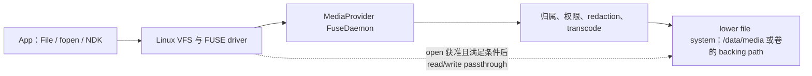

# vold、MediaProvider 与 FUSE：共享存储 I/O 路径

共享存储把三件事叠在一起：挂载与权限的控制面、文件数据面、MediaProvider 的元数据管理。我们定位 I/O 问题时，第一步是确认这次请求实际走的是直接文件、FUSE 还是 `ContentResolver` 路径，之后再分别算跨进程调用和逐项访问的开销。

> 源码基线：Android 17 / API 37，AOSP `android-17.0.0_r1`；内核 `android17-6.18-2026-06_r6`。设备可能使用其他内核分支，以实机配置为准。

## 排障范围

看到 `/storage/emulated/0/DCIM/Camera/a.jpg` 这样一条普通路径时，我们要意识到它背后叠着一整串环节：挂载会话、调用方身份、媒体归属、权限、元数据脱敏、兼容转码，最后才轮到底层文件系统访问。把所有耗时归结成一句“FUSE 慢”或“UFS 慢”，结论很难复现。FUSE（Filesystem in Userspace，用户空间文件系统）是用户态的文件系统机制。UFS（Universal Flash Storage，通用闪存存储）是 Android 设备常用的闪存接口标准，两者位于不同的层。

这篇文章回答三个排障问题：

1. `vold`（volume daemon，卷管理守护进程）、MediaProvider 和 FUSE 各自在什么时候参与。
2. 直接路径、MediaStore URI、SAF（Storage Access Framework，存储访问框架）URI 和 App 私有路径的成本为何不同。
3. 在实机上怎样确认 passthrough、FUSE BPF、文件系统与块 I/O 的实际状态。

## 先分清控制面与数据面

这里的控制面负责建立挂载、配置策略、判断权限；数据面负责实际搬运文件内容。分开看，我们才能判断一次慢读取慢在会话准备、访问检查，还是数据搬运。

### `vold` 管卷和挂载会话

`vold` 负责发现存储卷、准备挂载点、处理用户切换、挂载/卸载卷和响应设备插拔。它不在每个 `open()`、`read()`、`write()` 请求中判断媒体权限。

我们用下面这段源码定位 `vold` 把 FUSE 会话交给上层的位置：

```cpp
res = MountUserFuse(user_id, getInternalPath(), label, &fd);
if (res != 0) {
    return res;
}

mFuseMounted = true;
auto callback = getMountCallback();
if (callback) {
    callback->onVolumeChecking(
            std::move(fd), getPath(), getInternalPath(), &is_ready);
}
```

代码位于 `system/vold/model/EmulatedVolume.cpp` 的 `EmulatedVolume::doMount()`：`MountUserFuse()` 建立挂载并返回 FUSE 设备 fd，随后由 mount callback（挂载回调）接管会话准备。所以排查普通文件打开变慢时，除非同时出现卷状态变化、用户切换或挂载错误，我们把 `vold` 的 CPU 使用放到后面再查。

同一份源码文件还会为 FUSE 会话配置 read-ahead、dirty ratio（脏页比例）这类参数，并按 `IsFuseBpfEnabled()` 决定走 bind mount（绑定挂载）还是 FUSE BPF 相关路径。BPF 允许内核运行受限程序，在这里处理部分 FUSE 操作。这些开关属于产品与会话配置，光看 Android 版本号定不下来，要以具体设备为准。

### MediaProvider 模块启动 FUSE 守护进程

会话的另一端在 MediaProvider 里：`ExternalStorageServiceImpl.onStartSession()` 接收 session id、FUSE 设备 fd、上层路径和底层路径，创建 `FuseDaemon` 并调用 `start()`；`FuseDaemon.run()` 最终进入阻塞式的 `native_start()`，持续读取内核提交的 FUSE 请求。

MediaProvider 同时扮演两种角色：

- 作为 ContentProvider，维护媒体索引，处理 MediaStore 的查询、插入、更新、删除和打开 URI；
- 作为共享存储的 FUSE handler，根据 UID、包归属、权限、脱敏与转码状态处理文件系统请求。

两种角色最后访问的可能是同一份底层文件，但前半段不同：ContentProvider 这一侧先经过 Binder 查询，再由 Provider 打开文件；FUSE handler 这一侧直接从文件系统请求进来。`content://` URI 标识的是 ContentProvider 里的数据地址，把它当成“换一种字符串写法的 `/storage` 路径”来排障，就会找错层。

## 两类常见 I/O 路径

### 直接文件路径

我们对照下图看一次直接文件访问：实线是没有命中 BPF 或 passthrough（数据直通）时请求要经过的节点，虚线是文件打开获准后可能缩短的那段数据路径。图中几个术语先说清楚：VFS 是 Linux 虚拟文件系统抽象层，FUSE driver 是对应的内核驱动；redaction 是敏感元数据脱敏，transcode 是兼容格式转码；lower file system 实际保存数据，backing path 是它对应的真实路径。


```mermaid
flowchart LR
    App["App：File / fopen / NDK"] --> VFS["Linux VFS 与 FUSE driver"]
    VFS --> Daemon["MediaProvider FuseDaemon"]
    Daemon --> Policy["归属、权限、redaction、transcode"]
    Policy --> Lower["lower file system：/data/media 或卷的 backing path"]
    VFS -. "open 获准且满足条件后<br/>read/write passthrough" .-> Lower
```

目录 lookup、`getattr()`、`readdir()`、打开文件和数据读写是不同类型的请求。passthrough 缩短的只是打开获准、条件满足之后该文件的数据传输；路径是否可见、能否打开、要不要脱敏或转码，仍由 MediaProvider 决定。

### MediaStore 与其他 Provider URI

MediaStore 查询先经 Binder 进入 MediaProvider 数据库。打开某个媒体 URI 时，Provider 可以根据访问模式、缓存一致性、脱敏和转码要求返回合适的 fd；`FuseDaemon.shouldOpenWithFuse()` 的存在也提醒我们，Provider 打开的 fd 是否还要回到 FUSE 路径，要看文件和锁状态。

官方文档因此建议大批量操作走 ContentProvider 的批处理，减少逐条路径进入 FUSE 的元数据操作。这类做法优化的是访问入口和批处理方式；媒体内容本身仍在底层文件系统和块设备上。

SAF URI 走 `DocumentsProvider`，提供者可能是本地文件系统、USB 盘或云端服务，低延迟和“可转换成普通路径”都不保证。App 按 `ContentResolver` 接口约定使用流或 fd，并处理好 Provider 进程被终止、授权撤销和远端读取失败这几种情况。

App 内部目录 `/data/user/<userId>/<package>/` 不走共享存储的 FUSE 挂载。App-specific external（App 专属外部存储）目录位于外部存储命名空间，但 AOSP 为 `Android/data` 与 `Android/obb` 准备了专门的绕过或加速路径，具体实现随 FUSE BPF 和 bind mount 配置变化。所以这两类目录的安全与性能模型并不完全相同，排障时要分别确认。

## FUSE 的成本出现在哪些操作

Android 11 的那次 FUSE 调优包括 read-ahead、writeback cache、权限缓存、App 专属目录绕过和 all-files（所有文件访问）批量操作优化。官方曾在调优后的 Pixel 2 上对比直接路径与 MediaStore：顺序读取接近，FUSE 顺序写略差，随机读写在该测试中最高慢了约两倍。这个数字说明的是随机小 I/O 更容易暴露用户态转发的成本；要把它外推成 Android 17 或任意设备的固定倍率，还需要在目标设备上重新测。

| 访问模式 | 可能放大的环节 | 优先检查 |
| --- | --- | --- |
| 单个大文件顺序读 | 首次打开、缓存未命中、底层 read-ahead | 分别测量打开耗时和持续吞吐；确认是否 passthrough |
| 小块随机读写 | 多次 FUSE 请求、页缓存、文件系统与闪存尾延迟 | 请求大小、随机偏移、FUSE/块事件重合情况 |
| 大目录枚举 | `readdir`、lookup、属性读取、权限与索引一致性 | 文件数、目录层级、是否可以改用 MediaStore 查询 |
| 批量创建/删除/改名 | 元数据更新、逐项权限检查、MediaProvider 数据库更新 | 单项耗时分布、事务/批处理边界、失败重试 |
| 脱敏或兼容转码 | 不能进入普通 passthrough，可能产生额外 CPU 与临时数据 | `ACCESS_MEDIA_LOCATION`、转码状态、FuseDaemon 日志 |
| SAF/云端 URI | Provider Binder 调用、网络、缓存与远端限流 | 分开观察 Provider 身份、Binder 等待、网络和本地 I/O |

所以成本要看比例：文件很大时，底层 I/O 的耗时可能盖过 FUSE overhead；文件数量很多时，元数据和策略判断可能比数据传输本身更耗时。我们做性能实验时，把文件数量、大小分布、操作类型、缓存冷热和授权状态一并记下来，结论才站得住。

## passthrough 与 FUSE BPF 的边界

“直通”经常被笼统使用。下表把普通缓存 FUSE 和三种常被称作“直通”的能力放在一起对照，表中的 daemon 指 MediaProvider 里的 `FuseDaemon`：

| 路径 | FUSE 页缓存 | `read`/`write` 是否到 daemon | lower filesystem 怎样参与 |
|---|---|---|---|
| 普通缓存 FUSE | 使用 | 缓存未命中、回写等情况需要 | daemon 再访问 lower fs（底层文件系统） |
| `FOPEN_DIRECT_IO` | 对该 open 绕过 | 仍然需要 | daemon 处理 FUSE 请求；direct I/O（直接 I/O）不同于 lower-fs 直通 |
| FUSE passthrough | 数据路径不使用 FUSE 页缓存 | `open` 需要；获准后的数据 I/O 通常不需要 | 内核通过本次 open 绑定的 backing file（底层文件对象）转发 |
| FUSE BPF + backing | 取决于操作 | BPF/backing 已处理的操作可以不交给 daemon | inode/dentry（索引节点/目录项）关联 backing path，BPF 决定保留、移除或替换 |

`direct_io` 改变的只是 FUSE 页缓存语义：没有 passthrough 或 BPF backing 时，请求仍要经 `/dev/fuse` 到 MediaProvider。passthrough 也不会绕过 Scoped Storage（分区存储），归属、权限、redaction 和转码的判断都发生在 `open` 阶段。

### passthrough 的逐文件打开决策

我们把直通的成立条件拆成两层：设备满足内核条件是前提；单个文件还要在 `open` 时单独判断一次。两层都成立，这个文件后续的 `read`/`write` 才会走短路径。

Android 12 开始支持 FUSE passthrough。从 Android 11 升级到 Android 12 的设备受冻结内核限制，仅靠系统升级拿不到这个能力；以 Android 12 出厂、使用官方支持内核的设备才具备当时的启用条件。

MediaProvider 仍会先检查内核能力：

```cpp
const char* filename = "/sys/fs/fuse/features/fuse_passthrough";
if (contents == "supported\n") {
    return true;
}
```

不过 `supported` 只说明内核具备 upstream（Linux 上游）passthrough 能力；产品属性、FUSE 协商结果和单次文件打开条件也要逐一满足。

文件级的决策浓缩在下面两行里：

```cpp
bool passthrough = !redaction_needed && transforms_complete;
bool direct_io = open_info_direct_io && !passthrough;
```

文件需要做位置元数据脱敏，或者转码还没完成时，MediaProvider 会让后续读取继续走 daemon。passthrough 省的是已获准文件在 `read`/`write` 数据搬运阶段的往返，对目录枚举、MediaStore 查询和首次 `open` 起不到同等作用。

MediaProvider 源码同时兼容 Android 早期 passthrough 接口与 upstream FUSE passthrough。上游协议的建立顺序是：daemon 先打开 lower-fs 文件，向 FUSE connection 注册并取得 `backing_id`，再在 open 回复中携带 `FOPEN_PASSTHROUGH` 与该 ID；内核随后为这次 FUSE open 创建独立的 backing file，文件关闭后绑定关系结束。

内核的 `backing_file_read_iter()` / `backing_file_write_iter()` 省掉的是 FUSE 数据请求的往返；VFS、lower filesystem、fscrypt（Linux 文件系统加密层）、页缓存、块层和闪存都还在路径上。passthrough 写还要拿 inode lock、更新 FUSE inode 属性和缓存状态；多个 writer 访问同一个 inode 时，并发协调仍然省不掉。

`FOPEN_PASSTHROUGH` 与 `FOPEN_DIRECT_IO` 可以同时出现。这个组合下，内核允许 read/write 继续发给 FUSE server，而 mmap 走 backing file。所以我们看到 passthrough 标志时，还要结合整组 open flags 判断每个操作的实际去向。

### `iomode` 保护缓存与 backing 一致性

`iomode` 记录一次 FUSE 文件打开所用的 I/O 模式，内核的 `fuse_file` 据此区分 cached、uncached 与 passthrough 三种模式。cached I/O 和会破坏缓存一致性的 direct write 随意并发会出问题，内核为此做了限制；同一个 FUSE inode 上互相冲突的 backing file 同样会被拦下。

Android common kernel 为 MediaProvider 的 mixed-mode（混合模式）用例放宽了一条上游 `-ETXTBSY` 拒绝分支，但 backing file 冲突检查、direct-write 锁和 passthrough write 的 inode lock 都还在。

这类 Android 补丁解决的是合法组合的兼容性，不意味着任意多个进程和缓存模式都能无额外成本地并发访问同一文件。

### FUSE BPF 当前主要服务 App 专属目录

`android17-6.18-2026-06_r6` 的 GKI（Generic Kernel Image，通用内核镜像）配置同时包含 `CONFIG_FUSE_FS=y` 与 `CONFIG_FUSE_BPF=y`；MediaProvider 源码则注明，FUSE BPF 当前限制在 `Android/data` 与 `Android/obb`，通过 backing fd 把符合规则的请求交给底层文件系统。

这仍然是条件性能力：

- 内核里有编译开关，离产品运行时已经启用还差着好几步；
- 别把当前源码注明的路径范围扩大到整个共享媒体目录；
- 路径归属和 Zygote 的 App data isolation（应用数据隔离）仍在参与访问控制；
- `FuseDaemon.cpp` 在 lookup 返回里用 `FUSE_ACTION_KEEP`、`FUSE_ACTION_REMOVE` 或 `FUSE_ACTION_REPLACE` 安装、移除或替换 BPF/backing 关系。

`vold` 负责与之配套的另一半配置：`IsFuseBpfEnabled()` 为 false 时，它把 lower fs 的 `Android/data` 和 `Android/obb` bind mount 到用户可见的目录树；启用 BPF 时跳过这组 bind mount，相应操作交给 FUSE BPF/backing 路径。这套机制服务的是受保护的 App 专属目录，`DCIM`、`Pictures` 或 `Download` 拿不到这份加速。

## Scoped Storage 下的 App 场景

### 相册与媒体列表

相册列表这类场景我们优先查 MediaStore，projection（查询返回列）只保留界面和分页要用的字段，例如 `_ID`、`DATE_TAKEN`、`MIME_TYPE`、`WIDTH`、`HEIGHT`；等用户打开详情、编辑或上传时，再通过 URI 打开具体文件。

反过来，为了拿到“文件路径”先扫一遍整个媒体库、再对每个条目 `stat()` 一遍，会同时引入数据库查询、FUSE 元数据请求和缩略图解码，这条路径我们要避开。确有 native 库只接受 fd 时，可以用 `ParcelFileDescriptor.detachFd()` 明确移交 fd 所有权；库只接受路径时，再评估复制到私有工作目录的成本。

### 图片编辑、视频处理与断点续传

随机改写、临时分片和中间产物适合放在内部私有目录，处理完成后，再把成品作为一次受控写入提交到 MediaStore。这样高频随机 I/O 留在私有目录、不经过共享存储策略，半成品也不会被其他 App 扫到。

Android 10 及更高版本写媒体可以用 `IS_PENDING`：条目先保持待发布状态，写完并完成必要的同步处理后再发布。崩溃恢复时除了进程内状态，还要把未完成的 URI 记下来。

### 文档与 Downloads

用户选择的 PDF、压缩包这类文档走 SAF；App 自己生成、希望用户长期保留的下载文件，可按官方 API 写入 Downloads。找某个用户文件时也别递归扫描整个下载目录——持久化 URI 权限后直接访问目标就好。

Provider 可能返回管道 fd，它不支持 seek（随机定位）。调用前先确认业务是否需要随机访问；需要的话，复制到受控的临时文件，操作结束后清理掉。

### 日志导出、备份与聊天媒体迁移

日志在内部目录滚动写，用户触发导出时再复制或分享。备份和聊天媒体迁移要维护一份待处理清单，增量扫描、增量重试，免得每次失败后都重新遍历整个共享存储。

批量删除、回收、收藏或写入其他 App 创建的媒体时，走平台提供的用户确认与批量请求 API。每批多少条，要结合目标设备、Binder payload、取消粒度和失败恢复测试来定，脱离实际负载的固定数字没有意义。

## 诊断：先证明慢在哪一层

### 记录最小环境信息

动手测之前，我们先用下面的命令把平台、内核、实际挂载和 FUSE 能力记下来，这些命令都不会修改设备状态：

```bash
adb shell getprop ro.build.version.release
adb shell getprop ro.build.version.sdk
adb shell getprop ro.build.fingerprint
adb shell uname -r
adb shell 'cat /proc/mounts | grep -E "fuse|sdcardfs|emulated|media_rw|ext4|f2fs"'
adb shell 'cat /sys/fs/fuse/features/fuse_passthrough 2>/dev/null'
adb shell 'dumpsys -l | grep -i media'
```

`/proc/mounts` 给出的是设备上的真实挂载，比机型宣传页可靠。passthrough 的 sysfs 文件缺失或没有输出时，我们只失去了一个确认入口，功能是否关闭还得从别处求证。`dumpsys -l` 列出的服务名会随系统构建变化，先列服务、再挑具体的 `dumpsys` 命令，别预设一定有 `dumpsys media_provider`。

### Perfetto 观察点

一次有效的 trace 至少覆盖下面几类内容：

1. App 主线程、工作线程与 Binder 调用。
2. MediaProvider 进程、Binder 线程和 FUSE session（会话）线程。
3. `sched_switch`、`sched_wakeup`，区分 CPU 竞争与睡眠等待。
4. `block/block_rq_issue`、`block/block_rq_complete`，以及目标设备支持的 ext4/F2FS/writeback 事件。
5. App 自定义 async slice（异步跟踪区间）：分别为查询、打开、首字节、完整读写和发布媒体计时。

主线程进入 `D`（不可中断睡眠）状态，说明它在等内核资源，但这一条还定不到 FUSE 头上：Binder、块 I/O、文件系统锁和驱动等待都可能出现相似表现，要结合调用栈、目标线程活动和块事件再下判断。

目录扫描的场景，建议把下面几项一并记录：

- 文件/目录项数量与深度。
- `getdents64`（读取目录项）、`statx`/`newfstatat`（读取文件属性）、`openat`（打开文件）次数。
- MediaStore 查询返回行数和 projection。
- 首次扫描与热缓存扫描分别耗时。

### 先枚举 FUSE 跟踪点，再判断数据路径

`android17-6.18-2026-06_r6` 的 `fs/fuse/fuse_trace.h` 定义了 `fuse_request_send` 与 `fuse_request_end` 两个 tracepoint（内核跟踪点）。产品内核可能裁剪事件，采集前先读 tracefs（内核跟踪文件系统）的 `available_events`：

```bash
adb shell su 0 sh -c '
TRACE=/sys/kernel/tracing
[ -d "$TRACE/events" ] || TRACE=/sys/kernel/debug/tracing
grep "^fuse:" "$TRACE/available_events"
'
```

受控 I/O 窗口里出现 `FUSE_READ` 或 `FUSE_WRITE` 的 send 事件，说明相应请求进了 daemon。

反过来只看到 `FUSE_OPEN`、没有 read/write，可能是 passthrough/BPF backing 在起作用，也可能是页缓存命中、测试没打出预期的 syscall、读取失败或采集窗口不完整。我们要按时间对齐文件来源、冷暖缓存、MediaProvider 日志、应用 syscall，以及底层文件系统和块层事件，再下结论。

### `strace` 的适用环境

下面的示例在 userdebug（可调试系统版本）或已取得 root 权限的实验机上运行，用 `strace` 观察目标进程的文件系统调用；生产设备上不要直接跑：

```bash
adb shell su 0 strace -f -ttT \
  -e trace=openat,read,write,getdents64,newfstatat,fsync \
  -p <pid>
```

`strace` 自身会扰动时序，设备上也可能没有这个工具。它适合回答“是否出现大量小块读取、属性查询或目录枚举”这类问题，性能基线还是要靠扰动更低的 Perfetto 或应用埋点复测后再发布。

### `vold` 何时才是优先调查对象

出现下面这些信号时，才把重点移到 `vold`：

- 卷长时间停在 checking/mounting（检查/挂载）状态。
- 用户切换或工作资料切换后路径不可用。
- USB/SD 卡插拔后 mount namespace（挂载命名空间）不一致。
- logcat 里出现 `MountUserFuse`、session start/end、unmount 或 bind mount 失败。
- 大量请求返回 `ENOTCONN`、`EIO`，并与卷状态变化重合。

而单个已挂载媒体文件的稳定慢读，通常先从 App 访问模式、MediaProvider/FUSE、文件系统与块设备查起。

## FBE、16 KB 页与底层文件系统

再往下一层是 FBE（File-Based Encryption，文件级加密）：它作用在 `/data` 文件系统的数据与文件名加密路径，而 FUSE 作用在共享存储的命名空间和策略层，同一次访问可能把两份成本叠在一起。`android17-6.18-2026-06_r6` 的 GKI 配置包含 `CONFIG_FS_ENCRYPTION=y` 与 inline encryption 支持，但产品是否用这项能力、用哪种密钥策略、有没有硬件加速，都由设备实现决定。

要拆开这两层成本，可以设计对照实验：同一设备上，用相同的文件大小和访问模式分别测内部私有文件、App-specific external 与共享媒体，并控制好缓存冷热和加密策略。不同目录的文件系统、配额和挂载选项可能都不同，所以实验结论只对已记录的设备配置负责。

`FuseDaemon.cpp` 用下面的上限计算：

```cpp
#define FUSE_MAX_MAX_PAGES 256
const size_t MAX_READ_SIZE = FUSE_MAX_MAX_PAGES * getpagesize();
```

页大小改变的是 FUSE 连接协商的最大读取上限；单次请求仍受 App buffer、read-ahead、内核限制和文件状态影响。所以 16 KB 页并不会自动让共享存储吞吐提高四倍，光看 `MAX_READ_SIZE` 也推不出尾延迟的改善——这两项都要在 4 KB 与 16 KB 设备上用相同 workload 实测。

## Android 10—17 边界速查

| 版本 | 相关变化 | 排障边界 |
| --- | --- | --- |
| Android 10 | 引入 Scoped Storage；MediaProvider 路径执行新的访问规则 | 可以使用 legacy（旧版兼容）模式过渡；直接路径能力与 Android 11 不同 |
| Android 11 | MediaProvider 成为共享存储 FUSE handler；新发布的 5.4 及更高版本内核设备不能使用 SDCardFS（旧共享存储文件系统） | 升级设备可能保留 SDCardFS 下层，必须查看实际挂载 |
| Android 12 | 符合出厂与内核条件的设备可支持 FUSE passthrough | 系统版本不能证明运行时已启用 |
| Android 13 | 细粒度媒体权限；MediaProvider 仍可通过 Mainline（系统模块独立更新机制）更新 | 分别记录权限变化与 I/O 路径 |
| Android 14 | Selected Photos Access（精选照片访问权限） | 用户可见集合可能动态变化，不应在后台遍历未授权媒体 |
| Android 15—16 | Photo Picker（系统照片选择器）与局部媒体访问继续演进；支持 16 KB 页设备 | 复现条件应包含页大小、模块版本和授权状态 |
| Android 17 | 当前平台仍沿用 MediaProvider FUSE；源码包含 passthrough、FUSE BPF、脱敏和转码分支 | 以 `android-17.0.0_r1`、内核配置、MediaProvider 模块与实机状态共同判断 |

MediaProvider 是 Mainline 模块，同一个 Android 大版本也可能因模块更新而出现修复或行为差异。写性能报告时，除了 build fingerprint（系统构建指纹），把模块版本一并存下来。

## 常见误区

### “访问 `/storage/emulated/0` 慢，说明 `vold` 在处理每次 I/O”

`vold` 管的是挂载生命周期。挂载稳定之后，文件请求主要走 VFS/FUSE、MediaProvider 和底层文件系统。

### “sysfs 显示 passthrough supported，所有文件都会直通”

内核支持只是前提。每个文件仍要过一遍打开检查，脱敏、转码和 fd 来源等条件都可能把单次请求挡在 passthrough 之外。

### “使用 MediaStore 就没有磁盘 I/O”

MediaStore 提供的是索引、授权和优化过的打开路径；读媒体内容仍然要访问文件系统与存储设备，Provider 查询本身也带着数据库与 Binder 成本。

### “SAF URI 一定对应本地路径”

SAF 可以连接本地或远端 Provider。URI 可能只支持流式读取，甚至依赖网络。

### “16 KB page size（页大小）会直接解决随机 I/O”

页大小改变的是内存管理与 FUSE 协商的粒度；用户态策略判断、文件系统元数据操作和闪存尾延迟，一个都省不掉。

## 小结

共享存储排障的第一步是确认访问模型：

- `vold` 负责卷与 FUSE 会话的创建和销毁；
- MediaProvider 既是媒体 ContentProvider，也是共享存储 FUSE handler；
- 直接路径、MediaStore、SAF 和私有目录，前半段付出的成本各不相同；
- passthrough 只缩短满足条件文件的后续数据请求，FUSE BPF 目前主要服务 `Android/data`、`Android/obb`；
- FBE、文件系统、块调度和 UFS 仍在 FUSE 下层，策略层与设备层可能同时变慢。

落到实践上，App 侧让数据归属与 API 匹配：媒体列表用 MediaStore，文档用 SAF，高频临时 I/O 放私有目录，成品完成后再发布。系统侧则沿着实际挂载、FuseDaemon、Binder、文件系统和块事件逐层取证，别只凭 Android 版本或一条总耗时下结论。

## 参考资料

- [Scoped storage](https://source.android.com/docs/core/storage/scoped)
- [FUSE passthrough](https://source.android.com/docs/core/storage/fuse-passthrough)
- [SDCardFS deprecation](https://source.android.com/docs/core/storage/sdcardfs-deprecate)
- [Access media files from shared storage](https://developer.android.com/training/data-storage/shared/media)
- AOSP `system/vold/model/EmulatedVolume.cpp`（`android-17.0.0_r1`）
- AOSP `packages/providers/MediaProvider/src/com/android/providers/media/fuse/ExternalStorageServiceImpl.java`（`android-17.0.0_r1`）
- AOSP `packages/providers/MediaProvider/src/com/android/providers/media/fuse/FuseDaemon.java`（`android-17.0.0_r1`）
- AOSP `packages/providers/MediaProvider/jni/FuseDaemon.cpp`（`android-17.0.0_r1`）
- Android common kernel `arch/arm64/configs/gki_defconfig`（`android17-6.18-2026-06_r6`）
- Android common kernel `fs/fuse/backing.c`、`passthrough.c`、`iomode.c`、`fuse_bpf_backing.c`（`android17-6.18-2026-06_r6`）
- Android common kernel `include/uapi/linux/fuse.h`、`include/uapi/linux/android_fuse.h`（`android17-6.18-2026-06_r6`）
- §6.1「Android 存储架构」
- §6.2「文件系统与 I/O 调度」
- §6.3「SharedPreferences 与 DataStore」
- §24.4「MediaStore、Photo Picker 与媒体转码」
