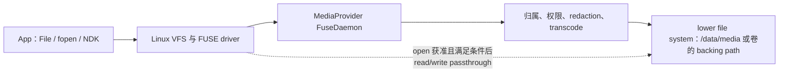

# 6.5 vold、MediaProvider 与 FUSE：共享存储 I/O 路径

## 排障范围

`/storage/emulated/0/DCIM/Camera/a.jpg` 看起来是一条普通路径，背后却包含挂载会话、调用方身份、媒体归属、权限、元数据脱敏、兼容转码和底层文件系统访问。把所有耗时都归到“FUSE 慢”或“UFS 慢”，很难得到可复现的结论。

本文回答三个排障问题：

1. `vold`、MediaProvider 和 FUSE 各自在什么时候参与。
2. 直接路径、MediaStore URI、SAF URI 和 App 私有路径的成本为何不同。
3. Android 17 设备上怎样确认 passthrough、FUSE BPF、文件系统与块 I/O 的实际状态。

当前源码锚点为 Android 17 / API 37 / `android-17.0.0_r1`，内核锚点为 `android17-6.18-2026-06_r6`。

## 先分清控制面与数据面

### `vold` 管卷和挂载会话

`vold` 负责卷发现、准备挂载点、用户切换、卷挂载/卸载和设备插拔等生命周期。它不在每个 `open()`、`read()`、`write()` 请求中做媒体权限判断。

下面的 Android 17 源码片段用于定位 `vold` 把 FUSE 会话交给上层的位置：

```cpp
res = MountUserFuse(user_id, getInternalPath(), label, &fd);
if (res != 0) {
    return res;
}

mFuseMounted = true;
auto callback = getMountCallback();
if (callback) {
    callback->onVolumeChecking(
            std::move(fd), getPath(), getInternalPath(), &is_ready);
}
```

代码位于 `system/vold/model/EmulatedVolume.cpp` 的 `EmulatedVolume::doMount()`。`MountUserFuse()` 建立挂载并返回 FUSE 设备 fd，随后 mount callback 接管会话准备。普通文件打开变慢时，除非同时发生卷状态变化、用户切换或挂载错误，否则不应先追 `vold` 的 CPU 使用。

Android 17 的同一文件还会为 FUSE 配置 read-ahead 和 dirty ratio，并按 `IsFuseBpfEnabled()` 选择 bind mount 或 FUSE BPF 相关路径。这些属于产品与会话配置，App 不能据 Android 版本号推断具体开关。

### MediaProvider 模块启动 FUSE daemon

MediaProvider 中的 `ExternalStorageServiceImpl.onStartSession()` 接收 session id、FUSE 设备 fd、上层路径和底层路径，创建 `FuseDaemon` 并调用 `start()`。`FuseDaemon.run()` 最终进入阻塞式的 `native_start()`，读取内核提交的 FUSE 请求。

MediaProvider 同时负责两种角色：

- 作为 ContentProvider，维护媒体索引并处理 MediaStore 的查询、插入、更新、删除和打开 URI。
- 作为共享存储 FUSE handler，根据 uid、包归属、权限、脱敏与转码状态处理文件系统请求。

这两种入口最终可能访问同一份底层文件，但 Binder 查询、Provider 打开文件和直接路径进入 FUSE 的前半段不同。不能把 `content://` URI 简化成“换一种字符串表示的 `/storage` 路径”。

## 两类常见 I/O 路径

### 直接文件路径

下面的图用于展示没有命中 BPF/passthrough 时的关键节点，以及打开后可能缩短的数据路径：



目录 lookup、`getattr()`、`readdir()`、打开文件和数据读写不是同一种请求。passthrough 只会在文件打开获准且条件满足后，缩短该文件后续的数据传输；路径可见性、打开权限和需脱敏/转码的请求仍由 MediaProvider 决定。

### MediaStore 与其他 Provider URI

MediaStore 查询先通过 Binder 进入 MediaProvider 数据库。打开某个媒体 URI 时，Provider 可以根据访问模式、缓存一致性、脱敏和转码要求返回合适的 fd。Android 17 的 `FuseDaemon.shouldOpenWithFuse()` 也表明，Provider 打开的 fd 是否还要回到 FUSE 路径，需要按文件与锁条件决定。

官方文档还建议重度批量操作使用 ContentProvider 的批处理能力，减少逐个路径进入 FUSE 的元数据操作。这类“非 FUSE 优化路径”指的是访问入口与批处理方式得到优化，不代表媒体内容脱离底层文件系统或块设备。

SAF URI 经过 `DocumentsProvider`，提供者可能是本地文件系统、USB 盘或云端服务。它不保证低延迟，也不保证可以转换成普通路径。App 应按 `ContentResolver` 契约使用流或 fd，并处理 Provider 被杀、授权撤销和远端读取失败。

App 内部目录 `/data/user/<userId>/<package>/` 不属于共享存储 FUSE mount。App-specific external 目录位于外部存储命名空间，但 AOSP 对 `Android/data` 与 `Android/obb` 使用专门的绕过/加速路径。Android 17 中该实现还会随 FUSE BPF 和 bind mount 配置变化，不能把“App-specific external”与“内部私有目录”视为完全相同的安全与性能模型。

## FUSE 的成本出现在哪些操作

Android 11 的 FUSE 调优包含 read-ahead、writeback cache、权限缓存、App 专属目录绕过和 all-files 批量操作优化。官方曾在调优后的 Pixel 2 上比较直接路径与 MediaStore：顺序读取接近，FUSE 顺序写略差，随机读写在该测试中最高可慢约两倍。这个结果只说明随机小 I/O 更容易暴露用户态转发成本，不能外推为 Android 17 或任意设备的固定倍率。

| 访问模式 | 可能放大的环节 | 优先检查 |
| --- | --- | --- |
| 单个大文件顺序读 | 首次打开、缓存未命中、底层 read-ahead | 打开耗时与持续吞吐分开测；确认是否 passthrough |
| 小块随机读写 | 多次 FUSE 请求、页缓存、文件系统与闪存尾延迟 | 请求大小、随机偏移、FUSE/块事件重合情况 |
| 大目录枚举 | `readdir`、lookup、属性读取、权限与索引一致性 | 文件数、目录层级、是否可以改用 MediaStore 查询 |
| 批量创建/删除/改名 | 元数据更新、逐项权限检查、MediaProvider 数据库更新 | 单项耗时分布、事务/批处理边界、失败重试 |
| 脱敏或兼容转码 | 不能进入普通 passthrough，可能产生额外 CPU 与临时数据 | `ACCESS_MEDIA_LOCATION`、转码状态、FuseDaemon 日志 |
| SAF/云端 URI | Provider Binder、网络、缓存与远端限流 | Provider 身份、Binder 等待、网络和本地 I/O 分开 |

文件很大时，底层 I/O 可能盖过 FUSE overhead；文件数量很大时，元数据和策略判断可能比数据传输更显眼。性能实验应同时记录文件数量、大小分布、操作类型、缓存冷热和授权状态。

## passthrough 与 FUSE BPF 的边界

先区分三种经常被混写成“直通”的能力：

| 路径 | FUSE 页缓存 | `read`/`write` 是否到 daemon | lower filesystem 怎样参与 |
|---|---|---|---|
| 普通缓存 FUSE | 使用 | 缓存未命中、回写等情况需要 | daemon 再访问 lower fs |
| `FOPEN_DIRECT_IO` | 对该 open 绕过 | 仍然需要 | daemon 处理 FUSE 请求；direct I/O 不等于 lower-fs 直通 |
| FUSE passthrough | 数据路径不使用 FUSE 页缓存 | `open` 需要；获准后的数据 I/O 通常不需要 | 内核通过本次 open 绑定的 backing file 转发 |
| FUSE BPF + backing | 取决于操作 | BPF/backing 已处理的操作可以不交给 daemon | inode/dentry 关联 backing path，BPF 决定保留、移除或替换 |

`direct_io` 只改变 FUSE 页缓存语义。没有 passthrough 或 BPF backing 时，请求仍经 `/dev/fuse` 到 MediaProvider。passthrough 也不会绕过 Scoped Storage：归属、权限、redaction 和转码都在 `open` 阶段判断。

### passthrough 是逐文件打开决策

Android 12 支持 FUSE passthrough。Android 11 升级到 Android 12 的设备受冻结内核限制，不能因系统升级自动获得该能力；以 Android 12 出厂且使用官方支持内核的设备才具备当时的启用条件。

Android 17 MediaProvider 仍会先检查内核能力：

```cpp
const char* filename = "/sys/fs/fuse/features/fuse_passthrough";
if (contents == "supported\n") {
    return true;
}
```

仅看到 sysfs 返回 `supported` 还不够，它只表示内核具备 upstream passthrough 能力。产品属性、FUSE 协商结果和单次文件打开条件也必须满足。

下面两行用于说明文件级决策：

```cpp
bool passthrough = !redaction_needed && transforms_complete;
bool direct_io = open_info_direct_io && !passthrough;
```

文件需要位置元数据脱敏，或者转码尚未完成时，MediaProvider 不能让后续读取绕过 daemon。passthrough 的收益集中在已获准文件的 `read`/`write` 数据搬运，对目录枚举、MediaStore 查询和首次 `open` 没有同等作用。

Android 17 的源码同时兼容 Android 早期 passthrough 接口与 upstream FUSE passthrough。上游协议的建立过程是：daemon 打开 lower-fs 文件，向 FUSE connection 注册并取得 `backing_id`，再在 open 回复中携带 `FOPEN_PASSTHROUGH` 与该 ID。内核随后为这次 FUSE open 创建独立 backing file，文件关闭后关系结束。

内核的 `backing_file_read_iter()` / `backing_file_write_iter()` 省掉的是 FUSE 数据请求往返；VFS、lower filesystem、fscrypt、页缓存、块层和闪存仍在路径中。passthrough 写还会获取 inode lock，并更新 FUSE inode 属性及缓存状态。多个 writer 访问同一 inode 时，不能把 passthrough 理解成无锁并发。

`FOPEN_PASSTHROUGH` 与 `FOPEN_DIRECT_IO` 可以同时出现。在该组合下，Android 17 内核允许 read/write 继续发给 FUSE server，而 mmap 使用 backing file。看到 passthrough 标志时，仍需结合整组 open flags 判断各操作去向。

### `iomode` 保护缓存与 backing 一致性

Android 17 的 `fuse_file` 区分 cached、uncached 与 passthrough mode。cached I/O 不能和破坏缓存一致性的 direct write 任意并发；同一 FUSE inode 也不能同时绑定互相冲突的 backing file。Android common kernel 为 MediaProvider 的 mixed-mode 用例放宽了一条上游 `-ETXTBSY` 拒绝分支，但仍保留 conflicting backing 检查、direct-write 锁和 passthrough write 的 inode lock。

这类 Android 补丁解决的是合法组合的兼容性，不代表同一文件可以由任意多进程、任意缓存模式无代价并发访问。

### FUSE BPF 当前主要服务 App 专属目录

`android17-6.18-2026-06_r6` 的 GKI 配置包含 `CONFIG_FUSE_FS=y` 与 `CONFIG_FUSE_BPF=y`。Android 17 MediaProvider 源码注明，FUSE BPF 当前限制在 `Android/data` 与 `Android/obb`，通过 backing fd 把符合规则的请求交给底层文件系统。

这仍然是条件性能力：

- 内核编译开关存在，不等于产品运行时已经启用。
- 当前 MediaProvider 源码的路径范围不应扩写到整个共享媒体目录。
- 路径归属和 Zygote 的 App data isolation 仍参与访问控制。
- `FuseDaemon.cpp` 在 lookup 返回中使用 `FUSE_ACTION_KEEP`、`FUSE_ACTION_REMOVE` 或 `FUSE_ACTION_REPLACE` 安装、移除或替换 BPF/backing 关系。

`vold` 提供了另一半边界：`IsFuseBpfEnabled()` 为 false 时，它把 lower fs 的 `Android/data` 和 `Android/obb` bind mount 到用户可见树；启用 BPF 时跳过这组 bind mount，由 FUSE BPF/backing 路径负责相应操作。这套机制主要服务受保护的 App 专属目录，不是 `DCIM`、`Pictures` 或 `Download` 的通用加速开关。

## Scoped Storage 下的 App 场景

### 相册与媒体列表

相册列表优先查询 MediaStore，projection 只保留界面和分页所需列，例如 `_ID`、`DATE_TAKEN`、`MIME_TYPE`、`WIDTH`、`HEIGHT`。用户打开详情、编辑或上传时，再通过 URI 打开具体文件。

不要为了得到“文件路径”而先查询整个媒体库，再对每个项目执行 `stat()`。这会把数据库查询、FUSE 元数据请求和缩略图解码叠在一起。确有 native 库只接受 fd 时，可用 `ParcelFileDescriptor.detachFd()` 明确移交所有权；库只接受路径时，再评估复制到私有工作目录的成本。

### 图片编辑、视频处理与断点续传

随机改写、临时分片和中间产物适合放在内部私有目录。处理完成后，把成品作为一次受控写入提交到 MediaStore。这样可以把高频随机 I/O 留在不经过共享存储策略的路径，并避免半成品被其他 App 扫描。

Android 10+ 写入媒体时可使用 `IS_PENDING`：创建条目后保持 pending，写完并完成必要的同步处理后再发布。崩溃恢复还要记录未完成 URI，不能只依赖进程内状态。

### 文档与 Downloads

用户选择的 PDF、压缩包等文档使用 SAF。App 自己生成并希望用户长期保留的下载文件，可按官方 API 写入 Downloads。不要递归扫描整个下载目录寻找某一个用户文件；持久化 URI 权限后直接访问目标。

Provider 可能返回不可 seek 的管道 fd。调用前应检查业务是否需要随机访问；需要时复制到受控的临时文件，并在操作结束后清理。

### 日志导出、备份与聊天媒体迁移

日志在内部目录滚动写，用户触发导出时再复制或分享。备份和聊天媒体迁移应维护待处理清单，以增量方式扫描与重试，避免每次失败后重新遍历整个共享存储。

批量删除、回收、收藏或写入其他 App 创建的媒体时，使用平台提供的用户确认与批量请求 API。每批数量按目标设备、Binder payload、取消粒度和失败恢复测试决定，不使用脱离 workload 的固定数字。

## 诊断：先证明慢在哪一层

### 记录最小环境信息

下面的命令用于确认平台、内核、挂载和 FUSE 能力，不修改设备状态：

```bash
adb shell getprop ro.build.version.release
adb shell getprop ro.build.version.sdk
adb shell getprop ro.build.fingerprint
adb shell uname -r
adb shell 'cat /proc/mounts | grep -E "fuse|sdcardfs|emulated|media_rw|ext4|f2fs"'
adb shell 'cat /sys/fs/fuse/features/fuse_passthrough 2>/dev/null'
adb shell 'dumpsys -l | grep -i media'
```

`/proc/mounts` 展示的是实际挂载，不要用机型宣传页代替。passthrough sysfs 文件缺失或无输出表示不能从该入口确认能力；它不单独证明功能关闭。`dumpsys -l` 的服务名随构建变化，先列服务再选择具体 `dumpsys`，比假设存在 `dumpsys media_provider` 更可靠。

### Perfetto 观察点

一轮有用的 Trace 至少要覆盖：

1. App 主线程、工作线程与 Binder 调用。
2. MediaProvider 进程、Binder 线程和 FUSE session 线程。
3. `sched_switch`、`sched_wakeup`，区分 CPU 竞争与睡眠等待。
4. `block/block_rq_issue`、`block/block_rq_complete`，以及目标设备支持的 ext4/F2FS/writeback 事件。
5. App 自定义 async slice：查询、打开、首字节、完整读写和发布媒体分别计时。

主线程处于 `D` 状态说明它在不可中断睡眠中等待内核资源，但不能据此直接判定 FUSE。Binder、块 I/O、文件系统锁和驱动等待都可能出现相似表现。需要调用栈、目标线程活动和块事件一起判断。

对于目录扫描，建议记录：

- 文件/目录项数量与深度。
- `getdents64`、`statx`/`newfstatat`、`openat` 次数。
- MediaStore 查询返回行数和 projection。
- 首次扫描与热缓存扫描分别耗时。

### 先枚举 FUSE tracepoint，再判断数据路径

`android17-6.18-2026-06_r6` 的 `fs/fuse/fuse_trace.h` 定义了 `fuse_request_send` 与 `fuse_request_end`。产品内核可能裁剪事件，采集前先读取 tracefs 的 `available_events`：

```bash
adb shell su 0 sh -c '
TRACE=/sys/kernel/tracing
[ -d "$TRACE/events" ] || TRACE=/sys/kernel/debug/tracing
grep "^fuse:" "$TRACE/available_events"
'
```

受控 I/O 窗口中出现 `FUSE_READ` 或 `FUSE_WRITE` send 事件，说明相应请求进入 daemon。只有 `FUSE_OPEN` 而没有 read/write，可能符合 passthrough/BPF backing，也可能来自页缓存命中、测试未产生预期 syscall、读取失败或采集窗口不完整。还要对齐文件来源、冷暖缓存、MediaProvider 日志、应用 syscall 和 lower-fs/block 事件。

### strace 只在可调试测试环境使用

下面的示例用于在 userdebug/rooted 实验机上观察目标进程的文件系统调用，不应直接用于生产设备：

```bash
adb shell su 0 strace -f -ttT \
  -e trace=openat,read,write,getdents64,newfstatat,fsync \
  -p <pid>
```

`strace` 会扰动时序，ROM 也可能没有该工具。它适合回答“是否出现大量小 read/stat/目录枚举”，不适合直接产出性能基线。发布结论仍应使用无附加或低扰动的 Perfetto/应用埋点复测。

### `vold` 何时才是优先调查对象

出现以下信号时再把重点移到 `vold`：

- 卷长时间停在 checking/mounting。
- 用户切换或工作资料切换后路径不可用。
- USB/SD 卡插拔后 mount namespace 不一致。
- logcat 出现 `MountUserFuse`、session start/end、unmount 或 bind mount 失败。
- 大量请求返回 `ENOTCONN`、`EIO`，并与卷状态变化重合。

单个已挂载媒体文件的稳定慢读，通常先看 App 访问模式、MediaProvider/FUSE、文件系统与块设备。

## FBE、16KB 页与底层文件系统

FBE 位于 `/data` 文件系统的数据与文件名加密路径，FUSE 位于共享存储的命名空间和策略层。同一次访问可能叠加两者成本。`android17-6.18-2026-06_r6` 的 GKI 配置包含 `CONFIG_FS_ENCRYPTION=y` 与 inline encryption 支持，但产品是否使用 inline crypto、密钥策略和硬件加速仍由设备实现决定。

区分两层成本可以设计对照实验：同一设备、相同大小与访问模式，比较内部私有文件、App-specific external 和共享媒体；同时控制缓存冷热与加密策略。不同目录的文件系统、配额和挂载选项可能不同，结果只能解释已记录的设备配置。

Android 17 `FuseDaemon.cpp` 使用下面的上限计算：

```cpp
#define FUSE_MAX_MAX_PAGES 256
const size_t MAX_READ_SIZE = FUSE_MAX_MAX_PAGES * getpagesize();
```

页大小会改变 FUSE 连接协商的最大读取上限，但单次请求仍受 App buffer、read-ahead、内核限制和文件状态影响。16KB 页不会自动让共享存储吞吐提高四倍，也不能仅凭 `MAX_READ_SIZE` 推导尾延迟改善。需要在 4KB 与 16KB 设备上使用相同 workload 实测。

## Android 10—17 边界速查

| 版本 | 相关变化 | 排障边界 |
| --- | --- | --- |
| Android 10 | 引入 Scoped Storage；MediaProvider 路径执行新访问规则 | 可使用 legacy 过渡；直接路径能力与 Android 11 不同 |
| Android 11 | MediaProvider 成为共享存储 FUSE handler；新发布 5.4+ 内核设备不能使用 SDCardFS | 升级设备可能保留 SDCardFS 下层，必须看实际挂载 |
| Android 12 | 符合出厂与内核条件的设备可支持 FUSE passthrough | 系统版本不能证明运行时已启用 |
| Android 13 | 细粒度媒体权限；MediaProvider 仍可通过 Mainline 更新 | 权限变化与 I/O 路径要分别记录 |
| Android 14 | Selected Photos Access | 用户可见集合可能动态变化，不应后台遍历未授权媒体 |
| Android 15—16 | Photo Picker 与局部媒体访问继续演进；支持 16KB 页设备 | 页大小、模块版本和授权状态加入复现条件 |
| Android 17 | 当前平台仍沿用 MediaProvider FUSE；源码包含 passthrough、FUSE BPF、脱敏和转码分支 | 以 `android-17.0.0_r1`、内核配置、MediaProvider 模块与实机状态共同判断 |

MediaProvider 是 Mainline 模块，同一个 Android 大版本也可能因模块更新而出现修复或行为差异。性能报告除 build fingerprint 外，还应保存模块版本。

## 常见误区

### “访问 `/storage/emulated/0` 慢，说明 `vold` 在处理每次 I/O”

`vold` 负责挂载生命周期。稳定挂载后的请求主要经过 VFS/FUSE、MediaProvider 和底层文件系统。

### “sysfs 显示 passthrough supported，所有文件都会直通”

内核支持只是前提。文件仍需通过打开检查，脱敏、转码和 fd 来源等条件会阻止单次请求进入 passthrough。

### “使用 MediaStore 就没有磁盘 I/O”

MediaStore 提供索引、授权和优化后的打开路径。读取媒体内容仍会访问文件系统与存储设备，Provider 查询本身也有数据库与 Binder 成本。

### “SAF URI 一定对应本地路径”

SAF 可以连接本地或远端 Provider。URI 可能只支持流式读取，甚至依赖网络。

### “16KB page size 会直接解决随机 I/O”

页大小改变内存与 FUSE 协商粒度，无法消除用户态策略判断、文件系统元数据或闪存尾延迟。

## 小结

共享存储排障的第一步是确认访问模型：

- `vold` 负责卷与 FUSE 会话的创建/销毁。
- MediaProvider 既是媒体 ContentProvider，也是共享存储 FUSE handler。
- 直接路径、MediaStore、SAF 和私有目录拥有不同的前半段成本。
- passthrough 只缩短满足条件文件的后续数据请求；FUSE BPF 在当前 Android 17 源码中主要服务 `Android/data`、`Android/obb`。
- FBE、文件系统、块调度和 UFS 仍在 FUSE 下层，策略层与设备层可能同时变慢。

App 侧优先让数据归属与 API 匹配：媒体列表使用 MediaStore，文档使用 SAF，高频临时 I/O 放私有目录，成品再发布。系统侧则用挂载、FuseDaemon、Binder、文件系统和块事件逐层取证，避免只凭 Android 版本或一条总耗时下结论。

## 参考资料

- [Scoped storage](https://source.android.com/docs/core/storage/scoped)
- [FUSE passthrough](https://source.android.com/docs/core/storage/fuse-passthrough)
- [SDCardFS deprecation](https://source.android.com/docs/core/storage/sdcardfs-deprecate)
- [Access media files from shared storage](https://developer.android.com/training/data-storage/shared/media)
- AOSP `system/vold/model/EmulatedVolume.cpp`（`android-17.0.0_r1`）
- AOSP `packages/providers/MediaProvider/src/com/android/providers/media/fuse/ExternalStorageServiceImpl.java`（`android-17.0.0_r1`）
- AOSP `packages/providers/MediaProvider/src/com/android/providers/media/fuse/FuseDaemon.java`（`android-17.0.0_r1`）
- AOSP `packages/providers/MediaProvider/jni/FuseDaemon.cpp`（`android-17.0.0_r1`）
- Android common kernel `arch/arm64/configs/gki_defconfig`（`android17-6.18-2026-06_r6`）
- Android common kernel `fs/fuse/backing.c`、`passthrough.c`、`iomode.c`、`fuse_bpf_backing.c`（`android17-6.18-2026-06_r6`）
- Android common kernel `include/uapi/linux/fuse.h`、`include/uapi/linux/android_fuse.h`（`android17-6.18-2026-06_r6`）
- §6.1「Android 存储架构」
- §6.2「文件系统」
- §6.3「I/O 调度与性能」
- §6.4「SharedPreferences 与 DataStore」
- §24.12「MediaStore 与 MediaProvider 性能治理」
- §24.13「Photo Picker、媒体转码与缓存治理」
