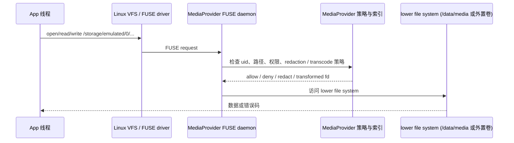

# 6.6 vold、FUSE 与 Scoped Storage I/O 性能边界

<!-- outline-start -->
## 要点

### 🔹 Android 外部存储路径：vold、MediaProvider 与 FUSE
从 `/storage/emulated/0` 访问路径拆出 vold 挂载、FUSE 守护进程、MediaProvider 索引和 App 权限检查的边界。

### 🔹 SDCardFS 退场后 FUSE 的性能代价
梳理 Android 10 前后的 SDCardFS / FUSE 迁移，以及随机读写、目录遍历、权限检查带来的额外开销。

### 🔹 FUSE passthrough 与非 FUSE 访问模式
说明 passthrough 适用条件、MediaProvider 非 FUSE 通道，以及为什么媒体类批量访问不应直接压在 emulated storage 路径上。

### 🔹 Scoped Storage 下随机 I/O、批量扫描与媒体访问
把相册、下载目录、日志导出、缓存迁移这几类 App 场景拆成不同 I/O 模式，分别给出性能风险点。

### 🔹 Perfetto / dumpsys / strace 观察点
列出 `fuse`、`vold`、`media_provider`、block I/O、主线程 D 状态和 Binder 调用的排查入口。

### 🔹 App 侧优化策略：MediaStore、SAF、缓存与分片写
从可执行动作解释何时走 MediaStore、何时复制到 App 私有目录、何时做批量事务和后台迁移。

### 🔹 Android 10-17 的版本边界
梳理 scoped storage、SDCardFS deprecation、FUSE passthrough 和 MediaProvider 行为在不同 Android 版本中的差异。

## 扩展

### 🔸 FBE 与 16KB Page Size 对外部存储 I/O 的影响
补充加密层、页大小和块设备读写粒度对 FUSE 路径的放大效应。

### 🔸 厂商文件管理器 / 相册批量导入案例
收集图库首扫、文件管理器复制、聊天 App 媒体迁移中的 trace 证据。

<!-- outline-end -->

## `/storage/emulated/0` 不是一条普通文件路径

App 访问 `/storage/emulated/0/DCIM/Camera/a.jpg` 时，表面上调用的是 `open()`、`read()`、`write()` 这类 POSIX 接口，系统侧处理的却是共享外部存储的权限、挂载、索引和内容改写。这个路径和 `/data/user/0/<package>/files/` 的性能模型不同，不能只按 ext4 / f2fs 的读写成本估算。

`vold` 负责把 emulated volume 准备成面向用户的挂载点。AOSP `system/vold/model/EmulatedVolume.cpp` 中，`EmulatedVolume::doMount()` 会设置内部路径和 `/storage/<label>`，再通过 `MountUserFuse()` 挂出用户视角的 FUSE volume。`MediaProvider` 则维护媒体索引、执行 Scoped Storage 访问策略，并在 Android 11+ 的共享存储路径上参与 FUSE 文件访问决策。二者的分工很清楚：`vold` 管挂载生命周期，`MediaProvider` 管共享文件是否能被当前调用方看到、打开、改写或遮盖敏感数据。[已验证: AOSP android-16.0.0_r1, system/vold/model/EmulatedVolume.cpp; packages/providers/MediaProvider/jni/FuseDaemon.cpp]

这张图只画 App 通过直接文件路径访问共享媒体时会经过的关键节点：



顺着这条路径看，外部共享存储的成本来自四类动作：FUSE 内核态和用户态切换、`MediaProvider` 策略检查、目录项与属性缓存命中情况、底层文件系统和块设备读写。前两类是 Scoped Storage 带来的额外成本，后两类才是 6.2 和 6.3 节讨论的文件系统、调度器和页缓存问题。

## FUSE 为什么会回来

Android 早期外部存储曾经使用 FUSE。AOSP 文档给出的历史线是：Android 7 及更早版本的 FUSE 实现存在性能和死锁问题；Android 8 引入 SDCardFS；Android 11 废弃 SDCardFS，并把 FUSE 作为 storage emulation 的默认方案。这里的变化不是单纯为了性能，而是为了在共享文件路径上拦截文件操作，让 `MediaProvider` 能在用户态执行 allow、deny、redact 这类策略。[已验证: AOSP 文档, source.android.com/docs/core/storage/scoped; source.android.com/docs/core/storage/fuse-passthrough]

SDCardFS 退场也有内核工程原因。AOSP `sdcardfs-deprecate` 文档列出两类替代能力：大小写不敏感由文件系统自身处理，存储统计由 project quota 在用户态配置；某些高敏场景使用 bind mount；Scoped Storage 需要的直接路径访问由新的 FUSE 实现提供。对于 launching with Android 11 且 kernel 5.4+ 的设备，VTS 不允许挂载 SDCardFS；升级到 Android 11 的旧设备可能仍在 SDCardFS 上叠一层 FUSE 来拦截文件操作。[已验证: AOSP 文档, source.android.com/docs/core/storage/sdcardfs-deprecate; source.android.com/docs/core/storage/scoped]

这也解释了一个排障现象：同样是 Android 11+，不同设备上的 `/storage/emulated/0` 性能并不一致。launch 设备、升级设备、kernel 版本、是否启用 FUSE BPF / passthrough、`MediaProvider` 模块版本，都会影响直接文件路径的尾部延迟。只按 Android 大版本判断“FUSE 一定慢”或“passthrough 一定生效”，都会误判。

## 性能代价落在哪里

AOSP 对 FUSE 成本的描述很具体：FUSE 处理页和属性这类可缓存信息时表现较好；访问共享外部存储时，用户态 FUSE daemon、内核 FUSE driver 和 lower file system 之间的协作会带来额外切换。官方还给出 Pixel 2 调优对比：顺序读可以接近 MediaStore API，顺序写略差，随机读写在某些场景可慢到接近 2 倍。这个数字不能外推到所有设备，但足够作为路径选择依据。[已验证: AOSP 文档, source.android.com/docs/core/storage/scoped]

不同 I/O 模式的风险不一样：

| I/O 模式 | 常见场景 | FUSE 风险点 | 更稳的路径 |
| --- | --- | --- | --- |
| 顺序读大文件 | 播放视频、上传单张原图 | 多一次打开和策略检查，后续读可能被 readahead 缓解 | 通过 `MediaStore` 拿 `Uri` 后打开 fd；旧库才用直接路径 |
| 随机读写 | 图片编辑、断点续传、数据库误放共享目录 | 小块请求频繁穿过 FUSE，尾部延迟放大 | 先复制到 App 私有目录处理，完成后再写回共享媒体 |
| 大目录枚举 | 相册首扫、文件管理器全盘扫描 | `readdir`、`getattr`、权限检查和索引查询互相叠加 | 媒体文件先查 `MediaStore`，非媒体才做受控文件遍历 |
| 批量删除 / 改名 | 清理相册、聊天媒体迁移 | 逐文件事务、逐次权限判断、数据库更新和磁盘 I/O 混在一起 | Android 11+ 批量请求 API；业务侧分批执行 |
| App 内部缓存 | 日志、临时文件、图片解码中间产物 | 放在共享目录会进入不必要的共享存储策略 | `/data/user/0/<package>/` 或 App-specific external directory |

`Android/data` 和 `Android/obb` 的边界要单独看。AOSP scoped storage 文档写明，外部私有目录会绕过 FUSE，内部存储 `/data/data` 也不是 FUSE mount。App 自己的缓存、数据库、临时解码结果不应该写进共享相册或下载目录；那会把本来只属于本进程的 I/O 变成共享存储治理问题。[已验证: AOSP 文档, source.android.com/docs/core/storage/scoped]

## FUSE passthrough 能解决什么

Android 12 支持 FUSE passthrough，目标是降低 FUSE overhead，让性能接近直接访问 lower file system。AOSP 文档把条件写得很窄：支持落在 `android12-5.4`、`android12-5.10` 和 `android-mainline` 测试内核；从 Android 11 升级到 Android 12 的设备通常不能支持，因为内核已经冻结；launching with Android 12 且使用官方内核的设备才可能支持。框架侧实现位于 `MediaProvider` Mainline 模块。[已验证: AOSP 文档, source.android.com/docs/core/storage/fuse-passthrough]

AOSP `MediaProvider` 的 `FuseDaemon.cpp` 也能看到这个判断边界。`IsUpstreamPassthroughSupported()` 会读取 `/sys/fs/fuse/features/fuse_passthrough`，只有返回 `supported\n` 才启用 upstream passthrough；`FuseDaemon::ShouldOpenWithFuse()` 中也保留了“passthrough 打开时继续从 FUSE 入口打开文件，但 read/write 发生在内核”的注释。也就是说，passthrough 不是把 Scoped Storage 权限模型拿掉，而是让通过策略检查后的数据读写少走用户态数据转发。[已验证: AOSP android-16.0.0_r1, packages/providers/MediaProvider/jni/FuseDaemon.cpp]

passthrough 的定位可以压成一句话：它优化的是文件内容读写的数据路径，不替 App 选择访问模型。目录遍历、元数据查询、权限判断、媒体索引、兼容转码、位置信息遮盖，这些仍然要由 `MediaProvider` 和上层 API 处理。相册、备份、文件管理器这类 App 若把全量扫描都压在 `/storage/emulated/0` 递归遍历上，passthrough 只能减少一部分读写转发成本，不能消掉枚举和策略判断。

## Scoped Storage 下的四类 App 场景

相册类 App 的主路径应该是 `MediaStore`。列表页先查索引，projection 只带 `_ID`、`DATE_TAKEN`、`MIME_TYPE`、`WIDTH`、`HEIGHT`、`SIZE` 等展示需要的字段；用户打开详情、编辑或上传时，再通过 `ContentResolver.openFileDescriptor()` 打开具体 `Uri`。Android Developers 文档给出的访问建议也相同：顺序读直接路径和 `MediaStore` 接近，随机读写直接路径可能慢到接近 2 倍，随机场景推荐 `MediaStore`。[已验证: 官方文档, developer.android.com/training/data-storage/shared/media]

下载目录和文档类文件不要套用相册模型。非媒体文件不一定有完整 `MediaStore` 元数据，用户选择的 PDF、压缩包、导出文件更适合走 Storage Access Framework，或者由 App 明确创建到 Downloads 集合。性能重点是减少无边界目录扫描：只处理用户选中的 `Uri`，后台索引用增量游标，失败时保留重试记录。

日志导出和缓存迁移要避开共享目录里的同步小写。日志文件在 App 内部目录滚动写，用户点“导出”时再批量复制到 Downloads 或分享 `Uri`。图片编辑、视频裁剪、压缩上传这类任务也应先在 App 私有目录完成随机读写和临时文件整理，再把成品一次性插入共享媒体集合。这样能把随机 I/O 留在内部存储路径，把共享存储访问压成可控的顺序写和一次索引更新。

聊天 App 的媒体迁移容易踩到两类坑：一类是历史媒体散落在自建共享目录里，迁移时递归扫描触发大量 FUSE 操作；另一类是边下载边让相册可见，半成品文件被其他 App 扫到。Android 10+ 的 `IS_PENDING` 可以把写入中的媒体先隐藏，写完后再清除 pending；迁移任务按批次提交，失败项保留原路径和目标 `Uri`，避免一轮失败后重新扫全量目录。[已验证: 官方文档, developer.android.com/training/data-storage/shared/media]

## 观察入口：先分清等待发生在哪一层

外部存储卡顿不要只看 App 线程耗时。要同时确认 App 是否在等 Binder、FUSE daemon 是否在处理请求、`MediaProvider` 是否被数据库或策略判断拖慢、block 层是否有真实设备 I/O。

排查时可以按这组入口收集证据：

- App 线程：Perfetto 中看主线程、I/O 线程、上传/解码线程的 D 状态、Binder 调用和自定义 Trace；主线程直接打开共享文件通常先改代码，不先调系统。
- FUSE / MediaProvider：看 `MediaProvider` 进程 CPU、Binder 线程、数据库 slice、文件读取 slice；logcat 搜索 `MediaProvider`、`FuseDaemon`、权限拒绝和转码相关日志。
- `vold`：只在挂载、用户切换、卷插拔、外置卡异常、FUSE mount 失败时优先看；普通媒体文件打开慢通常不从 `vold` 开始查。
- block I/O：启用 `block_rq_issue` / `block_rq_complete`、f2fs/ext4/writeback 相关 ftrace 事件，判断慢在设备队列、文件系统同步写，还是策略层等待。
- 设备配置：记录 Android 版本、kernel 版本、`MediaProvider` 模块版本、当前文件系统、`/sys/fs/fuse/features/fuse_passthrough`、目标路径是否位于 shared external storage。

这些命令用于快速确认路径和设备能力，执行前先确保目标设备是测试机：

```bash
adb shell mount | grep -E 'emulated|media_rw|fuse|sdcardfs'
adb shell getprop ro.build.version.release
adb shell getprop ro.kernel.version
adb shell cat /sys/fs/fuse/features/fuse_passthrough 2>/dev/null || true
adb shell dumpsys media_provider 2>/dev/null | head -80
```

如果 `dumpsys media_provider` 不可用，说明目标 ROM 未暴露相同服务名或输出被裁剪；改用 `adb shell dumpsys activity provider`、logcat 和 Perfetto 侧证据。[待验证: `dumpsys media_provider` 在不同 OEM Android 16/17 构建上的字段一致性]

## App 侧优化策略

外部共享存储的优化不是把所有 File API 改成 `MediaStore`，而是按数据归属和访问模式分流。

- 只给当前 App 使用的数据放内部目录。数据库、日志、解码中间产物、上传分片、临时压缩文件，都应优先放 `/data/user/0/<package>/`；需要用户可见时再导出。
- 媒体列表用 `MediaStore` 查询。目录遍历只作为文件管理器和导入工具的补充路径，不能作为相册首屏默认路径。
- 随机读写先复制到私有目录。图片编辑、视频处理、断点续传的工作文件在私有目录完成，成品再写回共享存储。
- 批量操作合并授权与事务。Android 11+ 的删除、收藏、回收站、写入请求可以合并多个 `Uri`；业务侧再按 100 到 500 个项目拆批，便于取消和重试。
- 直接文件路径只留给兼容场景。第三方 native 库必须拿路径时，记录文件大小、访问模式、系统版本和耗时；随机访问慢时优先换成 fd / `Uri` 路径或复制到私有目录。
- 线上埋点要区分路径。`content://`、`/storage/emulated/0`、App-specific external、内部目录分开统计；否则同一个“文件读取慢”指标会混入完全不同的系统路径。

与 24.12 节的关系也要分清：24.12 更偏 App 侧媒体访问模型；共享存储直接路径变慢时，排查重点放在 FUSE、`vold`、`MediaProvider` 和 block 层。读者做 App 侧方案时，优先按 24.12 的媒体访问模型改代码；追系统机制和 trace 时，再回到这里定位系统侧等待点。

## Android 10-17 版本边界

| 版本 | 存储访问变化 | 性能判断 |
| --- | --- | --- |
| Android 10 | 引入 Scoped Storage；`MediaProvider` 对媒体访问执行分区存储规则；直接文件路径适配成本较高 | 旧 App 可能依赖 `requestLegacyExternalStorage`；新路径应开始迁到 `MediaStore` / SAF |
| Android 11 | FUSE 支持让 Scoped Storage App 保留直接文件路径访问；SDCardFS 在 launching with Android 11、kernel 5.4+ 设备上退场 | 直接路径能工作不代表性能等同内部存储；随机读写和大目录枚举要单独测 |
| Android 12 | launching with Android 12 且官方 kernel 的设备可支持 FUSE passthrough | passthrough 降低内容读写转发成本，权限、索引、目录枚举成本仍存在 |
| Android 13 | 媒体权限拆成图片、视频、音频等更细粒度权限 | 权限模型更细，性能模型仍按 `MediaStore` / FUSE / 私有目录分流 |
| Android 14 | 选择性照片访问强化用户授权边界 | 相册类 App 更要把“用户可见集合”和“全库后台扫描”分开 |
| Android 15-17 | 当前公开文档没有给出会推翻 Android 11/12 FUSE 路径判断的通用变更 | 以目标设备 kernel、`MediaProvider` 模块和 `/sys/fs/fuse/features/fuse_passthrough` 为准 |

这张表不能替代实机确认。FUSE、passthrough、外部私有目录绕过、`MediaProvider` 模块版本都可能受设备配置影响。发布性能结论前，至少把 Android 版本、kernel、文件系统、路径类型和访问模式写进复现条件。

## FBE、16KB Page Size 与厂商案例

FBE 位于共享存储路径之下，影响的是 `/data` 分区中文件内容和目录项的加解密成本；FUSE 位于共享存储策略层，影响的是路径访问、权限判断和用户态转发。二者会在同一次文件访问中叠加，但不要把 FBE 成本误判成 FUSE 成本。判断方法是找对照路径：同一设备上比较内部私有目录、App-specific external、共享媒体 `Uri` 和直接 `/storage/emulated/0` 路径，才能看出策略层和底层文件系统各占多少。[已验证: 相关 FBE 背景见 6.1 节]

16KB Page Size 对外部存储 I/O 的影响还缺少稳定公开数据。AOSP `FuseDaemon.cpp` 中 `MAX_READ_SIZE` 按 `FUSE_MAX_MAX_PAGES * getpagesize()` 计算，说明页大小会进入 FUSE 读请求上限的计算；但这不等于 16KB 页设备在共享存储上一定更快。页缓存命中、readahead、底层 UFS、文件系统 block size、App 的读写块大小都会一起影响结果。[待验证: 需要 Android 15/16 16KB page size 真机 trace 对比]

厂商文件管理器、相册首扫、聊天媒体迁移是最值得补案例的三类场景。当前章节只给机制和排查入口，还缺脱敏 trace：图库首扫应展示 `MediaProvider` 查询、缩略图解码、FUSE 枚举和 block I/O 的相对占比；文件管理器复制应展示顺序读写和目录项更新；聊天媒体迁移应展示私有目录处理再批量导出的收益。[待补充: 需要真实设备 trace 或可公开复现脚本]

## 参考资料

- [已验证: AOSP 文档, Scoped storage](https://source.android.com/docs/core/storage/scoped)
- [已验证: AOSP 文档, FUSE passthrough](https://source.android.com/docs/core/storage/fuse-passthrough)
- [已验证: AOSP 文档, SDCardFS deprecation](https://source.android.com/docs/core/storage/sdcardfs-deprecate)
- [已验证: 官方文档, Access media files from shared storage](https://developer.android.com/training/data-storage/shared/media)
- [已验证: AOSP android-16.0.0_r1, system/vold/model/EmulatedVolume.cpp](https://android.googlesource.com/platform/system/vold/+/refs/tags/android-16.0.0_r1/model/EmulatedVolume.cpp)
- [已验证: AOSP android-16.0.0_r1, packages/providers/MediaProvider/jni/FuseDaemon.cpp](https://android.googlesource.com/platform/packages/providers/MediaProvider/+/refs/tags/android-16.0.0_r1/jni/FuseDaemon.cpp)
- [已验证: AOSP android-16.0.0_r1, packages/providers/MediaProvider/src/com/android/providers/media/MediaProvider.java](https://android.googlesource.com/platform/packages/providers/MediaProvider/+/refs/tags/android-16.0.0_r1/src/com/android/providers/media/MediaProvider.java)
- 详见 6.1 节：Android 存储架构
- 详见 6.2 节：文件系统
- 详见 6.3 节：I/O 调度与性能
- 详见 24.12 节：MediaStore 与 MediaProvider 性能治理
