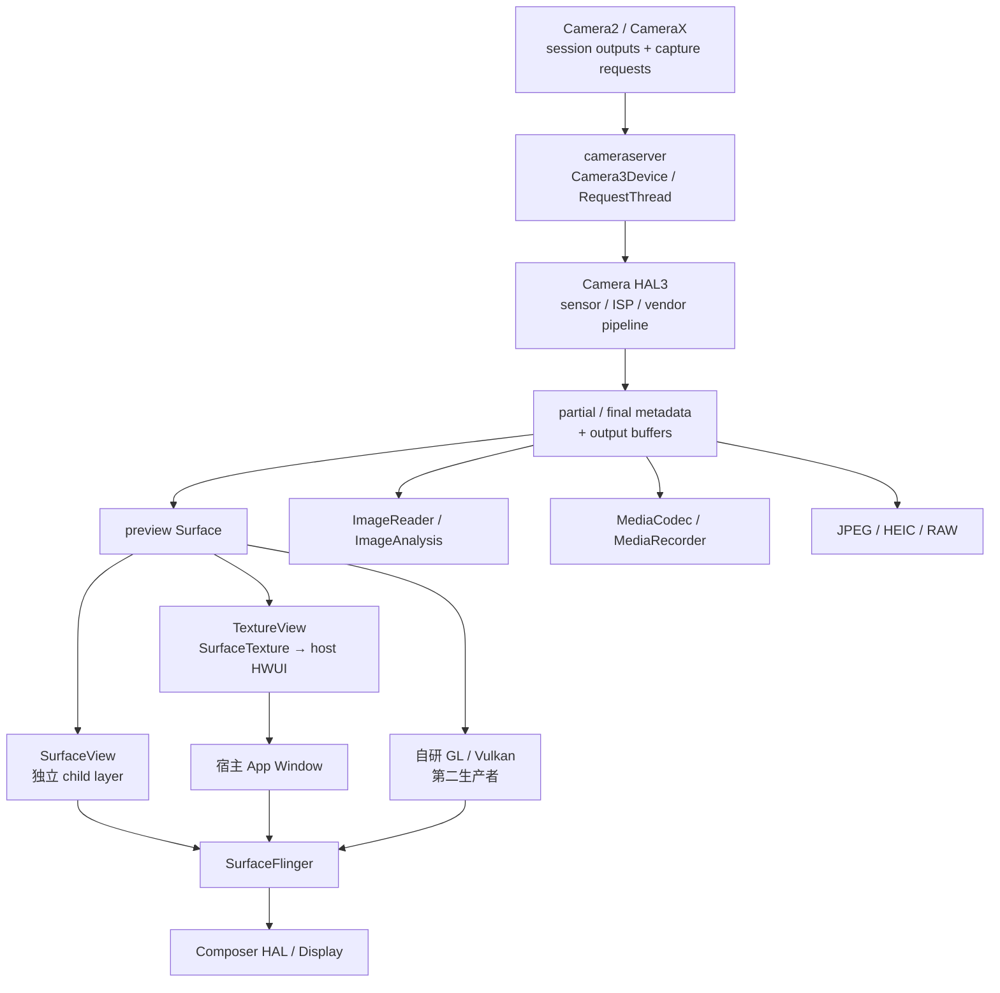

# 2.29 Android 17 Camera HAL3 Buffer 生命周期、回压与内存模型

<!-- outline-start -->
## 要点

### 🔹 HAL3 Buffer 生命周期管理
Camera HAL3 的 Buffer 生命周期分为三个核心阶段：**初始化分配**、**流转使用**、**回收释放**。

**初始化阶段**发生在 `Camera3Device::createStream()` 调用时，HAL3 根据 stream 配置（width/height/format/usage）向 `gralloc` 模块申请 buffer。Android 17 中，这些 buffer 默认采用三缓冲策略（maxDequeuedBufferCount=3），为高刷场景提供更强的缓冲能力。

**流转阶段**通过 CaptureRequest 实现单次 buffer 填充和传递。每个 Buffer 拥有独立的生命周期追踪：通过 buffer_id 标识、acquire_fence 与 release_fence 管理所有权、Surface 实例完成跨进程同步。

**回收阶段**遵循 `queueBuffer` → `releaseBuffer` 路径。ImageReader 消费端关闭一张 Image 时，会释放对应的 acquired buffer；Buffer 是否马上归还 producer、解除 slot 绑定或释放底层分配，还取决于其他未关闭的 Image、BufferQueue 状态和 producer/consumer 生命周期。不能把 `Image.close()` 写成“立即释放 HAL3 层内存”的保证。

### 🔹 BufferQueue 协作机制
Camera HAL3 与 BufferQueue 的协作通过 **双向绑定** 实现：HAL3 作为 BufferQueue 的生产者，通过 `ANativeWindow` 接口注册；渲染端作为消费者，通过 Surface 接口消费 buffer。

**生产端流程**：
1. HAL3 调用 `dequeueBuffer()` 获取空闲 buffer
2. 将捕获的图像数据填入 buffer
3. 调用 `queueBuffer()` 将 buffer 返回队列，传递 acquire fence

**消费端流程**：
1. SurfaceFlinger 通过 `acquireBuffer()` 获取 buffer
2. 填充 display 参数后，调用 `setBufferCount()` 触发 surface 配置
3. 渲染完成后返回 release fence

**同步机制**：Android 17 引入双 fence 机制，通过 `GraphicBuffer::mFence` 实现生产者-消费者同步，避免 buffer 读写冲突。

### 🔹 内存映射与 dma-buf 支持
Android 17 的 Camera HAL3 全面支持 **dma-buf 直接映射**，显著减少用户空间与内核空间间的拷贝开销。

**映射实现**：
- GraphicBuffer 通过 `handle` 机制实现跨进程共享
- 在 Camera HAL3 到 SurfaceFlinger 场景中，使用 `GraphicBuffer::mMapper` 进行物理内存映射
- dma-buf 操作绕过传统的 `mmap/munmap` 流程，直接操作物理页

**内存优化**：
- Android 17 引入的 16KB 页面对齐优化，使页错误频率降低 75%
- 连续内存分配减少内存碎片，提高缓存命中率
- Buffer 复用率追踪机制监控内存使用效率

**零拷贝路径**：当 buffer 大小超过 2MB 时，系统自动启用 dma-buf 路径，通过 `Composer HAL v3.2` 接口实现硬件层直接渲染。

### 🔹 性能边界分析
Camera HAL3 Buffer 管理面临五大性能边界：

**缓冲边界**：
- maxDequeuedBufferCount 决定缓冲深度，Android 17 默认值为 3（120Hz场景下的最佳平衡点）
- Buffer 过多增加内存开销，过少导致帧丢失
- 动态调整策略：高负载场景自动扩展缓冲池，低负载场景收缩释放

**同步边界**：
- fence 同步延迟影响帧率稳定性，典型延迟为 1-3ms
- fence 超时处理机制：等待超过 16ms 后，系统触发 buffer 降级策略
- 异步模式下的 Override Slot 预留确保 dequeue 操作永不阻塞

**内存边界**：
- 4K 分辨率 YUV_420 buffer 占用约 8MB，RGB_888 占用约 35MB
- 多场景并发时（Preview+Recording+Analysis），buffer 内存呈指数增长
- 内存压力检测：当可用内存低于 512MB 时，系统自动降低 buffer 分配质量

**格式边界**：
- JPEG 格式压缩率与质量参数呈非线性关系，质量>80 后收益递减
- NV21 格式在预览场景中保持最佳性价比
- HEIF 格式在 Android 17 中获得硬件编解码支持，节省 40% 存储空间

**并发边界**：
- 多 Camera 实例共享同一 GPU 资源时，产生资源竞争
- Binder 传输成为 1080p@30fps 以上场景的性能瓶颈
- SurfaceFlinger 的 composer 线程成为 GPU 渲染的同步点

### 🔹 实际问题定位
Camera HAL3 Buffer 管理的常见问题可通过以下方法精准定位：

**Buffer 泄漏检测**：
```bash
adb shell dumpsys media.camera | grep "allocated buffers"
# 预期：allocated buffers 应随 ImageReader close 迅速归零
```

**复用冲突诊断**：
- 检查 `BufferItem::mConsumer` 引用计数是否异常
- Perfetto 中追踪 `buffer_queue` traces 的 dequeue/queue 间隔
- 异常模式：连续 dequeue > queue 表示 buffer 饿死

**同步超时分析**：
```bash
# 检查 fence 等待时间
adb shell dumpsys gfxinfo | grep -E "fence|timeout"
```

**格式不匹配定位**：
- Camera HAL3 返回的 buffer format 与消费端 Surface format 不一致
- 通过 `Surface.isValid()` 验证格式兼容性
- 在 Android 17 中，强制格式转换采用 `SurfaceComposerClient::setPreferedPixelFormat()`

## 扩展

### 🔸 Buffer 池化策略
针对高频 Camera 场景，Android 17 推荐以下池化策略：

**静态池化**：
```cpp
// 预分配固定数量 buffer，适用于已知负载的场景
const int POOL_SIZE = 3; // 匹配 maxDequeuedBufferCount
Camera3Device::createStream(streamConfig, POOL_SIZE);
```

**动态池化**：
```cpp
// 根据实时负载动态调整池大小
void adjustPoolSize(int usage, int fps) {
    int basePool = 2;
    if (usage == CAMERA_USAGE_VIDEO_RECORDING) {
        basePool = 3 + fps / 60; // 录制场景增加缓冲
    }
    setBufferCount(basePool);
}
```

**池化监控**：
```cpp
// 追踪池效率指标
struct PoolMetrics {
    uint32_t hit_rate; // 复用命中率
    uint32_t average_wait_ms; // 平均等待时间
    uint32_t peak_memory_mb; // 峰值内存占用
};
```

### 🔸 内存碎片化处理
Android 17 中 Camera HAL3 通过以下策略处理内存碎片化：

**定期重启策略**：
```cpp
// 当内存碎片率 > 30% 时，重启 Camera 流
if (fragmentation_ratio > 0.3f) {
    restartCameraStream();
    LOGCameraHAL("Fragmentation detected, restarting stream");
}
```

**连续内存分配**：
```cpp
// 使用 ashmem 实现连续内存分配
buffer_handle_t allocate_contiguous_buffer(size_t size) {
    AshmemBuffer ashmem(size, PROT_READ | PROT_WRITE);
    ashmem.setProtection();
    return ashmem.handle();
}
```

**内存预热机制**：
```cpp
// 在应用启动时预分配 buffer 池
void prewarmCameraBuffers() {
    for (int i = 0; i < PREWARM_POOL_SIZE; i++) {
        allocateBuffer(PreviewFormat, PreviewWidth, PreviewHeight);
    }
}
```

### 🔸 跨进程 Buffer 传递优化
Android 17 中 Camera Buffer 跨进程传递的优化方案：

**共享内存区域**：
```cpp
// 使用 Binder 的 parcel 实现零拷贝传递
status_t Camera3Device::queueBuffer(buffer_handle_t handle) {
    Parcel parcel;
    parcel.writeBuffer(handle);
    return mClient->transact(CAMERA3_QUEUE_BUFFER, parcel, NULL, 0);
}
```

**直接 dma-buf 映射**：
```cpp
// 在 SurfaceFlinger 中直接映射 dma-buf
sp<GraphicBuffer> buffer = new GraphicBuffer(handle);
buffer->lock(GRALLOC_USAGE_SW_READ_OFTEN, &vaddr);
// 直接操作 vaddr 进行渲染
buffer->unlock();
```

**序列化优化**：
```cpp
// 避免频繁的小 buffer 传递
struct BufferBatch {
    buffer_handle_t handles[MAX_BATCH_SIZE];
    int count;
};
// 一次传递多个 buffer，减少 IPC 开销
```

<!-- outline-end -->

> [!CAUTION]
> 上面的 outline 是 Hermes/OpenClaw 依赖的受保护历史内容，本轮未改动。其中“三缓冲
> 默认值”“Android 17 引入双 fence”“大于 2 MB 自动走 dma-buf”“16 KB 页面使
> 缺页下降 75%”“低内存自动降画质”等结论没有 Android 17 源码依据；示例中的
> `Camera3Device::createStream(streamConfig, POOL_SIZE)`、
> `setPreferedPixelFormat()`、`AshmemBuffer` 等也不是对应 AOSP API。以下正文才是
> 基于 `android-17.0.0_r1` 与 `android17-6.18-2026-06_r6` 的复核结果。

## 1. 先看清 Camera buffer 的参与者

Camera 页面经常同时包含四类输出：

- **preview**：交给 SurfaceView、TextureView 或自研 GL/Vulkan renderer；
- **record**：交给 MediaCodec / MediaRecorder；
- **analysis**：交给 ImageReader、CameraX ImageAnalysis 或算法进程；
- **still capture**：交给 JPEG、HEIC、RAW 等 consumer。

Camera2 App 创建 `CameraCaptureSession` 时，把这些 `Surface` 交给 camera service。
`setRepeatingRequest()` 建立持续 request 流；`Camera3Device::RequestThread` 把
settings 与各路 output buffer 交给 HAL。HAL 驱动 sensor、ISP 和厂商算法，再通过
`processCaptureResult()` 返回 metadata、buffer 状态和 release fence。

下面的图用于区分 camera producer、各路 consumer 与最终显示路径：



同一个 frame number 的 partial metadata、final metadata 和各路 buffer 可以分开
返回。preview ready 不代表 analysis ready；capture callback 到达也不代表预览已经
present。复原一帧时要同时保留 frame number、request id、sensor/readout timestamp、
stream id、buffer id 与 fence。

## 2. Stream 配置不等于立刻分配固定数量 buffer

### 2.1 `createStream()` 先建立输出描述

`Camera3Device::createStream()` 接收目标 `Surface`、width、height、format、
dataspace、usage、dynamic range、stream use case、timestamp base 等参数，并创建
`Camera3OutputStream`。对于 BLOB / RAW opaque 等格式，它还会计算受 metadata
约束的最大 buffer size。

这一步并没有写死“分配三个 buffer”。Camera service 随后把 stream 配置交给 HAL；
HAL 在 `configureStreams()` 返回 `producerUsage`、override format 和
`maxBuffers`。consumer 端的 BufferQueue 也有自己的最小 undequeued buffer 数量。

`Camera3OutputStream::configureConsumerQueueLocked()` 的核心计算如下，用于说明
buffer 深度从哪里来：

```cpp
int maxConsumerBuffers = 0;
mConsumer->query(mConsumer.get(),
        NATIVE_WINDOW_MIN_UNDEQUEUED_BUFFERS, &maxConsumerBuffers);

mTotalBufferCount = maxConsumerBuffers + camera_stream::max_buffers;

mConsumer->setMaxDequeuedBufferCount(
        mTotalBufferCount - maxConsumerBuffers);
```

基础总数由 consumer 必须保留的 buffer 和 HAL 声明的 `max_buffers` 相加。Android
17 还可能为显示同步或 `PreviewFrameSpacer` 增加额外 buffer；shared/multi-resolution
stream、Camera3BufferManager 与 batch dequeue 也会改变行为。因此 buffer 数量是
每条 stream 的配置结果，不是 60/90/120 Hz 共用的固定常量。

### 2.2 分配通常发生在 dequeue / prepare 路径

BufferQueue slot 可以先存在而没有 `GraphicBuffer`。producer 首次
`dequeueBuffer()` 时，若 slot 没有满足 dimensions、format、usage 的 buffer，
allocator 才分配或重分配。camera service 也可以通过 stream prepare 预取 pipeline
需要的 buffer，降低第一帧分配抖动。

`createStream()`、slot 创建、gralloc allocation 是三个不同动作。看到 session
创建耗时，不能直接推断全部图像内存都已分配；要结合 gralloc/dma-buf 事件、
`dequeueBuffer` 延迟和 stream prepare 判断。

### 2.3 Camera3BufferManager 也不是任意动态扩缩池

Android 17 的 `Camera3BufferManager` 可以让一组兼容 stream 共享已分配 buffer，
并在水位变化时回收空闲项。`Camera3OutputStream` 注册成功后会关闭该 BufferQueue
自身的 allocation，由 buffer manager 提供或附加 buffer；注册失败则退回
BufferQueue 管理。

源码还明确排除了一部分 display / texture async stream，因为这类 consumer 有自己
的 buffer 管理逻辑。这里没有“高负载自动扩展、低负载按算法收缩”的通用产品策略，
也没有固定的碎片率重启阈值。

## 3. 每个 capture request 怎样获得 output buffer

Android 17 同时支持两种方式，二者不能混成一条固定流程。

### 3.1 Framework 管理 buffer

常规路径中，`RequestThread::prepareHalRequests()` 调用
`Camera3OutputStream::getBuffer()`。stream 检查当前 handout 数量不能达到 HAL
`max_buffers`，然后从 `ANativeWindow` dequeue：

1. BufferQueue 返回 slot、`ANativeWindowBuffer` 和 fence；
2. camera service 把 handle 与 fence 填进 HAL capture request；
3. HAL 等待 acquire fence 后才能写 output buffer；
4. HAL 可先返回 result 和未完成的 buffer，同时附上 release fence；
5. camera service 把该 fence 随 `queueBuffer()` 交给 consumer；
6. consumer 完成使用后，buffer 才能再次 dequeue。

BufferQueue 在 producer/consumer 之间传递 handle 与同步关系，Binder/AIDL 不会按
每帧复制一份 4K 像素数组。首次见到某个 AIDL `bufferId` 时会传
`NativeHandle`；HAL 缓存 `bufferId → handle` 后，后续 request 可只传 id。

### 3.2 HAL 管理 buffer 请求时机

若设备声明相应 buffer management 能力，`RequestThread` 给 HAL 的 output entry
可以先不带 buffer。HAL 在需要时经
`ICameraDeviceCallback.requestStreamBuffers()` 同步向 camera service 请求，
不用在 request 提交前就占住全部 output buffer。

AIDL 注释提醒：`requestStreamBuffers()` 是阻塞调用，请求数量越多耗时越长，HAL
不应在延迟敏感路径一次请求大量 buffer，通常要用专用线程并提前请求。未使用的项可
经 `returnStreamBuffers()` 归还。

这条路径改变的是 buffer 取得时机，不改变 ownership 和 fence 规则。HAL 若请求过
晚，仍可能让 ISP pipeline 等待；consumer 长时间不归还 buffer，HAL 请求也会失败
或阻塞。

## 4. Fence：所有权转移比“谁调用谁”更重要

### 4.1 交给 HAL 的 acquire fence

Framework 从 output Surface dequeue buffer 时得到一个 fence。AIDL
`StreamBuffer.acquireFence` 规定：HAL 在读写前必须等待它；如果 request 中 fence
为空，表示无需等待。

这通常代表该 buffer 上一位 consumer 已结束访问，但不要仅凭变量名猜方向。站在 HAL
视角，它是“获得 buffer 前要等待的 acquire fence”。

### 4.2 HAL 返回的 release fence

HAL 通过 `processCaptureResult()` 归还 buffer 时：

- `acquireFence` 必须为空；
- `releaseFence` 表示 HAL 何时完成对 buffer 的访问；
- fence signal 后，HAL 不得再访问该 buffer；
- buffer 已完成时可返回空 fence。

Camera service 的 `Camera3OutputStream::returnBufferCheckedLocked()` 始终接收 HAL
release fence。成功帧会把它传给 `ANativeWindow::queueBuffer()`；BufferQueue 站在
下游 consumer 视角把它当作读取前的 acquire fence。错误帧或被丢弃的帧走
`cancelBuffer()`。

### 4.3 显示 consumer 的 release

SurfaceView 预览被 SurfaceFlinger/HWC 使用后，还会有 layer release fence，表明
显示侧不再读取该 buffer。TextureView 则由 `SurfaceTexture` acquire camera buffer，
宿主 HWUI 采样后再经 App Window 的另一条 BufferQueue 上屏。

因此 Camera 路径至少要区分：

| fence | 描述的边界 |
| --- | --- |
| Framework → HAL acquire fence | HAL 何时可开始写入或读取 |
| HAL → Framework release fence | HAL 何时结束访问 |
| display/codec/App consumer release | 下游何时不再占用，可重新进入 producer 路径 |

这些 fence 机制远早于 Android 17，并非该版本新增。present fence 只描述 display
frame 的 present 边界，不能替代 camera buffer completion；ImageReader、codec 或
照片输出甚至不经过显示。

## 5. 不同 preview carrier 会改变显示路径

### 5.1 SurfaceView

Camera HAL 的 preview buffer 进入 SurfaceView 的独立 child layer。SurfaceFlinger
同时看到 preview layer 与宿主 App Window；HWC 再决定该 layer 能否使用 DEVICE
composition。

这条路径避免宿主窗口每帧采样 camera texture，适合持续高分辨率预览。几何、crop、
rotation、alpha、圆角和 lifecycle 仍由宿主 transaction 协调。preview buffer 早到
而几何 transaction 晚到，也会出现错位或旧状态。

### 5.2 TextureView

Camera buffer 先进入 `SurfaceTexture`，宿主 HWUI 在窗口 draw 中 acquire 并作为
texture 采样。这里有两条 BufferQueue：

1. camera → SurfaceTexture；
2. host HWUI → App Window。

相机帧 ready 后还要等待宿主 `Choreographer`、traversal、RenderThread 和窗口
queue。SurfaceFlinger 最终通常只看到 host window，所以 layer tree 无法单独证明
camera producer 是否及时。

### 5.3 自研 GL / Vulkan preview

滤镜、畸变矫正、分割或 AR 可能让 camera buffer 进入 external OES texture、
`AHardwareBuffer` 或 ImageReader，再由 App GPU pass 输出到另一个可见 Surface。
此时 HAL 是第一生产者，自研 renderer 是中间 consumer 与第二生产者。

分析时要分别量 camera release fence、App GPU completion、最终 surface queue 与
display present。把整个耗时记到 “Camera HAL” 或 “SurfaceFlinger” 都会遗漏中间
处理。

## 6. 多输出回压：慢 consumer 怎样拖住 session

### 6.1 ImageReader

`ImageReader` 允许同时 acquire 的数量由 `maxImages` 控制。达到上限后继续
`acquireNextImage()` 会抛 `IllegalStateException`，producer 继续 enqueue 也可能
stall。

只关心最新分析结果时，`acquireLatestImage()` 会 acquire 可用 image 并关闭较旧项；
要让它能丢旧帧，`maxImages - 当前已持有数量` 至少要留出 2。顺序处理或批处理才适合
`acquireNextImage()`。

下面的写法用于保证同步处理结束后归还 image：

```java
Image image = reader.acquireLatestImage();
if (image == null) {
    return;
}
try {
    analyze(image);
} finally {
    image.close();
}
```

如果算法异步持有 `Image`，不能在提交任务后立即 close；此时要限制并发并确保所有
成功、异常、取消路径都 close。CameraX 的 `ImageProxy.close()` 负责相同的回收责任。

`ImageReader.close()` 会释放 Surface、关闭当前已 acquire 的 image 并关闭 native
consumer；`discardFreeBuffers()` 只清除空闲缓存，不包含 App 正持有、queue 中待
acquire 或 producer 正使用的 buffer。不存在“Android 14 close 后统一强制清除 HAL
buffer”的通用机制。

### 6.2 MediaCodec 与 still capture

录像 encoder 处理跟不上时，输入 Surface 会减少可用 buffer。JPEG/HEIC/RAW 后处理
通常比 preview 慢，HAL 可以把同一 frame 的 preview 先返回、照片 buffer 后返回。
同一 stream 内 buffer 结果必须保持 FIFO，不同 stream 之间可以交错。

某些 ISP stage 或内部 pool 被多路共享，慢 analysis/still consumer 也可能拖住后续
request。是否跨 stream 传播要看设备 pipeline，不能只依据 API 拓扑推断。

### 6.3 识别回压而不是只看“掉帧”

| 现象 | 优先检查 |
| --- | --- |
| analysis 延迟持续增加 | acquire/close 间隔、`maxImages`、算法并发 |
| request 提交出现空洞 | App/CameraX 控制、session 重配、RequestThread |
| HAL result 晚 | ISP、vendor algorithm、output buffer 是否不足 |
| preview 已 queue 但未换帧 | HAL fence、SF latch、HWC 与 display present |
| TextureView 宿主掉帧 | SurfaceTexture acquire、main/RenderThread、host queue |
| record 卡顿但 preview 正常 | encoder input、codec output 与 muxer |

每路 consumer 必须独立保留时间点。用 analysis callback 代表 preview ready，或用
display present 代表 JPEG 完成，都会把问题归错层。

## 7. dma-buf 与内存占用应怎样计算

### 7.1 handle 共享不等于 CPU “直接操作物理页”

gralloc buffer 的 `native_handle` 通常携带 dma-buf fd 和厂商 metadata。进程经
Binder/AIDL 传 handle 后，各设备驱动可 import 同一底层分配；dma-fence /
`sync_file` 传递异步完成关系。这样可以避免在 camera、GPU、codec、HWC 之间复制
完整像素。

但这不代表所有环节都不做拷贝，也不代表 dma-buf “绕过 mmap”：

- App 用 `Image.Plane` 或 `GraphicBuffer::lock()` 做 CPU 访问时，mapper 仍可能建立
  CPU 映射并执行 cache maintenance；
- ISP 到目标 format 可能有色彩转换、缩放或内部中间 buffer；
- TextureView、自研滤镜通常有 GPU 采样和新的输出 buffer；
- 不兼容的 format、usage、modifier 可能触发 GPU/硬件 blit。

AOSP 没有按 2 MB 大小切换 dma-buf 的规则。是否共享、能否 scanout/encode、是否
需要转换，取决于 format、usage、allocator、mapper 和各硬件模块能力。

### 7.2 先算理论载荷，再看真实 allocation

以 3840 × 2160 为例，不考虑 stride、alignment、metadata 和压缩：

| 格式 | 理论每像素位数 | 单 buffer 最小像素载荷 |
| --- | ---: | ---: |
| YUV 4:2:0 8-bit | 12 bit | 约 11.87 MiB |
| RGB888 | 24 bit | 约 23.73 MiB |
| RGBA8888 | 32 bit | 约 31.64 MiB |
| RAW14 packed | 14 bit | 约 13.84 MiB |

真实 gralloc allocation 往往更大，因为 plane stride、height alignment、vendor
metadata、压缩 header 和 IOMMU granularity 都会增加空间；UBWC/AFBC 等压缩又会让
物理占用随内容和实现变化。YUV_420_888 还只规定 plane 访问模型，不保证底层一定是
紧凑的连续 1.5 byte/pixel。

多输出的峰值应按“每路 allocation × 该路 buffer 数量 + ISP/GPU/codec 中间池”估算。
它通常是多项相加并受共享池影响，不是随 preview、record、analysis 数量指数增长。

### 7.3 16 KB page 与 Camera buffer 是两个问题

Android 17 可以运行在 16 KB page 设备上，但这不自动改变一个 4K YUV frame 的
像素载荷。页大小可能影响页表、IOMMU 映射、allocator alignment 和 CPU 映射行为；
收益或代价取决于设备、访问方式和 workload。

源码没有“Camera 缺页下降 75%”的通用数据。若要评价 4 KB/16 KB 差异，应固定 SoC、
allocator、camera 配置和算法，测 page fault、IOMMU map、CPU access、内存带宽与
整段任务能量。

## 8. Android 17 的几个具体边界

### 8.1 AIDL Camera HAL 的 buffer identity

Android 17 的 AIDL `StreamBuffer` 用 `streamId + bufferId` 标识 buffer。首次把
buffer 交给 HAL 时，同时给 id 与 handle；HAL 建立映射后，后续可只给 id。stream
移除或 session 关闭后，HAL 才能清除对应缓存。

这减少重复 handle 传输，不改变底层 allocation 的所有者，也不是图像数据批量走
Binder。

### 8.2 timestamp base 会影响预览节奏

`OutputConfiguration` 支持 SENSOR、MONOTONIC、REALTIME、
CHOREOGRAPHER_SYNCED、READOUT_SENSOR 等 timestamp base。Android 17 的
`Camera3OutputStream` 对 HWC consumer 或 HW texture consumer 可启用 display sync
或 `PreviewFrameSpacer`，并可能增加额外 buffer。

对齐 trace 前要记录目标 Surface 与 timestamp base。预览为了显示节奏调整 timestamp
或 queue 时机，不代表 sensor timestamp 被改写；image timestamp 与 display present
也不是同一时间域。

### 8.3 RAW14 只影响显式配置的 RAW stream

Android 17 的 `ImageFormat.RAW14` 是带 feature flag 的公开格式，位深为 14。
设备是否支持要查 camera characteristics 和 stream configuration。它会提高 RAW
capture 的数据量与处理压力，但不会让普通 PRIVATE/YUV preview 自动改成 RAW14。

### 8.4 ImageReader 跨格式行为有 API 37 变化

`ImageReader` 文档在 Android 17 源码中说明：API 36 及以前，acquire 到与 reader
声明不同的格式可能抛 `UnsupportedOperationException`；API 37 及以后不再因此拒绝
acquire（PRIVATE 早已例外）。这项兼容行为不等于 consumer 可以忽略每个
`Image` 的实际 format、plane 和 stride。

## 9. 设备排查：先保存配置，再抓时间关系

### 9.1 保存 camera 与 layer 状态

下面的命令用于保存 session/stream、SurfaceFlinger layer 和 dma-buf 概况：

```bash
adb shell dumpsys media.camera > media-camera.txt
adb shell dumpsys SurfaceFlinger --list > sf-layers.txt
adb shell dmabuf_dump > dmabuf.txt
adb shell cat /proc/meminfo > meminfo.txt
```

`dumpsys media.camera` 的 Android 17 stream dump 包含 dimensions、format、
dataspace、combined usage、`max HAL buffers` 和 dequeue latency histogram。
`dmabuf_dump` 需要可用的调试工具和权限；量产 build 若不可读，应在 userdebug build
或厂商内存工具中采集。

不要依赖 `grep "allocated buffers"` 期待 ImageReader close 后某个计数立即归零：
Camera3/BufferQueue 可以保留空闲 buffer 复用，`discardFreeBuffers()` 也只释放符合
条件的空闲项。判断泄漏要比较稳定场景多轮开关后的平台 dma-buf 总量、stream 是否
仍存在、App 是否仍持有 Image，以及内存能否在合理时间回到稳定区间。

### 9.2 用 Perfetto 对齐 request、buffer 与显示

下面的配置用于采集 camera/gfx Framework 事件与调度、频率、idle 证据：

```protobuf
buffers {
  size_kb: 65536
  fill_policy: RING_BUFFER
}
data_sources {
  config {
    name: "linux.ftrace"
    ftrace_config {
      atrace_categories: "camera"
      atrace_categories: "gfx"
      atrace_categories: "view"
      ftrace_events: "sched/sched_switch"
      ftrace_events: "sched/sched_wakeup"
      ftrace_events: "power/cpu_frequency"
      ftrace_events: "power/cpu_idle"
    }
  }
}
duration_ms: 15000
```

这个基础配置能看到 camera service、UI/RenderThread 与系统负载关系；vendor HAL、
ISP、SOF/EOF、IOMMU 和 dma-fence 细节取决于设备是否开放相应数据源或 tracepoint。
采集前应按产品能力增加 vendor event，而不是假定 Android Common Kernel 提供统一
camera driver 事件。

将配置保存为 `camera.cfg` 后，可用下面的命令采集：

```bash
adb shell perfetto --txt -c - -o /data/misc/perfetto-traces/camera.perfetto-trace \
  < camera.cfg
adb pull /data/misc/perfetto-traces/camera.perfetto-trace
```

复原单帧时按 request submit → sensor/readout timestamp → partial/final metadata →
HAL release fence → preview queue → SF latch → display present 排列。analysis、record、
still capture 要各自保留 consumer acquire/release，不与 preview 共用完成时间。

### 9.3 四类问题的证据

| 问题 | 需要的直接证据 |
| --- | --- |
| buffer 饥饿 | handout/max HAL buffers、dequeue wait、Image acquire/close |
| HAL/ISP 慢 | request 到 result 帧间隔、SOF/EOF、vendor job、release fence |
| 显示晚 | preview queue、layer latch、composition type、present |
| 内存异常 | 每路 buffer 数与 allocation、dma-buf owner、IOMMU/allocator 失败 |

`dumpsys gfxinfo` 不提供通用的 Camera HAL fence 等待明细，
`BufferItem::mConsumer` 也不是可供应用检查的“复用冲突引用计数”。排障命令应围绕
设备真实可见的 stream dump、trace 和 dma-buf owner 设计。

## 10. 优化原则

1. **先修 consumer 回收**：Image/ImageProxy、codec output 和自研 renderer 的
   release 路径要覆盖成功、失败、超时、取消。
2. **按用途选择 carrier**：持续高分辨率预览优先评估 SurfaceView；需要 View
   hierarchy 变换时评估 TextureView；滤镜/AR 明确记录中间 GPU pass。
3. **`maxImages` 取够用的最小值**：过小会 stall，过大只会把回压推迟并增加峰值
   内存。
4. **减少无效 stream 与转换**：每多一路 output 都可能增加 gralloc、ISP 或 codec
   中间池；format/usage 不兼容还会增加 blit。
5. **预热要使用公开 prepare/session 流程**：不要调用不存在的
   `createStream(..., POOL_SIZE)` 或私自重启 camera 处理碎片。
6. **性能与内存一起测**：减少 buffer 可能增加 dequeue 等待；增加 buffer 可能隐藏
   consumer 抖动。要同时看帧延迟、stall、峰值 dma-buf 和稳定态内存。
7. **按设备确认 HAL buffer management**：framework 预取和 HAL
   `requestStreamBuffers()` 的等待位置不同，不能共用同一套归因。

## 11. 源码锚点

Android 平台统一到 `android-17.0.0_r1`：

- `frameworks/av/services/camera/libcameraservice/device3/Camera3Device.cpp`
- `frameworks/av/services/camera/libcameraservice/device3/Camera3Stream.cpp`
- `frameworks/av/services/camera/libcameraservice/device3/Camera3OutputStream.cpp`
- `frameworks/av/services/camera/libcameraservice/device3/Camera3BufferManager.cpp`
- `frameworks/av/services/camera/libcameraservice/device3/aidl/AidlCamera3Device.cpp`
- `hardware/interfaces/camera/device/aidl/android/hardware/camera/device/StreamBuffer.aidl`
- `hardware/interfaces/camera/device/aidl/android/hardware/camera/device/ICameraDeviceSession.aidl`
- `hardware/interfaces/camera/device/aidl/android/hardware/camera/device/ICameraDeviceCallback.aidl`
- `frameworks/native/libs/gui/BufferQueueProducer.cpp`
- `frameworks/base/core/java/android/media/ImageReader.java`
- `frameworks/base/core/java/android/hardware/camera2/params/OutputConfiguration.java`
- `frameworks/base/graphics/java/android/graphics/ImageFormat.java`

Kernel 统一到 `android17-6.18-2026-06_r6`：

- `drivers/dma-buf/dma-buf.c`
- `drivers/dma-buf/dma-fence.c`
- `drivers/dma-buf/sync_file.c`

对应在线源码：

- [Camera3Device.cpp（android-17.0.0_r1）](https://android.googlesource.com/platform/frameworks/av/+/android-17.0.0_r1/services/camera/libcameraservice/device3/Camera3Device.cpp)
- [Camera3OutputStream.cpp（android-17.0.0_r1）](https://android.googlesource.com/platform/frameworks/av/+/android-17.0.0_r1/services/camera/libcameraservice/device3/Camera3OutputStream.cpp)
- [AIDL StreamBuffer（android-17.0.0_r1）](https://android.googlesource.com/platform/hardware/interfaces/+/android-17.0.0_r1/camera/device/aidl/android/hardware/camera/device/StreamBuffer.aidl)
- [BufferQueueProducer.cpp（android-17.0.0_r1）](https://android.googlesource.com/platform/frameworks/native/+/android-17.0.0_r1/libs/gui/BufferQueueProducer.cpp)
- [ImageReader.java（android-17.0.0_r1）](https://android.googlesource.com/platform/frameworks/base/+/android-17.0.0_r1/core/java/android/media/ImageReader.java)
- [dma-buf.c（android17-6.18-2026-06_r6）](https://android.googlesource.com/kernel/common/+/refs/tags/android17-6.18-2026-06_r6/drivers/dma-buf/dma-buf.c)

相关章节：

- [2.13 图形缓冲区管理（BufferQueue）](../../part1-fundamentals/ch02-rendering/13-buffer-queue.md)
- [18.14 Camera 渲染管线](../ch18-rendering-pipelines/14-camera-pipeline.md)
