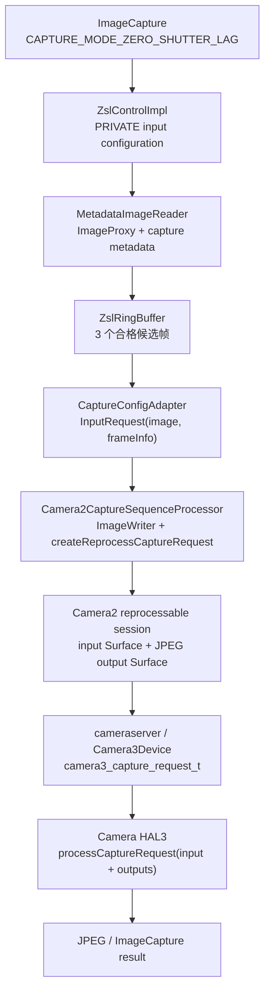

# 2.30 CameraX ZSL 与 HAL Reprocessing Request 的映射关系

本文的源码基线分成两部分：

- Android 平台：Android 17 / API 37 / `android-17.0.0_r1`；
- Jetpack CameraX：1.6.1，对应 AndroidX release 分支提交
  `987b9ac8585b31424a397206c492196dd163997b`；
- 涉及 dma-buf 观测时的内核基线：`android17-6.18-2026-06_r6`。

这两个版本号不能混用。CameraX 是独立发布的 Jetpack 库，应用即使运行在 Android 17
上，也可能使用更旧的 CameraX；同一个 CameraX 版本又要兼容多个平台版本。排查 ZSL
问题时，要同时记录设备系统版本、CameraX 版本、camera id 和已绑定的 use case。

## 1. 先把“零快门延迟”说准确

CameraX 的 ZSL 会在快门按下前持续保留候选帧。用户拍照时，CameraX 从候选帧中取出
一帧，把该帧及其 `TotalCaptureResult` 送回 camera reprocessing session，生成 JPEG
等输出。被选中的图像在按键之前已经完成 sensor exposure，所以它可以缩短“按键到
成像时刻”的间隔。

ZSL 没有消除后处理、JPEG 编码、文件写入和回调调度的耗时。两个时间指标应分开：

- **capture lag**：快门事件与所选帧 sensor timestamp 的差；
- **delivery latency**：快门事件到 `onImageSaved()` 或应用拿到 `ImageProxy` 的差。

所选帧可能早于快门事件，capture lag 因而可能是负值。delivery latency 通常仍为
正值。只统计 `takePicture()` 到回调的时间，会把 ZSL 的选帧收益和后处理耗时混在
一起。

### 1.1 三个容易混淆的概念

| 名称 | CameraX / Camera2 表达 | 含义 |
| --- | --- | --- |
| 低延迟拍照 | `CAPTURE_MODE_MINIMIZE_LATENCY` | 对新拍摄的 still request 偏向低延迟，不会自动启用 CameraX ZSL 缓存 |
| CameraX ZSL | `CAPTURE_MODE_ZERO_SHUTTER_LAG` | 缓存合格帧，并通过 Camera2 reprocessing 生成输出 |
| 设备侧 ZSL | `CaptureRequest.CONTROL_ENABLE_ZSL` | 由相机设备决定是否启用设备内部 ZSL，语义与应用管理的 reprocessing 不同 |

`TEMPLATE_ZERO_SHUTTER_LAG` 是 Camera2 request 模板。它用于给应用管理的 ZSL
提供一组默认控制参数，本身不代表已经有可用的缓存帧，也不代表每次拍照都会走
reprocessing。

## 2. CameraX 的公开用法

下面的示例只演示开启模式、保持闪光灯关闭和查询能力；应用仍要按自己的生命周期
保存 `ImageCapture` 实例。

```kotlin
import androidx.annotation.OptIn
import androidx.camera.core.CameraSelector
import androidx.camera.core.ExperimentalZeroShutterLag
import androidx.camera.core.ImageCapture
import androidx.camera.core.Preview
import androidx.camera.lifecycle.ProcessCameraProvider
import androidx.lifecycle.LifecycleOwner

@OptIn(markerClass = [ExperimentalZeroShutterLag::class])
fun bindForZsl(
    cameraProvider: ProcessCameraProvider,
    lifecycleOwner: LifecycleOwner,
    preview: Preview,
): Pair<ImageCapture, Boolean> {
    val imageCapture = ImageCapture.Builder()
        .setCaptureMode(ImageCapture.CAPTURE_MODE_ZERO_SHUTTER_LAG)
        .setFlashMode(ImageCapture.FLASH_MODE_OFF)
        .build()

    val camera = cameraProvider.bindToLifecycle(
        lifecycleOwner,
        CameraSelector.DEFAULT_BACK_CAMERA,
        preview,
        imageCapture,
    )

    return imageCapture to camera.cameraInfo.isZslSupported
}
```

`isZslSupported` 表示 camera id 具备 CameraX 所需的静态能力，并且没有命中
`ZslDisablerQuirk`。返回 `true` 也不能保证当前拍照一定采用 ZSL：VideoCapture、
Extensions、非 `FLASH_MODE_OFF` 状态以及运行时没有合格缓存帧都会使本次请求回退。
业务层应把它当作能力和观测信息，不能把 `false` 当成拍照失败。

CameraX 1.6.1 的 `CAPTURE_MODE_ZERO_SHUTTER_LAG` 仍带
`ExperimentalZeroShutterLag` 标记。升级 CameraX 时需要重新编译并回归，不应把实验
API 当成长期不变的二进制接口。

## 3. 从 CameraX 到 HAL3 的对应关系

下面的图用于定位每一层持有什么对象，以及 reprocessing 在哪里变成 HAL3 的
`inputBuffer`：



HAL3 没有名为 `processReprocessingRequest()` 的标准入口。普通请求与 reprocessing
请求都通过 `processCaptureRequest()` 提交；后者的区别是
`camera3_capture_request_t::input_buffer` 非空，同时仍带有目标 output buffers。

### 3.1 建立可重处理 session

`ImageCapture.createPipeline()` 在 API 23 及以上、capture mode 为 ZSL、stream spec
没有禁用 ZSL 时调用 `addZslConfig()`。CameraX 1.6.1 的
`ZslControlImpl.addZslConfig()` 会依次检查：

1. 当前 use case 组合是否禁用 ZSL；
2. 设备是否命中 `ZslDisablerQuirk`；
3. `REQUEST_AVAILABLE_CAPABILITIES_PRIVATE_REPROCESSING` 是否存在；
4. `ImageFormat.PRIVATE` 是否有输入尺寸；
5. PRIVATE 输入能否生成 JPEG 输出。

Camera2 平台同时定义 PRIVATE 与 YUV reprocessing 能力。CameraX 1.6.1 这条实现只
选择 PRIVATE reprocessing；不能因为设备声明
`REQUEST_AVAILABLE_CAPABILITIES_YUV_REPROCESSING` 就推断 CameraX ZSL 可用。

通过检查后，CameraX 选择 PRIVATE 输入尺寸中面积最大的一个，创建
`MetadataImageReader`，并给 session 设置同尺寸、同格式的
`InputConfiguration`。`MetadataImageReader` 的作用是按 timestamp 配对图像和
capture result；只有二者配对成功，后续才能用该 result 创建 reprocess request。

CameraX 1.6.1 在这里使用两个不同的数量：

- `RING_BUFFER_CAPACITY = 3`：最多保留 3 个合格候选帧；
- `MAX_IMAGES = RING_BUFFER_CAPACITY * 3`：`MetadataImageReader` 的上限为 9。

这两个值是库内部常量，没有 `ImageCapture.Builder.setBufferCount()` 之类的公开 ZSL
调节接口。旧稿中通过应用代码修改缓存深度的示例无法编译。

### 3.2 重复请求持续产生候选帧

ZSL 的 PRIVATE surface 被加入 session 输出。相机重复请求产生 PRIVATE 图像时，
`MetadataImageReader` 使用 `acquireLatestImage()` 获取新图，并送入
`ZslRingBuffer`。

`ZslRingBuffer` 只接受满足以下 3A 条件的帧：

- AF 为 `LOCKED_FOCUSED` 或 `PASSIVE_FOCUSED`；
- AE 为 `CONVERGED`；
- AWB 为 `CONVERGED`。

不合格帧会立即 `close()`。队列已满时，环形队列移除旧帧并调用同样的关闭回调。
所以低光、持续运动、对焦搜索或白平衡未稳定时，缓存可能暂时为空。ZSL 配置成功与
“快门时一定有候选帧”是两件事。

### 3.3 快门请求选帧并构造 `InputRequest`

ImageCapture 的默认 capture config 在 ZSL 模式下使用
`CameraDevice.TEMPLATE_ZERO_SHUTTER_LAG`。`CaptureConfigAdapter` 还会检查 use case
与 flash 两个禁用标志。条件允许时，它从环形队列取出一张 `ImageProxy`，再从
`imageInfo` 取出与其匹配的 `CaptureResultAdapter` / `FrameInfo`，组成
`InputRequest(image, frameInfo)`。

这一步没有把 buffer handle 写入某个公开的 `CaptureRequest.REPROCESSING_INPUT`
键。Camera2 API 也没有这个键。图像和 metadata 由 CameraPipe 的内部
`InputRequest` 成对携带。

### 3.4 CameraPipe 转成 Camera2 reprocess request

CameraX 1.6.0 起，Camera2 实现迁移到统一的 CameraPipe 栈；1.6.1 的实际提交路径在
`Camera2CaptureSequenceProcessor`。它执行两个相关动作：

- 把缓存的 PRIVATE `Image` 送入 reprocessable session 的 `ImageWriter`；
- 用对应 `FrameInfo` 解出 `TotalCaptureResult`，调用
  `CameraDevice.createReprocessCaptureRequest(totalCaptureResult)`。

`TotalCaptureResult` 很重要。Camera2 用它把输入帧当时的 sensor、3A 和处理 metadata
带入 reprocess request。只传一块图像内存、另行拼装一组无关参数，会失去输入图像
与采集状态的对应关系。

CameraPipe 随后给 builder 添加 JPEG 等目标 Surface，并通过
`CameraCaptureSession.capture()` 提交。`ImageWriter` 连接的是 session 的 input
Surface；JPEG `ImageReader` 等连接的是 output Surface。输入和输出负责不同方向的
buffer 传递。

### 3.5 Camera service 与 HAL3 看到什么

Android 17 的 `CameraDevice` 文档对 reprocess request 有三条约束：

- 它从当前 reprocessable session 的 input Surface 取得下一块 buffer；
- 它不会从 sensor 采集新图像；
- 输入图像必须来自同一 camera device、同一 session 先前的直接或间接输出。

进入 camera service 后，`Camera3Device::RequestThread` 为请求取 input buffer 和
各路 output buffer，形成 `camera3_capture_request_t`。AIDL HAL 路径中的
`AidlCamera3Device` 把 input stream id、buffer id、buffer handle 和 acquire fence
写入 `CaptureRequest.inputBuffer`；HIDL 兼容路径也做对应转换。两条路径都调用 HAL
session 的 `processCaptureRequest()`。

返回阶段，HAL 通过 capture result 交回 input buffer 状态、input release fence、
output buffers 和结果 metadata。camera service 把输入 buffer 还给 input stream，
各输出 buffer 则按各自 consumer 的协议继续流转。

## 4. Buffer 所有权：为什么 `ImageProxy.close()` 很关键

ZSL 环形队列里的每个 `ImageProxy` 都持有一张 PRIVATE 图像。候选帧还在队列中时，
这块 buffer 不能回到 producer 可用集合。CameraX 在以下位置释放引用：

- 帧不满足 3A 条件时；
- 环形队列淘汰旧帧时；
- ZSL 配置被清理或 use case 组合改为禁用时；
- reprocess request 完成、失败或被取消时。

`CaptureConfigAdapter` 给选中的 `ImageProxy` 安装请求 listener，在
`onComplete()`、`onFailed()`、`onAborted()` 或 total result 路径关闭它，并用原子
引用保证只关闭一次。这个兜底处理防止提交异常时占住 input buffer。

应用通常接触不到 CameraX 的 PRIVATE 候选帧，却仍可能在最终输出端制造回压：

- 使用内存回调拿到 `ImageProxy` 后没有及时 `close()`；
- 文件保存 executor 长时间阻塞；
- 同时绑定的 ImageAnalysis 使用阻塞策略且分析过慢；
- 频繁解绑、重绑 use case，使 session 和旧 buffer 的清理长期交叠。

PRIVATE buffer 的布局由 gralloc 与 HAL 决定，不能用 `width * height * 1.5` 精确计算
其物理占用。评估内存时要看 gralloc/dma-buf 分配、stream 数量、每条 stream 的
buffer 深度和是否存在旧 session，而不能套用 YUV420 的平面公式。

## 5. 自动回退发生在哪里

CameraX 把 ZSL 当作可回退的优化。下面这些情况会禁用或跳过它：

| 情况 | 1.6.1 行为 |
| --- | --- |
| API 小于 23 | 不创建 reprocessing 配置 |
| 缺少 PRIVATE reprocessing | `isZslSupported()` 返回 false，不建立 ZSL input |
| 命中 `ZslDisablerQuirk` | 报告不支持并使用普通预览 / 拍照路径 |
| 绑定 VideoCapture | stream spec 标记 ZSL disabled |
| 启用 OEM Extension | extension 配置禁用 CameraX ZSL |
| flash mode 不是 OFF | session 可保留，但本次拍照不取 ZSL 输入 |
| PRIVATE 输入不能输出 JPEG | 不建立 ZSL input |
| 环形队列为空或 metadata 缺失 | 无法构造 `InputRequest` |

当 `CaptureConfigAdapter` 没拿到 `InputRequest` 时，它把
`TEMPLATE_ZERO_SHUTTER_LAG` 改为常规 still capture template，再采集一张新图。对
调用方来说，这仍可能是一次成功拍照，只是 capture lag 变长。

因此业务代码不应设计“ZSL 失败就报拍照失败”的分支。更合适的做法是记录本次是否
具备 ZSL 条件，并按普通 still capture 可以完成来设计体验。

## 6. 诊断：证明本次是否走了 reprocessing

### 6.1 先记录配置事实

每次建立 camera session 时，至少记录这些字段：

- CameraX 版本和 Android build fingerprint；
- camera id、hardware level、PRIVATE reprocessing capability；
- `cameraInfo.isZslSupported()`；
- 已绑定的 use case，是否启用 Extensions；
- ImageCapture capture mode 与当前 flash mode；
- ImageCapture 的选定分辨率和最终输出格式。

CameraX 1.6.1 的 `ZslControlImpl` 会输出“private reprocessing 不支持”“选中的 ZSL
尺寸”“JPEG 不是有效输出”等日志。`CaptureConfigAdapter` / CameraPipe 还会记录
队列为空、创建 `ImageWriter` 失败、创建 reprocess request 失败等分支。调试包可将
CameraX 日志级别设为 DEBUG；量产包要控制日志量和隐私字段。

### 6.2 用时间轴区分选帧与交付

下面的伪代码用于说明测量点，`sensorTimestampNs` 需要从 capture metadata 或应用
自己的 Camera2 观测层取得，CameraX 的普通文件回调不会直接提供它。

```kotlin
data class ZslTiming(
    val shutterEventNs: Long,
    val selectedSensorTimestampNs: Long?,
    val callbackNs: Long,
) {
    val captureLagNs: Long?
        get() = selectedSensorTimestampNs?.let { it - shutterEventNs }

    val deliveryLatencyNs: Long
        get() = callbackNs - shutterEventNs
}
```

`captureLagNs` 回答“照片对应哪个时刻”，`deliveryLatencyNs` 回答“用户多久拿到
结果”。对比普通 still capture 时，两项都要保留；只看平均值还会掩盖队列为空时的
回退长尾。

### 6.3 Perfetto 和 dumpsys 看什么

Perfetto 录制应包含 camera、binder、sched、freq、memory/gralloc 相关数据源，并在
应用侧给快门事件、`takePicture()`、回调、保存完成添加 trace slice。分析时按这条
顺序检查：

1. 快门时是否已有稳定的 repeating results；
2. 是否出现 reprocessable input / ImageWriter 活动；
3. camera request 提交后，线程是在 HAL、fence、encoder 还是应用 executor 上等待；
4. JPEG output 到达后，应用回调与文件 I/O 是否又产生一段长延迟；
5. 多次拍照后，buffer 数和 dma-buf 占用是否回落。

`adb shell dumpsys media.camera` 可用于确认 active client、session streams、request
和错误状态。不同厂商 dump 字段不完全一致，不要依赖某个私有字段名写自动判定；
应将 dumpsys、CameraX DEBUG 日志与 Perfetto 时间轴互相对照。

## 7. 调优边界

### 7.1 应用能控制的部分

- 在需要 ZSL 的相机模式中保持 `FLASH_MODE_OFF`；
- 不要同时绑定会禁用 ZSL 的 VideoCapture 或 Extension，再期待 ZSL 仍生效；
- 让 ImageAnalysis 及时返回，优先选择适合实时分析的回压策略；
- 及时关闭应用收到的 `ImageProxy`；
- 避免在每次快门前后重建 use case 和 session；
- 以目标设备实测选择分辨率，不要假设最高分辨率一定能得到更低延迟；
- 同时统计 capture lag、delivery latency、回退率和错误率。

### 7.2 应用不能通过 CameraX 公共 API 控制的部分

- ZSL 环形队列的 3 帧容量；
- `MetadataImageReader` 的 9 张上限；
- PRIVATE buffer 的内存布局；
- HAL 内部去噪、锐化、JPEG 和厂商算法的执行单元；
- 某次 reprocessing 的固定毫秒预算；
- CameraX 设备 quirk 的启用条件。

旧稿给出的“CPU 转换 5–15 ms”“运动场景 120 fps”“某厂商成功率 98%”等数值没有
对应测试设备、trace 或源码依据，不能作为 Android 17 的平台结论。性能数字必须附
设备、camera id、分辨率、输出格式、CameraX 版本、温控状态、样本分布和 trace。

## 8. 常见误判

| 误判 | 源码事实 |
| --- | --- |
| `CAPTURE_MODE_MINIMIZE_LATENCY` 会开启 ZSL | ZSL 使用独立的 `CAPTURE_MODE_ZERO_SHUTTER_LAG` |
| CameraX 暴露 `REPROCESSING_INPUT` key | Camera2 没有该公开 key；CameraPipe 用内部 `InputRequest` 携带图像与 metadata |
| HAL3 有 `processReprocessingRequest()` | HAL session 使用 `processCaptureRequest()`，以非空 input buffer 区分 reprocessing |
| 支持 YUV reprocessing 就满足 CameraX ZSL | CameraX 1.6.1 的 `ZslControlImpl` 检查并使用 PRIVATE reprocessing |
| `isZslSupported() == true` 代表每次命中缓存 | use case、flash、3A 状态和队列可用性仍会触发回退 |
| ZSL 消除了拍照总耗时 | 它主要改变成像时刻；后处理、编码、I/O 与回调耗时仍存在 |
| 可以在 Builder 中设置 ZSL buffer 数 | 1.6.1 没有对应公共 API，容量是库内部常量 |
| PRIVATE buffer 可按 YUV420 公式精确估算 | PRIVATE 布局 opaque，必须结合 allocator 与 dma-buf 观测 |

## 9. 版本边界

Android 17 保留 Camera2 的 reprocessable session、`InputConfiguration`、
`createReprocessCaptureRequest()` 和 HAL3 input buffer 语义。本文的平台结论以
`android-17.0.0_r1` 为上限。

CameraX 1.6.0 将 Camera2 实现迁移到统一 CameraPipe 栈，1.6.1 延续这条路径。因此
分析旧版日志或堆栈时，类名可能不同；不能用旧实现中的类名否定 1.6.1 的行为。
`CAPTURE_MODE_ZERO_SHUTTER_LAG` 在 1.6.1 仍是实验 API，后续库版本可能调整内部队列、
quirk 和提交路径。升级时应重新核对对应 tag 的源码。

## 10. 源码核对入口

CameraX 1.6.1：

- `camera-core/.../ImageCapture.java`：ZSL 模式语义、自动禁用条件；
- `camera-core/.../CameraInfo.java`：`isZslSupported()` 契约；
- `camera-core/.../internal/utils/ZslRingBuffer.java`：3A 选帧条件；
- `camera-camera2/.../adapter/ZslControl.kt`：PRIVATE input、3 帧环形队列、9 张 reader
  上限；
- `camera-camera2/.../adapter/CaptureConfigAdapter.kt`：`InputRequest` 构造与普通拍照
  回退；
- `camera-camera2-pipe/.../compat/Camera2CaptureSequenceProcessor.kt`：
  `ImageWriter` 与 `createReprocessCaptureRequest()`。

Android 17：

- `frameworks/base/core/java/android/hardware/camera2/CameraDevice.java`：
  reprocessable session 与 reprocess request 契约；
- `frameworks/base/core/java/android/hardware/camera2/params/InputConfiguration.java`：
  输入 stream 的尺寸与格式；
- `frameworks/av/services/camera/libcameraservice/device3/Camera3Device.cpp`：
  request thread 获取 input buffer；
- `frameworks/av/services/camera/libcameraservice/device3/aidl/AidlCamera3Device.cpp`：
  input buffer、buffer id 与 fence 的 AIDL HAL 映射；
- `frameworks/av/services/camera/libcameraservice/device3/Camera3OutputUtilsTemplated.h`：
  result 侧 input buffer 和 release fence 回收。

公开版本与源码链接：

- [CameraX release notes](https://developer.android.com/jetpack/androidx/releases/camera)
- [CameraX 1.6.1 对应 AndroidX 源码](https://android.googlesource.com/platform/frameworks/support/+/987b9ac8585b31424a397206c492196dd163997b/)
- [Android 17 `CameraDevice.java`](https://android.googlesource.com/platform/frameworks/base/+/android-17.0.0_r1/core/java/android/hardware/camera2/CameraDevice.java)
- [Android 17 `Camera3Device.cpp`](https://android.googlesource.com/platform/frameworks/av/+/android-17.0.0_r1/services/camera/libcameraservice/device3/Camera3Device.cpp)

读源码时沿“候选帧进入队列 → 图像与 metadata 配对 → `InputRequest` →
`createReprocessCaptureRequest()` → HAL `inputBuffer` → input release fence”检查。
这条路径能解释一次拍照是否采用 ZSL，也能把选帧问题、session 配置问题、HAL
处理问题和应用输出回压分开。

<!-- outline-end -->
