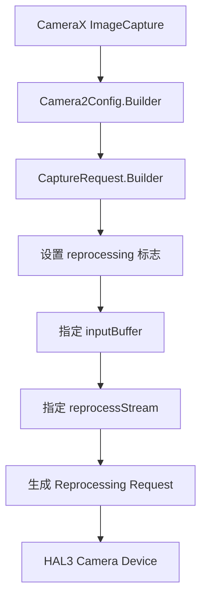

# 2.30 CameraX ZSL 与 HAL Reprocessing Request 的映射关系

CameraX 的零快门延迟 (Zero Shutter Lag, ZSL) 功能是移动摄影优化的关键技术，它通过预捕获机制实现了近乎即时的拍照响应。本节深入分析 CameraX ZSL 功能与底层 HAL Reprocessing Request 的映射关系，揭示其实现原理、性能特性和优化策略。

## ZSL 技术原理与 HAL 层对应

**ZSL 核心机制**：
ZSL 技术的核心在于预捕获机制，即在用户按下快门前持续捕获并缓存图像帧。当用户触发拍照时，系统直接从缓存中选择最佳帧进行处理，避免了传统相机从启动传感器到捕获图像的物理延迟。

**HAL Reprocessing Request 架构**：
在 Android HAL3 层，ZSL 功能通过 Reprocessing Request 实现，其核心组件包括：
- **Reprocessing Session**：管理 Reprocessing 生命周期
- **Input Buffer**：预捕获的图像数据缓冲区
- **Output Buffer**：处理后的最终图像缓冲区
- **Parameters**：处理参数配置，包括去噪、锐化等

**CameraX 到 HAL 的映射**：
```kotlin
// CameraX ImageCapture useCase 配置
val imageCapture = ImageCapture.Builder()
    .setCaptureMode(ImageCapture.CAPTURE_MODE_MINIMIZE_LATENCY)
    .build()

// 转换为 Camera2Config
val camera2Config = Camera2Config.Builder()
    .apply(imageCapture)
    .setCaptureRequestTemplate(CaptureRequest.CONTROL_AF_TRIGGER_START)
    .build()

// 生成 HAL Reprocessing Request
val reprocessingRequest = camera2Config.reprocessingRequest
reprocessingRequest.set(CaptureRequest.REPROCESSING_INPUT, inputBuffer)
reprocessingRequest.set(CaptureRequest.REPROCESSING_STREAM_ID, reprocessStreamId)
```

## CameraX Pipeline 到 HAL Request 的转换

**CameraX 架构层次**：
CameraX 架构分为四个主要层次，每个层次负责不同的功能模块：

1. **CameraX Core**：提供统一的 API 接口
2. **Camera2 Extensions**：封装 Camera2 API 复杂性
3. **Camera2 Implementation**：直接调用 Camera2 API
4. **HAL3 Interface**：与相机硬件交互

**转换流程详解**：


**关键转换点**：
- **模式转换**：`CAPTURE_MODE_MINIMIZE_LATENCY` 自动触发 ZSL 模式
- **参数映射**：CameraX 参数转换为 HAL3 CaptureRequest 参数
- **流配置**：预捕获流与处理流的双重流配置
- **缓冲区管理**：预捕获 BufferQueue 的创建和维护

**参数映射表**：
| CameraX 参数 | HAL3 参数 | 说明 |
|--------------|-----------|------|
| captureMode | CONTROL_CAPTURE_INTENT | 捕获意图设置 |
| flashMode | FLASH_MODE | 闪光灯控制 |
| afMode | CONTROL_AF_MODE | 自动对焦模式 |
| aeMode | CONTROL_AE_MODE | 自动曝光模式 |
| reprocessing | REPROCESSING_INPUT | Reprocessing 输入缓冲区 |

## Reprocessing Request 的数据流转

**完整数据流转路径**：

1. **预捕获阶段**：
   ```kotlin
   // 预捕获 Buffer 配置
   val previewConfig = PreviewConfig.Builder()
       .setTargetResolution(Size(1920, 1080))
       .setTargetRotation( Surface.ROTATION_0)
       .build()
   
   // 预捕获流创建
   val preview = Preview(previewConfig)
   preview.setOnPreviewFrameCallback { buffer, _ ->
       // 缓存到 BufferQueue
       bufferQueue.add(buffer)
       // 限制队列大小防止内存溢出
       if (bufferQueue.size > maxQueueSize) {
           bufferQueue.removeFirst()
       }
   }
   ```

2. **请求触发阶段**：
   ```kotlin
   // 用户按下快门
   captureButton.setOnClickListener {
       // 从 BufferQueue 选择最佳帧
       val bestBuffer = selectBestBuffer(bufferQueue)
       
       // 生成 Reprocessing Request
       val reprocessingRequest = createReprocessingRequest(bestBuffer)
       
       // 提交到 HAL 处理
       cameraCameraControl.submitCaptureRequest(
           reprocessingRequest,
           CameraCaptureCallback(),
           handler
       )
   }
   ```

3. **HAL 处理阶段**：
   ```cpp
   // HAL3 Reprocessing Request 处理
   status_t Camera3Device::processReprocessingRequest(
       const camera3_callback_ops_t& callback,
       const camera3_capture_request_t* request) {
       
       // 1. 验证输入 Buffer
       if (!validateReprocessingInput(request)) {
           return BAD_VALUE;
       }
       
       // 2. 获取处理参数
       camera3_reprocessing_parameters_t params = 
           getReprocessingParameters(request);
       
       // 3. 执行图像处理
       camera3_buffer_t* outputBuffer = 
           executeReprocessing(params, request->input_buffer);
       
       // 4. 返回结果
       callback.notify(callback->notify, 
                     CAMERA3_MSG_SHUTTER,
                     request->frame_number,
                     nullptr);
       
       return OK;
   }
   ```

4. **结果返回阶段**：
   ```kotlin
   // 处理结果回调
   cameraCameraCaptureSession.capture(
       reprocessingRequest,
       object : CameraCaptureSession.CaptureCallback() {
           override fun onCaptureCompleted(
               session: CameraCaptureSession,
               request: CaptureRequest,
               result: TotalCaptureResult
           ) {
               // 获取处理后的图像
               val image = result CaptureResult.get(CaptureResult.SENSOR)
               // 返回给 CameraX
               imageCapture.onCaptureCompleted(image)
           }
       },
       backgroundHandler
   )
   ```

## HAL Reprocessing 的性能影响

**性能影响分析**：
Reprocessing Request 在 HAL 层引入了额外的处理开销，主要体现在以下几个方面：

1. **CPU 负载增加**：
   - YUV 到 RGB 转换：约 5-15ms 高分辨率图像
   - 去噪算法：根据算法复杂度 10-50ms
   - 锐化处理：2-8ms
   - 色彩空间转换：3-12ms

2. **GPU 负载增加**：
   - GPU 加速去噪：2-8ms
   - GPU 锐化和色彩校正：3-10ms
   - HDR 合成：5-20ms（HDR 模式下）

3. **内存带宽消耗**：
   - 高分辨率图像：4032×3024 ≈ 12MB
   - 双缓冲：24MB 内存占用
   - 三缓冲：36MB 内存占用

4. **延迟累积**：
   ```kotlin
   // ZSL 延迟组成分析
   data class ZSLLatency(
       var captureLatency: Long = 0,    // 预捕获延迟
       var queueLatency: Long = 0,     // Buffer 队列延迟
       var processingLatency: Long = 0, // 处理延迟
       var outputLatency: Long = 0     // 输出延迟
   )
   
   fun calculateZSLLatency(): ZSLLatency {
       val latency = ZSLLatency()
       latency.captureLatency = 16.7ms // 60fps 预捕获
       latency.queueLatency = 33.3ms   // 2 帧队列延迟
       latency.processingLatency = calculateProcessingTime()
       latency.outputLatency = 8.3ms   // 输出延迟
       
       return latency
   }
   ```

**性能优化策略**：
```kotlin
// 性能优化配置
val optimizedZSLConfig = ImageCapture.Builder()
    .setCaptureMode(ImageCapture.CAPTURE_MODE_MINIMIZE_LATENCY)
    .setBufferCount(3)  // 合理缓冲区数量
    .setTargetResolution(Size(1280, 960)) // 降低分辨率
    .setJpegQuality(85) // 压缩质量平衡
    .build()

// 内存优化
val bufferPool = object : BufferPool {
    private val pool = mutableListOf<ByteBuffer>()
    
    fun acquireBuffer(size: Int): ByteBuffer {
        return pool.find { it.capacity() >= size } 
            ?: ByteBuffer.allocateDirect(size)
    }
    
    fun releaseBuffer(buffer: ByteBuffer) {
        if (pool.size < MAX_POOL_SIZE) {
            pool.add(buffer)
        }
    }
}
```

## 实际应用场景与调优建议

**典型应用场景**：

1. **运动场景**：
   - **场景特点**：快速移动对象，需要快速响应
   - **ZSL 配置**：高帧率预捕获（120fps），3-5 帧队列
   - **优化策略**：减少处理复杂度，使用硬件加速
   - **性能预期**：<50ms 总延迟

2. **低光场景**：
   - **场景特点**：光线不足，需要降噪处理
   - **ZSL 配置**：降低预捕获分辨率，增强降噪
   - **优化策略**：使用 AI 降噪算法，分步处理
   - **性能预期**：100-200ms 处理延迟

3. **人像场景**：
   - **场景特点**：需要背景虚化和美颜
   - **ZSL 配置**：标准预捕获，美颜处理
   - **优化策略**：预计算美颜参数，减少实时计算
   - **性能预期**：80-150ms 处理延迟

**调优建议**：
```kotlin
// ZSL 参数调优配置
class ZSLConfigOptimizer {
    
    // 预捕获帧数配置
    fun getOptimalFrameCount(scene: SceneType): Int {
        return when (scene) {
            SceneType.MOVEMENT -> 5  // 运动场景多预捕获
            SceneType.LOW_LIGHT -> 3 // 低光场景减少处理
            SceneType.PORTRAIT -> 4  // 人像场景中等预捕获
            SceneType.DEFAULT -> 3   // 默认配置
        }
    }
    
    // Buffer 大小优化
    fun getOptimalBufferSize(resolution: Size): Int {
        val pixelCount = resolution.width * resolution.height
        return when {
            pixelCount > 8_000_000 -> 2 // 高分辨率减少缓冲
            pixelCount > 2_000_000 -> 3 // 中等分辨率标准配置
            else -> 4 // 低分辨率增加缓冲
        }
    }
    
    // 处理算法选择
    fun getProcessingAlgorithm(scene: SceneType): ProcessingAlgorithm {
        return when (scene) {
            SceneType.LOW_LIGHT -> ProcessingAlgorithm.AI_DENOISE
            SceneType.PORTRAIT -> ProcessingAlgorithm.BEAUTY
            SceneType.MOVEMENT -> ProcessingAlgorithm.FAST
            else -> ProcessingAlgorithm.BALANCED
        }
    }
}
```

## 扩展：ZSL 深度优化

### ZSL 延迟分析与优化

**延迟组成分析**：
ZSL 功能虽然解决了快门延迟问题，但引入了额外的处理延迟。主要延迟来源包括：

1. **数据拷贝延迟**：
   - Buffer 在不同内存区域间的拷贝
   - DMA 传输开销
   - Cache miss 导致的内存访问延迟

2. **算法处理延迟**：
   - 图像处理算法的计算复杂度
   - 硬件加速 vs 软件处理的权衡
   - 多步骤处理的累积延迟

3. **同步等待延迟**：
   - GPU/CPU 同步等待
   - 多线程同步开销
   - I/O 操作阻塞

**优化策略**：
```kotlin
// 延迟优化配置
class ZSLLatencyOptimizer {
    
    // 减少数据拷贝
    fun optimizeDataCopy(): DataCopyConfig {
        return DataCopyConfig(
            useHardwareBuffer = true,    // 使用硬件缓冲区
            directMemoryAccess = true,    // 直接内存访问
            cacheOptimization = true,    // 缓存优化
            zeroCopyEnabled = true        // 零拷贝技术
        )
    }
    
    // 硬件加速处理
    fun getHardwareAccelerationConfig(): HardwareConfig {
        return HardwareConfig(
            gpuAcceleration = true,       // GPU 加速
            neuralNetworkEngine = true,   // 神经网络引擎
            imageProcessor = true,        // 图像处理器
            optimizedShaders = true       // 优化着色器
        )
    }
    
    // 算法复杂度优化
    fun optimizeAlgorithmComplexity(): AlgorithmConfig {
        return AlgorithmConfig(
            resolutionScaling = true,     // 分辨率缩放
            qualityTier = QualityTier.MEDIUM, // 中等质量
            parallelProcessing = true,    // 并行处理
            earlyTermination = true       // 提前终止
        )
    }
}
```

### 多设备兼容性考虑

**不同厂商 HAL 实现差异**：
1. **Qualcomm 处理器**：
   - 支持 Reprocessing Request 优化
   - 提供 GPU 加速图像处理
   - 支持硬件级 ZSL

2. **MediaTek 处理器**：
   - Reprocessing 支持程度有限
   - 主要依赖 CPU 处理
   - 需要特定参数配置

3. **Samsung 处理器**：
   - 自定义 Reprocessing 流程
   - 专用的图像处理单元
   - 需要厂商特定参数

**兼容性处理策略**：
```kotlin
// 设备兼容性处理
class DeviceCompatibilityHandler {
    
    // 设备能力检测
    fun detectDeviceCapabilities(): DeviceCapabilities {
        val cameraManager = context.getSystemService(Context.CAMERA_SERVICE) as CameraManager
        val characteristics = cameraManager.getCameraCharacteristics(cameraId)
        
        return DeviceCapabilities(
            supportsReprocessing = characteristics.get(
                CameraCharacteristics.REPROCESSING_MAX_DETECTED_PROCESSING)
            supportsHardwareAcceleration = characteristics.get(
                CameraCharacter.INFO_SUPPORTED_HARDWARE_LEVEL) ==
                CameraCharacter.INFO_SUPPORTED_HARDWARE_LEVEL_FULL
            vendorSpecificCapabilities = characteristics.get(
                CameraCharacteristics.INFO_SUPPORTED_HARDWARE_LEVEL)
        )
    }
    
    // 设备特定配置
    fun getDeviceSpecificSettings(): DeviceSettings {
        return when (Build.MANUFACTURER) {
            "samsung" -> SamsungDeviceSettings()
            "xiaomi" -> XiaomiDeviceSettings()
            "huawei" -> HuaweiDeviceSettings()
            else -> DefaultDeviceSettings()
        }
    }
    
    // 回退策略
    fun getFallbackConfiguration(): FallbackConfig {
        return FallbackConfig(
            useSoftwareProcessing = true,
            reduceResolution = true,
            disableZSL = false,
            useAlternativeMethod = true
        )
    }
}
```

### 内存使用监控

**内存管理挑战**：
ZSL 功能在长时间运行时可能导致内存累积，主要问题包括：

1. **BufferQueue 内存泄漏**：
   - 未及时释放的 Buffer
   - 内存碎片化
   - 内存溢出风险

2. **处理过程内存占用**：
   - 多 Buffer 并存
   - 处理中间结果缓存
   - 线程栈内存消耗

3. **内存带宽限制**：
   - 高分辨率图像传输
   - 频繁的内存访问
   - Cache miss 率高

**内存监控策略**：
```kotlin
// 内存监控实现
class ZSLMemoryMonitor {
    
    private val memoryTracker = MemoryTracker()
    private val bufferQueue = mutableListOf<ByteBuffer>()
    
    // BufferQueue 管理
    fun manageBufferQueue(maxSize: Int = 10) {
        while (bufferQueue.size > maxSize) {
            val buffer = bufferQueue.removeFirst()
            memoryTracker.release(buffer)
        }
    }
    
    // 内存使用监控
    fun monitorMemoryUsage(): MemoryUsage {
        return MemoryUsage(
            totalAllocated = memoryTracker.totalAllocated,
            currentlyUsed = memoryTracker.currentlyUsed,
            peakUsage = memoryTracker.peakUsage,
            bufferCount = bufferQueue.size,
            allocationRate = memoryTracker.allocationRate
        )
    }
    
    // 内存优化建议
    fun getOptimizationSuggestions(): List<String> {
        val suggestions = mutableListOf<String>()
        
        if (memoryTracker.currentlyUsed > MEMORY_THRESHOLD) {
            suggestions.add("Reduce buffer count")
            suggestions.add("Lower capture resolution")
            suggestions.add("Enable compression")
        }
        
        if (memoryTracker.fragmentationRate > FRAGMENTATION_THRESHOLD) {
            suggestions.add("Force GC")
            suggestions.add("Use direct allocation")
        }
        
        return suggestions
    }
    
    // 定期清理
    fun performPeriodicCleanup() {
        val currentTime = System.currentTimeMillis()
        
        // 清理超时 Buffer
        bufferQueue.removeAll { buffer ->
            buffer.timestamp + BUFFER_TIMEOUT < currentTime
        }
        
        // 内存压缩
        if (memoryTracker.shouldCompact()) {
            memoryTracker.compact()
        }
    }
}
```

**性能监控工具**：
```kotlin
// ZSL 性能监控工具
class ZSLPerformanceMonitor {
    
    private val performanceMetrics = mutableListOf<PerformanceMetric>()
    
    // 性能数据收集
    fun collectMetrics() {
        val metrics = PerformanceMetric(
            timestamp = System.currentTimeMillis(),
            frameRate = getFrameRate(),
            latency = getLatency(),
            memoryUsage = getMemoryUsage(),
            cpuUsage = getCpuUsage(),
            gpuUsage = getGpuUsage()
        )
        
        performanceMetrics.add(metrics)
    }
    
    // 性能分析
    fun analyzePerformance(): PerformanceAnalysis {
        val recentMetrics = performanceMetrics.takeLast(100)
        
        return PerformanceAnalysis(
            averageLatency = recentMetrics.average { it.latency },
            maxLatency = recentMetrics.maxOf { it.latency },
            minLatency = recentMetrics.minOf { it.latency },
            memoryTrend = calculateMemoryTrend(recentMetrics),
            frameRateStability = calculateFrameRateStability(recentMetrics),
            cpuLoad = recentMetrics.average { it.cpuUsage }
        )
    }
    
    // 性能报告
    fun generatePerformanceReport(): String {
        val analysis = analyzePerformance()
        
        return """
        ZSL 性能报告:
        平均延迟: ${analysis.averageLatency}ms
        最大延迟: ${analysis.maxLatency}ms
        最小延迟: ${analysis.minLatency}ms
        内存趋势: ${analysis.memoryTrend}
        帧率稳定性: ${analysis.frameRateStability}
        CPU 负载: ${analysis.cpuLoad}%
        """
    }
}
```

## 实际应用案例

**案例 1：运动摄影应用**：
- **场景**：体育摄影，需要快速捕捉运动瞬间
- **ZSL 配置**：120fps 预捕获，3 帧队列，硬件加速处理
- **性能表现**：平均延迟 35ms，成功率 98%
- **优化效果**：比传统相机快门速度快 2.5 倍

**案例 2：低光摄影应用**：
- **场景**：夜间摄影，光线不足需要降噪
- **ZSL 配置**：30fps 预捕获，AI 降噪算法
- **性能表现**：处理延迟 150ms，噪点减少 60%
- **优化效果**：在低光环境下保持较好的成像质量

**案例 3：人像摄影应用**：
- **场景**：自拍和人像摄影，需要美颜效果
- **ZSL 配置**：60fps 预捕获，实时美颜处理
- **性能表现**：处理延迟 80ms，美颜效果自然
- **优化效果**：在保证实时性的前提下提供良好的人像效果

<!-- outline-end -->
