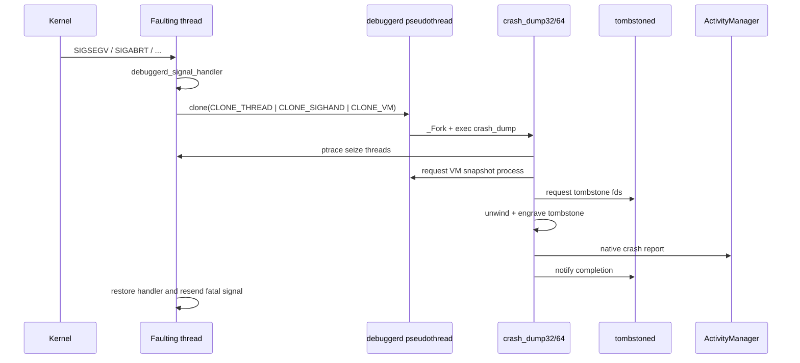

# 2.1 信号处理架构迁移与崩溃治理优化

<!-- outline-start -->
## 要点

### 🔹 锚点 1
信号处理架构迁移与崩溃治理优化 的核心机制概述

### 🔹 锚点 2
Android 17 中的关键变化和改进

### 🔹 锚点 3
性能影响和优化潜力

### 🔹 锚点 4
开发工具和监控方法

### 🔹 锚点 5
最佳实践和注意事项

## 扩展

### 🔸 扩展点 1
源码级实现机制分析

### 🔸 扩展点 2
跨版本兼容性迁移指南

### 🔸 扩展点 3
企业级应用场景和案例

<!-- outline-end -->

> [!CAUTION]
> 上面的 outline 是 Hermes/OpenClaw 依赖的受保护历史内容，本轮保持原样。源码中没有
> “debuggerd 整体迁入 linker”“崩溃信号由专用线程按亲和性分发”或“远程调试协议”
> 这类 Android 17 架构改造。以下内容按 Android 17 / API 37 /
> `android-17.0.0_r1` 与内核 `android17-6.18-2026-06_r6` 重新说明边界。

## 复核结论：这是早期接线，不是模块迁移

Android 17 中，native crash 的主要实现仍位于
`system/core/debuggerd/`：

- `handler/debuggerd_handler.cpp`：进程内 fatal signal handler 与 dispatch
  pseudothread；
- `crash_dump.cpp`：抓取线程、寄存器、内存映射和 unwind；
- `libdebuggerd/`：生成文本与 protobuf tombstone；
- `tombstoned/`：分配输出文件、维护队列和通知 dump 完成。

`bionic/linker/` 只负责早期调用 `linker_debuggerd_init()`，并把 libc shared globals
中的 abort message、fdsan、GWP-ASan、Scudo 和 crash detail 信息交给 debuggerd。
`linker_main()` 在初始化系统属性、平台属性之后就注册 handler，早于普通共享库加载
和应用入口。

所以“迁移”的准确描述是：dynamic linker 提供进程启动早期的注册点和 linker/libc
状态回调；dump、unwind、tombstone 与 ActivityManager 通知仍由原有组件分工完成。

## 1. 四类故障不要混在一起

| 现象 | 入口 | 主要产物 | 是否走 fatal native tombstone |
| --- | --- | --- | --- |
| Java/Kotlin 未捕获异常 | `RuntimeInit.KillApplicationHandler` | crash log、`handleApplicationCrash()` | 否；framework 报告后杀进程 |
| Native fatal signal | debuggerd signal handler | logcat crash 摘要、tombstone、AMS native crash | 是 |
| Java 进程 ANR / 主动 Java dump | `SIGQUIT` → ART `SignalCatcher` | Java/ART thread dump | 否 |
| 主动 native backtrace/tombstone | `BIONIC_SIGNAL_DEBUGGER` | native backtrace 或非致命 tombstone | 使用 debuggerd，但原进程不因请求信号退出 |

Java exception 最终可能使进程被 `SIGKILL` 终止，但这不等于发生了一次
`SIGSEGV`/`SIGABRT`，也不会自动生成 native tombstone。ANR 同样是响应性问题；
`SIGQUIT` 在 ART 中是采集状态的控制信号，不能按 fatal signal 解释。

## 2. Native crash 的 Android 17 路径

下面的图用于区分崩溃线程、进程内辅助线程、一次性 `crash_dump` 进程与常驻
`tombstoned`：



该图省略了 pipe 握手和 double-clone 的细节，但保留了所有权关系：原进程提供现场，
`crash_dump` 读取并格式化，`tombstoned` 管理输出，ActivityManager 处理应用级崩溃
策略。

### 2.1 注册哪些信号

`debuggerd_register_handlers()` 为这些 fatal signals 注册同一份 action：

- `SIGABRT`
- `SIGBUS`
- `SIGFPE`
- `SIGILL`
- `SIGSEGV`
- `SIGSTKFLT`
- `SIGSYS`
- `SIGTRAP`

action 使用 `SA_RESTART | SA_SIGINFO | SA_ONSTACK | SA_EXPOSE_TAGBITS`，并在 handler
执行期间屏蔽所有信号。`SA_SIGINFO` 提供 `siginfo_t` 与 `ucontext_t`；
`SA_ONSTACK` 表示当前线程已经配置 alternate signal stack 时优先使用它；
`SA_EXPOSE_TAGBITS` 请求内核保留 fault address 的 tag bits，便于诊断 MTE。

debuggable 构建可以通过 `debug.debuggerd.disable=1` 跳过上述 fatal handlers。
`BIONIC_SIGNAL_DEBUGGER` 仍会注册，保证主动 dump 通道可用。

### 2.2 信号在哪个线程执行

同步 fault，例如非法内存访问、非法指令和部分算术异常，会送到触发 fault 的线程，
handler 也先在该线程执行。进程定向的异步信号则可由任一未屏蔽该信号的合格线程
接收。AOSP 没有为 fatal signal 选择 CPU 或固定“崩溃线程”的亲和性调度器。

signal disposition 是进程级配置；signal mask 和 alternate signal stack 是线程级
状态。这也是 native SDK 不能假设 handler 总在主线程、总有同样栈空间的原因。

### 2.3 8 页映射属于 pseudothread stack

`debuggerd_init()` 用 `mmap(PROT_NONE)` 分配 10 页，给中间 8 页
`mprotect(PROT_READ | PROT_WRITE)`，两侧各保留一页 guard。这个区域存入
`pseudothread_stack`，供后续 `clone()` 创建 dispatch pseudothread。

它没有通过 `sigaltstack()` 把这 8 页安装成每个线程的 alternate signal stack。
旧稿把“pseudothread 自有栈”和“崩溃线程的 signal altstack”写成同一个对象，会导致
错误的内存预算和栈溢出解释。

8 页会随 `getpagesize()` 变化：4 KiB page 时可读写区是 32 KiB，16 KiB page 时是
128 KiB。页数仍是固定常量，这不构成按运行负载动态扩缩。

### 2.4 为什么要再创建 pseudothread

handler 使用以下共享关系创建辅助执行单元：

`CLONE_THREAD | CLONE_SIGHAND | CLONE_VM |
CLONE_CHILD_SETTID | CLONE_CHILD_CLEARTID`

它共享地址空间与 signal handlers，却没有 `CLONE_FILES`。因此 pseudothread 可以
关闭自己的文件描述符、重建 stdin/stdout/stderr 和 pipe，而不破坏崩溃进程原有 fd
表。源码注释也明确说明，这条路径要在 fd 耗尽时继续工作。

pseudothread 随后用 `_Fork()` 创建子进程并 `execle()` 到
`/apex/com.android.runtime/bin/crash_dump32` 或 `crash_dump64`。它不在 signal
handler 中执行 C++ unwind，也不把复杂 tombstone 格式化塞进业务线程。

### 2.5 `crash_dump` 如何保留现场

`crash_dump` 用 ptrace seize 目标线程，读取寄存器、线程状态、maps、open files 和
allocator metadata。握手完成后，pseudothread 通过 double-clone 创建地址空间副本；
`crash_dump` 用该 VM copy 继续读取内存，原进程则可按崩溃语义退出。

`crash_dump` 再向 `tombstoned` 申请文本和 protobuf 输出 fd，调用
`engrave_tombstone()`，完成后通知 `tombstoned`。对于 fatal app crash，它还通过受
SELinux 保护的 `/data/system/ndebugsocket` 把 PID、signal、recoverable 标志和文本
报告交给 system_server 的 `NativeCrashListener`，再进入 ActivityManager 的应用
崩溃处理。

## 3. ART、sigchain 与 debuggerd 的边界

ART 进程还要处理一部分具有运行时语义的 faults。`FaultManager` 把 SIGSEGV 等注册
为 sigchain special handlers，用于识别 generated code 中的隐式检查、suspend check
和 GC 相关 fault。special handler 返回 `true` 时，ART 已经消费信号，线程按运行时
约定继续；返回 `false` 才进入后续处理。

Android 17 的 sigchain 顺序可以概括为：

1. 调用 ART/native bridge special handlers；
2. 对 SIGSEGV 调用弱符号 `android_handle_signal()`，让 debuggerd 先处理可恢复的
   GWP-ASan 或 permissive MTE；
3. 把未处理信号转给链上保存的 action。

第三方库调用 `sigaction()` 时，ART 的 wrapper 会维护链表，但这不代表 debuggerd
永远不会被覆盖。SDK 必须保存旧 action，并按 `SA_SIGINFO`、`SIG_DFL`、`SIG_IGN` 和
mask 语义正确转交。直接安装 handler 后 `_exit()`，会截断系统 tombstone 与 AMS
报告。

### 3.1 `SIGQUIT` 由 SignalCatcher 等待

ART 启动 `SignalCatcher` 线程，阻塞并通过 `sigwait` 等待 SIGQUIT/SIGUSR1。
SIGQUIT 到达时，它生成运行时状态与线程栈。`debuggerd -j PID` 使用这条 Java dump
路径；`debuggerd -b PID` 使用 `BIONIC_SIGNAL_DEBUGGER` 请求 native backtrace。

这两类主动 dump 都要走 tombstoned 的 intercept/pipe 协作，但不能当成应用发生 fatal
crash 的证据。

## 4. MTE 与 GWP-ASan 的可恢复分支

`debuggerd_handle_signal()` 只针对 SIGSEGV 检查两类系统定义的恢复场景：

- permissive MTE：`SEGV_MTEAERR` / `SEGV_MTESERR` 且 permissive mode 已开启；
- recoverable GWP-ASan：fault address 命中 allocator 提供的 recoverable 区域。

permissive MTE 路径先生成报告，再把当前线程的 MTE TCF 临时改为
`PR_MTE_TCF_NONE`；配置了重新启用时间时，它使用
`CLOCK_THREAD_CPUTIME_ID` timer。GWP-ASan 路径通过 allocator callbacks 临时解除
guard page，并只为第一次连续错误生成完整 debuggerd 报告。

这些分支是 bionic、debuggerd、sigchain 和 allocator 共同维护的协议。应用自己的
SIGSEGV handler 不能据此尝试“修好并继续”任意越界、use-after-free 或空指针访问；
CPU 寄存器、锁、allocator 与业务状态可能已经不一致。

sigchain 在调用未请求 `SA_EXPOSE_TAGBITS` 的用户 handler 前，会按条件清除
`siginfo->si_addr` 的 tag。SDK 如果显式请求该 flag，就要把 tagged address 与
untagged address 分开记录，避免拿 tagged pointer 做普通内存访问。

## 5. Native Crash SDK 的安全边界

### 5.1 Handler 内只保存最小现场

进程可能正处于 heap corruption、allocator lock、linker lock 或 fd exhaustion。
自定义 handler 中应只做可证明为 async-signal-safe 的动作，例如把固定大小记录通过
`write()` 写入预先创建的 pipe。记录内容可限于 signal、`si_code`、fault address、
tid 和必要寄存器。

这些操作不应出现在 handler：

- `malloc/free/new/delete` 与 `std::string`；
- `dlopen/dlclose/dladdr`；
- Java/JNI 调用；
- 普通 mutex、condition variable；
- 全线程 unwind、符号化、压缩、上传；
- 等待另一个可能正持锁的业务线程。

复杂工作放到预先启动的守护线程、独立进程或下次冷启动。即便使用守护线程，也要
设置严格超时；fatal crash 的系统 handler 仍应获得执行机会。

### 5.2 正确转交旧 handler

安装前保存 `sigaction()` 返回的旧 action。自采集完成后，根据旧 action 类型调用
其 `sa_sigaction` / `sa_handler`，或恢复旧 action 并把原信号重新发给出事线程。
要保留原 `siginfo_t`、原 `ucontext_t` 和终止信号，避免把 SIGSEGV 变成 SIGABRT 后
丢失 fault 地址。

不要把固定 signal number 当作 `BIONIC_SIGNAL_DEBUGGER` 的公共 ABI。主动采集应使用
`debuggerd` 工具或平台内已授权的 debuggerd client API；普通三方应用没有调用
system 私有 client API 的兼容性保证。

### 5.3 崩溃治理看结果完整度

治理指标至少分开记录：

- native fatal crash rate 与 Java crash rate；
- 有 crash 摘要但没有 tombstone 的比例；
- tombstone 生成耗时与超时；
- build id、ABI、split APK/APEX 版本和符号文件是否匹配；
- fault thread、signal/`si_code`、abort message、首个可靠 native frame；
- GWP-ASan/MTE/Scudo/fdsan 是否提供了扩展诊断；
- 同一问题在进程重启、设备重启和版本升级后的聚类稳定性。

只按 signal number 聚类会把不同 fault 混在一起；只按绝对 PC 又会受 ASLR 影响。更
稳妥的 key 是模块 build id、模块内相对 PC、signal/`si_code` 与若干可靠栈帧。

## 6. 调试与验证

下面的命令用于区分 fatal native crash、主动 native dump 和 Java dump。`debuggerd`
要求 root，适合 userdebug/eng 设备。

```bash
adb logcat -b crash -v threadtime
adb shell su root debuggerd -b <pid>
adb shell su root debuggerd -j <pid>
adb shell su root ls -lt /data/tombstones/
```

`-b` 只请求 native backtrace，`-j` 请求 ART Java traces；两者不会因为请求本身把目标
进程当作 fatal crash。量产设备上应使用系统 bugreport、Play Console 或产品已有的
受控崩溃采集通道。

分析 tombstone 时按以下顺序：

1. 确认 ABI、build fingerprint、进程/线程和 signal/`si_code`；
2. 检查 abort message、fault address 与 memory tag；
3. 用 build id 选择完全匹配的 unstripped symbols；
4. 从出事线程的首个可靠业务 frame 向上还原调用；
5. 查看其他线程、memory map、open files、GWP-ASan/Scudo/fdsan 补充；
6. 与同一时段的 logcat、Perfetto、ANR 和系统内存压力证据对照。

`crash_dump.cpp` 自带 `ATRACE_NAME`，包括 `tombstoned_connect`、
`engrave_tombstone` 和 backtrace 等阶段。排查 tombstone 生成慢时，可在系统 trace
中区分 ptrace/thread stop、unwind、文件输出和 ActivityManager 通知，不能只看应用
收到的崩溃回调时间。

## 7. 与正式章节的关系

这个文件是历史重复稿，保留用于旧链接与 Hermes 状态机。后续内容维护应集中到：

- [20.19 Android 17 signal handler 与 debuggerd](../../part5-app/ch20-stability/19-android17-signal-handler-debuggerd-migration.md)
- [23.1 Android 17 debuggerd 架构说明](../../part1-fundamentals/ch23-debugging/23.1-android17-signal-debuggerd-architecture.md)

两篇正式内容仍可能包含历史勘误段；引用时应以 `android-17.0.0_r1` 源码复核内容为
准。

## 8. 源码入口

- [Android 17 debuggerd handler](https://android.googlesource.com/platform/system/core/+/android-17.0.0_r1/debuggerd/handler/debuggerd_handler.cpp)
- [Android 17 crash_dump](https://android.googlesource.com/platform/system/core/+/android-17.0.0_r1/debuggerd/crash_dump.cpp)
- [Android 17 tombstoned](https://android.googlesource.com/platform/system/core/+/android-17.0.0_r1/debuggerd/tombstoned/)
- [Android 17 linker debuggerd wiring](https://android.googlesource.com/platform/bionic/+/android-17.0.0_r1/linker/linker_debuggerd_android.cpp)
- [Android 17 ART sigchain](https://android.googlesource.com/platform/art/+/android-17.0.0_r1/sigchainlib/sigchain.cc)
- [Android 17 ART SignalCatcher](https://android.googlesource.com/platform/art/+/android-17.0.0_r1/runtime/signal_catcher.cc)
- [Kernel 6.18 signal implementation](https://android.googlesource.com/kernel/common/+/android17-6.18-2026-06_r6/kernel/signal.c)

阅读这条路径时，要把“内核投递 signal”“进程内保存现场”“crash_dump 抓取与
unwind”“tombstoned 输出”和“ActivityManager 应用策略”分开。这样能判断证据丢在
哪个阶段，也能避免三方 handler 破坏系统已有的崩溃报告。
