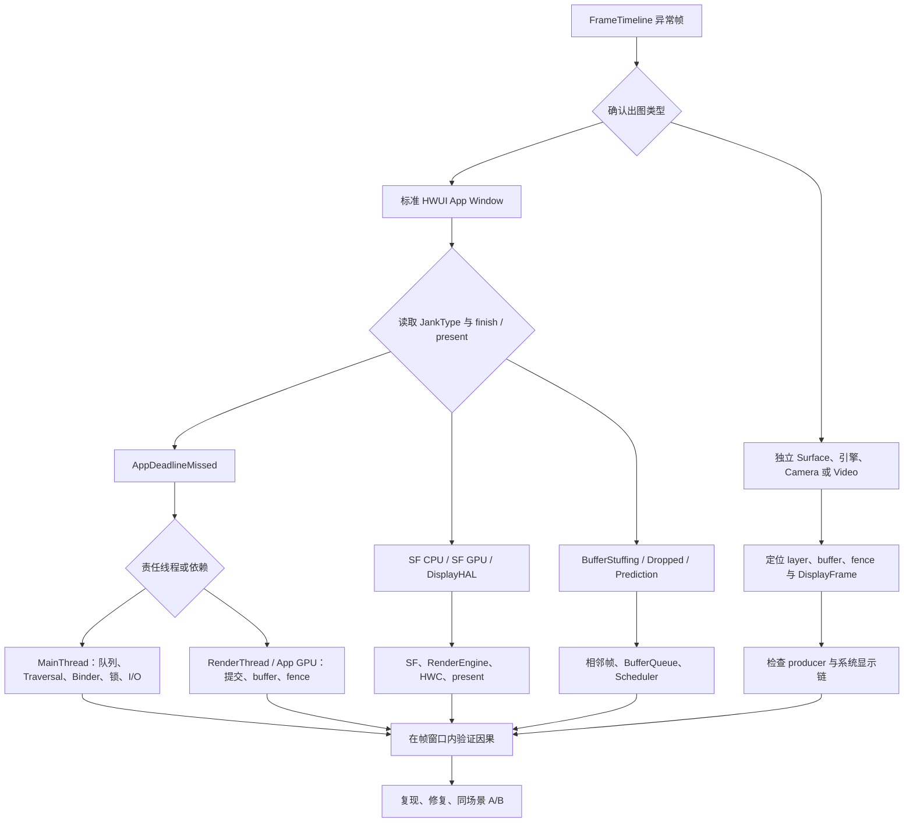

# 卡顿定义、分类与原因体系

卡顿需要相对具体刷新周期和帧截止时间定义。确认哪一帧晚到后，再沿主线程、RenderThread、GPU、SurfaceFlinger 和显示链路定位责任阶段。

## 帧截止时间、卡顿类型与统计口径

### 从用户描述到可验证问题

“页面有点卡”可能对应三类问题：画面节奏异常、输入到可见反馈过慢、应用没有在系统规定的时间内响应。它们都会破坏流畅体验，但要从不同的证据开始分析。

| 现象 | 工程口径 | 主要证据 |
|------|----------|----------|
| 滑动或动画出现停顿、跳变 | 渲染 jank（画面节奏异常） | FrameTimeline、Choreographer、RenderThread、SurfaceFlinger、HWC |
| 点击后很久才出现反馈，画面仍可能稳定 | 响应延迟 | Input（输入分发）、主线程消息、Binder、启动与业务处理路径 |
| 系统判定应用没有及时响应 | ANR（Application Not Responding，应用无响应） | ANR reason（系统记录的触发原因）、超时类型、主线程与相关进程栈、系统事件 |

三类问题可以在广义流畅性范围内一起治理，诊断时仍要保留各自边界。渲染慢帧不一定引发 ANR，平均 FPS（Frames Per Second，每秒帧数）正常也不能排除输入延迟。

### Jank 的 Android 17 口径

在 FrameTimeline（逐帧时间线）的语义里，一帧的实际呈现时间偏离 Scheduler（调度器）预测的呈现时间时，该帧会进入异常分类。偏离可能表现为帧间隔不稳定，也可能表现为画面节奏均匀、输入延迟却逐帧增加。因此，jank 分析要同时回答“何时完成”和“何时呈现”。

刷新周期给出最直观的时间尺度：

| 刷新率 | 相邻刷新周期 |
|--------|--------------|
| 60 Hz | 16.67 ms |
| 90 Hz | 11.11 ms |
| 120 Hz | 8.33 ms |

这些数字表示显示刷新周期，并非主线程（MainThread）、RenderThread 和 SurfaceFlinger 必须依次执行完毕的总耗时。Android 显示栈采用流水线：标准 HWUI（Android 硬件加速 UI 渲染器）窗口通常经过 `Choreographer#doFrame`（一帧 UI 工作的回调入口）、RenderThread（渲染线程）、BLASTBufferQueue（图形缓冲区队列）、SurfaceFlinger（系统合成服务）、HWC（Hardware Composer，硬件合成器）与 display present（显示提交）。每一段都有自己的调度窗口和同步边界。120 Hz 会缩短相邻刷新周期，但不能据此要求每个 slice（时间区间）都小于 8.33 ms；应比较该帧的 expected timeline、actual timeline、finish 状态与 present 结果。

同一个应用还可能存在多种出图路径。标准 App Window 的像素生产者通常在应用进程，SurfaceView、Camera、Video、Native Graphics、Flutter 或游戏可能使用独立 Surface、独立 layer（图层）或其他生产线程。分析前应确认四个对象：谁生产 buffer（图形缓冲区）、buffer 进入哪个 Surface、对应哪个 layer，以及由 HWC 还是 RenderEngine（SurfaceFlinger 的 GPU 合成引擎）完成相关合成。出图类型判断错误时，针对主线程或 RenderThread 得出的结论便无法覆盖整幅画面。

### FrameTimeline 如何描述一帧

Android 12 / API 31 起，SurfaceFlinger 的 FrameTimeline 会为应用提交的 SurfaceFrame（某个 Surface 的一帧）和最终显示侧的 DisplayFrame（一次显示合成帧）记录预测与实测时间。Surface 是应用向显示系统提交图形缓冲区的接口。Android 17 的实现锚点是 `frameworks/native/services/surfaceflinger/Scheduler/FrameTimeline.cpp`，类型定义位于 `frameworks/native/libs/gui/include/gui/JankInfo.h`。

#### Expected Timeline 与 Actual Timeline

应用侧 `Expected Timeline` 表示调度器为该 SurfaceFrame 预留的时间窗口，起点对应 Choreographer（按显示节奏安排帧回调的组件）计划运行回调的时间。`Actual Timeline` 从 `Choreographer#doFrame` 或 `AChoreographer_vsyncCallback` 开始，结束点取应用提交 buffer 和 GPU 完成时间中较晚的一个。SurfaceFlinger 也有自己的 expected/actual track（轨道），范围覆盖合成工作及显示栈下游的 present。

判断一帧时要一起读取以下字段：

- `Present Type`：early（早于预期）、on-time（按时）或 late（晚于预期）；
- `On time finish`：本侧工作是否在 deadline（截止时间）前完成；
- `Jank Type`：SurfaceFlinger 给出的原因位标志；
- `Prediction Type`：调度预测仍然有效还是已经过期；
- `GPU Composition`：该 DisplayFrame 是否使用 GPU 合成；
- `Layer Name` 与 `Is Buffer`：当前 slice 对应哪个 layer，以及它是否携带图形 buffer。

仅凭 actual slice 很长无法确定责任方。应用可能按时交帧，显示末端仍然晚；应用也可能晚交帧，但本次 present 受前一帧或 buffer 队列状态影响。`On time finish`、`Present Type` 和 `Jank Type` 需要放在同一个 SurfaceFrame / DisplayFrame 关系中解释。

#### SurfaceFrame token 与 DisplayFrame token

Perfetto SQL 同时提供 `surface_frame_token` 和 `display_frame_token`。token 是关联同一帧记录的标识：前者标识应用或 layer 的 SurfaceFrame，后者标识 SurfaceFlinger 组织的 DisplayFrame。一个 DisplayFrame 可以合成多个 layer frame，因此两类 token 不能互换。

应用 token 会出现在应用 timeline，并作为调试信息写入 `doFrame` 与 RenderThread slice；SurfaceFlinger 的显示工作也有对应 token。Perfetto 的 flow（跨轨道关联线）把应用 SurfaceFrame 指向参与合成的 DisplayFrame。可靠的做法是沿 flow 或两列 token 建立关系，不根据时间是否接近来猜测两条记录属于同一帧。

#### FrameTimeline 的覆盖边界

Perfetto 官方文档明确指出，FrameTimeline 对 SurfaceView 的支持仍然有限。独立 Surface、视频 overlay（硬件叠加层）、Camera、Native Graphics 等路径也可能缺少完整的应用 `doFrame` 关联。此时没有 App timeline，不代表没有渲染工作。

分析这类 trace（跟踪记录）时，应回到实际的出图对象，检查目标 layer、buffer 更新、acquire fence（等待生产完成的同步栅栏）、SurfaceFlinger latch（锁定本帧 buffer）、composition type（合成类型）、display present fence（显示完成栅栏）与 release fence（buffer 可再次使用的栅栏）。只有标准 HWUI 窗口适合把 App timeline、`doFrame` 和 RenderThread 当作一条完整主线。

### Android 17 的 JankType

`JankType` 是位标志：每一位代表一种原因，因此同一帧可以同时携带多个原因，UI 展示的字符串也可能组合多个值。以下表格以 `android-17.0.0_r1` 的 `JankInfo.h` 与 `FrameTimeline.cpp` 为准。表中的 SF 是 SurfaceFlinger，HAL（Hardware Abstraction Layer）是硬件抽象层，deadline 是本阶段按调度计划完成工作的截止时间。

| JankType | 值 | 表达的边界 | 诊断入口 |
|----------|----|------------|----------|
| `DisplayHAL` | `0x1` | SF 按时完成，而显示末端的 present 仍然偏离预期 | HWC、Composer HAL、present fence、显示驱动 |
| `SurfaceFlingerCpuDeadlineMissed` | `0x2` | SF 在 CPU / HWC 工作阶段错过 deadline | SF 主线程、HWC validate/present（验证合成方案/提交显示）、调度延迟 |
| `SurfaceFlingerGpuDeadlineMissed` | `0x4` | SF 使用 GPU composition（GPU 合成）时错过 deadline | RenderEngine、GPU queue（GPU 任务队列）、client target fence（GPU 合成目标的完成栅栏） |
| `AppDeadlineMissed` | `0x8` | 应用或应用提交的 GPU 工作没有按时准备好 | MainThread、RenderThread、GPU、queueBuffer（提交缓冲区）/acquire fence |
| `PredictionError` | `0x10` | VSync 预测与硬件节奏的偏差超出分类阈值 | Scheduler 预测、HW VSync（硬件垂直同步信号）、刷新率变化 |
| `SurfaceFlingerScheduling` | `0x20` | SF 的工作调度时机造成异常呈现 | SF 的 runnable/running（可运行/运行中）状态、wakeup（唤醒）与 latch 时序 |
| `BufferStuffing` | `0x40` | 前一 buffer 占用了本帧期望的呈现周期，后续 buffer 被推迟 | BufferQueue（缓冲区队列）深度，以及入队、latch、present 的顺序 |
| `Unknown` | `0x80` | 现有证据不足以归入已知原因 | 检查 trace 配置、fence 与上下文 |
| `SurfaceFlingerStuffing` | `0x100` | 前一 DisplayFrame 运行过长，把当前 SF frame 推迟到后续周期 | 连续 DisplayFrame 与 SF 工作时长 |
| `Dropped` | `0x200` | 更新后的 frame 替代当前 frame，当前 frame 未呈现 | App 与 SF 两侧的 dropped slice（未呈现帧区间）、buffer 替换关系 |
| `NonAnimating` | `0x400` | 呈现不准时，但内容不属于动画；源码不将其计入严重度计算 | layer 是否在动画或跟手交互路径 |
| `AppResyncedJitter` | `0x800` | 应用修改了该帧的 VSync time（垂直同步时间） | App frame timeline、resync（重新对齐）行为 |
| `DisplayNotOn` | `0x1000` | 屏幕关闭或处于 doze（低功耗待机） | display power state（显示电源状态） |
| `DisplayModeChangeInProgress` | `0x2000` | 显示模式切换进行中 | 刷新率、分辨率与 mode switch（模式切换）区间 |
| `DisplayPowerModeChangeInProgress` | `0x4000` | 显示电源模式切换进行中 | 亮灭屏与 power mode（电源模式）时序 |

源码中的 `calculateJankSeverity()` 还会把这些位分成参与严重度计算和仅描述状态的集合。`BufferStuffing`、`SurfaceFlingerStuffing`、`NonAnimating` 以及三类显示状态位不直接进入 jank 严重度计算，但仍有诊断价值。例如，Buffer Stuffing 常对应 Perfetto 的 high-latency state（高延迟状态）：帧间隔可能保持稳定，输入到显示的延迟却在增加。

Android 17 还定义了 `JankSeverityType`：`Partial` 表示超出 deadline 的部分小于一个应用 frame interval（帧间隔），`Full` 表示超出量达到或超过一个应用 frame interval。严重度计算依赖有效的 expected/actual present delta（预期与实际呈现时间差）；证据不足时为 `Unknown`。

#### App、SurfaceFlinger 与 Display 三层归因

工程排查可以把位标志按责任边界归成三层，但这只是导航，不应覆盖源码枚举：

- App 层关注 `AppDeadlineMissed`、`AppResyncedJitter`，并检查 UI 线程、RenderThread、应用 GPU 与 buffer 提交；
- SurfaceFlinger 层关注 CPU/GPU deadline、SF scheduling 与 SF stuffing，检查合成线程、RenderEngine、HWC 调用和调度；
- Display 层关注 `DisplayHAL` 及显示状态变化，检查 Composer HAL、present fence、显示模式与电源模式切换。

`PredictionError`、`Dropped`、`Unknown` 和 `BufferStuffing` 需要结合 SurfaceFrame、DisplayFrame 及相邻帧判断。直接归给单一进程，会遗漏形成结果所需的前后条件。

#### 颜色只用于导航

Perfetto 当前 UI 用绿色、浅绿色、红色、黄色和蓝色区分正常帧、高延迟状态、当前进程负责的 jank、应用无责的 jank 与 dropped frame（未呈现帧）。颜色属于界面展示约定，不能代替 `Jank Type`。工具版本、主题或可视化实现变化后，固定色值没有稳定的接口含义。分析记录应写出字段和 token，不应只写“红色帧”。

### 聚合指标的适用范围

#### Janky Frame Rate

`janky frames / observed frames` 表示异常帧数占观测帧数的比例，只有在分子、分母和场景定义一致时才可以比较。至少要记录刷新率、交互路径、统计窗口、是否包含启动过渡、帧来源与工具版本。把 60 Hz 与 120 Hz、持续滑动与页面首帧、标准 HWUI 与视频 overlay 混在一起，得到的数字便缺少解释力。

平均 FPS 只描述单位时间内呈现了多少帧。两个会话都可能是 50 FPS，其中一个帧间隔均匀，另一个却包含长停顿和密集补帧，体验差异很大。版本回归至少要同时保留帧间隔分布、jank 类型、最长连续异常区间和具体场景。

#### Slow frame 与 Frozen frame

Android vitals（Google Play 质量指标）对 View / Canvas UI 的传统渲染统计使用以下口径：slow frame（慢帧）的渲染时间位于 16 ms 到 700 ms，frozen frame（冻结帧）超过 700 ms。官方文档也说明，这组数据无法覆盖 Vulkan、Unity、Unreal、OpenGL 等绕过 Android UI Toolkit（界面工具包）的全部画面。

16 ms 是面向 60 FPS 的传统阈值。在 90 Hz、120 Hz 或动态刷新率设备上，FrameTimeline 的 expected/actual 结果更贴近该帧当时的调度条件。Frozen frame 的 700 ms 阈值适合发现严重停顿，但不能替代逐帧 deadline 归因。

#### ANR 属于另一套判定

系统会针对输入分发、广播、前台服务和 ContentProvider 等不同响应义务分别判定 ANR。超时时间受触发类型、进程状态和平台策略影响，“大于 5 秒就是 ANR”只适用于部分常见输入场景，不能作为通用公式。

一帧超过 700 ms 时，系统可能仍未触发 ANR；ANR 发生时也不要求应用正在绘制某一帧。二者可以由同一次主线程阻塞共同引发，结论仍要分别引用 FrameTimeline 或渲染统计，以及 ANR reason 与系统栈。

### 用户感知没有单一毫秒阈值

人对延迟和画面不连续的感知受任务影响。跟手滑动、手写、拖拽和游戏控制对时延更敏感；无交互的渐入动画、静态页面或视频播放采用不同的节奏与补偿机制。显示刷新率、触控采样、运动速度、运动模糊、连续异常帧数量也会改变感受。

因此，不能用“漏一帧通常无感”或“连续三帧必然可感知”给出跨设备结论。工程指标应从真实场景建立：记录输入事件到目标 layer 首次出现可见变化的延迟，再结合帧间隔、连续异常段和用户任务解释。电影的 24 FPS 也不适合作为 UI 流畅度下限，因为曝光产生的运动模糊、内容节奏和交互要求都不同。

### 一次可靠的 FrameTimeline 读取顺序

1. 复现单一场景，记录设备刷新率、显示模式、交互步骤和 trace 配置。
2. 确认出图类型：Producer（图形内容生产者）、Surface、layer、buffer 路径和合成方式。
3. 在应用 `Actual Timeline` 选择异常 SurfaceFrame，读取两类 token、layer、finish、present 与 jank 字段。
4. 沿 flow 找到 DisplayFrame，核对 SF actual/expected、GPU composition（GPU 合成）和 present 结果。
5. 根据位标志选择线程与子系统：App、SF CPU、SF GPU、HWC、display、buffer 或预测。
6. 在已经锁定的帧窗口内检查 Binder、调度、锁、I/O、GC（垃圾回收）、GPU queue 和 fence，避免从全局慢事件反推帧责任。
7. 观察相邻帧。Stuffing、Dropped、模式切换和预测偏差都依赖前后关系。

Binder transaction（Binder 调用）、GC 或某个长 slice 只能说明它与帧窗口重叠。要把它写成根因，还需证明它位于责任线程或依赖路径，并且足以解释 finish/present 的偏差。详细 SQL 与因果分析见 [7.2 卡顿分析方法、典型场景与案例](02-jank-methodology-scenarios-cases.md)，这里只说明归因规则。

### JankStats 的角色

AndroidX `JankStats` 用于应用内逐帧监测，可以把页面、交互状态等 UI context（界面上下文）随 `FrameData`（单帧数据）上报。它从 API 16 起提供基础能力，API 24 起使用更可靠的平台 timing（计时数据），API 31 起可以利用更丰富的帧信息。不同 API 级别的精度不同。

`jankHeuristicMultiplier` 使用当前 frame period（帧周期）计算库侧的启发式阈值，默认值为 `2`。因此，JankStats 默认不会把每个刚超过一个刷新周期的 frame 都报告为 jank。该阈值属于 AndroidX 库的监测策略，与 SurfaceFlinger 的 FrameTimeline 分类不是同一套口径。

线上数据适合回答“哪个 UI 状态经常出现异常帧”；Perfetto 适合回答“这一帧在 App、SurfaceFlinger、HWC 或显示末端发生了什么”。常见流程是先用 JankStats 或回归平台定位高风险场景，再采集 trace 完成单帧归因。

### 与其他章节的关系

- [2.1 Android 渲染架构与版本演进](../../part1-fundamentals/ch02-rendering/01-rendering-architecture-evolution.md)：理解应用生产、SurfaceFlinger 合成与显示提交。
- [Android 17 FrameTimeline、FrameTracer 与合成边界](../../part1-fundamentals/ch02-rendering/17-android17-frametimeline-composition-boundary.md)：查看 FrameTimeline、FrameTracer、TimeStats 与 JankTracker 的职责边界。
- [渲染管线总览](../ch18-rendering-pipelines/01-android-view-pipeline-analysis.md)：按 Producer、Surface、layer 与合成路径识别出图类型。
- [7.1 卡顿定义、分类与原因体系](01-jank-definition-causes.md)：从归因类型进入 CPU、GPU、调度、同步与 buffer 根因。
- [7.2 卡顿分析方法、典型场景与案例](02-jank-methodology-scenarios-cases.md)：把异常帧、线程状态和子系统证据组织成可复现结论。
- [FrameTimeline Perfetto 分析](../../part3-tools/ch13-perfetto/13-frametracer-frame-timeline.md)：补充 trace 配置与 SQL 查询。

## 从应用工作到系统显示的原因树

分类给出异常现象，原因分析还要落实到帧生产、调度、缓冲区和合成。相同帧时长可能来自不同责任阶段。

### 原因分析从责任边界开始

一次异常帧中常会同时出现长方法、Runnable 状态下的调度等待、Binder transaction（Binder 调用）、GC（垃圾回收）、GPU busy（GPU 忙碌）和 late present（延迟呈现）。Runnable 表示线程已经可以运行，但尚未获得 CPU。它们出现在同一个时间窗口，不代表每个事件都是根因。可复核的结论至少要回答三个问题：

1. 哪个 SurfaceFrame（某个 Surface 的一帧）或 DisplayFrame（一次显示合成帧）偏离了 expected timeline（预期时间线）；
2. 偏差产生在 App、SurfaceFlinger、HWC（Hardware Composer，硬件合成器）/display（显示末端），还是跨帧的 buffer（图形缓冲区）节奏；
3. 哪个事件位于该责任方的依赖路径，并能解释 finish（工作完成）或 present（画面呈现）为什么变晚。

标准 HWUI（Android 硬件加速 UI 渲染器）窗口通常沿 `Choreographer#doFrame → ViewRootImpl traversal → RenderThread → BLASTBufferQueue → SurfaceFlinger → HWC → present` 观察。SurfaceView、WebView、Camera、Video、Flutter、游戏和 Native Graphics 可能改变 Producer（图形内容生产者）、Surface（图形缓冲区提交接口）或 layer（图层）的组织方式。缺少 App FrameTimeline（应用逐帧时间线）时，应转向目标 layer、buffer、fence（同步栅栏）与 DisplayFrame，不能继续把主线程当作唯一入口。

### App 主线程原因

`AppDeadlineMissed` 说明应用侧没有按时准备好 frame。责任可能位于 MainThread（主线程）、RenderThread（渲染线程）、应用 GPU 或 buffer 提交边界，因此还要结合线程状态和调用上下文继续判断。

#### 消息排队与回调执行

主线程变慢包含两种时间：消息已经到期却迟迟没有开始分发，以及 callback（回调）开始后执行过久。前者是 delivery delay（投递延迟），常见原因包括前一条消息执行过久、同步屏障与异步消息的关系、主线程阻塞或调度不足；后者是 dispatch duration（分发耗时），常见原因包括 callback 自身的计算、I/O、锁或同步 IPC（进程间通信）。

看到 `Choreographer#doFrame` 开始较晚，应向前检查 Looper（消息循环）队列与主线程状态。看到 `doFrame` 内部耗时较长，再分别检查 Input（输入）、Animation（动画）、Insets Animation（系统栏等区域的动画）、Traversal（测量、布局和绘制遍历）与 Commit（提交）阶段。把两种情况都写成“绘制慢”，会漏掉队列拥塞和业务消息延迟。

#### Measure、Layout 与 Draw

Traversal 变长时，常见触发条件包括大范围 `requestLayout()`、复杂的 ViewGroup 测量策略、同一帧多次请求布局、过大的 View 树、自定义 `onMeasure()` / `onLayout()`，以及软件 Canvas 上的 CPU 绘制。View 层级没有跨项目通用的“超过多少层必卡”阈值，节点数量、测量次数、可见区域和自定义代码更能解释实际成本。

`invalidate()` 请求重绘，`requestLayout()` 请求重新确定尺寸和位置；两者在硬件加速窗口里都受 ViewRootImpl 与 HWUI 记录过程影响。诊断时应记录哪段代码触发请求、该帧执行了几次 traversal、每次覆盖哪些节点，避免只凭 API 名称判断成本。

#### RecyclerView

列表滑动期间要分开观察 `RV onBindViewHolder`（绑定列表项）、`RV CreateView` / inflate（创建视图）、prefetch（预取）、layout 和图片管线。常见原因包括 bind 内同步格式化或 IPC、缓存未命中后创建 ViewHolder、图片尺寸不合适、更新范围过大，以及 item animator（列表项动画）与 layout 在同一帧叠加。

`DiffUtil` 或 `AsyncListDiffer` 的 diff（列表差异）计算通常可以放到后台 executor（任务执行器），但结果分发、ViewHolder 绑定和布局仍会回到主线程。`areItemsTheSame()` / `areContentsTheSame()` 是否阻塞当前帧，要以所用组件、executor 和 trace（跟踪记录）中的执行线程为准。

#### I/O、锁与同步 Binder

文件、数据库、网络与同步 `fsync()` 进入帧路径后，线程可能处于 Running（运行中）、Sleeping（睡眠）或 Uninterruptible Sleep（不可中断睡眠）状态。`SharedPreferences.commit()` 会同步等待写入；`apply()` 先在调用线程更新内存并安排异步写盘，仍可能在生命周期收尾、任务排队或大量序列化时产生开销。两者的磁盘行为不能混为一谈。

分析 Java monitor（对象监视器）竞争时，应找到 waiter（等待者）与 owner（持有者）。Perfetto 的 monitor contention（监视器竞争）数据、线程状态和调用栈可以建立双方关系；native mutex（本地互斥锁）、condition variable（条件变量）和其他 futex（快速用户态互斥锁）等待，还要结合 `blocked_function`（阻塞函数）与唤醒源。Runnable 表示线程已具备运行条件但尚未获得 CPU，并不表示它正在等锁。

同步 Binder 会阻塞调用线程，直到服务端完成并返回。要把它归为某帧的根因，客户端 transaction 必须与责任线程的帧窗口重叠，并且可以沿 flow（跨轨道关联线）找到服务端执行、排队、锁等待或嵌套调用。只统计某个进程的 Binder 次数，无法证明它引发了 jank。

#### Android 17 DeliQueue

Android 17 / API 37 为 target SDK 37 及以上的应用默认启用新的 lock-free（无锁）`MessageQueue`。`android-17.0.0_r1` 的 `CombinedDeliMessageQueue/MessageQueue.java` 定义了 `USE_NEW_MESSAGEQUEUE = 421623328L`，并以 `@EnabledAfter(BAKLAVA)` 表达 target SDK 边界。应用进程会在启动时选定实现；compat override（兼容性覆盖配置）或平台 flag（开关）仍能改变选择结果。

DeliQueue 的 producer（消息生产者）通过 `MessageStack` 的 CAS（Compare-And-Swap，比较并交换）操作将消息入栈，Looper 线程再在 `heapSweep()` 中把消息整理到同步和异步两个 `MessageHeap`。它减少了 legacy（旧版）`MessageQueue` 单一 monitor 上的竞争，但不会消除 callback 执行过久、业务锁、Binder、I/O 或 CPU 调度延迟。调试版本可以用命令 `adb am compat enable USE_NEW_MESSAGEQUEUE <package>` 做 A/B 对照，切换后应重启进程。

### RenderThread 与应用 GPU 原因

MainThread 记录并同步显示状态后，RenderThread 负责 HWUI 渲染提交和部分 buffer 生命周期工作。`DrawFrame` 变长可能来自 RenderThread 的 CPU 工作，也可能是等待 GPU、buffer slot（缓冲区槽位）或 fence。GPU 命令采用异步提交，因此 RenderThread 的 slice（时间区间）较短也不能证明 GPU 已经按时完成。

#### RenderThread CPU 工作

复杂 Path 的细分、阴影与模糊、文字 glyph（字形）准备、DisplayList（绘制指令列表）处理、纹理上传准备和离屏 layer，都可能增加 RenderThread 的 CPU 时间。`Canvas.saveLayer()` 往往会引入中间渲染目标和额外 pass（渲染遍次），但具体成本取决于边界、像素格式、效果和图形后端；不能把所有 clip（裁剪）或圆角 API 都等同于 `saveLayer()`。

首次显示大 Bitmap 时，应区分后台 decode（解码）、MainThread 状态更新、RenderThread texture upload（纹理上传）与 GPU 采样。只有在 trace 或 GPU 工具证明具体哪一段变长后，才能据此决定是否调整解码尺寸、缓存、预热或绘制方式。

#### GPU 执行与 fence

GPU 压力常来自高分辨率 fill（像素填充）、overdraw（重复绘制）、复杂 fragment shader（片元着色器）、多 pass 效果、频繁切换 render target（渲染目标）、纹理带宽，以及多个图形 workload（工作负载）争用。证据应包括应用 GPU queue（GPU 任务队列）、GPU completion（GPU 完成时间）、acquire fence（缓冲区可读取栅栏）、频率与利用率，以及 FrameTimeline 的 App finish 状态。

GPU busy 只能说明设备处于忙碌状态。要归因到目标帧，还需把 GPU submission（任务提交）、buffer 或 fence 与该 SurfaceFrame 关联。SurfaceFlinger 使用 RenderEngine 做 CLIENT composition（客户端合成）时也会占用 GPU；应用工作负载与系统合成工作负载可能相互推迟。

### BufferQueue 与背压

BufferQueue 在 Producer（生产者）与 Consumer（消费者）之间传递图形 buffer。backpressure（背压）表示下游没有及时释放 buffer 或消费数据，导致上游无法继续取得可用槽位。

buffer 路径会把上游慢帧传播到后续帧。以下等待含义不同：

| 观察点 | 可能含义 | 需要补的证据 |
|--------|----------|--------------|
| `dequeueBuffer` 或 swap（交换前后缓冲区）等待 | 没有可复用 slot、release fence（buffer 可复用栅栏）未 signal（发出完成信号）、队列出现 backpressure | slot 状态、release fence、前几帧 present |
| `queueBuffer` / transaction 变晚 | Producer 交付晚、跨进程调用或 transaction 排队 | producer 线程、buffer id、transaction 与 SF 接收时间 |
| acquire fence 未就绪 | Consumer 还不能读取该 buffer | fence 来源、GPU / 硬件 producer 完成时间 |
| SF latch 使用旧 buffer | 新 buffer 不满足本轮选择条件 | layer snapshot（图层快照）、desired present（期望呈现时间）、fence 与 latch |
| `BufferStuffing` | 前一 buffer 占用了当前期望呈现周期，延迟向后传播 | 相邻 SurfaceFrame、DisplayFrame 与队列深度 |

在标准 BLAST App Window 中，BLASTBufferQueue 位于应用进程，buffer update 再通过 SurfaceControl transaction 送到 SurfaceFlinger。因此，`dequeueBuffer` / `queueBuffer` 变长不能直接写成“SurfaceFlinger 主线程正在合成”；它可能在等待 slot、fence、producer/consumer IPC 或 transaction 条件。详见 [BufferQueue 阻塞的 Perfetto 分析](../../part3-tools/ch13-perfetto/10-bufferqueue-blocking-perfetto.md)。

### SurfaceFlinger、HWC 与显示末端

应用按时交帧后，异常仍可能归因于 SF（SurfaceFlinger）或 Display（显示末端）。此时应从 DisplayFrame 开始，检查 SurfaceFlinger 的 transaction 消费、layer snapshot、latch、composition strategy（合成策略）、RenderEngine、Composer HAL（显示合成硬件抽象层）与 present fence。

#### SurfaceFlinger CPU 与 GPU deadline

`SurfaceFlingerCpuDeadlineMissed` 表示 SF CPU / HWC 阶段未按时完成。高风险工作包括处理大量可见 layer 和 transaction、复杂的几何或可见性计算、调度延迟、锁等待，以及 HWC validate/present（验证合成方案/提交显示）路径变长。

`SurfaceFlingerGpuDeadlineMissed` 表示 SF 在使用 GPU composition（GPU 合成）时错过 deadline（截止时间）。应检查 RenderEngine client composition（客户端合成）、client target GPU fence（GPU 合成目标的完成栅栏）、显示色彩处理和 GPU 争用。App RenderThread 正常，不能排除这类系统 GPU 瓶颈。

#### DEVICE 与 CLIENT composition

HWC 会为每一帧的每个 layer 决定 DEVICE 或 CLIENT 等 composition type（合成类型）。DEVICE 表示由显示硬件处理；CLIENT layer 则先由 SurfaceFlinger 的 RenderEngine 合成为 client target（客户端合成目标），再交给 HWC 与其余 layer 一起 present。CLIENT 会增加 GPU 合成工作，但不能笼统描述为一次“显存到显示控制器的额外拷贝”。

plane（硬件叠加平面）数量、缩放、旋转、混合、色彩空间、HDR（高动态范围）、受保护内容、带宽和 layer overlap（图层重叠）都会影响 HWC 决策。AOSP 文档给出通用能力要求，具体可用 plane 及其约束由设备实现决定。即使某款 SoC（片上系统）宣称有四个或六个 plane，也不能把这个数字直接用于不同固件版本的诊断。

FrameTimeline 的 `jank_type`、`present_type`、`layer_name` 和 `on_time_finish` 用于锁定异常帧，但这些字段不提供每个 layer 的 composition type。还要结合 SurfaceFlinger trace、Winscope layer snapshot（图层快照）、RenderEngine slice 或设备上的 `dumpsys SurfaceFlinger`。输出格式和可见字段会随版本与厂商实现变化。

#### DisplayHAL、模式切换与 present

`DisplayHAL` 表示 SF 已经按时准备好，但显示末端的呈现仍偏离预期。应检查 Composer HAL 调用、present fence、显示驱动、刷新率或分辨率切换，以及 power mode（电源模式）。即使 CPU 频率下降或某个 App 方法变长与它同时发生，也只能作为背景信息。

### 系统级放大因素

#### CPU 调度延迟

Running 表示线程正在 CPU 上执行；Runnable 表示线程已经可以运行，但尚未被调度器选中；Sleeping 和 Uninterruptible Sleep 分别表示可中断等待与内核不可中断等待。诊断调度延迟时，要计算从 wakeup（唤醒）到首次 running 的间隔，并观察目标 CPU 上的竞争线程、优先级、调度组、核心容量和迁移情况。

后台线程数量本身不是证据。只有当这些线程消耗了目标核心的 CPU、内存带宽、锁或其他共享资源，而且时间上与责任线程的 wakeup latency（唤醒延迟）吻合时，才能用于解释 jank。优化方向可能是减少工作量、调整任务时机或修正线程优先级，不能看到 Runnable 就直接提升优先级。

#### ART GC、分配与内存压力

现代 ART（Android Runtime，Android 运行时）垃圾收集器的大量工作会与应用并发执行，只在特定阶段暂停 mutator（执行应用代码并修改堆对象的线程）。分析时应读取 GC 类型、pause slice（暂停区间）、并发阶段，以及目标线程是否在帧窗口内被暂停，不能把整个 GC duration（持续时间）都计入主线程停顿。

高频分配会增加 allocator（内存分配器）与 GC 工作，但不能在没有数据时把少量临时对象直接定为问题。应重点关注每帧分配量、young/full collection（年轻代/全堆回收）、pause 分布、大对象、堆增长和失败重试。Android 17 的 generational GC（分代垃圾回收）继续降低常见 young collection 的成本，但暂停和内存压力仍然存在。

系统内存紧张还会带来 file fault（文件页缺页）、direct reclaim（当前线程直接回收内存）、compaction（内存规整）、swap/zram（交换空间/内存压缩交换设备）、I/O 与进程回收。`lmkd`（低内存终止守护进程）杀死后台进程，与应用自身 GC 属于不同机制。将两者概括成“低内存触发前台 GC”缺少必要的因果证据；应分别验证 ART heap（堆）状态和 kernel（内核）内存压力。涉及 PSI（Pressure Stall Information，资源压力停顿信息）、reclaim 与调度时，kernel 源码锚点为 `android17-6.18-2026-06_r6`。

#### 温控、DVFS 与持续负载

温控策略由 SoC、传感器、机身设计和 OEM（设备厂商）配置决定，不存在通用的 45 °C 或 60 °C 卡顿阈值。trace 中 CPU/GPU 频率下降也可能来自负载降低、governor（频率调节策略）决策或电源策略。可靠结论应按时间对齐 Thermal status/headroom（温控状态/剩余温控余量）、cooling state（冷却设备状态）、频率、利用率，以及相同 workload 下的帧耗时变化。

ADPF（Android Dynamic Performance Framework，Android 动态性能框架）的 `PerformanceHintManager` 会向系统报告线程组、目标时长和实际工作时长，系统据此分配资源。performance hint（性能提示）不承诺固定频率或固定核心，也不能越过 thermal safety limit（温控安全限制）。遇到持续温控压力时，还要降低画质、分辨率、更新率或工作量，使性能维持在设备能够持续承受的范围内。

### WebView、多窗口与交互场景

WebView 同时涉及宿主主线程、Chromium renderer（渲染进程）/compositor（合成组件）、GPU process（GPU 进程）和 Android Surface。页面脚本、布局、栅格化、纹理上传或宿主 View traversal 都可能延迟。分析时应先识别 WebView 对应的 layer 和进程，再沿 buffer 与 fence 判断像素由谁生产；只看宿主 `onDraw()` 会漏掉 Chromium 侧的工作。

多窗口和分屏会增加可见 layer、transaction、分辨率变化与多个应用的 CPU/GPU 工作负载，但不一定会触发 CLIENT composition。应比较进入多窗口前后的 HWC 决策、DisplayFrame、GPU queue，以及每个可见应用的 SurfaceFrame。独立路径详见 [Android View 多窗口渲染](../../part1-fundamentals/ch02-rendering/10-multiwindow-desktop-rendering.md)。

跟手滑动、手写和手势导航还要检查 input-to-display latency（输入到显示延迟）。只有串起 InputDispatcher（系统输入分发器）送达、应用消费、状态更新、目标 layer 变化与 present，才能得到端到端结论。`doFrame` 时长呈锯齿状，只能描述 App slice 的波动，不足以解释输入链路或显示末端。

### 从异常帧到根因的分析树

下面的决策树用于选择证据入口，避免从一个长 slice 直接跳到根因结论。

这棵树用于约束排查顺序。每条分支都要回到同一个 frame window（帧时间窗口），并用 token（帧标识）、flow、thread state（线程状态）、buffer id 或 fence 建立关系。找不到关系时，只能把相应事件保留为候选原因。

#### 证据强度

| 强度 | 例子 | 能下的结论 |
|------|------|------------|
| 直接证据 | 责任线程在帧窗口内被同步 Binder 阻塞，服务端 flow 与延迟吻合 | Binder 位于该帧关键路径 |
| 组合证据 | SF GPU deadline miss（错过截止时间）、RenderEngine 耗时变长、client target fence 晚 | CLIENT composition / 系统 GPU 是高可信原因 |
| 相关现象 | 温度高、CPU 频率低、某后台线程很忙 | 需要 workload 与时序对照 |
| 无效捷径 | FPS 低、颜色变红、线程数多 | 无法单独定位根因 |

修复后应使用相同的设备状态、刷新率、场景脚本和 trace 配置复测。比较异常类型、帧间隔分布和责任 slice，不要只比较平均 FPS。

### Android 17 与 kernel 锚点

- Framework（Android 框架层）：`android-17.0.0_r1` 的 `Choreographer.java`、`ViewRootImpl.java`、HWUI RenderThread、DeliQueue、SurfaceFlinger FrameTimeline 与 HWComposer。
- HWC3：`android-17.0.0_r1` 的 Composer3 `Composition.aidl` 与 SurfaceFlinger composition strategy；DEVICE / CLIENT 由每帧的协商结果决定。
- Kernel（内核）：`android17-6.18-2026-06_r6` 的 scheduler（调度器）、Binder、dma-fence（设备缓冲同步栅栏）、PSI、reclaim（内存回收）与 thermal（温控）驱动。正文不把厂商阈值写成内核的通用行为。

### 与其他章节的关系

- [7.1 卡顿定义、分类与原因体系](01-jank-definition-causes.md)：FrameTimeline、JankType 与指标边界。
- [7.2 卡顿分析方法、典型场景与案例](02-jank-methodology-scenarios-cases.md)：trace 配置、窗口约束与 SQL 分析。
- [2.4 MainThread、RenderThread 与 Hardware Layer](../../part1-fundamentals/ch02-rendering/04-main-render-thread-hardware-layer.md)：HWUI 两条线程的同步边界。
- [1.3 Android IPC 全景与 Binder 性能](../../part1-fundamentals/ch01-architecture/03-ipc-binder-performance.md)：同步事务、线程池与优先级传播。
- [1.9 MessageQueue、DeliQueue 与锁竞争](../../part1-fundamentals/ch01-architecture/09-messagequeue-lock-contention.md)：数据结构、启用条件与 A/B 方法。
- [4.2 ART Heap、GC 与后台维护调度](../../part1-fundamentals/ch04-memory/02-art-heap-gc-maintenance.md)：GC 类型、pause 与堆行为。
- [5.2 DVFS、Thermal 与 Android 功耗管理](../../part1-fundamentals/ch05-cpu-power/02-dvfs-thermal-android-power.md) 与 [5.4 ADPF 自适应性能框架](../../part1-fundamentals/ch05-cpu-power/04-adpf.md)：thermal 与 performance hint 的适用边界。
- [3.1 Input 分发、拦截与安全边界](../../part1-fundamentals/ch03-input/01-input-dispatch-interception-security.md)：输入到应用消费的证据。
- [渲染管线总览](../ch18-rendering-pipelines/01-android-view-pipeline-analysis.md)：按 Producer、Surface、layer 与合成路径识别出图类型。

## 版本与实现边界

- Android 12 / API 31：FrameTimeline 进入现代逐帧归因流程；旧设备仍需依赖 Choreographer、RenderThread、SurfaceFlinger 与 VSync 时序。
- Android 17 / API 37：源码锚点为 `android-17.0.0_r1` 的 Scheduler/FrameTimeline 与 `JankInfo.h`；`NonAnimating`、`AppResyncedJitter` 和显示状态相关位均按该版本标签解释。
- Kernel（内核）：相关结论位于 framework（Android 框架层）、SurfaceFlinger、Composer HAL 与 trace 数据层。追踪 dma-buf（用于设备间共享的 DMA 缓冲区；DMA 即 Direct Memory Access，直接内存访问）、dma-fence（DMA 同步栅栏）、sync_file（承载栅栏的文件对象）或显示驱动时，内核锚点使用 `android17-6.18-2026-06_r6`。

## 常见误区

| 误判 | 修正方式 |
|------|----------|
| FPS 高，所以没有卡顿 | 检查帧间隔分布、连续异常段和 FrameTimeline 类型 |
| `AppDeadlineMissed` 只说明主线程慢 | 同时检查 RenderThread、应用 GPU、queueBuffer 与 acquire fence |
| App timeline 正常，应用一定无关 | 确认是否存在独立 Surface、额外 layer 或非 HWUI Producer |
| 红色对应一种固定 JankType | 读取 details（详情）面板中的位标志；颜色仅用于界面导航 |
| `BufferStuffing` 等于单帧渲染过长 | 对齐前一帧、队列深度、latch 与 present，确认延迟如何传播 |
| Frozen frame 会按同一阈值变成 ANR | 分别核对渲染统计和 ANR 触发原因 |
| 目标必须是全局 0% jank | 按场景、刷新率、统计窗口和设备档位设预算，并追踪可复现峰值 |

## 参考资料

- [Perfetto：Android Jank detection with FrameTimeline](https://perfetto.dev/docs/data-sources/frametimeline)
- [Android Developers：Slow rendering](https://developer.android.com/topic/performance/vitals/render)
- [Android Developers：Diagnose and fix ANRs](https://developer.android.com/topic/performance/vitals/anr)
- [AndroidX JankStats API reference](https://developer.android.com/reference/androidx/metrics/performance/JankStats)
- [AOSP Android 17 JankInfo.h](https://android.googlesource.com/platform/frameworks/native/+/android-17.0.0_r1/libs/gui/include/gui/JankInfo.h)
- [AOSP Android 17 FrameTimeline.cpp](https://android.googlesource.com/platform/frameworks/native/+/android-17.0.0_r1/services/surfaceflinger/Scheduler/FrameTimeline.cpp)

- [Perfetto FrameTimeline](https://perfetto.dev/docs/data-sources/frametimeline)
- [Perfetto CPU scheduling events](https://perfetto.dev/docs/data-sources/cpu-scheduling)
- [PerfettoSQL android.binder 与 binder_breakdown](https://perfetto.dev/docs/analysis/stdlib-docs)
- [Android 17 MessageQueue behavior change](https://developer.android.com/about/versions/17/changes/messagequeue)
- [AOSP：Hardware Composer HAL](https://source.android.com/docs/core/graphics/hwc)
- [AOSP：SurfaceFlinger and WindowManager](https://source.android.com/docs/core/graphics/surfaceflinger-windowmanager)
- [AOSP：ART GC debug](https://source.android.com/docs/core/runtime/gc-debug)
- [AOSP：Binder threading model](https://source.android.com/docs/core/architecture/ipc/binder-threading)
- [Android Developers：ADPF](https://developer.android.com/games/optimize/adpf)
- [AOSP Android 17 DeliQueue MessageQueue.java](https://android.googlesource.com/platform/frameworks/base/+/android-17.0.0_r1/core/java/android/os/CombinedDeliMessageQueue/MessageQueue.java)
- [AOSP Android 17 MessageStack.java](https://android.googlesource.com/platform/frameworks/base/+/android-17.0.0_r1/core/java/android/os/MessageStack.java)
- [Android 17 kernel EEVDF](https://android.googlesource.com/kernel/common/+/refs/tags/android17-6.18-2026-06_r6/Documentation/scheduler/sched-eevdf.rst)
