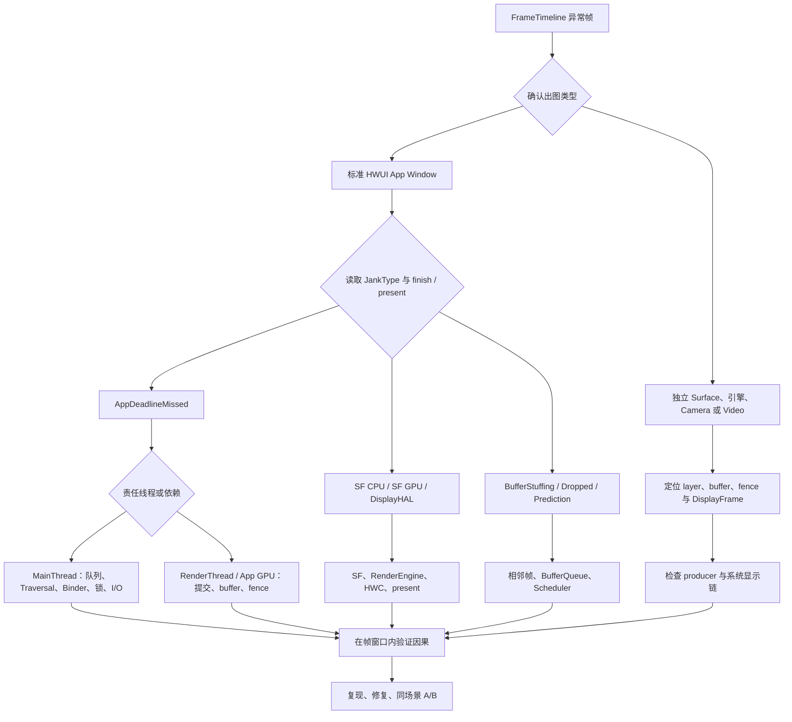

# 卡顿定义、分类与原因体系

卡顿要有相对具体的刷新周期和帧截止时间才能定义。我们先确认哪一帧晚到，再沿主线程、RenderThread、GPU、SurfaceFlinger 和显示链路定位责任阶段。

## 帧截止时间、卡顿类型与统计口径

### 从用户描述到可验证问题

用户说“页面有点卡”时，背后可能是三类问题：画面节奏异常、输入到可见反馈过慢、应用没有在系统规定的时间内响应。它们都会破坏流畅体验，定位时需要的证据却不同：

| 现象 | 工程口径 | 主要证据 |
|------|----------|----------|
| 滑动或动画出现停顿、跳变 | 渲染 jank（画面节奏异常） | FrameTimeline、Choreographer、RenderThread、SurfaceFlinger、HWC |
| 点击后很久才出现反馈，画面仍可能稳定 | 响应延迟 | Input（输入分发）、主线程消息、Binder、启动与业务处理路径 |
| 系统判定应用没有及时响应 | ANR（Application Not Responding，应用无响应） | ANR reason（系统记录的触发原因）、超时类型、主线程与相关进程栈、系统事件 |

三类问题可以在广义流畅性范围内一起治理，诊断时仍要分开对待：渲染慢帧未必引发 ANR，平均 FPS 正常也排除不了输入延迟。

### FrameTimeline 如何判定一帧异常

在 FrameTimeline（逐帧时间线）的语义里，一帧的实际呈现时间偏离 Scheduler 预测的呈现时间，就会被判为异常帧。偏离有两种典型表现：帧间隔不稳定；或者画面节奏看起来均匀，输入到显示的延迟却在逐帧增加。所以 jank 分析要同时回答两个问题：这一帧何时完成、何时呈现。

刷新周期给出最直观的时间尺度：

| 刷新率 | 相邻刷新周期 |
|--------|--------------|
| 60 Hz | 16.67 ms |
| 90 Hz | 11.11 ms |
| 120 Hz | 8.33 ms |

这些数字度量的是显示刷新周期；主线程、RenderThread 和 SurfaceFlinger 依次执行完毕的总耗时是另一回事，因为 Android 显示栈按流水线方式工作。

一个标准 HWUI 窗口的一帧，通常要依次经过 `Choreographer#doFrame`、RenderThread、BLASTBufferQueue、SurfaceFlinger 和 HWC，最后 display present 上屏。这些阶段重叠执行、各有调度窗口，所以 120 Hz 只缩短相邻刷新周期，并不要求 trace 里每个 slice 都短于 8.33 ms。这一帧我们该看的，是 expected timeline 和 actual timeline、finish 状态以及 present 结果。

同一个应用还可能有多条出图路径。标准 App Window 的像素生产者通常在应用进程；SurfaceView、Camera、Video、Native Graphics、Flutter 或游戏则可能使用独立 Surface、独立 layer 或另外的生产线程。所以动手分析之前，我们先确认四件事：谁生产 buffer、buffer 进入哪个 Surface、对应哪个 layer，以及相关合成由 HWC 还是 RenderEngine（GPU 合成引擎）完成。出图类型一旦判断错，只盯着主线程或 RenderThread 分析，就会漏掉画面里由其他路径生产的部分。

### FrameTimeline 如何描述一帧

Surface 是应用向显示系统提交图形缓冲区的接口。Android 12 / API 31 起，SurfaceFlinger 的 FrameTimeline 会为应用提交的 SurfaceFrame（某个 Surface 的一帧）和最终显示侧的 DisplayFrame（一次显示合成帧）记录预测与实测时间。Android 17 的对应实现是 `frameworks/native/services/surfaceflinger/Scheduler/FrameTimeline.cpp`，类型定义在 `frameworks/native/libs/gui/include/gui/JankInfo.h`。

#### Expected Timeline 与 Actual Timeline

应用侧 `Expected Timeline` 表示调度器为该 SurfaceFrame 预留的时间窗口，起点对应 Choreographer 计划运行回调的时间。`Actual Timeline` 从 `Choreographer#doFrame` 或 `AChoreographer_vsyncCallback` 开始，结束点取应用提交 buffer 和 GPU 完成时间中较晚的一个。SurfaceFlinger 也有自己的 expected/actual track，范围覆盖合成工作及显示栈下游的 present。

判断一帧时要一起读取以下字段：

- `Present Type`：early（早于预期）、on-time（按时）或 late（晚于预期）；
- `On time finish`：本侧工作是否在 deadline 前完成；
- `Jank Type`：SurfaceFlinger 给出的原因位标志；
- `Prediction Type`：调度预测仍然有效还是已经过期；
- `GPU Composition`：该 DisplayFrame 是否使用 GPU 合成；
- `Layer Name` 与 `Is Buffer`：当前 slice 对应哪个 layer，以及它是否携带图形 buffer。

actual slice 很长，只说明这段工作慢，还说明不了是谁的责任：应用可能按时交了帧，晚的是显示末端；也可能应用晚交了帧，但这次 present 是被前一帧或 buffer 队列拖住的。所以 `On time finish`、`Present Type` 和 `Jank Type` 要放回同一个 SurfaceFrame / DisplayFrame 关系里解释。

#### SurfaceFrame token 与 DisplayFrame token

Perfetto SQL 同时提供 `surface_frame_token` 和 `display_frame_token`。token 用来关联同一帧的记录：前者标识应用或 layer 的 SurfaceFrame，后者标识 SurfaceFlinger 组织的 DisplayFrame。一个 DisplayFrame 可以合成多个 layer frame，所以两类 token 各管各的帧，不能互换。

应用 token 会出现在应用 timeline，并作为调试信息写入 `doFrame` 与 RenderThread slice；SurfaceFlinger 的显示工作也有对应 token。Perfetto 的 flow（跨轨道关联线）把应用 SurfaceFrame 指向参与合成的 DisplayFrame。可靠的做法是沿 flow 建立关系，或直接比对两个 token 列；凭时间接近猜两条记录属于同一帧，容易出错。

#### FrameTimeline 的覆盖边界

Perfetto 官方文档明确指出，FrameTimeline 对 SurfaceView 的支持仍然有限。独立 Surface、视频 overlay（硬件叠加层）、Camera、Native Graphics 等路径也可能缺少完整的应用 `doFrame` 关联。此时没有 App timeline，不代表没有渲染工作。

分析这类 trace 时，我们要回到实际的出图对象，检查目标 layer、buffer 更新、acquire fence（等待生产完成的栅栏）、SurfaceFlinger latch、composition type、display present fence 与 release fence。只有标准 HWUI 窗口适合把 App timeline、`doFrame` 和 RenderThread 当作一条完整主线。

### JankType 位标志

`JankType` 是位标志：每一位代表一种原因，同一帧可以同时携带多个原因，UI 展示的字符串也可能是多个值的组合。以下表格以 `android-17.0.0_r1` 的 `JankInfo.h` 与 `FrameTimeline.cpp` 为准；表中的 SF 指 SurfaceFlinger，deadline 指本阶段按调度计划完成工作的截止时间。

| JankType | 值 | 表达的边界 | 诊断入口 |
|----------|----|------------|----------|
| `DisplayHAL` | `0x1` | SF 按时完成，而显示末端的 present 仍然偏离预期 | HWC、Composer HAL、present fence、显示驱动 |
| `SurfaceFlingerCpuDeadlineMissed` | `0x2` | SF 在 CPU / HWC 工作阶段错过 deadline | SF 主线程、HWC validate/present（验证合成方案/提交显示）、调度延迟 |
| `SurfaceFlingerGpuDeadlineMissed` | `0x4` | SF 使用 GPU composition（GPU 合成）时错过 deadline | RenderEngine、GPU queue（GPU 任务队列）、client target fence（GPU 合成目标的完成栅栏） |
| `AppDeadlineMissed` | `0x8` | 应用或应用提交的 GPU 工作没有按时准备好 | MainThread、RenderThread、GPU、queueBuffer（提交缓冲区）/acquire fence |
| `PredictionError` | `0x10` | VSync 预测与硬件节奏的偏差超出分类阈值 | Scheduler 预测、HW VSync（硬件垂直同步信号）、刷新率变化 |
| `SurfaceFlingerScheduling` | `0x20` | SF 的工作调度时机造成异常呈现 | SF 的 runnable/running（可运行/运行中）状态、wakeup（唤醒）与 latch 时序 |
| `BufferStuffing` | `0x40` | 前一 buffer 占用了本帧期望的呈现周期，后续 buffer 被推迟 | BufferQueue（缓冲区队列）深度，以及入队、latch、present 的顺序 |
| `Unknown` | `0x80` | 现有证据不足以归入已知原因 | 检查 trace 配置、fence 与上下文 |
| `SurfaceFlingerStuffing` | `0x100` | 前一 DisplayFrame 运行过长，把当前 SF frame 推迟到后续周期 | 连续 DisplayFrame 与 SF 工作时长 |
| `Dropped` | `0x200` | 更新后的 frame 替代当前 frame，当前 frame 未呈现 | App 与 SF 两侧的 dropped slice（未呈现帧区间）、buffer 替换关系 |
| `NonAnimating` | `0x400` | 呈现不准时，但内容不属于动画；源码不将其计入严重度计算 | layer 是否在动画或跟手交互路径 |
| `AppResyncedJitter` | `0x800` | 应用修改了该帧的 VSync time（垂直同步时间） | App frame timeline、resync（重新对齐）行为 |
| `DisplayNotOn` | `0x1000` | 屏幕关闭或处于 doze（低功耗待机） | display power state（显示电源状态） |
| `DisplayModeChangeInProgress` | `0x2000` | 显示模式切换进行中 | 刷新率、分辨率与 mode switch（模式切换）区间 |
| `DisplayPowerModeChangeInProgress` | `0x4000` | 显示电源模式切换进行中 | 亮灭屏与 power mode（电源模式）时序 |

源码中的 `calculateJankSeverity()` 还会把这些位分成两组：参与严重度计算的，和只描述状态的。`BufferStuffing`、`SurfaceFlingerStuffing`、`NonAnimating` 以及三类显示状态位不直接进入 jank 严重度计算，但仍有诊断价值。例如 Buffer Stuffing 常对应 Perfetto 的 high-latency state（高延迟状态）：帧间隔可能保持稳定，输入到显示的延迟却在增加。

Android 17 还定义了 `JankSeverityType`：`Unknown`、`None`、`Partial` 和 `Full`。源码注释把 `Partial` / `Full` 分别解释为小于、超过应用 frame interval（帧间隔）的 deadline miss。

定级由 `calculateJankSeverity()` 完成：先用 expected/actual present delta（预期与实际呈现时间差）和 frame interval 计算 score，再按 `score == 0`、`score < 0.9`、`score >= 0.9` 归入 `None`、`Partial`、`Full`；信息不足或仅有 `Dropped` 时记为 `Unknown`。

#### App、SurfaceFlinger 与 Display 三层归因

工程排查时，我们可以把位标志按责任方归成三层，当作导航来用；源码枚举本身仍然是权威：

- App 层关注 `AppDeadlineMissed`、`AppResyncedJitter`，并检查 UI 线程、RenderThread、应用 GPU 与 buffer 提交；
- SurfaceFlinger 层关注 CPU/GPU deadline、SF scheduling 与 SF stuffing，检查合成线程、RenderEngine、HWC 调用和调度；
- Display 层关注 `DisplayHAL` 及显示状态变化，检查 Composer HAL、present fence、显示模式与电源模式切换。

`PredictionError`、`Dropped`、`Unknown` 和 `BufferStuffing` 这几位要结合 SurfaceFrame、DisplayFrame 及相邻帧才能解释。直接把结果归到单一进程，会漏掉它依赖的前后帧条件。

#### Perfetto 中的帧颜色

Perfetto 当前 UI 用绿色、浅绿色、红色、黄色和蓝色区分正常帧、高延迟状态、当前进程负责的 jank、应用无责的 jank 与 dropped frame。颜色只是 UI 的展示约定，换个工具版本或主题就可能变。所以分析记录里我们写 `Jank Type` 字段和 token，而不是“红色帧”。

### 聚合指标的适用范围

#### Janky Frame Rate

`janky frames / observed frames` 是异常帧数占观测帧数的比例，分子、分母和场景定义一致时才可比。我们至少要记录刷新率、交互路径、统计窗口、是否包含启动过渡、帧来源与工具版本；把 60 Hz 与 120 Hz、持续滑动与页面首帧、标准 HWUI 与视频 overlay 混在一起，得到的数字就失去解释力。

平均 FPS 只回答“单位时间呈现了多少帧”。两个会话都可能报 50 FPS：一个帧间隔均匀，另一个充满长停顿和密集补帧，体验差别很大。所以版本回归要同时保留帧间隔分布、jank 类型、最长连续异常区间和具体场景。

#### Slow frame 与 Frozen frame

Android vitals（Google Play 质量指标）对 View / Canvas UI 的传统渲染统计用两个阈值：slow frame 的渲染时间落在 16 ms 到 700 ms，frozen frame 超过 700 ms。官方文档同时说明，这组数据无法覆盖 Vulkan、Unity、Unreal、OpenGL 等绕过 Android UI Toolkit 的全部画面。

16 ms 是面向 60 FPS 的传统阈值；在 90 Hz、120 Hz 或动态刷新率设备上，FrameTimeline 的 expected/actual 结果更贴近该帧当时的调度条件。700 ms 的 frozen frame 阈值适合抓严重停顿，逐帧的 deadline 归因仍要单独做。

#### ANR 判定与渲染统计

系统会针对输入分发、广播、前台服务和 ContentProvider 等不同响应义务分别判定 ANR。超时时间取决于触发类型、进程状态和平台策略，“大于 5 秒就是 ANR”只适用于部分常见输入场景，当作通用公式会出错。

一帧超过 700 ms，系统可能仍未触发 ANR；ANR 发生时，应用也未必正在绘制某一帧。两者可以由同一次主线程阻塞共同引发，但结论要分开引用：渲染一侧看 FrameTimeline 或渲染统计，ANR 一侧看 ANR reason 与系统栈。

### 用户感知与毫秒阈值

人对延迟和画面不连续的感知，首先取决于任务本身：跟手滑动、手写、拖拽和游戏控制对时延更敏感；无交互的渐入动画、静态页面或视频播放，对节奏的要求和补偿机制都不同。显示刷新率、触控采样、运动速度、运动模糊、连续异常帧数量也会改变感受。

所以“漏一帧通常无感”“连续三帧必然可感知”都给不出跨设备结论。工程指标要从真实场景建立：记录输入事件到目标 layer 首次出现可见变化的延迟，再结合帧间隔、连续异常段和用户任务来解释。电影的 24 FPS 同样不适合当 UI 流畅度下限——曝光带来的运动模糊、内容节奏和交互要求都不一样。

### FrameTimeline 的读取顺序

1. 复现单一场景，记录设备刷新率、显示模式、交互步骤和 trace 配置。
2. 确认出图类型：Producer（图形内容生产者）、Surface、layer、buffer 路径和合成方式。
3. 在应用 `Actual Timeline` 选择异常 SurfaceFrame，读取两类 token、layer、finish、present 与 jank 字段。
4. 沿 flow 找到 DisplayFrame，核对 SF actual/expected、GPU composition（GPU 合成）和 present 结果。
5. 根据位标志选择线程与子系统：App、SF CPU、SF GPU、HWC、display、buffer 或预测。
6. 在已经锁定的帧窗口内检查 Binder、调度、锁、I/O、GC、GPU queue 和 fence，避免从全局慢事件反推帧责任。
7. 观察相邻帧。Stuffing、Dropped、模式切换和预测偏差都依赖前后关系。

这份列表反复出现同一个原则：Binder transaction、GC 或某个长 slice 与帧窗口重叠，只说明时间上撞在一起；要认定为根因，还得证明它位于责任线程或依赖路径，并能解释 finish/present 的偏差。详细的 SQL 与因果分析见 [7.2 卡顿分析方法、典型场景与案例](02-jank-methodology-scenarios-cases.md)。

### JankStats 的角色

AndroidX `JankStats` 面向应用内逐帧监测，可以把页面、交互状态等 UI context（界面上下文）随 `FrameData` 一起上报。它从 API 16 起提供基础能力，API 24 起用上更可靠的平台 timing，API 31 起能利用更丰富的帧信息；不同 API 级别精度不同。

`jankHeuristicMultiplier` 用当前 frame period（帧周期）计算库侧的启发式阈值，默认值 `2`。也就是说，JankStats 默认并不把每个刚超过一个刷新周期的 frame 都记为 jank。这个阈值属于 AndroidX 库自己的监测策略，和 SurfaceFlinger 的 FrameTimeline 分类是两套标准。

线上数据适合回答“哪个 UI 状态经常出现异常帧”，Perfetto 适合回答“这一帧在 App、SurfaceFlinger、HWC 或显示末端发生了什么”。常见流程是先用 JankStats 或回归平台圈出高风险场景，再采集 trace 做单帧归因。

## 从应用工作到系统显示的原因树

前面解决了“哪一帧异常、属于哪一类”，原因分析要再往下走一层：落实到帧生产、调度、缓冲区和合成。同样的帧时长，可能来自完全不同的责任阶段。

### 原因分析的三个问题

打开一段异常帧的 trace，常会看到长方法、Runnable 状态的调度等待、Binder transaction、GC、GPU busy 和 late present 挤在同一个时间窗口里。Runnable 表示线程已经可以运行、还没获得 CPU。这些事件同时出现，未必个个都是根因；要得到可复核的结论，我们至少要回答三个问题：

1. 哪个 SurfaceFrame 或 DisplayFrame 偏离了 expected timeline（预期时间线）；
2. 偏差产生在 App、SurfaceFlinger、HWC/display，还是跨帧的 buffer 节奏；
3. 哪个事件位于该责任方的依赖路径，并能解释 finish 或 present 为什么变晚。

标准 HWUI 窗口沿 `Choreographer#doFrame → ViewRootImpl traversal → RenderThread → BLASTBufferQueue → SurfaceFlinger → HWC → present` 这条链观察。SurfaceView、WebView、Camera、Video、Flutter、游戏和 Native Graphics 可能改变 Producer、Surface 或 layer 的组织方式；这类场景缺少 App FrameTimeline 时，我们要转向目标 layer、buffer、fence 与 DisplayFrame，主线程不再是唯一入口。

### App 主线程原因

`AppDeadlineMissed` 说明应用侧没有按时准备好 frame。责任可能在 MainThread、RenderThread、应用 GPU 或 buffer 提交中的任何一处，我们还要结合线程状态和调用上下文继续收窄。

#### 消息排队与回调执行

主线程变慢有两种耗时要分开看：消息已经到期却迟迟没开始分发；callback 开始后执行过久。前者是 delivery delay（投递延迟），常见原因是前一条消息执行过久、同步屏障与异步消息的关系、主线程阻塞或调度不足；后者是 dispatch duration（分发耗时），常见原因是 callback 自身的计算、I/O、锁或同步 IPC。

看到 `Choreographer#doFrame` 开始得晚，我们向前查 Looper 队列和主线程状态；看到 `doFrame` 内部耗时长，再分别检查 Input、Animation、Insets Animation、Traversal 与 Commit 各阶段。两种情况都写成“绘制慢”，会漏掉队列拥塞和业务消息延迟。

#### Measure、Layout 与 Draw

Traversal（测量、布局和绘制遍历）变长时，先看常见触发条件：大范围 `requestLayout()`、复杂的 ViewGroup 测量策略、同一帧多次请求布局、过大的 View 树、自定义 `onMeasure()` / `onLayout()`，以及软件 Canvas 上的 CPU 绘制。View 层级没有跨项目通用的“超过多少层必卡”阈值；节点数量、测量次数、可见区域和自定义代码更能解释实际成本。

`invalidate()` 请求重绘，`requestLayout()` 请求重新确定尺寸和位置，两者在硬件加速窗口里都受 ViewRootImpl 与 HWUI 记录过程影响。诊断时要记下哪段代码触发请求、该帧执行了几次 traversal、每次覆盖哪些节点，只凭 API 名称判断成本往往不准。

#### RecyclerView

列表滑动期间，我们把 `RV onBindViewHolder`、`RV CreateView` / inflate、prefetch、layout 和图片管线分开观察。常见原因：bind 内同步格式化或 IPC、缓存未命中后创建 ViewHolder、图片尺寸不合适、更新范围过大，以及 item animator 与 layout 在同一帧叠加。

`DiffUtil` 或 `AsyncListDiffer` 的 diff（列表差异）计算通常可以放到后台 executor（任务执行器），但结果分发、ViewHolder 绑定和布局仍会回到主线程。`areItemsTheSame()` / `areContentsTheSame()` 是否阻塞当前帧，以所用组件、executor 和 trace 里的执行线程为准。

#### I/O、锁与同步 Binder

文件、数据库、网络与同步 `fsync()` 一旦进入帧路径，线程可能处于 Running、Sleeping 或 Uninterruptible Sleep（不可中断睡眠）状态。`SharedPreferences.commit()` 同步等待写入；`apply()` 先在调用线程更新内存、再安排异步写盘，仍可能在生命周期收尾、任务排队或大量序列化时产生开销。两者的磁盘行为要分开评估。

分析 Java monitor（对象监视器）竞争时，先找到 waiter 与 owner——谁在等这把锁、谁正持有它；Perfetto 的 monitor contention 数据、线程状态和调用栈可以建立这层关系。native mutex、condition variable 和其他 futex（快速用户态互斥锁）等待，还要结合 `blocked_function` 与唤醒源看。另外记住：线程处于 Runnable，并不表示它正在等锁。

同步 Binder 会阻塞调用线程，直到服务端完成并返回。要把它归为某帧的根因，客户端 transaction 必须与责任线程的帧窗口重叠，并且能沿 flow 找到服务端的执行、排队、锁等待或嵌套调用。只统计某个进程的 Binder 次数，说明不了它引发了 jank。

#### Android 17 DeliQueue

Android 17 / API 37 为 target SDK 37 及以上的应用默认启用新的 lock-free（无锁）`MessageQueue`。`CombinedDeliMessageQueue/MessageQueue.java` 里定义了 `USE_NEW_MESSAGEQUEUE = 421623328L`，并用 `@EnabledAfter(BAKLAVA)` 表达 target SDK 边界。应用进程在启动时选定实现，compat override 或平台 flag 仍能改变选择结果。

DeliQueue 的 producer 通过 `MessageStack` 的 CAS（Compare-And-Swap，比较并交换）操作把消息入栈，Looper 线程再在 `heapSweep()` 中把消息整理到同步和异步两个 `MessageHeap`。它减少了 legacy `MessageQueue` 单一 monitor 上的竞争，但 callback 执行过久、业务锁、Binder、I/O 或 CPU 调度延迟这些老问题它都管不了。调试版本可以用 `adb am compat enable USE_NEW_MESSAGEQUEUE <package>` 做 A/B 对照，切换后记得重启进程。

### RenderThread 与应用 GPU 原因

MainThread 记录并同步显示状态之后，RenderThread 接手 HWUI 渲染提交和部分 buffer 生命周期工作。`DrawFrame` 变长，可能是 RenderThread 自己的 CPU 工作，也可能是在等 GPU、buffer slot 或 fence。GPU 命令是异步提交的，所以 RenderThread 的 slice 短，说明不了 GPU 已经按时完成。

#### RenderThread CPU 工作

复杂 Path 的细分、阴影与模糊、文字 glyph（字形）准备、DisplayList（绘制指令列表）处理、纹理上传准备和离屏 layer，都可能推高 RenderThread 的 CPU 时间。`Canvas.saveLayer()` 往往引入中间渲染目标和额外 pass（渲染遍次），具体成本取决于裁剪范围、像素格式、效果和图形后端；把所有 clip 或圆角 API 都当成 `saveLayer()`，会高估成本。

首次显示大 Bitmap 时，我们要区分后台 decode、MainThread 状态更新、RenderThread texture upload 和 GPU 采样四段；等 trace 或 GPU 工具指出具体哪段变长，再决定调整解码尺寸、缓存、预热还是绘制方式。

#### GPU 执行与 fence

GPU 压力常来自高分辨率 fill、overdraw、复杂 fragment shader、多 pass 效果、频繁切换 render target、纹理带宽，以及多个工作负载争用。取证时看应用 GPU queue、GPU completion、acquire fence、频率与利用率，以及 FrameTimeline 的 App finish 状态。

GPU busy 只说明设备整体在忙。要归因到目标帧，我们还要把 GPU submission、buffer 或 fence 与该 SurfaceFrame 关联起来。SurfaceFlinger 用 RenderEngine 做 CLIENT composition 时同样占 GPU，应用与系统合成的工作负载可能相互推迟。

### BufferQueue 与背压

BufferQueue 负责 Producer 与 Consumer（消费者）之间的图形 buffer 传递。所谓 backpressure（背压），就是下游没有及时释放 buffer 或消费数据，上游拿不到可用槽位。

buffer 路径会把上游慢帧传播到后续帧，几类等待的含义并不相同：

| 观察点 | 可能含义 | 需要补的证据 |
|--------|----------|--------------|
| `dequeueBuffer` 或 swap（交换前后缓冲区）等待 | 没有可复用 slot、release fence（buffer 可复用栅栏）未 signal（发出完成信号）、队列出现 backpressure | slot 状态、release fence、前几帧 present |
| `queueBuffer` / transaction 变晚 | Producer 交付晚、跨进程调用或 transaction 排队 | producer 线程、buffer id、transaction 与 SF 接收时间 |
| acquire fence 未就绪 | Consumer 还不能读取该 buffer | fence 来源、GPU / 硬件 producer 完成时间 |
| SF latch 使用旧 buffer | 新 buffer 不满足本轮选择条件 | layer snapshot（图层快照）、desired present（期望呈现时间）、fence 与 latch |
| `BufferStuffing` | 前一 buffer 占用了当前期望呈现周期，延迟向后传播 | 相邻 SurfaceFrame、DisplayFrame 与队列深度 |

在标准 BLAST App Window 中，BLASTBufferQueue 位于应用进程，buffer update 再通过 SurfaceControl transaction 送到 SurfaceFlinger。所以 `dequeueBuffer` / `queueBuffer` 变长，并不直接意味着“SurfaceFlinger 主线程正在合成”：变长可能来自等待 slot、fence、producer/consumer IPC 或 transaction 条件。详见 [BufferQueue 阻塞的 Perfetto 分析](../../part3-tools/ch14-perfetto/10-bufferqueue-blocking-perfetto.md)。

### SurfaceFlinger、HWC 与显示末端

应用按时交了帧，异常仍可能出在 SF 或 Display 一侧。这时我们从 DisplayFrame 开始，检查 SurfaceFlinger 的 transaction 消费、layer snapshot、latch、composition strategy、RenderEngine、Composer HAL 与 present fence。

#### SurfaceFlinger CPU 与 GPU deadline

`SurfaceFlingerCpuDeadlineMissed` 表示 SF 的 CPU / HWC 阶段未按时完成。高风险工作包括处理大量可见 layer 和 transaction、复杂的几何或可见性计算、调度延迟、锁等待，以及 HWC validate/present 路径变长。

`SurfaceFlingerGpuDeadlineMissed` 表示 SF 用 GPU composition（GPU 合成）时错过了 deadline。这时检查 RenderEngine client composition、client target GPU fence、显示色彩处理和 GPU 争用。App RenderThread 正常，也排除不了这类系统 GPU 瓶颈。

#### DEVICE 与 CLIENT composition

HWC 为每一帧的每个 layer 决定 DEVICE、CLIENT 等 composition type。DEVICE 由显示硬件处理；CLIENT layer 先由 SurfaceFlinger 的 RenderEngine 合成出 client target，再交给 HWC 与其余 layer 一起 present。CLIENT 会增加 GPU 合成工作，但它的成本并不总等于一次“显存到显示控制器的额外拷贝”。

plane（硬件叠加平面）数量、缩放、旋转、混合、色彩空间、HDR、受保护内容、带宽和 layer overlap 都会影响 HWC 决策。AOSP 文档给出的是通用能力要求，具体可用 plane 及其约束由设备实现决定；某款 SoC（片上系统）宣称有四个或六个 plane，这个数字换到不同固件版本就未必作数。

FrameTimeline 的 `jank_type`、`present_type`、`layer_name` 和 `on_time_finish` 用来锁定异常帧，字段里看不到每个 layer 的 composition type；还要结合 SurfaceFlinger trace、Winscope layer snapshot、RenderEngine slice 或设备上的 `dumpsys SurfaceFlinger`。输出格式和可见字段会随版本与厂商实现变化。

#### DisplayHAL、模式切换与 present

`DisplayHAL` 表示 SF 已经按时准备好，晚的是显示末端的呈现。我们接着检查 Composer HAL 调用、present fence、显示驱动、刷新率或分辨率切换，以及 power mode。CPU 频率下降或某个 App 方法变长即使与之同时发生，也只是背景信息。

### 系统级放大因素

#### CPU 调度延迟

先统一线程状态的读法：Running 是正在 CPU 上执行；Runnable 是已经可以运行、还没被调度器选中；Sleeping 和 Uninterruptible Sleep 分别是可中断等待与内核不可中断等待。诊断调度延迟时，我们计算从 wakeup 到首次 running 的间隔，再看目标 CPU 上的竞争线程、优先级、调度组、核心容量和迁移情况。

后台线程数量本身说明不了什么。只有当这些线程消耗了目标核心的 CPU、内存带宽、锁或其他共享资源，并且时间上与责任线程的 wakeup latency（唤醒延迟）吻合，才能用来解释 jank。优化方向可能是减少工作量、调整任务时机或修正线程优先级；看到 Runnable 就直接提升优先级，常常是改错了方向。

#### ART GC、分配与内存压力

现代 ART 垃圾收集器的大量工作与应用并发执行，只在特定阶段暂停 mutator（修改堆对象的线程）。分析时读取 GC 类型、pause slice、并发阶段，以及目标线程是否在帧窗口内被暂停；把整个 GC duration 都算进主线程停顿，是常见的高估。

高频分配会增加 allocator（内存分配器）和 GC 的工作，但在没有数据时把少量临时对象定成问题，同样站不住。重点关注每帧分配量、young/full collection（年轻代/全堆回收）、pause 分布、大对象、堆增长和失败重试。Android 17 的 generational GC（分代垃圾回收）继续压低常见 young collection 的成本，暂停和内存压力仍然存在。

系统内存紧张还会带来 file fault（文件页缺页）、direct reclaim、compaction（内存规整）、swap/zram、I/O 与进程回收。`lmkd` 杀后台进程和应用自身 GC 是两套机制；把两者概括成“低内存触发前台 GC”，中间缺了必要的因果环节，应分别验证 ART heap 状态和 kernel 内存压力。涉及 PSI（Pressure Stall Information，资源压力停顿信息）、reclaim 与调度时，kernel 源码以 `android17-6.18-2026-06_r6` 为准。

#### 温控、DVFS 与持续负载

温控策略由 SoC、传感器、机身设计和 OEM 配置决定，通用的 45 °C 或 60 °C 卡顿阈值并不存在。trace 里 CPU/GPU 频率下降，也可能只是负载降低、governor（频率调节策略）决策或电源策略的结果。要下可靠结论，我们按时间对齐 Thermal status/headroom（温控状态/剩余温控余量）、cooling state（冷却设备状态）、频率、利用率，以及相同工作负载下的帧耗时变化。

ADPF（Android Dynamic Performance Framework，Android 动态性能框架）的 `PerformanceHintManager` 向系统报告线程组、目标时长和实际工作时长，系统据此分配资源。performance hint（性能提示）换来的资源不保证固定频率或固定核心，也越不过 thermal safety limit（温控安全限制）。遇到持续温控压力，还要靠降低画质、分辨率、更新率或工作量，把性能维持在设备能长期承受的范围内。

### WebView、多窗口与交互场景

WebView 同时牵扯宿主主线程、Chromium renderer/compositor、GPU process 和 Android Surface，页面脚本、布局、栅格化、纹理上传或宿主 View traversal 都可能造成延迟。分析时先识别 WebView 对应的 layer 和进程，再沿 buffer 与 fence 判断像素由谁生产；只看宿主 `onDraw()`，会漏掉 Chromium 侧的工作。

多窗口和分屏会增加可见 layer、transaction、分辨率变化和多个应用的 CPU/GPU 工作负载，却未必触发 CLIENT composition。我们比较进入多窗口前后的 HWC 决策、DisplayFrame、GPU queue，以及每个可见应用的 SurfaceFrame；独立路径详见 [Android View 多窗口渲染](../../part1-fundamentals/ch02-rendering/14-multiwindow-desktop-rendering.md)。

跟手滑动、手写和手势导航还要量 input-to-display latency（输入到显示延迟）。把 InputDispatcher（系统输入分发器）送达、应用消费、状态更新、目标 layer 变化与 present 串成一条链，才能得到端到端结论；`doFrame` 时长呈锯齿状，只描述了 App slice 的波动，解释不了输入链路或显示末端。

### 从异常帧到根因的分析树

下面这棵决策树帮我们选择证据入口，避免从一个长 slice 直接跳到根因结论。

```mermaid
flowchart TD
    A["FrameTimeline 异常帧"] --> B{"确认出图类型"}
    B --> C["标准 HWUI App Window"]
    B --> D["独立 Surface、引擎、Camera 或 Video"]
    C --> E{"读取 JankType 与 finish / present"}
    D --> F["定位 layer、buffer、fence 与 DisplayFrame"]
    E --> G["AppDeadlineMissed"]
    E --> H["SF CPU / SF GPU / DisplayHAL"]
    E --> I["BufferStuffing / Dropped / Prediction"]
    G --> J{"责任线程或依赖"}
    J --> J1["MainThread：队列、Traversal、Binder、锁、I/O"]
    J --> J2["RenderThread / App GPU：提交、buffer、fence"]
    H --> K["SF、RenderEngine、HWC、present"]
    I --> L["相邻帧、BufferQueue、Scheduler"]
    F --> M["检查 producer 与系统显示链"]
    J1 --> N["在帧窗口内验证因果"]
    J2 --> N
    K --> N
    L --> N
    M --> N
    N --> O["复现、修复、同场景 A/B"]
```

这棵树约束的是排查顺序。每条分支最后都要回到同一个 frame window（帧时间窗口），用 token、flow、thread state、buffer id 或 fence 建立关系；建立不起来关系的，只能先当作候选原因。

#### 证据强度

| 强度 | 例子 | 能下的结论 |
|------|------|------------|
| 直接证据 | 责任线程在帧窗口内被同步 Binder 阻塞，服务端 flow 与延迟吻合 | Binder 位于该帧关键路径 |
| 组合证据 | SF GPU deadline miss（错过截止时间）、RenderEngine 耗时变长、client target fence 晚 | CLIENT composition / 系统 GPU 是高可信原因 |
| 相关现象 | 温度高、CPU 频率低、某后台线程很忙 | 需要 workload 与时序对照 |
| 无效捷径 | FPS 低、颜色变红、线程数多 | 无法单独定位根因 |

修复之后，用相同的设备状态、刷新率、场景脚本和 trace 配置复测，比较异常类型、帧间隔分布和责任 slice；只比较平均 FPS，看不出这些差别。

### 源码与内核版本

- Framework：`android-17.0.0_r1` 的 `Choreographer.java`、`ViewRootImpl.java`、HWUI RenderThread、DeliQueue、SurfaceFlinger FrameTimeline 与 HWComposer。
- HWC3：`android-17.0.0_r1` 的 Composer3 `Composition.aidl` 与 SurfaceFlinger composition strategy；DEVICE / CLIENT 由每帧的协商结果决定。
- Kernel：`android17-6.18-2026-06_r6` 的 scheduler、Binder、dma-fence（设备缓冲同步栅栏）、PSI、reclaim 与 thermal 驱动。正文不把厂商阈值写成内核的通用行为。

### 与其他章节的关系

- [7.2 卡顿分析方法、典型场景与案例](02-jank-methodology-scenarios-cases.md)：trace 配置、窗口约束与 SQL 分析。
- [2.1 Android 渲染架构与版本演进](../../part1-fundamentals/ch02-rendering/01-rendering-architecture-evolution.md)：应用生产、SurfaceFlinger 合成与显示提交。
- [Android 17 FrameTimeline、FrameTracer 与合成边界](../../part1-fundamentals/ch02-rendering/12-android17-frametimeline-composition-boundary.md)：FrameTimeline、FrameTracer、TimeStats 与 JankTracker 的职责边界。
- [2.4 MainThread、RenderThread 与 Hardware Layer](../../part1-fundamentals/ch02-rendering/04-main-render-thread-hardware-layer.md)：HWUI 两条线程的同步边界。
- [1.9 Android IPC 全景与 Binder 性能](../../part1-fundamentals/ch01-architecture/09-ipc-binder-performance.md)：同步事务、线程池与优先级传播。
- [1.8 MessageQueue 与锁竞争：从 DeliQueue 到系统等待链](../../part1-fundamentals/ch01-architecture/08-messagequeue-lock-contention.md)：数据结构、启用条件与 A/B 方法。
- [4.2 ART Heap、GC 与后台维护调度](../../part1-fundamentals/ch04-memory/02-art-heap-gc-maintenance.md)：GC 类型、pause 与堆行为。
- [5.2 DVFS、Thermal 与 Android 功耗管理](../../part1-fundamentals/ch05-cpu-power/02-dvfs-thermal-android-power.md) 与 [5.4 ADPF 自适应性能框架](../../part1-fundamentals/ch05-cpu-power/04-adpf.md)：thermal 与 performance hint 的适用边界。
- [3.1 Input 分发、拦截与安全边界](../../part1-fundamentals/ch03-input/01-input-dispatch-interception-security.md)：输入到应用消费的证据。
- [渲染管线总览](../ch13-rendering-pipelines/01-android-view-pipeline-analysis.md)：按 Producer、Surface、layer 与合成路径识别出图类型。
- [FrameTimeline Perfetto 分析](../../part3-tools/ch14-perfetto/13-frametracer-frame-timeline.md)：trace 配置与 SQL 查询。

## 版本与实现边界

- Android 12 / API 31：FrameTimeline 进入现代逐帧归因流程；旧设备仍需依赖 Choreographer、RenderThread、SurfaceFlinger 与 VSync 时序。
- Android 17 / API 37：源码锚点为 `android-17.0.0_r1` 的 Scheduler/FrameTimeline 与 `JankInfo.h`；`NonAnimating`、`AppResyncedJitter` 和显示状态相关位均按该版本标签解释。
- Kernel：相关结论位于 framework、SurfaceFlinger、Composer HAL 与 trace 数据层。追踪 dma-buf（设备间共享的 DMA 缓冲区）、dma-fence、sync_file（承载栅栏的文件对象）或显示驱动时，内核锚点使用 `android17-6.18-2026-06_r6`。

## 常见误区

| 误判 | 修正方式 |
|------|----------|
| FPS 高，所以没有卡顿 | 检查帧间隔分布、连续异常段和 FrameTimeline 类型 |
| `AppDeadlineMissed` 只说明主线程慢 | 同时检查 RenderThread、应用 GPU、queueBuffer 与 acquire fence |
| App timeline 正常，应用一定无关 | 确认是否存在独立 Surface、额外 layer 或非 HWUI Producer |
| 红色对应一种固定 JankType | 读取 details（详情）面板中的位标志；颜色仅用于界面导航 |
| `BufferStuffing` 等于单帧渲染过长 | 对齐前一帧、队列深度、latch 与 present，确认延迟如何传播 |
| Frozen frame 会按同一阈值变成 ANR | 分别核对渲染统计和 ANR 触发原因 |
| 目标必须是全局 0% jank | 按场景、刷新率、统计窗口和设备档位设预算，并追踪可复现峰值 |

## 参考资料

### 定义与指标

- [Perfetto：Android Jank detection with FrameTimeline](https://perfetto.dev/docs/data-sources/frametimeline)
- [Android Developers：Slow rendering](https://developer.android.com/topic/performance/vitals/render)
- [Android Developers：Diagnose and fix ANRs](https://developer.android.com/topic/performance/vitals/anr)
- [AndroidX JankStats API reference](https://developer.android.com/reference/androidx/metrics/performance/JankStats)
- [AOSP Android 17 JankInfo.h](https://android.googlesource.com/platform/frameworks/native/+/android-17.0.0_r1/libs/gui/include/gui/JankInfo.h)
- [AOSP Android 17 FrameTimeline.cpp](https://android.googlesource.com/platform/frameworks/native/+/android-17.0.0_r1/services/surfaceflinger/Scheduler/FrameTimeline.cpp)

### 原因与诊断

- [Perfetto CPU scheduling events](https://perfetto.dev/docs/data-sources/cpu-scheduling)
- [PerfettoSQL android.binder 与 binder_breakdown](https://perfetto.dev/docs/analysis/stdlib-docs)
- [Android 17 MessageQueue behavior change](https://developer.android.com/about/versions/17/changes/messagequeue)
- [AOSP：Hardware Composer HAL](https://source.android.com/docs/core/graphics/hwc)
- [AOSP：SurfaceFlinger and WindowManager](https://source.android.com/docs/core/graphics/surfaceflinger-windowmanager)
- [AOSP：ART GC debug](https://source.android.com/docs/core/runtime/gc-debug)
- [AOSP：Binder threading model](https://source.android.com/docs/core/architecture/ipc/binder-threading)
- [Android Developers：ADPF](https://developer.android.com/games/optimize/adpf)
- [AOSP Android 17 DeliQueue MessageQueue.java](https://android.googlesource.com/platform/frameworks/base/+/android-17.0.0_r1/core/java/android/os/CombinedDeliMessageQueue/MessageQueue.java)
- [AOSP Android 17 MessageStack.java](https://android.googlesource.com/platform/frameworks/base/+/android-17.0.0_r1/core/java/android/os/MessageStack.java)
- [Android 17 kernel EEVDF](https://android.googlesource.com/kernel/common/+/refs/tags/android17-6.18-2026-06_r6/Documentation/scheduler/sched-eevdf.rst)
