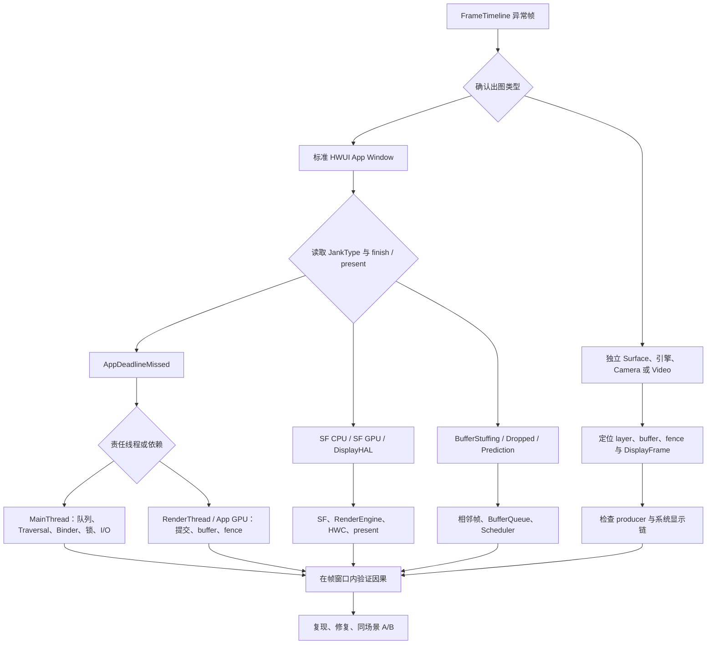

---

title: "卡顿原因体系"
chapter: "7.2"
section: "7.2"
status: "finalized"
applicable_versions: "Android 5.0 (API 21) - Android 17 (API 37)"
last_verified: "2026-07-10"
last_verified_against: "AOSP android-17.0.0_r1"
confidence: high
sources:
  - type: blog
    path: "Personal-Knowlodge/source/2026-03-07_wechat_Android深入卡顿分析与实践.md"
  - type: blog
    path: "Personal-Knowlodge/source/2026-03-07_wechat_Android卡顿监测的方方面面.md"
  - type: blog
    path: "Personal-Knowlodge/source/2026-03-08_wechat_干货_从47_到80_携程酒店APP流畅度提升实践.md"
  - type: aosp
    path: "frameworks/base/core/java/android/view/Choreographer.java"
  - type: aosp
    path: "frameworks/base/core/java/android/view/ViewRootImpl.java"
  - type: aosp
    path: "frameworks/native/services/surfaceflinger/SurfaceFlinger.cpp"
  - type: official
    path: "developer.android.com/topic/performance/vitals/render"
tags:
  - android
  - jank
  - research
  - rendering
  - perfetto
  - performance
  - smoothness
related_chapters: ["7.1", "2.3", "2.4", "2.5", "1.4", "1.5", "1.13", "1.14", "3.1", "4.3"]
pipeline_stage: "ready-to-publish"
task6_state: "reviewed"
task9_state: "reviewed"
task2b_state: "fixed"
---

# 7.2 卡顿原因体系

## 原因分析从责任边界开始

一次异常帧中常会同时出现长方法、Runnable 状态下的调度等待、Binder transaction（Binder 调用）、GC（垃圾回收）、GPU busy（GPU 忙碌）和 late present（延迟呈现）。Runnable 表示线程已经可以运行，但尚未获得 CPU。它们出现在同一个时间窗口，不代表每个事件都是根因。可复核的结论至少要回答三个问题：

1. 哪个 SurfaceFrame（某个 Surface 的一帧）或 DisplayFrame（一次显示合成帧）偏离了 expected timeline（预期时间线）；
2. 偏差产生在 App、SurfaceFlinger、HWC（Hardware Composer，硬件合成器）/display（显示末端），还是跨帧的 buffer（图形缓冲区）节奏；
3. 哪个事件位于该责任方的依赖路径，并能解释 finish（工作完成）或 present（画面呈现）为什么变晚。

标准 HWUI（Android 硬件加速 UI 渲染器）窗口通常沿 `Choreographer#doFrame → ViewRootImpl traversal → RenderThread → BLASTBufferQueue → SurfaceFlinger → HWC → present` 观察。SurfaceView、WebView、Camera、Video、Flutter、游戏和 Native Graphics 可能改变 Producer（图形内容生产者）、Surface（图形缓冲区提交接口）或 layer（图层）的组织方式。缺少 App FrameTimeline（应用逐帧时间线）时，应转向目标 layer、buffer、fence（同步栅栏）与 DisplayFrame，不能继续把主线程当作唯一入口。

## App 主线程原因

`AppDeadlineMissed` 说明应用侧没有按时准备好 frame。责任可能位于 MainThread（主线程）、RenderThread（渲染线程）、应用 GPU 或 buffer 提交边界，因此还要结合线程状态和调用上下文继续判断。

### 消息排队与回调执行

主线程变慢包含两种时间：消息已经到期却迟迟没有开始分发，以及 callback（回调）开始后执行过久。前者是 delivery delay（投递延迟），常见原因包括前一条消息执行过久、同步屏障与异步消息的关系、主线程阻塞或调度不足；后者是 dispatch duration（分发耗时），常见原因包括 callback 自身的计算、I/O、锁或同步 IPC（进程间通信）。

看到 `Choreographer#doFrame` 开始较晚，应向前检查 Looper（消息循环）队列与主线程状态。看到 `doFrame` 内部耗时较长，再分别检查 Input（输入）、Animation（动画）、Insets Animation（系统栏等区域的动画）、Traversal（测量、布局和绘制遍历）与 Commit（提交）阶段。把两种情况都写成“绘制慢”，会漏掉队列拥塞和业务消息延迟。

### Measure、Layout 与 Draw

Traversal 变长时，常见触发条件包括大范围 `requestLayout()`、复杂的 ViewGroup 测量策略、同一帧多次请求布局、过大的 View 树、自定义 `onMeasure()` / `onLayout()`，以及软件 Canvas 上的 CPU 绘制。View 层级没有跨项目通用的“超过多少层必卡”阈值，节点数量、测量次数、可见区域和自定义代码更能解释实际成本。

`invalidate()` 请求重绘，`requestLayout()` 请求重新确定尺寸和位置；两者在硬件加速窗口里都受 ViewRootImpl 与 HWUI 记录过程影响。诊断时应记录哪段代码触发请求、该帧执行了几次 traversal、每次覆盖哪些节点，避免只凭 API 名称判断成本。

### RecyclerView

列表滑动期间要分开观察 `RV onBindViewHolder`（绑定列表项）、`RV CreateView` / inflate（创建视图）、prefetch（预取）、layout 和图片管线。常见原因包括 bind 内同步格式化或 IPC、缓存未命中后创建 ViewHolder、图片尺寸不合适、更新范围过大，以及 item animator（列表项动画）与 layout 在同一帧叠加。

`DiffUtil` 或 `AsyncListDiffer` 的 diff（列表差异）计算通常可以放到后台 executor（任务执行器），但结果分发、ViewHolder 绑定和布局仍会回到主线程。`areItemsTheSame()` / `areContentsTheSame()` 是否阻塞当前帧，要以所用组件、executor 和 trace（跟踪记录）中的执行线程为准。

### I/O、锁与同步 Binder

文件、数据库、网络与同步 `fsync()` 进入帧路径后，线程可能处于 Running（运行中）、Sleeping（睡眠）或 Uninterruptible Sleep（不可中断睡眠）状态。`SharedPreferences.commit()` 会同步等待写入；`apply()` 先在调用线程更新内存并安排异步写盘，仍可能在生命周期收尾、任务排队或大量序列化时产生开销。两者的磁盘行为不能混为一谈。

分析 Java monitor（对象监视器）竞争时，应找到 waiter（等待者）与 owner（持有者）。Perfetto 的 monitor contention（监视器竞争）数据、线程状态和调用栈可以建立双方关系；native mutex（本地互斥锁）、condition variable（条件变量）和其他 futex（快速用户态互斥锁）等待，还要结合 `blocked_function`（阻塞函数）与唤醒源。Runnable 表示线程已具备运行条件但尚未获得 CPU，并不表示它正在等锁。

同步 Binder 会阻塞调用线程，直到服务端完成并返回。要把它归为某帧的根因，客户端 transaction 必须与责任线程的帧窗口重叠，并且可以沿 flow（跨轨道关联线）找到服务端执行、排队、锁等待或嵌套调用。只统计某个进程的 Binder 次数，无法证明它引发了 jank。

### Android 17 DeliQueue

Android 17 / API 37 为 target SDK 37 及以上的应用默认启用新的 lock-free（无锁）`MessageQueue`。`android-17.0.0_r1` 的 `CombinedDeliMessageQueue/MessageQueue.java` 定义了 `USE_NEW_MESSAGEQUEUE = 421623328L`，并以 `@EnabledAfter(BAKLAVA)` 表达 target SDK 边界。应用进程会在启动时选定实现；compat override（兼容性覆盖配置）或平台 flag（开关）仍能改变选择结果。

DeliQueue 的 producer（消息生产者）通过 `MessageStack` 的 CAS（Compare-And-Swap，比较并交换）操作将消息入栈，Looper 线程再在 `heapSweep()` 中把消息整理到同步和异步两个 `MessageHeap`。它减少了 legacy（旧版）`MessageQueue` 单一 monitor 上的竞争，但不会消除 callback 执行过久、业务锁、Binder、I/O 或 CPU 调度延迟。调试版本可以用命令 `adb am compat enable USE_NEW_MESSAGEQUEUE <package>` 做 A/B 对照，切换后应重启进程。

## RenderThread 与应用 GPU 原因

MainThread 记录并同步显示状态后，RenderThread 负责 HWUI 渲染提交和部分 buffer 生命周期工作。`DrawFrame` 变长可能来自 RenderThread 的 CPU 工作，也可能是等待 GPU、buffer slot（缓冲区槽位）或 fence。GPU 命令采用异步提交，因此 RenderThread 的 slice（时间区间）较短也不能证明 GPU 已经按时完成。

### RenderThread CPU 工作

复杂 Path 的细分、阴影与模糊、文字 glyph（字形）准备、DisplayList（绘制指令列表）处理、纹理上传准备和离屏 layer，都可能增加 RenderThread 的 CPU 时间。`Canvas.saveLayer()` 往往会引入中间渲染目标和额外 pass（渲染遍次），但具体成本取决于边界、像素格式、效果和图形后端；不能把所有 clip（裁剪）或圆角 API 都等同于 `saveLayer()`。

首次显示大 Bitmap 时，应区分后台 decode（解码）、MainThread 状态更新、RenderThread texture upload（纹理上传）与 GPU 采样。只有在 trace 或 GPU 工具证明具体哪一段变长后，才能据此决定是否调整解码尺寸、缓存、预热或绘制方式。

### GPU 执行与 fence

GPU 压力常来自高分辨率 fill（像素填充）、overdraw（重复绘制）、复杂 fragment shader（片元着色器）、多 pass 效果、频繁切换 render target（渲染目标）、纹理带宽，以及多个图形 workload（工作负载）争用。证据应包括应用 GPU queue（GPU 任务队列）、GPU completion（GPU 完成时间）、acquire fence（缓冲区可读取栅栏）、频率与利用率，以及 FrameTimeline 的 App finish 状态。

GPU busy 只能说明设备处于忙碌状态。要归因到目标帧，还需把 GPU submission（任务提交）、buffer 或 fence 与该 SurfaceFrame 关联。SurfaceFlinger 使用 RenderEngine 做 CLIENT composition（客户端合成）时也会占用 GPU；应用工作负载与系统合成工作负载可能相互推迟。

## BufferQueue 与背压

BufferQueue 在 Producer（生产者）与 Consumer（消费者）之间传递图形 buffer。backpressure（背压）表示下游没有及时释放 buffer 或消费数据，导致上游无法继续取得可用槽位。

buffer 路径会把上游慢帧传播到后续帧。以下等待含义不同：

| 观察点 | 可能含义 | 需要补的证据 |
|--------|----------|--------------|
| `dequeueBuffer` 或 swap（交换前后缓冲区）等待 | 没有可复用 slot、release fence（buffer 可复用栅栏）未 signal（发出完成信号）、队列出现 backpressure | slot 状态、release fence、前几帧 present |
| `queueBuffer` / transaction 变晚 | Producer 交付晚、跨进程调用或 transaction 排队 | producer 线程、buffer id、transaction 与 SF 接收时间 |
| acquire fence 未就绪 | Consumer 还不能读取该 buffer | fence 来源、GPU / 硬件 producer 完成时间 |
| SF latch 使用旧 buffer | 新 buffer 不满足本轮选择条件 | layer snapshot（图层快照）、desired present（期望呈现时间）、fence 与 latch |
| `BufferStuffing` | 前一 buffer 占用了当前期望呈现周期，延迟向后传播 | 相邻 SurfaceFrame、DisplayFrame 与队列深度 |

在标准 BLAST App Window 中，BLASTBufferQueue 位于应用进程，buffer update 再通过 SurfaceControl transaction 送到 SurfaceFlinger。因此，`dequeueBuffer` / `queueBuffer` 变长不能直接写成“SurfaceFlinger 主线程正在合成”；它可能在等待 slot、fence、producer/consumer IPC 或 transaction 条件。详见 [BufferQueue 阻塞的 Perfetto 分析](../../part3-tools/ch13-perfetto/14-bufferqueue-blocking-perfetto.md)。

## SurfaceFlinger、HWC 与显示末端

应用按时交帧后，异常仍可能归因于 SF（SurfaceFlinger）或 Display（显示末端）。此时应从 DisplayFrame 开始，检查 SurfaceFlinger 的 transaction 消费、layer snapshot、latch、composition strategy（合成策略）、RenderEngine、Composer HAL（显示合成硬件抽象层）与 present fence。

### SurfaceFlinger CPU 与 GPU deadline

`SurfaceFlingerCpuDeadlineMissed` 表示 SF CPU / HWC 阶段未按时完成。高风险工作包括处理大量可见 layer 和 transaction、复杂的几何或可见性计算、调度延迟、锁等待，以及 HWC validate/present（验证合成方案/提交显示）路径变长。

`SurfaceFlingerGpuDeadlineMissed` 表示 SF 在使用 GPU composition（GPU 合成）时错过 deadline（截止时间）。应检查 RenderEngine client composition（客户端合成）、client target GPU fence（GPU 合成目标的完成栅栏）、显示色彩处理和 GPU 争用。App RenderThread 正常，不能排除这类系统 GPU 瓶颈。

### DEVICE 与 CLIENT composition

HWC 会为每一帧的每个 layer 决定 DEVICE 或 CLIENT 等 composition type（合成类型）。DEVICE 表示由显示硬件处理；CLIENT layer 则先由 SurfaceFlinger 的 RenderEngine 合成为 client target（客户端合成目标），再交给 HWC 与其余 layer 一起 present。CLIENT 会增加 GPU 合成工作，但不能笼统描述为一次“显存到显示控制器的额外拷贝”。

plane（硬件叠加平面）数量、缩放、旋转、混合、色彩空间、HDR（高动态范围）、受保护内容、带宽和 layer overlap（图层重叠）都会影响 HWC 决策。AOSP 文档给出通用能力要求，具体可用 plane 及其约束由设备实现决定。即使某款 SoC（片上系统）宣称有四个或六个 plane，也不能把这个数字直接用于不同固件版本的诊断。

FrameTimeline 的 `jank_type`、`present_type`、`layer_name` 和 `on_time_finish` 用于锁定异常帧，但这些字段不提供每个 layer 的 composition type。还要结合 SurfaceFlinger trace、Winscope layer snapshot（图层快照）、RenderEngine slice 或设备上的 `dumpsys SurfaceFlinger`。输出格式和可见字段会随版本与厂商实现变化。

### DisplayHAL、模式切换与 present

`DisplayHAL` 表示 SF 已经按时准备好，但显示末端的呈现仍偏离预期。应检查 Composer HAL 调用、present fence、显示驱动、刷新率或分辨率切换，以及 power mode（电源模式）。即使 CPU 频率下降或某个 App 方法变长与它同时发生，也只能作为背景信息。

## 系统级放大因素

### CPU 调度延迟

Running 表示线程正在 CPU 上执行；Runnable 表示线程已经可以运行，但尚未被调度器选中；Sleeping 和 Uninterruptible Sleep 分别表示可中断等待与内核不可中断等待。诊断调度延迟时，要计算从 wakeup（唤醒）到首次 running 的间隔，并观察目标 CPU 上的竞争线程、优先级、调度组、核心容量和迁移情况。

后台线程数量本身不是证据。只有当这些线程消耗了目标核心的 CPU、内存带宽、锁或其他共享资源，而且时间上与责任线程的 wakeup latency（唤醒延迟）吻合时，才能用于解释 jank。优化方向可能是减少工作量、调整任务时机或修正线程优先级，不能看到 Runnable 就直接提升优先级。

### ART GC、分配与内存压力

现代 ART（Android Runtime，Android 运行时）垃圾收集器的大量工作会与应用并发执行，只在特定阶段暂停 mutator（执行应用代码并修改堆对象的线程）。分析时应读取 GC 类型、pause slice（暂停区间）、并发阶段，以及目标线程是否在帧窗口内被暂停，不能把整个 GC duration（持续时间）都计入主线程停顿。

高频分配会增加 allocator（内存分配器）与 GC 工作，但不能在没有数据时把少量临时对象直接定为问题。应重点关注每帧分配量、young/full collection（年轻代/全堆回收）、pause 分布、大对象、堆增长和失败重试。Android 17 的 generational GC（分代垃圾回收）继续降低常见 young collection 的成本，但暂停和内存压力仍然存在。

系统内存紧张还会带来 file fault（文件页缺页）、direct reclaim（当前线程直接回收内存）、compaction（内存规整）、swap/zram（交换空间/内存压缩交换设备）、I/O 与进程回收。`lmkd`（低内存终止守护进程）杀死后台进程，与应用自身 GC 属于不同机制。将两者概括成“低内存触发前台 GC”缺少必要的因果证据；应分别验证 ART heap（堆）状态和 kernel（内核）内存压力。涉及 PSI（Pressure Stall Information，资源压力停顿信息）、reclaim 与调度时，kernel 源码锚点为 `android17-6.18-2026-06_r6`。

### 温控、DVFS 与持续负载

温控策略由 SoC、传感器、机身设计和 OEM（设备厂商）配置决定，不存在通用的 45 °C 或 60 °C 卡顿阈值。trace 中 CPU/GPU 频率下降也可能来自负载降低、governor（频率调节策略）决策或电源策略。可靠结论应按时间对齐 Thermal status/headroom（温控状态/剩余温控余量）、cooling state（冷却设备状态）、频率、利用率，以及相同 workload 下的帧耗时变化。

ADPF（Android Dynamic Performance Framework，Android 动态性能框架）的 `PerformanceHintManager` 会向系统报告线程组、目标时长和实际工作时长，系统据此分配资源。performance hint（性能提示）不承诺固定频率或固定核心，也不能越过 thermal safety limit（温控安全限制）。遇到持续温控压力时，还要降低画质、分辨率、更新率或工作量，使性能维持在设备能够持续承受的范围内。

## WebView、多窗口与交互场景

WebView 同时涉及宿主主线程、Chromium renderer（渲染进程）/compositor（合成组件）、GPU process（GPU 进程）和 Android Surface。页面脚本、布局、栅格化、纹理上传或宿主 View traversal 都可能延迟。分析时应先识别 WebView 对应的 layer 和进程，再沿 buffer 与 fence 判断像素由谁生产；只看宿主 `onDraw()` 会漏掉 Chromium 侧的工作。

多窗口和分屏会增加可见 layer、transaction、分辨率变化与多个应用的 CPU/GPU 工作负载，但不一定会触发 CLIENT composition。应比较进入多窗口前后的 HWC 决策、DisplayFrame、GPU queue，以及每个可见应用的 SurfaceFrame。独立路径详见 [Android View 多窗口渲染](../ch18-rendering-pipelines/05-android-view-multi-window.md)。

跟手滑动、手写和手势导航还要检查 input-to-display latency（输入到显示延迟）。只有串起 InputDispatcher（系统输入分发器）送达、应用消费、状态更新、目标 layer 变化与 present，才能得到端到端结论。`doFrame` 时长呈锯齿状，只能描述 App slice 的波动，不足以解释输入链路或显示末端。

## 从异常帧到根因的分析树

下面的决策树用于选择证据入口，避免从一个长 slice 直接跳到根因结论。

这棵树用于约束排查顺序。每条分支都要回到同一个 frame window（帧时间窗口），并用 token（帧标识）、flow、thread state（线程状态）、buffer id 或 fence 建立关系。找不到关系时，只能把相应事件保留为候选原因。

### 证据强度

| 强度 | 例子 | 能下的结论 |
|------|------|------------|
| 直接证据 | 责任线程在帧窗口内被同步 Binder 阻塞，服务端 flow 与延迟吻合 | Binder 位于该帧关键路径 |
| 组合证据 | SF GPU deadline miss（错过截止时间）、RenderEngine 耗时变长、client target fence 晚 | CLIENT composition / 系统 GPU 是高可信原因 |
| 相关现象 | 温度高、CPU 频率低、某后台线程很忙 | 需要 workload 与时序对照 |
| 无效捷径 | FPS 低、颜色变红、线程数多 | 无法单独定位根因 |

修复后应使用相同的设备状态、刷新率、场景脚本和 trace 配置复测。比较异常类型、帧间隔分布和责任 slice，不要只比较平均 FPS。

## Android 17 与 kernel 锚点

- Framework（Android 框架层）：`android-17.0.0_r1` 的 `Choreographer.java`、`ViewRootImpl.java`、HWUI RenderThread、DeliQueue、SurfaceFlinger FrameTimeline 与 HWComposer。
- HWC3：`android-17.0.0_r1` 的 Composer3 `Composition.aidl` 与 SurfaceFlinger composition strategy；DEVICE / CLIENT 由每帧的协商结果决定。
- Kernel（内核）：`android17-6.18-2026-06_r6` 的 scheduler（调度器）、Binder、dma-fence（设备缓冲同步栅栏）、PSI、reclaim（内存回收）与 thermal（温控）驱动。正文不把厂商阈值写成内核的通用行为。

## 与其他章节的关系

- [7.1 卡顿的定义与分类](01-jank-definition.md)：FrameTimeline、JankType 与指标边界。
- [7.3 卡顿分析流程与方法](03-jank-methodology.md)：trace 配置、窗口约束与 SQL 分析。
- [2.5 MainThread 与 RenderThread](../../part1-fundamentals/ch02-rendering/05-main-render-thread.md)：HWUI 两条线程的同步边界。
- [1.4 Binder 机制](../../part1-fundamentals/ch01-architecture/04-binder.md)：同步事务、线程池与优先级传播。
- [1.13 Android 17 DeliQueue](../../part1-fundamentals/ch01-architecture/13-messagequeue-deliqueue.md)：数据结构、启用条件与 A/B 方法。
- [4.3 ART 内存管理](../../part1-fundamentals/ch04-memory/03-art-memory.md)：GC 类型、pause 与堆行为。
- [5.5 温控管理](../../part1-fundamentals/ch05-cpu-power/05-thermal.md) 与 [5.9 ADPF](../../part1-fundamentals/ch05-cpu-power/09-adpf.md)：thermal 与 performance hint 的适用边界。
- [3.1 输入分发](../../part1-fundamentals/ch03-input/01-input-dispatch.md)：输入到应用消费的证据。
- [渲染管线总览](../ch18-rendering-pipelines/01-pipeline-overview.md)：按 Producer、Surface、layer 与合成路径识别出图类型。

## 参考资料

- [Perfetto FrameTimeline](https://perfetto.dev/docs/data-sources/frametimeline)
- [Perfetto CPU scheduling events](https://perfetto.dev/docs/data-sources/cpu-scheduling)
- [PerfettoSQL android.binder 与 binder_breakdown](https://perfetto.dev/docs/analysis/stdlib-docs)
- [Android Developers：Slow rendering](https://developer.android.com/topic/performance/vitals/render)
- [Android 17 MessageQueue behavior change](https://developer.android.com/about/versions/17/changes/messagequeue)
- [AOSP：Hardware Composer HAL](https://source.android.com/docs/core/graphics/hwc)
- [AOSP：SurfaceFlinger and WindowManager](https://source.android.com/docs/core/graphics/surfaceflinger-windowmanager)
- [AOSP：ART GC debug](https://source.android.com/docs/core/runtime/gc-debug)
- [AOSP：Binder threading model](https://source.android.com/docs/core/architecture/ipc/binder-threading)
- [Android Developers：ADPF](https://developer.android.com/games/optimize/adpf)
- [AOSP Android 17 DeliQueue MessageQueue.java](https://android.googlesource.com/platform/frameworks/base/+/android-17.0.0_r1/core/java/android/os/CombinedDeliMessageQueue/MessageQueue.java)
- [AOSP Android 17 MessageStack.java](https://android.googlesource.com/platform/frameworks/base/+/android-17.0.0_r1/core/java/android/os/MessageStack.java)
- [AOSP Android 17 FrameTimeline.cpp](https://android.googlesource.com/platform/frameworks/native/+/android-17.0.0_r1/services/surfaceflinger/Scheduler/FrameTimeline.cpp)
- [Android 17 kernel EEVDF](https://android.googlesource.com/kernel/common/+/refs/tags/android17-6.18-2026-06_r6/Documentation/scheduler/sched-eevdf.rst)
