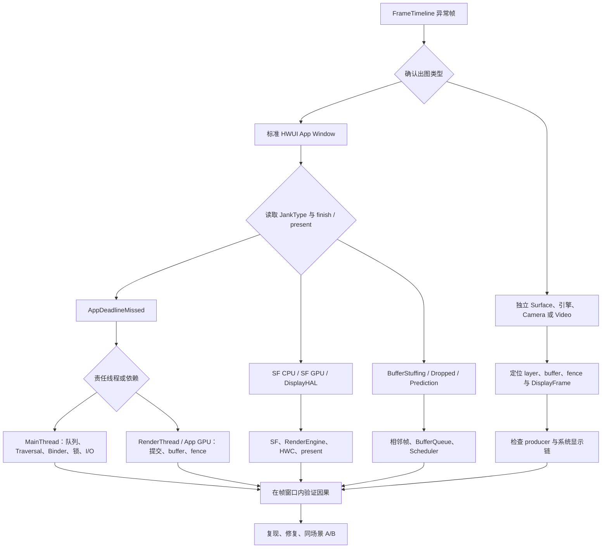

---

title: "卡顿原因体系"
chapter: "7.2"
section: "7.2"
status: "finalized"
applicable_versions: "Android 5.0 (API 21) - Android 17 (API 37)"
last_verified: "2026-07-10"
last_verified_against: "AOSP android-17.0.0_r1"
confidence: high
sources:
  - type: blog
    path: "Personal-Knowlodge/source/2026-03-07_wechat_Android深入卡顿分析与实践.md"
  - type: blog
    path: "Personal-Knowlodge/source/2026-03-07_wechat_Android卡顿监测的方方面面.md"
  - type: blog
    path: "Personal-Knowlodge/source/2026-03-08_wechat_干货_从47_到80_携程酒店APP流畅度提升实践.md"
  - type: aosp
    path: "frameworks/base/core/java/android/view/Choreographer.java"
  - type: aosp
    path: "frameworks/base/core/java/android/view/ViewRootImpl.java"
  - type: aosp
    path: "frameworks/native/services/surfaceflinger/SurfaceFlinger.cpp"
  - type: official
    path: "developer.android.com/topic/performance/vitals/render"
tags:
  - android
  - jank
  - research
  - rendering
  - perfetto
  - performance
  - smoothness
related_chapters: ["7.1", "2.3", "2.4", "2.5", "1.4", "1.5", "1.13", "1.14", "3.1", "4.3"]
pipeline_stage: "ready-to-publish"
task6_state: "reviewed"
task9_state: "reviewed"
task2b_state: "fixed"
---

# 7.2 卡顿原因体系

## 原因分析从责任边界开始

一次异常帧常同时出现长方法、Runnable 等待、Binder transaction、GC、GPU busy 和 late present。它们处在同一个时间窗口，不代表每个事件都是根因。可复核的结论至少回答三个问题：

1. 哪个 SurfaceFrame 或 DisplayFrame 偏离了 expected timeline；
2. 偏差产生在 App、SurfaceFlinger、HWC / display，还是跨帧的 buffer 节奏；
3. 哪个事件位于该责任方的依赖路径，并解释了 finish 或 present 为什么变晚。

标准 HWUI 窗口通常沿 `Choreographer#doFrame → ViewRootImpl traversal → RenderThread → BLASTBufferQueue → SurfaceFlinger → HWC → present` 观察。SurfaceView、WebView、Camera、Video、Flutter、游戏和 Native Graphics 可能改变 Producer、Surface 或 layer 组织方式。缺少 App FrameTimeline 时，应转向目标 layer、buffer、fence 与 DisplayFrame，不能继续把主线程当作唯一入口。

## App 主线程原因

`AppDeadlineMissed` 说明应用侧没有按时准备好 frame。责任可能位于 MainThread、RenderThread、应用 GPU 或 buffer 提交边界，因而要从线程状态和调用上下文继续拆分。

### 消息排队与回调执行

主线程变慢有两种时间：消息已经到期却迟迟没有开始分发，以及 callback 开始后执行过久。前者对应 delivery delay，常见原因是前面的消息过长、同步屏障与异步消息关系、主线程被阻塞或调度不足；后者对应 dispatch duration，常见原因是 callback 自身计算、I/O、锁或同步 IPC。

看到 `Choreographer#doFrame` 开始晚，应向前检查 Looper 队列与主线程状态。看到 `doFrame` 内部拉长，再拆 Input、Animation、Insets Animation、Traversal 和 Commit。把两者都写成“绘制慢”会错过队列拥塞与业务消息。

### Measure、Layout 与 Draw

Traversal 变长时，常见触发条件包括大范围 `requestLayout()`、复杂 ViewGroup 测量策略、同一帧多次布局请求、过大的 View 树、自定义 `onMeasure()` / `onLayout()`，以及软件 Canvas 上的 CPU 绘制。View 层级没有跨项目通用的“超过多少层必卡”阈值，节点数量、测量次数、可见区域和自定义代码更有解释力。

`invalidate()` 请求重绘，`requestLayout()` 请求重新确定尺寸和位置；两者在硬件加速窗口里都受 ViewRootImpl 与 HWUI 记录过程影响。诊断时记录哪段代码触发请求、该帧执行了几次 traversal、每次覆盖哪些节点，避免只凭 API 名判断成本。

### RecyclerView

列表滑动期间要分开观察 `RV onBindViewHolder`、`RV CreateView` / inflate、prefetch、layout 和图片管线。高频原因包括 bind 内同步格式化或 IPC、缓存未命中导致创建 ViewHolder、图片尺寸不合适、更新范围过大，以及 item animator 与 layout 同帧叠加。

`DiffUtil` 或 `AsyncListDiffer` 的 diff 计算通常可放到后台 executor，但结果分发、ViewHolder 绑定和布局仍回到主线程。`areItemsTheSame()` / `areContentsTheSame()` 是否阻塞当前帧，要以所用组件、executor 与 trace 线程为准。

### I/O、锁与同步 Binder

文件、数据库、网络与同步 fsync 进入帧路径后，线程可能处于 Running、Sleeping 或 Uninterruptible Sleep。`SharedPreferences.commit()` 同步等待写入；`apply()` 先在调用线程更新内存并安排异步写盘，仍可能在生命周期收尾、排队或大量序列化时产生代价。两者不能合写成相同的同步磁盘行为。

Java monitor 竞争应寻找 waiter 与 owner。Perfetto 的 monitor contention 数据、线程状态和调用栈可建立双方关系；native mutex、condition variable 与其他 futex wait 还要结合 `blocked_function` 和唤醒源。Runnable 表示线程具备运行条件但尚未获得 CPU，它不表示正在等锁。

同步 Binder 会阻塞调用线程直到服务端完成并返回。要把它归为某帧根因，客户端 transaction 必须与责任线程的帧窗口重叠，并沿 flow 找到服务端执行、排队、锁等待或嵌套调用。仅统计某进程的 Binder 次数无法证明 jank。

### Android 17 DeliQueue

Android 17 / API 37 为 target SDK 37 及以上应用默认启用新的 lock-free `MessageQueue`。`android-17.0.0_r1` 的 `CombinedDeliMessageQueue/MessageQueue.java` 定义 `USE_NEW_MESSAGEQUEUE = 421623328L`，并以 `@EnabledAfter(BAKLAVA)` 表达 target SDK 边界。应用进程启动时完成实现选择；compat override 或平台 flag 仍能改变结果。

DeliQueue 的 producer 通过 `MessageStack` 的 CAS 入栈，Looper 线程在 `heapSweep()` 中把消息整理到同步、异步两个 `MessageHeap`。它减少 legacy `MessageQueue` 单 monitor 的竞争，不会消除 callback 过长、业务锁、Binder、I/O 或 CPU 调度延迟。调试 build 可用内联命令 `adb am compat enable USE_NEW_MESSAGEQUEUE <package>` 做 A/B，切换后应重启进程。

## RenderThread 与应用 GPU 原因

MainThread 记录和同步显示状态后，RenderThread 负责 HWUI 渲染提交与 buffer 生命周期的一部分。`DrawFrame` 变长可能来自 RenderThread CPU 工作，也可能是等待 GPU、buffer slot 或 fence。GPU 命令是异步提交的，RenderThread slice 短也不能证明 GPU 已按时完成。

### RenderThread CPU 工作

复杂 Path 的细分、阴影与模糊、文字 glyph 准备、DisplayList 处理、纹理上传准备和离屏 layer 都可能增加 RenderThread 的 CPU 时间。`Canvas.saveLayer()` 往往引入中间渲染目标与额外 pass，但具体成本取决于边界、像素格式、效果和后端；不能把所有 clip 或圆角 API 都等同于 saveLayer。

首次显示大 Bitmap 时，应区分后台 decode、MainThread 状态更新、RenderThread texture upload 与 GPU 采样。只有 trace 或 GPU 工具证明哪一段变长后，才决定调整解码尺寸、缓存、预热或绘制方式。

### GPU 执行与 fence

GPU 压力常来自高分辨率 fill、overdraw、复杂 fragment shader、多 pass 效果、频繁 render target 切换、纹理带宽和多个图形 workload 争用。证据应包括应用 GPU queue、GPU completion / acquire fence、频率与利用率，以及 FrameTimeline 的 App finish 状态。

GPU busy 只能说明设备忙。要归因给目标帧，还需把 GPU submission、buffer 或 fence 与该 SurfaceFrame 关联。SurfaceFlinger 使用 RenderEngine 做 CLIENT composition 时，也会占用 GPU；应用 workload 与系统合成 workload 可能互相推迟。

## BufferQueue 与 backpressure

buffer 路径会把上游慢帧传播到后续帧。以下等待含义不同：

| 观察点 | 可能含义 | 需要补的证据 |
|--------|----------|--------------|
| `dequeueBuffer` 或 swap 等待 | 没有可复用 slot、release fence 未 signal、队列 backpressure | slot 状态、release fence、前几帧 present |
| `queueBuffer` / transaction 变晚 | Producer 交付晚、跨进程调用或 transaction 排队 | producer 线程、buffer id、transaction 与 SF 接收 |
| acquire fence 未就绪 | Consumer 还不能读取该 buffer | fence 来源、GPU / 硬件 producer 完成时间 |
| SF latch 使用旧 buffer | 新 buffer 不满足本轮选择条件 | layer snapshot、desired present、fence 与 latch |
| `BufferStuffing` | 前一 buffer 占用了当前期望呈现周期，延迟向后传播 | 相邻 SurfaceFrame、DisplayFrame 与队列深度 |

标准 BLAST App Window 中，BLASTBufferQueue 位于应用进程，buffer update 再通过 SurfaceControl transaction 送到 SurfaceFlinger。因而 `dequeueBuffer` / `queueBuffer` 变长不能直接写成“SurfaceFlinger 主线程正在合成”；它可能在等 slot、fence、producer/consumer IPC 或 transaction 条件。详见 [BufferQueue 阻塞的 Perfetto 分析](../../part3-tools/ch13-perfetto/14-bufferqueue-blocking-perfetto.md)。

## SurfaceFlinger、HWC 与显示末端

应用按时交帧后仍可能出现 SF 或 Display 归因。此时应从 DisplayFrame 开始，检查 SurfaceFlinger 的 transaction 消费、layer snapshot、latch、composition strategy、RenderEngine、Composer HAL 与 present fence。

### SurfaceFlinger CPU 与 GPU deadline

`SurfaceFlingerCpuDeadlineMissed` 指向 SF CPU / HWC 阶段未按时完成。高风险工作包括大量可见 layer 和 transaction、复杂几何或可见性计算、调度延迟、锁等待，以及 HWC validate/present 路径变长。

`SurfaceFlingerGpuDeadlineMissed` 指向使用 GPU composition 时的 SF deadline miss。检查 RenderEngine client composition、client target GPU fence、显示色彩处理和 GPU 争用。App RenderThread 正常不能排除这类系统 GPU 瓶颈。

### DEVICE 与 CLIENT composition

HWC 针对每帧和每个 layer 决定 DEVICE 或 CLIENT 等 composition type。DEVICE 由显示硬件处理；CLIENT layer 先由 SurfaceFlinger 的 RenderEngine 合成为 client target，再交给 HWC 与其余 layer 一起 present。这里会增加 GPU 合成工作，但不能笼统描述为一次“显存到显示控制器的额外拷贝”。

plane 数量、缩放、旋转、混合、色彩空间、HDR、保护内容、带宽和 layer overlap 都会影响 HWC 决策。AOSP 文档给出通用能力要求，具体可用 plane 与约束由设备实现决定。固定写某个 SoC 有四个或六个 plane，无法支持跨固件诊断。

FrameTimeline 的 `jank_type`、`present_type`、`layer_name` 和 `on_time_finish` 用于锁定异常帧，字段本身不提供每个 layer 的 composition type。需要结合 SurfaceFlinger trace、Winscope layer snapshot、RenderEngine slice 或设备上的 `dumpsys SurfaceFlinger`。输出格式和可见字段会随版本与厂商变化。

### DisplayHAL、模式切换与 present

`DisplayHAL` 表示 SF 按时准备而显示末端呈现仍偏离预期。检查 Composer HAL 调用、present fence、显示驱动、刷新率 / 分辨率切换和 power mode。CPU frequency 下降或某个 App 方法变长与它同时发生，只能作为背景信息。

## 系统级放大因素

### CPU 调度延迟

Running 表示线程正在 CPU 上执行；Runnable 表示已经可运行但尚未被选中；Sleeping 和 Uninterruptible Sleep 分别覆盖可中断等待与内核不可中断等待。诊断调度延迟要计算从 wakeup 到首次 running 的间隔，并观察目标 CPU 的竞争线程、优先级、调度组、核心容量和迁移。

后台线程数量本身不是证据。它们只有在消耗了目标核心的 CPU、内存带宽、锁或其他共享资源，并与责任线程的 wakeup latency 对齐时，才能解释 jank。优化方向可能是削减工作量、调整任务时机或修正线程优先级，不能见到 Runnable 就盲目提升优先级。

### ART GC、分配与内存压力

现代 ART 收集器的大量工作与应用并发执行，只在特定阶段暂停 mutator。分析应读取 GC 类型、pause slice、并发阶段和目标线程是否在帧窗口被暂停，不能把整个 GC duration 都计入主线程停顿。

高频分配会增加 allocator 与 GC 工作，但少量临时对象不应脱离数据被定性。重点关注每帧分配量、young / full collection、pause 分布、大对象、堆增长和失败重试。Android 17 的 generational GC 继续降低常见 young collection 成本，并没有取消 pause 或内存压力问题。

系统内存紧张还会带来 file fault、direct reclaim、compaction、swap / zram、I/O 与进程回收。`lmkd` 杀后台进程和应用自身 GC 是不同机制。把两者写成“低内存触发前台 GC”缺少必要因果；应分别验证 ART heap 状态和 kernel 内存压力。涉及 PSI、reclaim 与调度时，kernel 源码锚点为 `android17-6.18-2026-06_r6`。

### 温控、DVFS 与持续负载

温控策略由 SoC、传感器、机身设计和 OEM 配置决定，不存在通用的 45°C 或 60°C 卡顿阈值。trace 中 CPU/GPU 频率下降也可能来自负载降低、governor 决策或电源策略。可靠结论应同时对齐 Thermal status / headroom、cooling state、频率、利用率和相同 workload 下的帧耗时变化。

ADPF 的 `PerformanceHintManager` 向系统报告线程组、目标时长和实际工作时长，系统据此做资源决策。hint 不承诺固定频率或固定核心，也不能越过 thermal safety limit。遇到持续温控压力时，还要降低画质、分辨率、更新率或工作量，使性能维持在设备可持续范围。

## WebView、多窗口与交互场景

WebView 同时涉及宿主主线程、Chromium renderer / compositor、GPU process 和 Android Surface。页面脚本、布局、栅格化、纹理上传或宿主 View traversal 都可能晚。分析时先识别 WebView 对应的 layer 与进程，再沿 buffer 和 fence 判断像素由谁生产；只看宿主 `onDraw()` 会漏掉 Chromium 侧工作。

多窗口和分屏会增加可见 layer、transaction、分辨率变化与多个应用的 CPU/GPU workload，但不保证发生 CLIENT composition。应比较进入多窗口前后的 HWC 决策、DisplayFrame、GPU queue 和每个可见应用的 SurfaceFrame。独立路径详见 [Android View 多窗口渲染](../ch18-rendering-pipelines/05-android-view-multi-window.md)。

跟手滑动、手写和手势导航还要检查 input-to-display latency。InputDispatcher 送达、应用消费、状态更新、目标 layer 变化与 present 缺一项都无法完成端到端结论。`doFrame` 时长锯齿只描述 App slice 波动，不足以说明输入链路或显示末端。

## 从异常帧到根因的分析树

下面的决策树用于选择证据入口，避免从一个长 slice 直接跳到根因结论。

这棵树约束的是排查顺序。每条分支都要回到同一个 frame window，并用 token、flow、thread state、buffer id 或 fence 建立关系。找不到关系时，结论应保留为候选原因。

### 证据强度

| 强度 | 例子 | 能下的结论 |
|------|------|------------|
| 直接证据 | 责任线程在帧窗口内被同步 Binder 阻塞，服务端 flow 与延迟吻合 | Binder 位于该帧关键路径 |
| 组合证据 | SF GPU deadline miss、RenderEngine 拉长、client target fence 晚 | CLIENT composition / 系统 GPU 是高可信原因 |
| 相关现象 | 温度高、CPU 频率低、某后台线程很忙 | 需要 workload 与时序对照 |
| 无效捷径 | FPS 低、颜色变红、线程数多 | 无法单独定位根因 |

修复后应使用相同设备状态、刷新率、场景脚本和 trace 配置复测。比较异常类型、帧间隔分布和责任 slice，而不只比较平均 FPS。

## Android 17 与 kernel 锚点

- Framework：`android-17.0.0_r1` 的 `Choreographer.java`、`ViewRootImpl.java`、HWUI RenderThread、DeliQueue、SurfaceFlinger FrameTimeline 与 HWComposer。
- HWC3：`android-17.0.0_r1` 的 Composer3 `Composition.aidl` 与 SurfaceFlinger composition strategy；DEVICE / CLIENT 由每帧协商结果决定。
- Kernel：`android17-6.18-2026-06_r6` 的 scheduler、Binder、dma-fence、PSI、reclaim 与 thermal 驱动。正文不把厂商阈值写成 kernel 通用行为。

## 与其他章节的关系

- [7.1 卡顿的定义与分类](01-jank-definition.md)：FrameTimeline、JankType 与指标边界。
- [7.3 卡顿分析流程与方法](03-jank-methodology.md)：trace 配置、窗口约束与 SQL 分析。
- [2.5 MainThread 与 RenderThread](../../part1-fundamentals/ch02-rendering/05-main-render-thread.md)：HWUI 两条线程的同步边界。
- [1.4 Binder 机制](../../part1-fundamentals/ch01-architecture/04-binder.md)：同步事务、线程池与优先级传播。
- [1.13 Android 17 DeliQueue](../../part1-fundamentals/ch01-architecture/13-messagequeue-deliqueue.md)：数据结构、启用条件与 A/B 方法。
- [4.3 ART 内存管理](../../part1-fundamentals/ch04-memory/03-art-memory.md)：GC 类型、pause 与堆行为。
- [5.5 温控管理](../../part1-fundamentals/ch05-cpu-power/05-thermal.md) 与 [5.9 ADPF](../../part1-fundamentals/ch05-cpu-power/09-adpf.md)：thermal 与 performance hint 边界。
- [3.1 输入分发](../../part1-fundamentals/ch03-input/01-input-dispatch.md)：输入到应用消费的证据。
- [渲染管线总览](../ch18-rendering-pipelines/01-pipeline-overview.md)：按 Producer、Surface、layer 与合成路径识别出图类型。

## 参考资料

- [Perfetto FrameTimeline](https://perfetto.dev/docs/data-sources/frametimeline)
- [Perfetto CPU scheduling events](https://perfetto.dev/docs/data-sources/cpu-scheduling)
- [PerfettoSQL android.binder 与 binder_breakdown](https://perfetto.dev/docs/analysis/stdlib-docs)
- [Android Developers：Slow rendering](https://developer.android.com/topic/performance/vitals/render)
- [Android 17 MessageQueue behavior change](https://developer.android.com/about/versions/17/changes/messagequeue)
- [AOSP：Hardware Composer HAL](https://source.android.com/docs/core/graphics/hwc)
- [AOSP：SurfaceFlinger and WindowManager](https://source.android.com/docs/core/graphics/surfaceflinger-windowmanager)
- [AOSP：ART GC debug](https://source.android.com/docs/core/runtime/gc-debug)
- [AOSP：Binder threading model](https://source.android.com/docs/core/architecture/ipc/binder-threading)
- [Android Developers：ADPF](https://developer.android.com/games/optimize/adpf)
- [AOSP Android 17 DeliQueue MessageQueue.java](https://android.googlesource.com/platform/frameworks/base/+/android-17.0.0_r1/core/java/android/os/CombinedDeliMessageQueue/MessageQueue.java)
- [AOSP Android 17 MessageStack.java](https://android.googlesource.com/platform/frameworks/base/+/android-17.0.0_r1/core/java/android/os/MessageStack.java)
- [AOSP Android 17 FrameTimeline.cpp](https://android.googlesource.com/platform/frameworks/native/+/android-17.0.0_r1/services/surfaceflinger/Scheduler/FrameTimeline.cpp)
- [Android 17 kernel EEVDF](https://android.googlesource.com/kernel/common/+/refs/tags/android17-6.18-2026-06_r6/Documentation/scheduler/sched-eevdf.rst)
