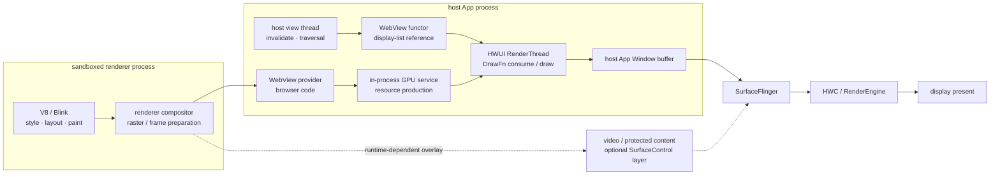

# 7.11 WebView 渲染性能与优化

<!-- outline-start -->
## 本节要点大纲

### 锚点（必须覆盖）

- 🔹 WebView 的双层渲染架构，以及它与 Android 原生渲染管线的关系
- 🔹 首次创建 WebView 的冷启动开销、预热思路与 Perfetto 观察点
- 🔹 JS Bridge / `evaluateJavascript()` 的线程模型与常见 ANR 路径
- 🔹 WebView 的内存模型、典型泄漏方式与排查方法
- 🔹 Chromium 合成器驱动滚动、混合渲染场景与常见掉帧根因
- 🔹 版本演进、Perfetto 线程识别、常见误区与相关章节连接点

### 扩展（可选深入）

- 🔸 Chrome Custom Tabs 与 WebView 的选型边界
- 🔸 WebView 多进程、Renderer 崩溃隔离与调试策略

### OpenClaw 加工指引

> 锚点是最低覆盖要求，加工时必须逐条落实并标注验证状态。
> 涉及 Chromium 线程模型、滚动调度、量化数据和 API 示例时，无法确认的细节保留 `[待验证]`，不要硬写结论。
<!-- outline-end -->

WebView 卡顿常跨越三个边界：网页 renderer、宿主 App 进程中的 WebView/provider/GPU service、Android 窗口显示链路。只看宿主主线程会漏掉 Blink 与 raster；只看 Chromium compositor 又无法证明宿主窗口按时提交和显示。

本章采用两组锚点：

- Android 平台为 Android 17 / API 37 / `android-17.0.0_r1`；
- buffer、fence 与内存压力的 kernel 基线为 `android17-6.18-2026-06_r6`。

WebView provider 是可更新组件，同一台 Android 17 设备可随 provider 更新得到不同 Chromium milestone。所有复现记录还要包含 provider 包名、`versionName`、`versionCode`、应用使用的 AndroidX WebKit 版本和相关 feature flag。Android 平台 tag 只能固定 framework/HWUI 契约，不能代替设备上的 Chromium revision。

## 1. 两条版本线与三个执行域

应用调用的是 `android.webkit.WebView` 或 AndroidX WebKit API，页面引擎来自运行时选中的 provider。Android 17 的 `WebView.getCurrentWebViewPackage()` 可以在不强制装载 provider 的情况下查询候选包；provider 已在进程中装载后，返回值就是该进程采用的包。AndroidX 也提供 `WebViewCompat.getCurrentWebViewPackage(context)`。

一次性能报告至少记录：

- Android build、API level 与 ABI；
- WebView provider 包名、版本名、版本码与更新渠道；
- AndroidX WebKit 版本、`WebViewFeature` 检测结果；
- 系统 WebView、定制 Chromium 或第三方内核；
- hardware acceleration、renderer multiprocess、页面 URL/内容版本；
- GPU backend、WebView flags、是否存在视频或受保护内容 overlay；
- 复现时间、网络、温度、内存压力和缓存冷热状态。

现代系统 WebView 可按三个执行域理解：

1. **宿主 App 进程**：framework WebView、provider glue、browser code、UI 协调，以及 Chromium 架构中的 in-process GPU service 和 Network Service。
2. **sandboxed renderer 进程**：V8、Blink、style/layout/paint、renderer compositor 与部分 raster 工作。renderer 复用关系受 provider、profile 和运行时策略影响。
3. **Android 显示系统**：宿主 ViewRoot、HWUI RenderThread、BLAST/BufferQueue、SurfaceFlinger、CompositionEngine、HWC 与 display。

线程名会随 Chromium 版本变化。`CrRendererMain`、`Compositor`、`VizCompositorThread`、`CrGpuMain`、`Chrome_IOThread` 只能作为搜索入口，进程 cmdline、父子关系、调用栈和 trace category 才能确认角色。

## 2. WebView 与 Android 原生渲染管线怎样相接

### 2.1 标准硬件加速路径：HWUI functor / DrawFn

标准 `android.webkit.WebView` 仍是 Android View。它参与 measure、layout、invalidate、clip、alpha 与窗口生命周期；网页内容由 Chromium 生产，再通过 WebView functor 接入 HWUI。

Android 17 的 `WebViewFunctor.h` 定义 GLES、Vulkan draw callback，以及 overlay transaction 协调接口。宿主主线程在 display list 中记录 functor 引用和边界，HWUI RenderThread 在 sync/draw 阶段调用 provider 的 DrawFn。provider 侧再消费 Chromium compositor frame 与 GPU resource，把网页主体画进宿主 App Window buffer。

下图用于标出标准网页主体与可选媒体 overlay 的不同出口：



图中的实线描述常见主体路径：网页 UI 经 functor 合入宿主窗口。虚线只表示运行时可能出现的视频、受保护内容或 provider overlay，不能据此把整个 WebView 当成独立 Surface。

### 2.2 DOM layer 与 SurfaceFlinger layer 不是同一层级

CSS transform、canvas、图片和 Chromium compositing layer 大多已在 Chromium/HWUI 内部处理。网页主体写入 host buffer 后，SurfaceFlinger 通常只看到宿主 App Window layer。DOM 节点数量也不能推导 SurfaceFlinger layer 数量。

网页视频、protected content、全屏 custom view 或 provider overlay 可能创建独立 `SurfaceControl` child layer。Android 17 的 WebViewFunctor 支持 overlay data、transaction merge 与 remove overlays；是否启用仍受 HWUI 状态、provider、GPU backend 和内容条件控制。常见形态是“网页 UI 在 host buffer，视频在独立 layer”。

遇到额外 layer 时，检查 owner、parent、buffer format、dataspace、crop、z-order 和 transaction。标准 WebView 没有公开 API 让应用随意把主体切到 SurfaceView、TextureView、ImageReader 或自建 HardwareBuffer；这些对象若出现在定制内核中，应按对应 owner 分析。

### 2.3 software fallback

窗口关闭硬件加速、Canvas 不是 hardware accelerated，或 provider 的 hardware draw request 没有被接受时，WebView 可以走 software drawing。CPU raster、Bitmap/shared memory 与内存带宽会成为主要成本。

缺少 WebView GPU/DrawFn slice 不能单独证明 software fallback。还应同时看到 software Canvas、`ViewRootImpl.drawSoftware()`、`Surface.lockCanvas()`、Bitmap 分配或对应调用栈。把 `setLayerType(LAYER_TYPE_SOFTWARE)` 当通用修复通常会增加 CPU 与内存压力，应以兼容性证据和 A/B trace 决定。

### 2.4 从网页更新到显示的一帧

一帧可拆成六段：

1. JS、DOM、style、layout、paint invalidation、图片解码或滚动改变页面状态；
2. renderer compositor 准备 frame，raster worker 准备 tile/resource；
3. frame/resource 信息到达宿主 provider/GPU service；
4. WebView 触发宿主 invalidate，view thread traversal 记录 functor；
5. RenderThread 调用 DrawFn，把网页与原生 View 画入 host buffer 并 queue；
6. SurfaceFlinger latch host layer 与可选媒体 layer，HWC/RenderEngine 完成 composition 和 present。

这些阶段可能重叠。renderer 可以提前生产，宿主也可能在网页新 frame 尚未到达时重绘原生浮层或复用旧网页内容。相邻 slice 不能自动归为同一帧；需要 frame id、window token、buffer sequence 和时间边界建立关联。

## 3. 首次启动：把 provider startup 与页面首屏分开

首次接触 WebView 时，provider 选择、Context/resource 装载、native library、provider class、browser infrastructure、renderer 与页面加载可能叠在同一条关键路径。Android 17 的 `WebViewFactory.java` 已提供以下 framework trace slice：

- `WebViewFactory.getProvider()`；
- `WebViewFactory.getWebViewContextAndSetProvider()`；
- `WebViewFactory.getChromiumProviderClass()`；
- `WebViewFactory.loadNativeLibrary()`；
- `Class.forName()`；
- `WebViewFactoryProvider invocation`。

它们只覆盖 framework/provider 装载的一部分。renderer 创建、网络、HTML parse、FCP/LCP、raster、host draw 和 display present 仍要单独观察。

### 3.1 不要再用 UA 或隐藏 WebView 猜预热效果

调用 `WebSettings.getDefaultUserAgent()` 会进入 `WebViewFactory.getProvider()`。2026-07-13 更新的官方启动指南已把“读取 UA 触发初始化”列为不受支持的旧 workaround，底层行为可以随 provider 变化。创建隐藏 WebView 加载 `about:blank` 还会引入实例、renderer、页面和内存成本，难以控制预热边界。

当前官方方案是 AndroidX WebKit 1.16.0 及以上的 `WebViewCompat.startUpWebView()`。它把可后台执行的启动任务交给指定 executor，并把必须在 UI 线程完成的部分拆开执行。若调用后立刻在 UI 线程创建 WebView 或访问相关 API，UI 线程仍会等待启动追上，收益会缩小。

下面的示例用于在应用级 owner 中异步启动 WebView，并在 UI 回调后创建页面：

```kotlin
private val webViewStartupExecutor = Executors.newSingleThreadExecutor()

fun startWebViewRuntime(context: Context, onReady: () -> Unit) {
    val config = WebViewStartUpConfig.Builder(webViewStartupExecutor).build()

    WebViewCompat.startUpWebView(
        context.applicationContext,
        config,
        object : WebViewOutcomeReceiver<
            WebViewStartUpResult,
            WebViewStartupException
        > {
            override fun onResult(result: WebViewStartUpResult) {
                result.uiThreadBlockingStartUpLocations.orEmpty().forEach { location ->
                    Log.w(
                        "WebViewStartup",
                        "UI blocking startup: " + location.stack
                    )
                }
                onReady()
            }

            override fun onError(error: WebViewStartupException) {
                Log.e("WebViewStartup", "Startup failed", error)
            }
        }
    )
}
```

`onResult` 在 UI 线程回调。executor 应由应用级组件持有并管理，不要为每次页面打开新建线程池。`WebViewStartUpResult` 的 UI/background blocking locations 可定位提前触发 WebView 的 SDK、ContentProvider 或布局 inflate。

### 3.2 预热、预连接、预取、预渲染是四件事

| 操作 | 处理对象 | 资源代价 | 使用条件 |
|---|---|---|---|
| `startUpWebView` | provider/browser runtime | CPU、native memory | WebView 将被使用，启动时机可提前 |
| `Profile.preconnect` | origin 的 DNS/TCP/TLS | 低到中 | 已知 origin，URL 尚未确定 |
| `Profile.prefetchUrlAsync` | 精确 URL 的主 HTML 缓存 | 网络、缓存 | 导航概率较高，HTTPS，feature 支持 |
| `WebViewCompat.prerenderUrlAsync` | 隐藏页面及其脚本/子资源 | CPU、内存、网络较高 | URL 高确定性，UI thread 发起，feature 支持 |

preconnect、prefetch 和 prerender 属于当前 AndroidX WebKit 的 feature-gated 能力，使用前应调用 `WebViewFeature.isFeatureSupported()`。prefetch 不执行页面 JS，也不拉取全部 CSS/子资源；prerender 可能因内存压力或后台不允许的 Web API 被取消。它们还会改变 `shouldInterceptRequest()`、cookie、Service Worker 与缓存的观察路径，不能只比较 `loadUrl()` 到 `onPageFinished()`。

### 3.3 用正确的结束点衡量首屏

`onPageFinished()` 不是页面已呈现或可交互的保证。建议拆开记录：

- provider startup 完成；
- navigation start / response / commit；
- FCP、LCP、Long Task 与业务可交互事件；
- `postVisualStateCallback` 表示当前 WebView 状态已准备绘制；
- host App Window 的 FrameTimeline、queueBuffer 与 display present。

`postVisualStateCallback` 也不是显示硬件的 present fence。用户已经看到内容的证据仍来自 host layer 与 display timeline。

### 3.4 16 KB page size 的边界

Android 15 起平台支持 16 KB page size 设备。宿主 App、provider 与 native libraries 需要满足对应 ELF/APK 兼容要求；不兼容时可能加载或运行失败。页大小可能改变映射、page fault 与 TLB 行为，但不能脱离具体 provider、设备与冷缓存状态推导固定启动收益。A/B 报告应写明 page size、ABI、provider 版本与 trace 证据。

## 4. JS Bridge 与 `evaluateJavascript()`

### 4.1 三个线程事实

Android 17 `WebView.java` 给出的公共契约是：

- `evaluateJavascript()` 必须在创建 WebView 的线程调用，常见为 App MainThread；
- 结果 `ValueCallback` 也回到 UI thread；
- `addJavascriptInterface()` 暴露的方法由 WebView 的 private background thread 调用。

JavaScript 仍在 renderer 的 V8/Blink 执行域。bridge 调用还涉及 renderer、browser side 与 Java bridge thread 之间的任务或 IPC；“Java 方法不在主线程”不能证明它对页面交互和宿主线程没有背压。

### 4.2 `evaluateJavascript()` 不允许同步等待

提交是异步的，回调在 UI thread。若 UI thread 用 `CountDownLatch.await()`、`Future.get()` 或阻塞式 coroutine 等待同一个回调，回调无法运行，会形成自我等待；等待超时前页面输入和生命周期回调也无法处理。

下面的包装保留异步回调，并把大结果解析交给后台 executor：

```kotlin
fun evaluateJson(
    webView: WebView,
    script: String,
    parseExecutor: Executor,
    onParsed: (ParsedResult) -> Unit
) {
    webView.evaluateJavascript(script) { encodedResult ->
        parseExecutor.execute {
            val parsed = parseWebViewResult(encodedResult)
            webView.post { onParsed(parsed) }
        }
    }
}
```

调用和结果投递都经过 WebView thread，CPU 较重的 JSON 解析离开了 UI thread。还要限制脚本与返回数据大小，避免序列化、IPC 和内存峰值掩盖 JS 执行时间。

### 4.3 Bridge 的性能与安全边界

`addJavascriptInterface()` 会把对象暴露给所有 frame，包括 iframe，应用侧无法从该 API 判断调用 frame 的 origin。只要页面可能加载第三方脚本、iframe 或非 allowlist URL，就不能把敏感能力直接放进 bridge。

可执行规则包括：

- JavaScript 非必需时保持关闭；
- bridge 只用于完全受控内容，导航、重定向与 iframe 都要限制；
- 暴露窄接口，参数有大小、类型、频率和权限检查；
- bridge 方法不执行同步 I/O、数据库锁等待、thread join 或大计算；
- 加载不可信内容前移除 interface，重新加载后才会反映；
- 支持时优先评估 `WebViewCompat.addWebMessageListener()`，用精确 HTTPS `allowedOriginRules` 与 `sourceOrigin` 校验；不要使用 `*`；
- 大数据传输改用网络、文件或受控数据通道，并测量序列化成本。

一次 bridge 方法执行过长，JS 调用方会等待，后续 bridge 任务也可能排队。是否同时阻塞 browser UI thread 取决于 provider 实现与调用形态，应以设备 provider 对应 trace 验证，不能仅凭 Java 执行线程推断 ANR 调用链。

## 5. 滚动与混合渲染

### 5.1 compositor scrolling 有条件

Chromium compositor 可以在不依赖 renderer main 更新的场景推进滚动与 compositor-friendly 动画。以下情况会把工作拉回 renderer main、增加同步或放大 raster：

- 非 passive listener 需要决定是否 `preventDefault()`；
- scroll handler 频繁执行 JS；
- DOM 写入后立即读取 `offsetHeight`、`getBoundingClientRect()` 等布局信息；
- 大面积 style/layout/paint invalidation；
- tile 未准备、巨幅图片解码或内存压力导致 tile 淘汰；
- filter、blend、mask、复杂 clip 或大面积透明动画；
- canvas/WebGL 每帧重绘；
- 宿主 View 每帧 resize、clip 或叠加大面积动态透明层。

给 `touchstart`/`touchmove` 加 `passive: true` 只适合从不调用 `preventDefault()` 的监听器。浏览器默认策略会随 provider 与事件目标变化，应让 DevTools 标出 blocking listener，而非把所有 listener 统一改写。

DOM 写操作会使 layout 失效，随后读取几何信息才可能强制同步 layout。优化时把读写分批放入 `requestAnimationFrame`，减少 DOM 范围，并用 DevTools Performance 检查 Recalculate Style、Layout、Paint 与 Long Task。`will-change` 会增加 layer/tile 与内存，不宜全局启用。

### 5.2 宿主原生 UI 也会拖慢网页帧

标准网页主体经 functor 合入 host buffer。Compose/View 浮层、复杂 clip、窗口动画、频繁改变 WebView 尺寸、同帧大量原生 layout，都可能让 host traversal 或 RenderThread 错过 deadline。renderer 已经按时提交 frame 时，用户仍可能看到旧网页内容或整窗迟到。

若网页含视频或 protected overlay，还要分开检查：

- media decoder 的 output buffer 与 acquire fence；
- overlay 几何 transaction 是否跟随宿主滚动；
- host App Window 与 media layer 的 parent/z-order/crop；
- HWC DEVICE/CLIENT composition 是否切换；
- HDR/SDR、alpha、旋转和 plane 资源限制。

“WebView 上盖原生 View 会固定多一次 SurfaceFlinger 合成”没有统一依据。普通原生 View 与网页主体可能都在 host buffer；只有 layer tree 里出现独立 child layer 时，才按多 Surface 路径分析。

## 6. WebView 的内存模型

### 6.1 至少统计两个进程与四类资源

宿主进程通常包含 framework/provider Java 对象、browser native heap、network cache、GPU service、HWUI 与 App 自身内存；renderer 进程包含 V8 heap、DOM/style/layout 对象、decoded image、raster tile 和 renderer native heap。graphics/dma-buf 还可能由进程、驱动或 SurfaceFlinger 以不同口径记账。

一次内存审计应同时采集：

- 宿主 App 与所有 sandboxed renderer 的 RSS/PSS；
- Java heap、native heap、graphics、dmabuf/GL/Vulkan 相关类别；
- V8 heap、DOM node、detached node、listener/timer 与页面 cache；
- 图片解码尺寸、tile/cache、视频 buffer；
- renderer priority、process death 与 `onRenderProcessGone()`；
- kernel page fault、direct reclaim、`kswapd`、zram、PSI memory 与 dma-buf wait。

`dumpsys meminfo`、Perfetto counters、heapprofd、Chrome DevTools Memory 与厂商 GPU 工具覆盖范围不同。单独看到 App Java heap 稳定不能排除 renderer、native 或 graphics 增长。

### 6.2 `destroy()` 的保证范围

Android 17 `WebView.destroy()` 会检查调用线程并交给 provider 销毁实例。文档要求 WebView 先从 View system 移除；`destroy()` 后不能再调用任何实例方法。它不会承诺共享 provider、renderer、HTTP cache、GPU cache 或进程 PSS 立即回到创建前。

下面的清理顺序用于结束一个展示态 WebView 的 App 引用与实例生命周期：

```kotlin
fun disposeWebView(
    webView: WebView,
    parent: ViewGroup,
    bridgeName: String?
) {
    parent.removeView(webView)
    webView.stopLoading()
    if (bridgeName != null) {
        webView.removeJavascriptInterface(bridgeName)
    }
    webView.webChromeClient = null
    webView.destroy()
}
```

这段函数必须在创建 WebView 的同一 Looper 调用。无需为了清理再加载 `about:blank`；那会启动一次新导航。`clearCache(true)` 是应用级 WebView cache 操作，会影响同一应用的其他 WebView，不适合作为每个页面的收尾动作。

### 6.3 常见泄漏与“看起来没释放”

- Activity/Fragment 持有 WebView，WebView 仍挂在 parent；
- WebViewClient、WebChromeClient、DownloadListener、bridge 或 callback 持有页面对象；
- Handler/Runnable、coroutine、observer、文件选择器与权限回调未取消；
- 网页的 timer、listener、Service Worker、DOM detached node 或 JS closure 仍活跃；
- WebView 池复用时没有隔离 profile、URL、bridge、clients、history 和业务账号；
- provider/global cache 或共享 renderer 继续存在，被误判为单实例泄漏。

展示态 WebView 应使用能提供主题、窗口 token、Autofill 与权限 UI 的页面 Context。`applicationContext` 更适合无 UI 的应用级 API；它不能替代宿主生命周期清理。大规模 WebView pool 会常驻 renderer、V8、tile 与页面状态，只有在复用收益经过内存、隔离与生命周期测试后才考虑。

### 6.4 renderer importance 与回收策略

`setRendererPriorityPolicy()` 只影响 out-of-process renderer 在内存压力下的绑定优先级。多个 WebView 共享 renderer 时，最终优先级取关联实例请求的最高值。默认 `RENDERER_PRIORITY_IMPORTANT`；降低不可见 WebView 的优先级会增加 renderer 被回收概率。

调整 priority 前必须实现 `onRenderProcessGone()`。否则系统回收 renderer 后，App 可能被杀或因默认返回 `false` 而崩溃。

## 7. renderer 退出与无响应

### 7.1 `onRenderProcessGone()`

API 26 起，renderer crash 或系统回收会通过 `WebViewClient.onRenderProcessGone()` 通知。Android 17 默认实现返回 `false`：renderer crash 时 App 会崩溃，renderer 被系统杀时 App 会被终止。若应用返回 `true` 继续运行，必须满足：

- 当前 `view` 已不可用，不能读取 URL 或继续调用；
- 从 hierarchy 移除；
- 清理 Activity/Fragment 等位置保存的引用；
- 调用 `destroy()`；
- 按业务需要创建新实例；
- 同一 renderer 影响多个 WebView 时，每个回调只清理传入实例；
- 对重复 crash 设置次数上限，避免同一 URL 的重建循环。

下面的处理器只负责清理死实例并把重建交给页面 owner：

```kotlin
override fun onRenderProcessGone(
    view: WebView,
    detail: RenderProcessGoneDetail
): Boolean {
    Log.e(
        "WebViewRenderer",
        "renderer gone: didCrash=${detail.didCrash()}, " +
            "priority=${detail.rendererPriorityAtExit()}"
    )

    container.removeView(view)
    view.destroy()
    if (currentWebView === view) {
        currentWebView = null
    }

    rendererRecovery.requestRecreateWhenVisible()
    return true
}
```

导航状态要在 renderer 退出前由页面 owner 维护，不能在回调中从失效 WebView 读取。重建时还要恢复 settings、clients、bridge、profile 与 allowlist；对 crash URL 应显示错误页或退避。

### 7.2 `WebViewRenderProcessClient`

API 29 起，`onRenderProcessUnresponsive()`/`onRenderProcessResponsive()` 提供 renderer responsiveness 信号。无响应回调最短间隔为 5 秒；WebView 不会自动采取动作。`WebViewRenderProcess.terminate()` 可能影响共享同一 renderer 的多个 WebView，调用前要确保所有关联实例都能处理 `onRenderProcessGone()`。

无响应不等同于 App ANR。renderer 可能在执行长 JS task、layout、GC 或等待资源，而宿主 main 仍能响应。是否终止要结合页面重要性、用户操作、重复次数和数据保存策略。

## 8. Perfetto 与 WebView tracing 的分工

### 8.1 system Perfetto 看跨域时序

system trace 适合回答：

- App MainThread/View thread 是否被 provider startup、bridge 结果处理或宿主 layout 占用；
- sandboxed renderer 是否 Running、Runnable、blocked，CPU 跑在哪个核；
- RenderThread functor/DrawFn 与 GPU work 是否拖住 host frame；
- host buffer 何时 queue，SurfaceFlinger 何时 latch；
- media overlay 的 buffer/fence/transaction 是否迟到；
- 调度、频率、thermal、reclaim、binder 与 I/O 是否参与。

采集配置应包含 sched/freq/idle、am/wm/view/gfx/input/webview、FrameTimeline、SurfaceFlinger 与 process stats；需要调用栈时增加 CPU sampling，需要 native allocation 时单独配置 heapprofd。设备不支持的 category 应从 `atrace --list_categories` 与 Perfetto data source 列表确认。

### 8.2 Chromium/WebView trace 看网页内部

Chrome DevTools Performance 适合 JS、Long Task、style、layout、paint、network waterfall、FCP/LCP 与 DOM。AndroidX `TracingController` 可对应用内所有 WebView 启用选定 Chromium categories，停止时输出 JSON trace；使用前检查 `TRACING_CONTROLLER_BASIC_USAGE`。输出能在 Chrome tracing 工具中分析，采集本身也有开销，不应常开。

`WebView.setWebContentsDebuggingEnabled(true)` 是进程级开关，不受 manifest `debuggable` 自动控制。只应在开发构建或明确授权的诊断环境打开。WebView DevTools 与 Chrome DevTools 用途不同：前者管理 provider/flags/crash/net-log，后者检查页面内容。

### 8.3 六步证据链

1. 记录 provider、profile、URL、硬件加速与复现条件；
2. 找出宿主、renderer 与 provider/GPU service 线程；
3. 检查 SurfaceFlinger layer tree，区分 host 主体与媒体 overlay；
4. 从 renderer task、raster、provider frame 到 host traversal、DrawFn 逐段对齐；
5. 结合 thread state 区分 CPU 工作、Runnable 调度延迟、futex/IPC/fence 等待；
6. 追到 host/media buffer、SF latch、composition type 和 display present。

下面的现象表用于缩小搜索范围：

| 现象 | 候选环节 | 补充证据 |
|---|---|---|
| renderer main 长 Running | JS、style、layout、paint、V8 GC | DevTools、CPU profile、Long Task |
| renderer Runnable 很久 | CPU 争用或调度 | sched、频率、thermal、其他进程 |
| raster/decode 晚 | tile、图片、cache miss、内存压力 | worker、decode、I/O、reclaim |
| frame 已到 provider，host 很晚才 draw | invalidate、View traversal、宿主抢占 | `doFrame`、ViewRoot、Runnable latency |
| RenderThread DrawFn 变长 | resource import、functor sync/draw、GPU/fence | DrawFn、GPU queue、backend、fence |
| host queue 正常，SF 未及时换帧 | acquire fence、transaction、latch/display | host layer、FrameTimeline、SF/HWC |
| 网页正常，视频卡或位置漂移 | decoder、media overlay 或几何 transaction | video layer、fence、crop、parent |
| PSS 增长后滚动恶化 | GC、tile 淘汰、redecode、reclaim | 多进程内存、PSI、page fault |

主 App FrameTimeline 通常覆盖 host App Window，未必为 Chromium 内部每个 compositor frame 提供单独 expected/actual。网页 frame ready、`postVisualStateCallback` 和 host present 要分别解释。

## 9. Chrome Custom Tabs 的选择边界

Chrome Custom Tabs 适合打开外部或半受控网页，需要浏览器安全模型、账号/session、导航与分享能力，又不需要把 DOM 深度嵌进 App View hierarchy 的场景。它支持 browser service warmup 与 `mayLaunchUrl()`，但收益取决于用户设备上的浏览器实现和连接状态。

WebView 适合页面必须嵌入 App 布局、需要受控 bridge、定制输入/窗口行为或与原生组件紧密协作的场景。选择时比较：

| 维度 | WebView | Custom Tabs |
|---|---|---|
| UI 嵌入 | View hierarchy 内 | 浏览器管理的页面 UI |
| JS/native 交互 | 可提供受控 bridge | 能力更窄 |
| 浏览器账号与数据 | App 独立 WebView data/profile | 取决于浏览器 |
| 生命周期与内存 | App 承担实例和 renderer 管理 | 浏览器承担更多管理 |
| 调试与渲染控制 | 更细 | 较少 |
| 安全边界 | App 必须严格限制内容与 bridge | 浏览器导航模型更完整 |

CCT 不能替代需要深度混合渲染的 WebView，WebView 也不适合为了显示任意外部网页而复制浏览器功能。

## 10. 与其他章节配合

- [Android 渲染架构](../../part1-fundamentals/ch02-rendering/01-rendering-overview.md)用于理解宿主 ViewRoot、RenderThread、SurfaceFlinger 与 HWC。
- [BufferQueue](../../part1-fundamentals/ch02-rendering/13-buffer-queue.md)用于追 host window 和 media overlay 的 buffer/fence。
- [卡顿分析方法论](./03-jank-methodology.md)用于建立 FrameTimeline、线程状态和最终 present 的证据。
- [ANR 分析](../ch09-anr/03-anr-analysis.md)用于区分宿主 main 阻塞、renderer 无响应和 App ANR。
- [Perfetto 高级用法](../../part3-tools/ch13-perfetto/07-advanced-usage.md)用于多进程、SQL、CPU sampling 与内存分析。

## 11. 版本演进：平台与 provider 分开记

| 平台版本 | framework / 集成边界 | 分析影响 |
|---|---|---|
| Android 5.0 / API 21 | WebView 成为可更新 provider | Chromium 修复不再只依赖平台 OTA |
| Android 8.0 / API 26 | multiprocess renderer 能力、Termination Handling、renderer priority | renderer 可能独立；O–Q 低内存 32 位仍需识别 in-process |
| Android 9 / API 28 | framework WebView tracing API | 可采集 provider 内部 trace，仍要做 feature/version 判断 |
| Android 10 / API 29 | `WebViewRenderProcessClient` 与 `terminate()` | 可观测 renderer 无响应；终止可能影响共享实例 |
| Android 11 / API 30 | 现代 provider 默认使用 out-of-process renderer | trace 通常出现 sandboxed renderer，仍按设备确认 |
| Android 15 / API 35 | 16 KB page size 兼容边界 | 先检查 native 兼容，再讨论启动性能 |
| Android 16 / API 36 | WebView DevTools 在开发者选项中提供设备侧入口 | provider/flags/crash/net-log 诊断更直接 |
| Android 17 / API 37 | `android-17.0.0_r1` 固定 framework、HWUI functor、overlay 协调与显示端契约 | Chromium milestone 仍由设备 provider 决定 |

AndroidX WebKit 提供跨平台的 provider feature 封装。`startUpWebView`、multi-profile、origin-scoped messaging 与 speculative loading 等能力应按 AndroidX 版本和 `WebViewFeature` 检测，不要写成“Android 17 设备必定支持”。

kernel 统一到 `android17-6.18-2026-06_r6` 后，WebView host buffer 与媒体 overlay 仍使用 dma-buf、dma-fence/sync_file 一类基础语义。GPU service、vendor driver 和 codec driver 的队列与内存记账需要设备 tracepoint 和厂商工具补齐。

## 12. 可执行检查清单

### 环境与版本

- [ ] 记录 Android build/API、ABI、provider 包与完整版本。
- [ ] 记录 AndroidX WebKit 版本、feature 检测、profile 与 WebView flags。
- [ ] 区分系统 WebView、定制内核和 CCT。
- [ ] 固定页面内容、网络、缓存、温度和复现时间。

### 启动与首屏

- [ ] 从 `WebViewFactory.getProvider()` 到 native library/provider invocation 逐段量时。
- [ ] 使用 `startUpWebView()`；不再依赖 UA 或隐藏 WebView workaround。
- [ ] 避免启动后立刻在 UI thread 访问 WebView。
- [ ] 分开记录 provider startup、navigation、FCP/LCP、visual state 与 host present。
- [ ] speculative loading 按 feature、命中率、内存和网络代价评估。

### JS 与 bridge

- [ ] `evaluateJavascript()` 全异步，UI thread 不等待 callback。
- [ ] 大结果解析离开 UI thread，脚本和返回值有大小限制。
- [ ] `addJavascriptInterface()` 只用于完全受控内容。
- [ ] URL、重定向、iframe、origin、参数和调用频率都有约束。
- [ ] bridge 方法不执行同步 I/O、锁等待或长计算。

### 内存与生命周期

- [ ] 同时统计 host 与 renderer 进程，区分 Java/native/graphics/V8/DOM。
- [ ] WebView 先移出 parent，再在创建 Looper 调用 `destroy()`。
- [ ] `destroy()` 后没有任何实例方法、callback 或 Runnable 继续访问。
- [ ] 不把共享 provider/cache/renderer 常驻直接判为实例泄漏。
- [ ] 调整 renderer priority 前实现终止恢复。
- [ ] renderer 退出后销毁旧实例并重建，带重试上限。

### 滚动与显示

- [ ] DevTools 检查 Long Task、style/layout/paint、blocking listener 和 tile。
- [ ] Perfetto 同时看 renderer、host Main、RenderThread、SF/HWC。
- [ ] 确认网页主体是否经 functor 合入 host window。
- [ ] 额外 layer 先判定 video/protected/custom view owner。
- [ ] 追到 buffer、fence、latch、composition 与 display present。
- [ ] software fallback 必须有 Canvas/调用栈/trace 证据。

## 13. Android 17 与 provider 源码入口

Android 平台与 kernel 固定源码：

- [`WebView.java`：线程检查、JS API、renderer 控制与 provider 版本](https://android.googlesource.com/platform/frameworks/base/+/android-17.0.0_r1/core/java/android/webkit/WebView.java)
- [`WebViewFactory.java`：provider 选择、native library 与 startup trace](https://android.googlesource.com/platform/frameworks/base/+/android-17.0.0_r1/core/java/android/webkit/WebViewFactory.java)
- [`WebViewClient.java`：`onRenderProcessGone()` 契约](https://android.googlesource.com/platform/frameworks/base/+/android-17.0.0_r1/core/java/android/webkit/WebViewClient.java)
- [`WebViewRenderProcessClient.java`：renderer responsiveness](https://android.googlesource.com/platform/frameworks/base/+/android-17.0.0_r1/core/java/android/webkit/WebViewRenderProcessClient.java)
- [`WebViewRenderProcess.java`：renderer `terminate()`](https://android.googlesource.com/platform/frameworks/base/+/android-17.0.0_r1/core/java/android/webkit/WebViewRenderProcess.java)
- [`WebViewFunctor.h`：GLES/Vulkan DrawFn 与 overlay 接口](https://android.googlesource.com/platform/frameworks/base/+/android-17.0.0_r1/libs/hwui/private/hwui/WebViewFunctor.h)
- [`WebViewFunctorManager.cpp`：functor 生命周期](https://android.googlesource.com/platform/frameworks/base/+/android-17.0.0_r1/libs/hwui/WebViewFunctorManager.cpp)
- [kernel `dma-buf.c`](https://android.googlesource.com/kernel/common/+/refs/tags/android17-6.18-2026-06_r6/drivers/dma-buf/dma-buf.c)
- [kernel `sync_file.c`](https://android.googlesource.com/kernel/common/+/refs/tags/android17-6.18-2026-06_r6/drivers/dma-buf/sync_file.c)

Chromium 上游入口用于理解当前架构；复现时要切到设备 provider 对应 revision：

- [Android WebView architecture](https://chromium.googlesource.com/chromium/src/+/refs/heads/main/android_webview/docs/architecture.md)
- [WebView renderer model](https://chromium.googlesource.com/chromium/src/+/refs/heads/main/android_webview/renderer/README.md)
- [WebView threading](https://chromium.googlesource.com/chromium/src/+/refs/heads/main/android_webview/docs/threading.md)
- [Java bridge](https://chromium.googlesource.com/chromium/src/+/refs/heads/main/android_webview/docs/java-bridge.md)
- [`AwDrawFnImpl`](https://chromium.googlesource.com/chromium/src/+/refs/heads/main/android_webview/browser/gfx/aw_draw_fn_impl.cc)

公开 API 与工程指南：

- [WebView 开发指南](https://developer.android.com/develop/ui/views/layout/webapps/webview)
- [优化 WebView startup](https://developer.android.com/develop/ui/views/layout/webapps/optimize-webview-startup)
- [Speculative loading](https://developer.android.com/develop/ui/views/layout/webapps/speculative-loading)
- [管理 WebView 与 renderer priority](https://developer.android.com/develop/ui/views/layout/webapps/managing-webview)
- [处理 renderer termination](https://developer.android.com/develop/ui/views/layout/webapps/handle-termination)
- [WebView native bridge 安全边界](https://developer.android.com/privacy-and-security/risks/insecure-webview-native-bridges)
- [AndroidX `WebViewCompat`](https://developer.android.com/reference/androidx/webkit/WebViewCompat)
- [AndroidX `TracingController`](https://developer.android.com/reference/androidx/webkit/TracingController)
- [Chrome DevTools 调试 WebView](https://developer.android.com/develop/ui/views/layout/webapps/debug-chrome-devtools)
