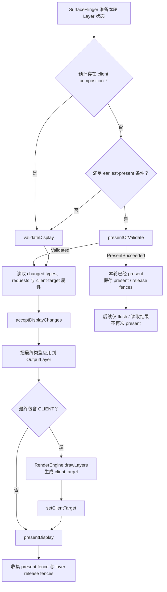

---

title: "HWC Overlay Plane 与合成降级排查"
chapter: "7.12"
section: "7.12"
status: finalized
applicable_versions: "Android 10 (API 29) - Android 17 (API 37)"
last_verified: "2026-06-22"
last_verified_against: "AOSP android-17.0.0_r1 frameworks/native SurfaceFlinger/HWC2/CompositionEngine + hardware/interfaces composer3 AIDL + source.android.com HWC docs + Perfetto FrameTimeline docs"
confidence: medium
sources:
  - type: aosp
    path: "frameworks/native/services/surfaceflinger/DisplayHardware/HWC2.cpp"
  - type: aosp
    path: "frameworks/native/services/surfaceflinger/CompositionEngine/src/Output.cpp"
  - type: aosp
    path: "hardware/interfaces/graphics/composer/aidl/android/hardware/graphics/composer3/Composition.aidl"
  - type: aosp
    path: "hardware/interfaces/graphics/composer/aidl/android/hardware/graphics/composer3/OverlayProperties.aidl"
  - type: official
    path: "https://source.android.com/docs/core/graphics/hwc"
  - type: official
    path: "https://source.android.com/docs/core/graphics/implement-hwc"
  - type: official
    path: "https://perfetto.dev/docs/data-sources/frametimeline"
  - type: research
    path: "/Users/gracker/Library/Mobile Documents/iCloud~md~obsidian/Documents/Obsidian/DeepResearch/2026-05-22-hwc-overlay-plane-capability-sf-composition-downgrade.md"
tags: [hwc, surfaceflinger, overlay-plane, client-composition, jank, perfetto, winscope]
related_chapters: ["2.6", "2.15", "2.16", "7.4", "7.6", "14.21", "18.15"]
pipeline_stage: ready-to-publish
task6_state: reviewed
task9_state: reviewed
task2b_state: fixed
---

# 7.12 HWC Overlay Plane 与合成降级排查

## 诊断边界：App 按时交帧，屏幕仍可能迟到

平台源码版本为 Android 17 / API 37、`android-17.0.0_r1`，内核版本为 `android17-6.18-2026-06_r6`。Composer HAL（显示合成器硬件抽象层）、显示驱动和 plane（显示硬件合成平面）分配策略通常由厂商实现。AOSP 可以确认接口含义与 SurfaceFlinger（系统合成服务）的调用关系，设备行为仍需要实机证据。

一次可见更新至少涉及两类帧记录：

- **SurfaceFrame**：记录某个 App 或系统 Layer（图层）生产并提交的一帧，通常关联 `surface_frame_token`（Surface 帧标识）。
- **DisplayFrame**：记录 SurfaceFlinger 汇集本轮可见 Layer、完成合成并提交显示的一帧，关联 `display_frame_token`（显示帧标识）。

App 的 `Choreographer#doFrame` 和 RenderThread（渲染线程）按时结束，只能说明该 SurfaceFrame 没有明显迟到。此后还要经过 BufferQueue（图形缓冲队列）、SurfaceFlinger latch（获取并采用缓冲区）、composition strategy（合成策略）、RenderEngine（GPU 合成引擎）或 Composer HAL、display driver（显示驱动）和 panel scanout（面板逐行扫描显示）。DisplayFrame 在后半段错过目标 VSync（垂直同步），用户仍会看到掉帧或延迟。

适合进入 HWC 合成排查的现场通常具备以下组合：

- App 侧 SurfaceFrame 大多按时，关联的 DisplayFrame 却出现 `SurfaceFlingerCpuDeadlineMissed`、`SurfaceFlingerGpuDeadlineMissed` 或 `DisplayHAL`（显示侧错过时限）。
- 视频、相机、画中画、外接屏、系统浮层或高刷新率打开后复现，关闭其中一个条件后缓解。
- SurfaceFlinger 侧出现 GPU composition（GPU 合成），或同一 Layer 的最终 composition type（合成类型）在 `DEVICE` 与 `CLIENT` 之间变化。
- RenderEngine、HWC validate/present（能力校验/显示提交）或 fence 等待的时长与卡顿帧在时间上对应。

composition type 的变化本身不是故障。只有它与 DisplayFrame 迟到、GPU/DPU（图形/显示处理器）负载或 fence 延迟同时出现，才能支持“合成方式变化导致问题”的结论。

## 先分清 Surface、Layer 与显示合成对象

业务看到的是一个页面，SurfaceFlinger 处理的却是一组独立 Layer。内容通过何种载体输出，会改变 HWC 收到的输入。

| 输出形态 | SurfaceFlinger 看到的对象 | HWC 的选择空间 |
|---|---|---|
| 普通 View / Compose | 宿主 App Window Layer | 对宿主最终 buffer（图形缓冲区）选择 DEVICE 或 CLIENT |
| `SurfaceView` | 宿主窗口与独立 child Surface（子 Surface） | 视频或相机 Layer 可以独立参与每帧协商 |
| `TextureView` | 外部 buffer 已由宿主 HWUI（Android 硬件加速 UI 渲染管线）采样进 App Window | HWC 看不到可以单独分配给视频矩形的 Layer |
| Tunneled Playback（隧道播放） | sideband Layer（旁路媒体图层）与厂商媒体路径 | 依赖 `SIDEBAND` capability（能力）、codec HAL（编解码器硬件抽象层）和 HWC |
| Protected content（受保护内容） | 带安全约束的 Layer / buffer | 只能选择满足 secure composition（安全合成）要求的路径 |

`SurfaceView` 提供独立 Layer，因此显示硬件有机会单独处理视频或相机画面，但它不保证一定使用 overlay（硬件叠加平面）。`TextureView` 的 View 变换、裁剪和 alpha（透明度）更灵活，代价是视频 buffer 要由宿主 RenderThread 采样进 App Window，不再存在独立的视频 Layer。

独立 producer（内容生产者）不要求在同一个显示周期同时更新。一个 DisplayFrame 可以合法地组合“新宿主 UI + 旧视频 buffer”或“旧宿主 UI + 新视频 buffer”。遇到字幕、遮罩和视频内容错位时，应核对目标 present 采用了哪组 buffer 与 transaction（图层状态事务）；composition type 只能回答合成方式，不能说明内容是否来自同一时刻。

受保护内容也不能直接等同于普通 overlay。设备可能使用安全 plane，也可能使用受保护图形上下文支持的安全合成。出现黑屏、外接屏失败或截图不可见时，应核对 DRM（数字版权管理）、secure decoder（安全解码器）、buffer usage（缓冲区用途标记）、HDCP（数字内容传输保护）与 Composer capability，不能只根据 `DEVICE` 一个字段下结论。

视频从 codec 提交到 Surface 后仍要经历 queue、latch、合成与 present。完整的视频时序和 SurfaceView / TextureView 差异见 [18.15 视频叠加与 HWC](../ch18-rendering-pipelines/15-video-overlay-hwc.md)。

## Android 17 的 Composition 类型

Android 17 的 Composer3 AIDL（Android 接口定义语言）在 `Composition.aidl` 中定义了八个枚举值。排查工具显示的值应按以下定义理解：

| 类型 | Android 17 语义 | 诊断时的边界 |
|---|---|---|
| `INVALID` | 无效占位值 | 不能作为有效策略 |
| `CLIENT` | SurfaceFlinger client 将 Layer 画进 client target（GPU 合成后的整屏目标缓冲区），再用 `setClientTarget` 交给设备 | 说明该 Layer 参加 GPU/client composition（客户端合成） |
| `DEVICE` | 设备通过 hardware overlay（硬件叠加）或相似机制处理 Layer | 不足以证明占用某个物理 plane |
| `SOLID_COLOR` | 设备按 `setLayerColor` 直接生成纯色 | 能力不满足时，HWC 可要求改为 `CLIENT` |
| `CURSOR` | 类似 `DEVICE`，还允许异步更新 cursor（光标）位置 | HWC 可改为 `DEVICE` 或 `CLIENT` |
| `SIDEBAND` | 设备接管 Layer 的内容更新与同步 | 只在声明 `SIDEBAND_STREAM` capability 的设备上成立 |
| `DISPLAY_DECORATION` | 为挖孔和屏幕圆角提供抗锯齿装饰 | 依赖 `getDisplayDecorationSupport()` |
| `REFRESH_RATE_INDICATOR` | 类似 `DEVICE`，更新不应重置 HWC 的 activity timer（活跃计时器） | 能力不足时可改为 `CLIENT` |

`DEVICE` 的接口定义特意保留了 “hardware overlay or other similar means”。因此，以下推断都越过了公开证据边界：

- 看到 `DEVICE` 就断言该 Layer 独占一个物理 overlay plane。
- 统计 `DEVICE` Layer 数就反推出设备 plane 总数。
- 某一帧为 `DEVICE`，便认为后续帧会维持相同分配。

Composer 会针对每个显示帧重新协商。Layer 集合、属性、显示模式或资源竞争改变后，HWC 可以给出不同结果。混合合成也很常见：若一部分 Layer 为 `CLIENT`，RenderEngine 会把它们画进一张 client target；HWC 再把 client target 与剩余的 `DEVICE`、`CURSOR` 或其他 Layer 一起提交显示。

## validate、presentOrValidate 与 present

旧式流程图经常把每帧写成先调用 `validateDisplay()`（校验各 Layer 的合成方式），再固定调用 `presentDisplay()`（提交本轮显示）。Android 17 的 `HWComposer::getDeviceCompositionChanges()` 还支持通过快速分支跳过单独的 validate 调用。

下面的状态图用来区分 Android 17 中的两条提交路径。图中的 earliest-present 表示当前条件允许 HWC 尝试直接完成 present。



`PresentSucceeded` 表示 `presentOrValidate()` 已经完成本轮 present；`Validated` 表示本轮只完成了 validate，后续仍要读取 HWC 要求的类型变化并继续提交。进入 `presentAndGetReleaseFences()` 时，`validateWasSkipped` 分支只会 flush（提交）待执行命令并检查已经保存的结果，不会再次 present。

源码调用关系可以按三层阅读：

1. `CompositionEngine/src/Display.cpp` 的 `chooseCompositionStrategy()` 调用 `HWComposer::getDeviceCompositionChanges()`；`applyCompositionStrategy()` 把 HWC 返回的 changed types（要求修改的合成类型）和 requests（显示或图层请求）应用到 Layer，并重新计算 `usesClientComposition`（是否需要客户端合成）。
2. `DisplayHardware/HWComposer.cpp` 决定调用 `presentOrValidate()` 或 `validate()`，读取 changed types、display/layer requests、client-target 属性后执行 `acceptChanges()`（接受 HWC 提出的修改）。
3. `CompositionEngine/src/Output.cpp` 在 `usesClientComposition` 为真时进入 `composeSurfaces()`，由 `RenderEngine::drawLayers()` 生成 client target；`Display::presentFrame()` 再调用 `presentAndGetReleaseFences()`（提交显示并取得释放栅栏）。

`acceptDisplayChanges()` 发生在 SurfaceFlinger 接受 HWC 请求的阶段。工具中若同时展示“客户端原始请求类型”和“validate 后的最终类型”，排查时应采用最终被接受的类型，避免把 `DEVICE` 的初始请求误当成该帧的实际结果。

## Overlay 能力没有通用的 plane 数字

早期 HWC 文档用“四个 overlay plane”举例说明硬件资源不足时改用其他合成方式的现象。这个示例不能当作现代设备规格。AOSP 没有要求所有设备提供固定数量的 plane，普通应用也没有公开 API 可以查询或锁定 plane。

Android 17 的 `IComposerClient.getOverlaySupport()` 返回 `OverlayProperties`。该结构描述以下能力：

- pixel format（像素格式）与 dataspace 的 standard、transfer、range（色彩标准、传递函数、范围）有效组合；
- DPU 能否同时处理至少两种输入色彩空间；
- HWC 支持的 1D / 3D LUT（颜色查找表）属性。

它不会返回物理 plane 数量、每个 plane 的缩放器数量、当前帧的分配结果或厂商功耗策略；接口本身也位于系统与 Composer HAL 之间，不属于应用 SDK。

设备评估至少要同时记录这些条件：

| 约束 | 容易触发变化的现场 | 需要核对的证据 |
|---|---|---|
| Layer 数量与共享资源 | 双视频、相机预览、字幕、系统栏、悬浮窗并存 | 可见 Layer 集合、z-order（前后层级）、最终类型 |
| format / dataspace | YUV + RGBA、HDR（高动态范围）+ SDR（标准动态范围）、广色域 UI | buffer 格式、dataspace、颜色转换 |
| crop / scale / transform | 画中画、旋转动画、自由窗口、外接屏 | source crop（源裁剪区域）、display frame（目标显示区域）、transform（变换） |
| alpha / blending | 半透明控制栏、圆角遮罩、模糊、淡入淡出 | plane blending（混合）能力、client target |
| protected / sideband | DRM 视频、tunneled playback | secure path、capability、HWC/DRM 日志 |
| display decoration | 屏幕圆角、挖孔抗锯齿 | `DISPLAY_DECORATION` 支持及最终类型 |
| 刷新率与分辨率 | 120 Hz、4K 外接屏、多显示器 | active mode（当前显示模式）、像素吞吐、带宽与时钟 |
| 厂商资源策略 | 温控、省电、writeback（显示内容回写）、并发显示 | 同机 HWC 日志、驱动 trace、功耗状态 |

格式、缩放、颜色混合与 plane 往往共享 DPU 资源。只看 Layer 数，无法区分“plane 不够”“该格式不能缩放”“HDR/SDR 混合超出色彩能力”，或“厂商策略主动选择 client composition”。

## 证据采集：从 DisplayFrame 回到合成决策

较稳妥的取证顺序是：先定位迟到的 DisplayFrame，判断本轮是否使用 GPU composition，再查看 Layer composition、RenderEngine/HWC slice（时间区间）与 fence。`dumpsys` 只提供执行命令时附近的状态快照，不能单独证明某次卡顿帧发生了类型切换。

### FrameTimeline：定位责任范围

FrameTimeline 从 Android 12 起可用。SurfaceFlinger 的 Actual Timeline（实际时间线）覆盖 SurfaceFlinger、Composer 和 Display HAL，适合初步区分问题位于 App、SurfaceFlinger CPU、SurfaceFlinger GPU 还是 DisplayHAL。SurfaceView 的应用侧轨道仍有覆盖限制，视频和相机场景还要补充 Layer 与 HWC 证据。

下面的查询用于列出迟到帧及其 GPU composition 标记，不依赖界面上可能变化的中文或英文标签。

```sql
select
  actual.id,
  actual.ts,
  actual.dur,
  actual.surface_frame_token as app_token,
  actual.display_frame_token as sf_token,
  actual.jank_type,
  actual.present_type,
  actual.gpu_composition,
  actual.layer_name,
  process.name as process_name
from actual_frame_timeline_slice as actual
left join process using (upid)
where actual.jank_type is not null
  and actual.jank_type != 'None'
order by actual.ts;
```

`app_token` 与 `sf_token` 属于不同对象，不能仅因数值相等就把它们关联起来。Perfetto 的 flow（事件流关系）或 `display_frame_token` 才用于确认某个 SurfaceFrame 进入了哪个 DisplayFrame。`gpu_composition = 1` 只说明该 DisplayFrame 使用过 GPU composition，不提供每个 Layer 的 plane 分配结果。

FrameTimeline 的三类显示侧结果可用于缩小检查范围：

- `SurfaceFlingerCpuDeadlineMissed`：检查 SurfaceFlinger 主线程、validate/present 阻塞、Layer 数与 transaction 压力。device composition 的同步调用时间也计入这一段。
- `SurfaceFlingerGpuDeadlineMissed`：检查 RenderEngine client target、GPU fence、颜色转换和 client composition 覆盖的像素面积。
- `DisplayHAL`：SurfaceFlinger 已按时把帧交给显示侧，但目标 VSync 没有呈现。检查 HWC/display driver、present fence、模式切换和带宽。

这些分类只能指出应继续检查的范围，不能直接给出原因。`SurfaceFlingerGpuDeadlineMissed` 可能来自像素工作较多的 client composition，也可能来自 GPU 降频或其他 GPU 工作竞争。

### SurfaceFlinger Layer trace 与 Winscope：查看最终 Layer 状态

Android 15 起，Winscope trace（窗口与图层跟踪）已接入 Perfetto。Android 17 上使用 `android.surfaceflinger.layers`，并启用 `TRACE_FLAG_COMPOSITION`，才能记录 composition type 与 visible region（可见区域）；`TRACE_FLAG_HWC` 可以加入更多非结构化的 HWC 元数据。

下面的最小配置面向短时、可重复的实验室复现。

```text
buffers {
  size_kb: 65536
  fill_policy: RING_BUFFER
}
duration_ms: 10000
data_sources {
  config {
    name: "android.surfaceflinger.frametimeline"
  }
}
data_sources {
  config {
    name: "android.surfaceflinger.layers"
    surfaceflinger_layers_config {
      mode: MODE_ACTIVE
      trace_flags: TRACE_FLAG_COMPOSITION
      trace_flags: TRACE_FLAG_HWC
      trace_flags: TRACE_FLAG_BUFFERS
    }
  }
}
```

`MODE_ACTIVE` 和 HWC/buffer flags 会增加采集开销与内存占用，只适合受控的短时间测试；性能敏感的长时间采集应使用官方建议的 generated/bugreport（系统生成/错误报告）模式，再根据设备构建确认能保留哪些 composition 信息。部分采集能力只在 `userdebug` 或 `eng`（工程调试）构建中可用。

Winscope 分析时应在同一时间范围内检查：

- 视频、相机、App Window、系统栏和弹窗是否为独立 Layer；
- Layer 的 parent（父图层）、z-order、crop、transform、alpha、dataspace 和 buffer 更新；
- validate 后的 composition type 是否变化；
- client target 是否出现，变化是否与卡顿 DisplayFrame 同步。

Winscope 旧版界面曾提供单独的“HWC”标记，该显示项从 Android 15 起已经废弃。Android 17 排查应使用采集配置中的 composition 字段、原始属性和源码定义，不能照搬旧截图中的 UI 标签。

### dumpsys：做复现前后的静态对照

`dumpsys SurfaceFlinger` 或 `adb exec-out dumpsys SurfaceFlinger --proto` 适合保存正常状态与异常状态的快照。可以对比 Layer 数、visible region、z-order、buffer format、dataspace 和 composition 信息。文本字段会随 Android 版本和厂商构建变化，脚本应先检测当前设备有哪些字段。

一份 dumpsys 只能说明执行命令时附近的状态。若 composition type 每帧变化，静态快照可能恰好采到正常帧；此时需要 Layer trace 或 HWC 日志补充每一帧的变化过程。

### SurfaceFlinger、RenderEngine 与 HWC slice：定位耗时段

在 `/system/bin/surfaceflinger` 进程中，按时间找到卡顿 DisplayFrame 对应的 `composite`、CompositionEngine、HWC validate/present、RenderEngine `drawLayers` 和 fence wait。slice 名称取决于源码版本、atrace category（跟踪类别）与厂商埋点，不能把某个名称当作跨版本固定协议。

判断时可按四个分支处理：

1. **Layer 未按时 ready（就绪）**：acquire fence（缓冲区可读栅栏）、BufferQueue 或 producer 延迟，HWC 只是后续阶段。
2. **SurfaceFlinger CPU / validate 延迟**：Layer 数、事务、HWC validate 或同步 device composition 占用 SurfaceFlinger 主线程时间。
3. **client target 延迟**：`usesClientComposition` 为真，RenderEngine `drawLayers` 或 GPU fence 迟到。
4. **present 之后延迟**：耗时发生在 Composer HAL、display driver、present fence 或 panel 时序中。

只有第 2～4 类问题在时间上与类型变化、显示配置或 HWC 约束对应，才适合继续优化 overlay / composition strategy。

### Fence 与 kernel：确认所有权何时释放

present fence 描述一轮 DisplayFrame 何时完成显示；layer release fence（图层释放栅栏）描述消费者何时不再使用对应的 Layer buffer。两者不能互换，也不能用某个 Layer 的 release fence 代表整屏已经呈现。Fence 基础见 [2.16 Sync Fence](../../part1-fundamentals/ch02-rendering/16-sync-fence.md)。

`android17-6.18-2026-06_r6` 中，dma-buf（设备间共享缓冲区）、dma-fence 与 `sync_file` 提供跨 codec、GPU、SurfaceFlinger、HWC 和驱动的 buffer/fence 基础机制。AOSP common kernel（通用内核）无法说明具体 SoC（片上系统）的 plane 分配；相关证据位于厂商 Composer HAL、DPU/display 驱动与设备 tracepoint（跟踪点）。

## 典型场景怎样控制测试条件

### SurfaceView 视频 + 字幕、弹幕或控制栏

视频 Layer、宿主 UI、系统栏和弹窗会一起参与 HWC 协商。打开半透明控制栏后改成 `CLIENT`，原因可能是 blending、色彩、scale（缩放）或资源竞争，不能直接归结为“多了一个浮层”。

建议在同一台设备上固定视频分辨率、HDR 状态、刷新率和窗口尺寸，每轮只改变一个浮层。每组都记录最终 composition、FrameTimeline、RenderEngine、GPU/DPU 频率与 fence。

### TextureView 视频

TextureView 已把视频纹理采样进宿主窗口。即使宿主 App Window 最终为 `DEVICE`，也不能据此宣称视频获得了独立 overlay。若问题发生在宿主 RenderThread 的 texture acquire（纹理获取）、采样或 GPU 绘制阶段，HWC trace 只能看到后续的合成结果。

选择 SurfaceView 或 TextureView 时，需要同时评估动画与裁剪需求、延迟、功耗、安全内容，以及保留独立 Layer 的价值。只为减少 Layer 而把视频迁入 TextureView，可能反而减少 HWC 可选择的合成方式。

### 相机预览 + 业务标注

相机预览常见 YUV 格式、固定宽高比、旋转和动态 crop。人脸框、扫描框、AR（增强现实）特效、模糊或半透明蒙层又会增加 blending 与 GPU 工作。

测试条件至少包含预览分辨率、帧率、Surface 类型、横竖屏、浮层开关和录制状态。预览 producer 产出慢、App 标注提交晚与 HWC composition 变化，需要分别判断原因。

### 画中画、多窗口与外接屏

画中画和自由窗口会改变 crop、scale、圆角、系统装饰与 z-order；外接屏还会引入另一套分辨率、色彩空间、刷新率和 bandwidth（带宽）条件。同一个 Layer 在内屏全屏时为 `DEVICE`，切到外屏或 PIP（画中画）后变成 `CLIENT`，可能是合理的逐显示协商结果。

应记录 display id（显示屏标识）、active mode、窗口 bounds（边界）、transform 和 Layer stack（图层堆栈）。多显示器场景要分别分析每块屏的 DisplayFrame，不能混用两块屏的 present fence。

### 高刷新率、温控与省电模式

120 Hz 缩短每帧可用时间，高分辨率提高像素吞吐；温控和省电模式还可能调整 GPU、DPU 或内存带宽。Qualcomm、MediaTek、Pixel 的具体 HWC 策略不在 AOSP 公共代码中，缺少公开资料时，只能将结果标记为目标设备上的结论。

应分别测试设备温度较低和升温后的状态、60/90/120 Hz，以及正常和省电模式。若 composition type 不变但 present 仍变慢，更应检查时钟、带宽或 display HAL，无需强行修改 Layer 结构。

## 优化动作：根据证据选择拆分或合并

普通应用无法强制 HWC 分配 plane。应用侧可以调整输入 Layer 结构、buffer 属性与动画组合，再通过同一设备上的 trace 验证效果。

### 独立 Surface 的取舍

- 不需要独立更新、没有安全要求的小型 UI Surface，可以评估并入宿主 View/Compose 树，减少 Layer 和 HWC 需要管理的状态。
- 视频、相机或高频独立 producer 使用 `SurfaceView`，可能减少宿主 GPU 采样并保留 device composition 机会。
- 合并后若形成更大的 client target、失去 YUV/secure plane，或增加全屏采样，性能与功耗可能反而变差。

“减少 Layer”和“保留独立视频 Layer”是两种不同方案，选择依据是目标设备上的 composition、GPU 时间、功耗与视觉约束。

### 控制 HWC 难处理的属性组合

- 缩小持续半透明、模糊、圆角遮罩的面积和时长。
- 避免在同一转场同时改变大比例 scale、rotation、crop 与 alpha。
- HDR/SDR、广色域与外接显示场景要保持正确 dataspace，不能为追求 `DEVICE` 破坏色彩。
- protected 与 tunneled 路径必须满足安全和媒体 capability，不能绕过 secure 要求。

`SurfaceView#setZOrderMediaOverlay()` 和 `setZOrderOnTop()` 只改变受支持的 z-order 关系，不是 plane 申请接口。`SurfaceControl.Transaction#setRelativeLayer()` 也只表达 Layer 的相对顺序；普通应用还受 API 与权限限制。

### 按设备和状态控制策略

同一 UI 组合在不同 Composer HAL 上可能得到不同结果。按部分设备逐步验证策略时，数据至少要包含机型、SoC、Android build、显示模式、窗口模式、温控和内容类型。只有厂商日志确认了具体限制，才应增加针对性分支；不能用营销规格或网上的 plane 数表替代实测。

## 修改后验证：既证明合成方式变化，也证明用户受益

每次修复都应保留一组修改前数据，并进行一组只改变一个因素的实验。建议把结果记录成下表：

| 维度 | 修改前 | 实验 | 判定 |
|---|---|---|---|
| 可见 Layer 与属性 | Layer 数、format、dataspace、crop、alpha | 只记录本次变更 | 排除同时变化的其他因素 |
| 最终 composition | 每个目标 Layer 的类型序列 | 类型是否稳定或按预期改变 | 证明合成策略变化 |
| FrameTimeline | SF CPU/GPU/DisplayHAL 与 late present | 卡顿次数和连续性 | 证明显示结果改善 |
| RenderEngine | `drawLayers`、client target 面积与 GPU fence | 耗时是否下降 | 证明 client composition 成本变化 |
| HWC / fence | validate、present、present/release fence | 等待是否转移到其他阶段 | 防止问题转移到显示侧 |
| 功耗与频率 | GPU/DPU/内存频率、温度、功耗 | 同环境对比 | 防止用功耗换帧率 |

不能只用 FPS、主线程耗时或一次 dumpsys 宣布修复。一个可信结论至少要同时满足：目标 DisplayFrame 改善；合成或 fence 证据按假设变化；同一设备上重复测试能复现结果；视觉和功耗没有出现新的问题。

## 线上可观测性

普通应用没有稳定的公开 API 获取逐帧 HWC composition type，也不能在线上统计物理 plane 使用率。线上可以收集与问题相关、但不能直接代表 HWC 结果的代理信号：

- JankStats、FrameMetrics 或自有帧指标，并记录页面和交互标签；
- SurfaceView / TextureView、视频/相机/PIP/多窗口等场景标签；
- Android 版本、build、机型、SoC、刷新率、分辨率、温控与省电状态；
- 实验室代表设备的 Perfetto、Winscope、dumpsys 与 HWC 日志样本。

线上数据用于找出问题集中在哪些设备和场景，实验室 trace 用于确认 composition 发生了什么变化及其原因。代理指标只能触发进一步复核，不能直接标记成“CLIENT composition 率”。

## 版本边界

- **Android 12 / API 31**：FrameTimeline 成为分析显示卡顿责任范围的主要数据源，SurfaceView 应用侧轨道仍有覆盖限制。
- **Android 13 / API 33**：Composer HAL 开始以 AIDL Composer3 为平台主接口，旧 HIDL/HWC2 文档仍有历史参考价值。
- **Android 15 / API 35**：Winscope trace 接入 Perfetto；旧 Winscope 的 HWC UI 标记开始废弃。
- **Android 17 / API 37**：composition type、skip-validate、client target 与 fence 结论均按 `android-17.0.0_r1` 核对。

## 源码与资料

- [`Composition.aidl`](https://android.googlesource.com/platform/hardware/interfaces/+/android-17.0.0_r1/graphics/composer/aidl/android/hardware/graphics/composer3/Composition.aidl)：Android 17 composition type 定义与切换边界。
- [`OverlayProperties.aidl`](https://android.googlesource.com/platform/hardware/interfaces/+/android-17.0.0_r1/graphics/composer/aidl/android/hardware/graphics/composer3/OverlayProperties.aidl) 与 [`IComposerClient.aidl`](https://android.googlesource.com/platform/hardware/interfaces/+/android-17.0.0_r1/graphics/composer/aidl/android/hardware/graphics/composer3/IComposerClient.aidl)：overlay capability 查询内容。
- [`HWComposer.cpp`](https://android.googlesource.com/platform/frameworks/native/+/android-17.0.0_r1/services/surfaceflinger/DisplayHardware/HWComposer.cpp) 与 [`HWC2.cpp`](https://android.googlesource.com/platform/frameworks/native/+/android-17.0.0_r1/services/surfaceflinger/DisplayHardware/HWC2.cpp)：validate、presentOrValidate、accept 与 fence 包装。
- [`CompositionEngine/src/Display.cpp`](https://android.googlesource.com/platform/frameworks/native/+/android-17.0.0_r1/services/surfaceflinger/CompositionEngine/src/Display.cpp) 与 [`Output.cpp`](https://android.googlesource.com/platform/frameworks/native/+/android-17.0.0_r1/services/surfaceflinger/CompositionEngine/src/Output.cpp)：策略应用、RenderEngine client composition 与 present。
- [Hardware Composer HAL](https://source.android.com/docs/core/graphics/hwc) 与 [Implement HWC](https://source.android.com/docs/core/graphics/implement-hwc)：系统合成模式、同步与 HAL 接口背景。
- [Perfetto FrameTimeline](https://perfetto.dev/docs/data-sources/frametimeline)：SurfaceFrame / DisplayFrame、jank 分类与 SQL 表。
- [Winscope adb capture](https://source.android.com/docs/core/graphics/winscope/capture/adb) 与 [SurfaceFlinger viewer](https://source.android.com/docs/core/graphics/winscope/analyze/sf)：Android 17 Layer trace 配置及字段边界。
- [`sync_file.c`](https://android.googlesource.com/kernel/common/+/refs/tags/android17-6.18-2026-06_r6/drivers/dma-buf/sync_file.c) 与 [`dma-fence.h`](https://android.googlesource.com/kernel/common/+/refs/tags/android17-6.18-2026-06_r6/include/linux/dma-fence.h)：固定 kernel tag 下的 fence 基础机制。
