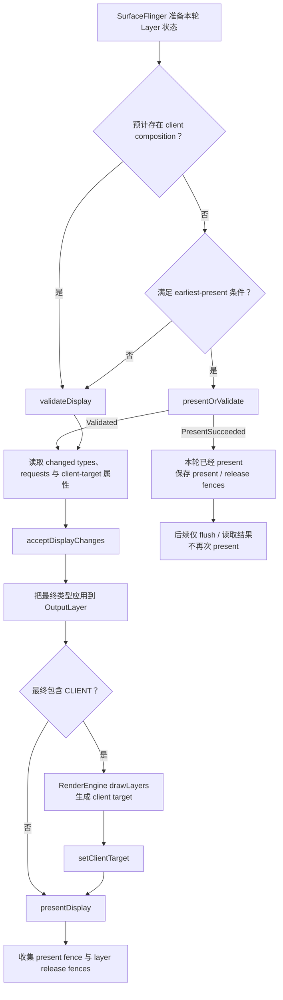

---

title: "HWC Overlay Plane 与合成降级排查"
chapter: "7.12"
section: "7.12"
status: finalized
drafted_date: "2026-05-23"
applicable_versions: "Android 10 (API 29) - Android 17 (API 37)"
last_verified: "2026-06-22"
last_verified_against: "AOSP android-17.0.0_r1 frameworks/native SurfaceFlinger/HWC2/CompositionEngine + hardware/interfaces composer3 AIDL + source.android.com HWC docs + Perfetto FrameTimeline docs"
confidence: medium
sources:
  - type: aosp
    path: "frameworks/native/services/surfaceflinger/DisplayHardware/HWC2.cpp"
  - type: aosp
    path: "frameworks/native/services/surfaceflinger/CompositionEngine/src/Output.cpp"
  - type: aosp
    path: "hardware/interfaces/graphics/composer/aidl/android/hardware/graphics/composer3/Composition.aidl"
  - type: aosp
    path: "hardware/interfaces/graphics/composer/aidl/android/hardware/graphics/composer3/OverlayProperties.aidl"
  - type: official
    path: "https://source.android.com/docs/core/graphics/hwc"
  - type: official
    path: "https://source.android.com/docs/core/graphics/implement-hwc"
  - type: official
    path: "https://perfetto.dev/docs/data-sources/frametimeline"
  - type: research
    path: "/Users/gracker/Library/Mobile Documents/iCloud~md~obsidian/Documents/Obsidian/DeepResearch/2026-05-22-hwc-overlay-plane-capability-sf-composition-downgrade.md"
tags: [hwc, surfaceflinger, overlay-plane, client-composition, jank, perfetto, winscope]
related_chapters: ["2.6", "2.15", "2.16", "7.4", "7.6", "14.21", "18.15"]
created_by: "task2a-knowledge-gap"
created_date: "2026-05-23"
gap_source: "章节深挖/研究素材/AOSP 结构/官方文档"
gap_score: 18
material_count: 4
pipeline_stage: ready-to-publish
task2a_state: "processed"
task2a_result: "ready-for-review"
last_task2a_at: "2026-05-23T01:04:00+08:00"
task6_state: reviewed
task9_state: reviewed
task6_result: pass-light-edit
task9_result: auto-fixed
reviewed_by: openclaw-task6
reviewed_date: "2026-06-23"
last_task6_at: "2026-06-23T01:10:00+08:00"
last_task9_at: "2026-06-05T05:28:04+08:00"
last_task9_audit: "2026-06-22"
last_task9_autofix_at: "2026-06-22"
task2b_state: fixed
deepseek_cn_review_state: done
finalized_date: "2026-06-23"
finalized_by: "openclaw-task6-auto-promote"
last_deepseek_cn_review_at: 2026-06-23
last_task6_audit: "2026-07-01T02:15:04+08:00"
---

# 7.12 HWC Overlay Plane 与合成降级排查

## 诊断边界：App 按时交帧，屏幕仍可能迟到

平台源码锚点为 Android 17 / API 37、`android-17.0.0_r1`，kernel 侧以 `android17-6.18-2026-06_r6` 为锚点。Composer HAL、显示驱动和 plane 分配策略常由厂商实现，AOSP 能确认接口语义与 SurfaceFlinger 调用关系，设备行为仍需实机证据。

一次可见更新至少涉及两个时间域：

- **SurfaceFrame**：某个 App 或系统 Layer 生产并提交一帧，通常关联 `surface_frame_token`。
- **DisplayFrame**：SurfaceFlinger 汇集当轮可见 Layer，完成合成并提交显示，关联 `display_frame_token`。

App 的 `Choreographer#doFrame` 和 RenderThread 按时结束，只能说明该 SurfaceFrame 没有明显迟到。此后还要经过 BufferQueue、SurfaceFlinger latch、composition strategy、RenderEngine 或 Composer HAL、display driver 和 panel scanout。DisplayFrame 在后半段错过目标 VSync，用户仍会看到掉帧或延迟。

适合进入 HWC 合成排查的现场通常具备以下组合：

- App 侧 SurfaceFrame 大多按时，关联的 DisplayFrame 却出现 `SurfaceFlingerCpuDeadlineMissed`、`SurfaceFlingerGpuDeadlineMissed` 或 `DisplayHAL`。
- 视频、相机、画中画、外接屏、系统浮层或高刷新率打开后复现，关闭某个单一变量后缓解。
- SurfaceFlinger 侧出现 GPU composition，或同一 Layer 的最终 composition type 在 `DEVICE` 与 `CLIENT` 之间变化。
- RenderEngine、HWC validate/present 或 fence 等待的时长与卡顿帧对齐。

composition type 的变化本身不是故障。它只有与 DisplayFrame 迟到、GPU/DPU 负载或 fence 延迟同时出现，才构成“合成路径变化导致问题”的证据。

## 先分清 Surface、Layer 与显示合成对象

业务看到的是一个页面，SurfaceFlinger 处理的是一组独立 Layer。输出载体不同，HWC 得到的输入也不同。

| 输出形态 | SurfaceFlinger 看到的对象 | HWC 的选择空间 |
|---|---|---|
| 普通 View / Compose | 宿主 App Window Layer | 对宿主最终 buffer 选择 DEVICE 或 CLIENT |
| `SurfaceView` | 宿主窗口与独立 child Surface | 视频或相机 Layer 可独立参与每帧协商 |
| `TextureView` | 外部 buffer 已由宿主 HWUI 采样进 App Window | HWC 看不到可单独分配给视频矩形的 Layer |
| Tunneled Playback | sideband Layer 与厂商媒体路径 | 依赖 `SIDEBAND` capability、codec HAL 和 HWC |
| Protected content | 带安全约束的 Layer / buffer | 只能选择满足 secure composition 要求的路径 |

`SurfaceView` 提供独立 Layer，因此给了显示硬件独立处理视频或相机画面的机会；它不承诺 overlay。`TextureView` 的 View 变换、裁剪和 alpha 更灵活，代价是视频 buffer 要由宿主 RenderThread 采样进 App Window，独立视频 Layer 已经消失。

独立 producer 不要求在同一个显示周期同时更新。一个 DisplayFrame 可以合法地组合“新宿主 UI + 旧视频 buffer”或“旧宿主 UI + 新视频 buffer”。遇到字幕、遮罩和视频内容错位时，应核对目标 present 采用了哪组 buffer 与 transaction，composition type 只能回答合成方式。

受保护内容也不能直接等同于普通 overlay。设备可能使用安全 plane，也可能使用受保护图形上下文支持的安全合成。黑屏、外接屏失败或截图不可见时，应核对 DRM、secure decoder、buffer usage、HDCP 与 Composer capability，不能靠 `DEVICE` 一个字段下结论。

视频从 codec 提交到 Surface 后仍要经历 queue、latch、合成与 present。完整的视频时序和 SurfaceView / TextureView 差异见 [18.15 视频叠加与 HWC](../ch18-rendering-pipelines/15-video-overlay-hwc.md)。

## Android 17 的 Composition 类型

Android 17 的 Composer3 AIDL 在 `Composition.aidl` 中定义了八个枚举值。排查工具显示的值应按以下语义理解：

| 类型 | Android 17 语义 | 诊断时的边界 |
|---|---|---|
| `INVALID` | 无效占位值 | 不能作为有效策略 |
| `CLIENT` | SurfaceFlinger client 将 Layer 画进 client target，再用 `setClientTarget` 交给设备 | 说明该 Layer 参加 GPU/client composition |
| `DEVICE` | 设备通过 hardware overlay 或相似机制处理 Layer | 不足以证明占用某个物理 plane |
| `SOLID_COLOR` | 设备按 `setLayerColor` 直接生成纯色 | 能力不满足时，HWC 可要求改为 `CLIENT` |
| `CURSOR` | 类似 `DEVICE`，还允许异步更新 cursor 位置 | HWC 可改为 `DEVICE` 或 `CLIENT` |
| `SIDEBAND` | 设备接管 Layer 的内容更新与同步 | 只在声明 `SIDEBAND_STREAM` capability 的设备上成立 |
| `DISPLAY_DECORATION` | 为挖孔和屏幕圆角提供抗锯齿装饰 | 依赖 `getDisplayDecorationSupport()` |
| `REFRESH_RATE_INDICATOR` | 类似 `DEVICE`，更新不应重置 HWC 的 activity timer | 能力不足时可改为 `CLIENT` |

`DEVICE` 的接口定义特意保留了 “hardware overlay or other similar means”。因此，以下推断都越过了公开证据边界：

- 看到 `DEVICE` 就断言该 Layer 独占一个物理 overlay plane。
- 统计 `DEVICE` Layer 数就反推出设备 plane 总数。
- 某一帧为 `DEVICE`，便认为后续帧会维持相同分配。

Composer 协商按显示帧运行。Layer 集合、属性、显示模式或资源竞争改变后，HWC 可以给出不同结果。混合合成也很常见：若一部分 Layer 为 `CLIENT`，RenderEngine 把它们画进一张 client target；HWC 再把 client target 与剩余 `DEVICE`、`CURSOR` 或其他 Layer 一起提交显示。

## validate、presentOrValidate 与 present

旧式流程图经常把每帧写成 `validateDisplay()` 后固定调用 `presentDisplay()`。Android 17 的 `HWComposer::getDeviceCompositionChanges()` 还支持跳过单独 validate 的快速分支。

下面的状态图用来区分 Android 17 中的两条提交路径。



`PresentSucceeded` 表示 `presentOrValidate()` 已经完成本轮 present。随后进入 `presentAndGetReleaseFences()` 时，`validateWasSkipped` 分支只 flush 待执行命令并检查已保存结果，不会再提交第二次 present。

源码调用关系可以按三层阅读：

1. `CompositionEngine/src/Display.cpp` 的 `chooseCompositionStrategy()` 调用 `HWComposer::getDeviceCompositionChanges()`；`applyCompositionStrategy()` 把 HWC 返回的 changed types 和 requests 应用到 Layer，并重新计算 `usesClientComposition`。
2. `DisplayHardware/HWComposer.cpp` 决定调用 `presentOrValidate()` 或 `validate()`，读取 changed types、display/layer requests、client-target 属性后执行 `acceptChanges()`。
3. `CompositionEngine/src/Output.cpp` 在 `usesClientComposition` 为真时进入 `composeSurfaces()`，由 `RenderEngine::drawLayers()` 生成 client target；`Display::presentFrame()` 再调用 `presentAndGetReleaseFences()`。

`acceptDisplayChanges()` 发生在 SurfaceFlinger 接受 HWC 请求的阶段。工具中若同时展示“客户端原始请求类型”和“validate 后的最终类型”，排查应采用最终被接受的类型，避免把 `DEVICE` 的初始请求误当成该帧结果。

## Overlay 能力没有通用的 plane 数字

早期 HWC 文档用“四个 overlay plane”说明资源不足时的回退现象。这个示例不能当作现代设备规格。AOSP 没有要求所有设备提供固定数量的 plane，普通应用也没有公开 API 可查询或锁定 plane。

Android 17 的 `IComposerClient.getOverlaySupport()` 返回 `OverlayProperties`。该结构描述以下能力：

- pixel format 与 dataspace standard、transfer、range 的有效组合；
- DPU 能否同时处理至少两种输入色彩空间；
- HWC 支持的 1D / 3D LUT 属性。

它没有返回物理 plane 数量、每个 plane 的缩放器数量、当帧分配结果或厂商功耗策略；接口本身也位于系统与 Composer HAL 的边界，不是应用 SDK。

设备评估至少要同时记录这些变量：

| 约束 | 容易触发变化的现场 | 需要核对的证据 |
|---|---|---|
| Layer 数量与共享资源 | 双视频、相机预览、字幕、系统栏、悬浮窗并存 | 可见 Layer 集合、z-order、最终类型 |
| format / dataspace | YUV + RGBA、HDR + SDR、广色域 UI | buffer 格式、dataspace、颜色转换 |
| crop / scale / transform | 画中画、旋转动画、自由窗口、外接屏 | source crop、display frame、transform |
| alpha / blending | 半透明控制栏、圆角遮罩、模糊、淡入淡出 | plane blending 能力、client target |
| protected / sideband | DRM 视频、tunneled playback | secure path、capability、HWC/DRM 日志 |
| display decoration | 屏幕圆角、挖孔抗锯齿 | `DISPLAY_DECORATION` 支持及最终类型 |
| 刷新率与分辨率 | 120 Hz、4K 外接屏、多显示器 | active mode、像素吞吐、带宽与时钟 |
| 厂商资源策略 | 温控、省电、writeback、并发显示 | 同机 HWC 日志、驱动 trace、功耗状态 |

格式、缩放、混色与 plane 数往往共享 DPU 资源。单看 Layer 数，无法区分“plane 不够”“该格式不能缩放”“HDR/SDR 混合超出色彩能力”或“厂商策略主动改走 client composition”。

## 证据采集：从 DisplayFrame 回到合成决策

稳妥的证据顺序是：定位迟到的 DisplayFrame，判断本轮是否使用 GPU composition，再查看 Layer composition、RenderEngine/HWC slice 与 fence。`dumpsys` 只给一个时刻的快照，不能单独证明某次卡顿帧发生了类型切换。

### FrameTimeline：定位责任域

FrameTimeline 从 Android 12 起可用。SurfaceFlinger 的 Actual Timeline 覆盖 SF、Composer 和 Display HAL，适合区分 App、SF CPU、SF GPU 与 DisplayHAL 方向。SurfaceView 的应用侧轨道仍有覆盖限制，视频和相机场景要补 Layer 与 HWC 证据。

下面的查询用于列出迟到帧及其 GPU composition 标记，不依赖界面上可能变化的中文或英文标签。

```sql
select
  actual.id,
  actual.ts,
  actual.dur,
  actual.surface_frame_token as app_token,
  actual.display_frame_token as sf_token,
  actual.jank_type,
  actual.present_type,
  actual.gpu_composition,
  actual.layer_name,
  process.name as process_name
from actual_frame_timeline_slice as actual
left join process using (upid)
where actual.jank_type is not null
  and actual.jank_type != 'None'
order by actual.ts;
```

`app_token` 与 `sf_token` 属于不同对象，不能按数值相等强行关联。Perfetto 的 flow 或 `display_frame_token` 才用于确认某个 SurfaceFrame 进入了哪个 DisplayFrame。`gpu_composition = 1` 说明该 DisplayFrame 使用过 GPU composition，但不提供逐 Layer 的 plane 分配。

FrameTimeline 的三类显示侧结果可这样收窄方向：

- `SurfaceFlingerCpuDeadlineMissed`：检查 SF 主线程、validate/present 阻塞、Layer 数与 transaction 压力。device composition 的同步调用时间也计入这一段。
- `SurfaceFlingerGpuDeadlineMissed`：检查 RenderEngine client target、GPU fence、颜色转换和 client composition 面积。
- `DisplayHAL`：SF 已按时把帧交给显示侧，但目标 VSync 没有呈现。检查 HWC/display driver、present fence、模式切换和带宽。

这些分类指出责任域，不等同于根因。`SurfaceFlingerGpuDeadlineMissed` 可能来自重型 client composition，也可能来自 GPU 降频或其他 GPU 工作竞争。

### SurfaceFlinger Layer trace 与 Winscope：查看最终 Layer 状态

Android 15 起 Winscope trace 已接入 Perfetto。Android 17 上使用 `android.surfaceflinger.layers`，并启用 `TRACE_FLAG_COMPOSITION` 才能记录 composition type 与 visible region；`TRACE_FLAG_HWC` 可加入更多非结构化 HWC 元数据。

下面的最小配置面向短时、可重复的实验室复现。

```text
buffers {
  size_kb: 65536
  fill_policy: RING_BUFFER
}
duration_ms: 10000
data_sources {
  config {
    name: "android.surfaceflinger.frametimeline"
  }
}
data_sources {
  config {
    name: "android.surfaceflinger.layers"
    surfaceflinger_layers_config {
      mode: MODE_ACTIVE
      trace_flags: TRACE_FLAG_COMPOSITION
      trace_flags: TRACE_FLAG_HWC
      trace_flags: TRACE_FLAG_BUFFERS
    }
  }
}
```

`MODE_ACTIVE` 和 HWC/buffer flags 会增加开销与内存占用，只适合受控短测；性能敏感的长时间采集应使用官方建议的 generated/bugreport 模式，再按设备构建确认能保留哪些 composition 信息。部分采集能力只在 `userdebug` 或 `eng` 构建可用。

Winscope 分析时应对齐同一时间窗口并检查：

- 视频、相机、App Window、系统栏和弹窗是否为独立 Layer；
- Layer 的 parent、z-order、crop、transform、alpha、dataspace 和 buffer 更新；
- validate 后的 composition type 是否变化；
- client target 是否出现，变化是否与卡顿 DisplayFrame 同步。

Winscope 旧版界面曾提供单独的 “HWC” 标记，该显示项从 Android 15 起已废弃。Android 17 排查应依赖采集配置中的 composition 字段、原始属性和源码语义，不能照搬旧截图中的 UI 标签。

### dumpsys：做复现前后的静态对照

`dumpsys SurfaceFlinger` 或 `adb exec-out dumpsys SurfaceFlinger --proto` 适合保存正常态与异常态快照。对比 Layer 数、visible region、z-order、buffer format、dataspace 和 composition 信息。文本字段会随 Android 版本和厂商构建变化，脚本应先做字段探测。

一份 dumpsys 只能说明执行命令附近的状态。若 composition 每帧抖动，静态快照可能恰好落在正常帧；此时需要 Layer trace 或 HWC 日志补齐时序。

### SurfaceFlinger、RenderEngine 与 HWC slice：定位耗时段

在 `/system/bin/surfaceflinger` 进程中对齐卡顿 DisplayFrame，查看 `composite`、CompositionEngine、HWC validate/present、RenderEngine `drawLayers` 和 fence wait。slice 名称取决于源码版本、atrace category 与厂商埋点，不应把某个名称当作跨版本固定协议。

判断时可按四个分支处理：

1. **Layer 未按时 ready**：acquire fence、BufferQueue 或 producer 延迟，HWC 只是下游。
2. **SF CPU / validate 延迟**：Layer 数、事务、HWC validate 或同步 device composition 占用 SF 主线程预算。
3. **client target 延迟**：`usesClientComposition` 为真，RenderEngine `drawLayers` 或 GPU fence 迟到。
4. **present 之后延迟**：工作落在 Composer HAL、display driver、present fence 或 panel 时序。

只有第 2～4 类与类型变化、显示配置或 HWC 约束对齐，才适合继续做 overlay / composition strategy 优化。

### Fence 与 kernel：确认所有权何时释放

present fence 描述一轮 DisplayFrame 的显示完成关系；layer release fence 描述消费者何时不再使用对应 Layer buffer。两者不能互换，也不能用某个 Layer 的 release fence代表整屏已呈现。Fence 基础见 [2.16 Sync Fence](../../part1-fundamentals/ch02-rendering/16-sync-fence.md)。

`android17-6.18-2026-06_r6` 中，dma-buf、dma-fence 与 `sync_file` 提供跨 codec、GPU、SurfaceFlinger、HWC 和驱动的 buffer/fence 基础语义。AOSP common kernel 无法说明具体 SoC 的 plane 分配；相关证据位于厂商 Composer HAL、DPU/display 驱动与设备 tracepoint。

## 典型场景怎样拆变量

### SurfaceView 视频 + 字幕、弹幕或控制栏

视频 Layer、宿主 UI、系统栏和弹窗会一起参与 HWC 协商。打开半透明控制栏后改成 `CLIENT`，原因可能是 blending、色彩、scale 或资源竞争，不能直接归结为“浮层多一个”。

推荐同机固定视频分辨率、HDR 状态、刷新率和窗口尺寸，每轮只开关一个浮层。每组记录最终 composition、FrameTimeline、RenderEngine、GPU/DPU 频率与 fence。

### TextureView 视频

TextureView 已把视频纹理采样进宿主窗口。即使宿主 App Window 最终为 `DEVICE`，也不能据此宣称视频获得独立 overlay。若问题在宿主 RenderThread 的 texture acquire、采样或 GPU 绘制，HWC trace 只能看到下游的合成结果。

SurfaceView 与 TextureView 的选择需要同时评估动画/裁剪需求、延迟、功耗、安全内容与独立 Layer 机会。为了减少 Layer 而把视频迁入 TextureView，可能降低 HWC 的可选空间。

### 相机预览 + 业务标注

相机预览常见 YUV、固定宽高比、旋转和动态 crop。人脸框、扫描框、AR 特效、模糊或半透明蒙层又会加入 blending 与 GPU 工作。

测试变量至少包含预览分辨率、帧率、Surface 类型、横竖屏、浮层开关和录制状态。预览 producer 慢、App 标注晚与 HWC composition 变化要分开归因。

### 画中画、多窗口与外接屏

画中画和自由窗口会改变 crop、scale、圆角、系统装饰与 z-order；外接屏还会引入另一套分辨率、色彩空间、刷新率和 bandwidth 条件。同一个 Layer 在内屏全屏为 `DEVICE`，切到外屏或 PIP 后变成 `CLIENT`，属于合理的逐显示协商结果。

记录 display id、active mode、窗口 bounds、transform 和 Layer stack。多显示器场景要分别分析每个 DisplayFrame，不能把两块屏的 present fence 混在一起。

### 高刷新率、温控与省电模式

120 Hz 缩短帧预算，高分辨率提高像素吞吐；温控和省电模式还可能调整 GPU、DPU 或内存带宽。Qualcomm、MediaTek、Pixel 的具体 HWC 策略不在 AOSP 公共代码中，公开资料缺失时只能标记为设备结论。

冷机与热机、60/90/120 Hz、正常与省电模式应分组测试。若 composition type 不变但 present 仍变慢，方向更接近时钟、带宽或 display HAL，没必要强行改 Layer 结构。

## 优化动作：根据证据选择拆分或合并

普通应用无法强制 HWC 分配 plane。应用侧能调整的是输入 Layer 结构、buffer 属性与动画组合，再通过同机 trace 验证。

### 独立 Surface 的取舍

- 无独立更新、无安全要求的小型 UI Surface，可以评估并入宿主 View/Compose 树，减少 Layer 与 HWC 状态。
- 视频、相机或高频独立 producer 使用 `SurfaceView`，可能减少宿主 GPU 采样并保留 device composition 机会。
- 合并后若形成更大的 client target、失去 YUV/secure plane 或增加全屏采样，收益会反向变化。

“减少 Layer”与“保留独立视频 Layer”是两种可选方案，选择依据是目标设备上的 composition、GPU 时间、功耗与视觉约束。

### 控制 HWC 难处理的属性组合

- 缩小持续半透明、模糊、圆角遮罩的面积和时长。
- 避免在同一转场同时改变大比例 scale、rotation、crop 与 alpha。
- HDR/SDR、广色域与外接显示场景要保持正确 dataspace，不能为追求 `DEVICE` 破坏色彩。
- protected 与 tunneled 路径必须服从安全和媒体 capability，不能绕过 secure 要求。

`SurfaceView#setZOrderMediaOverlay()` 和 `setZOrderOnTop()` 只改变受支持的 z-order 关系，不是 plane 申请接口。`SurfaceControl.Transaction#setRelativeLayer()` 也只表达 Layer 相对顺序；普通应用还受 API 与权限边界限制。

### 按设备和状态控制策略

同一 UI 组合在不同 Composer HAL 上可能得到不同结果。设备灰度至少带上机型、SoC、Android build、显示模式、窗口模式、温控和内容类型。厂商日志能确认某条限制时，再做针对性分支；不要用营销规格或网上的 plane 数表替代实测。

## 回归验证：证明路径变了，也证明用户收益

每次修复保留一组正常基线和一组单变量实验。建议把结果记录成下表：

| 维度 | 基线 | 实验 | 判定 |
|---|---|---|---|
| 可见 Layer 与属性 | Layer 数、format、dataspace、crop、alpha | 只记录本次变更 | 排除混杂变量 |
| 最终 composition | 每个目标 Layer 的类型序列 | 类型是否稳定或按预期改变 | 证明合成策略变化 |
| FrameTimeline | SF CPU/GPU/DisplayHAL 与 late present | 卡顿次数和连续性 | 证明显示结果改善 |
| RenderEngine | `drawLayers`、client target 面积与 GPU fence | 耗时是否下降 | 证明 client composition 成本变化 |
| HWC / fence | validate、present、present/release fence | 等待是否迁移 | 防止问题转移到显示侧 |
| 功耗与频率 | GPU/DPU/内存频率、温度、功耗 | 同环境对比 | 防止用功耗换帧率 |

不能只用 FPS、主线程耗时或一次 dumpsys 宣布修复。一个可信结论至少同时包含：目标 DisplayFrame 变好、合成或 fence 证据按假设变化、同机重复可复现、视觉和功耗没有新增回归。

## 线上可观测性

普通应用没有稳定公开 API 获取逐帧 HWC composition type，也不能线上统计物理 plane 使用率。线上可做的是收集代理信号：

- JankStats、FrameMetrics 或自有帧指标，带页面和交互标签；
- SurfaceView / TextureView、视频/相机/PIP/多窗口等场景标签；
- Android 版本、build、机型、SoC、刷新率、分辨率、温控与省电状态；
- 实验室代表设备的 Perfetto、Winscope、dumpsys 与 HWC 日志样本。

线上数据用于找出设备和场景分群，实验室 trace 用于确认 composition 根因。代理指标只能触发复核，不能直接标记成“CLIENT composition 率”。

## 版本边界

- **Android 12 / API 31**：FrameTimeline 成为显示卡顿归因的主要数据源，SurfaceView 应用侧轨道仍有覆盖限制。
- **Android 13 / API 33**：Composer HAL 开始以 AIDL Composer3 为平台主接口，旧 HIDL/HWC2 文档仍有历史参考价值。
- **Android 15 / API 35**：Winscope trace 接入 Perfetto；旧 Winscope 的 HWC UI 标记进入废弃边界。
- **Android 17 / API 37**：composition type、skip-validate、client target 与 fence 结论均按 `android-17.0.0_r1` 核对。

## 源码与资料

- [`Composition.aidl`](https://android.googlesource.com/platform/hardware/interfaces/+/android-17.0.0_r1/graphics/composer/aidl/android/hardware/graphics/composer3/Composition.aidl)：Android 17 composition type 定义与切换边界。
- [`OverlayProperties.aidl`](https://android.googlesource.com/platform/hardware/interfaces/+/android-17.0.0_r1/graphics/composer/aidl/android/hardware/graphics/composer3/OverlayProperties.aidl) 与 [`IComposerClient.aidl`](https://android.googlesource.com/platform/hardware/interfaces/+/android-17.0.0_r1/graphics/composer/aidl/android/hardware/graphics/composer3/IComposerClient.aidl)：overlay capability 查询内容。
- [`HWComposer.cpp`](https://android.googlesource.com/platform/frameworks/native/+/android-17.0.0_r1/services/surfaceflinger/DisplayHardware/HWComposer.cpp) 与 [`HWC2.cpp`](https://android.googlesource.com/platform/frameworks/native/+/android-17.0.0_r1/services/surfaceflinger/DisplayHardware/HWC2.cpp)：validate、presentOrValidate、accept 与 fence 包装。
- [`CompositionEngine/src/Display.cpp`](https://android.googlesource.com/platform/frameworks/native/+/android-17.0.0_r1/services/surfaceflinger/CompositionEngine/src/Display.cpp) 与 [`Output.cpp`](https://android.googlesource.com/platform/frameworks/native/+/android-17.0.0_r1/services/surfaceflinger/CompositionEngine/src/Output.cpp)：策略应用、RenderEngine client composition 与 present。
- [Hardware Composer HAL](https://source.android.com/docs/core/graphics/hwc) 与 [Implement HWC](https://source.android.com/docs/core/graphics/implement-hwc)：系统合成模式、同步与 HAL 接口背景。
- [Perfetto FrameTimeline](https://perfetto.dev/docs/data-sources/frametimeline)：SurfaceFrame / DisplayFrame、jank 分类与 SQL 表。
- [Winscope adb capture](https://source.android.com/docs/core/graphics/winscope/capture/adb) 与 [SurfaceFlinger viewer](https://source.android.com/docs/core/graphics/winscope/analyze/sf)：Android 17 Layer trace 配置及字段边界。
- [`sync_file.c`](https://android.googlesource.com/kernel/common/+/refs/tags/android17-6.18-2026-06_r6/drivers/dma-buf/sync_file.c) 与 [`dma-fence.h`](https://android.googlesource.com/kernel/common/+/refs/tags/android17-6.18-2026-06_r6/include/linux/dma-fence.h)：固定 kernel tag 下的 fence 基础语义。
