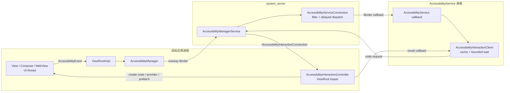

# 7.13 AccessibilityManagerService 与无障碍服务性能影响

Android 无障碍框架既支持屏幕阅读、开关控制、放大和语音控制，也被测试自动化等场景使用。分析性能时，不能只按“无障碍是否开启”分组：不同服务订阅的事件类型、读取窗口内容的能力、节点查询频率、输入模式和实现方式都有差异。

本文以 Android 17 / API 37 的 `android-17.0.0_r1` 为平台源码基线，讨论 framework、Binder、应用 UI 线程和无障碍服务进程。需要厂商内核 trace 标签才能识别的专有机制不在本文范围内。

## 两条方向相反的性能链

Accessibility（无障碍）框架中与性能关系最密切的工作有两条路径：

- **事件上报**：应用把点击、焦点、文本、滚动或窗口内容变化通知给系统，系统再按照各项服务配置分发事件。
- **节点查询**：`AccessibilityService` 查询窗口或节点，目标应用在 ViewRoot 所在线程生成 `AccessibilityNodeInfo`，再通过回调返回结果。ViewRoot 是一棵界面树与窗口系统之间的连接点，普通应用中的这项工作通常运行在主线程消息循环上。

下图标出了两条路径的方向和实际等待结果的一方。



事件通过 `oneway` Binder 调用上报，应用发出事务后不会等待 `AccessibilityService` 处理完成。节点查询则由服务侧等待结果，目标应用在自己的 ViewRoot looper（消息循环）上生成节点。分析阻塞时要先判断走的是哪一条路径，不能把事件上报的异步关系套到节点查询上。

## 事件上报：oneway 不等于零成本

Android 17 的 `IAccessibilityManager.aidl` 将 `sendAccessibilityEvent()` 声明为 `oneway`。这里的 `oneway` 表示 Binder 调用方不等待同步返回，并不表示调用方没有工作。应用调用 `AccessibilityManager.sendAccessibilityEvent()` 时仍要完成以下步骤：

1. View 或 ViewParent 创建并补全 `AccessibilityEvent`；
2. `AccessibilityManager` 检查当前状态以及 `mRelevantEventTypes`，后者记录当前服务关心的事件类型；
3. 将事件对象序列化到 Parcel，也就是 Binder 用来传输参数的数据容器；
4. Binder 驱动接收这笔 `oneway` 事务并排队；
5. `system_server` 的 Binder 线程处理权限、用户、窗口和事件来源信息。

`oneway` 省掉的只是等待服务端处理完成的时间。事件构造、字符串复制、Parcel 写入和 Binder 入队仍由调用链承担；高频事件仍会消耗 UI 线程 CPU、Binder 传输缓冲区和 `system_server` 资源。

### system_server 怎样过滤和排队

`AccessibilityManagerService.sendAccessibilityEvent()` 会校验调用用户和包名，更新活动窗口和无障碍焦点；必要时还会让 WindowManager 重新计算可访问窗口。随后，它会遍历当前用户已经绑定、也就是当前已连接到系统的无障碍服务。

每个 `AbstractAccessibilityServiceConnection` 会按以下条件决定是否接收：

- 服务声明的 `eventTypes`；
- 服务声明的 `packageNames`；
- 事件来源是否被标记为对无障碍重要；
- 服务是否要求 `FLAG_INCLUDE_NOT_IMPORTANT_VIEWS`；
- 敏感事件是否只允许 `isAccessibilityTool=true` 的服务；
- 当前服务是否具备相应的访问权限。

符合条件的事件会为该服务复制一份，再投递到 `mEventDispatchHandler`。当 `notificationTimeout > 0` 时，同一服务通常只保留同类型事件中最新的一条待发送记录。Android 17 对 `TYPE_WINDOW_CONTENT_CHANGED` 使用单独分支，不通过这组 `mPendingEvents` 合并，因此不能假定所有内容变化都会按同一种规则去重。

View 侧还有一层内容变化节流。`ViewRootImpl.SendWindowContentChangedAccessibilityEvent` 会合并可兼容的 change types（变化类型），并按照 `ViewConfiguration.getSendRecurringAccessibilityEventsInterval()` 给出的间隔安排发送。对象复用只减少对象分配，节流则减少实际发送次数；看到 `AccessibilityEvent.obtain()` 或 `recycle()`，不能据此判断事件已经批量合并。

### 高频从哪里产生

| 事件类别 | 常见来源 | 分析重点 |
|---|---|---|
| `TYPE_VIEW_SCROLLED` | 列表、滚动容器、虚拟节点 | 每次滚动是否都附带大量文本，或触发额外节点查询 |
| `TYPE_WINDOW_CONTENT_CHANGED` | 子树、文本、状态、内容描述变化 | change type、source、ViewRoot 合并情况 |
| `TYPE_VIEW_TEXT_CHANGED` | 输入框、编辑器、自定义文本控件 | 是否手动重复发送，Parcel 文本是否过大 |
| 焦点事件 | 键盘焦点、无障碍焦点、虚拟节点 | touch exploration（触摸探索）与焦点移动节奏 |
| 窗口事件 | Activity、Dialog、PIP、系统窗口变化 | WMS 可访问窗口计算与服务窗口查询 |

事件数量只反映调用流量。单个事件携带的文本长度、事件是否触发后续节点查询、服务能否命中缓存，以及目标应用生成节点的开销，都会影响最终表现。

## 节点查询：工作落在目标应用的 ViewRoot looper

`AccessibilityService` 调用 `getRootInActiveWindow()`、`event.source`、`findFocus()` 或节点查找 API 时，`AccessibilityInteractionClient` 会先查询当前服务连接对应的 `AccessibilityCache`。命中缓存即可直接返回；cache miss（缓存未命中）时才会发起跨进程请求。

请求先由 `AccessibilityServiceConnection` 找到目标窗口的 `IAccessibilityInteractionConnection`，随后进入目标应用的 `AccessibilityInteractionController`。这个 controller 使用 `ViewRootImpl.mHandler` 所在的 looper，因此常规 View 树的节点生成会与应用的 UI 工作共享线程。

节点创建有两种入口：

- 普通 View 调用 `View.createAccessibilityNodeInfo()`，进而执行 `onInitializeAccessibilityNodeInfo()`；
- 暴露虚拟节点的控件调用 `AccessibilityNodeProvider.createAccessibilityNodeInfo()`。虚拟节点没有一一对应的真实 View，常见于画布、自定义控件和 WebView 内部内容。

这也解释了 trace 中的一种常见现象：应用没有主动刷新 UI，主线程上仍出现无障碍节点构造。触发查询的可能是另一个进程中的 `AccessibilityService`，也可能是测试工具使用的 `UiAutomation`。

### 查询不会固定遍历整棵树

Android 17 提供多种 prefetch（预取）策略，包括 ancestors（祖先节点）、siblings（同级节点），以及 hybrid、depth-first、breadth-first 三种后代节点遍历顺序。源码还设置了三项边界：

- 单次预取上限为 `MAX_NUMBER_OF_PREFETCHED_NODES = 50`；
- 可中断的 prefetch 会在 ViewRoot handler 中已有用户交互消息等待时停止；
- 窗口正在滚动时，`AccessibilityInteractionClient` 会清除 prefetch flags（预取标志）。

因此，不能把一次 `getRootInActiveWindow()` 查询直接等同于递归构造整棵 View 树。定位成本时，需要同时记录请求 API、prefetch flags、缓存是否命中、虚拟节点 provider 和实际返回的节点数。

服务侧的 `AccessibilityInteractionClient` 最多等待 5000 ms 获取查询结果，这段等待发生在发起查询的服务线程。目标应用承担的是另一类风险：ViewRoot looper 上增加了节点创建任务，可能让同一线程上的 input（输入分发）、traversal（测量、布局与绘制）或 frame callback（逐帧回调）延后执行。

## 成本应按四个进程位置拆开

| 位置 | 工作 | 卡顿表现 |
|---|---|---|
| 目标应用 | 事件构造与 Parcel 写入；节点创建、provider 查询、prefetch | UI 线程 CPU 增长，frame callback 或 traversal 排队 |
| `system_server` | 权限过滤、窗口状态维护、bound service 遍历、事件复制与排队 | Binder 或 `system_server` CPU 上升、锁竞争 |
| `AccessibilityService` | `onAccessibilityEvent()`、cache miss 后的查询、业务处理 | 服务主线程阻塞、事件积压、反馈延迟 |
| Binder 与调度 | oneway event、query request、result callback | 线程唤醒、Parcel 处理开销、目标线程调度延迟 |

同时开启两个服务，并不意味着成本必定变成一个服务时的两倍。相比服务数量，`eventTypes`、`packageNames`、`notificationTimeout`、读取窗口内容的 capability（能力声明）、缓存使用方式和查询策略更能解释差异。

Touch exploration（触摸探索）、按键过滤、手势观察和放大还会改变输入处理链。遇到点击延迟或手势行为变化时，应分别检查输入过滤和 `AccessibilityEvent` / `AccessibilityNodeInfo` 开销；按键过滤的系统路径见 [3.4 输入拦截与安全](../../part1-fundamentals/ch03-input/04-input-interception-security.md)。

## 应用侧：保持语义正确，再去掉无意义工作

性能优化不能以移除可操作节点、隐藏状态或停止发送必要事件为代价。无障碍功能一旦退化，依赖屏幕阅读器、语音控制或开关控制的用户可能无法继续完成操作。

### `importantForAccessibility` 只处理装饰与重复语义

纯装饰图片、分隔线，以及语义已经由父控件完整表达的重复子元素，适合设置 `importantForAccessibility="no"`。`NO_HIDE_DESCENDANTS` 会让整个子树不再出现在无障碍节点树中，只有父节点能提供等价说明和操作时才可使用。

下面的 XML 仅把无交互、无信息价值的装饰图排除在无障碍树外。

```xml
<ImageView
    android:id="@+id/cardDecoration"
    android:layout_width="match_parent"
    android:layout_height="wrap_content"
    android:importantForAccessibility="no"
    android:src="@drawable/card_decoration" />
```

这项设置只应用于减少没有信息或操作价值的节点。按钮图标、错误提示、金额和开关状态等用户需要感知的信息不能照此隐藏。

### 节点回调内只读取已准备好的状态

滚动、焦点移动或自动化查询期间，`onInitializeAccessibilityNodeInfo()` 和 `AccessibilityNodeProvider` 都可能被频繁调用。这些回调通常处在目标应用的 UI 工作路径上，不应访问网络、磁盘或数据库，也不应执行大型 JSON 解析、位图分析或全量集合排序。

下面的自定义 View 在业务状态变化时预先生成语义文本，节点查询时只需读取已有字段。API 34 及以上版本还可以声明高频内容变化的最小通知间隔。

```kotlin
class PriceTickerView(context: Context) : View(context) {
    fun updatePrice(price: BigDecimal, change: BigDecimal) {
        contentDescription = formatPriceForAccessibility(price, change)
        invalidate()
    }

    override fun onInitializeAccessibilityNodeInfo(info: AccessibilityNodeInfo) {
        super.onInitializeAccessibilityNodeInfo(info)
        info.className = PriceTickerView::class.java.name

        if (Build.VERSION.SDK_INT >= Build.VERSION_CODES.UPSIDE_DOWN_CAKE) {
            info.minDurationBetweenContentChanges = Duration.ofMillis(500)
        }
    }
}
```

示例将格式化工作放在业务状态更新处。`View.setContentDescription()` 会在描述变化时通知无障碍框架，后续节点初始化直接使用 View 已保存的属性。`AccessibilityService` 可以读取节点声明的最小间隔，并据此限制来自该节点的内容变化事件频率。`setMinDurationBetweenContentChanges()` 适合进度、计时器、行情等持续变化、但无须逐次朗读的节点。间隔应按照用户能够理解的更新节奏设置；焦点、错误、可操作状态和关键结果仍需及时上报。

不要为了批量更新，临时将真实内容设置成 `NO_HIDE_DESCENDANTS`。这会让当前焦点节点消失，改变节点树结构，还可能额外触发内容变化。列表应使用增量数据更新并提供正确的 change type，让 ViewRoot 或控件库使用已有的事件合并机制。

### RecyclerView

RecyclerView 只为当前附着到窗口且可访问的 item（列表项）暴露节点。视图回收机制并不意味着每次查询都会构造全部数据项，应用侧更常见的额外开销来自以下做法：

- item delegate（列表项无障碍代理）动态拼接复杂描述；
- 每次 bind（绑定数据）都重复安装 delegate，或创建大量 action（无障碍操作）；
- 使用全量 `notifyDataSetChanged()`，使语义信息和可见内容一起大范围失效；
- item 的语义状态没有随数据更新，导致服务反复调用 `refresh()`。

可以使用 `DiffUtil` / `ListAdapter` 精确更新发生变化的列表项，复用稳定的 delegate，并在业务状态改变时同步更新简洁的 `stateDescription`、文本和 action。

## Compose：按逻辑控件设计 semantics tree

Compose 会在 UI 树之外维护一棵 semantics tree（语义树），供无障碍服务和测试工具读取。只有带语义属性的 layout node（布局节点）才会成为 semantics node；在 `Column` 上添加 `Modifier.semantics {}`，并不表示框架每次都会无条件递归重建这个 `Column` 的全部子树。

分析时要区分：

- **unmerged tree（未合并树）**：保留各个 semantics node，`AccessibilityService` 会结合 `mergeDescendants` 自行处理；
- **merged tree（合并树）**：测试 API 默认使用的视图，会按照 `mergeDescendants` 和 `clearAndSetSemantics` 简化节点。

Material 与 Foundation 中的 `Button`、`clickable`、`toggleable` 已经提供常用语义和合并规则。自定义组件可以减少重复或没有信息价值的节点，但仍要把一项逻辑控件需要的说明和操作完整保留下来：

- 只有装饰性内容才使用 `hideFromAccessibility()` 或空描述；
- 一组文字、图标和单一点击动作可按逻辑合并；
- 子项有独立动作时保留独立节点；
- `clearAndSetSemantics` 会覆盖无障碍服务和测试工具随后看到的子树语义，使用前要验证 TalkBack、Switch Access、Voice Access 以及自动化测试；
- 动画每帧变化但用户无需逐帧感知的数值，不要每帧写入语义属性。

Compose 来自 AndroidX 依赖，其性能行为应按照项目锁定的 Compose 版本核对，不能用 Android 17 的平台 tag 代替库版本。

## AccessibilityService 开发者：缩小订阅与查询范围

如果可以修改 `AccessibilityService` 的实现，通常应先检查服务配置和查询策略。

下面的配置表示：服务只接收目标包中的点击和窗口切换事件，同时声明可以读取窗口内容。

```xml
<accessibility-service
    android:accessibilityEventTypes="typeViewClicked|typeWindowStateChanged"
    android:accessibilityFeedbackType="feedbackSpoken"
    android:notificationTimeout="100"
    android:packageNames="com.example.target"
    android:canRetrieveWindowContent="true"
    android:isAccessibilityTool="true" />
```

如果服务确实需要支持所有应用，就不能为了减少开销随意填写 `packageNames`。配置范围应与产品功能一致；不需要读取窗口内容时，也不应请求对应的 capability（能力声明）。

服务侧建议遵守以下约束：

1. `eventTypes` 只订阅功能需要的类型，运行时场景变化可用 `setServiceInfo()` 调整。
2. 为可合并事件设置合理的 `notificationTimeout`，同时根据 Android 17 对 `TYPE_WINDOW_CONTENT_CHANGED` 的特殊处理单独实测。
3. 让 `onAccessibilityEvent()` 尽快返回；网络、磁盘、模型推理和大规模解析转到工作线程执行。
4. 优先使用事件已有字段和明确的 source（来源节点）；cache miss 时再发起节点查询。
5. 避免每个事件都调用 `getRootInActiveWindow()`，也不要从 root 反复扫描寻找同一个节点。
6. 先复制跨线程处理需要的字符串、ID 和业务值，不要把只在回调期有效的对象直接交给长时间任务持有。
7. 记录 query API、cache hit / miss（缓存命中 / 未命中）、返回节点数和业务触发原因，以便与目标应用的 trace 对齐。

服务主线程等待节点查询结果期间，该服务收到的其他事件也可能排队。频繁查询 root 节点既会增加目标应用的 UI 线程工作，也会延迟服务自身的反馈。

## 测量：不要靠“开关前后感觉更卡”

### A/B 条件

保持设备、build（系统构建版本）、刷新率、温度、账号数据和交互脚本一致，至少比较以下四组条件：

1. 没有目标服务；
2. 只启用目标服务；
3. 目标服务与用户常用服务共同启用；
4. 服务功能不变，但减少 event types（事件类型）、节点查询和后台工作的版本。

如果测试需要停用用户的辅助服务，只能在受控测试设备上进行，并确保用户明确知情。线上产品不能为了改善帧率而自动关闭或绕过 `AccessibilityService`。

### Perfetto：定位线程和帧

系统 trace 至少应采集 FrameTimeline、应用主线程、`system_server`、`AccessibilityService` 进程、Binder driver、sched、freq，以及应用自定义的业务 slice。其中 sched / freq 分别记录线程调度和 CPU 频率，slice 是应用标注的一段工作区间。分析时检查以下时序：

- App frame（应用帧）迟到前，是否出现节点查询任务或耗时较长的 `onInitializeAccessibilityNodeInfo()`；
- 事件上报的 oneway Binder 数量与 Parcel 大小是否异常；
- `system_server` 是否忙于窗口计算、服务过滤或其他锁；
- 服务主线程是否停在 `AccessibilityInteractionClient` 中等待结果；
- 节点结果返回后，服务是否立即进入长 CPU、I/O 或 Binder 工作。

`BinderProxy.transactNative` 只能证明这里发生了 Binder 调用，无法单独说明调用目的。事件上报和节点查询的方向相反，需要结合 interface / method（接口与方法）、调用进程和回调时序识别具体路径。

### Android 17 accessibility trace

`userdebug` 或 `eng` 构建可以使用专用的 accessibility trace；这两类构建包含面向调试和工程验证的系统能力。下面的命令只启用相关接口类型，避免其他无障碍调用占满 trace。

```bash
adb root
adb shell cmd accessibility start-trace -t \
  IAccessibilityManager \
  IAccessibilityServiceConnection \
  IAccessibilityInteractionConnection \
  IAccessibilityInteractionConnectionCallback \
  AccessibilityService

# 复现目标操作

adb shell cmd accessibility stop-trace
adb pull /data/misc/a11ytrace/a11y_trace.winscope
```

Android 17 源码明确禁止在面向普通用户发布的 user build 上启用这项 trace。停止命令会异步写入 Winscope 文件，拉取前应先确认文件已经生成。Tracing 会记录调用参数、线程和调用栈，本身也会增加运行开销，因此只适合短时间定位问题。

### dumpsys：确认服务配置，不统计事件速率

`adb shell dumpsys accessibility` 可以查看当前用户处于 bound、enabled、binding 或 crashed 状态的服务，也就是已连接、已启用、正在连接或已崩溃的服务。每个 bound service 的 dump 会列出 label、feedback type、capabilities、event types、`notificationTimeout` 和 accessibility button 请求。

Android 17 的 AOSP dump 没有通用的“Event Dispatch Statistics”或“Interaction Connection Pool”计数器。厂商版本如果扩展了字段，应在报告中标明 build；在 AOSP 设备上，需要通过 trace、自有计数或服务日志测量事件率和查询率。

## 归因表

| 现象 | 还缺的证据 | 更可能的负责位置 |
|---|---|---|
| App 主线程长时间执行节点回调 | 查询来源、node / provider、prefetch、返回数量 | App 自定义 View、Compose adapter 或 WebView provider |
| App 有大量短 oneway event transaction | 事件类型、source、文本大小、ViewRoot 合并 | App 事件设计或高频状态更新 |
| 服务主线程停在 `AccessibilityInteractionClient` | cache miss、目标窗口、callback 时间 | 目标 App UI、`system_server` 路由或服务查询策略 |
| 服务收到事件后长时间运行 | `onAccessibilityEvent()` 后续 CPU/I/O | AccessibilityService 实现 |
| `system_server` 中 A11yMS 段变长 | bound service 数、窗口计算、锁和 CPU 调度 | framework、WMS 或设备系统实现 |
| 开启 touch exploration 后输入节奏变化 | `InputFilter`、手势 / 按键配置、事件与帧 | Accessibility input path（无障碍输入路径），不能只看节点树 |

如果现有证据只能证明“无障碍开启时更慢”，还无法完成归因。报告中应写清事件、查询、节点、服务或输入中的哪条路径发生了变化。

## 运行时上下文与隐私

`AccessibilityManager.isEnabled()` 用来查询框架当前是否启用了无障碍事件发送。Android 17 的 Javadoc 明确提醒，应用不应根据这个布尔值切换产品 UI 或交互路径；专门设置的分支往往测试不足，容易让辅助技术用户进入维护较差的体验。

性能监控可把以下信息作为受控实验上下文：

- `accessibility enabled` 状态；
- `touch exploration enabled` 状态；
- 当前页面是否包含 SurfaceView、WebView、Compose 或大量虚拟节点；
- 测试设备上启用服务的数量和反馈类型。

`getEnabledAccessibilityServiceList()` 会发起跨 Binder 查询，不应在每帧或高频埋点中调用。启用哪些服务还可能暴露敏感的设备使用状态；线上采集前要经过隐私评审，优先记录匿名化的能力类别和数量，不上传服务组件名。

## Android 12—17 版本边界

- **Android 12 / API 31**：`AccessibilityServiceInfo.isAccessibilityTool()` 成为公开 API，系统可以区分面向残障用户的辅助工具和其他服务。
- **Android 13 / API 33**：新增节点 prefetch strategy 与 `MAX_NUMBER_OF_PREFETCHED_NODES = 50`；多项 `obtain()` / `recycle()` 对象池 API 被废弃。
- **Android 14 / API 34**：新增 `setMinDurationBetweenContentChanges()` 和 accessibility data sensitive（无障碍数据敏感）能力，为高频内容节流和敏感事件过滤提供公开接口。
- **Android 17 / API 37**：按 `android-17.0.0_r1` 核对。事件仍通过 oneway `sendAccessibilityEvent()` 上报；服务连接仍按配置过滤/延迟；节点请求仍进入目标 ViewRoot looper，并受缓存、prefetch 策略和 50 节点上限约束。

平台版本无法代替 `AccessibilityService`、TalkBack、Compose、WebView 和厂商 framework 的具体版本。任何以百分比表示的性能结论都应附带设备、服务版本、页面、交互过程和 trace 条件，不能直接套用到其他设备。

## 源码与资料

- [`AccessibilityManager.java`](https://android.googlesource.com/platform/frameworks/base/+/android-17.0.0_r1/core/java/android/view/accessibility/AccessibilityManager.java) 与 [`IAccessibilityManager.aidl`](https://android.googlesource.com/platform/frameworks/base/+/android-17.0.0_r1/core/java/android/view/accessibility/IAccessibilityManager.aidl)：客户端状态、相关事件过滤和 `oneway` 上报。
- [`AccessibilityManagerService.java`](https://android.googlesource.com/platform/frameworks/base/+/android-17.0.0_r1/services/accessibility/java/com/android/server/accessibility/AccessibilityManagerService.java)：事件安全检查、窗口更新与 bound service 分发。
- [`AbstractAccessibilityServiceConnection.java`](https://android.googlesource.com/platform/frameworks/base/+/android-17.0.0_r1/services/accessibility/java/com/android/server/accessibility/AbstractAccessibilityServiceConnection.java)：事件类型、包名、敏感数据、重要性与 `notificationTimeout` 处理。
- [`AccessibilityInteractionClient.java`](https://android.googlesource.com/platform/frameworks/base/+/android-17.0.0_r1/core/java/android/view/accessibility/AccessibilityInteractionClient.java) 与 [`AccessibilityInteractionController.java`](https://android.googlesource.com/platform/frameworks/base/+/android-17.0.0_r1/core/java/android/view/AccessibilityInteractionController.java)：cache、5000 ms 等待、ViewRoot handler、节点创建和 prefetch。
- [`ViewRootImpl.java`](https://android.googlesource.com/platform/frameworks/base/+/android-17.0.0_r1/core/java/android/view/ViewRootImpl.java) 与 [`View.java`](https://android.googlesource.com/platform/frameworks/base/+/android-17.0.0_r1/core/java/android/view/View.java)：事件上报、窗口内容变化合并与节点初始化。
- [`AccessibilityNodeInfo.java`](https://android.googlesource.com/platform/frameworks/base/+/android-17.0.0_r1/core/java/android/view/accessibility/AccessibilityNodeInfo.java) 与 [`AccessibilityServiceInfo.java`](https://android.googlesource.com/platform/frameworks/base/+/android-17.0.0_r1/core/java/android/accessibilityservice/AccessibilityServiceInfo.java)：prefetch、最小内容变化间隔、事件订阅与服务配置。
- [`AccessibilityTraceManager.java`](https://android.googlesource.com/platform/frameworks/base/+/android-17.0.0_r1/services/accessibility/java/com/android/server/accessibility/AccessibilityTraceManager.java) 与 [`AccessibilityController.java`](https://android.googlesource.com/platform/frameworks/base/+/android-17.0.0_r1/services/core/java/com/android/server/wm/AccessibilityController.java)：trace 命令、user build 限制与输出文件。
- [AccessibilityManager API](https://developer.android.com/reference/android/view/accessibility/AccessibilityManager)、[AccessibilityServiceInfo API](https://developer.android.com/reference/android/accessibilityservice/AccessibilityServiceInfo) 与 [创建 AccessibilityService](https://developer.android.com/guide/topics/ui/accessibility/service)：公开接口契约。
- [Compose semantics](https://developer.android.com/develop/ui/compose/accessibility/semantics) 与 [merging/clearing](https://developer.android.com/develop/ui/compose/accessibility/merging-clearing)：merged / unmerged tree 和语义边界。
