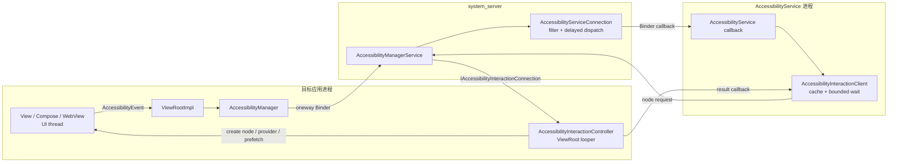

# 7.13 AccessibilityManagerService 与无障碍服务性能影响

Android 无障碍框架同时服务于屏幕阅读、开关控制、放大、语音控制、测试自动化和其他辅助功能。性能分析不能把这些形态压成一个“无障碍已开启”开关：服务订阅的事件、是否读取窗口内容、节点查询频率、输入模式和自身实现都不同。

平台源码锚点为 Android 17 / API 37、`android-17.0.0_r1`。这里主要讨论 framework、Binder、应用 UI 线程与服务进程；不涉及需要 kernel tag 才能解释的专有机制。

## 两条方向相反的性能链

Accessibility 的常见工作分成两条路径：

- **事件上报**：应用把点击、焦点、文本、滚动或窗口内容变化通知给系统，系统再按服务配置分发。
- **节点查询**：AccessibilityService 查询窗口或节点，目标应用在 ViewRoot 所在线程生成 `AccessibilityNodeInfo`，通过回调返回。

下面的图用于区分事件方向、节点查询方向以及各自的等待方。



事件上报的调用是 `oneway` Binder，应用不等待 AccessibilityService 处理事件。节点查询在服务侧等待结果，目标应用则在自己的 ViewRoot looper 上执行节点生成；这两条链的阻塞关系不能混用。

## 事件上报：oneway 不等于零成本

Android 17 的 `IAccessibilityManager.aidl` 把 `sendAccessibilityEvent()` 声明为 `oneway`。应用调用 `AccessibilityManager.sendAccessibilityEvent()` 时仍要完成以下工作：

1. View 或 ViewParent 创建并补全 `AccessibilityEvent`；
2. `AccessibilityManager` 检查当前状态和 `mRelevantEventTypes`；
3. 事件对象完成 Parcel 序列化；
4. Binder driver 接收 oneway transaction；
5. `system_server` 在 Binder 线程处理安全、用户、窗口与事件来源信息。

`oneway` 省去了等待服务端回调结束的时间，却没有消除应用侧事件构造、字符串复制、Parcel 写入和 Binder 入队。高频事件仍可能占用 UI 线程 CPU、Binder buffer 与 `system_server` 资源。

### system_server 怎样过滤和排队

`AccessibilityManagerService.sendAccessibilityEvent()` 会校验调用用户和包名，更新活动窗口与无障碍焦点，必要时让 WindowManager 计算可访问窗口，然后遍历当前用户的 bound services。

每个 `AbstractAccessibilityServiceConnection` 会按以下条件决定是否接收：

- 服务声明的 `eventTypes`；
- 服务声明的 `packageNames`；
- 事件来源是否对无障碍重要；
- 服务是否要求 `FLAG_INCLUDE_NOT_IMPORTANT_VIEWS`；
- 敏感事件是否只允许 `isAccessibilityTool=true` 的服务；
- 当前服务是否具备访问权限。

符合条件的事件会复制一份并投递到 `mEventDispatchHandler`。`notificationTimeout > 0` 时，同一服务通常只保留同类型的最新待发事件；Android 17 源码对 `TYPE_WINDOW_CONTENT_CHANGED` 走单独分支，不使用这组 `mPendingEvents` 合并。

View 侧还有另一层内容变化节流。`ViewRootImpl.SendWindowContentChangedAccessibilityEvent` 会合并兼容的 change types，并按 `ViewConfiguration.getSendRecurringAccessibilityEventsInterval()` 安排发送。对象复用与节流是两件事；`AccessibilityEvent.obtain()` 或 `recycle()` 不能证明事件被批量合并。

### 高频从哪里产生

| 事件类别 | 常见来源 | 分析重点 |
|---|---|---|
| `TYPE_VIEW_SCROLLED` | 列表、滚动容器、虚拟节点 | 是否每次滚动都附带昂贵文本或节点回查 |
| `TYPE_WINDOW_CONTENT_CHANGED` | 子树、文本、状态、内容描述变化 | change type、source、ViewRoot 合并情况 |
| `TYPE_VIEW_TEXT_CHANGED` | 输入框、编辑器、自定义文本控件 | 是否手动重复发送，Parcel 文本是否过大 |
| 焦点事件 | 键盘焦点、无障碍焦点、虚拟节点 | touch exploration 与焦点移动节奏 |
| 窗口事件 | Activity、Dialog、PIP、系统窗口变化 | WMS 可访问窗口计算与服务窗口查询 |

事件数量只能描述流量。某个事件携带的文本长度、是否引出节点查询、服务是否命中缓存，以及目标应用生成节点的成本，都会改变性能结果。

## 节点查询：工作落在目标应用的 ViewRoot looper

AccessibilityService 调用 `getRootInActiveWindow()`、`event.source`、`findFocus()` 或节点查找 API 时，`AccessibilityInteractionClient` 先查本服务连接的 `AccessibilityCache`。缓存命中可以直接返回；缓存未命中才跨进程请求。

请求经 `AccessibilityServiceConnection` 找到目标窗口的 `IAccessibilityInteractionConnection`，随后进入目标应用的 `AccessibilityInteractionController`。该 controller 使用 `ViewRootImpl.mHandler` 的 looper，所以常规 View 树的节点生成与应用 UI 工作共享线程。

节点创建有两种入口：

- 普通 View 调用 `View.createAccessibilityNodeInfo()`，进而执行 `onInitializeAccessibilityNodeInfo()`；
- 暴露虚拟节点的控件调用 `AccessibilityNodeProvider.createAccessibilityNodeInfo()`。

这解释了一个常见 trace：应用没有主动刷新 UI，主线程仍出现无障碍节点构造。触发者可能是另一进程的 AccessibilityService 或 `UiAutomation` 查询。

### 查询不会固定遍历整棵树

Android 17 提供 ancestors、siblings、hybrid/depth-first/breadth-first descendants 等 prefetch 策略。源码还有三道边界：

- 单次预取上限为 `MAX_NUMBER_OF_PREFETCHED_NODES = 50`；
- 可中断 prefetch 会在 ViewRoot handler 有用户交互消息等待时停止；
- 窗口正在滚动时，`AccessibilityInteractionClient` 会清除 prefetch flags。

所以，“调用一次 `getRootInActiveWindow()` 就递归构造整个 View 树”不是通用行为。需要记录请求 API、prefetch flags、缓存命中、虚拟节点 provider 和返回节点数。

服务侧的 `AccessibilityInteractionClient` 最多等待 5000 ms 获取查询结果。这个等待发生在发起查询的服务线程；目标应用的风险是 ViewRoot looper 多出节点创建任务，影响同线程的 input、traversal 或 frame callback。

## 成本应按四个进程位置拆开

| 位置 | 工作 | 卡顿表现 |
|---|---|---|
| 目标应用 | 事件构造、Parcel；节点创建、provider 查询、prefetch | UI thread CPU 增长，frame callback 或 traversal 排队 |
| `system_server` | 安全过滤、窗口状态、bound service 遍历、事件复制与排队 | Binder/system_server CPU 或锁竞争 |
| AccessibilityService | `onAccessibilityEvent()`、cache miss 查询、业务处理 | 服务主线程阻塞、事件积压、反馈延迟 |
| Binder 与调度 | oneway event、query request、result callback | 线程唤醒、Parcel 成本、目标线程调度延迟 |

开启两个服务也不代表成本是一个服务的两倍。服务的 `eventTypes`、`packageNames`、`notificationTimeout`、window-content capability、缓存使用和查询策略比数量更有解释力。

Touch exploration、按键过滤、手势观察和放大还会改变输入管线。遇到点击延迟或手势差异时，应把输入过滤与 AccessibilityEvent/NodeInfo 成本分开；按键过滤的系统路径见 [3.4 输入拦截与安全](../../part1-fundamentals/ch03-input/04-input-interception-security.md)。

## 应用侧：保持语义正确，再去掉无意义工作

性能优化不能以移除可操作节点、隐藏状态或停发必要事件为代价。可访问性回归会直接阻断依赖屏幕阅读器、语音控制或开关控制的用户。

### `importantForAccessibility` 只处理装饰与重复语义

适合设置 `importantForAccessibility="no"` 的对象包括纯装饰图片、分隔线，以及已经由父控件完整表达的重复子元素。`NO_HIDE_DESCENDANTS` 会隐藏整个子树，只能在父节点提供等价语义和动作时使用。

下面的 XML 仅把无交互、无信息价值的装饰图排除在无障碍树外。

```xml
<ImageView
    android:id="@+id/cardDecoration"
    android:layout_width="match_parent"
    android:layout_height="wrap_content"
    android:importantForAccessibility="no"
    android:src="@drawable/card_decoration" />
```

这项设置减少的是无意义节点。按钮图标、错误提示、金额、开关状态等用户需要感知的信息不能照此隐藏。

### 节点回调内只读取已准备好的状态

`onInitializeAccessibilityNodeInfo()` 与 `AccessibilityNodeProvider` 可能在滚动、焦点移动或自动化查询期间被频繁调用。回调中不要访问网络、磁盘、数据库，也不要做大对象 JSON 解析、位图分析或全量集合排序。

下面的自定义 View 在业务状态变化时准备语义文本，节点查询只复制字段；API 34+ 还为高频内容变化声明最小间隔。

```kotlin
class PriceTickerView(context: Context) : View(context) {
    fun updatePrice(price: BigDecimal, change: BigDecimal) {
        contentDescription = formatPriceForAccessibility(price, change)
        invalidate()
    }

    override fun onInitializeAccessibilityNodeInfo(info: AccessibilityNodeInfo) {
        super.onInitializeAccessibilityNodeInfo(info)
        info.className = PriceTickerView::class.java.name

        if (Build.VERSION.SDK_INT >= Build.VERSION_CODES.UPSIDE_DOWN_CAKE) {
            info.minDurationBetweenContentChanges = Duration.ofMillis(500)
        }
    }
}
```

示例把格式化工作放在业务状态更新处。`View.setContentDescription()` 会在描述变化时通知无障碍框架，节点初始化沿用 View 已保存的属性。AccessibilityService 可读取节点声明的最小间隔，对来自该节点的内容变化事件节流。`setMinDurationBetweenContentChanges()` 适合进度、计时器、行情等连续变化但不要求逐次朗读的节点；间隔应根据用户能理解的更新节奏设定，焦点、错误、可操作状态和关键结果仍要及时上报。

不要为了批量更新而临时把真实内容切成 `NO_HIDE_DESCENDANTS`。这种做法会让当前焦点节点消失，改变树结构并额外产生内容变化。列表应使用增量数据更新和正确 change type，让 ViewRoot/控件库完成其已有的事件合并。

### RecyclerView

RecyclerView 只为当前附着和可访问的 item 暴露节点，回收机制不意味着每次查询都会构造全部数据项。应用更容易引入的成本是：

- item delegate 动态拼接复杂描述；
- 每次 bind 都重复安装 delegate 或创建大量 action；
- 使用全量 `notifyDataSetChanged()`，让语义与可见内容一起大范围失效；
- item 的语义状态与数据状态不同步，导致服务反复 refresh。

使用 DiffUtil/ListAdapter 的精确更新，复用稳定 delegate，并在业务状态改变时更新简洁的 `stateDescription`、文本和 action。

## Compose：按逻辑控件设计 semantics tree

Compose 在 UI 树旁维护 semantics tree。带语义属性的 layout node 才会成为 semantics node；`Modifier.semantics {}` 放在 Column 上，不代表框架无条件递归重建该 Column 的全部子树。

分析时要区分：

- **unmerged tree**：保留各 semantics node，AccessibilityService 会结合 `mergeDescendants` 自行处理；
- **merged tree**：测试 API 默认使用，按 `mergeDescendants` 和 `clearAndSetSemantics` 简化节点。

Material 与 Foundation 的 Button、clickable、toggleable 已提供常用语义和合并规则。自定义组件的优化方向是减少重复或无意义节点，同时保留一项完整、可执行的逻辑控件：

- 仅装饰内容使用 `hideFromAccessibility()` 或空描述；
- 一组文字、图标和单一点击动作可按逻辑合并；
- 子项有独立动作时保留独立节点；
- `clearAndSetSemantics` 会覆盖后续消费者看到的子树语义，使用前要验证 TalkBack、Switch Access、Voice Access 和测试；
- 动画每帧变化但用户无需逐帧感知的数值，不要每帧写入语义属性。

Compose 属于 AndroidX 依赖，性能行为要按项目锁定的 Compose 版本核对，不能用 Android 17 平台 tag 替代库版本。

## AccessibilityService 开发者：缩小订阅与查询范围

能控制服务实现时，收益最大的动作来自服务配置和查询策略。

下面的配置展示一个只关注目标包点击和窗口切换、并允许读取窗口内容的服务。

```xml
<accessibility-service
    android:accessibilityEventTypes="typeViewClicked|typeWindowStateChanged"
    android:accessibilityFeedbackType="feedbackSpoken"
    android:notificationTimeout="100"
    android:packageNames="com.example.target"
    android:canRetrieveWindowContent="true"
    android:isAccessibilityTool="true" />
```

若服务需要支持所有应用，不能为了性能随意填写 `packageNames`。配置应与产品承诺一致；不需要窗口内容时，也不应请求对应 capability。

服务侧建议遵守以下约束：

1. `eventTypes` 只订阅功能需要的类型，运行时场景变化可用 `setServiceInfo()` 调整。
2. 对可合并事件设置合理 `notificationTimeout`，并按 Android 17 对 `TYPE_WINDOW_CONTENT_CHANGED` 的特殊处理实测。
3. `onAccessibilityEvent()` 保持短小；网络、磁盘、模型推理和大规模解析转到工作线程。
4. 优先使用事件已有字段和精确 source；cache miss 时再查节点。
5. 避免每个事件都调用 `getRootInActiveWindow()`，也不要从 root 反复扫描寻找同一个节点。
6. 把跨线程处理所需的字符串、ID 和业务值复制出来，不要让回调对象的生命周期泄漏到长任务。
7. 记录 query API、cache hit/miss、返回节点数和业务触发原因，方便与目标应用 trace 对齐。

服务主线程等待节点查询结果时，自己的事件处理也会排队。频繁 root 查询既增加目标应用 UI 工作，也会降低服务反馈速度。

## 测量：不要靠“开关前后感觉更卡”

### A/B 条件

保持设备、build、刷新率、温度、账号数据和交互脚本一致，至少对比：

1. 没有目标服务；
2. 只启用目标服务；
3. 目标服务与用户常用服务共同启用；
4. 服务保留功能，但收窄 event types、查询和后台工作后的版本。

如果测试需要停用用户的辅助服务，只能在受控测试设备和用户明确知情的条件下进行。线上产品不能为了帧率自动关闭或规避 AccessibilityService。

### Perfetto：定位线程和帧

系统 trace 至少包含 FrameTimeline、应用主线程、`system_server`、AccessibilityService 进程、Binder driver、sched、freq 与应用自定义业务 slice。分析时对齐：

- App frame 迟到前是否有节点查询任务或昂贵的 `onInitializeAccessibilityNodeInfo()`；
- 事件上报的 oneway Binder 数量与 Parcel 大小是否异常；
- `system_server` 是否忙于窗口计算、服务过滤或其他锁；
- 服务主线程是否在 `AccessibilityInteractionClient` 等待结果；
- 节点结果返回后，服务是否立即进入长 CPU、I/O 或 Binder 工作。

`BinderProxy.transactNative` 只能证明发生了 Binder 调用。事件上报和节点查询方向不同，必须结合 interface/method、调用进程和回调时序识别。

### Android 17 accessibility trace

`userdebug` 或 `eng` 构建可以使用专用 accessibility trace。下面的命令只启用相关接口类型，减少全量 trace 干扰。

```bash
adb root
adb shell cmd accessibility start-trace -t \
  IAccessibilityManager \
  IAccessibilityServiceConnection \
  IAccessibilityInteractionConnection \
  IAccessibilityInteractionConnectionCallback \
  AccessibilityService

# 复现目标操作

adb shell cmd accessibility stop-trace
adb pull /data/misc/a11ytrace/a11y_trace.winscope
```

Android 17 源码明确禁止在 user build 上启用该 trace。停止命令会异步写入 Winscope 文件；拉取前应确认文件已生成。Tracing 会记录调用参数、线程和调用栈并增加开销，只用于短时定位。

### dumpsys：确认服务配置，不统计事件速率

`adb shell dumpsys accessibility` 可查看当前用户的 bound/enabled/binding/crashed services。每个 bound service 的 dump 包含 label、feedback type、capabilities、event types、`notificationTimeout` 和 accessibility button 请求。

Android 17 AOSP dump 没有通用的 “Event Dispatch Statistics” 或 “Interaction Connection Pool” 计数器。厂商若扩展了字段，要标注 build；AOSP 设备上应通过 trace、自有计数或服务日志测事件率与查询率。

## 归因表

| 现象 | 还缺的证据 | 更可能的负责位置 |
|---|---|---|
| App 主线程在节点回调中很长 | 查询来源、node/provider、prefetch、返回数量 | App 自定义 View、Compose adapter 或 WebView provider |
| App 有大量短 oneway event transaction | 事件类型、source、文本大小、ViewRoot 合并 | App 事件设计或高频状态更新 |
| 服务主线程卡在 `AccessibilityInteractionClient` | cache miss、目标窗口、callback 时间 | 目标 App UI、system_server 路由或服务查询策略 |
| 服务收到事件后长时间运行 | `onAccessibilityEvent()` 后续 CPU/I/O | AccessibilityService 实现 |
| `system_server` A11yMS 段变长 | bound service 数、窗口计算、锁和 CPU 调度 | framework、WMS 或设备系统实现 |
| 开启 touch exploration 后输入节奏变化 | InputFilter、手势/按键配置、事件与帧 | Accessibility input path，不能只看节点树 |

如果只能证明“无障碍开启时更慢”，结论还不够。报告中应写清事件、查询、节点、服务或输入哪条路径发生变化。

## 运行时上下文与隐私

`AccessibilityManager.isEnabled()` 是框架为事件发送状态提供的查询。Android 17 Javadoc 明确提醒应用不要按这个布尔值改变产品 UI 或交互路径；这种分支容易让辅助技术用户进入维护较差的体验。

性能监控可把以下信息作为受控实验上下文：

- accessibility enabled；
- touch exploration enabled；
- 当前页面是否包含 SurfaceView、WebView、Compose 或大量虚拟节点；
- 测试设备上启用服务的数量和反馈类型。

`getEnabledAccessibilityServiceList()` 会跨 Binder 查询，不应在每帧或高频埋点中调用。服务身份还可能属于敏感的用户设备状态；线上采集前要经过隐私评审，优先记录匿名的能力和数量，不上传组件名。

## Android 12—17 版本边界

- **Android 12 / API 31**：`AccessibilityServiceInfo.isAccessibilityTool()` 成为公开 API，系统可以区分辅助残障用户的工具与其他服务。
- **Android 13 / API 33**：新增节点 prefetch strategy 与 `MAX_NUMBER_OF_PREFETCHED_NODES = 50`；多项 `obtain()` / `recycle()` 对象池 API 被废弃。
- **Android 14 / API 34**：新增 `setMinDurationBetweenContentChanges()` 与 accessibility data sensitive 能力，为高频内容节流和敏感事件过滤提供公开边界。
- **Android 17 / API 37**：按 `android-17.0.0_r1` 核对。事件仍通过 oneway `sendAccessibilityEvent()` 上报；服务连接仍按配置过滤/延迟；节点请求仍进入目标 ViewRoot looper，并受缓存、prefetch 策略和 50 节点上限约束。

平台版本不能替代 AccessibilityService、TalkBack、Compose、WebView 和厂商 framework 的具体版本。任何百分比性能结论都要附带设备、服务版本、页面、交互和 trace，不能跨设备套用。

## 源码与资料

- [`AccessibilityManager.java`](https://android.googlesource.com/platform/frameworks/base/+/android-17.0.0_r1/core/java/android/view/accessibility/AccessibilityManager.java) 与 [`IAccessibilityManager.aidl`](https://android.googlesource.com/platform/frameworks/base/+/android-17.0.0_r1/core/java/android/view/accessibility/IAccessibilityManager.aidl)：客户端状态、相关事件过滤与 oneway 上报。
- [`AccessibilityManagerService.java`](https://android.googlesource.com/platform/frameworks/base/+/android-17.0.0_r1/services/accessibility/java/com/android/server/accessibility/AccessibilityManagerService.java)：事件安全检查、窗口更新与 bound service 分发。
- [`AbstractAccessibilityServiceConnection.java`](https://android.googlesource.com/platform/frameworks/base/+/android-17.0.0_r1/services/accessibility/java/com/android/server/accessibility/AbstractAccessibilityServiceConnection.java)：事件类型、包名、敏感数据、重要性与 `notificationTimeout` 处理。
- [`AccessibilityInteractionClient.java`](https://android.googlesource.com/platform/frameworks/base/+/android-17.0.0_r1/core/java/android/view/accessibility/AccessibilityInteractionClient.java) 与 [`AccessibilityInteractionController.java`](https://android.googlesource.com/platform/frameworks/base/+/android-17.0.0_r1/core/java/android/view/AccessibilityInteractionController.java)：cache、5000 ms 等待、ViewRoot handler、节点创建与 prefetch。
- [`ViewRootImpl.java`](https://android.googlesource.com/platform/frameworks/base/+/android-17.0.0_r1/core/java/android/view/ViewRootImpl.java) 与 [`View.java`](https://android.googlesource.com/platform/frameworks/base/+/android-17.0.0_r1/core/java/android/view/View.java)：事件上报、窗口内容变化合并与节点初始化。
- [`AccessibilityNodeInfo.java`](https://android.googlesource.com/platform/frameworks/base/+/android-17.0.0_r1/core/java/android/view/accessibility/AccessibilityNodeInfo.java) 与 [`AccessibilityServiceInfo.java`](https://android.googlesource.com/platform/frameworks/base/+/android-17.0.0_r1/core/java/android/accessibilityservice/AccessibilityServiceInfo.java)：prefetch、最小内容变化间隔、事件订阅与服务配置。
- [`AccessibilityTraceManager.java`](https://android.googlesource.com/platform/frameworks/base/+/android-17.0.0_r1/services/accessibility/java/com/android/server/accessibility/AccessibilityTraceManager.java) 与 [`AccessibilityController.java`](https://android.googlesource.com/platform/frameworks/base/+/android-17.0.0_r1/services/core/java/com/android/server/wm/AccessibilityController.java)：trace 命令、user build 限制与输出文件。
- [AccessibilityManager API](https://developer.android.com/reference/android/view/accessibility/AccessibilityManager)、[AccessibilityServiceInfo API](https://developer.android.com/reference/android/accessibilityservice/AccessibilityServiceInfo) 与 [创建 AccessibilityService](https://developer.android.com/guide/topics/ui/accessibility/service)：公开接口契约。
- [Compose semantics](https://developer.android.com/develop/ui/compose/accessibility/semantics) 与 [merging/clearing](https://developer.android.com/develop/ui/compose/accessibility/merging-clearing)：merged/unmerged tree 与语义边界。
