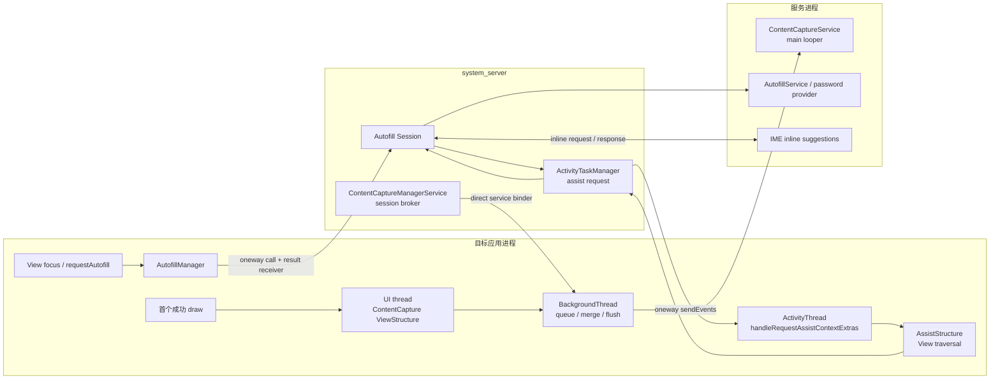

# 7.14 ContentCaptureService 与 Autofill 性能影响

ContentCapture 和 Autofill 都会读取 View 的结构化信息，但用途并不相同：ContentCapture 持续向系统选定的服务报告页面内容变化，Autofill 则在需要填充字段时采集页面快照并请求候选数据。它们的触发条件、数据模型和进程路径也各不相同。本文以 Android 17 / API 37 的 `android-17.0.0_r1` 为平台源码基线；当密码管理器、IME 和 WebView 同时参与时，需要分别判断每条路径产生了什么开销。

## 三个容易混在一起的数据模型

分析前先区分三套框架及其数据对象：

| 框架 | 主要数据对象 | 生成方式 | 常见消费者 |
|---|---|---|---|
| Accessibility | `AccessibilityEvent`、`AccessibilityNodeInfo` | 事件上报；服务按需查询节点 | TalkBack、Switch Access、自动化工具 |
| ContentCapture | `ContentCaptureEvent`、轻量 `ViewNode` / `ViewStructure` | 初始结构报告；View 出现、消失、文本变化等增量事件 | 系统选中并授权的 `ContentCaptureService` |
| Autofill | `AssistStructure`、`FillRequest` | Autofill 会话触发后采集应用窗口结构 | `AutofillService`、密码管理器、Credential Manager 相关提供方 |

ContentCapture 的常规采集不依赖 `AccessibilityEvent`，也不会在每次增量变化时重新创建完整的 `AssistStructure`。Autofill 的结构快照才由 `AssistStructure` 承载。如果把三者都称为“无障碍全树扫描”，就无法判断请求由谁发起、工作在哪个线程执行，也无法找到对应的优化位置。

下图展示了 Android 17 中 ContentCapture 和 Autofill 的主要调用方向。



ContentCapture 会话由 `system_server` 协调，建立连接后，应用通过服务提供的 direct Binder 直接发送事件批次，无须让每一批都再次经过 `system_server`。Autofill 的结构请求则由 `system_server` 发回应用，在应用主线程采集完成后再送给数据提供方。两条路径可能在同一时间窗口出现，但这并不能证明它们重复采集了同一份结构。

## ContentCapture：初始 UI 遍历与后台事件管线

### `system_server` 负责会话，事件直送服务

Activity 创建时，`ContentCaptureManager` 通过 `IContentCaptureManager.startSession()` 请求 `ContentCaptureManagerService` 建立会话。这个 AIDL 接口是 `oneway`，结果另行通过 `IResultReceiver` 返回。服务端完成权限、用户、组件和 allowlist（允许列表）检查后，把 `IContentCaptureDirectManager` Binder 交给应用。

后续事件不必逐批经过 `system_server`。`MainContentCaptureSession` 调用 direct interface（直连接口）的 `sendEvents()`，把装有一批 `ContentCaptureEvent` 的 `ParceledListSlice` 直接发往 `ContentCaptureService`；这个接口同样是 `oneway`。

`oneway` 只表示发送方不等待服务方法处理结束。应用仍要创建事件、复制文本、写入 Parcel，并把 transaction（事务）放进 Binder 队列。服务处理过慢还会消耗异步 Binder 配额和系统 CPU，因此异步调用同样需要计入成本。

### 初始结构生成仍在 UI 线程

Android 17 的 `ViewRootImpl` 会在窗口首帧成功 draw（绘制）后执行一次 `performContentCaptureInitialReport()`。它先调用根 View 的 `dispatchInitialProvideContentCaptureStructure()`，再由 `ViewGroup.dispatchProvideContentCaptureStructure()` 遍历允许采集的子节点。每个节点通过 `onProvideContentCaptureStructure()` 填充自己的结构信息。

这段工作在应用 UI 线程上执行，并且仍属于 ViewRoot 的一次 traversal（测量、布局与绘制）路径。自定义 View 如果在回调中访问磁盘、数据库或网络，或者临时解析大型对象，就会直接延长这次主线程任务。

遍历范围由 `importantForContentCapture` 和 View 的启发式判断共同决定。`no` 只排除当前节点，框架仍可能访问它的子节点；`noExcludeDescendants` 表示整棵子树都不参与采集。父节点一旦使用 exclude-descendants（排除后代）模式，子节点即使显式设置为重要，也无法重新加入这次采集。

### 后续变化按 traversal 批量转交

View 的出现、消失和交互变化会先记录在 `AttachInfo` 中。`ViewRootImpl` 在 traversal 结束阶段调用 `notifyContentCaptureEvents()`，主会话随后在 UI Handler 上准备对应的 `ViewStructure`。读取完 View 属性后，事件进入应用进程的 `BackgroundThread`：

- `ConcurrentLinkedQueue` 接收来自不同线程的事件；
- 文本 composing 事件，也就是输入法仍在组合候选文本期间产生的变化，可以与同一节点的待发事件合并；
- 连续的 disappeared 事件可合并为一个带多个 ID 的事件；
- buffer 达到 `maxBufferSize`，或遇到会话边界、显式 flush、idle timeout、text-change timeout 时发送；这里的 flush 表示立即提交当前缓冲批次；
- 批次通过 direct `oneway` Binder 进入 ContentCaptureService。

分析 ContentCapture 性能时，应分别观察 UI 线程上的 `ViewStructure` 准备，以及后台线程上的事件合并、Parcel 写入和 Binder 发送。只看到其中一侧，无法完整判断开销发生在哪里。

### 服务回调运行在服务主线程

`ContentCaptureService` 的 direct Binder stub（接收 Binder 调用的服务端对象）拿到批次后，会把消息投递到服务进程的 main looper，再逐个调用 `onContentCaptureEvent()`。如果服务在回调中执行大规模解析、同步 I/O 或模型推理，它自己的事件队列就会延迟。应用侧使用的是 `oneway`，所以这种积压通常表现为服务处理滞后、异步 Binder 压力或系统 CPU 上升，并不表示应用正在同步等待服务方法返回。

ContentCapture 没有一套适用于所有设备的结构大小或耗时阈值。节点字段、文本长度、虚拟层级、更新频率、服务 options 和设备 CPU 都会影响结果；“500 个 View 固定需要 30–100 ms”这类数字不能直接用于其他页面或设备。

## Autofill：会话等待、AssistStructure 与提供方响应

### 焦点进入才是常见入口

标准 View 获得焦点时，会间接调用 `AutofillManager.notifyViewEntered()`；自定义控件也可以在用户发起自动填充操作时调用 `requestAutofill()`。Autofill 通常从这类焦点或显式请求开始，并不会在每次 View 树构建完成后自动采集完整结构。

`IAutoFillManager` 在 Android 17 中是 `oneway` 接口，但 `AutofillManager` 的 `addClient()` 和 `startSession()` 会附带 `SyncResultReceiver`，通过另一个结果通道等待会话建立完成，超时常量为 5000 ms。焦点事件通常来自 UI 线程，因此 trace 中如果出现 `SyncResultReceiver` 等待，需要沿 Binder flow（跨进程调用流）继续检查 `system_server` 创建 Autofill 会话的过程。

5000 ms 是异常情况下的保护上限，并非正常延迟目标。接口契约也无法推出“每次 Binder 约 5–10 ms”之类的固定耗时。

### AssistStructure 在应用主线程采集

Autofill Session 需要新响应时，会通过 `ActivityTaskManager.requestAutofillData()` 请求应用提供 assist data（辅助上下文数据）。应用的 `ActivityThread.handleRequestAssistContextExtras()` 在主线程创建 `AssistStructure`，也就是描述当前窗口和可填充节点的结构快照。构造时会枚举 Activity 的 ViewRoot，并调用根 View 的 `dispatchProvideAutofillStructure()`：

1. `View.onProvideAutofillStructure()` 写入资源 ID、尺寸、可见性、autofill type、hints、value 等字段；
2. `View.onProvideAutofillVirtualStructure()` 允许 WebView、自绘控件等暴露没有对应实体 View 的虚拟节点；
3. `ViewGroup` 选择需要进入结构的子节点并递归采集；
4. `ActivityThread` 记录 acquisition start / end（采集开始 / 结束），再把结构的传输通道报告给 `system_server`。

普通节点回调与应用 UI 工作共享线程。虚拟层级也可以用 `asyncNewChild()` / `asyncCommit()` 在异步任务中补充；`AssistStructure.waitForReady()` 最多等待 5000 ms，超过时限仍未提交就会放弃该结构。

### 大结构采用分段传输

`AssistStructure` 不要求把整个对象装进一次 Binder transaction。Android 17 的 `ParcelTransferWriter` 在 Parcel 达到 `IBinder.MAX_IPC_SIZE` 边界后写入 continuation token（续传令牌），接收方再凭这个令牌请求下一段。`Session.AssistDataReceiver` 调用 `ensureDataForAutofill()` 取回全部数据，建立代表本次填充上下文的 `FillContext`，然后创建 `FillRequest`。

分段传输可以避免单次 transaction 超过 IPC 大小上限，但遍历、字段复制、序列化、反序列化和多次 Binder 往返仍然存在。报告应记录这次结构包含的 window 数、node 数、文本规模、采集时长和分段次数，不应套用“中等页面 1–5 MB”之类的固定估计。

### 密码管理器与 IME 不会各扫一遍树

用户选中的 `AutofillService` 通常由密码管理器提供。IME inline suggestions（输入法内联建议）只是展示 Autofill 数据集的一种界面路径：Autofill Session 先向 IME 获取 `InlineSuggestionsRequest`，将它随 `FillRequest` 交给提供方，再把 inline response 送回 IME 显示。

这组协作会增加 `system_server`、提供方、IME 和渲染服务之间的 IPC 与等待，也可能与键盘显示动画重叠。不过，IME 不需要为此独立创建第二份 `AssistStructure`。Android 17 的主、次提供方路径也可以复用已有的 `FillContext`，所以提供方数量不能直接换算成应用 View 树的遍历次数。

IME 自身的启动、`InputConnection` 和窗口动画问题见 [3.6 InputMethodManager 性能影响](../../part1-fundamentals/ch03-input/06-input-method-manager-performance.md)。Binder 等待和异步事务容量可结合 [1.4 Binder IPC](../../part1-fundamentals/ch01-architecture/04-binder.md) 继续分析。

## 把成本按线程和进程拆开

| 位置 | ContentCapture | Autofill | trace 中的表现 |
|---|---|---|---|
| 应用 UI 线程 | 初始结构遍历；动态节点的 `ViewStructure` 准备 | 等待会话结果；遍历 `AssistStructure` | frame / traversal 延长、主线程 waiting 或 Runnable |
| 应用后台线程 | 事件合并、buffer、Parcel、direct Binder | 通常不负责遍历标准 View 的 `AssistStructure` | `BackgroundThread` CPU、Binder transaction |
| `system_server` | 会话、allowlist、服务连接 | Session、assist request、`FillContext`、IME 协调 | Autofill / ATM handler、Binder、锁与调度 |
| `ContentCaptureService` | 主线程逐个处理增量事件 | 无 | 服务 main looper 积压 |
| `AutofillService` / 密码提供方 | 无 | 解析 `FillRequest`、生成 dataset、处理认证 | provider CPU / I/O、response latency |
| IME | 无 | inline request、展示与交互 | IME main/render、窗口动画 |

应用 UI 线程出现一次较长的 traversal 时，应先确认触发者是 ContentCapture 初始报告还是 Autofill assist request。后台 `sendEvents()` 变长时，则要检查事件批次、Parcel 和 Binder 异步压力。如果提供方响应较慢但 App frame 正常，用户感受到的是填充建议出现得晚，不应记作应用渲染卡顿。

## 应用侧结构设计

### 让登录字段保留明确语义

下面的 XML 为登录字段提供稳定的 hints（字段类型提示），并将纯装饰图片从 ContentCapture 和 Autofill 两套结构中排除。

```xml
<LinearLayout
    android:layout_width="match_parent"
    android:layout_height="wrap_content"
    android:orientation="vertical">

    <ImageView
        android:layout_width="match_parent"
        android:layout_height="96dp"
        android:importantForAutofill="no"
        android:importantForContentCapture="no"
        android:src="@drawable/login_decoration" />

    <EditText
        android:id="@+id/username"
        android:layout_width="match_parent"
        android:layout_height="wrap_content"
        android:autofillHints="username"
        android:importantForAutofill="yes"
        android:inputType="textEmailAddress" />

    <EditText
        android:id="@+id/password"
        android:layout_width="match_parent"
        android:layout_height="wrap_content"
        android:autofillHints="password"
        android:importantForAutofill="yes"
        android:inputType="textPassword" />
</LinearLayout>
```

`autofillHints` 帮助提供方稳定识别字段用途，并不会让系统跳过结构采集。需要自动填充的用户名、密码、地址和银行卡字段，不应为了缩小结构而设置为 `no`。

只有整块 UI 都没有可填充字段或可采集内容时，才适合评估在容器上使用 `noExcludeDescendants`。ContentCapture 会据此排除整棵子树，之后在其中新增的有效内容也不会被服务看到。Autofill 的同名模式表达相同意图，但请求 flags 和系统 options 仍可能要求包含更多节点；复用组件和动态页面都需要覆盖回归测试。

从 Android 14 / API 34 开始，Autofill 会结合 importance、其他 View 属性、请求 flags 和系统 options（配置选项），决定是否触发以及结构中包含哪些节点。手动请求、compat mode（兼容模式）、PCC detection（Autofill 的字段分类检测流程）或设备配置，都可能纳入原本标记为不重要的节点。`importantForAutofill` 是语义提示，无法保证每种请求模式都会减少相同数量的节点。

### 保持结构回调纯内存

`onProvideAutofillStructure()`、`onProvideAutofillVirtualStructure()` 和 `onProvideContentCaptureStructure()` 应当只读取已经准备好的 UI 状态。以下工作应移出回调：

- 数据库、文件、网络和跨进程查询；
- 为描述临时解码图片或解析整份文档；
- 对全量业务集合排序、去重或格式转换；
- 等待锁、`Future` 或主线程之外的渲染进程；
- 每次回调重新构造不变的 hints、资源映射和长文本。

对于自绘控件或虚拟层级，应保持 `AutofillId` 稳定，以便框架在多次请求间识别同一个节点，并且只报告当前可交互、语义完整的节点。ContentCapture 的多个虚拟节点可以用 `notifyViewsAppeared()` / `notifyViewsDisappeared()` 批量报告；Autofill 的异步虚拟节点必须在时限内调用 `asyncCommit()`。批量 API 可以减少调用次数，但节点是否需要报告仍由产品语义决定。

### 避免重复触发

标准 `TextView`、`EditText` 和常见 View 已经接入 Autofill 与 ContentCapture。自定义组件只有在以下情况中才需要补充通知：

- 虚拟节点进入、离开或值改变；
- 自绘文本发生用户可感知的语义变化；
- 用户明确选择“自动填充”操作；
- 子 ContentCaptureSession 的上下文发生切换。

不要在每次 `onDraw()`、动画帧，或数据没有变化的 bind 中调用 `requestAutofill()`、`notifyValueChanged()` 或 ContentCapture 文本通知。焦点在相邻节点间反复切换，也会产生额外的会话更新、结构请求或建议 UI 显示与隐藏。

`ContentCaptureManager.getContentCaptureConditions()` 会使用带超时的结果接收器查询系统服务。浏览器可以根据 URL 条件判断是否报告虚拟页面，但不能在每帧执行路径中重复发起这项查询。

## 隐私边界也会改变性能路径

`ContentCaptureService` 需要声明 `android.permission.BIND_CONTENT_CAPTURE_SERVICE`，这项绑定权限由系统控制；Android 14 并不存在面向普通应用的 `CAPTURE_CONTENT` 运行时授权流程。Android 17 平台也没有 `RedactionRule` / `ContentCaptureContext.addRedactionRule()` API，不能依据不存在的接口设计脱敏路径。

Android 17 / API 37 已将 `ContentCaptureManager.setContentCaptureEnabled()` 标记为 deprecated。目标 SDK 为 37 及以上时，该调用可能成为 no-op（不执行任何操作）；平台文档要求敏感窗口使用 `WindowManager.LayoutParams.FLAG_SECURE` 退出 content capture。`FLAG_SECURE` 同时会限制截图和非安全显示，只适合有明确安全需求的窗口，不应用作临时性能开关。

页面内更细的控制仍可使用 `importantForContentCapture`。Autofill 有自己独立的敏感数据处理规则，也受用户所选 provider 的信任边界约束。如果密码字段需要由密码管理器填充，就应保留 Autofill 结构并依赖框架清理敏感值，不能用 ContentCapture 设置代替 Autofill 设置。

## WebView 与跨框架页面

WebView 可以通过 `onProvideAutofillVirtualStructure()` 向 Autofill 暴露 HTML 虚拟节点，也可以通过 `ContentCaptureSession` 报告虚拟页面内容。不能笼统地认为 WebView 会“绕过系统 Autofill”。

同一 WebView 同时参与两条管线时，成本可能包含：

- Autofill 会话触发的一次 AssistStructure 与虚拟节点构建；
- ContentCapture 初始结构及后续增量事件；
- WebView 渲染进程准备虚拟节点的语义数据；
- provider、IME 与 ContentCaptureService 各自的处理。

是否存在重复计算，取决于 WebView 的版本和实现。应同时记录 WebView provider 版本、页面 DOM（文档对象模型）规模、虚拟节点数、目标字段、ContentCapture conditions 和 Autofill request ID，再从 trace 判断是哪条路径占用了 UI 线程。

## 观测与复现

### Perfetto 中使用源码存在的标记

采集 Perfetto trace 时，打开 `view`、`am`、`wm` 这些 atrace 类别，并启用 app、`system_server`、provider 和 IME 的线程调度与 Binder 数据。Android 17 源码中可以直接对应到实现位置的 slice（时间片标记）包括：

- `dispatchContentCapture() for ...`：ViewRoot 初始 ContentCapture 遍历；
- `flushContentCapture for ...`：窗口获得焦点后的 flush；
- `sendEventAsync`：ContentCapture view-tree 事件从开始到结束的异步区间；
- `notifyContentCaptureEvents`：应用 BackgroundThread 处理动态事件；
- `handleRequestAssistContextExtras`：应用主线程构建 Autofill AssistStructure 的入口。

`android.content_capture.request`、`android.content_capture.process`、`android.autofill.request` 和 `android.autofill.process` 并非 Android 17 AOSP 在这些类中定义的标准 slice。如果设备上出现同名标记，应先确认它们是否由厂商、provider 或应用自行添加。

### dumpsys 确认服务与会话

下面的命令用于确认当前设备上两套服务的启用状态、会话和配置。输出字段可能随厂商 build（系统构建版本）变化。

```bash
adb shell dumpsys content_capture
adb shell dumpsys autofill
```

`dumpsys` 适合确认“哪个服务、哪个 session、使用了哪些 options”。它无法代替帧时间、线程 slice、Binder flow 和结构规模数据。输出中可能包含账号、字段、组件或采集条件等敏感信息，分享前需要脱敏。

### 一轮可复核的 A/B

使用受控测试用户并固定 provider 版本，保持设备温度、刷新率、页面数据、IME、账号和输入脚本一致，至少采集以下五组条件：

1. 页面进入但不聚焦 Autofill 字段；
2. 聚焦字段并等待 provider 建议；
3. 开启与关闭 IME inline suggestions 的相同操作；
4. ContentCapture 服务允许该页面与不允许该页面的相同操作；
5. 移除回调中的耗时工作，或排除无关虚拟子树后的版本。

每组都记录 App frame、主线程 `handleRequestAssistContextExtras`、ContentCapture 初始 slice、`BackgroundThread`、`AssistStructure` acquisition 时间、provider 首次响应时间和 IME 建议出现时间。不要在用户日常使用的设备上随意关闭密码管理器、辅助服务或内容采集组件。

## 归因检查表

| 现象 | 需要补充的证据 | 可能的修复位置 |
|---|---|---|
| 首屏 draw 后主线程出现长任务 | `dispatchContentCapture()`、节点数、回调栈 | App 自定义 ContentCapture structure、无关子树 |
| 聚焦输入框时主线程处于 waiting | Autofill `startSession`、result receiver、`system_server` flow | Autofill Session、`system_server` 锁或调度 |
| 主线程执行大量结构回调 | `handleRequestAssistContextExtras`、request ID、virtual nodes | App View / WebView / custom provider |
| 应用 BackgroundThread CPU 高 | ContentCapture queue、flush reason、batch size、文本长度 | App 事件频率、虚拟节点报告 |
| 密码建议出现较晚但帧正常 | provider response、IME inline request、render service | `AutofillService`、IME 或 inline 渲染 |
| `ContentCaptureService` 事件积压 | 服务 main looper、每事件处理时间、I/O | `ContentCaptureService` 实现 |
| 大结构出现多段 Binder | window/node/文本规模、partial transfer 日志 | App 结构设计、虚拟层级、字段体积 |

性能报告至少应写明触发字段、request / session ID、目标线程、provider / IME / WebView 版本和结构规模。如果只记录“开启密码管理器后变慢”，就无法区分会话等待、结构遍历、服务响应和建议 UI 各自的耗时。

## Android 8—17 版本边界

- **Android 8.0 / API 26**：Autofill Framework 和 `importantForAutofill` 进入公开 API。
- **Android 10 / API 29**：`ContentCaptureManager`、`ContentCaptureSession` 和 `ContentCaptureService` 进入公开 API。
- **Android 11 / API 30**：`importantForContentCapture` 和 IME inline suggestions 相关公开 API 可用。
- **Android 14 / API 34**：Autofill 对 importance、其他 View 属性和优化选项的组合判断发生变化，不能沿用早期版本的固定包含规则。
- **Android 17 / API 37**：按 `android-17.0.0_r1` 核对。ContentCapture 使用 UI 结构准备、应用 `BackgroundThread` 缓冲和 direct `oneway` Binder；Autofill 仍通过 `ActivityThread` 构建 `AssistStructure`。`setContentCaptureEnabled()` 在 API 37 已 deprecated，目标 SDK 37 及以上版本应按照 `FLAG_SECURE` 契约处理敏感窗口。

这些路径属于 framework 和应用 / 服务进程，理解它们不需要依赖 `android17-6.18-2026-06_r6` kernel tag。Binder 驱动、线程调度和内存压力会影响时延，但本文讨论的调用关系没有引入 Android 17 内核专属机制。

## 源码与资料

- [`ContentCaptureManager.java`](https://android.googlesource.com/platform/frameworks/base/+/android-17.0.0_r1/core/java/android/view/contentcapture/ContentCaptureManager.java)、[`MainContentCaptureSession.java`](https://android.googlesource.com/platform/frameworks/base/+/android-17.0.0_r1/core/java/android/view/contentcapture/MainContentCaptureSession.java) 与 [`IContentCaptureDirectManager.aidl`](https://android.googlesource.com/platform/frameworks/base/+/android-17.0.0_r1/core/java/android/view/contentcapture/IContentCaptureDirectManager.aidl)：会话、后台队列、事件合并、flush 和 direct `oneway` Binder。
- [`View.java`](https://android.googlesource.com/platform/frameworks/base/+/android-17.0.0_r1/core/java/android/view/View.java)、[`ViewGroup.java`](https://android.googlesource.com/platform/frameworks/base/+/android-17.0.0_r1/core/java/android/view/ViewGroup.java) 与 [`ViewRootImpl.java`](https://android.googlesource.com/platform/frameworks/base/+/android-17.0.0_r1/core/java/android/view/ViewRootImpl.java)：两套 structure 回调、importance、初始报告、动态事件和 AOSP trace slice。
- [`ContentCaptureManagerService.java`](https://android.googlesource.com/platform/frameworks/base/+/android-17.0.0_r1/services/contentcapture/java/com/android/server/contentcapture/ContentCaptureManagerService.java) 与 [`ContentCaptureService.java`](https://android.googlesource.com/platform/frameworks/base/+/android-17.0.0_r1/core/java/android/service/contentcapture/ContentCaptureService.java)：会话代理、direct service Binder 与服务 main-looper 回调。
- [`AutofillManager.java`](https://android.googlesource.com/platform/frameworks/base/+/android-17.0.0_r1/core/java/android/view/autofill/AutofillManager.java) 与 [`IAutoFillManager.aidl`](https://android.googlesource.com/platform/frameworks/base/+/android-17.0.0_r1/core/java/android/view/autofill/IAutoFillManager.aidl)：焦点触发、会话状态、`oneway` 调用和结果接收器等待。
- [`ActivityThread.java`](https://android.googlesource.com/platform/frameworks/base/+/android-17.0.0_r1/core/java/android/app/ActivityThread.java) 与 [`AssistStructure.java`](https://android.googlesource.com/platform/frameworks/base/+/android-17.0.0_r1/core/java/android/app/assist/AssistStructure.java)：主线程采集、虚拟节点等待与分段 Binder 传输。
- [`Session.java`](https://android.googlesource.com/platform/frameworks/base/+/android-17.0.0_r1/services/autofill/java/com/android/server/autofill/Session.java) 与 [`AutofillInlineSuggestionsRequestSession.java`](https://android.googlesource.com/platform/frameworks/base/+/android-17.0.0_r1/services/autofill/java/com/android/server/autofill/AutofillInlineSuggestionsRequestSession.java)：assist request、FillContext、provider 与 IME inline suggestions 协作。
- [Autofill 优化指南](https://developer.android.com/identity/autofill/autofill-optimize)、[View API](https://developer.android.com/reference/android/view/View) 与 [ContentCaptureManager API](https://developer.android.com/reference/android/view/contentcapture/ContentCaptureManager)：公开属性、版本行为与 API 37 弃用边界。
