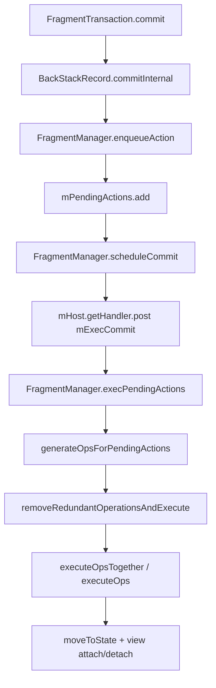
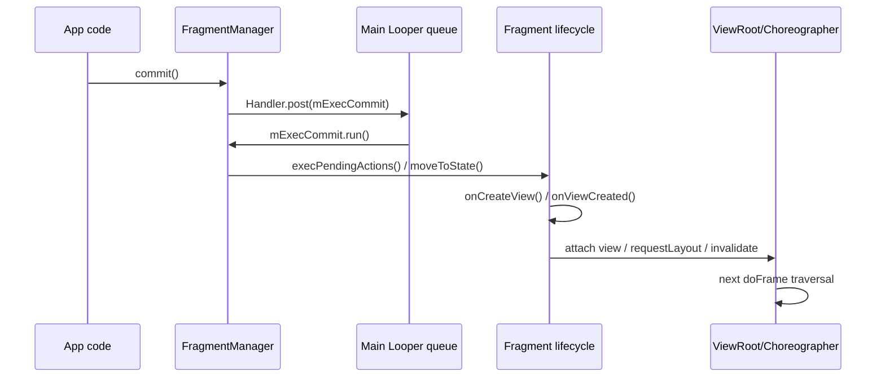

# 7.17 FragmentTransaction 提交时序与主线程卡顿

`FragmentTransaction.commit()` 只是把事务交给 `FragmentManager` 排队，卡顿通常发生在队列被主线程执行之后。排查 Fragment 切换长帧时，要把提交 API、主线程消息调度、Fragment view 创建、布局绘制、列表首屏绑定分开看。

[已验证: 官方文档, developer.android.com/guide/fragments/transactions] Android 官方文档对 `commit()` 的描述很直接：事务不会立刻执行，而是安排到主 UI 线程；需要同步执行时才使用 `commitNow()`。这条边界决定了 Fragment 卡顿不能只看调用 `commit()` 的那一行，必须跟到后续 `execPendingActions()` 和 view 创建阶段。[来源: OpenClaw定时任务/AutoResearchClaw调研报告/2026-05-05-fragmenttransaction-commit-source-chain.md]

## 提交入口：commit、commitNow 与 allowStateLoss 的性能语义

AndroidX Fragment 的常用提交入口有四类，它们解决的问题不同：

| API | 执行方式 | 状态保存边界 | 性能风险 |
| --- | --- | --- | --- |
| `commit()` | 调用 `BackStackRecord.commitInternal(false, true)`，把事务加入 pending actions | 宿主已经保存状态后会抛异常 | 调用点不一定卡；后续执行事务时可能卡 |
| `commitAllowingStateLoss()` | 同样入队，但允许状态保存后提交 | 事务可能在进程恢复时丢失 | 性能语义与 `commit()` 接近，风险主要是状态一致性 |
| `commitNow()` | 调用 `execSingleAction()` 同步执行当前事务 | 不允许 `addToBackStack()` | 调用点会承担 Fragment 生命周期推进和 view 创建成本 |
| `executePendingTransactions()` | 同步执行已经排队的 pending transactions | 可与 back stack 共存 | 会执行队列里所有待处理事务，容易把别处提交的成本带进当前调用点 |

[已验证: AndroidX androidx-main, BackStackRecord.java] `commit()` 和 `commitAllowingStateLoss()` 的差异落在 `allowStateLoss` 参数，二者都会在 `commitAction=true` 时调用 `FragmentManager.enqueueAction()`。`commitNow()` 走 `execSingleAction()`，并在执行前调用 `disallowAddToBackStack()`。[已验证: AndroidX androidx-main, FragmentTransaction.java] 官方注释也明确写出：`commitNow()` 会在返回前完成新增 Fragment 初始化、移除 Fragment 销毁和 view attach，并且比 `commit()` 后接 `executePendingTransactions()` 更可控，因为后者会扫掉所有 pending 事务。

`allowStateLoss` 不应该被当作性能优化开关。它改变的是 Activity 状态保存之后还能不能提交，以及进程恢复时 UI 状态是否可能丢失；它不会减少 `onCreateView()`、`onViewCreated()`、布局、动画和首屏数据绑定成本。

## 待执行队列：从 BackStackRecord 到 pending actions

现代项目应该以 AndroidX `androidx.fragment.app` 为分析对象。平台 `android.app.Fragment` 已废弃，平台源码只适合做历史对照。

AndroidX 事务入队路径可以压成一条线：



[已验证: AndroidX androidx-main, FragmentManager.java] `scheduleCommit()` 只在 `mPendingActions.size() == 1` 时 post `mExecCommit`。这能解释一个常见现象：同一轮主线程消息里连续提交多笔事务时，第一笔事务负责把 `mExecCommit` 放进队列，后续事务只是追加到 `mPendingActions`，等 `mExecCommit` 被分派时一起生成 `BackStackRecord` 并执行。

`removeRedundantOperationsAndExecute()` 会参考 `setReorderingAllowed(boolean)` 对相邻事务做合并执行。官方 Fragment 文档建议每个 `FragmentTransaction` 使用 `setReorderingAllowed(true)`，原因是它允许 FragmentManager 优化状态变更，也能让动画和 transition 的顺序更符合预期。[已验证: 官方文档, developer.android.com/guide/fragments/transactions]

## 主线程时序：Handler.post、Looper 与 Choreographer 的相对位置

`commit()` 的调度系统是主线程 `Handler` 和 `Looper`，不是 `Choreographer`。`FragmentManager` 把 `mExecCommit` post 到宿主 `Handler` 后，事务什么时候执行取决于主线程消息队列；VSync 只决定 UI 线程什么时候处理输入、动画、traversal 等帧回调。

一次典型的 Fragment 切换可以按时间拆开：



这条时间线对 trace 分析有两个含义：

- `commit()` 调用点短，不代表 Fragment 切换便宜；重成本可能出现在稍后的 `mExecCommit` 主线程 message 里。
- Fragment view attach 后触发的 `requestLayout()` 和 `invalidate()` 会影响后续帧；长帧可能横跨生命周期回调、布局遍历和首屏列表绑定。

[已验证: 官方文档, developer.android.com/topic/performance/vitals/render] Android Vitals 文档建议用 Perfetto FrameTimeline 跟踪 slow / frozen frames。Fragment 切换场景里，FrameTimeline 只能告诉哪一帧超时；要归因还得回到主线程 message、Fragment 生命周期、View traversal 和应用自定义 trace section。

## 卡顿归因：事务执行、视图膨胀和生命周期副作用分开看

Fragment 切换的长帧常被笼统归到 FragmentManager。更稳的拆法是按成本来源分组：

- 事务调度成本：`generateOpsForPendingActions()`、`removeRedundantOperationsAndExecute()`、`executeOpsTogether()` 处理 pending actions、back stack、重排和 transition。
- view 创建成本：`onCreateView()` 中 inflate 复杂布局、同步创建大对象、反射加载自定义 View、解析大量资源。
- 生命周期副作用：`onViewCreated()` / `onStart()` / `onResume()` 里启动同步 IO、读取数据库、阻塞等待接口回调或初始化 SDK。
- 首屏绑定成本：RecyclerView adapter 首批 `onBindViewHolder()`、Diff 计算、图片解码、ComposeView 首次 composition。
- 动画和 transition 成本：Fragment transition、共享元素、postponed enter transition、窗口 inset 分发和布局重算。
- 队列放大成本：同一轮消息里多次 `commit()`、Navigation 连续 `navigate()`、DialogFragment `show()` 叠加，让一次 `mExecCommit` 执行多笔事务。

这里的判断方式很简单：如果 trace 中 `FragmentManager` 自身切片短，但 `onCreateView()`、layout、bind、image decode、database query 很长，问题就不在事务队列；如果 `removeRedundantOperationsAndExecute()` 或 transition 处理本身占用明显，再回头检查事务合并、back stack 和动画配置。

## 可观测性：Perfetto、trace section 与 FrameTimeline 对齐

Fragment 切换最好在代码里主动埋 `Trace.beginSection()`，否则 Perfetto 只能看到一串普通 Java/Kotlin 调用和 View traversal，定位成本会被稀释。

建议至少埋四类 section：

```kotlin
Trace.beginSection("FragmentRoute:HomeToDetail")
supportFragmentManager.commit {
    setReorderingAllowed(true)
    replace(R.id.container, DetailFragment())
    addToBackStack("detail")
}
Trace.endSection()
```

这段只标记提交调用范围，不代表事务执行范围。为了覆盖事务执行后的重成本，应该在目标 Fragment 内补充更细的 section：

```kotlin
class DetailFragment : Fragment(R.layout.detail) {
    override fun onViewCreated(view: View, savedInstanceState: Bundle?) {
        Trace.beginSection("DetailFragment:onViewCreated")
        try {
            setupRecyclerView()
            bindInitialState()
        } finally {
            Trace.endSection()
        }
    }
}
```

看 trace 时按这几步走：

1. 在 FrameTimeline 里选中 jank 帧，确认 Actual Duration、UI Thread 和 RenderThread 是否一起超时。SQL 细节详见 13.10 节，DataGrid / Jank CUJ 用法详见 13.14 节。
2. 回到主线程轨道，找 jank 帧前后的 Looper message 边界，确认 `mExecCommit`、生命周期回调和 View traversal 的相对位置。Perfetto 视图操作详见 13.3 节。
3. 对照自定义 trace section，把 `commit()` 调用、`onCreateView()`、`onViewCreated()`、列表首屏绑定和图片加载切开。
4. 如果首屏列表贡献了主要耗时，再转到 RecyclerView 实战章节检查预取、缓存、Diff 和图片加载策略，详见 22.2 节。

`FragmentManager.enableDebugLogging(true)` 可以帮助确认事务顺序，但它会增加日志开销，不适合在性能压测时长期打开。更安全的做法是保留自定义 trace section，并用 debug 构建或临时开关打开 FragmentManager 日志。

## 优化策略：延迟、拆分、预加载与事务合并的边界

Fragment 切换优化不能只追求“让 commit 更快”。提交本身通常已经很短，要优化的是事务执行后的主线程工作量。

- 合并同一语义下的多笔事务：同一轮 UI 切换里连续 `replace()`、`hide()`、`show()` 容易让 pending actions 堆积。能在一个 transaction 内表达的变更就放进同一笔事务，并启用 `setReorderingAllowed(true)`。
- 避免用 `executePendingTransactions()` 当同步等待工具：它会执行所有 pending transactions，容易把无关事务的生命周期成本带到当前调用点。只需要当前事务同步完成时，评估 `commitNow()` 是否满足“不进 back stack”的约束。
- 把重初始化移出生命周期热路径：数据库打开、网络请求、SDK 初始化、大图解码不要放进 `onCreateView()` / `onViewCreated()` 的同步路径。UI 首帧只绑定必要状态，重数据通过异步流或分页加载补齐。
- 给首屏列表留预算：Fragment 切换后第一帧常被列表首批 bind 吃掉。稳定 ID、分页、图片占位、预取策略和 Diff 线程化，比反复调整 FragmentTransaction 更有效。
- 谨慎使用共享元素和 postponed transition：共享元素动画会推迟进入动画开始时机，且对布局稳定性敏感。trace 中如果看到 transition 等待或多轮 layout，先缩小共享元素范围，再评估是否需要 postponement。
- DialogFragment 选择 `show()` 还是 `showNow()` 要看调用场景：`show()` 走异步事务，`showNow()` 同步显示并承担当前调用点成本。启动流程、输入响应路径和列表滚动中不宜随手使用同步版本。

这些策略的取舍应该放回帧预算里判断：目标不是让每个 Fragment 事务都同步完成，而是让用户可感知的首帧和后续动画帧稳定落在预算内。卡顿分析的完整流程详见 7.3 节，页面切换场景的归因模板详见 7.4 节。

## 版本边界：平台 Fragment、AndroidX Fragment 与 Jetpack 差异

平台 `android.app.Fragment` 在 API 28 后已废弃。新项目应以 AndroidX Fragment、Fragment KTX、Navigation 和 FragmentStrictMode 的行为为准，旧平台源码只能作为“为什么会这样设计”的背景材料。

版本边界可以这样记：

| 范围 | 可依赖的判断 | 不宜外推的判断 |
| --- | --- | --- |
| 平台 Fragment（API 11-28，已废弃） | `commit()` 异步安排到主线程、`executePendingTransactions()` 同步扫 pending | 旧 `FragmentManagerImpl` 的具体字段名和行号不应套到 AndroidX |
| AndroidX Fragment 1.0+ | `BackStackRecord`、`enqueueAction()`、`scheduleCommit()`、`mExecCommit`、`execPendingActions()` 是现代分析入口 | release note 中未写明的行为变更不要写成版本特性 |
| AndroidX Fragment 1.4+ / 1.5+ | release note 对 back stack 保存、`setReorderingAllowed(true)`、`@MainThread` 标注、FragmentStrictMode 有持续补强 | 不要把某个 alpha / beta 的实现细节当作长期契约 |
| Navigation 组件 | `navigate()` 最终仍会落到 FragmentManager 事务，但多了目的地解析、back stack 管理和 lifecycle 协调 | 不要只看手写 `commit()` 的 trace 就断言 Navigation 的全部成本 |

[已验证: 官方文档, developer.android.com/jetpack/androidx/releases/fragment] AndroidX Fragment release notes 多次提到 `setReorderingAllowed(true)`、`commitNow()` / `executePendingTransactions()` 主线程标注、FragmentStrictMode 等变化。写性能结论时应引用具体 AndroidX 版本，不要只写“Android 某版本”。

## 扩展：Navigation、共享元素动画与验证模板

### FragmentTransaction 与 Navigation 组件的时序差异

手写事务的 trace 通常从业务代码里的 `commit {}` 开始。Navigation 的 `navigate()` 还会经过目的地匹配、argument 处理、Navigator 调度和 back stack 维护，随后才进入 FragmentManager 事务。排查 Navigation 切换时，建议把 `NavController.navigate()` 外层、目标 Fragment `onCreateView()`、目标页面首屏 bind 分别打点；只看 FragmentManager 切片会漏掉导航层成本。

DialogFragment 也有类似差异：`show()` 内部创建事务并调用 `commit()`，`showNow()` 走同步提交。弹窗如果出现在点击事件或滑动过程中，同步版本可能把 view 创建和窗口 attach 成本放进输入处理 message。

### Fragment 切换与共享元素动画的帧预算

共享元素动画的成本不只在动画插值。它还依赖源页面和目标页面都有稳定的 view 层级、尺寸和位置；目标 Fragment 首帧 inflate 或图片加载慢，会让 transition 推迟或触发额外布局。使用 postponed enter transition 时，要给等待条件设置兜底超时，避免图片或数据回调异常导致页面卡在过渡状态。[待验证: 需要结合具体项目 transition 配置和实机 trace]

### FragmentScenario / Macrobenchmark 验证模板

同一页面可以做四组对比：

| 组别 | 事务策略 | 观测指标 |
| --- | --- | --- |
| A | `commit()` + 默认 view 创建 | 首帧 Actual Duration、jank 帧数、`onCreateView()` 耗时 |
| B | `commit()` + `setReorderingAllowed(true)` + 合并事务 | pending actions 数量、生命周期回调次数、transition 是否稳定 |
| C | `commitNow()`，不进 back stack | 调用点耗时、首帧耗时、输入事件是否被阻塞 |
| D | 保持 `commit()`，把重初始化移出 `onViewCreated()` | 首帧 P50 / P90、列表首批 bind 耗时、图片解码耗时 |

验证环境必须写清楚设备、系统版本、AndroidX Fragment 版本、是否启用 Navigation、页面数据量、动画配置和采样次数。没有这些条件，`commitNow()` 更快或更慢都只是局部观察，不能写成通用结论。
