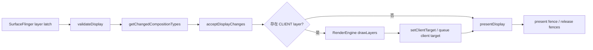

---

title: "HWC Overlay Plane 与合成降级排查"
chapter: "7.18"
status: ready-for-review
drafted_date: "2026-05-23"
applicable_versions: "Android 10 (API 29) - Android 16 (API 36); Android 17 待公开 tag 复核"
last_verified: "2026-05-23"
last_verified_against: "AOSP android-16.0.0_r1 frameworks/native SurfaceFlinger/HWC2/CompositionEngine + hardware/interfaces composer3 AIDL + source.android.com HWC docs + Perfetto FrameTimeline docs"
confidence: medium
sources:
  - type: aosp
    path: "frameworks/native/services/surfaceflinger/DisplayHardware/HWC2.cpp"
  - type: aosp
    path: "frameworks/native/services/surfaceflinger/CompositionEngine/src/Output.cpp"
  - type: aosp
    path: "hardware/interfaces/graphics/composer/aidl/android/hardware/graphics/composer3/Composition.aidl"
  - type: aosp
    path: "hardware/interfaces/graphics/composer/aidl/android/hardware/graphics/composer3/OverlayProperties.aidl"
  - type: official
    path: "https://source.android.com/docs/core/graphics/hwc"
  - type: official
    path: "https://source.android.com/docs/core/graphics/implement-hwc"
  - type: official
    path: "https://perfetto.dev/docs/data-sources/frametimeline"
  - type: research
    path: "/Users/gracker/Library/Mobile Documents/iCloud~md~obsidian/Documents/Obsidian/DeepResearch/2026-05-22-hwc-overlay-plane-capability-sf-composition-downgrade.md"
tags: [hwc, surfaceflinger, overlay-plane, client-composition, jank, perfetto, winscope]
related_chapters: ["2.6", "2.15", "2.16", "7.6", "7.15", "14.15", "18.15"]
created_by: "task2a-knowledge-gap"
created_date: "2026-05-23"
gap_source: "章节深挖/研究素材/AOSP结构/官方文档"
gap_score: 18
material_count: 4
pipeline_stage: "task6_pending"
task2a_state: "processed"
task2a_result: "ready-for-review"
last_task2a_at: "2026-05-23T01:04:00+08:00"
task6_state: pending
task9_state: pending
---

# 7.18 HWC Overlay Plane 与合成降级排查

<!-- outline-start -->
## 要点

### 🔹 问题边界：App 帧正常但显示仍掉帧
说明 HWC Overlay Plane 和 SurfaceFlinger 合成降级适合解释哪类卡顿：App 主线程、RenderThread 看起来没有超时，但 FrameTimeline 或屏幕呈现仍出现 SF missed / DisplayHAL 侧异常。

### 🔹 HWC 合成协商流程
梳理 `validateDisplay()`、`getChangedCompositionTypes()`、`acceptDisplayChanges()`、`presentDisplay()` 的协作顺序，明确 `DEVICE` 与 `CLIENT` composition 的含义和排查价值。

### 🔹 Overlay Plane 能力上限
整理 Plane 数量、像素格式、alpha / blending、旋转缩放、受保护内容、带宽和 vendor policy 对合成类型的影响，避免只按 Layer 数量下结论。

### 🔹 Perfetto 与 dumpsys 证据采集
给出 `android.surfaceflinger.frametimeline`、SurfaceFlinger 进程 slice、Layer trace、Winscope 和 `dumpsys SurfaceFlinger` 的证据组合，说明每类证据能回答的问题。

### 🔹 典型触发场景
围绕视频通话、相机预览 + UI 浮层、播放器字幕/弹幕、多窗口、系统栏叠加等场景，拆出 Layer 数量、Layer 属性和刷新率/分辨率变量。

### 🔹 优化动作与回归验证
整理减少独立 Layer、合并 overlay、调整 SurfaceView Z-order、降低缩放/旋转组合、分设备灰度和同机 trace 对比的验证方法。

## 扩展

### 🔸 Qualcomm / MediaTek / Pixel HWC 策略差异
记录公开资料能确认的边界；厂商私有策略必须标注为待验证或实机证据。

### 🔸 与 18.15 视频叠加和 HWC 的交叉引用
排查和治理动作放在 7.18；HWC / 视频叠加原理详见 18.15 节，SurfaceFlinger 合成机制详见 2.6 节。

### 🔸 线上指标设计
探索是否能把 CLIENT composition 比例、SF missed frame、设备型号和场景标签纳入线上问题分群。

<!-- outline-end -->

## 这类问题的边界

HWC Overlay Plane 排查解决的是一种很容易误判的卡顿：App 的主线程、RenderThread、GPU command 提交看起来都在预算内，但屏幕端仍然出现掉帧、延迟或功耗异常。此时问题不一定在 App 绘制阶段，可能出在 SurfaceFlinger 与 HWC 协商之后的合成路径。

典型现场有三种信号：

- App 侧 `Choreographer#doFrame`、RenderThread `DrawFrame` 没有稳定超时，但 `actual_frame_timeline_slice.jank_type` 出现 `SurfaceFlinger deadline missed (while in HWC)`、`SurfaceFlinger deadline missed (while in GPU comp)` 或 `Display HAL`。
- 同一个业务界面在低端机、高刷档位、视频/相机叠加场景下更容易复现，降低分辨率、刷新率或浮层数量后恢复。
- `dumpsys SurfaceFlinger`、Winscope 或 Layer trace 显示某些 Layer 从 `DEVICE` 变成 `CLIENT`，SurfaceFlinger 开始走 RenderEngine/GPU client composition。

这不是“Layer 多了必掉帧”。HWC 的判断同时受格式、dataspace、alpha/blending、裁剪、旋转、缩放、受保护内容、刷新率、显示带宽和厂商策略约束。Layer 数量只能作为入口，不能作为结论。[已验证: source.android.com/docs/core/graphics/hwc, source.android.com/docs/core/graphics/implement-hwc]

## 合成协商怎样决定 DEVICE / CLIENT

SurfaceFlinger 在一帧里完成 layer latch 后，会把可见 Layer 集合交给 Composer HAL。HWC 根据本设备的显示硬件能力返回每个 Layer 的合成类型。Android 16 的 AIDL `Composition.aidl` 给出两个常用类型的定义：`CLIENT` 表示 client 必须先把该 Layer 合成进 client target，再通过 `setClientTarget` 交给设备；`DEVICE` 表示设备通过 hardware overlay 或类似能力处理该 Layer，但 `validateDisplay()` 之后设备可以要求把它改成 `CLIENT`。[已验证: AOSP android-16.0.0_r1, hardware/interfaces/graphics/composer/aidl/android/hardware/graphics/composer3/Composition.aidl]



AOSP android-16.0.0_r1 的 `HWC2.cpp` 能看到这组调用的包装层：`Display::validate()` 调 `mComposer.validateDisplay()`，`Display::getChangedCompositionTypes()` 读取 HWC 要求的类型变化，`Display::acceptChanges()` 调 `acceptDisplayChanges()`，`Display::present()` 调 `presentDisplay()` 并返回 present fence。[已验证: AOSP android-16.0.0_r1, frameworks/native/services/surfaceflinger/DisplayHardware/HWC2.cpp]

只要本帧存在 `CLIENT` Layer，SurfaceFlinger 就要准备 client target。`CompositionEngine/src/Output.cpp` 的路径更接近排查现场：`Output::prepareFrame()` 选择合成策略；`Output::composeSurfaces()` 在 `usesClientComposition` 为真时生成 client composition requests，随后调用 `RenderEngine::drawLayers()`；完成后通过 render surface `queueBuffer()` 把结果交回显示侧。[已验证: AOSP android-16.0.0_r1, frameworks/native/services/surfaceflinger/CompositionEngine/src/Output.cpp]

排查时可以把 `DEVICE` 理解成“这层被显示硬件接走”，把 `CLIENT` 理解成“这层先被 SurfaceFlinger 的 RenderEngine 合成进一张中间 buffer”。`CLIENT` 不一定错；系统栏、圆角、色彩转换、复杂裁剪和某些 protected 场景都可能让它变成合理选择。问题在于某个业务场景让 `CLIENT` 比例突然升高，并把 GPU 合成、带宽或 HWC present 推过帧预算。

## Overlay Plane 能力不能只看数量

官方 HWC 文档提到 Android 设备通常支持四个 overlay plane，超过 overlay 能力时，HWC 可以要求部分或全部 Layer 走 GLES/client composition。[已验证: source.android.com/docs/core/graphics/hwc]

这句话适合做排查入口，不适合作为设备结论。公开 Android 应用 API 没有稳定入口查询 overlay plane 数量；HWC AIDL 的 `getOverlaySupport()` 面向 Composer HAL/系统侧，Android 16 的 `OverlayProperties.aidl` 暴露的是 pixel format、dataspace 组合、mixed color spaces、LUT 等支持项，并不等价于“这台机器有 N 个 plane”。[已验证: AOSP android-16.0.0_r1, hardware/interfaces/graphics/composer/aidl/android/hardware/graphics/composer3/IComposerClient.aidl 与 OverlayProperties.aidl]

做设备基准时，把下面几类变量放在同一张表里，比单看 Layer 数更稳：

| 变量 | 现场表现 | 排查价值 |
|---|---|---|
| Layer 数量与 z-order | 视频层、相机预览层、字幕/弹幕层、系统栏同时出现 | 判断是否逼近设备 overlay 资源上限 |
| PixelFormat / dataspace | YUV 视频、RGBA UI、HDR / SDR 混合 | 判断格式和色彩空间是否需要 client target 或额外转换 |
| Alpha / blending | 半透明浮层、圆角遮罩、模糊背景 | 判断 HWC 是否能直接做 blending |
| Transform / crop / scaling | 旋转、缩放、PIP、自由窗口 | 判断硬件 scaler 与 transform 能力是否被打满 |
| Protected content | DRM 视频、secure display | 判断是否禁止走普通 GPU client composition |
| 刷新率与分辨率 | 90Hz / 120Hz、高分辨率外接屏 | 判断 DPU/带宽预算是否变小 |
| 厂商策略 | 省电模式、温控、特定 SoC display policy | 只能用实机 trace、HWC 日志或厂商文档确认 |

`OverlayProperties` 只说明格式和 dataspace 等组合能力；plane 数量、分配策略、功耗策略通常在厂商 HWC 或显示驱动里。没有实机证据时，写“某芯片一定支持 6-8 个 plane”风险很高，应标为 `[待验证: 需厂商文档、HWC 日志或同机场景对比]`。

## 证据采集：把 FrameTimeline、SF slice 和 Layer 状态合起来

单个证据很难证明“合成降级导致卡顿”。更稳的办法是把四类证据连起来：用户看到哪一帧卡、SurfaceFlinger 那一帧在做什么、Layer 的 composition type 是否改变、改变后 GPU/HWC 耗时是否同步升高。

### Perfetto：先确认掉帧类型和时间窗口

FrameTimeline 在 Android 12+ 可用，Perfetto 文档说明它由 SurfaceFlinger 负责检测 jank 并报告来源。SQL 层有 `expected_frame_timeline_slice` 和 `actual_frame_timeline_slice` 两张表。[已验证: Perfetto FrameTimeline docs]

这段 SQL 用来抽出发生 jank 的帧、present 类型和 Layer 名称：

```sql
select
  ts,
  dur,
  surface_frame_token as app_token,
  display_frame_token as sf_token,
  jank_type,
  present_type,
  layer_name,
  process.name
from actual_frame_timeline_slice
left join process using (upid)
where jank_type != 'None'
order by ts;
```

如果命中 `SurfaceFlinger deadline missed (while in GPU comp)`，重点转向 client composition；如果命中 `SurfaceFlinger deadline missed (while in HWC)` 或 `Display HAL`，重点转向 HWC present、display HAL、fence 和显示带宽。Perfetto 文档同时说明 SurfaceView 当前不完全纳入 FrameTimeline 的应用侧轨道，因此视频/相机场景不能只依赖 App track，要补 SurfaceFlinger、Layer trace 和 dumpsys 证据。[已验证: Perfetto FrameTimeline docs]

### SurfaceFlinger slice：确认是否进入 client composition

在 trace 里查看 `/system/bin/surfaceflinger` 进程，重点找本帧附近的 `composite`、`present`、CompositionEngine、RenderEngine 或 `drawLayers` 相关 slice。不同 Android 版本和 trace 配置下 slice 名称会有差异，源码锚点不要写成旧版 `handleMessageRefresh()` 或不存在的 `doComposition()`。Android 16 更可靠的源码路径是 `SurfaceFlinger::composite()` 之后进入 CompositionEngine，`Output::prepareFrame()` 选择策略，`Output::composeSurfaces()` 执行 RenderEngine client composition。[已验证: AOSP android-16.0.0_r1, frameworks/native/services/surfaceflinger/CompositionEngine/src/Output.cpp]

### dumpsys / Winscope：确认 Layer 类型变化

`dumpsys SurfaceFlinger` 和 Winscope 更适合回答“这一帧有哪些 Layer、它们的 z-order 和 composition type 是什么”。可抓两份：正常场景一份，复现场景一份。对比时关注三点：

- 同一个视频/相机 Layer 是否从 `DEVICE` 变成 `CLIENT`。
- 新增的 UI 浮层、系统栏、字幕、弹幕是否改变了 z-order 或 alpha/blending 条件。
- 复现场景是否多出 client target、RenderEngine GPU composition 或更长的 present fence 等待。

`dumpsys` 输出格式会随版本和厂商变化，不要把字段名写死成唯一标准。结论要落到“同机、同场景、同刷新率下的前后对比”。

### Fence：区分 GPU 合成慢和显示侧持有慢

合成降级常和 fence 等待混在一起。`CLIENT` 升高后，如果卡点落在 `RenderEngine::drawLayers()` 或 client target 的 ready fence 上，优化方向偏向减少 client composition；如果卡点落在 `presentDisplay()`、present fence 或 release fence，问题可能在 HWC / display HAL / panel 侧。Fence 方向详见 2.16 节，这里只做排查引用，不重复展开原理。

## 典型触发场景

### 视频播放 + UI 浮层

`SurfaceView` 视频层本来适合走 `DEVICE` composition。播放器叠加字幕、弹幕、点赞动画、半透明控制栏后，HWC 需要同时处理视频层、App UI 层、系统栏和可能的圆角/挖孔装饰。只要某个条件超出硬件支持，视频层或 UI 层就可能被改成 `CLIENT`。

排查动作：保留同一视频、同一清晰度、同一刷新率，逐个开关字幕、弹幕、控制栏和系统栏沉浸模式。每次抓 `dumpsys SurfaceFlinger` 和 5-10 秒 Perfetto，记录 composition type、jank_type、GPU frequency、present fence 等待。

### 相机预览 + 业务浮层

相机预览常见 YUV buffer、特定 dataspace 和固定裁剪比例。叠加人脸框、AR 道具、半透明引导层后，HWC 既要处理格式，又要处理 z-order、alpha 和 crop。TextureView 路线天然更依赖 App/GPU；SurfaceView 路线更依赖 HWC 是否支持预览层与浮层组合。相机链路详见 18.14 节，视频叠加和 HWC 原理详见 18.15 节。

排查动作：把预览分辨率、预览帧率、浮层数量和缩放比例作为四个变量。不要只测默认预览；高分辨率拍照预览、视频录制预览、画中画预览分别抓 trace。

### 多窗口 / PIP / 外接屏

多窗口和 PIP 会引入额外 crop、scale、rounded corner、系统装饰和显示配置变化。外接屏还会改变分辨率、刷新率、色彩空间和 display pipeline。`DEVICE` 到 `CLIENT` 的变化可能只在某个窗口尺寸或外接模式出现。

排查动作：固定 App 内容，对比全屏、分屏、PIP、外接显示四组 trace。记录 display id、refresh rate、resolution、Layer crop/transform 和 composition type。

### 高刷 + 发热 / 低电量

高刷会缩短每帧预算，发热或低电量会改变 GPU/DPU 可用预算。厂商 HWC 还可能有私有 policy。公开 AOSP 无法确认高通、联发科、Pixel 各自策略细节；这类判断必须来自同机 trace、厂商 HWC 日志或公开厂商文档。[待验证: Qualcomm / MediaTek / Pixel 私有 HWC 策略]

排查动作：同一设备上按 60Hz、90Hz、120Hz 分组，分别在冷机、温控后、低电量模式下复测。若只有高刷或温控后出现 `CLIENT` 升高，优化策略要按设备和状态灰度，不要做全量 UI 改造。

## 优化动作与回归验证

应用侧没有稳定 public API 查询或指定 overlay plane。普通业务能做的是减少让 HWC 难处理的组合，再用 trace 验证结果。

可执行动作按收益优先级排列：

1. **减少独立 Surface / Layer 数量**：能合并到 App 主 UI 的浮层不要单独开 Surface；短生命周期动画优先在同一个 View/Compose 树里完成。
2. **控制 SurfaceView Z-order**：普通 App 可用 `SurfaceView#setZOrderMediaOverlay()`、`setZOrderOnTop()` 等公开能力处理有限场景；`SurfaceControl.Transaction#setRelativeLayer()` 属于系统/特权边界，不能写成普通 App 通用方案。
3. **降低半透明和复杂 blending**：视频/相机上方的半透明遮罩、模糊、圆角裁剪尽量减少面积和持续时间。
4. **减少缩放、旋转和动态 crop 组合**：PIP、横竖屏切换、播放器全屏转场期间，避免同时做大比例缩放和半透明浮层。
5. **按设备分层灰度**：把机型、SoC、刷新率、分辨率、温控状态纳入实验分组；中低端机先收窄 UI 组合，高端机保留体验但持续监控。
6. **建立同机回归基准**：每个修复都要保留优化前后两份 trace 和 dumpsys。只看 FPS 或主线程耗时不足以证明 HWC 问题修好了。

验证通过的最低标准是：复现场景中 `CLIENT` Layer 数或 client target 耗时下降，`SurfaceFlingerGpuDeadlineMissed` / `SurfaceFlingerCpuDeadlineMissed` / `Display HAL` jank 同步减少，功耗或 GPU frequency 没有转移成新的问题。若只能降低掉帧但功耗升高，需要单独记录取舍。

## 线上指标怎么设计

线上侧不能直接拿到 HWC 的每帧 composition type，至少普通 App 拿不到稳定公开 API。更可行的做法是把“可观测代理指标”拼起来：

- **应用内帧指标**：JankStats / FrameMetrics 记录页面、场景、刷新率和卡顿窗口。
- **设备与状态标签**：机型、SoC、Android 版本、刷新率、分辨率档位、温度状态、低电量模式。
- **场景标签**：视频播放、相机预览、PIP、多窗口、字幕/弹幕/浮层开关。
- **实验 trace 样本**：灰度期间对代表机型抓 Perfetto + dumpsys，建立“线上指标异常 → 实验室 trace 复核”的映射。

线上指标只能做分群和预警，不能单独证明 HWC 合成降级。最终结论仍要回到同机 trace、Layer 状态和 SurfaceFlinger/HWC 证据。

## References

- [已验证: source.android.com/docs/core/graphics/hwc] Hardware Composer HAL 文档：HWC 与 overlay planes 的系统说明。
- [已验证: source.android.com/docs/core/graphics/implement-hwc] Implement Hardware Composer HAL：`validateDisplay()`、`getChangedCompositionTypes()`、`acceptDisplayChanges()` 的协商流程。
- [已验证: AOSP android-16.0.0_r1, frameworks/native/services/surfaceflinger/DisplayHardware/HWC2.cpp] SurfaceFlinger HWC2 包装层。
- [已验证: AOSP android-16.0.0_r1, frameworks/native/services/surfaceflinger/CompositionEngine/src/Output.cpp] `prepareFrame()`、`composeSurfaces()`、`RenderEngine::drawLayers()` 路径。
- [已验证: AOSP android-16.0.0_r1, hardware/interfaces/graphics/composer/aidl/android/hardware/graphics/composer3/Composition.aidl] `CLIENT` / `DEVICE` / `SIDEBAND` 等 composition type 定义。
- [已验证: AOSP android-16.0.0_r1, hardware/interfaces/graphics/composer/aidl/android/hardware/graphics/composer3/OverlayProperties.aidl] overlay 支持项边界。
- [已验证: Perfetto docs, docs/data-sources/frametimeline.md] `expected_frame_timeline_slice` / `actual_frame_timeline_slice` 与 FrameTimeline 版本边界。
- [来源: Obsidian/DeepResearch/2026-05-22-hwc-overlay-plane-capability-sf-composition-downgrade.md] HWC Overlay Plane Capability 与 SF 合成降级验证素材。

## 参考资料

### HWC Overlay Plane Capability 与 SurfaceFlinger 合成降级实战验证
- 来源：/Users/gracker/Library/Mobile Documents/iCloud~md~obsidian/Documents/Obsidian/DeepResearch/2026-05-22-hwc-overlay-plane-capability-sf-composition-downgrade.md
- 类型：DeepResearch 调研结果
- 摘要：从 AOSP HWC2/HWC2.4 Composer HAL 源码出发，梳理 Overlay Plane capability 查询路径、合成降级（DEVICE→CLIENT）7 条触发条件、高通/MTK 厂商行为差异、dumpsys SurfaceFlinger 与 Perfetto frametimeline 证据收集方法，建立设备级合成降级判断基准，含中端 vs 高端 SoC Overlay 能力对比表。
- 注入时间：2026-05-23
- 价值：首次从源码级完整梳理 HWC 合成降级触发链路和厂商差异，提供可直接操作的 dumpsys/Perfetto 验证步骤

### HWC Overlay Plane 与 SurfaceFlinger 合成降级机制
- 来源：/Users/gracker/Library/Mobile Documents/iCloud~md~obsidian/Documents/Obsidian/DeepResearch/2026-05-25-hwc-overlay-plane-sf-composition-degradation.md
- 类型：DeepResearch 调研结果
- 摘要：从HWC HAL/Composer AIDL源码梳理Overlay Plane典型4个、presentOrValidate回调序列、Layer compositionType分类、RenderEngine GPU fallback路径，以及dumpsys/Winscope/Perfetto frametimeline设备级证据采集方法。
- 注入时间：2026-05-26
- 价值：补充HWC合成降级的完整调用链和设备级证据采集闭环，可直接用于卡顿排查
