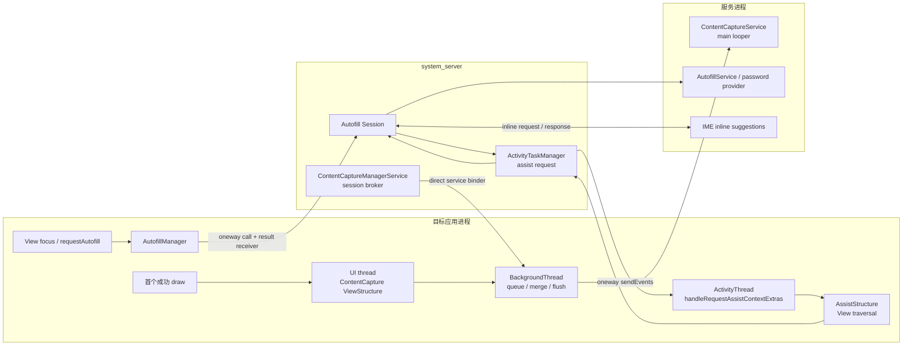

# 7.20 ContentCaptureService 与 Autofill 性能影响

ContentCapture 与 Autofill 都会读取 View 的结构化信息，却使用不同的触发条件、数据模型和进程路径。平台源码锚点为 Android 17 / API 37、`android-17.0.0_r1`。两条链路与密码管理器、IME、WebView 同时出现时，需要分别归因。

## 三个容易混在一起的数据模型

分析前应区分三类对象：

| 框架 | 主要数据对象 | 生成方式 | 常见消费者 |
|---|---|---|---|
| Accessibility | `AccessibilityEvent`、`AccessibilityNodeInfo` | 事件上报；服务按需查询节点 | TalkBack、Switch Access、自动化工具 |
| ContentCapture | `ContentCaptureEvent`、轻量 `ViewNode` / `ViewStructure` | 初始结构报告；View 出现、消失、文本变化等增量事件 | 系统选择并允许的 ContentCaptureService |
| Autofill | `AssistStructure`、`FillRequest` | Autofill 会话触发后采集应用窗口结构 | AutofillService、密码管理器、Credential Manager 相关提供方 |

ContentCapture 的常规采集不依赖 `AccessibilityEvent`，也不会为每个增量变化重新创建完整 `AssistStructure`。Autofill 的结构快照则由 `AssistStructure` 承载。把三者统称为“无障碍全树扫描”，会把触发者、线程和优化入口全部混淆。

下面的图展示 Android 17 中 ContentCapture 与 Autofill 的主要方向。



ContentCapture 的会话由 `system_server` 协调，事件批次随后通过服务提供的 direct Binder 发送。Autofill 的结构请求则从 `system_server` 返回应用主线程采集，再送到提供方。两条链可以出现在同一时间窗口，不能因此认定它们重复采集了同一个结构。

## ContentCapture：初始 UI 遍历与后台事件管线

### `system_server` 负责会话，事件直送服务

Activity 创建时，`ContentCaptureManager` 通过 `IContentCaptureManager.startSession()` 向 `ContentCaptureManagerService` 建立会话。该 AIDL 接口是 `oneway`，结果通过 `IResultReceiver` 返回。服务端完成权限、用户、组件和 allowlist 检查后，把 `IContentCaptureDirectManager` Binder 交给应用。

后续事件不必逐批经过 `system_server`。`MainContentCaptureSession` 调用 direct interface 的 `sendEvents()`，把 `ParceledListSlice<ContentCaptureEvent>` 直接发往 ContentCaptureService；这个接口同样是 `oneway`。

`oneway` 表示发送方不等待服务回调结束，应用仍要创建事件、复制文本、写 Parcel 并把 transaction 放入 Binder。服务过慢还会消耗异步 Binder 配额和系统 CPU，不能把异步调用理解成免费调用。

### 初始结构生成仍在 UI 线程

Android 17 的 `ViewRootImpl` 在首个成功 draw 之后执行一次 `performContentCaptureInitialReport()`。它调用根 View 的 `dispatchInitialProvideContentCaptureStructure()`，随后由 `ViewGroup.dispatchProvideContentCaptureStructure()` 遍历可采集的子节点。每个节点通过 `onProvideContentCaptureStructure()` 填充结构。

这段工作位于应用 UI 线程，并且仍处在 ViewRoot 的一次 traversal 路径中。自定义 View 若在回调里访问磁盘、数据库、网络，或临时解析大对象，会直接延长这次主线程任务。

遍历范围受 `importantForContentCapture` 与 View 的启发式判断影响。`no` 仅排除当前节点，子节点仍可能被访问；`noExcludeDescendants` 才表达整棵子树都不参与采集。父节点使用 exclude-descendants 模式后，子节点的显式设置也无法恢复该子树。

### 后续变化按 traversal 批量转交

View 的出现、消失和交互变化会先记录在 `AttachInfo`。`ViewRootImpl` 在 traversal 收尾调用 `notifyContentCaptureEvents()`，主会话再在 UI Handler 上准备对应 `ViewStructure`。完成 View 属性读取后，事件进入应用进程的 `BackgroundThread`：

- `ConcurrentLinkedQueue` 接收来自不同线程的事件；
- 文本 composing 事件可与同一节点的待发事件合并；
- 连续的 disappeared 事件可合并为一个带多个 ID 的事件；
- buffer 达到 `maxBufferSize`、会话边界、显式 flush、idle timeout 或 text-change timeout 时发送；
- 批次通过 direct `oneway` Binder 进入 ContentCaptureService。

因此，ContentCapture 的性能要分成 UI 线程的 ViewStructure 准备，以及后台线程的事件合并、Parcel 和 Binder 发送。只观察其中一侧会漏掉责任位置。

### 服务回调运行在服务主线程

`ContentCaptureService` 的 direct Binder stub 收到批次后，把消息投递到服务进程的 main looper，再逐个调用 `onContentCaptureEvent()`。服务在回调中做大规模解析、同步 I/O 或模型推理，会让自己的事件队列延迟。由于应用侧使用 oneway，这类积压通常表现为服务处理滞后、异步 Binder 压力或系统 CPU 增长，不等同于应用等待服务方法返回。

ContentCapture 也没有跨设备通用的结构大小或耗时阈值。节点字段、文本长度、虚拟层级、更新频率、服务 options 和设备 CPU 都会改变结果；“500 个 View 固定需要 30–100 ms”一类数字缺少可迁移性。

## Autofill：会话等待、AssistStructure 与提供方响应

### 焦点进入才是常见入口

标准 View 在获得焦点时会间接调用 `AutofillManager.notifyViewEntered()`。自定义控件也可以由用户动作触发 `requestAutofill()`。Autofill 并不会在每次 View 树构建完成后自动采集完整结构。

`IAutoFillManager` 在 Android 17 中是 `oneway` 接口，但 `AutofillManager` 的 `addClient()` 和 `startSession()` 会携带 `SyncResultReceiver`，客户端等待会话结果，超时常量为 5000 ms。焦点事件通常来自 UI 线程，所以 trace 中若出现 `SyncResultReceiver` 等待，需要沿 Binder flow 检查 `system_server` 的 Autofill 会话创建。

这个 5000 ms 是失败保护上限，不能当作正常延迟。接口契约也无法推出“每次 Binder 约 5–10 ms”之类的固定耗时。

### AssistStructure 在应用主线程采集

Autofill Session 需要新响应时，经 `ActivityTaskManager.requestAutofillData()` 请求应用提供 assist data。应用的 `ActivityThread.handleRequestAssistContextExtras()` 在主线程创建 `AssistStructure`。其构造过程枚举 Activity 的 ViewRoot，并调用根 View 的 `dispatchProvideAutofillStructure()`：

1. `View.onProvideAutofillStructure()` 写入资源 ID、尺寸、可见性、autofill type、hints、value 等字段；
2. `View.onProvideAutofillVirtualStructure()` 允许 WebView、自绘控件等暴露虚拟节点；
3. `ViewGroup` 选择需要进入结构的子节点并递归采集；
4. `ActivityThread` 记录 acquisition start/end，再把结构的传输通道报告给 `system_server`。

普通节点回调与应用 UI 工作共享线程。虚拟层级还可以通过 `asyncNewChild()` / `asyncCommit()` 异步完成；`AssistStructure.waitForReady()` 最多等待 5000 ms，仍未提交时会放弃该结构。

### 大结构采用分段传输

`AssistStructure` 没有假定整个对象必须塞进一次 Binder transaction。Android 17 的 `ParcelTransferWriter` 在 Parcel 超过 `IBinder.MAX_IPC_SIZE` 后写入 continuation token，接收方再请求下一段。`Session.AssistDataReceiver` 调用 `ensureDataForAutofill()` 拉取全部数据，建立 `FillContext` 后创建 `FillRequest`。

分段传输避免单次 transaction 直接撞上 IPC 大小边界，却没有消除遍历、字段复制、序列化、反序列化和多次 Binder 往返。报告应记录本次结构的 window 数、node 数、文本规模、采集时长和分段次数，避免套用“中等页面 1–5 MB”这类固定估计。

### 密码管理器与 IME 不会各扫一遍树

用户选择的 AutofillService 常由密码管理器提供。IME inline suggestions 是展示 Autofill 数据集的一种界面路径：Autofill Session 向 IME 获取 `InlineSuggestionsRequest`，把它随 FillRequest 交给提供方，再将 inline response 送回 IME。

这组协作会增加 system_server、提供方、IME 和渲染服务之间的 IPC 与等待，也可能与键盘显示动画重叠。它不会要求 IME 独立创建第二份 AssistStructure。Android 17 的主、次提供方路径也可以复用现有 `FillContext`；有几个提供方不能直接换算成几轮应用 View 遍历。

IME 自身的启动、`InputConnection` 与窗口动画问题见 [3.6 InputMethodManager 性能影响](../../part1-fundamentals/ch03-input/06-input-method-manager-performance.md)。Binder 等待与异步预算可结合 [1.4 Binder IPC](../../part1-fundamentals/ch01-architecture/04-binder.md) 继续分析。

## 把成本按线程和进程拆开

| 位置 | ContentCapture | Autofill | trace 中的表现 |
|---|---|---|---|
| 应用 UI 线程 | 初始结构遍历；动态节点的 ViewStructure 准备 | 会话结果等待；AssistStructure 遍历 | frame/traversal 延长、主线程 waiting 或 Runnable |
| 应用后台线程 | 事件合并、buffer、Parcel、direct Binder | 通常不负责标准 View 的 AssistStructure 遍历 | BackgroundThread CPU、Binder transaction |
| `system_server` | 会话、allowlist、服务连接 | Session、assist request、FillContext、IME 协调 | Autofill/ATM handler、Binder、锁与调度 |
| ContentCaptureService | 主线程逐个处理增量事件 | 无 | 服务 main looper 积压 |
| AutofillService / 密码提供方 | 无 | 解析 FillRequest、产生 dataset、认证 | provider CPU/I/O、response latency |
| IME | 无 | inline request、展示与交互 | IME main/render、窗口动画 |

应用 UI 线程出现一次长 traversal 时，要先确认是 ContentCapture 初始报告还是 Autofill assist request。后台 `sendEvents()` 变长，则应检查事件批次、Parcel 与 Binder 异步压力。提供方响应慢但 App frame 正常时，用户看到的是建议出现晚，不能记成应用渲染卡顿。

## 应用侧结构设计

### 让登录字段保留明确语义

下面的 XML 为登录字段提供稳定 hints，并把纯装饰图从两套结构中排除。

```xml
<LinearLayout
    android:layout_width="match_parent"
    android:layout_height="wrap_content"
    android:orientation="vertical">

    <ImageView
        android:layout_width="match_parent"
        android:layout_height="96dp"
        android:importantForAutofill="no"
        android:importantForContentCapture="no"
        android:src="@drawable/login_decoration" />

    <EditText
        android:id="@+id/username"
        android:layout_width="match_parent"
        android:layout_height="wrap_content"
        android:autofillHints="username"
        android:importantForAutofill="yes"
        android:inputType="textEmailAddress" />

    <EditText
        android:id="@+id/password"
        android:layout_width="match_parent"
        android:layout_height="wrap_content"
        android:autofillHints="password"
        android:importantForAutofill="yes"
        android:inputType="textPassword" />
</LinearLayout>
```

`autofillHints` 帮助提供方稳定识别字段，不能把它解释成系统跳过结构采集的性能开关。需要填充的用户名、密码、地址和银行卡字段不应为了缩小结构而设为 `no`。

当整块 UI 都没有可填充字段或可采集内容时，可以在容器上评估 `noExcludeDescendants`。ContentCapture 会据此剪掉子树，也会让其中后续新增的有效内容不可见。Autofill 的同名模式表达相同意图，但请求 flags 和系统 options 仍可能要求包含更多节点；组件复用和动态页面必须覆盖回归测试。

Android 14 / API 34 之后，Autofill 的 importance 还会与 View 属性、请求 flags 和系统 options 一起决定触发与结构包含。手动请求、compat mode、PCC detection 或设备配置可能包含原本标记为不重要的节点。`importantForAutofill` 是语义提示，不能承诺每种请求模式都缩小相同数量的节点。

### 保持结构回调纯内存

`onProvideAutofillStructure()`、`onProvideAutofillVirtualStructure()` 与 `onProvideContentCaptureStructure()` 应只读取已准备好的 UI 状态。以下工作应移出回调：

- 数据库、文件、网络和跨进程查询；
- 为描述临时解码图片或解析整份文档；
- 对全量业务集合排序、去重或格式转换；
- 等待锁、Future、主线程之外的渲染进程；
- 每次回调重新构造不变的 hints、资源映射和长文本。

对自绘或虚拟层级，保持 AutofillId 稳定，只报告当前可交互且语义完整的节点。ContentCapture 的多个虚拟节点可用 `notifyViewsAppeared()` / `notifyViewsDisappeared()` 批量报告；Autofill 的异步虚拟节点必须在时限内 `asyncCommit()`。批量 API 减少调用次数，节点是否需要报告仍由产品语义决定。

### 避免重复触发

标准 TextView、EditText 与常见 View 已接入 Autofill 和 ContentCapture。自定义组件在以下情况下才需要补充通知：

- 虚拟节点进入、离开或值改变；
- 自绘文本发生用户可感知的语义变化；
- 用户明确选择“自动填充”操作；
- 子 ContentCaptureSession 的上下文发生切换。

不要在每次 `onDraw()`、动画帧或无值变化的 bind 中调用 `requestAutofill()`、`notifyValueChanged()` 或 ContentCapture 文本通知。焦点来回抖动也会产生会话更新、结构请求或 UI 显示隐藏。

`ContentCaptureManager.getContentCaptureConditions()` 使用带超时的结果接收器查询系统服务。浏览器可按 URL 条件决定是否上报虚拟页面，但不能把这项查询放进每帧路径。

## 隐私边界也会改变性能路径

ContentCaptureService 需要声明 `android.permission.BIND_CONTENT_CAPTURE_SERVICE`，该绑定权限由系统控制；Android 14 没有面向普通应用的 `CAPTURE_CONTENT` 运行时授权流程。Android 17 平台也不存在 `RedactionRule` / `ContentCaptureContext.addRedactionRule()` API。

Android 17 / API 37 把 `ContentCaptureManager.setContentCaptureEnabled()` 标记为 deprecated。目标 SDK 37 及以上时，该调用可以成为 no-op；平台文档要求敏感窗口使用 `WindowManager.LayoutParams.FLAG_SECURE` 退出 content capture。`FLAG_SECURE` 还会限制截图和非安全显示，适合安全需求明确的窗口，不应用作临时性能开关。

更细的页面控制仍可使用 `importantForContentCapture`。Autofill 则有独立的敏感数据处理与用户选择的 provider 信任边界。密码字段若需要密码管理器填充，应保留 Autofill 结构并依赖框架的敏感值清理，不要同时用 ContentCapture 设置替代 Autofill 设置。

## WebView 与跨框架页面

WebView 可以通过 `onProvideAutofillVirtualStructure()` 向 Autofill 暴露 HTML 虚拟节点，也可以通过 ContentCaptureSession 报告虚拟页面内容。它没有统一“绕过系统 Autofill”的行为。

同一 WebView 同时参与两条管线时，成本可能包含：

- Autofill 会话触发的一次 AssistStructure 与虚拟节点构建；
- ContentCapture 初始结构及后续增量事件；
- WebView 渲染进程准备虚拟语义数据；
- provider、IME 与 ContentCaptureService 各自的处理。

是否发生重复计算取决于 WebView 版本与实现。应同时记录 WebView provider 版本、页面 DOM 规模、虚拟节点数、目标字段、ContentCapture conditions 和 Autofill request ID，再从 trace 判断哪条链占用 UI 线程。

## 观测与复现

### Perfetto 中使用源码存在的标记

采集时打开 `view`、`am`、`wm` atrace 类别，并启用 app、`system_server`、provider、IME 的线程调度与 Binder 数据。Android 17 源码中可直接对应的 slice 包括：

- `dispatchContentCapture() for ...`：ViewRoot 初始 ContentCapture 遍历；
- `flushContentCapture for ...`：窗口获得焦点后的 flush；
- `sendEventAsync`：ContentCapture view-tree 事件从开始到结束的异步区间；
- `notifyContentCaptureEvents`：应用 BackgroundThread 处理动态事件；
- `handleRequestAssistContextExtras`：应用主线程构建 Autofill AssistStructure 的入口。

`android.content_capture.request`、`android.content_capture.process`、`android.autofill.request` 和 `android.autofill.process` 不是 Android 17 AOSP 在这些类里定义的标准 slice。设备若出现同名标记，应确认是厂商、provider 或应用自行添加。

### dumpsys 确认服务与会话

下面的命令用于确认当前设备上两套服务的启用状态、会话和配置，输出字段会随厂商 build 改变。

```bash
adb shell dumpsys content_capture
adb shell dumpsys autofill
```

`dumpsys` 适合回答“哪个服务、哪个 session、哪些 options”。它不能替代帧时间、线程 slice、Binder flow 和结构规模。涉及账号、字段、组件或采集条件的输出可能含敏感信息，分享前要脱敏。

### 一轮可复核的 A/B

在受控测试用户和固定 provider 版本下，保持设备温度、刷新率、页面数据、IME、账号和输入脚本一致，至少采集：

1. 页面进入但不聚焦 Autofill 字段；
2. 聚焦字段并等待 provider 建议；
3. 开启与关闭 IME inline suggestions 的相同操作；
4. ContentCapture 服务允许该页面与不允许该页面的相同操作；
5. 删除回调内昂贵工作或缩小无关虚拟子树后的版本。

每组记录 App frame、主线程 `handleRequestAssistContextExtras`、ContentCapture 初始 slice、BackgroundThread、AssistStructure acquisition 时间、provider 首个响应和 IME 建议出现时间。不要在用户日常设备上随意关闭密码管理器、辅助服务或内容采集组件。

## 归因检查表

| 现象 | 需要补充的证据 | 可能的修复位置 |
|---|---|---|
| 首屏 draw 后主线程长任务 | `dispatchContentCapture()`、节点数、回调栈 | App 自定义 ContentCapture structure、无关子树 |
| 聚焦输入框时主线程 waiting | Autofill startSession、result receiver、system_server flow | Autofill Session、system_server 锁或调度 |
| 主线程执行大量结构回调 | `handleRequestAssistContextExtras`、request ID、virtual nodes | App View/WebView/custom provider |
| 应用 BackgroundThread CPU 高 | ContentCapture queue、flush reason、batch size、文本长度 | App 事件频率、虚拟节点报告 |
| 密码建议出现晚但帧正常 | provider response、IME inline request、render service | AutofillService、IME 或 inline 渲染 |
| ContentCaptureService 事件积压 | 服务 main looper、每事件处理时间、I/O | ContentCaptureService 实现 |
| 大结构出现多段 Binder | window/node/文本规模、partial transfer 日志 | App 结构设计、虚拟层级、字段体积 |

性能报告至少写明触发字段、request/session ID、目标线程、provider/IME/WebView 版本和结构规模。只写“开启密码管理器后变慢”，无法区分会话等待、结构遍历、服务响应和建议 UI。

## Android 8—17 版本边界

- **Android 8.0 / API 26**：Autofill Framework 与 `importantForAutofill` 进入公开 API。
- **Android 10 / API 29**：ContentCaptureManager、ContentCaptureSession 与 ContentCaptureService 进入公开 API。
- **Android 11 / API 30**：`importantForContentCapture` 与 IME inline suggestions 相关公开 API 可用。
- **Android 14 / API 34**：Autofill 对 importance、其他 View 属性和优化选项的组合判断发生变化，不能沿用早期版本的固定包含规则。
- **Android 17 / API 37**：按 `android-17.0.0_r1` 核对。ContentCapture 使用 UI 结构准备、应用 BackgroundThread 缓冲和 direct oneway Binder；Autofill 仍通过 ActivityThread 构建 AssistStructure。`setContentCaptureEnabled()` 在 API 37 deprecated，目标 SDK 37+ 应按 `FLAG_SECURE` 契约处理敏感窗口。

这些路径属于 framework 与应用/服务进程，不需要 `android17-6.18-2026-06_r6` kernel tag 才能解释。Binder driver、调度和内存压力可以影响时延，但这里没有引入 Android 17 kernel 专属机制。

## 源码与资料

- [`ContentCaptureManager.java`](https://android.googlesource.com/platform/frameworks/base/+/android-17.0.0_r1/core/java/android/view/contentcapture/ContentCaptureManager.java)、[`MainContentCaptureSession.java`](https://android.googlesource.com/platform/frameworks/base/+/android-17.0.0_r1/core/java/android/view/contentcapture/MainContentCaptureSession.java) 与 [`IContentCaptureDirectManager.aidl`](https://android.googlesource.com/platform/frameworks/base/+/android-17.0.0_r1/core/java/android/view/contentcapture/IContentCaptureDirectManager.aidl)：会话、后台队列、事件合并、flush 与 direct oneway Binder。
- [`View.java`](https://android.googlesource.com/platform/frameworks/base/+/android-17.0.0_r1/core/java/android/view/View.java)、[`ViewGroup.java`](https://android.googlesource.com/platform/frameworks/base/+/android-17.0.0_r1/core/java/android/view/ViewGroup.java) 与 [`ViewRootImpl.java`](https://android.googlesource.com/platform/frameworks/base/+/android-17.0.0_r1/core/java/android/view/ViewRootImpl.java)：两套 structure 回调、importance、初始报告、动态事件与 AOSP trace slice。
- [`ContentCaptureManagerService.java`](https://android.googlesource.com/platform/frameworks/base/+/android-17.0.0_r1/services/contentcapture/java/com/android/server/contentcapture/ContentCaptureManagerService.java) 与 [`ContentCaptureService.java`](https://android.googlesource.com/platform/frameworks/base/+/android-17.0.0_r1/core/java/android/service/contentcapture/ContentCaptureService.java)：会话代理、direct service Binder 与服务 main-looper 回调。
- [`AutofillManager.java`](https://android.googlesource.com/platform/frameworks/base/+/android-17.0.0_r1/core/java/android/view/autofill/AutofillManager.java) 与 [`IAutoFillManager.aidl`](https://android.googlesource.com/platform/frameworks/base/+/android-17.0.0_r1/core/java/android/view/autofill/IAutoFillManager.aidl)：焦点触发、会话状态、oneway 调用与结果接收器等待。
- [`ActivityThread.java`](https://android.googlesource.com/platform/frameworks/base/+/android-17.0.0_r1/core/java/android/app/ActivityThread.java) 与 [`AssistStructure.java`](https://android.googlesource.com/platform/frameworks/base/+/android-17.0.0_r1/core/java/android/app/assist/AssistStructure.java)：主线程采集、虚拟节点等待与分段 Binder 传输。
- [`Session.java`](https://android.googlesource.com/platform/frameworks/base/+/android-17.0.0_r1/services/autofill/java/com/android/server/autofill/Session.java) 与 [`AutofillInlineSuggestionsRequestSession.java`](https://android.googlesource.com/platform/frameworks/base/+/android-17.0.0_r1/services/autofill/java/com/android/server/autofill/AutofillInlineSuggestionsRequestSession.java)：assist request、FillContext、provider 与 IME inline suggestions 协作。
- [Autofill 优化指南](https://developer.android.com/identity/autofill/autofill-optimize)、[View API](https://developer.android.com/reference/android/view/View) 与 [ContentCaptureManager API](https://developer.android.com/reference/android/view/contentcapture/ContentCaptureManager)：公开属性、版本行为与 API 37 弃用边界。
