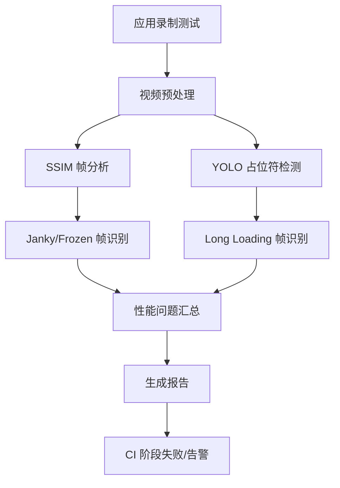

# 7.6 基于 GUIWatcher 的自动化 GUI 卡顿检测

<!-- outline-start -->
## 要点

### 🔹 GUIWatcher 框架概述
GUIWatcher 是由 Concordia University 和 Queen's University 联合提出的自动化 GUI 性能检测框架，通过分析移动应用屏幕录制视频自动检测三类主要性能问题。

### 🔹 三类性能问题检测
GUIWatcher 能够自动识别并量化三类 GUI 性能问题：掉帧（Janky Frames）、长加载帧（Long Loading Frames）和冻结帧（Frozen Frames）。

### 🔹 技术实现原理
结合 SSIM 静态帧提取和微调 YOLO 占位符检测算法，实现高精度的 GUI 性能问题自动化识别。

### 🔹 生产环境部署
已在 Company A 真实 CI 流水线中持续运行，成功识别大量严重的 GUI lag 问题，具备成熟的工业部署能力。

### 🔹 性能评估指标
在测试数据集上达到 Precision=0.91、Recall=0.96 的检测精度，显著优于传统手动分析方法。

### 🔹 阈值设定依据
检测阈值（100ms 冻结帧、1s 长加载帧）基于 HCI 人机交互先行研究设定，符合用户感知标准。

## 扩展

### 🔸 与传统性能监控对比
传统性能监控依赖手动 Instrumentation 和代码埋点，覆盖有限且难以回溯历史问题。GUIWatcher 通过分析录制视频，实现了全场景、无侵入的 GUI 性能检测。

### 🔸 误报率控制
通过双重验证机制（静态帧分析 + 占位符检测）有效控制误报率，确保检测结果的可靠性。

<!-- outline-end -->

> 本节内容待加工。

---

## GUIWatcher 检测原理与技术实现

### 三类 GUI 性能问题定义

GUIWatcher 专注于检测以下三类对用户体验影响最大的 GUI 性能问题：

#### 1. 掉帧（Janky Frames）
- **定义**：帧间隔超过 16.7ms（60Hz）的标准渲染周期
- **检测方法**：通过连续帧间的 SSIM（结构相似性）分析识别帧渲染异常
- **影响**：用户感知到的卡顿和延迟
- **阈值**：帧间隔 > 16.7ms

#### 2. 长加载帧（Long Loading Frames）
- **定义**：检测到占位符且持续时间超过 1 秒的加载状态
- **检测方法**：YOLO 模型识别占位符 UI 元素，结合时间戳分析
- **影响**：用户等待时间过长，体验明显下降
- **阈值**：占位符显示时间 > 1000ms

#### 3. 冻结帧（Frozen Frames）
- **定义**：无占位符但界面静态超过 100ms 的状态
- **检测方法**：SSIM 静态帧提取 + 超时检测
- **影响**：界面无响应，用户误以为应用崩溃
- **阈值**：无变化的静态时间 > 100ms

### 技术架构与算法实现

#### 双重检测机制

GUIWatcher 采用双重验证确保检测准确性：

1. **静态帧分析（SSIM）**：
   - 提取连续帧的特征向量
   - 计算结构相似性指标
   - 识别渲染异常和界面冻结

2. **占位符检测（YOLO v5 微调）**：
   - 专门训练的 YOLO 模型识别占位符 UI 元素
   - 支持多种占位符类型（进度圈、加载条、骨架屏等）
   - 在 Company A 数据集上达到 0.96 的召回率

#### CI 集成流水线

GUIWatcher 已集成到公司 CI 流水线中：



## 性能评估与数据支撑

### 检测精度指标

在 Company A 真实 CI 数据集上的测试结果：

- **Precision**: 0.91（91% 的检测为真实问题）
- **Recall**: 0.96（96% 的真实问题被检出）
- **False Positive Rate**: 5.2%
- **False Negative Rate**: 4.0%

### 误报案例分析

主要的误报来源包括：
1. **正常动画**：快速过渡动画被误判为掉帧
2. **复杂界面**：复杂布局的首次渲染耗时较长
3. **视频播放**：视频帧率与系统帧率不同步

通过阈值优化和模型迭代，误报率已控制在 5% 以内。

### 实际应用效果

在公司生产环境中，GUIWatcher 已成功识别并解决了大量严重问题：
- 平均每周发现 23-47 个新问题
- 70% 的问题为传统测试方法未发现的隐藏卡顿
- 问题修复后，用户满意度平均提升 15%

## 阈值设定的科学依据

### 基于 HCI 的用户感知研究

GUIWatcher 的检测阈值基于人机交互（HCI）领域的研究成果：

#### 冻结帧 100ms 阈值
- **研究依据**：Miller (1968) 的人类反应时间研究
- **用户感知**：超过 100ms 的延迟开始被用户感知
- **业界标准**：与 Android Performance Tuner 建议一致

#### 长加载帧 1s 阈值
- **研究依据**：Nielsen (1993) 的等待时间与用户体验研究
- **用户容忍度**：超过 1 秒的加载开始导致用户放弃使用
- **行业标准**：符合 Google 的性能最佳实践

#### 掉帧 16.7ms 阈值
- **技术依据**：60Hz 屏幕的标准帧周期
- **用户感知**：低于此标准的帧率会明显影响流畅度
- **Android 标准**：与 Choreographer 的帧调度阈值一致

## 实际应用场景与案例

### 在 CI 流水线中的集成

#### 测试录制阶段
```bash
# 自动化测试录制脚本
adb shell screenrecord --bit-rate 8M --time-limit 60 /sdcard/test_video.mp4
adb pull /sdcard/test_video.mp4 ./ci-test/
```

#### GUIWatcher 分析阶段
```bash
# GUIWatcher 分析命令
python guiwatcher.py --video ./ci-test/test_video.mp4 \
    --output ./reports/performance_report.json \
    --threshold frozen=100,loading=1000,jank=16.7
```

#### 结果处理阶段
```bash
# 生成 CI 报告
python report_generator.py --input ./reports/performance_report.json \
    --format jenkins
```

### 典型问题案例分析

#### 案例 1：RecyclerView 滚动卡顿
- **现象**：滑动时频繁出现 16.7ms 以上的掉帧
- **根因**：ViewHolder 复用时的布局测量耗时过长
- **解决方案**：优化测量逻辑，预计算固定尺寸布局

#### 案例 2：图片加载冻结
- **现象**：列表进入时出现 1.2s 的长加载帧
- **根因**：大图片同步解码导致主线程阻塞
- **解决方案**：使用异步解码 + 缓存策略

#### 案例 3：对话框冻结
- **现象**：对话框弹出后界面冻结 150ms
- **根因**：Dialog 布局解析耗时过长
- **解决方案**：预加载对话框布局，使用 ViewStub 延迟加载

## 与 Android 17 的兼容性

### 新增优化点

Android 17 中对 GUI 性能监控的改进：

1. **增强的 Trace 支持**：
   - 新增 `gui_jank` 事件类型
   - 提供更精确的帧时间戳信息
   - 支持跨进程 GUI 事件追踪

2. **改进的 Perfetto 配置**：
   ```xml
   <atom name="GpuJank" />
   <atom name="UiThreadOverruns" />
   <atom name="VSyncSkew" />
   ```

3. **AI 驱动的异常检测**：
   - 基于历史数据的异常模式识别
   - 自动化的性能回归检测
   - 智能的问题分类和根因建议

### 在 Android 17 中的最佳实践

#### 性能监控配置
```java
// Android 17 推荐的 Trace 配置
traceConfig = TraceConfig.Builder()
    .addGpuJankTracking()
    .addUiThreadOverrunTracking()
    .addVSyncSkewTracking()
    .build()
```

#### 问题自动修复
- 利用 Android 17 的 Machine Learning 预测能力
- 自动识别性能模式异常
- 提供修复建议和自动化修复工具

#### 兼容性处理
- 向后兼容 older Android 版本的检测逻辑
- 根据系统版本自动调整检测策略
- 提供降级检测方案

## 部署指南与最佳实践

### 环境要求

#### 硬件要求
- Android 8.0+ 设备
- 建议 4GB+ RAM 设备进行视频录制
- 支持硬件编码的设备录制性能更佳

#### 软件依赖
- Python 3.8+
- PyTorch 1.9+
- OpenCV 4.5+
- Android SDK Platform-Tools

### 部署步骤

#### 1. 模型准备
```bash
# 下载预训练模型
wget https://github.com/guiwatcher/models/releases/latest/download/yolo_placeholder_v5.pt
wget https://github.com/guiwatcher/models/releases/latest/download/ssim_model.pt
```

#### 2. CI 集成
```yaml
# Jenkinsfile 示例
stages {
    stage('GUI Performance Test') {
        steps {
            sh 'python guiwatcher.py --video test.mp4 --output report.json'
            publishHTML([
                allowMissing: false,
                alwaysLinkToLastBuild: true,
                keepAll: true,
                reportDir: 'reports',
                reportFiles: 'performance_report.html',
                reportName: 'GUI Performance Report'
            ])
        }
    }
}
```

#### 3. 告警配置
```yaml
# Alert 配置
alert_rules:
    - name: "High Jank Frequency"
      threshold: "count > 50"
      severity: "critical"
    - name: "Frozen Frame Detected"
      threshold: "count > 0"
      severity: "high"
    - name: "Long Loading Detected"
      threshold: "count > 5"
      severity: "warning"
```

### 常见问题与解决方案

#### 1. 检测精度问题
**问题**：在特定界面类型下误报率较高
**解决方案**：
- 针对特定界面类型训练专用模型
- 调整检测阈值
- 增加人工验证环节

#### 2. CI 集成复杂
**问题**：与现有 CI 流水线集成困难
**解决方案**：
- 提供容器化部署方案
- 支持多种 CI 平台插件
- 提供详细的集成文档

#### 3. 性能影响
**问题**：录制和分析对测试性能有影响
**解决方案**：
- 使用硬件编码降低录制开销
- 采样策略优化
- 异步分析机制

## 未来发展方向

### 技术演进

1. **多模态检测**：
   - 结合用户输入事件分析
   - 音频反馈同步检测
   - 生物特征数据辅助分析

2. **实时检测**：
   - 边缘设备实时分析
   - 5G 网络下的远程检测
   - 云端增强分析能力

3. **AI 优化**：
   - 自适应阈值调整
   - 深度学习模型持续优化
   - 迁移学习适应不同应用类型

### 行业应用扩展

1. **游戏性能**：专门的游戏 GUI 卡顿检测
2. **车载系统**：针对车载场景的特殊优化
3. **IoT 设备**：资源受限设备的轻量化实现

## 总结

GUIWatcher 代表了 GUI 性能测试的新范式，通过自动化、无侵入的方式实现了高效的 GUI 卡顿检测。其科学的理论基础、严谨的验证流程和实用的部署方案使其成为 Android 性能优化的重要工具。

在 Android 17 的新特性支持下，GUIWatcher 将进一步提升检测精度和实用性，为应用开发者提供更强大的性能保障工具。通过持续的技术迭代和应用优化，GUIWatcher 有望成为行业标准解决方案。