# 响应速度原理、场景与案例

响应速度从用户动作开始，到可感知反馈出现为止。指标必须先定义起点、终点和线程边界，再判断延迟来自主线程工作、异步依赖、IPC、I/O 还是调度。

## 交互起止点、等待类型与感知阈值

### 响应速度要量哪一段

响应速度描述从用户操作到界面出现可见反馈所经历的延迟。真正测量时，还需要明确起点、终点，以及这次交互以按下、抬手还是业务结果为完成标志。

以同一个按钮为例，至少有两种合理的测量口径：

- 按压反馈：从 `ACTION_DOWN` 的事件时间开始，到包含按钮按下状态的帧实际呈现为止。
- 点击结果：从 `ACTION_UP` 的事件时间开始，到包含操作结果的帧实际呈现为止。Android 的普通 `View` 通常在抬手后才确认点击，因此不宜从 `ACTION_DOWN` 计算业务完成时间。

拖动和滚动需要使用另一种口径：逐个考察输入样本与对应画面更新之间的 event-to-photon（事件采样到画面发光）延迟，并观察整段手势中的延迟分布是否稳定。只记录“手指开始移动到列表开始滚动”，会漏掉手势中段偶发的延迟波动。

常用场景与测量端点如下：

| 场景 | 建议起点 | 建议终点 | 容易误读的信号 |
| --- | --- | --- | --- |
| 按压态 | `ACTION_DOWN.eventTime` | 按下态帧的呈现时间 | `onTouchEvent()` 返回只说明事件处理结束 |
| 点击导航 | `ACTION_UP.eventTime` | 目标界面第一帧或约定反馈帧 | Activity 创建完成不代表画面已经呈现 |
| 拖动、滚动 | 每个运动样本的事件时间 | 消费该样本的帧呈现时间 | 一个批处理事件可能包含多个 historical sample（历史采样点） |
| 应用启动 | 系统接收启动请求 | TTID 或 TTFD | TTID 只到首帧，与“内容可交互”含义不同 |
| 长任务 | 用户确认操作 | 进度反馈帧与业务完成点 | 只量业务耗时会漏掉反馈延迟 |

TTID（Time to Initial Display）表示从启动请求到首帧显示，TTFD（Time to Full Display）表示从启动请求到应用报告内容已经完整呈现。二者分别描述首帧和完整可用状态，不能互相替代。

`MotionEvent.getEventTimeNanos()` 接近输入样本的时间基准，但不等同于手指接触屏幕玻璃的物理时刻。帧的 present 信号也不表示面板像素已经完成发光。若要测量实验室级 touch-to-photon（触摸到画面发光）延迟，需要高速相机、光电传感器或厂商显示链路 trace；普通应用采集的 Perfetto 更适合定位软件路径中的耗时阶段。

### RAIL 在 Android 中怎样使用

[RAIL](https://web.dev/articles/rail) 是 Web 性能模型，名称来自 Response、Animation、Idle、Load 四类工作预算。它可以帮助 Android 团队讨论用户对等待的感受，但其中的数值来自浏览器环境，不能直接替代 Android 帧期限、Android Vitals 或产品实测基线。

| RAIL 项 | Web 文档口径 | Android 中可借鉴的做法 | 不应照搬的部分 |
| --- | --- | --- | --- |
| Response | 输入后 100 ms 内响应 | 为交互设定可见反馈的长尾延迟目标 | 100 ms 不是 Android API 或 ANR 的硬阈值 |
| Animation | Web 主线程约 10 ms 产出一帧 | 以 FrameTimeline 的 expected deadline 判断是否按时 | 10 ms 预留了浏览器渲染时间，不能当作 Android 通用帧预算 |
| Idle | 空闲任务分块，每块不超过约 50 ms | 将可延后的工作切片，并允许高优先级交互抢占 | 50 ms 的主线程任务仍可能跨过多个高刷新率帧期限 |
| Load | 首次可交互约 5 s、后续约 2 s | 区分首屏反馈与完整可用状态 | Web 网络条件下的 load 目标不等于 Android 启动告警 |

Android 动画和滚动应以系统为当前帧分配的 deadline（截止时间）为准。60 Hz 屏幕的刷新周期约为 16.67 ms，120 Hz 约为 8.33 ms；留给应用 CPU 的时间通常更少，因为 RenderThread、GPU、SurfaceFlinger 和显示提交还要继续工作。从 Android 12（API 31）开始，Perfetto FrameTimeline 会同时给出 expected timeline（预期时序）和 actual timeline（实际时序），直接比较二者比套用固定的 16 ms 更可靠。

支持 Adaptive Refresh Rate（ARR，自适应刷新率）的设备还会动态改变刷新节奏。ARR 要求设备实现相应 HAL，并运行 Android 15 QPR1 或更高版本。Android 16 增加了 `Display.hasArrSupport()` 和 `Display.getSuggestedFrameRate(int)` 等查询能力。解释数据时仍需结合当前帧率、应用请求的帧率和 FrameTimeline，不能假设设备始终以最高刷新率运行。

### Android 17 的触摸到显示路径

本节以 `android-17.0.0_r1` 为平台源码基线。涉及内核调度、IRQ（硬件中断请求）和驱动时，以 `android17-6.18-2026-06_r6` 为内核基线；普通应用层阻塞不依赖 Android 17 的某项专属内核机制。

下图将一次会引起界面更新的触摸分为输入、应用、渲染和显示四个阶段：

```mermaid
flowchart LR
    subgraph K["触摸与内核"]
        A["触摸控制器与 IRQ"] --> B["Linux input 子系统"]
        B --> C["/dev/input/event*"]
    end

    subgraph S["system_server 输入服务"]
        C --> D["EventHub"]
        D --> E["InputReader"]
        E --> F["InputDispatcher"]
    end

    subgraph P["应用进程"]
        F -->|InputChannel socket| G["NativeInputEventReceiver"]
        G --> H["ViewRootImpl 输入阶段"]
        H --> I["View.dispatchTouchEvent"]
        I --> J["状态更新或 invalidate"]
        J --> K1["scheduleTraversals"]
        K1 --> L["Choreographer 回调"]
        L --> M["UI Thread 记录绘制命令"]
        M --> N["RenderThread 与 GPU"]
    end

    subgraph D1["合成与显示"]
        N --> O["BufferQueue / Surface"]
        O --> Q["SurfaceFlinger"]
        Q --> R["HWC present"]
        R --> T["面板扫描显示"]
    end

    I -->|finishInputEvent ACK| F
```



图中的 ACK（确认消息）只表示应用已经完成这次输入事件的分发处理。此时界面不一定已经绘制，对应 buffer 也不一定已经由 HWC 呈现到显示设备。

#### 输入读取与目标窗口选择

触摸驱动通过 Linux input 子系统产生事件。Android 的 `EventHub` 从输入设备节点读取原始数据；`InputReader` 完成设备映射、坐标变换和手势状态整理等工作，再把格式统一后的事件交给 `InputDispatcher`。

在 Android 17 源码中，`InputManager` 分别启动 `InputReader` 和 `InputDispatcher` 的 native 线程。二者都由 `system_server` 中的 `InputManagerService` 托管，因此进程或线程归属不能写成并不存在的“InputFlinger 进程”或“InputFlinger 线程”。

`InputDispatcher` 根据当前窗口、触摸目标、焦点和系统策略选择接收端。`publishMotionEvent()` 通过 `InputPublisher` 将事件写入目标 `InputChannel`。`InputTransport.cpp` 中的 `InputChannel::sendMessage()` 和 `receiveMessage()` 展示了这条逐事件传输通道，其底层使用 Unix domain socket（本机进程间套接字）。Binder 负责窗口与通道的建立、配置和控制调用，不传输每一条 `MotionEvent`。

#### 应用接收、排队与 ACK

应用侧的 `NativeInputEventReceiver` 监听 `InputChannel` 文件描述符，并将输入消息转换为 Java `InputEvent`。窗口接收端通常绑定主线程 Looper（消息循环）；事件随后进入 `ViewRootImpl` 的输入阶段，依次经过窗口前处理、IME、View 后处理等环节，最后到达 `View.dispatchTouchEvent()`。

这一段至少包含三类等待：

- socket 消息到达前的系统分发时间；
- 消息已经可以读取，但应用 Looper 尚未执行接收回调的排队时间；
- `dispatchTouchEvent()`、监听器和业务代码的执行时间。

应用处理完成后调用 `finishInputEvent()` 回送 ACK。Perfetto 的 `android.input` 标准库为分发、接收、ACK 和帧呈现分别提供字段，因此可以区分系统分发延迟、应用排队延迟、应用处理耗时和画面呈现延迟。

连续的 `MOVE` 事件可能被批量传递，一个 `MotionEvent` 可以携带多个 historical samples；`ViewRootImpl` 也可以等到下一次帧回调前再消费这批样本。分析滑动时应保留历史样本，以免把框架有意进行的帧对齐误判成事件丢失，也避免只看最新坐标而遗漏中间轨迹。

#### 状态变更与帧调度

调用 `invalidate()`、`requestLayout()` 或改变 Compose 状态，会促使窗口安排后续遍历。Android 17 的 `ViewRootImpl.scheduleTraversals()` 会向 `Choreographer` 投递 traversal callback（遍历回调），并在消息队列中设置同步屏障，让允许穿过屏障的异步帧消息优先执行，避免普通同步消息继续排在本帧遍历之前。

`Choreographer` 需要生成新帧时，会通过 `DisplayEventReceiver.scheduleVsync()` 请求 VSync（显示垂直同步信号）。Android 17 主路径中的回调顺序如下：

1. input；
2. animation；
3. insets animation；
4. traversal；
5. commit。

输入事件到达时刻与 VSync 相位会影响等待时间。即使业务处理很短，只要刚好错过可用的帧槽，视觉反馈仍可能多等待一个刷新周期。这种相位等待不应算在 `onClick()` 自身的执行时间里。

#### UI Thread、RenderThread、GPU 与 SurfaceFlinger

View 体系的 traversal 会依次执行 measure、layout 和 draw，也就是测量、布局与绘制。启用硬件加速时，UI Thread 记录或更新渲染节点和绘制命令，RenderThread 在 `DrawFrame` 等阶段完成同步、命令提交和 buffer 生产。GPU 工作可能与 CPU 工作部分重叠，也可能等待 fence（表示前序图形工作完成的同步对象）、内存或驱动。

生成的 buffer 经 Surface / BufferQueue 交给 SurfaceFlinger。SurfaceFlinger 按显示调度选择可用 buffer 并计算合成策略，再由 HWC（Hardware Composer，硬件合成器）使用 device composition 或 client composition 完成显示提交。应用帧即使按时结束，仍可能遇到 SurfaceFlinger、GPU 或 HWC 延迟；只查看 `Choreographer#doFrame` 无法覆盖整条响应路径。

### 用一组时间点定位延迟

可以把一次交互记录为以下时间点，再用相邻时间点的差值定位阶段：

| 时间点 | 含义 | 主要证据 |
| --- | --- | --- |
| `t0` | 输入样本产生 | `MotionEvent.eventTime`、input trace |
| `t1` | InputReader 读取 | Perfetto `read_time` |
| `t2` | InputDispatcher 发出 | `dispatch_ts` |
| `t3` | 应用接收 | `receive_ts` |
| `t4` | 应用 ACK | handling 与 ack 相关字段 |
| `t5` | 对应帧开始 | `Choreographer#doFrame`、frame id |
| `t6` | 应用与 RenderThread 完成帧 | FrameTimeline、`DrawFrame` |
| `t7` | 显示帧呈现 | FrameTimeline actual end、SurfaceFlinger/HWC trace |

这些差值分别对应不同的排查范围：

- `t2 - t1` 长：检查 InputDispatcher 调度、窗口状态、输入策略和 `system_server` 调度。
- `t3 - t2` 长：检查 socket 投递、接收线程是否获得 CPU，以及目标进程是否冻结或繁忙。
- `t4 - t3` 长：检查应用事件处理、同步 Binder、锁、GC 和主线程 I/O。
- `t5 - t4` 长：检查帧请求、VSync 相位和主线程消息队列。
- `t6 - t5` 长：检查 UI Thread、RenderThread、GPU 和 buffer dequeue（获取可写缓冲区）。
- `t7 - t6` 长：检查 SurfaceFlinger、合成策略、present fence（显示提交完成信号）和显示设备。

每一段都应依据 trace 证据判断。若先给输入系统、主线程或 GPU 预设一个固定毫秒阈值，在刷新率、芯片、触摸采样率或系统负载变化后就容易得到错误结论。

### Perfetto：直接查询 input 到 present

较新的 Perfetto trace processor 标准库提供 `android_input_events` 表，其中包含 input dispatch、应用接收、ACK，以及能够关联到帧时的 input-to-present（输入到呈现）时间。trace 必须启用对应的 input 和 FrameTimeline 数据；如果无法关联到帧，`end_to_end_latency_dur` 就会是 `NULL`。

下面的 SQL 查询用于找出指定进程中输入处理总时长最长的 50 个事件，并分别列出分发、应用处理、ACK 和画面呈现耗时：

```sql
INCLUDE PERFETTO MODULE android.input;

SELECT
  event_type,
  event_action,
  event_time,
  dispatch_latency_dur / 1e6 AS dispatch_ms,
  handling_latency_dur / 1e6 AS app_handling_ms,
  ack_latency_dur / 1e6 AS ack_ms,
  end_to_end_latency_dur / 1e6 AS input_to_present_ms,
  frame_id
FROM android_input_events
WHERE process_name = 'com.example.app'
ORDER BY total_latency_dur DESC
LIMIT 50;
```

`total_latency_dur` 统计到系统收到 ACK 为止，`end_to_end_latency_dur` 才延伸到关联帧的呈现时刻。两列相差较大时，说明事件回调可能很快结束，但后续帧调度、渲染或合成仍然耗时较长。

Perfetto UI 中可按以下顺序核对：

1. 用 input event id 或时间范围定位 InputReader、InputDispatcher 和应用接收事件。
2. 查看接收线程的 thread state（线程状态），区分 Running、Runnable、Sleeping 和不可中断 I/O。
3. 展开应用 FrameTimeline 的 expected / actual 轨道，确认关联的 frame id 和 jank type。
4. 查看 `Choreographer#doFrame`、`performTraversals`、RenderThread `DrawFrame`、GPU 工作与 fence。
5. 延伸到 SurfaceFlinger 和 HWC，确认应用 buffer 是否被该显示帧采用。

没有 input-to-frame 关联时，可以根据事件时间、业务 `Trace.beginSection()` 标记和首个视觉变化帧进行人工对齐，同时在结论中注明这是“推测关联”。两个事件时间接近，不能单独证明它们存在因果关系。

### Capacity 与 Jitter

AOSP 的 [Evaluate performance](https://source.android.com/docs/core/tests/debug/eval_perf) 将系统性能问题分为 capacity（资源容量）和 jitter（偶发抖动）两类。

Capacity 表示一段时间内可用的 CPU、GPU、I/O 和内存带宽等资源总量。布局、绘制或计算在稳定状态下持续超过 deadline，通常说明资源容量不足或工作量过大。

Jitter 表示偶发工作阻塞了用户能感知到的执行路径。常见来源包括调度延迟、IRQ 和 softirq（软件中断）、长时间禁止抢占的代码区间、锁竞争、Binder 等待、I/O、CPU idle 状态切换和 page cache（页缓存）波动。提高 CPU 或 GPU 频率或许能缩短计算时间，却无法消除固定时长的驱动等待或锁持有。

平均值会掩盖 jitter。响应速度报告至少应保留 P50、P90、P99（第 50、90、99 百分位）、最大值、超过目标的样本占比和总样本量，并按设备档位、刷新率、温度、前后台状态及交互类型分组。平均耗时降低，不代表最慢的一批交互也得到改善。

### Android Vitals 能回答什么

Google Play 的 Android Vitals 提供多类真实用户设备指标，但公开指标中没有一项与 Web INP 完全等价、覆盖“所有点击到下一次绘制”的统一指标。分析响应问题时，需要组合解读以下数据：

| 指标 | 回答的问题 | 边界 |
| --- | --- | --- |
| Slow rendering | UI Toolkit 帧是否落入 16 ms 到 700 ms 的慢帧区间 | 固定 16 ms 是 Vitals 分类口径，诊断仍要结合设备 deadline |
| Frozen frames | UI Toolkit 帧是否达到 700 ms 或更长 | 原生 Vulkan、OpenGL、Unity 等路径可能不在这组统计内 |
| User-perceived ANR rate | 用户可感知 ANR 的现场发生率 | ANR 类型和超时规则不同，不能从一个固定数字反推全部原因 |
| TTID（Time to Initial Display） | 启动请求到首帧显示 | 首帧可能只是启动壳，未必可交互 |
| TTFD（Time to Full Display） | 启动请求到应用报告 fully drawn | 依赖应用在可用状态调用 `reportFullyDrawn()` |
| Slow sessions | 游戏会话中慢帧占比 | 游戏专用，统计口径不同于普通 UI Toolkit 帧 |

Android Vitals 将冷启动达到 5 秒、温启动达到 2 秒、热启动达到 1.5 秒视为 excessive startup（启动时间过长），并使用 TTID 统计告警。TTFD 包含 TTID 以及首帧后的异步内容加载时间，需要应用在内容可用时主动报告。两个指标描述不同阶段，较短的 TTID 不能说明 TTFD 同样较短。

ANR 也不能简化成“主线程超过某个时长”的单一规则。AOSP / Pixel 的 input dispatch 默认超时为 5 秒；`Service`、`BroadcastReceiver`、`ContentProvider`、`JobService` 和前台服务还有各自的规则。Android 14 及更高版本会根据进程是否 CPU-starved（长时间得不到足够 CPU）在一定区间内调整广播超时，OEM 也可能修改默认值。分析响应问题时，应先确认 ANR 类型，再检查对应的计时起点、截止条件和责任线程。

### 感知速度的工程边界

视觉反馈可以减少用户对等待结果的不确定感，但不会缩短输入分发、计算或画面呈现耗时。界面既要及时反馈，也要准确表达当前状态。

#### 即时反馈

按钮收到有效操作后，可以立即进入 pressed、loading 或 disabled 状态，再执行异步工作。表示这些状态的帧仍要经过完整渲染路径；如果主线程已经阻塞，只调用一次状态更新并不能让画面立即显示。

下面的示例先将 UI 切换为提交中状态，再把耗时的提交工作放到 I/O 调度器执行：

```kotlin
binding.submitButton.setOnClickListener {
    if (uiState != UiState.Idle) return@setOnClickListener

    render(UiState.Submitting)
    lifecycleScope.launch {
        val result = withContext(ioDispatcher) {
            repository.submit()
        }
        render(UiState.from(result))
    }
}
```

`render(Submitting)` 会请求一帧，但协程在第一次挂起前仍从主线程开始执行。`repository.submit()` 必须切换到合适的调度器，提交前也不能插入同步 I/O、长时间计算或阻塞锁；否则 loading 状态仍会延迟显示。

#### 骨架屏与占位图

骨架屏适合表示页面结构已经确定、具体内容尚未填充的状态，也可以通过预留固定尺寸减少内容到达后的布局跳变。骨架动画会占用帧预算，应在低端设备上验证 shimmer（扫光动画）是否造成额外掉帧。数据已有缓存或加载极快时，短暂闪过骨架屏反而会增加视觉干扰。

图片占位图应提前保留目标尺寸，避免图片解码完成后触发大范围重新布局。模糊缩略图可以让内容切换更连续，但仍要控制解码、缩放和 GPU 上传开销。

#### 过渡动画与进度

过渡动画用来说明界面如何从一个状态变到另一个状态，不应通过无限延长动画来掩盖等待。耗时无法预测时使用不确定进度，进度可以估算时再显示有依据的确定进度。长时间操作还应允许用户取消、重试或转到后台继续，避免界面一直在动却无法操作。

#### 触摸预测

Android 14（API 34）开始提供公开的 `MotionPredictor` API，用来根据已收到的运动样本预测短时间后的触点位置。应用需要把完整事件序列传给 `record(MotionEvent)`，在调用 `predict(long)` 前使用 `isPredictionAvailable(deviceId, source)` 检查设备和输入源是否支持，并处理预测结果中的 historical samples。

预测用估算位置补偿采样到显示之间的空间滞后，不会改变原始事件的分发时间。预测可能返回 `null`，也可能无法达到请求的时间点；手势结束、方向突然变化或设备不支持时，应用必须回退到真实样本。Android 不会自动为所有 View 或 Compose 手势启用这项能力。

### 从 Web INP 借鉴交互口径

Web INP（Interaction to Next Paint）衡量一次交互从事件处理到下一次绘制的长尾表现。Android 没有同名、同口径的公开 Vitals 指标，但可以借鉴两点：

- 以完整交互为单位关联输入、处理与下一次可见更新；
- 关注高分位和最差交互，避免只看平均帧率。

Android 上的证据应来自 input trace、应用标记、FrameTimeline 和显示呈现信息。团队可以把内部指标命名为 UIL（User Interaction Latency，用户交互延迟），但必须在文档中定义起点、终点、采样范围，以及无法关联到帧时的处理方式。如果 P99 200 ms 等目标来自 Web INP，只能标为内部目标或类比值，不能写成 Android 官方标准。

### 一套可复现的检查流程

1. 定义单一交互，例如“搜索页 `ACTION_UP` 到结果骨架首帧呈现”，不要把后续网络完成时间混入同一指标。
2. 记录设备、构建、刷新率、温度、电源模式、网络条件和缓存状态。
3. 在业务阶段边界加入稳定的 trace 标记，并采集 input、sched、binder、freq、gfx、view、FrameTimeline、SurfaceFlinger 和厂商 GPU / display 事件。
4. 用 `android_input_events` 或 event id 建立输入到帧的关联，无法建立时保留不确定性。
5. 根据时间区间找出最慢阶段，再检查对应线程、Binder 对端、GPU 或 HWC 证据。
6. 修复后使用相同设备状态和操作脚本复测，比较分位数、超目标占比和回归样本。

自动化点击会改变输入来源和时间路径，不能无条件混合 Macrobenchmark、UI Automator、真实触摸和硬件注入得到的结果。验收端到端硬件延迟时还要加入外部测量，软件 trace 则用于解释系统内部各阶段的耗时。

### 常见判断错误

#### “主线程没有长任务，响应就一定快”

主线程只是整条路径中的一个阶段。InputDispatcher 排队、线程长时间没有获得 CPU、RenderThread 或 GPU 阻塞、SurfaceFlinger 合成方式变化，以及 HWC present 延迟，都可能推迟画面呈现。

#### “事件 ACK 很快，点击反馈已经完成”

ACK 表示应用已返回事件处理结果。帧请求、VSync 等待、渲染、合成和呈现仍在后面，应继续查看 `end_to_end_latency_dur` 或对应的 FrameTimeline。

#### “所有主线程任务控制在 100 ms 就够了”

100 ms 来自 RAIL 的交互响应目标，远大于高刷新率设备的一帧期限。一个 40 ms 的主线程任务，在 120 Hz 设备上已经可能阻塞多个帧。交互反馈目标和单帧执行预算应分别设定。

#### “把工作放到后台线程即可”

后台线程可能争用 UI 所需的 CPU，持有主线程正在等待的锁，占满 Binder 线程池，或在完成后把大量回调一次性投回主线程。移动工作线程之后，仍要检查调度、同步关系和回调批量。

#### “骨架屏会让启动更快”

骨架屏只改变用户看到的中间状态，不会自动降低 TTID 或 TTFD。如果骨架布局复杂、动画持续运行，或真实内容到达后发生大范围重排，还可能增加渲染开销。

### Android 17 输入链的核对入口

#### Android 17 源码

- [`InputManager.cpp`](https://android.googlesource.com/platform/frameworks/native/+/android-17.0.0_r1/services/inputflinger/InputManager.cpp)：创建并启动 `InputReader`、`InputDispatcher`。
- [`InputReader.cpp`](https://android.googlesource.com/platform/frameworks/native/+/android-17.0.0_r1/services/inputflinger/reader/InputReader.cpp)：从 EventHub 读取并处理原始输入。
- [`InputDispatcher.cpp`](https://android.googlesource.com/platform/frameworks/native/+/android-17.0.0_r1/services/inputflinger/dispatcher/InputDispatcher.cpp)：目标选择与 `publishMotionEvent()`。
- [`InputTransport.cpp`](https://android.googlesource.com/platform/frameworks/native/+/android-17.0.0_r1/libs/input/InputTransport.cpp)：`InputChannel` 消息发送、接收和 ACK。
- [`android_view_InputEventReceiver.cpp`](https://android.googlesource.com/platform/frameworks/base/+/android-17.0.0_r1/core/jni/android_view_InputEventReceiver.cpp)：应用 native 接收与 `finishInputEvent()`。
- [`ViewRootImpl.java`](https://android.googlesource.com/platform/frameworks/base/+/android-17.0.0_r1/core/java/android/view/ViewRootImpl.java)：窗口输入阶段、批处理输入与 traversal 调度。
- [`Choreographer.java`](https://android.googlesource.com/platform/frameworks/base/+/android-17.0.0_r1/core/java/android/view/Choreographer.java)：VSync 请求和回调顺序。
- [`RenderThread.cpp`](https://android.googlesource.com/platform/frameworks/base/+/android-17.0.0_r1/libs/hwui/renderthread/RenderThread.cpp)：HWUI RenderThread 主循环与帧工作。
- [`SurfaceFlinger.cpp`](https://android.googlesource.com/platform/frameworks/native/+/android-17.0.0_r1/services/surfaceflinger/SurfaceFlinger.cpp)：显示帧调度、合成与提交。

#### 官方文档

- [Evaluate performance](https://source.android.com/docs/core/tests/debug/eval_perf)
- [PerfettoSQL `android.input`](https://perfetto.dev/docs/analysis/stdlib-docs#android-input)
- [Slow rendering and frozen frames](https://developer.android.com/topic/performance/vitals/render)
- [App startup time: TTID and TTFD](https://developer.android.com/topic/performance/vitals/launch-time)
- [Diagnose and fix ANRs](https://developer.android.com/topic/performance/anrs/diagnose-and-fix-anrs)
- [`MotionPredictor` API](https://developer.android.com/reference/android/view/MotionPredictor)
- [Adaptive refresh rate](https://developer.android.com/develop/ui/views/animations/adaptive-refresh-rate)
- [RAIL performance model](https://web.dev/articles/rail)

## 页面、输入、网络与后台唤醒场景

通用等待模型需要映射到具体交互。页面打开、搜索、输入、登录和后台唤醒拥有不同的完成信号。

### 把“响应快”定义成可测量的终点

应用完成启动后，用户仍会不断触发页面跳转、Tab 切换、点击和搜索。每个场景都要同时记录起点和终点；只测量回调执行时间，无法说明反馈画面何时出现，也无法说明业务数据何时可用。

各场景采用下面的测量边界：

| 场景 | 起点 | 第一个终点 | 业务终点 |
| --- | --- | --- | --- |
| Activity / Fragment 跳转 | 触发导航的输入事件 | 目标页提交第一帧 | 目标内容可交互 |
| Tab 切换 | 点击 Tab 或滑动手势 | 新页稳定呈现 | 新页主要数据可用 |
| 普通点击 | 输入事件进入应用 | pressed、Ripple 或状态变化呈现 | 点击动作完成或进入可恢复状态 |
| 实时搜索 | 归一化后的查询发生变化 | Loading / 空结果状态呈现 | 当前查询的结果呈现 |
| Deep Link / Widget | 外部宿主发起 Intent 或 PendingIntent | 目标页第一帧 | 链接内容可交互 |

起点同样需要明确。`ACTION_DOWN`、`ACTION_UP`、`onClick()` 和导航调用分别发生在不同时间点；搜索文字变化、debounce 等待结束和请求发出也属于不同阶段。Perfetto 适合关联 Input、主线程、Binder、FrameTimeline 和自定义 trace，Macrobenchmark 适合重复执行固定交互。

本文以 Android 17 / API 37 的 `android-17.0.0_r1` 为平台源码基线。输入驱动、线程调度、CPU frequency 和 I/O 分析以内核 `android17-6.18-2026-06_r6` 为准。任何固定毫秒数的收益都必须附带设备、刷新率和业务入口条件。

### 页面跳转：Activity 与 Fragment 要分开看

#### Android 17 的 Activity 跳转路径

即使在同一个应用内调用 `startActivity()`，请求仍会经过 `system_server`。Android 17 的主要步骤如下：

1. `Activity.startActivityForResult()` 调用 `Instrumentation.execStartActivity()`。
2. 客户端通过 `IActivityTaskManager.startActivity()` 发起 Binder 请求。
3. ATMS / `ActivityStarter` 解析 Intent、权限、Task、launch mode（启动模式）和窗口状态。
4. 目标进程不存在时，系统先请求 Zygote 创建并绑定进程。
5. 目标进程已经存在时，系统通过 `ClientTransaction` 发送 `LaunchActivityItem`、`ResumeActivityItem` 等生命周期事务项。
6. 应用主线程创建 Activity，执行生命周期、构建窗口和 UI，并提交目标页首帧。

Android 9（API 28）引入了 `ClientTransaction` 体系；Android 8.x 的旧路径使用 `scheduleLaunchActivity()`。这项版本差异可以解释旧 trace 中的方法名，Android 17 的结论仍以 `android-17.0.0_r1` 为准。

“打开 Activity”至少有三种成本形态：

| 状态 | 可能出现的工作 |
| --- | --- |
| 目标 Activity 尚未创建，应用进程存活 | ATMS 调度、Activity 实例与窗口、生命周期、UI 和首帧 |
| 目标 Activity 已在 Task 中 | Task / launchMode 决策、`onNewIntent()` 或生命周期恢复、必要重绘 |
| 目标进程不存在 | 额外包含进程创建、`Application`、Provider 和首 Activity；接近冷启动 |

因此，无法给 Binder、Activity 构造、inflate 或首帧分配一套通用时间。进程是否存活、目标页资源、转场、系统负载和编译状态都会改变结果。

#### 从输入到目标帧拆开测

页面跳转延迟可能发生在以下五个区间：

- 输入已经到应用，但主线程迟迟没有进入点击回调；
- 导航调用到 `system_server` 接收之间存在主线程或 Binder 等待；
- ATMS 解析、Task 操作或进程启动耗时；
- 目标 Activity / Fragment 的创建、数据读取和 UI 构建耗时；
- 目标内容已准备，但 measure、layout、draw、RenderThread 或合成错过帧截止时间。

下面的 AndroidX trace 只标记 `navigate()` 调用本身，便于在 Perfetto 中定位业务发起导航的时间：

```kotlin
trace("Navigation.OpenDetail") {
    navController.navigate(
        DetailRoute(itemId = item.id)
    )
}
```

这个 slice 会在 `navigate()` 返回时结束，并不表示目标页已经显示。验收时还要结合目标窗口的 FrameTimeline、目标页的阶段标记和内容就绪事件。trace 名称应保持低基数，也就是只使用少量稳定名称；业务 ID 应通过受控参数或单独事件记录。

转场动画需要单独测量。动画播放期间可以同时创建页面；流畅动画能遮住部分准备时间，掉帧动画则会让延迟感更明显。不能用动画时长代替页面准备耗时，也不应为了缩短一个数字而删除有助于理解页面空间关系的过渡。

#### Android 17 的配置变更边界

Android 17 默认不再因以下变化重建 Activity：

- keyboard、keyboardHidden、navigation、touchscreen、colorMode；
- `uiMode` 只在进入或离开 `UI_MODE_TYPE_DESK` 时变化的情况。

运行中的 Activity 会收到 `onConfigurationChanged()`。如果应用依赖销毁重建来重新读取资源，需要在 Manifest 的 `android:recreateOnConfigChanges` 中声明对应标志。`android-17.0.0_r1` 的 Manifest 属性说明还规定：同一个标志同时写入 `configChanges` 和 `recreateOnConfigChanges` 时，Activity 不会重建。

这项变化可以减少某些显示器、输入设备和桌面模式切换时的状态丢失，但资源刷新也因此由仍然存活的 Activity 负责。测试应覆盖主题、drawable、尺寸、导航状态和输入设备切换；只统计生命周期调用次数，会漏掉资源没有更新的问题。

#### FragmentTransaction 是主线程异步队列

`FragmentTransaction.commit()` 会把事务加入主线程队列，不会在调用点同步完成。`setReorderingAllowed(true)` 允许 FragmentManager 合并同一批事务中的中间状态，官方建议每个事务都启用。`replace()` 的效果接近在同一容器中先 remove 再 add；事务加入 back stack（返回栈）后，旧 Fragment 实例和它的 View 生命周期会分别转换状态，返回时可能重新创建 View。

Fragment 切换的常见成本包括：

- pending transaction（待处理事务）在主线程队列中等待执行；
- Fragment 实例与依赖创建；
- `onCreateView()` / ComposeView 首次组合；
- FragmentStateManager 状态推进；
- `SpecialEffectsController` 管理的动画或 transition（转场）；
- RecyclerView、图片和数据在同一帧集中更新；
- 返回栈恢复时重新创建 View。

AndroidX Fragment 没有保证为每个生命周期或事务自动生成稳定的 Perfetto slice。应用应在导航入口、目标页 UI 构建和数据提交处加入 trace 标记，再结合 `inflate`、RecyclerView、FrameTimeline 和线程状态分析。

`commitNow()` 会立即在当前主线程执行事务，而且不能与 `addToBackStack()` 同用。它只适合调用方必须立刻读取事务结果的少数情况；为追求“更快”而使用它，会把创建、生命周期和布局工作同步放进当前消息。FragmentManager 已保存状态后，普通 commit 还会抛出异常；`commitAllowingStateLoss()` 也不能用作性能优化手段。

#### Fragment 页面怎样减少等待

- 使用接收 Fragment class 的事务 API，让 `FragmentFactory` 参与正常创建和状态恢复；
- 将依赖注入放在 Factory 或 DI 容器中，把路由参数放在 arguments / Navigation route 中，构造过程不访问磁盘和网络；
- 目标页尽快提交稳定骨架或缓存内容，把次要区域放到首帧后；
- View 销毁后取消与 `viewLifecycleOwner` 绑定的图片、列表和动画工作；
- `postponeEnterTransition()` 只等待 shared element（共享元素）等转场必需内容，并同时设置 `postponeEnterTransition(timeout, unit)`；
- 成功、失败、取消和超时路径都要调用或触发 `startPostponedEnterTransition()`；
- 返回栈频繁重建 View 时，应区分数据复用和 View 复用，不能通过长期保留大型 View 树来换取速度。

Activity 和 Fragment 的选择应由导航、模块边界、状态恢复和窗口需求决定。二者都会在应用主线程创建 UI，Fragment 也可能因为复杂布局和同步工作产生长帧。

### Tab 切换：ViewPager2 的保留范围与生命周期

#### `offscreenPageLimit` 是内存与重建成本的交换

ViewPager2 内部使用 RecyclerView。默认值 `OFFSCREEN_PAGE_LIMIT_DEFAULT (-1)` 沿用 RecyclerView 的缓存策略，不保证固定保留多少个相邻页面。手动设置时，值必须大于等于 1；传入 0 会抛出 `IllegalArgumentException`。

设置为 `N` 后，当前页两侧各 N 页会被创建并保留在 View 层级中；范围外的页面会从 View 层级移除，再按照 adapter / RecyclerView 规则在需要时重建或复用。增大这个值可能减少往返滑动时的 inflate 和 layout，也会增加 View、图片、Compose composition 和数据订阅所占用的内存与资源。

可以按照以下方式对候选值进行对照测试：

1. 用默认 `-1` 建立切换帧与内存基线；
2. 只测试业务能够长期承担内存开销的较小值；
3. 覆盖快速往返、跨多页、旋转、后台恢复和低内存；
4. 同时看 FrameTimeline、创建次数、PSS、GC 和数据请求；
5. 根据页面复杂度与设备层级决定，不按 Tab 总数套用固定值。

ViewPager2 的公开 API 不允许替换内部 `LayoutManager`。可调整的范围主要包括页面保留数量、页面构建开销、adapter 稳定 ID、数据预取和生命周期管理。

#### FragmentStateAdapter 的可见生命周期

`FragmentStateAdapter` 通过 `setMaxLifecycle()` 限制各页面的最高生命周期状态：选中页达到 `RESUMED`，其他已添加页面通常停在 `STARTED`。旧 ViewPager 的 `setUserVisibleHint()` 已废弃，旧 adapter 的 `BEHAVIOR_RESUME_ONLY_CURRENT_FRAGMENT` 也不属于 ViewPager2 API。

数据加载可以分为两件事：

- View 在 `STARTED` 时收集并渲染可见或即将可见的数据；
- Fragment 进入 `RESUMED` 时触发幂等的 `ensureLoaded()`，只启动尚未完成的业务加载。

下面的示例把加载状态交给 ViewModel，并让 UI 状态收集在 View 离开 `STARTED` 后自动停止：

```kotlin
override fun onViewCreated(view: View, savedInstanceState: Bundle?) {
    viewLifecycleOwner.lifecycleScope.launch {
        viewLifecycleOwner.repeatOnLifecycle(Lifecycle.State.STARTED) {
            viewModel.uiState.collectLatest(::render)
        }
    }
}

override fun onResume() {
    super.onResume()
    viewModel.ensureLoaded()
}
```

`ensureLoaded()` 需要区分 Loading、Success、可重试 Error 和强制刷新，不能只依赖 Fragment 中的一个布尔成员。ViewModel 可以在同一 Fragment 重建 View 时保留状态；进程死亡后的恢复仍需要 SavedState 或持久化数据源。

不要把页面可见性与数据加载直接绑定到 `onViewCreated()`：相邻页面可能提前创建，从而让所有 Tab 的请求同时发生在当前交互期间。也不要在每次 `onResume()` 时无条件刷新，否则往返滑动会触发重复网络请求和列表更新。

#### 邻页预取要有预算

`OnPageChangeCallback.onPageSelected()` 可以作为邻页数据预取的触发点，但它只提供当前选中位置，并不能直接说明用户下一步会滑向哪一页。预取策略需要结合前一个位置、页面顺序、网络类型、缓存新鲜度，以及用户是否已经停止滚动。

预取结果需要：

- 与页面 key、账号和筛选条件绑定；
- 有容量和 TTL（存活时间）限制；
- 页面远离、查询变化或宿主销毁时可取消；
- 失败时不覆盖正常加载的错误处理；
- 避免和页面自己的首次请求重复；
- 在低内存或受限网络下可以关闭。

滑动动画期间应优先保证主线程和 RenderThread 获得资源。大量 JSON 解析、图片解码、DiffUtil 提交或 Compose 状态更新即使发生在 worker 中，也可能在提交结果时集中进入同一批帧。

#### adapter 数据变化也会制造抖动

`FragmentStateAdapter` 默认将 item ID 与 position 绑定。动态增删或重排页面时，应按照文档实现稳定的 `getItemId()` 和 `containsItem()`，让同一业务页面在位置变化后仍保持身份；否则 Fragment 状态恢复和创建次数可能偏离业务预期。更新时应使用 `notifyItem*` 或可靠的差分通知，不要每次刷新都重建整个 ViewPager2 adapter。

### 点击响应：反馈帧比 onClick 返回更接近用户感受

#### Android 17 的输入与 View 路径

触摸事件从设备到目标 View，大致经过以下步骤：

1. 内核 evdev（Linux 输入事件接口）上报触摸数据；
2. InputReader 读取数据、统一坐标和状态，并生成 `MotionEvent`；
3. InputDispatcher 根据窗口、触摸焦点和策略选择目标；
4. InputChannel 将带序号的事件送到应用，应用处理后回传完成状态；
5. `ViewRootImpl.WindowInputEventReceiver` 把事件交给应用主线程输入阶段；
6. DecorView / ViewGroup 执行 `dispatchTouchEvent()`、拦截和命中测试；
7. 目标 View 维护 pressed、长按和手势状态；
8. 合法点击在 `ACTION_UP` 后通过 `performClick()` 调用 listener（监听器）；
9. 下一次遍历、渲染与合成把反馈像素呈现到屏幕。

平台步骤以 `android-17.0.0_r1` 中的 InputDispatcher、InputTransport、ViewRootImpl 和 View 为依据；驱动调度和 CPU 运行状态以内核 `android17-6.18-2026-06_r6` 为依据。每个阶段的时长都会受到触控采样、队列、刷新率和系统负载影响，不能套用固定区间。

`MotionEvent.getEventTime()` 和 `SystemClock.uptimeMillis()` 可以在应用内粗略比较事件采样时间和回调开始时间。`Choreographer.postFrameCallback()` 只表示帧回调发生，不能直接代表面板呈现时间；精确分析 input-to-display（输入到显示）延迟时，应使用 Perfetto 的 Input 关联、FrameTimeline 和显示轨迹。

#### pressed 与 Ripple 也依赖主线程和帧

Android 17 的 `View.onTouchEvent()` 会在普通可点击 View 收到 `ACTION_DOWN` 时设置 pressed 状态。View 位于可滚动容器中时，Framework 会先进入 prepressed（预按下）状态，并等待一个 tap timeout（点击判定时限），避免用户其实想滚动时过早显示点击反馈。`ACTION_UP` 路径会 post `PerformClick`，让 pressed 状态有机会先进入一帧绘制。

Ripple 根据 drawable state 绘制点击波纹。如果主线程被长消息、同步 Binder、锁或停顿阻塞，即使 pressed 状态已经写入，也可能错过下一帧。Ripple 同样要经过主线程和渲染路径，无法独立显示。

一次点击可以有两个视觉终点：

- 输入确认：pressed、Ripple、选中态或按钮禁用已经呈现；
- 动作结果：导航页、保存成功、错误提示或可重试状态已经呈现。

页面应尽早显示操作已被接收，再让长任务在受控作用域中执行。在回调中同步查询数据库、调用 `SharedPreferences.commit()`、执行文件 I/O 或图片解码、等待锁或同步 Binder，都会推迟反馈帧。把函数标为 `suspend` 不会自动切换线程，仍应遵守数据源 API 的线程约定。

#### 自定义 View 保留系统点击语义

自定义手势识别如果直接调用业务函数，会绕过 `OnClickListener`、点击音效和无障碍 `ACTION_CLICK`。识别出合法单击后应调用 `performClick()`，覆盖 `performClick()` 时也要调用父实现。拖动、滑出边界、长按、多指、pressed 清理和 `ACTION_CANCEL` 都需要由完整状态机或 `GestureDetector` 处理；若在每次 `ACTION_UP` 时都无条件调用业务函数，滚动和已取消的手势也可能被识别成点击。

能够使用标准 `Button`、可点击 View 或 Compose `clickable` 时，应保留组件自带的语义、触摸目标、键盘操作和无障碍支持。自定义 View 还要让触摸、键盘和无障碍动作进入同一个业务入口，避免三种输入方式维护各自不同的状态。

#### 重复点击要按业务状态处理

只设置固定点击间隔，可能会拦截快速但合法的操作，也无法阻止已经发往服务端的两个请求。更可靠的方案包括：

- 提交期间把按钮状态切为 Loading，并决定是否允许取消；
- 为创建、支付等操作使用业务幂等键，让服务端识别并拒绝同一次操作的重复提交；
- 导航前检查当前 destination 与生命周期状态；
- 列表操作按 item ID 隔离，避免全页面禁用；
- 失败后恢复按钮并给出明确重试入口；
- 仍需时间门限时使用单调时钟 `SystemClock.elapsedRealtime()`，并覆盖键盘与无障碍点击。

### 实时搜索：把等待、执行和过期结果分开

#### 搜索管线有四段延迟

一次“边输入边搜索”通常包含四个阶段：

1. IME / TextField 把查询写入状态；
2. 归一化、debounce（等待输入短暂停顿）和重复值过滤；
3. 本地索引、数据库或网络执行；
4. 结果 Diff、列表布局和结果帧呈现。

debounce 会主动增加一段等待，用来减少用户仍在输入时发出的查询。它不属于后端执行耗时，也不应隐藏在一个不分阶段的“搜索总耗时”数字中。等待期间可以显示 Loading，或先清空已经过期的旧结果。

#### Flow 管线要处理空查询与取消

下面的 ViewModel 管线会让空查询立即清空结果，为非空查询使用可配置的 debounce，并在新查询到来时停止收集旧查询：

```kotlin
@OptIn(FlowPreview::class, ExperimentalCoroutinesApi::class)
val searchState: StateFlow<SearchUiState> = query
    .map { it.trim() }
    .debounce { value ->
        if (value.isEmpty()) 0L else searchDebounceMs
    }
    .distinctUntilChanged()
    .flatMapLatest { value ->
        if (value.isEmpty()) {
            flowOf(SearchUiState.Empty)
        } else {
            repository.observeSearch(value)
        }
    }
    .stateIn(
        scope = viewModelScope,
        started = SharingStarted.WhileSubscribed(),
        initialValue = SearchUiState.Empty
    )
```

`distinctUntilChanged()` 只去掉相邻的相同值。序列 `foo → bar → foo` 仍会再次搜索 foo，这通常符合用户重新选择查询的预期。如果需要缓存，应在 repository 中按照规范化 query、账号、筛选条件和数据版本建立 key。

`flatMapLatest` 会取消旧 Flow 的收集，但底层 Room、网络客户端或自定义数据源还需要支持协作式取消；服务器已经收到的请求仍可能继续执行。每个结果都应携带 query 或 generation（查询代次编号），UI 只接受当前 generation，避免无法取消的旧回调覆盖新结果。

`searchDebounceMs` 没有适用于所有应用的固定值。内存索引可能完全不需要 debounce，远程补全则要结合打字节奏、请求成本和服务端限流选择。应根据输入到反馈的延迟、请求数、取消率、结果呈现分布和用户完成率调整参数。

#### 本地索引与缓存不能挤进按键帧

- Room / SQLite 查询应使用索引，并限制返回列和首批结果数量；
- 拼音、首字母或全文索引在数据变化时增量更新，不在每次按键时全量转换；
- 大列表 Diff 可以在 worker 中计算，但提交阶段仍要观察主线程和布局开销；
- 内存缓存设置容量，持久缓存设置数据版本与过期规则；
- 热门查询预取受网络、账号、隐私和存储预算约束；
- 页面退出或查询变化时取消预取和图片工作；
- 错误、离线和空结果属于不同 UI 状态，不能让旧列表继续显示成新查询的结果。

搜索结果呈现时，键盘、焦点和无障碍播报也会影响响应。大量结果一次性触发布局和 accessibility event，可能出现网络请求很快、界面更新却仍然迟缓的情况。

### Deep Link：路由正确性属于响应时间

Android 使用 Intent filter 路由 Deep Link（外部链接进入应用的路径）。从 Android 12（API 31）开始，普通 HTTP(S) 链接如果没有通过域名验证，通常会交给默认浏览器；自有域名应使用 verified App Links（已验证应用链接），避免出现 chooser（应用选择器）或先进入浏览器再返回应用。

Deep Link 入口可能命中存活进程，也可能触发完整冷启动。优化时要覆盖：

- URI 解析和安全校验应限制输入长度，并且只执行内存中的快速操作；
- 直接创建能展示目标内容的宿主，减少只负责转发的 Activity；
- 缺少登录认证时保存规范化后的 route，在登录后恢复，不要重复解析不可信 URI；
- 目标内容未到时先展示合法占位、缓存或错误状态；
- Intent 通过 `onCreate()` 与 `onNewIntent()` 进入时采用同一条幂等路由；
- App Link 验证失败、无网络、非法参数和不存在内容都有稳定退路；
- Back / Up 栈符合外部进入时的导航预期。

下面的命令发起一次 Deep Link 启动，并通过 `-W` 等待 Activity 启动结果：

```bash
adb shell am start \
  -W \
  -a android.intent.action.VIEW \
  -d 'https://www.example.com/items/42' \
  com.example.app
```

`-W` 输出适合快速回归，但无法分别统计路由、页面创建和结果渲染耗时。正式实验应对同一个 URI 分别测量冷、温状态，并用 Macrobenchmark / Perfetto 关联目标页 TTID、TTFD 和 FrameTimeline。

### Widget 点击：从宿主进程进入应用

App Widget 的 View 实际显示在 Launcher 等宿主进程中，界面由应用提供的 `RemoteViews` 跨进程描述。点击通常触发应用预先创建的 `PendingIntent`，因此会经过宿主、系统和目标组件；应用进程不存在时还会包含一次冷启动。

用于打开页面的 Widget 点击，应尽量使用直接指向目标 Activity 的 `PendingIntent.getActivity()`。从 Android 12 开始，Launcher 可以为这种直接启动提供专用转场；如果先进入 `BroadcastReceiver` 或 Service，再通过 trampoline 跳转到 Activity，就无法使用这套动画。

下面的代码为每个 Widget 实例创建身份不同且不可变的页面 `PendingIntent`：

```kotlin
val intent = Intent(context, DetailActivity::class.java)
    .setData("example://widget/$widgetId".toUri())
    .putExtra(AppWidgetManager.EXTRA_APPWIDGET_ID, widgetId)

val pendingIntent = PendingIntent.getActivity(
    context,
    widgetId,
    intent,
    PendingIntent.FLAG_UPDATE_CURRENT or PendingIntent.FLAG_IMMUTABLE
)

remoteViews.setOnClickPendingIntent(R.id.widget_root, pendingIntent)
```

`requestCode` 和 Intent data 都参与 `PendingIntent` 身份判断，因而可以避免多个 Widget 实例错误复用旧路由。只有系统或宿主必须补充 Intent 内容的 API 才使用 mutable（可变）模式；直接打开 Activity 的简单点击应保持 immutable（不可变）。Widget 顶层背景使用 `@android:id/background`，可以让 Android 12 及以上版本的 Launcher 识别转场背景。

切换开关或执行轻量命令时，可以把 `PendingIntent` 指向 Receiver。`onReceive()` 应尽快返回：先更新可见状态，再把可延迟工作交给受约束的后台机制，不能让长时间网络请求一直占用 Receiver。还要分别测试应用进程存活、进程不存在、设备锁定、Widget 多实例，以及目标页面已经位于 Task 中的情况。

### 用 Perfetto 和基准把场景关联起来

#### Trace 中关注四条证据

1. **Input**：事件何时进入系统、何时送到应用，以及应用何时完成处理。
2. **Main thread / Binder**：回调前排队、同步调用、锁、I/O、类加载和生命周期。
3. **FrameTimeline**：哪个 intended frame（原计划承载反馈的帧）包含这次更新，是否迟交，以及延迟来自 App 还是 SurfaceFlinger。
4. **Business state**：页面、Tab、点击动作或搜索结果何时达到定义的可用状态。

自定义 slice 应使用稳定名称，例如 `Navigation.Detail`、`Tab.Select`、`Search.Query`。使用 `androidx.tracing.trace` 或 try / finally，确保发生异常时也能结束 section。不要把 URI、query、用户 ID 或 item ID 直接拼进 slice 名，以免大量不同取值形成高基数数据，并把敏感信息写入 trace。

Macrobenchmark 可以通过 UIAutomator 重复执行点击、滑动和输入，并配合 `FrameTimingMetric`、自定义 trace 和目标状态等待。每个用例都要固定入口、数据、动画、编译状态和设备。点击后只调用 `waitForIdle()` 可能过早或过晚，应等待明确的页面节点或业务完成标记。

#### 响应回归看分布与失败

页面切换和搜索都可能因为缓存是否命中而形成双峰分布，也就是快速和慢速样本各聚成一组。报告至少应按冷 / 温数据、入口、设备、Android 版本和网络条件分组，并同时记录：

- 输入到首个反馈帧；
- 输入到业务内容；
- 慢帧与冻结帧比例；
- 请求数、取消率、缓存命中率；
- 超时、空态、错误和降级比例；
- 样本量以及 P50、P90 / P95。

平均值无法描述少量但很慢的长尾样本。阈值应来自产品场景和设备基线；RAIL 可以作为 Web 交互的参考，不能当成所有 Android 设备的硬门槛。

### Android 17 与内核边界

Android 17 会为 targetSdk 37 及以上的应用启用 lock-free（无锁）`MessageQueue`。它可能减少消息生产者和 Looper 之间的锁竞争，也会让通过反射读取 `mMessages` 或调用私有方法的旧监控失效。页面切换和点击监控应使用公开 trace、FrameTimeline 和测试 API；队列实现发生变化后，仍需进行应用侧对照测量。

Android 17 还引入了 generational Concurrent Mark-Compact GC，也就是按对象代际管理、并以并发标记和压缩方式回收内存的 GC；它还可能通过 ART Mainline 更新覆盖部分较早系统。这会改变停顿和 CPU 时间分布。看到点击或切换附近出现 GC slice 时，应检查对象分配速率、堆状态和 collector 事件，不能仅根据平台版本推断固定收益。

只有在出现线程长时间处于 runnable（可运行但未获得 CPU）、频繁被抢占、CPU frequency 不足、input driver 延迟或 I/O wait 时，才需要进入 `android17-6.18-2026-06_r6` 分析调度和驱动。Activity、View、InputDispatcher、MessageQueue 和配置变更仍应依据 `android-17.0.0_r1` 的平台源码。

### 场景审计清单

#### 页面与 Tab

- 记录输入、导航调用、目标首帧和内容可用四个时间点。
- 区分目标进程、Activity 和 Fragment 是否已经存在。
- 检查目标 UI 创建、同步数据、转场和结果提交。
- Fragment 事务启用 reordering，并避免只为追求速度而使用 `commitNow()`。
- 对 ViewPager2 默认缓存和候选 offscreen limit 进行帧与内存对照。
- 数据加载幂等、可取消，并与 View 生命周期分离。
- 覆盖返回栈、配置变化、进程重建和动态 Tab。

#### 点击与搜索

- 检查事件到 callback 的主线程排队。
- 确认 pressed / Ripple 或业务状态能在回调快速返回后完成绘制。
- 自定义 View 通过 `performClick()` 保留无障碍语义。
- 用业务状态和幂等保护重复提交。
- 搜索把 debounce、执行、结果渲染分别计时。
- 空查询立即清理，旧查询可取消或带 generation 防覆盖。
- 索引、Diff、图片和 accessibility 更新都纳入结果帧分析。

#### 外部入口

- Deep Link 同时测试冷启动、温启动、`onNewIntent()` 和非法参数。
- 自有域名检查 App Link 验证和 Android 12+ 路由。
- Widget 直达 Activity，避免 Broadcast / Service trampoline。
- 测试 PendingIntent 身份、mutability（可变性）、多实例和返回栈。
- 外部入口同样定义 TTID 与内容可用终点。

### 案例：时间线、优化动作与收益边界

案例分析应保留原始时间线、关键依赖和对照结果，避免只记录修改动作。

下面四个案例用于检验前文分析响应时间、启动流程和交互路径的方法。资料只采用 Android 官方内容或相关团队发布的一手复盘；二手转述、来源无法追溯的公司数据，以及根据零散信息拼出的毫秒数都不进入结论。

公开资料经常只披露相对变化。遇到这种情况，表格会把优化前的数值归一化为 1.00，再按照报告中的比例换算优化后数值。例如，“耗时降低 20%”记为 1.00 → 0.80。归一化值没有秒或毫秒单位，也不表示原报告中存在未公开的绝对值。

阅读案例前要分清几类口径：

- 启动耗时、页面 Time to Interactive（TTI，可交互时间）和点击后的可见反馈使用不同的起止点。TTID（Time to Initial Display）止于首帧显示，TTFD（Time to Full Display）止于应用声明主要内容已经就绪。
- P50、P90、P95 表示第 50、90、95 百分位，不能直接横向比较。
- 实验室 Macrobenchmark、线上 Android Vitals 和产品转化率回答的问题不同。
- 一项发布同时带有 R8、Baseline Profiles 或 UI 重写时，只能报告组合结果，除非原团队做过单变量实验。

本文核对的平台上限为 Android 17 / API 37，源码基线是 `android-17.0.0_r1`。涉及调度、Binder 或 I/O 归因时，内核基线为 `android17-6.18-2026-06_r6`。这些生产案例形成于不同年份，保留历史数据是为了分析优化方法；平台版本事实仍以 Android 17 为边界。

#### 案例一：Reddit 用分屏 CUJ 改善冷启动与页面切换

##### 优化前数据

CUJ（Critical User Journey，关键用户旅程）是一条可以重复执行和测量的典型用户操作路径。Reddit 没有公开启动耗时的绝对毫秒数。团队在 2024 年发布的案例中说明，他们已经进行过多轮性能优化，容易处理的问题大多已经解决，仍需继续降低启动、页面加载和滚动开销。团队按页面维护性能指标，并结合地域和设备档位观察线上表现。

全局启动指标仍有价值，但单个页面的问题可能被总体分布掩盖。Reddit 为五条高频用户路径维护 Baseline Profile：

- 首页 Feed 滚动
- 登录
- 全屏视频播放器启动
- subreddit 之间的导航与 Feed 滚动
- 聊天

公开资料没有给出这些路径启用前的绝对值，因此本案例使用每项实验自己的基线 1.00 表示优化前状态。

##### 分析过程

团队将“启动后用户会做什么”定义成可执行的 CUJ，从而覆盖三个阶段：进程和首页的冷启动、社区之间的页面加载，以及页面显示后的滚动帧质量。

这种划分也让归因更明确。首页 Feed、社区 Feed 和登录路径执行的热点代码不同；分别生成 Profile 后，某条路径的变化不会被另一条路径的大量样本掩盖。团队还将 Profile 生成接入 CI，为每个版本自动重新生成，减少代码演进后规则与真实路径不再匹配的问题。

Reddit 同期还启用了 R8 full mode（完整优化模式），并升级、重写了部分 Compose UI。官方文章将若干全局指标归为整个性能计划的结果，因此不能把每个百分比都算作 Baseline Profile 的独立收益。

##### 优化手段

Reddit 进行了四项工程改动：

1. 用页面级指标选出高流量 CUJ。
2. 让 Macrobenchmark 执行稳定、可重复的用户操作。
3. 为每条 CUJ 生成 Baseline Profile，并随版本自动更新。
4. 分阶段发布 R8、Profile 和 Compose 改动，观察实验室结果和线上分位数是否同向变化。

Baseline Profile 让 ART 在安装或后台优化阶段优先编译已标记的热点方法，从而减少关键路径上的解释执行和 JIT（运行时即时编译）。它不会替应用移除 I/O、锁等待或低效布局，因此页面指标仍要结合 Perfetto 和帧数据分析。

##### 优化后数据

以下数字均来自 Reddit 与 Android Developers 联合发布的 [2024 年案例](https://android-developers.googleblog.com/2024/12/reddit-improved-app-startup-speed-using-baseline-profiles-r8.html)。

| 范围 | 指标 | 优化前（归一化） | 优化后（归一化） | 原文披露的变化 | 归因边界 |
|---|---:|---:|---:|---:|---|
| 首个 Feed Profile 的早期基准 | 启动耗时中位数 | 1.00 | 0.49 | 降低 51% | 原文归到该 Baseline Profile |
| 首页 Feed | P95 frozen frames | 1.00 | 0.64 | 降低 36% | 原文归到首页 Feed Profile |
| 社区 Feed | P90 TTI | 1.00 | 0.88 | 改善 12% | 原文归到社区 Feed Profile |
| 社区 Feed | 首帧时间 | 1.00 | 0.78 | 降低 22% | 原文归到社区 Feed Profile |
| 社区 Feed | P90 slow frames | 1.00 | 0.88 | 降低 12% | 原文归到社区 Feed Profile |
| App 全局 | 冷启动 | 1.00 | 0.80 | 改善 20% | Profile、R8 与 UI 演进的整体结果 |

“首个 Feed Profile 的 51%”描述特定路径，“全局冷启动的 20%”描述整体分布，两者口径不同。

##### 投入产出比

Reddit 工程师披露，一个功能团队制作一条 CUJ Profile 通常只需数小时，约一周后可以观察到生产结果。这段时间只代表单条 CUJ 的协作周期，不包括平台团队搭建 CI、指标系统和发布实验的初始投入。

可以确认的产出包括冷启动与页面切换分位数下降，以及 Profile 能随版本重复生成。原文没有公开具体人天成本、服务器费用和每项工具的独立收益。本地评估时，应把 Profile 生成、基准设备维护、失败用例修复和发布观察都计入投入。

##### 可迁移的做法

首页包含多个入口时，不应只录制“启动到首页”。列表到详情、Tab 切换、搜索结果和深链入口可以分别建立 CUJ，再记录各自的 TTID、TTFD、页面 TTI 和帧指标。Profile 覆盖的操作应代表稳定、高频的真实用户路径；纳入大量低频分支会增加编译成本，也会降低热点集合的集中度。

#### 案例二：Gmail Wear OS 用 Perfetto 找到 CPU 争用

##### 优化前数据

Gmail Wear OS 团队公开了诊断步骤和相对收益，但没有披露优化前的毫秒数、设备型号或投入人天。优化前的 Perfetto trace 显示，测试使用的 Wear OS 设备只有两个 CPU，启动期间主线程有较多 Runnable 时间；这表示线程已经可以运行，却暂时没有获得 CPU。加载动画、系统工作和应用初始化会争用有限的 CPU 时间。

案例中的 `Android App Startups` 轨道止于首帧，对应 TTID。即使应用调用了 `reportFullyDrawn()`，这条轨道也不会自动延长到 TTFD。分析完整内容可用时间时，需要在 Perfetto 中另外找到 `reportFullyDrawn()` 标记。

##### 分析过程

官方 [Gmail Wear OS 启动案例](https://developer.android.com/topic/performance/appstartup/case-study-gmail-wear) 给出一条可复用的排查顺序：

1. 在 Perfetto 中固定显示 `Android App Startups`、应用主线程状态和主线程 tracepoint（代码埋入的跟踪点）。
2. 比较主线程 `Running` 与 `Runnable` 的时间。`Runnable` 表示线程已可运行却暂时没有获得 CPU；占比偏高时继续检查 CPU 争用。
3. 查看 `bindApplication` 附近的 `OpenDexFilesFromOat*`，判断读取 OAT / DEX 和代码体积是否占用了启动时间窗口。
4. 沿 `binder transaction` 找到 `system_server` 的 reply（回复）线程，再查看它是否处于 `Runnable (Preempted)`，也就是可运行但刚被其他线程抢占。
5. 检查首帧前后的 JIT 线程。案例中首帧前的 JIT 很少，但 `Application creation` 附近仍有后台 JIT 活动，说明 Profile 的录制范围可以延伸到页面达到可用状态。

这套步骤进一步判断“主线程没有执行”的原因究竟是等待 Binder、等待调度、等待 I/O，还是 CPU 被应用自己的动画和工作线程占用。只查看主线程方法栈，无法完整区分这些情况。

##### 优化手段

团队做了两组改动，原文分别报告收益：

- 将加载 spinner（旋转指示器）换成静态图片，并推迟 shimmer（扫光动画）状态，让启动阶段减少持续动画，把更多 CPU 时间留给应用主线程和系统服务。
- 启用 R8 对 Baseline Profile 的重写，使代码缩减、重命名后 Profile 仍能对应优化后的程序结构。官方案例注明这项能力要求 AGP 8.2 或更高版本。

延长启动画面不是通用优化手段。这个案例减少的是双核 Wear OS 设备启动期间的动画争用；手机、不同 UI 状态或没有 CPU 争用的应用都应重新测量。为了视觉稳定而无条件延长 Splash，只会增加用户等待时间。

##### 优化后数据

| 实验 | 指标 | 优化前（归一化） | 优化后（归一化） | 原文披露的变化 |
|---|---:|---:|---:|---:|
| 静态加载图 + 延后 shimmer | 启动延迟 | 1.00 | 0.50 | 改善 50% |
| R8 重写 Baseline Profile | 启动延迟 | 1.00 | 0.80 | 改善 20% |

两行来自不同改动。官方资料没有说明它们是否基于同一版本、是否串行叠加，因此不能得出“合计改善 70%”，也不能把 0.50 与 0.80 相乘后写成最终值。

##### 投入产出比

团队没有披露工期。从公开信息看，UI 修改和构建配置涉及的代码范围较小；但采集可比较的 trace、维护 Wear OS 设备组合、执行 A/B 测试和验证视觉状态仍需要工程投入。

这个案例的产出还包括一套诊断证据：它排除了“主线程执行的方法太多”这一单一解释，并将后续工作指向 DEX、Binder、调度和 JIT 四条可验证路径。资源有限的团队可以借此减少没有证据支持的重构。

#### 案例三：Disney+ 清理旧 R8 默认规则

##### 优化前数据

Disney+ 的案例没有披露业务规模、DRM 初始化、播放器加载或启动绝对耗时。公开证据只有构建配置和上线后的相对结果，不能据此补充未发布的启动路径细节。

团队检查 R8 配置时发现，项目使用的默认规则文件带入了 `-dontoptimize`。旧文件 `proguard-android.txt` 包含这条指令，会让 R8 跳过代码优化步骤。因此，即使 release 构建已经开启重命名或代码缩减，也不能据此判断方法内联、类合并等优化已经生效。

##### 分析过程

这个问题涉及五个配置面：

- `isMinifyEnabled` 控制 release 变体是否运行代码缩减和优化流程。
- `isShrinkResources` 控制资源缩减。
- `proguard-android.txt` 是旧默认规则集，其中的 `-dontoptimize` 会关闭代码优化。
- `proguard-android-optimize.txt` 是当前推荐的优化规则入口。
- 从 AGP 8.0 开始，R8 full mode 默认开启；历史项目仍可能在 `gradle.properties` 中保留 `android.enableR8.fullMode=false`。从 AGP 9.0 开始，官方已经移除对 `proguard-android.txt` 的支持。

文件名、Gradle 属性和 keep rules（保留规则）需要分别检查。只替换规则文件却保留 `fullMode=false`，或者使用优化文件后又通过宽泛的 keep rules 保留大量代码，都会削弱收益。

##### 优化手段

Disney+ 将 `proguard-android.txt` 替换为 `proguard-android-optimize.txt`。当前项目照做时还应完成这些验证：

1. 删除历史 compat mode 开关。
2. 在 release 变体开启代码缩减和资源缩减。
3. 重点检查反射、序列化、JNI、动态类加载和依赖注入相关的 keep rules。
4. 对优化前后构建运行同一套 Macrobenchmark 和端到端测试。
5. 分阶段发布，并同时观察启动分位、user-perceived ANR、崩溃和功能成功率。

R8 会删除、重命名、移动或合并程序元素。测试只覆盖应用能否启动还不够，低频反射入口、native 注册和按名称加载的类也要纳入回归测试。

##### 优化后数据

数据来自 Android Developers 发布的 [R8 与 Disney+ 案例](https://developer.android.com/blog/posts/use-r8-to-shrink-optimize-and-fast-track-your-app?hl=en)。

| 指标 | 优化前（归一化） | 优化后（归一化） | 原文披露的变化 |
|---|---:|---:|---:|
| App 启动耗时 | 1.00 | 0.70 | 加快 30% |
| user-perceived ANR | 1.00 | 0.75 | 减少 25% |

第二行是 Google Play 定义的 user-perceived ANR（用户感知到的 ANR），不能扩展成所有 ANR。原文只说明新版本发布后观察到这两项变化，没有公开 ANR 类型分布，也没有给出各项 R8 优化分别贡献了多少。现有证据只能支持配置变更与生产指标同向变化。

##### 投入产出比

官方没有披露 Disney+ 的工期和人力，无法计算数值化 ROI（投资回报率）。配置改动看起来很小，发布风险却取决于代码库中的反射、JNI 和历史 keep rules。大型应用可能需要投入较多时间清理规则并补齐测试。

评估这类工作时，成本应包括规则检查、自动化测试、灰度发布、崩溃反混淆和回滚准备；产出应同时记录启动耗时和 ANR，不能只看包体积。完成配置迁移后，依赖升级时还要检查新增的 consumer rules（库随包提供的消费者规则）。

#### 案例四：Duolingo 缩短点击后的可见等待

##### 优化前数据

Duolingo 围绕三条产品路径开展性能实验：打开应用、开始一次学习和结束一次学习。团队发布的 [Android 性能复盘](https://blog.duolingo.com/android-app-performance/) 说明，课程结束时需要提交本次学习数据，并获取广告、奖励等后续页面信息。旧流程在所有这些工作完成前一直显示全屏加载指示器。

用户点击 `continue` 后能立即看到按钮按下状态，但页面主体仍然是等待画面。这个案例测量的是从点击到出现有意义完成反馈的感知等待。公开资料没有披露输入事件到首帧的绝对毫秒数，也没有证明后端请求本身变快。

##### 分析过程

团队使用 trace marker（自定义跟踪标记）、系统 trace 和 Perfetto 检查用户路径，重点观察两类区间：

- 主线程空闲，但 UI 必须等待后台 I/O 或网络结果才能继续。
- 主线程长时间执行，导致 frozen frame 或 ANR 风险。

课程结束属于第一类。旧流程的继续条件是“全部后续数据都已准备完成”，但下一步固定会展示 Session Complete 页面。因此可以把状态分为两步：课程在本地结束后立即显示完成反馈，数据提交和后续页面准备继续在后台进行。

这种处理要求产品语义允许提前反馈。如果操作涉及不可逆支付、必须等待服务器确认，或可能失败的安全动作，就不能在成功条件成立前显示“已完成”。即使允许 optimistic feedback（基于本地状态提前反馈），也要定义重试、离线持久化、失败提示和进程死亡后的恢复方式。

##### 优化手段

新流程在用户点击 `continue` 后立即显示烟花、动画和 `Session Complete` 文案，同时在后台提交数据并准备后续页面。它改变的是可见状态的先后顺序，并未声称整个网络事务变得更快。

工程上可以为这条路径记录三个时间点：

- `input_received`：主线程收到点击。
- `meaningful_feedback_drawn`：完成页的有意义反馈已经提交到显示管线。
- `operation_committed`：服务端确认或本地可靠队列完成持久化。

点击响应由前两个时间点决定，业务完成由第三个时间点决定。如果把后两个时间点合为一个指标，报表就无法区分“反馈快、提交慢”和“反馈慢、提交快”。

##### 优化后数据

| 指标 | 优化前（归一化） | 优化后（归一化） | 原文披露的变化 |
|---|---:|---:|---:|
| 感知到的 session end 延迟 | 1.00 | 小于等于 0.40 | 降低 60% 以上 |
| 服务端提交耗时 | 未披露 | 未披露 | 不能从案例推断 |
| DAU 与完成 session 数 | 未披露 | 上升 | 原文只给定性结果 |

同一篇复盘还披露了整个 2024 Android 性能计划的总体结果：团队运行了 200 多个 A/B 实验；入门设备的应用打开转化率从 91% 提高到 94.7%；启动等待超过 5 秒的入门设备用户占比从 39% 降到 8%。这些数据属于整个计划，不能归因于 session end 这一项改动。

##### 投入产出比

Duolingo 没有公开这项改动投入的人天。案例确认感知等待下降 60% 以上，并报告 DAU（日活跃用户数）和完成 session 数上升，但没有给出这项实验独立贡献的用户数。

评估 ROI 时要同时检查两方面：用户更早看到有意义反馈后，路径转化率如何变化；为后台任务失败、重试和状态恢复新增了多少实现成本。只移动动画而不保证业务状态可靠，会让延迟问题转变为数据一致性问题。

##### 可迁移的做法

点击后存在无法避免的耗时任务时，应先找出用户能够看到的最早可信反馈。常见选择包括按钮状态变化、操作已接收提示、本地结果预览或可取消的进行中状态。反馈必须符合当前业务事实，并且有机会在下一帧绘制；`onClick` 中的同步 I/O、锁等待或大量计算仍应移出主线程。

#### 四个案例放在一起怎么看

| 案例 | 覆盖场景 | 主要证据 | 改动位置 | 结果边界 |
|---|---|---|---|---|
| Reddit | 冷启动、页面切换、滚动 | Macrobenchmark、页面级线上指标 | Baseline Profile、R8、UI 演进 | 特定 CUJ 与全局指标分开 |
| Gmail Wear OS | 冷启动 | Perfetto、线程状态、Binder/JIT 轨道 | 加载 UI、Profile 重写 | 两项收益不可相加 |
| Disney+ | 冷启动、ANR | 新旧 release 生产对照 | R8 默认规则 | 无绝对耗时与工期 |
| Duolingo | 点击响应 | trace、A/B 测试、产品转化 | 反馈状态与后台任务顺序 | 感知延迟不等于事务耗时 |

这些案例没有给出适用于所有应用的固定优化顺序，但都采用了相似的证据流程：先定义用户路径和时间边界，再用 trace 判断瓶颈位于 CPU、调度、I/O、Binder、编译还是绘制，尽量一次只改变一个因素，最后按相同口径比较前后版本。

##### 实验记录模板

每次响应速度优化至少记录这些字段：

| 字段 | 要回答的问题 |
|---|---|
| CUJ | 用户从哪个动作开始，到哪个可见或可交互状态结束？ |
| 指标定义 | TTID、TTFD、页面 TTI、点击到反馈或事务完成中的哪一个？ |
| 样本 | 设备档位、系统版本、刷新率、温度、网络与登录状态是否一致？ |
| 基线 | 优化前的 P50、P90、P95、样本量和构建版本是什么？ |
| Trace 证据 | 时间花在 Running、Runnable、Sleep、Binder、I/O、JIT 还是帧处理路径？ |
| 变量 | 改了哪些内容，能否和其他变更隔离？ |
| 结果 | 实验室与线上指标是否同向，置信区间和异常样本如何？ |
| 成本 | 开发、测试、CI、设备、发布观察和维护分别花了多少？ |
| 风险 | 功能成功率、崩溃、ANR、功耗、内存和数据一致性是否回退？ |
| 守门 | 使用什么阈值阻止后续版本出现性能回退？ |

Macrobenchmark 适合建立可重复的启动和交互基准，[官方概览](https://developer.android.com/topic/performance/benchmarking/macrobenchmark-overview) 说明了可测量的启动、帧和自定义 trace 指标。生产分布还应结合 Android Vitals 和应用自己的 CUJ 指标；实验室中的一台高性能设备无法代表真实用户的设备分层。

##### 投入产出比的计算边界

没有金额和人天数据时，不应把“高 ROI”写成结论。可以报告三组能够复核的信息：

- 一次性成本：实现、测试、基准设施、灰度发布和回滚。
- 持续成本：Profile 更新、设备实验室、告警维护和规则审计。
- 产出：耗时分位、慢帧、ANR、转化率、留存或支持工单的变化。

同一项收益不能重复计入。例如，启动变快可能同时改善转化率，两者可以并列展示，但在没有经济模型时不能相加成一个虚构金额。案例只提供相对变化时，本地团队仍需根据自己的样本量和用户价值判断是否值得投入。

#### Android 17 锚点下的归因边界

四个案例主要涉及应用代码和构建工具，不依赖某个 Android 17 新 API。将方法迁移到当前平台时，仍要使用统一基线解释 trace：

- 平台源码对照 `android-17.0.0_r1`，API 上限为 37。
- 内核调度、唤醒、页缓存和 Binder 驱动对照 `android17-6.18-2026-06_r6`。
- 主线程处于 Running 时，优先检查应用或 framework 正在执行的代码。
- 主线程处于 Runnable 时，继续检查 CPU 争用、线程优先级和调度；不能把 Runnable 直接写成“CPU 不够”。
- Binder 调用耗时时，沿 transaction/reply 查看服务端线程和调度状态；调用端切片长不等于 system_server 执行慢。
- I/O 或缺页占主要时间时，要区分冷缓存、设备存储和内核版本，避免把一台设备上的收益外推到全部用户。

Android 17 framework 或 6.18 内核可能改变某些 slice 的耗时，案例中的历史百分比不能当成平台承诺。迁移时可以复用诊断步骤，但必须在当前基线上重新采集数据。

#### 常见误读

##### 把归一化值当成毫秒

1.00 → 0.70 只表示相对耗时降低 30%。原报告没有提供绝对值时，无法据此计算节省了多少毫秒，也无法判断优化后是否达到了产品目标。

##### 把多个百分比相加

同一团队可能针对不同版本、设备和指标报告多项变化。没有实验设计说明时，51% 与 20%、50% 与 20% 都不能相加。按顺序进行的多次实验还会受到基线变化和交互效应影响，后者表示一项改动可能改变另一项改动的收益。

##### 用启动首帧代替可交互

TTID 只能说明首帧已经显示，页面数据、控件可用性和必需状态仍可能没有准备完成。应为 TTFD 或页面 TTI 设置独立标记，并写清 `reportFullyDrawn()` 的调用条件。

##### 用点击回调结束代替用户反馈

`onClick` 返回只说明回调已经结束，不说明新状态已经显示。点击响应指标至少应延伸到包含有意义反馈的帧呈现；需要服务端确认的操作还要单独保留事务完成指标。

##### 根据配置名猜测 R8 已优化

minify 开关、默认规则文件、full mode 属性和 keep rules 会共同影响结果。要检查 release 产物、测试行为和基准数据，不能只依据一个布尔值或文件名下结论。

##### 把生产相关性写成代码机制证明

生产版本上线后，启动和 ANR 指标同向改善，可以支持“这次发布有效”，但不足以证明某个方法内联或类合并直接减少了某类 ANR。要证明具体机制，还需要 trace、消融实验，或更细的错误分类；消融实验是指只移除或保留某一项改动，观察结果如何变化。

## 小结

分析响应速度时，需要把输入、线程调度、业务执行和反馈帧分别计时。Activity、Fragment、ViewPager2、点击、搜索、Deep Link 和 Widget 的入口各不相同，但都不能让主线程执行没有时长边界的工作；后台任务也要限制 CPU、I/O，并正确处理取消和结果提交。

Android 17 的平台源码基线是 `android-17.0.0_r1`，输入驱动和调度分析使用 `android17-6.18-2026-06_r6`。固定毫秒经验、单一回调耗时，以及简单地“加一个异步”，都不足以证明性能已经改善。证据应来自口径一致的基准测试、Perfetto 关键路径和线上分布。

## 版本与实现边界

- Android 12（API 31）提供 FrameTimeline，应用与 SurfaceFlinger 的 expected / actual frame 关联成为主要诊断依据。
- Android 14（API 34）加入公开的 `MotionPredictor`；同版本开始，广播 ANR 会对 CPU-starved 进程采用可调整的超时区间。
- Android 15 QPR1 在满足 HAL 条件的设备上支持 ARR。
- Android 16 增加 `Display.hasArrSupport()`、`getSuggestedFrameRate(int)` 等 ARR 查询接口。
- Android 17（API 37）是本文核对的平台上限。API 37 没有统一的 Android INP / UIL Vitals 指标，厂商私有的输入预测或显示 trace 也不能当作 AOSP 通用接口。

## 参考资料

### 场景与平台资料

- [AOSP Android 17：Activity.java](https://android.googlesource.com/platform/frameworks/base/+/refs/tags/android-17.0.0_r1/core/java/android/app/Activity.java)
- [AOSP Android 17：Instrumentation.java](https://android.googlesource.com/platform/frameworks/base/+/refs/tags/android-17.0.0_r1/core/java/android/app/Instrumentation.java)
- [AOSP Android 17：ActivityThread.java](https://android.googlesource.com/platform/frameworks/base/+/refs/tags/android-17.0.0_r1/core/java/android/app/ActivityThread.java)
- [AOSP Android 17：ActivityStarter.java](https://android.googlesource.com/platform/frameworks/base/+/refs/tags/android-17.0.0_r1/services/core/java/com/android/server/wm/ActivityStarter.java)
- [AOSP Android 17：ActivityInfo.java](https://android.googlesource.com/platform/frameworks/base/+/refs/tags/android-17.0.0_r1/core/java/android/content/pm/ActivityInfo.java)
- [AOSP Android 17：Manifest attributes](https://android.googlesource.com/platform/frameworks/base/+/refs/tags/android-17.0.0_r1/core/res/res/values/attrs_manifest.xml)
- [AOSP Android 17：View.java](https://android.googlesource.com/platform/frameworks/base/+/refs/tags/android-17.0.0_r1/core/java/android/view/View.java)
- [AOSP Android 17：ViewRootImpl.java](https://android.googlesource.com/platform/frameworks/base/+/refs/tags/android-17.0.0_r1/core/java/android/view/ViewRootImpl.java)
- [AOSP Android 17：InputDispatcher.cpp](https://android.googlesource.com/platform/frameworks/native/+/refs/tags/android-17.0.0_r1/services/inputflinger/dispatcher/InputDispatcher.cpp)
- [AOSP Android 17：InputTransport.cpp](https://android.googlesource.com/platform/frameworks/native/+/refs/tags/android-17.0.0_r1/libs/input/InputTransport.cpp)
- [Android Developers：Fragment transactions](https://developer.android.com/guide/fragments/transactions)
- [Android Developers：Fragment animations and postponed transitions](https://developer.android.com/guide/fragments/animate)
- [Android Developers：ViewPager2 API](https://developer.android.com/reference/androidx/viewpager2/widget/ViewPager2)
- [Android Developers：Swipe views with ViewPager2](https://developer.android.com/develop/ui/views/animations/screen-slide-2)
- [Android Developers：Lifecycle-aware coroutine collection](https://developer.android.com/topic/libraries/architecture/coroutines)
- [Kotlin Coroutines API：debounce](https://kotlinlang.org/api/kotlinx.coroutines/kotlinx-coroutines-core/kotlinx.coroutines.flow/debounce.html)
- [Kotlin Coroutines API：distinctUntilChanged](https://kotlinlang.org/api/kotlinx.coroutines/kotlinx-coroutines-core/kotlinx.coroutines.flow/distinct-until-changed.html)
- [Kotlin Coroutines API：flatMapLatest](https://kotlinlang.org/api/kotlinx.coroutines/kotlinx-coroutines-core/kotlinx.coroutines.flow/flat-map-latest.html)
- [Android Developers：Create Deep Links](https://developer.android.com/training/app-links/create-deeplinks)
- [Android Developers：Create an App Widget](https://developer.android.com/develop/ui/views/appwidgets)
- [Android Developers：Enhance App Widget transitions](https://developer.android.com/develop/ui/views/appwidgets/enhance)
- [Android Developers：Handle configuration changes](https://developer.android.com/guide/topics/resources/runtime-changes)
- [Android Developers：Android 17 MessageQueue behavior](https://developer.android.com/about/versions/17/changes/messagequeue)
- [Perfetto：FrameTimeline data source](https://perfetto.dev/docs/data-sources/frametimeline)
- [Android Developers：Macrobenchmark overview](https://developer.android.com/topic/performance/benchmarking/macrobenchmark-overview)

### 案例资料

- [Reddit：Baseline Profiles、R8 与 Compose 的生产案例](https://android-developers.googleblog.com/2024/12/reddit-improved-app-startup-speed-using-baseline-profiles-r8.html)
- [Reddit：R8、Baseline Profiles 与 Startup Profiles 的后续基准](https://developer.android.com/blog/posts/how-reddit-used-the-r8-optimizer-for-high-impact-performance-improvements?hl=en)
- [Gmail Wear OS：用 Perfetto 分析启动并改善 50%](https://developer.android.com/topic/performance/appstartup/case-study-gmail-wear)
- [Disney+：清理旧 R8 默认规则后的生产结果](https://developer.android.com/blog/posts/use-r8-to-shrink-optimize-and-fast-track-your-app?hl=en)
- [Duolingo：Android 性能实验与点击后感知等待案例](https://blog.duolingo.com/android-app-performance/)
- [Baseline Profiles 官方概览](https://developer.android.com/topic/performance/baselineprofiles/overview)
- [R8 full mode 官方说明](https://developer.android.com/topic/performance/app-optimization/full-mode?hl=en)
- [启用 App 优化的官方指南](https://developer.android.com/topic/performance/app-optimization/enable-app-optimization)
- [Android App 性能度量概览](https://developer.android.com/topic/performance/measuring-performance)
