```mermaid
flowchart LR
    subgraph K["触摸与内核"]
        A["触摸控制器与 IRQ"] --> B["Linux input 子系统"]
        B --> C["/dev/input/event*"]
    end

    subgraph S["system_server 输入服务"]
        C --> D["EventHub"]
        D --> E["InputReader"]
        E --> F["InputDispatcher"]
    end

    subgraph P["应用进程"]
        F -->|InputChannel socket| G["NativeInputEventReceiver"]
        G --> H["ViewRootImpl 输入阶段"]
        H --> I["View.dispatchTouchEvent"]
        I --> J["状态更新或 invalidate"]
        J --> K1["scheduleTraversals"]
        K1 --> L["Choreographer 回调"]
        L --> M["UI Thread 记录绘制命令"]
        M --> N["RenderThread 与 GPU"]
    end

    subgraph D1["合成与显示"]
        N --> O["BufferQueue / Surface"]
        O --> Q["SurfaceFlinger"]
        Q --> R["HWC present"]
        R --> T["面板扫描显示"]
    end

    I -->|finishInputEvent ACK| F
```

# 8.1 响应速度原理

## 响应速度要量哪一段

响应速度描述用户操作与可见反馈之间的延迟。这个定义听起来很直观，测量时却必须把起点、终点和交互语义写清楚。

同一个按钮至少存在两种合理口径：

- 按压反馈：`ACTION_DOWN` 的事件时间到按钮按下态所在帧呈现。
- 点击结果：`ACTION_UP` 的事件时间到操作结果所在帧呈现。Android 的普通 `View` 点击通常在抬手后确认，因此不宜从 `ACTION_DOWN` 计算业务完成时间。

拖动和滚动还要换一种口径。此时应逐个考察输入样本与对应画面更新之间的 event-to-photon 延迟，并观察延迟分布是否稳定。只记录“手指开始移动到列表开始滚动”会漏掉手势中段的抖动。

常用场景与测量端点如下：

| 场景 | 建议起点 | 建议终点 | 容易误读的信号 |
| --- | --- | --- | --- |
| 按压态 | `ACTION_DOWN.eventTime` | 按下态帧的呈现时间 | `onTouchEvent()` 返回只说明事件处理结束 |
| 点击导航 | `ACTION_UP.eventTime` | 目标界面第一帧或约定反馈帧 | Activity 创建完成不代表画面已经呈现 |
| 拖动、滚动 | 每个运动样本的事件时间 | 消费该样本的帧呈现时间 | 批处理事件可能包含多个 historical sample |
| 应用启动 | 系统接收启动请求 | TTID 或 TTFD | TTID 与“内容可交互”含义不同 |
| 长任务 | 用户确认操作 | 进度反馈帧与业务完成点 | 只量业务耗时会漏掉反馈延迟 |

`MotionEvent.getEventTimeNanos()` 接近输入样本的时间基准，但仍不等同于手指接触玻璃的物理时刻。帧的 present 信号也不等同于面板像素完成发光。要求实验室级 touch-to-photon 数值时，需要高速相机、光电传感器或厂商显示链路 trace；普通应用 Perfetto 更适合做软件阶段归因。

## RAIL 在 Android 中怎样使用

[RAIL](https://web.dev/articles/rail) 面向 Web 页面定义 Response、Animation、Idle、Load 四类预算。它能帮助 Android 团队讨论用户等待感，但其中的数值来自浏览器环境，不能直接替代 Android 帧期限、Android Vitals 或产品实测基线。

| RAIL 项 | Web 文档口径 | Android 中可借鉴的做法 | 不应照搬的部分 |
| --- | --- | --- | --- |
| Response | 输入后 100 ms 内响应 | 为交互设定可见反馈的尾延迟目标 | 100 ms 不是 Android API 或 ANR 的硬阈值 |
| Animation | Web 主线程约 10 ms 产出一帧 | 以 FrameTimeline 的 expected deadline 判断是否按时 | 10 ms 预留了浏览器渲染时间，不能当作 Android 通用帧预算 |
| Idle | 空闲任务分块，每块不超过约 50 ms | 将可延后的工作切片，并允许高优先级交互抢占 | 50 ms 的主线程任务仍可能跨过多个高刷新率帧期限 |
| Load | 首次可交互约 5 s、后续约 2 s | 区分首屏反馈与完整可用状态 | Web 网络条件下的 load 目标不等于 Android 启动告警 |

Android 动画和滚动应以系统为该帧分配的 deadline 为准。60 Hz 的周期约为 16.67 ms，120 Hz 约为 8.33 ms；应用可用的 CPU 时间通常更少，因为 RenderThread、GPU、SurfaceFlinger 与显示提交仍要完成工作。Android 12（API 31）起，Perfetto FrameTimeline 会同时给出 expected timeline 和 actual timeline，直接比较它们比套用固定的 16 ms 更可靠。

支持 Adaptive Refresh Rate（ARR）的设备还会改变刷新节奏。ARR 要求设备实现相应 HAL，并运行 Android 15 QPR1 或更高版本。Android 16 增加 `Display.hasArrSupport()` 和 `Display.getSuggestedFrameRate(int)` 等查询能力。应用仍需依据当前帧率、请求帧率和 FrameTimeline 解释数据，不能假设设备始终以最高刷新率运行。

## Android 17 的触摸到显示路径

这里的平台源码锚点为 `android-17.0.0_r1`。路径中的内核调度、IRQ 和驱动问题以 `android17-6.18-2026-06_r6` 为内核基线；普通应用层阻塞不依赖某个 Android 17 专属内核机制。

下面的图把一次会引起界面更新的触摸拆成输入、应用、渲染和显示四段：



图中的 ACK 只表示应用完成了该输入事件的分发处理。它不会证明界面已经绘制，也不会证明对应 buffer 已经由 HWC 呈现。

### 输入读取与目标窗口选择

触摸驱动通过 Linux input 子系统产生事件。Android 的 `EventHub` 从输入设备节点读取原始事件，`InputReader` 完成设备映射、坐标变换、手势状态整理等工作，再把规范化事件交给 `InputDispatcher`。

在 Android 17 源码中，`InputManager` 分别启动 `InputReader` 和 `InputDispatcher` 的 native 线程。二者由 `InputManagerService` 在 `system_server` 中托管，因此不能将当前进程归属写成“InputFlinger 进程”或“InputFlinger 线程”。

`InputDispatcher` 依据当前窗口、触摸目标、焦点和策略选择接收端。`publishMotionEvent()` 通过 `InputPublisher` 写入目标 `InputChannel`。`InputTransport.cpp` 的 `InputChannel::sendMessage()` 与 `receiveMessage()` 展示了这条逐事件通道；底层使用 Unix domain socket。Binder 负责窗口与通道的建立、配置和控制调用，不负责承载每一条 `MotionEvent`。

### 应用接收、排队与 ACK

应用侧 `NativeInputEventReceiver` 监听 `InputChannel` 的文件描述符，将输入消息转换为 Java `InputEvent`。窗口的接收端通常绑定主线程 Looper，事件随后进入 `ViewRootImpl` 输入阶段，经过窗口前处理、IME、View 后处理等环节，再到 `View.dispatchTouchEvent()`。

这一段至少包含三类等待：

- socket 消息到达前的系统分发时间；
- 消息已经可读，但应用 Looper 尚未调度到接收回调的排队时间；
- `dispatchTouchEvent()`、监听器和业务代码的执行时间。

应用处理完成后调用 `finishInputEvent()` 回送 ACK。Perfetto 的 `android.input` 标准库把分发、接收、ACK 和帧呈现拆成独立字段，因此可以区分“系统晚送到”“应用晚开始”“应用处理慢”和“画面晚呈现”。

连续 `MOVE` 事件可能被批处理。应用收到的一个 `MotionEvent` 可以携带 historical samples；`ViewRootImpl` 也可在下一次帧回调前消费批次。分析滑动时，应保留这些历史样本，避免把有意的帧对齐误判成丢事件，也避免只看最新坐标而漏掉轨迹。

### 状态变更与帧调度

`invalidate()`、`requestLayout()` 或 Compose 状态变化会让窗口安排后续遍历。Android 17 的 `ViewRootImpl.scheduleTraversals()` 向 `Choreographer` 投递 traversal callback，并设置同步屏障，防止普通同步消息任意插入这一帧的遍历前方。

`Choreographer` 在需要帧时经 `DisplayEventReceiver.scheduleVsync()` 请求 VSync。Android 17 主路径的回调顺序是：

1. input；
2. animation；
3. insets animation；
4. traversal；
5. commit。

输入事件到达的时刻与 VSync 相位会影响等待时间。业务处理很短，若刚错过可用的帧槽，视觉反馈仍可能多等一个周期。这类相位等待不应归咎于 `onClick()` 自身。

### UI Thread、RenderThread、GPU 与 SurfaceFlinger

View 体系的 traversal 执行 measure、layout 和 draw。硬件加速路径中，UI Thread 记录或更新渲染节点与绘制命令，RenderThread 在 `DrawFrame` 等阶段完成同步、命令提交和 buffer 生产。GPU 工作可能与 CPU 部分重叠，也可能等待 fence、内存或驱动。

生产出的 buffer 经 Surface/BufferQueue 交给 SurfaceFlinger。SurfaceFlinger 按显示调度选择可用 buffer，计算合成策略，再由 HWC 使用 device composition 或 client composition 完成显示提交。应用帧按时结束仍可能遇到 SurfaceFlinger、GPU 或 HWC 延迟；只看 `Choreographer#doFrame` 无法覆盖整条响应路径。

## 用一组时间点定位延迟

把一次交互记录为以下时间点，排查时会更稳定：

| 时间点 | 含义 | 主要证据 |
| --- | --- | --- |
| `t0` | 输入样本产生 | `MotionEvent.eventTime`、input trace |
| `t1` | InputReader 读取 | Perfetto `read_time` |
| `t2` | InputDispatcher 发出 | `dispatch_ts` |
| `t3` | 应用接收 | `receive_ts` |
| `t4` | 应用 ACK | handling 与 ack 相关字段 |
| `t5` | 对应帧开始 | `Choreographer#doFrame`、frame id |
| `t6` | 应用与 RenderThread 完成帧 | FrameTimeline、`DrawFrame` |
| `t7` | 显示帧呈现 | FrameTimeline actual end、SurfaceFlinger/HWC trace |

这些差值对应不同责任域：

- `t2 - t1` 长：检查 InputDispatcher 调度、窗口状态、输入策略和 `system_server` 调度。
- `t3 - t2` 长：检查 socket 投递、接收线程是否获得 CPU，以及目标进程是否冻结或繁忙。
- `t4 - t3` 长：检查应用事件处理、同步 Binder、锁、GC 和主线程 I/O。
- `t5 - t4` 长：检查帧请求、VSync 相位和主线程消息队列。
- `t6 - t5` 长：检查 UI Thread、RenderThread、GPU 与 buffer dequeue。
- `t7 - t6` 长：检查 SurfaceFlinger、合成策略、present fence 和显示设备。

每一段都应从 trace 证据出发。给输入系统、主线程或 GPU 预设一个固定毫秒值，容易在不同刷新率、芯片、触摸采样率和负载下得出错误结论。

## Perfetto：直接查询 input 到 present

较新的 Perfetto trace processor 标准库提供 `android_input_events`。它包含 input dispatch、应用接收、ACK，以及能够关联到帧时的 input-to-present 时间。trace 必须启用相应 input 和 FrameTimeline 数据；缺少帧关联时，`end_to_end_latency_dur` 会是 `NULL`。

下面的查询用于找出指定进程中总输入往返时间最长的事件：

```sql
INCLUDE PERFETTO MODULE android.input;

SELECT
  event_type,
  event_action,
  event_time,
  dispatch_latency_dur / 1e6 AS dispatch_ms,
  handling_latency_dur / 1e6 AS app_handling_ms,
  ack_latency_dur / 1e6 AS ack_ms,
  end_to_end_latency_dur / 1e6 AS input_to_present_ms,
  frame_id
FROM android_input_events
WHERE process_name = 'com.example.app'
ORDER BY total_latency_dur DESC
LIMIT 50;
```

`total_latency_dur` 截止于系统收到 ACK，`end_to_end_latency_dur` 才延伸到关联帧的呈现点。两列差异很大时，事件回调可能很快，后续帧调度、渲染或合成仍然较慢。

Perfetto UI 中可按以下顺序核对：

1. 用 input event id 或时间范围定位 InputReader、InputDispatcher 和应用接收事件。
2. 查看接收线程的 thread state，区分 Running、Runnable、Sleeping 和不可中断 I/O。
3. 展开应用 FrameTimeline 的 expected/actual 轨道，确认关联 frame id 和 jank type。
4. 查看 `Choreographer#doFrame`、`performTraversals`、RenderThread `DrawFrame`、GPU 工作与 fence。
5. 延伸到 SurfaceFlinger 和 HWC，确认应用 buffer 是否被该显示帧采用。

没有 input-to-frame 关联时，可以用事件时间、业务 `Trace.beginSection()` 标记和首个视觉变化帧手工对齐，同时把“推测关联”写进结论。时间接近不足以单独证明因果。

## Capacity 与 Jitter

AOSP 的 [Evaluate performance](https://source.android.com/docs/core/tests/debug/eval_perf) 将系统性能问题分成 capacity 和 jitter 两类。

Capacity 表示一段时间内可用的 CPU、GPU、I/O、内存带宽等资源总量。布局、绘制或计算在稳定状态下持续越过 deadline，通常属于容量不足或工作量过大。

Jitter 表示偶发工作阻断了用户可感知路径。常见来源包括调度延迟、IRQ 与 softirq、长时间禁抢占区、锁竞争、Binder 等待、I/O、CPU idle 切换和 page cache 抖动。提高频率可能缩短计算时间，却无法消除某些固定时长的驱动等待或锁持有。

平均值会掩盖 jitter。响应速度报告至少应保留 P50、P90、P99、最大值、超目标占比和样本量，并按设备档位、刷新率、温度、前后台状态及交互类型分组。一次平均耗时降低，不能证明长尾已经改善。

## Android Vitals 能回答什么

Google Play 的 Android Vitals 会提供多类用户现场指标，但公开指标并没有一个与 Web INP 完全等价的“所有点击到下一次绘制”核心指标。响应问题要组合解读：

| 指标 | 回答的问题 | 边界 |
| --- | --- | --- |
| Slow rendering | UI Toolkit 帧是否落入 16 ms 到 700 ms 的慢帧区间 | 固定 16 ms 是 Vitals 分类口径，诊断仍要结合设备 deadline |
| Frozen frames | UI Toolkit 帧是否达到 700 ms 或更长 | 原生 Vulkan、OpenGL、Unity 等路径可能不在这组统计内 |
| User-perceived ANR rate | 用户可感知 ANR 的现场发生率 | ANR 类型和超时规则不同，不能从一个固定数字反推全部原因 |
| TTID | 启动请求到首帧显示 | 首帧可能只是启动壳，未必可交互 |
| TTFD | 启动请求到应用报告 fully drawn | 依赖应用在可用状态调用 `reportFullyDrawn()` |
| Slow sessions | 游戏会话中慢帧占比 | 游戏专用，统计口径不同于普通 UI Toolkit 帧 |

Android Vitals 将冷启动达到 5 秒、温启动达到 2 秒、热启动达到 1.5 秒视为 excessive startup，并使用 TTID 统计告警。TTFD 包含 TTID 及首帧后的异步内容加载，需要应用在内容可用时报告。两个指标服务不同阶段，不能用短 TTID 掩盖很长的 TTFD。

ANR 也不宜写成“主线程超过某个时长”的单一规则。AOSP/Pixel 的 input dispatch 默认超时为 5 秒；Service、BroadcastReceiver、ContentProvider、JobService 和前台服务还有各自规则。Android 14 及更高版本的广播超时会根据进程是否 CPU-starved 在区间内调整，OEM 也可能修改默认值。响应分析应先确认 ANR 类型，再查对应计时起点、截止条件和责任线程。

## 感知速度的工程边界

视觉反馈可以降低等待的不确定感，但它不能缩短输入分发、计算或呈现耗时。一个有效的设计要同时满足“及时反馈”和“状态可信”。

### 即时反馈

按钮收到有效操作后，可立即进入 pressed、loading 或 disabled 状态，然后执行异步工作。反馈帧本身也要经过渲染链路；主线程已经阻塞时，调用一次状态更新不会自动显示出来。

下面的示例用于把 UI 状态切换放在耗时提交之前：

```kotlin
binding.submitButton.setOnClickListener {
    if (uiState != UiState.Idle) return@setOnClickListener

    render(UiState.Submitting)
    lifecycleScope.launch {
        val result = withContext(ioDispatcher) {
            repository.submit()
        }
        render(UiState.from(result))
    }
}
```

`render(Submitting)` 会请求一帧，但协程在第一次挂起前仍从主线程开始执行。`repository.submit()` 必须切到合适的调度器，且提交前不能插入同步 I/O、长计算或阻塞锁；否则 loading 状态仍会晚显示。

### 骨架屏与占位图

骨架屏适合表达内容结构尚未填充的状态，并通过固定尺寸减少内容到达后的布局跳变。骨架动画会占用帧预算，低端设备上应验证 shimmer 是否带来额外掉帧。数据已经缓存或加载极快时，短暂闪现骨架屏反而会增加视觉噪声。

图片占位图应提前保留目标尺寸，避免图片解码完成后触发大范围重新布局。模糊缩略图可改善连续性，但仍要控制解码、缩放和 GPU 上传成本。

### 过渡动画与进度

过渡动画负责解释状态变化，不能无限延长来遮盖等待。耗时不可预测时，使用不确定进度；进度可估算时，使用有依据的确定进度。长操作还应提供取消、重试或后台继续能力，避免界面看似活跃却没有控制权。

### 触摸预测

`MotionPredictor` 从 Android 14（API 34）提供公共 API。应用要把收到的完整事件序列传给 `record(MotionEvent)`，在调用 `predict(long)` 前用 `isPredictionAvailable(deviceId, source)` 检查支持情况，并处理预测结果中的 historical samples。

预测补偿的是采样到显示之间的空间滞后，不会改变原始事件的分发时间。预测可能返回 `null`，也可能达不到请求时间；手势结束、方向突变和设备不支持时必须安全回退。不能把它描述成 Android 自动为所有 View 或 Compose 手势启用的系统能力。

## 从 Web INP 借鉴交互口径

Web INP 观察一次交互中事件处理到下一次绘制的长尾。Android 没有同名、同口径的公开 Vitals 指标，但可以借鉴两点：

- 以完整交互为单位关联输入、处理与下一次可见更新；
- 关注高分位和最差交互，避免只看平均帧率。

Android 的实现证据应来自 input trace、应用标记、FrameTimeline 和显示呈现信息。将内部指标命名为 UIL（User Interaction Latency）没有问题，但必须在团队文档中定义起点、终点、采样范围和无法关联帧时的处理方式。P99 200 ms 等数值若来自 Web INP，只能标为内部目标或类比值，不能写成 Android 官方标准。

## 一套可复现的检查流程

1. 定义单一交互，例如“搜索页 `ACTION_UP` 到结果骨架首帧呈现”，不要把网络完成时间混入同一个指标。
2. 记录设备、构建、刷新率、温度、电源模式、网络条件和缓存状态。
3. 在关键业务边界加入稳定的 trace 标记，并采集 input、sched、binder、freq、gfx、view、FrameTimeline、SurfaceFlinger 与厂商 GPU/display 事件。
4. 用 `android_input_events` 或 event id 建立输入到帧的关联，无法建立时保留不确定性。
5. 按时间段定位最慢阶段，再进入对应线程、Binder 对端、GPU 或 HWC 证据。
6. 修复后使用相同设备状态和操作脚本复测，比较分位数、超目标占比和回归样本。

自动化点击会改变输入来源和时间路径，Macrobenchmark、UI Automator、真实触摸与硬件注入的结果不能无条件混合。端到端硬件延迟验收还要补充外部测量，软件 trace 负责解释内部耗时。

## 常见判断错误

### “主线程没有长任务，响应就一定快”

主线程只是链路中的一段。InputDispatcher 排队、线程未获调度、RenderThread 或 GPU 堵塞、SurfaceFlinger 合成退化以及 HWC present 延迟都可能推迟画面。

### “事件 ACK 很快，点击反馈已经完成”

ACK 表示事件处理返回。帧请求、VSync 等待、渲染、合成和呈现仍在后面。应继续查看 `end_to_end_latency_dur` 或对应 FrameTimeline。

### “所有主线程任务控制在 100 ms 就够了”

100 ms 来自 RAIL 的感知目标，远大于高刷新率的一帧期限。一个 40 ms 主线程任务在 120 Hz 设备上已经可能阻塞多个帧。交互反馈目标与单帧执行预算要分别设定。

### “把工作放到后台线程即可”

后台线程可能抢占 UI 所需 CPU、持有主线程等待的锁、占满 Binder 线程池，或在完成后把大量工作一次性投回主线程。线程迁移之后仍要检查调度、同步关系和回调批量。

### “骨架屏会让启动更快”

骨架屏改变用户看到的中间状态，不会自动降低 TTID 或 TTFD。若骨架布局复杂、动画持续或随后发生大范围重排，它还可能增加渲染成本。

## 版本边界

- Android 12（API 31）提供 FrameTimeline，应用与 SurfaceFlinger 的 expected/actual frame 关联成为主要诊断依据。
- Android 14（API 34）加入公共 `MotionPredictor`；同版本起，广播 ANR 对 CPU-starved 进程采用可伸缩超时区间。
- Android 15 QPR1 在满足 HAL 条件的设备上支持 ARR。
- Android 16 增加 `Display.hasArrSupport()`、`getSuggestedFrameRate(int)` 等 ARR 查询接口。
- Android 17（API 37）是平台上限。API 37 没有统一的 Android INP/UIL Vitals 指标，厂商私有输入预测或显示 trace 也不能当作 AOSP 通用接口。

## 源码与官方资料

### Android 17 源码

- [`InputManager.cpp`](https://android.googlesource.com/platform/frameworks/native/+/android-17.0.0_r1/services/inputflinger/InputManager.cpp)：创建并启动 InputReader、InputDispatcher。
- [`InputReader.cpp`](https://android.googlesource.com/platform/frameworks/native/+/android-17.0.0_r1/services/inputflinger/reader/InputReader.cpp)：从 EventHub 读取并处理原始输入。
- [`InputDispatcher.cpp`](https://android.googlesource.com/platform/frameworks/native/+/android-17.0.0_r1/services/inputflinger/dispatcher/InputDispatcher.cpp)：目标选择与 `publishMotionEvent()`。
- [`InputTransport.cpp`](https://android.googlesource.com/platform/frameworks/native/+/android-17.0.0_r1/libs/input/InputTransport.cpp)：InputChannel 消息发送、接收和 ACK。
- [`android_view_InputEventReceiver.cpp`](https://android.googlesource.com/platform/frameworks/base/+/android-17.0.0_r1/core/jni/android_view_InputEventReceiver.cpp)：应用 native 接收与 `finishInputEvent()`。
- [`ViewRootImpl.java`](https://android.googlesource.com/platform/frameworks/base/+/android-17.0.0_r1/core/java/android/view/ViewRootImpl.java)：窗口输入阶段、批处理输入与 traversal 调度。
- [`Choreographer.java`](https://android.googlesource.com/platform/frameworks/base/+/android-17.0.0_r1/core/java/android/view/Choreographer.java)：VSync 请求和回调顺序。
- [`RenderThread.cpp`](https://android.googlesource.com/platform/frameworks/base/+/android-17.0.0_r1/libs/hwui/renderthread/RenderThread.cpp)：HWUI RenderThread 主循环与帧工作。
- [`SurfaceFlinger.cpp`](https://android.googlesource.com/platform/frameworks/native/+/android-17.0.0_r1/services/surfaceflinger/SurfaceFlinger.cpp)：显示帧调度、合成与提交。

### 官方文档

- [Evaluate performance](https://source.android.com/docs/core/tests/debug/eval_perf)
- [PerfettoSQL `android.input`](https://perfetto.dev/docs/analysis/stdlib-docs#android-input)
- [Slow rendering and frozen frames](https://developer.android.com/topic/performance/vitals/render)
- [App startup time: TTID and TTFD](https://developer.android.com/topic/performance/vitals/launch-time)
- [Diagnose and fix ANRs](https://developer.android.com/topic/performance/anrs/diagnose-and-fix-anrs)
- [`MotionPredictor` API](https://developer.android.com/reference/android/view/MotionPredictor)
- [Adaptive refresh rate](https://developer.android.com/develop/ui/views/animations/adaptive-refresh-rate)
- [RAIL performance model](https://web.dev/articles/rail)

## 小结

响应速度是一条从输入样本到帧呈现的时间链。分析时先固定交互语义和测量端点，再沿 InputReader、InputDispatcher、应用 Looper、UI Thread、RenderThread、GPU、SurfaceFlinger 与 HWC 分段归因。

RAIL 能提供用户等待感的参考，Android 帧诊断仍以设备 deadline、FrameTimeline 和 input-to-present 证据为准。Android Vitals 负责现场分布和质量告警，Perfetto 负责解释一次慢交互发生在哪个阶段；两者组合后，优化结果才具备可验证性。
