# 8.1 响应速度原理

## 响应速度要量哪一段

响应速度描述从用户操作到界面出现可见反馈所经历的延迟。真正测量时，还需要明确起点、终点，以及这次交互以按下、抬手还是业务结果为完成标志。

以同一个按钮为例，至少有两种合理的测量口径：

- 按压反馈：从 `ACTION_DOWN` 的事件时间开始，到包含按钮按下状态的帧实际呈现为止。
- 点击结果：从 `ACTION_UP` 的事件时间开始，到包含操作结果的帧实际呈现为止。Android 的普通 `View` 通常在抬手后才确认点击，因此不宜从 `ACTION_DOWN` 计算业务完成时间。

拖动和滚动需要使用另一种口径：逐个考察输入样本与对应画面更新之间的 event-to-photon（事件采样到画面发光）延迟，并观察整段手势中的延迟分布是否稳定。只记录“手指开始移动到列表开始滚动”，会漏掉手势中段偶发的延迟波动。

常用场景与测量端点如下：

| 场景 | 建议起点 | 建议终点 | 容易误读的信号 |
| --- | --- | --- | --- |
| 按压态 | `ACTION_DOWN.eventTime` | 按下态帧的呈现时间 | `onTouchEvent()` 返回只说明事件处理结束 |
| 点击导航 | `ACTION_UP.eventTime` | 目标界面第一帧或约定反馈帧 | Activity 创建完成不代表画面已经呈现 |
| 拖动、滚动 | 每个运动样本的事件时间 | 消费该样本的帧呈现时间 | 一个批处理事件可能包含多个 historical sample（历史采样点） |
| 应用启动 | 系统接收启动请求 | TTID 或 TTFD | TTID 只到首帧，与“内容可交互”含义不同 |
| 长任务 | 用户确认操作 | 进度反馈帧与业务完成点 | 只量业务耗时会漏掉反馈延迟 |

TTID（Time to Initial Display）表示从启动请求到首帧显示，TTFD（Time to Full Display）表示从启动请求到应用报告内容已经完整呈现。二者分别描述首帧和完整可用状态，不能互相替代。

`MotionEvent.getEventTimeNanos()` 接近输入样本的时间基准，但不等同于手指接触屏幕玻璃的物理时刻。帧的 present 信号也不表示面板像素已经完成发光。若要测量实验室级 touch-to-photon（触摸到画面发光）延迟，需要高速相机、光电传感器或厂商显示链路 trace；普通应用采集的 Perfetto 更适合定位软件路径中的耗时阶段。

## RAIL 在 Android 中怎样使用

[RAIL](https://web.dev/articles/rail) 是 Web 性能模型，名称来自 Response、Animation、Idle、Load 四类工作预算。它可以帮助 Android 团队讨论用户对等待的感受，但其中的数值来自浏览器环境，不能直接替代 Android 帧期限、Android Vitals 或产品实测基线。

| RAIL 项 | Web 文档口径 | Android 中可借鉴的做法 | 不应照搬的部分 |
| --- | --- | --- | --- |
| Response | 输入后 100 ms 内响应 | 为交互设定可见反馈的长尾延迟目标 | 100 ms 不是 Android API 或 ANR 的硬阈值 |
| Animation | Web 主线程约 10 ms 产出一帧 | 以 FrameTimeline 的 expected deadline 判断是否按时 | 10 ms 预留了浏览器渲染时间，不能当作 Android 通用帧预算 |
| Idle | 空闲任务分块，每块不超过约 50 ms | 将可延后的工作切片，并允许高优先级交互抢占 | 50 ms 的主线程任务仍可能跨过多个高刷新率帧期限 |
| Load | 首次可交互约 5 s、后续约 2 s | 区分首屏反馈与完整可用状态 | Web 网络条件下的 load 目标不等于 Android 启动告警 |

Android 动画和滚动应以系统为当前帧分配的 deadline（截止时间）为准。60 Hz 屏幕的刷新周期约为 16.67 ms，120 Hz 约为 8.33 ms；留给应用 CPU 的时间通常更少，因为 RenderThread、GPU、SurfaceFlinger 和显示提交还要继续工作。从 Android 12（API 31）开始，Perfetto FrameTimeline 会同时给出 expected timeline（预期时序）和 actual timeline（实际时序），直接比较二者比套用固定的 16 ms 更可靠。

支持 Adaptive Refresh Rate（ARR，自适应刷新率）的设备还会动态改变刷新节奏。ARR 要求设备实现相应 HAL，并运行 Android 15 QPR1 或更高版本。Android 16 增加了 `Display.hasArrSupport()` 和 `Display.getSuggestedFrameRate(int)` 等查询能力。解释数据时仍需结合当前帧率、应用请求的帧率和 FrameTimeline，不能假设设备始终以最高刷新率运行。

## Android 17 的触摸到显示路径

本节以 `android-17.0.0_r1` 为平台源码基线。涉及内核调度、IRQ（硬件中断请求）和驱动时，以 `android17-6.18-2026-06_r6` 为内核基线；普通应用层阻塞不依赖 Android 17 的某项专属内核机制。

下图将一次会引起界面更新的触摸分为输入、应用、渲染和显示四个阶段：

```mermaid
flowchart LR
    subgraph K["触摸与内核"]
        A["触摸控制器与 IRQ"] --> B["Linux input 子系统"]
        B --> C["/dev/input/event*"]
    end

    subgraph S["system_server 输入服务"]
        C --> D["EventHub"]
        D --> E["InputReader"]
        E --> F["InputDispatcher"]
    end

    subgraph P["应用进程"]
        F -->|InputChannel socket| G["NativeInputEventReceiver"]
        G --> H["ViewRootImpl 输入阶段"]
        H --> I["View.dispatchTouchEvent"]
        I --> J["状态更新或 invalidate"]
        J --> K1["scheduleTraversals"]
        K1 --> L["Choreographer 回调"]
        L --> M["UI Thread 记录绘制命令"]
        M --> N["RenderThread 与 GPU"]
    end

    subgraph D1["合成与显示"]
        N --> O["BufferQueue / Surface"]
        O --> Q["SurfaceFlinger"]
        Q --> R["HWC present"]
        R --> T["面板扫描显示"]
    end

    I -->|finishInputEvent ACK| F
```



图中的 ACK（确认消息）只表示应用已经完成这次输入事件的分发处理。此时界面不一定已经绘制，对应 buffer 也不一定已经由 HWC 呈现到显示设备。

### 输入读取与目标窗口选择

触摸驱动通过 Linux input 子系统产生事件。Android 的 `EventHub` 从输入设备节点读取原始数据；`InputReader` 完成设备映射、坐标变换和手势状态整理等工作，再把格式统一后的事件交给 `InputDispatcher`。

在 Android 17 源码中，`InputManager` 分别启动 `InputReader` 和 `InputDispatcher` 的 native 线程。二者都由 `system_server` 中的 `InputManagerService` 托管，因此进程或线程归属不能写成并不存在的“InputFlinger 进程”或“InputFlinger 线程”。

`InputDispatcher` 根据当前窗口、触摸目标、焦点和系统策略选择接收端。`publishMotionEvent()` 通过 `InputPublisher` 将事件写入目标 `InputChannel`。`InputTransport.cpp` 中的 `InputChannel::sendMessage()` 和 `receiveMessage()` 展示了这条逐事件传输通道，其底层使用 Unix domain socket（本机进程间套接字）。Binder 负责窗口与通道的建立、配置和控制调用，不传输每一条 `MotionEvent`。

### 应用接收、排队与 ACK

应用侧的 `NativeInputEventReceiver` 监听 `InputChannel` 文件描述符，并将输入消息转换为 Java `InputEvent`。窗口接收端通常绑定主线程 Looper（消息循环）；事件随后进入 `ViewRootImpl` 的输入阶段，依次经过窗口前处理、IME、View 后处理等环节，最后到达 `View.dispatchTouchEvent()`。

这一段至少包含三类等待：

- socket 消息到达前的系统分发时间；
- 消息已经可以读取，但应用 Looper 尚未执行接收回调的排队时间；
- `dispatchTouchEvent()`、监听器和业务代码的执行时间。

应用处理完成后调用 `finishInputEvent()` 回送 ACK。Perfetto 的 `android.input` 标准库为分发、接收、ACK 和帧呈现分别提供字段，因此可以区分系统分发延迟、应用排队延迟、应用处理耗时和画面呈现延迟。

连续的 `MOVE` 事件可能被批量传递，一个 `MotionEvent` 可以携带多个 historical samples；`ViewRootImpl` 也可以等到下一次帧回调前再消费这批样本。分析滑动时应保留历史样本，以免把框架有意进行的帧对齐误判成事件丢失，也避免只看最新坐标而遗漏中间轨迹。

### 状态变更与帧调度

调用 `invalidate()`、`requestLayout()` 或改变 Compose 状态，会促使窗口安排后续遍历。Android 17 的 `ViewRootImpl.scheduleTraversals()` 会向 `Choreographer` 投递 traversal callback（遍历回调），并在消息队列中设置同步屏障，让允许穿过屏障的异步帧消息优先执行，避免普通同步消息继续排在本帧遍历之前。

`Choreographer` 需要生成新帧时，会通过 `DisplayEventReceiver.scheduleVsync()` 请求 VSync（显示垂直同步信号）。Android 17 主路径中的回调顺序如下：

1. input；
2. animation；
3. insets animation；
4. traversal；
5. commit。

输入事件到达时刻与 VSync 相位会影响等待时间。即使业务处理很短，只要刚好错过可用的帧槽，视觉反馈仍可能多等待一个刷新周期。这种相位等待不应算在 `onClick()` 自身的执行时间里。

### UI Thread、RenderThread、GPU 与 SurfaceFlinger

View 体系的 traversal 会依次执行 measure、layout 和 draw，也就是测量、布局与绘制。启用硬件加速时，UI Thread 记录或更新渲染节点和绘制命令，RenderThread 在 `DrawFrame` 等阶段完成同步、命令提交和 buffer 生产。GPU 工作可能与 CPU 工作部分重叠，也可能等待 fence（表示前序图形工作完成的同步对象）、内存或驱动。

生成的 buffer 经 Surface / BufferQueue 交给 SurfaceFlinger。SurfaceFlinger 按显示调度选择可用 buffer 并计算合成策略，再由 HWC（Hardware Composer，硬件合成器）使用 device composition 或 client composition 完成显示提交。应用帧即使按时结束，仍可能遇到 SurfaceFlinger、GPU 或 HWC 延迟；只查看 `Choreographer#doFrame` 无法覆盖整条响应路径。

## 用一组时间点定位延迟

可以把一次交互记录为以下时间点，再用相邻时间点的差值定位阶段：

| 时间点 | 含义 | 主要证据 |
| --- | --- | --- |
| `t0` | 输入样本产生 | `MotionEvent.eventTime`、input trace |
| `t1` | InputReader 读取 | Perfetto `read_time` |
| `t2` | InputDispatcher 发出 | `dispatch_ts` |
| `t3` | 应用接收 | `receive_ts` |
| `t4` | 应用 ACK | handling 与 ack 相关字段 |
| `t5` | 对应帧开始 | `Choreographer#doFrame`、frame id |
| `t6` | 应用与 RenderThread 完成帧 | FrameTimeline、`DrawFrame` |
| `t7` | 显示帧呈现 | FrameTimeline actual end、SurfaceFlinger/HWC trace |

这些差值分别对应不同的排查范围：

- `t2 - t1` 长：检查 InputDispatcher 调度、窗口状态、输入策略和 `system_server` 调度。
- `t3 - t2` 长：检查 socket 投递、接收线程是否获得 CPU，以及目标进程是否冻结或繁忙。
- `t4 - t3` 长：检查应用事件处理、同步 Binder、锁、GC 和主线程 I/O。
- `t5 - t4` 长：检查帧请求、VSync 相位和主线程消息队列。
- `t6 - t5` 长：检查 UI Thread、RenderThread、GPU 和 buffer dequeue（获取可写缓冲区）。
- `t7 - t6` 长：检查 SurfaceFlinger、合成策略、present fence（显示提交完成信号）和显示设备。

每一段都应依据 trace 证据判断。若先给输入系统、主线程或 GPU 预设一个固定毫秒阈值，在刷新率、芯片、触摸采样率或系统负载变化后就容易得到错误结论。

## Perfetto：直接查询 input 到 present

较新的 Perfetto trace processor 标准库提供 `android_input_events` 表，其中包含 input dispatch、应用接收、ACK，以及能够关联到帧时的 input-to-present（输入到呈现）时间。trace 必须启用对应的 input 和 FrameTimeline 数据；如果无法关联到帧，`end_to_end_latency_dur` 就会是 `NULL`。

下面的 SQL 查询用于找出指定进程中输入处理总时长最长的 50 个事件，并分别列出分发、应用处理、ACK 和画面呈现耗时：

```sql
INCLUDE PERFETTO MODULE android.input;

SELECT
  event_type,
  event_action,
  event_time,
  dispatch_latency_dur / 1e6 AS dispatch_ms,
  handling_latency_dur / 1e6 AS app_handling_ms,
  ack_latency_dur / 1e6 AS ack_ms,
  end_to_end_latency_dur / 1e6 AS input_to_present_ms,
  frame_id
FROM android_input_events
WHERE process_name = 'com.example.app'
ORDER BY total_latency_dur DESC
LIMIT 50;
```

`total_latency_dur` 统计到系统收到 ACK 为止，`end_to_end_latency_dur` 才延伸到关联帧的呈现时刻。两列相差较大时，说明事件回调可能很快结束，但后续帧调度、渲染或合成仍然耗时较长。

Perfetto UI 中可按以下顺序核对：

1. 用 input event id 或时间范围定位 InputReader、InputDispatcher 和应用接收事件。
2. 查看接收线程的 thread state（线程状态），区分 Running、Runnable、Sleeping 和不可中断 I/O。
3. 展开应用 FrameTimeline 的 expected / actual 轨道，确认关联的 frame id 和 jank type。
4. 查看 `Choreographer#doFrame`、`performTraversals`、RenderThread `DrawFrame`、GPU 工作与 fence。
5. 延伸到 SurfaceFlinger 和 HWC，确认应用 buffer 是否被该显示帧采用。

没有 input-to-frame 关联时，可以根据事件时间、业务 `Trace.beginSection()` 标记和首个视觉变化帧进行人工对齐，同时在结论中注明这是“推测关联”。两个事件时间接近，不能单独证明它们存在因果关系。

## Capacity 与 Jitter

AOSP 的 [Evaluate performance](https://source.android.com/docs/core/tests/debug/eval_perf) 将系统性能问题分为 capacity（资源容量）和 jitter（偶发抖动）两类。

Capacity 表示一段时间内可用的 CPU、GPU、I/O 和内存带宽等资源总量。布局、绘制或计算在稳定状态下持续超过 deadline，通常说明资源容量不足或工作量过大。

Jitter 表示偶发工作阻塞了用户能感知到的执行路径。常见来源包括调度延迟、IRQ 和 softirq（软件中断）、长时间禁止抢占的代码区间、锁竞争、Binder 等待、I/O、CPU idle 状态切换和 page cache（页缓存）波动。提高 CPU 或 GPU 频率或许能缩短计算时间，却无法消除固定时长的驱动等待或锁持有。

平均值会掩盖 jitter。响应速度报告至少应保留 P50、P90、P99（第 50、90、99 百分位）、最大值、超过目标的样本占比和总样本量，并按设备档位、刷新率、温度、前后台状态及交互类型分组。平均耗时降低，不代表最慢的一批交互也得到改善。

## Android Vitals 能回答什么

Google Play 的 Android Vitals 提供多类真实用户设备指标，但公开指标中没有一项与 Web INP 完全等价、覆盖“所有点击到下一次绘制”的统一指标。分析响应问题时，需要组合解读以下数据：

| 指标 | 回答的问题 | 边界 |
| --- | --- | --- |
| Slow rendering | UI Toolkit 帧是否落入 16 ms 到 700 ms 的慢帧区间 | 固定 16 ms 是 Vitals 分类口径，诊断仍要结合设备 deadline |
| Frozen frames | UI Toolkit 帧是否达到 700 ms 或更长 | 原生 Vulkan、OpenGL、Unity 等路径可能不在这组统计内 |
| User-perceived ANR rate | 用户可感知 ANR 的现场发生率 | ANR 类型和超时规则不同，不能从一个固定数字反推全部原因 |
| TTID（Time to Initial Display） | 启动请求到首帧显示 | 首帧可能只是启动壳，未必可交互 |
| TTFD（Time to Full Display） | 启动请求到应用报告 fully drawn | 依赖应用在可用状态调用 `reportFullyDrawn()` |
| Slow sessions | 游戏会话中慢帧占比 | 游戏专用，统计口径不同于普通 UI Toolkit 帧 |

Android Vitals 将冷启动达到 5 秒、温启动达到 2 秒、热启动达到 1.5 秒视为 excessive startup（启动时间过长），并使用 TTID 统计告警。TTFD 包含 TTID 以及首帧后的异步内容加载时间，需要应用在内容可用时主动报告。两个指标描述不同阶段，较短的 TTID 不能说明 TTFD 同样较短。

ANR 也不能简化成“主线程超过某个时长”的单一规则。AOSP / Pixel 的 input dispatch 默认超时为 5 秒；`Service`、`BroadcastReceiver`、`ContentProvider`、`JobService` 和前台服务还有各自的规则。Android 14 及更高版本会根据进程是否 CPU-starved（长时间得不到足够 CPU）在一定区间内调整广播超时，OEM 也可能修改默认值。分析响应问题时，应先确认 ANR 类型，再检查对应的计时起点、截止条件和责任线程。

## 感知速度的工程边界

视觉反馈可以减少用户对等待结果的不确定感，但不会缩短输入分发、计算或画面呈现耗时。界面既要及时反馈，也要准确表达当前状态。

### 即时反馈

按钮收到有效操作后，可以立即进入 pressed、loading 或 disabled 状态，再执行异步工作。表示这些状态的帧仍要经过完整渲染路径；如果主线程已经阻塞，只调用一次状态更新并不能让画面立即显示。

下面的示例先将 UI 切换为提交中状态，再把耗时的提交工作放到 I/O 调度器执行：

```kotlin
binding.submitButton.setOnClickListener {
    if (uiState != UiState.Idle) return@setOnClickListener

    render(UiState.Submitting)
    lifecycleScope.launch {
        val result = withContext(ioDispatcher) {
            repository.submit()
        }
        render(UiState.from(result))
    }
}
```

`render(Submitting)` 会请求一帧，但协程在第一次挂起前仍从主线程开始执行。`repository.submit()` 必须切换到合适的调度器，提交前也不能插入同步 I/O、长时间计算或阻塞锁；否则 loading 状态仍会延迟显示。

### 骨架屏与占位图

骨架屏适合表示页面结构已经确定、具体内容尚未填充的状态，也可以通过预留固定尺寸减少内容到达后的布局跳变。骨架动画会占用帧预算，应在低端设备上验证 shimmer（扫光动画）是否造成额外掉帧。数据已有缓存或加载极快时，短暂闪过骨架屏反而会增加视觉干扰。

图片占位图应提前保留目标尺寸，避免图片解码完成后触发大范围重新布局。模糊缩略图可以让内容切换更连续，但仍要控制解码、缩放和 GPU 上传开销。

### 过渡动画与进度

过渡动画用来说明界面如何从一个状态变到另一个状态，不应通过无限延长动画来掩盖等待。耗时无法预测时使用不确定进度，进度可以估算时再显示有依据的确定进度。长时间操作还应允许用户取消、重试或转到后台继续，避免界面一直在动却无法操作。

### 触摸预测

Android 14（API 34）开始提供公开的 `MotionPredictor` API，用来根据已收到的运动样本预测短时间后的触点位置。应用需要把完整事件序列传给 `record(MotionEvent)`，在调用 `predict(long)` 前使用 `isPredictionAvailable(deviceId, source)` 检查设备和输入源是否支持，并处理预测结果中的 historical samples。

预测用估算位置补偿采样到显示之间的空间滞后，不会改变原始事件的分发时间。预测可能返回 `null`，也可能无法达到请求的时间点；手势结束、方向突然变化或设备不支持时，应用必须回退到真实样本。Android 不会自动为所有 View 或 Compose 手势启用这项能力。

## 从 Web INP 借鉴交互口径

Web INP（Interaction to Next Paint）衡量一次交互从事件处理到下一次绘制的长尾表现。Android 没有同名、同口径的公开 Vitals 指标，但可以借鉴两点：

- 以完整交互为单位关联输入、处理与下一次可见更新；
- 关注高分位和最差交互，避免只看平均帧率。

Android 上的证据应来自 input trace、应用标记、FrameTimeline 和显示呈现信息。团队可以把内部指标命名为 UIL（User Interaction Latency，用户交互延迟），但必须在文档中定义起点、终点、采样范围，以及无法关联到帧时的处理方式。如果 P99 200 ms 等目标来自 Web INP，只能标为内部目标或类比值，不能写成 Android 官方标准。

## 一套可复现的检查流程

1. 定义单一交互，例如“搜索页 `ACTION_UP` 到结果骨架首帧呈现”，不要把后续网络完成时间混入同一指标。
2. 记录设备、构建、刷新率、温度、电源模式、网络条件和缓存状态。
3. 在业务阶段边界加入稳定的 trace 标记，并采集 input、sched、binder、freq、gfx、view、FrameTimeline、SurfaceFlinger 和厂商 GPU / display 事件。
4. 用 `android_input_events` 或 event id 建立输入到帧的关联，无法建立时保留不确定性。
5. 根据时间区间找出最慢阶段，再检查对应线程、Binder 对端、GPU 或 HWC 证据。
6. 修复后使用相同设备状态和操作脚本复测，比较分位数、超目标占比和回归样本。

自动化点击会改变输入来源和时间路径，不能无条件混合 Macrobenchmark、UI Automator、真实触摸和硬件注入得到的结果。验收端到端硬件延迟时还要加入外部测量，软件 trace 则用于解释系统内部各阶段的耗时。

## 常见判断错误

### “主线程没有长任务，响应就一定快”

主线程只是整条路径中的一个阶段。InputDispatcher 排队、线程长时间没有获得 CPU、RenderThread 或 GPU 阻塞、SurfaceFlinger 合成方式变化，以及 HWC present 延迟，都可能推迟画面呈现。

### “事件 ACK 很快，点击反馈已经完成”

ACK 表示应用已返回事件处理结果。帧请求、VSync 等待、渲染、合成和呈现仍在后面，应继续查看 `end_to_end_latency_dur` 或对应的 FrameTimeline。

### “所有主线程任务控制在 100 ms 就够了”

100 ms 来自 RAIL 的交互响应目标，远大于高刷新率设备的一帧期限。一个 40 ms 的主线程任务，在 120 Hz 设备上已经可能阻塞多个帧。交互反馈目标和单帧执行预算应分别设定。

### “把工作放到后台线程即可”

后台线程可能争用 UI 所需的 CPU，持有主线程正在等待的锁，占满 Binder 线程池，或在完成后把大量回调一次性投回主线程。移动工作线程之后，仍要检查调度、同步关系和回调批量。

### “骨架屏会让启动更快”

骨架屏只改变用户看到的中间状态，不会自动降低 TTID 或 TTFD。如果骨架布局复杂、动画持续运行，或真实内容到达后发生大范围重排，还可能增加渲染开销。

## 版本边界

- Android 12（API 31）提供 FrameTimeline，应用与 SurfaceFlinger 的 expected / actual frame 关联成为主要诊断依据。
- Android 14（API 34）加入公开的 `MotionPredictor`；同版本开始，广播 ANR 会对 CPU-starved 进程采用可调整的超时区间。
- Android 15 QPR1 在满足 HAL 条件的设备上支持 ARR。
- Android 16 增加 `Display.hasArrSupport()`、`getSuggestedFrameRate(int)` 等 ARR 查询接口。
- Android 17（API 37）是本文核对的平台上限。API 37 没有统一的 Android INP / UIL Vitals 指标，厂商私有的输入预测或显示 trace 也不能当作 AOSP 通用接口。

## 源码与官方资料

### Android 17 源码

- [`InputManager.cpp`](https://android.googlesource.com/platform/frameworks/native/+/android-17.0.0_r1/services/inputflinger/InputManager.cpp)：创建并启动 `InputReader`、`InputDispatcher`。
- [`InputReader.cpp`](https://android.googlesource.com/platform/frameworks/native/+/android-17.0.0_r1/services/inputflinger/reader/InputReader.cpp)：从 EventHub 读取并处理原始输入。
- [`InputDispatcher.cpp`](https://android.googlesource.com/platform/frameworks/native/+/android-17.0.0_r1/services/inputflinger/dispatcher/InputDispatcher.cpp)：目标选择与 `publishMotionEvent()`。
- [`InputTransport.cpp`](https://android.googlesource.com/platform/frameworks/native/+/android-17.0.0_r1/libs/input/InputTransport.cpp)：`InputChannel` 消息发送、接收和 ACK。
- [`android_view_InputEventReceiver.cpp`](https://android.googlesource.com/platform/frameworks/base/+/android-17.0.0_r1/core/jni/android_view_InputEventReceiver.cpp)：应用 native 接收与 `finishInputEvent()`。
- [`ViewRootImpl.java`](https://android.googlesource.com/platform/frameworks/base/+/android-17.0.0_r1/core/java/android/view/ViewRootImpl.java)：窗口输入阶段、批处理输入与 traversal 调度。
- [`Choreographer.java`](https://android.googlesource.com/platform/frameworks/base/+/android-17.0.0_r1/core/java/android/view/Choreographer.java)：VSync 请求和回调顺序。
- [`RenderThread.cpp`](https://android.googlesource.com/platform/frameworks/base/+/android-17.0.0_r1/libs/hwui/renderthread/RenderThread.cpp)：HWUI RenderThread 主循环与帧工作。
- [`SurfaceFlinger.cpp`](https://android.googlesource.com/platform/frameworks/native/+/android-17.0.0_r1/services/surfaceflinger/SurfaceFlinger.cpp)：显示帧调度、合成与提交。

### 官方文档

- [Evaluate performance](https://source.android.com/docs/core/tests/debug/eval_perf)
- [PerfettoSQL `android.input`](https://perfetto.dev/docs/analysis/stdlib-docs#android-input)
- [Slow rendering and frozen frames](https://developer.android.com/topic/performance/vitals/render)
- [App startup time: TTID and TTFD](https://developer.android.com/topic/performance/vitals/launch-time)
- [Diagnose and fix ANRs](https://developer.android.com/topic/performance/anrs/diagnose-and-fix-anrs)
- [`MotionPredictor` API](https://developer.android.com/reference/android/view/MotionPredictor)
- [Adaptive refresh rate](https://developer.android.com/develop/ui/views/animations/adaptive-refresh-rate)
- [RAIL performance model](https://web.dev/articles/rail)

## 小结

响应速度对应一条从输入样本到帧呈现的时间路径。分析时先确定交互完成的含义和测量端点，再沿 `InputReader`、`InputDispatcher`、应用 Looper、UI Thread、RenderThread、GPU、SurfaceFlinger 和 HWC 逐段归因。

RAIL 可以提供用户等待感的参考，Android 帧诊断仍应以设备 deadline、FrameTimeline 和 input-to-present 证据为准。Android Vitals 展示真实用户设备上的分布和质量告警，Perfetto 解释单次慢交互发生在哪个阶段。把两类证据放在一起，才能验证优化是否同时改善了现场指标和具体执行路径。
