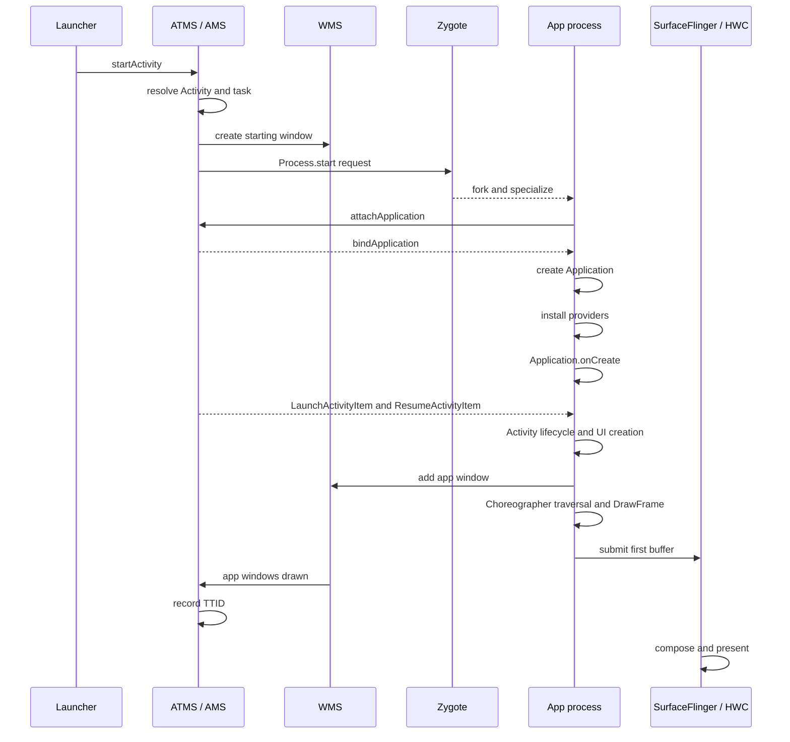

# App 冷启动链路与 Binder Trace 分析

冷启动跨越 Launcher、system_server、Zygote 和应用进程。总时长拆成进程创建、绑定应用、组件启动和首帧后，再用 Binder 事务把跨进程等待接回具体服务端线程。

## 从启动请求到首帧

### 启动性能要回答的三个问题

一次应用启动会经过 Launcher、`system_server`、Zygote、应用进程、SurfaceFlinger 和显示设备。总耗时只能说明启动是否较慢；要找到修复位置，还需要回答三个问题：

1. 本次样本属于冷启动、温启动还是热启动？
2. 测量目标是首帧可见的 TTID，还是主内容可交互的 TTFD？
3. 时间消耗发生在系统调度、进程创建、应用初始化、Activity/UI 创建，还是首帧渲染与合成？

本文以 Android 17 / API 37 的 `android-17.0.0_r1` 为平台源码基线。涉及调度、缺页和存储 I/O 时，内核基线为 `android17-6.18-2026-06_r6`。SDK 初始化、Zygote preload（预加载）以及其他优化手段的收益，都需要在目标设备和实际启动样本上测量。

### 冷启动、温启动与热启动

冷、温、热三种启动类型描述启动前的进程和 Activity 状态，也决定系统需要重新执行哪些工作。

| 类型 | 启动前状态 | 主要工作 | 可复现实验口径 |
| --- | --- | --- | --- |
| 冷启动 | 应用进程不存在 | 创建进程、绑定 Application、创建 Activity、生成首帧 | Macrobenchmark `StartupMode.COLD` |
| 温启动 | 常见口径是进程存活、Activity 需要重建 | 复用进程和 Application，重建 Activity / UI | Macrobenchmark `StartupMode.WARM` |
| 热启动 | 进程和目标 Activity 仍存在 | 将已有 Activity 带回前台，恢复必要状态并更新画面 | Macrobenchmark `StartupMode.HOT` |

官方启动文档对温启动的描述较宽，还包括“进程重建，但可以使用 saved instance state（已保存实例状态）”的情况。Macrobenchmark 为基准测试提供了更窄、可重复的定义：WARM 保留进程并重建 Activity。比较线上数据和实验室数据时，应记录各自采用的定义。

按 Home、按返回键、从 Recents（最近任务）恢复和点击通知，会产生不同的任务栈状态。生命周期日志只能辅助判断，不能单凭出现 `onCreate()` 或 `onResume()` 就推断启动类型。Perfetto 的 Android App Startups、`am start -W` 输出、Macrobenchmark 配置，以及 API 35 及以上版本的 `ApplicationStartInfo.getStartType()` 更适合作为证据。

### Android 17 冷启动时序

下面的时序图省略了权限校验、任务复用、窗口转场和错误分支，只保留影响启动性能的主要步骤：



图中的“app windows drawn”是 Android Framework 记录应用窗口首帧完成的时间边界。这个时间晚于应用生命周期回调返回，但仍早于面板像素完成发光，不能代替面板级光学测量。

#### 启动请求、任务解析与 starting window

Launcher 通过 Activity API 发起启动，Binder 请求随后进入 `ActivityTaskManagerService`（ATMS）。系统解析 Intent、权限、后台启动限制，以及 Task 与 Activity 的复用关系，并为本次启动建立计时记录。

冷启动期间，WindowManager 可以先显示 starting window（启动占位窗口）。从 Android 12（API 31）开始，标准路径由 SplashScreen API 统一。starting window 是系统在目标应用首帧之前显示的过渡画面，不会因此提前结束目标 Activity 的 TTID。若再使用专门的 trampoline Activity（只负责跳转的中间 Activity）充当启动页，还会额外增加一次 Activity 创建和窗口转场。

#### 进程选择与 Zygote fork

Android 17 的 `ActivityTaskSupervisor.startSpecificActivity()` 会先检查目标进程是否存在、是否已经注册了可用的应用线程：

- `WindowProcessController.hasThread()` 为真时，系统可进入 `realStartActivityLocked()`；
- 进程不可用时，系统走 `startProcessAsync()`。

需要创建进程时，调用会继续进入 `ProcessList.startProcessLocked()`，再到 `Process.start()` 和 `ZygoteProcess`。`ZygoteProcess` 通过本地 socket 向匹配目标 ABI 的 Zygote 发送参数。Zygote 通过 fork 复制出子进程，再为它设置 UID、GID、SELinux、运行时参数和入口类；这个过程称为 specialize（专门化）。应用入口通常是 `ActivityThread.main()`。

Zygote 已加载的 Framework 类、资源和部分 native 映射，可以由子进程通过 Copy-on-Write（写时复制）共享：只读时多个进程使用同一物理页，发生写入时才复制。共享页能减少重复加载和内存占用，但不表示应用代码已经完成类加载，也不保证所有共享页在启动时都驻留在内存中。preload 的收益取决于系统版本、厂商列表、内存压力和启动路径，不能用一个固定“覆盖百分比”描述所有设备。

#### ActivityThread 与 attachApplication

`ActivityThread.main()` 创建应用主线程环境和主 Looper（消息循环）。`ActivityThread.attach()` 通过 `ActivityManagerService.attachApplication()` 告知系统应用线程已经可用。系统随后向应用侧的 `ApplicationThread` 发送 `bindApplication`，应用主线程处理 `BIND_APPLICATION` 消息并进入 `handleBindApplication()`。

这一阶段在 trace 中通常标为 `BindApplication`，其中包含的工作远多于 `Application.onCreate()`：

- 建立 `LoadedApk`、Context、ClassLoader 和运行时配置；
- 创建并 `attach()` Application；
- 安装系统下发的 ContentProvider；
- 初始化 Instrumentation；
- 调用 `Application.onCreate()`；
- 处理字体、网络安全和图形环境等进程级配置。

Android 17 的 `ActivityThread.handleBindApplication()` 按照以下顺序执行：先调用 `makeApplicationInner()`，再调用 `installContentProviders()`，最后由 `Instrumentation.callApplicationOnCreate()` 进入应用回调。因此，SDK 用于自动初始化的 Provider 会在 `Application.onCreate()` 之前运行；只测量 Application 回调会漏掉这部分开销。

#### ClientTransaction 与 Activity 生命周期

进程完成附着后，`ActivityTaskSupervisor` 会构造 `LaunchActivityItem`；如果 Activity 还需要进入前台，则同时附带 `ResumeActivityItem`。这些对象属于 `ClientTransaction`，用于把服务端决定的生命周期操作发送给应用。`LaunchActivityItem.execute()` 调用应用侧的 `handleLaunchActivity()`，随后进入 `performLaunchActivity()`。

`performLaunchActivity()` 创建 Activity 实例和对应的 Activity Context，执行 `Activity.attach()`，再调用 `onCreate()`。`TransactionExecutor` 根据目标生命周期继续执行 `onStart()` 和 `onResume()`。启动 Activity 中常见的首屏工作包括：

- `setContentView()` 中的 XML inflate（解析并创建 View），或 Compose `setContent {}` 后的初始 composition（组合）；
- ViewModel、依赖注入和 saved state 恢复；
- 同步资源解析、主题和 drawable 创建；
- 首屏数据读取与 UI 状态构建。

系统并不要求每个 Activity 都调用 `setContentView()`。无界面、透明、跳板或延迟安装内容的 Activity 都可能采用其他路径，所以“Activity 启动必然 inflate XML”只适用于典型的 View 页面。

#### 窗口、遍历与首帧

Activity 进入 resume 阶段后，DecorView 会被加入 WindowManager；应用进程创建 `ViewRootImpl`，并向 WMS 注册窗口。首帧的应用侧路径通常包括：

1. `ViewRootImpl.scheduleTraversals()` 向 Choreographer 请求一次 traversal（界面遍历）；
2. VSync 到来后执行 `performTraversals()`；
3. View 页面完成 measure、layout 和 draw，Compose 页面完成相应的 composition、layout 和 draw；
4. UI Thread 更新渲染节点，RenderThread 执行 `DrawFrame` 并提交 GPU 工作；
5. buffer 提交给 SurfaceFlinger；
6. SurfaceFlinger 选择 buffer、完成合成，并交给 HWC present（提交显示）。

`ActivityRecord.onWindowsDrawn()` 会调用 `ActivityMetricsLogger.notifyWindowsDrawn()`。Android 17 在这里通过 `SystemClock.uptimeNanos()` 记录 `START_TIMESTAMP_FIRST_FRAME`，并结束 Framework 统计的窗口绘制启动区间，这就是 TTID 的平台计量边界。SurfaceFlinger 合成、HWC present 和面板扫描仍可能发生在这个时间点之后。

### TTID 与 TTFD

#### TTID：目标 Activity 的首帧

TTID（Time to Initial Display，首帧显示时间）统计从系统收到启动请求，到目标 Activity 首帧完成所用的时间。冷启动包含进程创建、Application 和 Activity 初始化；温启动会跳过部分进程工作；热启动主要反映 Activity 恢复和重新显示。

Logcat 中的 `Displayed` 行和 Android Vitals 的启动时间以 TTID 为主要口径。Android Vitals 把以下 TTID 归为 excessive startup：

- 冷启动达到 5 秒；
- 温启动达到 2 秒；
- 热启动达到 1.5 秒。

这些数值是 Google Play 判定启动过长的告警边界，不能当作优秀体验的目标。当前 Android 性能度量指南给出的建议更严格：冷启动低于 500 ms、温启动低于 200 ms、热启动低于 150 ms。产品仍应结合设备档位和业务入口，设定 P50、P90、P95、P99 以及超过目标的样本占比。

首帧可能只包含 Splash 之后的页面外壳、骨架屏或空列表，因此 TTID 变短不代表页面内容已经可用。

#### TTFD：应用声明的可用状态

TTFD（Time to Full Display，完整显示时间）使用与 TTID 相同的启动起点，终点是应用报告 fully drawn。应用应在主内容已经显示、主要交互已经可用时调用 `reportFullyDrawn()`。如果图片、列表或本地数据属于首屏可用条件，就应纳入这个状态；与首屏无关的预取、埋点上传和后台同步则不应延后 TTFD。

Android 17 的 `ActivityMetricsLogger.notifyFullyDrawn()` 会检查窗口是否已经 drawn（完成首帧绘制）。如果应用过早调用，Framework 会推迟报告，确保 TTFD 不早于 TTID。这项保护无法替应用判断业务是否已经可用；就绪条件定义错误，仍会得到失真的 TTFD。

AndroidX `ComponentActivity` 中的 `FullyDrawnReporter` 可以汇总多个异步就绪条件。下面的示例在等待首屏数据期间增加一个 reporter 计数：

```kotlin
override fun onCreate(savedInstanceState: Bundle?) {
    super.onCreate(savedInstanceState)
    setContentView(R.layout.activity_home)

    fullyDrawnReporter.addReporter()
    lifecycleScope.launch {
        try {
            viewModel.awaitInitialContent()
        } finally {
            fullyDrawnReporter.removeReporter()
        }
    }
}
```

所有 reporter 计数都移除后，`FullyDrawnReporter` 才允许调用 `reportFullyDrawn()`。`finally` 可以保证任务失败或取消时也释放计数；页面还应把错误状态设计成可交互状态，避免 TTFD 一直无法上报。

Compose 页面可以使用 `ReportDrawn`、`ReportDrawnWhen` 或 `ReportDrawnAfter` 表达相同的就绪条件。判断依据应是用户能否使用页面，无须等待所有后台任务结束。

### API 35+：ApplicationStartInfo

Android 15（API 35）引入了 `ApplicationStartInfo`，用于描述进程为何启动、由哪类组件触发、属于哪种启动类型、当前到达什么状态，以及各阶段的 monotonic（单调递增时钟）纳秒时间戳。一条记录可能对应 Activity，也可能由 Service、Provider、Broadcast 或其他原因触发进程启动，因此读取后应先检查 component、reason 和 startup state。

常用字段如下：

| 字段 | 含义 | 读取边界 |
| --- | --- | --- |
| `getStartupState()` | `STARTED`、`ERROR` 或 `FIRST_FRAME_DRAWN` | 返回时记录可能仍在收集中 |
| `getStartType()` | `COLD`、`WARM`、`HOT` 或 `UNSET` | `FIRST_FRAME_DRAWN` 状态才保证已设置 |
| `getStartComponent()` | 触发进程的组件类型 | 不要把 Service start 当成 Activity TTID |
| `getReason()` | Launcher、Job、Provider、Service 等具体原因 | 用于拆分入口 |
| `getStartupTimestamps()` | 各阶段的 monotonic 纳秒时间戳 | 不同状态和启动类型对应不同的 key |

API 只保证部分状态下必定存在对应时间戳，读取时应按以下边界处理：

- `START_TIMESTAMP_LAUNCH` 在 `STARTED` 状态可用；
- `FIRST_FRAME_DRAWN` 状态还保证 bindApplication、Application onCreate 调用点和 first frame 时间戳存在；
- `FULLY_DRAWN` 依赖应用调用 `reportFullyDrawn()`；
- `FORK`、initial RenderThread frame 和 SurfaceFlinger composition complete 都应作为可选 key 读取。

下面的代码只在起止 key 都存在时计算阶段差值，避免把缺失字段误当成零：

```kotlin
@RequiresApi(35)
fun readLatestStart(context: Context): Map<String, Double?> {
    val activityManager = context.getSystemService(ActivityManager::class.java)
    val info = activityManager
        .getHistoricalProcessStartReasons(1)
        .firstOrNull()
        ?: return emptyMap()
    val timestamps = info.startupTimestamps

    fun deltaMs(startKey: Int, endKey: Int): Double? {
        val start = timestamps[startKey] ?: return null
        val end = timestamps[endKey] ?: return null
        return (end - start) / 1_000_000.0
    }

    return mapOf(
        "launch_to_fork_ms" to deltaMs(
            ApplicationStartInfo.START_TIMESTAMP_LAUNCH,
            ApplicationStartInfo.START_TIMESTAMP_FORK,
        ),
        "bind_to_application_onCreate_entry_ms" to deltaMs(
            ApplicationStartInfo.START_TIMESTAMP_BIND_APPLICATION,
            ApplicationStartInfo.START_TIMESTAMP_APPLICATION_ONCREATE,
        ),
        "launch_to_first_frame_ms" to deltaMs(
            ApplicationStartInfo.START_TIMESTAMP_LAUNCH,
            ApplicationStartInfo.START_TIMESTAMP_FIRST_FRAME,
        ),
        "launch_to_sf_composition_ms" to deltaMs(
            ApplicationStartInfo.START_TIMESTAMP_LAUNCH,
            ApplicationStartInfo.START_TIMESTAMP_SURFACEFLINGER_COMPOSITION_COMPLETE,
        ),
    )
}
```

`START_TIMESTAMP_APPLICATION_ONCREATE` 记录的是回调开始点，因此 `bind → onCreate entry` 主要覆盖回调之前的绑定、Application 创建和 Provider 安装，不是 `Application.onCreate()` 自身的执行时长。若要测量回调本身，需要加入自定义 trace section 或进行方法级分析。

同一个 `startupTimestamps` map 中的时间戳可以直接相减。若要把 monotonic 时间戳叠加到 Perfetto，则应使用 trace clock snapshot（时钟快照）转换时钟域，不能假设 API 数值与 trace 主时间轴使用相同零点。`getHistoricalProcessStartReasons()` 还可能返回尚未完成的记录，此时缺少部分字段属于正常状态。

### 四类测量工具

#### `adb shell am start -W`

下面的命令会先停止目标应用，再发起启动并等待结果，适合快速检查单次冷启动和 `Displayed` 时间：

```bash
adb shell am start -S -W \
  -a android.intent.action.MAIN \
  -c android.intent.category.LAUNCHER \
  -n com.example.app/.MainActivity
```

`-S` 会在启动前停止目标应用，便于构造冷启动，但也会改变原有现场状态。输出中的 `ThisTime`、`TotalTime` 和 `WaitTime` 分别覆盖不同的等待范围；遇到 trampoline、重定向或多个 Activity 连续启动时，不能默认三者相等。这条命令适合冒烟检查，也就是快速确认功能和大致耗时，不能代替受控的多轮基准测试。

#### Logcat

`Displayed package/.Activity: +...` 对应 Framework 记录的 TTID，调用 `reportFullyDrawn()` 后则会出现 `Fully drawn ...`。有些 `Displayed` 行还带有 `total` 字段，其统计范围包含在当前 Activity 之前已经启动但尚未显示的 Activity；分析跳板页时应保留这段信息。

Logcat 时间可以帮助定位样本，但记录日志本身会产生一定扰动，而且缺少线程调度、Binder、I/O 和渲染细节。

#### Macrobenchmark

Macrobenchmark 可以固定启动类型、编译模式、迭代次数和测试入口，并自动保存 Perfetto trace。下面的测试测量冷启动 TTID；如果应用正确报告 fully drawn，也会同时产生 TTFD：

```kotlin
@get:Rule
val benchmarkRule = MacrobenchmarkRule()

@Test
fun coldStartup() = benchmarkRule.measureRepeated(
    packageName = "com.example.app",
    metrics = listOf(StartupTimingMetric()),
    compilationMode = CompilationMode.Partial(),
    startupMode = StartupMode.COLD,
    iterations = 10,
    setupBlock = {
        pressHome()
    },
) {
    startActivityAndWait()
}
```

`StartupMode.COLD` 会在两次迭代之间终止应用进程；WARM 和 HOT 则按照各自定义保留状态。比较 Baseline Profile 前后结果时，需要固定 `CompilationMode`，否则编译状态差异可能被误认为代码优化收益。

#### Perfetto

Perfetto 用于定位启动时间花在了哪个阶段。界面中的 Android App Startups derived metric（派生指标）会给出启动区间和类型，随后可以展开检查：

- `system_server` 的 `launchingActivity#...`、进程创建和 Binder；
- 应用主线程的 `BindApplication`、`activityStart`、class loading、ContentProvider 和自定义 trace；
- View 的 `performTraversals`，Compose 的 composition/layout/draw；
- RenderThread `DrawFrame`、GPU、FrameTimeline；
- SurfaceFlinger、HWC 和厂商 display trace。

较新的 trace processor 标准库可以直接查询启动类型、TTID 和 TTFD。下面的 SQL 会列出指定包的启动记录，并关联首帧和完整显示时间：

```sql
INCLUDE PERFETTO MODULE android.startup.startups;
INCLUDE PERFETTO MODULE android.startup.time_to_display;

SELECT
  s.startup_id,
  s.startup_type,
  s.dur / 1e6 AS startup_slice_ms,
  d.time_to_initial_display / 1e6 AS ttid_ms,
  d.time_to_full_display / 1e6 AS ttfd_ms,
  d.ttid_frame_id,
  d.ttfd_frame_id
FROM android_startups AS s
LEFT JOIN android_startup_time_to_display AS d
  USING (startup_id)
WHERE s.package = 'com.example.app'
ORDER BY s.ts;
```

如果应用没有报告 TTFD，或 trace 没有覆盖对应帧，`ttfd_ms` 可以为空。`startup_slice_ms` 和 TTID 的观测终点也可能不同，分析时应以字段定义和 frame id 为准。

### Application 与 Provider 的启动成本

#### ContentProvider 早于 Application.onCreate

应检查 Manifest 合并后出现的所有 Provider。WorkManager、Firebase、图片库、APM（应用性能监控）、广告、推送和自定义 SDK 都可能通过 Provider 自动初始化。Provider 的 `onCreate()` 在应用主线程执行，并且早于 `Application.onCreate()`；同步磁盘、数据库、Binder 或类加载都会延迟 Activity 创建。

检查时应同时查看：

- 应用源 Manifest 与依赖合并后的最终 Manifest；
- `BindApplication` 内 Provider 安装相关 slice；
- SDK 是否提供关闭自动初始化或按需初始化的配置；
- 当前启动入口是否需要这项初始化，例如 Launcher 入口和 push / service 进程可能依赖不同组件。

#### Application.onCreate

Application 回调适合建立所有进程入口都需要、且耗时可控的进程级状态。常见风险包括：

- 同步读取 SharedPreferences、文件、数据库或 keystore；
- 主线程等待 Binder、锁、线程池 `Future` 或网络；
- 一次创建完整依赖图和大量单例；
- 初始化当前入口用不到的 SDK；
- 大量反射、序列化、类加载和 native library 加载；
- 为“异步化”同时启动过多任务，争抢启动线程需要的 CPU、I/O 和内存带宽。

将工作移到后台线程只改变了执行位置。如果后台任务占满高性能 CPU 核心、触发大量缺页，或持有主线程需要的锁，TTID 仍可能变差。每项延迟初始化都应明确触发条件、执行线程、依赖、完成时限和失败策略。

#### 多 DEX 与 ART

Android 8.0 到 Android 17 的 ART 原生支持多 DEX。Android 5.0 以下版本中 `MultiDex.install()` 的解压和安装问题属于历史兼容路径，不应套用到本文的平台基线。

多 DEX 仍会影响现代 Android 的启动表现：类在 DEX 文件中的布局、页缓存、校验、类加载，以及解释执行、JIT、AOT 等编译状态都会改变启动开销。应通过 class loading slice、文件 I/O、编译过滤器和 Macrobenchmark 的 compilation mode 验证具体原因，不能把所有 DEX 成本都归因于“方法数超过 65536”。

### 首帧 UI 的成本

#### View 页面

XML 页面通常依次经历 inflate、measure、layout 和 draw。inflate 包括解析 XML 与主题属性、构造 View 和加载相关资源；measure / layout 的开销取决于树结构、自定义 View、约束和重复测量；draw 还可能触发 drawable 解析、文本布局、bitmap 解码或 GPU 上传。

减少层级只是可以尝试的手段之一。`ConstraintLayout`、嵌套容器和自定义布局中哪一种更快，应由首帧 trace 与基准测试判断。`AsyncLayoutInflater` 也受 View 线程安全限制；如果 Activity 必须等待异步 inflate 完成后才能显示，那么工作虽然换了线程，TTID 却未必缩短。

#### Compose 页面

Compose 首帧包含初始 composition、measure / place 和 draw。启动期间读取磁盘、执行复杂集合变换、同步创建图片，或一次组合大量不可见节点，都会延长主线程或 RenderThread 路径。可以根据可见状态进行条件组合，推迟次要 tab、错误详情和屏外内容，但要避免首帧之后立即出现一次耗时更长的重组。

#### 图片与资源

首帧只应同步准备当前可见且必需的资源。图片解码、`VectorDrawable` rasterization（栅格化）、字体加载和主题资源解析都可能出现在 trace 中。使用占位内容时应预留真实内容的尺寸，避免资源到达后发生大范围重新布局。减少首帧工作不能以界面无法交互或内容闪烁为代价。

### Profile 优化的三层含义

#### Baseline Profile

Baseline Profile 会随应用或库一起交付热点类和方法规则，ART 可以对覆盖路径进行 AOT（安装前 / 安装时）编译，从首次运行开始减少解释执行和 JIT（运行时即时编译）。官方文档给出的“覆盖代码路径约有 30% 执行速度提升”是总体经验值，不表示每个应用的 TTID 都会缩短 30%。

生成 profile 后要确认：

- 启动、通知、深链等主要入口是否被覆盖；
- release 构建经过 R8 后，规则仍被正确重写和打包；
- 目标设备上的安装状态与编译过滤器符合预期；
- `CompilationMode.None`、`Partial` 与 `Full` 的 Macrobenchmark 差异符合解释。

#### Startup Profile

Startup Profile 是 Baseline Profile 中用于构建期 DEX layout（文件布局）的规则子集。R8 / D8 根据它安排启动相关类和方法，减少启动期间跨 DEX 读取和页面访问。它解决的是文件布局问题，与运行时 AOT 可以同时使用。规则过多、导致启动代码仍分散到多个 DEX 时，布局收益会下降。

#### Cloud Profile

Cloud Profile 由 Google Play 汇总真实用户设备上的热点，再提供给后续安装或更新应用的设备，支持 Android 9（API 28）及更高版本。它需要积累足够样本，可能在版本发布数小时到数天后才开始分发。没有 Google Play 的渠道不能假定存在 Cloud Profile；APK 内的 Baseline Profile、ProfileInstaller 和设备本地 ART 优化仍可独立工作，具体安装行为需要按分发渠道验证。

### AndroidX App Startup

AndroidX App Startup 让多个支持它的组件共享一个 `InitializationProvider`，并通过 `Initializer.dependencies()` 声明初始化顺序。这样可以减少多个独立 Provider 带来的框架开销，也更容易看清组件之间的依赖关系。

下面的 `Initializer` 表示 Telemetry 必须在配置组件完成初始化后才能创建：

```kotlin
class TelemetryInitializer : Initializer<Telemetry> {
    override fun create(context: Context): Telemetry =
        Telemetry.create(context)

    override fun dependencies(): List<Class<out Initializer<*>>> =
        listOf(ConfigInitializer::class.java)
}
```

App Startup 会先初始化 `ConfigInitializer`，再调用 `TelemetryInitializer.create()`。通过 manifest metadata 注册的 `Initializer` 仍在 `InitializationProvider.onCreate()` 中执行，并且早于 `Application.onCreate()`。共享 Provider 不会自动把工作移到后台线程，也不会自动推迟初始化时间。

如果组件无须在首帧前运行，应从 manifest 中移除对应 metadata，再按需调用 `AppInitializer.initializeComponent()`。尚未适配 App Startup 的第三方 Provider 不会被框架自动接管，需要使用 SDK 提供的关闭开关，或向供应方确认其他初始化入口。

### 16 KB page size 的边界

从 Android 15 开始，AOSP 支持使用 16 KB page size（内存页大小）的设备。包含 native library 的应用必须确保 APK zip alignment、ELF segment alignment（压缩包和 ELF 段对齐）、预编译依赖，以及代码中对 page size 的假设都兼容；纯 Java / Kotlin 应用也应在 16 KB 环境中进行回归测试。

Google 的初始测试显示，在系统存在内存压力时，样本中的应用启动时间平均降低 3.16%，部分样本改善更多。这个结果只描述一组受控测试，不能视为所有应用或设备的收益承诺。更大的页会同时改变页表、TLB（地址转换缓存）、页内空间浪费、缺页和 COW 粒度，不能从“页大小变为四倍”直接推出“缺页次数减少四倍”。

比较 4 KB 和 16 KB 环境下的启动表现时，应使用同一设备或等价平台配置，固定 APK、编译状态、缓存、温度和内存压力，并分别查看缺页、I/O、CPU time 和 TTID。只比较 `BindApplication` 之前的一段时间，无法覆盖整个启动过程。

### 诊断顺序

1. 固定入口、账号状态、缓存、启动类型、编译模式和设备状态。
2. 同时记录 TTID 与 TTFD，确认 `reportFullyDrawn()` 语义。
3. 从 Perfetto Android App Startups 区间定位最慢样本。
4. 将时间分为进程启动、BindApplication、Provider、Application、Activity、UI Thread、RenderThread / GPU 和 SurfaceFlinger 等阶段。
5. 对长片段检查线程状态、Binder 对端、锁、I/O、缺页、GC、CPU 频率和温控。
6. 用自定义 trace 缩小应用代码的排查范围，再选择推迟、移除、缓存、并行或 Profile 优化。
7. 在相同测试协议下复测多轮，报告分位数和回归样本。

性能采集本身也会产生额外开销。方法 trace 比系统 trace 更重，适合在排查范围已经缩小后使用。冷缓存、force-stop、重启设备和清除数据代表不同的实验条件，不能全部标成同一种“冷启动”。

### Android 17 源码锚点

- [`ActivityTaskSupervisor.java`](https://android.googlesource.com/platform/frameworks/base/+/android-17.0.0_r1/services/core/java/com/android/server/wm/ActivityTaskSupervisor.java)：进程复用判断、`startSpecificActivity()` 与 `LaunchActivityItem`。
- [`ProcessList.java`](https://android.googlesource.com/platform/frameworks/base/+/android-17.0.0_r1/services/core/java/com/android/server/am/ProcessList.java)：`startProcessLocked()` 与 `Process.start()`。
- [`Process.java`](https://android.googlesource.com/platform/frameworks/base/+/android-17.0.0_r1/core/java/android/os/Process.java)：应用进程启动入口。
- [`ZygoteProcess.java`](https://android.googlesource.com/platform/frameworks/base/+/android-17.0.0_r1/core/java/android/os/ZygoteProcess.java)：Zygote socket 通信。
- [`ActivityThread.java`](https://android.googlesource.com/platform/frameworks/base/+/android-17.0.0_r1/core/java/android/app/ActivityThread.java)：`ActivityThread.main()`、`handleBindApplication()`、Provider 安装和 Activity 生命周期。
- [`LaunchActivityItem.java`](https://android.googlesource.com/platform/frameworks/base/+/android-17.0.0_r1/core/java/android/app/servertransaction/LaunchActivityItem.java)：应用侧 Activity launch transaction。
- [`ViewRootImpl.java`](https://android.googlesource.com/platform/frameworks/base/+/android-17.0.0_r1/core/java/android/view/ViewRootImpl.java)：窗口接入、遍历与首帧调度。
- [`ActivityRecord.java`](https://android.googlesource.com/platform/frameworks/base/+/android-17.0.0_r1/services/core/java/com/android/server/wm/ActivityRecord.java)：窗口 drawn 回调。
- [`ActivityMetricsLogger.java`](https://android.googlesource.com/platform/frameworks/base/+/android-17.0.0_r1/services/core/java/com/android/server/wm/ActivityMetricsLogger.java)：TTID、TTFD 与 ApplicationStartInfo 时间戳。
- [`ApplicationStartInfo.java`](https://android.googlesource.com/platform/frameworks/base/+/android-17.0.0_r1/core/java/android/app/ApplicationStartInfo.java)：启动类型、状态、原因与 timestamp key。

### 启动链路的官方核对入口

- [App startup time: TTID, TTFD and startup types](https://developer.android.com/topic/performance/vitals/launch-time)
- [App startup analysis and optimization](https://developer.android.com/topic/performance/appstartup/analysis-optimization)
- [Overview of measuring app performance](https://developer.android.com/topic/performance/measuring-performance)
- [Macrobenchmark overview](https://developer.android.com/topic/performance/benchmarking/macrobenchmark-overview)
- [Macrobenchmark metrics](https://developer.android.com/topic/performance/benchmarking/macrobenchmark-metrics)
- [`ApplicationStartInfo` API](https://developer.android.com/reference/android/app/ApplicationStartInfo)
- [PerfettoSQL Android startup modules](https://perfetto.dev/docs/analysis/stdlib-docs#android-startup-startups)
- [Baseline Profiles overview](https://developer.android.com/topic/performance/baselineprofiles/overview)
- [Startup Profiles and DEX layout](https://developer.android.com/topic/performance/startupprofiles/dex-layout-optimizations)
- [AndroidX App Startup](https://developer.android.com/topic/libraries/app-startup)
- [Support 16 KB page sizes](https://developer.android.com/guide/practices/page-sizes)


## 用 Binder Trace 还原跨进程等待

启动阶段表给出时间边界，Binder Trace 用于解释 system_server、PackageManager、WindowManager 或其他服务为何延迟返回。

Binder Trace 用来定位冷启动路径上的 IPC（Inter-Process Communication，进程间通信）瓶颈。借助 Perfetto 的 `android.binder` 标准库，可以分辨一笔事务在客户端等待、服务端处理和返回调度上分别花了多久，也能检查 Binder 线程池是否饱和，以及目标进程被冻结后返回的错误是否干扰启动。Binder 机制原理见 §1.3 和 §1.12，冷启动阶段划分见 §8.2。

平台与源码基线为 AOSP `android-17.0.0_r1`、`frameworks/native`、`external/perfetto`，以及 kernel `android17-6.18-2026-06_r6`。

### 一、先把冷启动窗口和 Binder 范围分开

一次 Activity 冷启动会经过 Launcher、`system_server`、Zygote 和目标应用进程。Binder 只负责其中一部分跨进程通信。Perfetto 中的 slice 表示一段有起止时间的执行区间；下面几类工作经常与 Binder slice 紧挨在时间线上，却要按各自的数据源分析：

- `system_server` 通过 Zygote command socket（命令套接字）请求创建应用进程，这段通信不走 Binder；
- 应用读取 dex、resources、SharedPreferences 或 DataStore 时产生文件 I/O；
- Choreographer 通过 `DisplayEventReceiver` 接收 vsync（垂直同步信号）；
- 应用主线程执行类加载、View inflate（从布局资源创建 View）、Compose composition（组合计算）和业务初始化。

因此，`am start -W` 的总时间不能直接等同于 Binder 等待。分析时先确定 Activity startup 的起止区间，再统计与这个区间相交的事务。

#### 1.1 冷启动中常见的 Binder 方向

Android 17 上可从源码确认的主要方向如下：

| 方向 | 代表调用 | 与首帧的关系 |
|---|---|---|
| Launcher → `system_server` | `IActivityTaskManager.startActivity()` | 启动入口，通常为同步调用 |
| App → `system_server` | `IActivityManager.attachApplication()` | 新进程向 AMS（ActivityManagerService）报到 |
| `system_server` → App | `IApplicationThread.bindApplication()` 及生命周期 ClientTransaction | 驱动应用绑定和 Activity 创建 |
| App → WMS | `IWindowSession.addToDisplayAsUser()`、`relayout()` | 向 WMS（WindowManagerService）注册窗口并取得 Surface/布局结果 |
| App → AMS | `getContentProvider()`、`refContentProvider()` | 获取远端 Provider 及管理引用 |
| App/SDK → PKMS | `getPackageInfo()`、`getApplicationInfo()` 等 | 访问 PKMS（PackageManagerService）；是否出现取决于应用或 SDK 行为 |

`bindApplication` 携带应用信息和 Provider 列表。应用在 `ActivityThread.handleBindApplication()` 中安装本进程 Provider；Provider 初始化代码若访问系统服务、远端 Provider 或其他进程，还会产生相应 IPC。观察到 `ContentProvider.onCreate()` 很慢时，应把本进程内的初始化和它发起的 Binder 调用分别计时，避免把两类耗时都记在 Binder 名下。

#### 1.2 先回答三个问题

每一笔慢事务都要回答：

1. 哪个线程发起，是否位于目标应用主线程？
2. 事务与冷启动区间相交多少，是否位于首帧关键路径？
3. 时间主要花在请求派发、服务端处理，还是 reply（回复）传回后客户端重新获得 CPU 的阶段？

调用次数和单次时长要同时看。大量短事务可能累积成明显延迟；单笔长事务也可能与其他工作并行，不一定等量增加首帧时间。多个嵌套事务的 `client_dur` 区间会互相包含，直接求和会重复计时，因此“事务总和”只适合用来排序排查对象，不能直接当作启动可节省时间。

### 二、采集 Binder Trace

#### 2.1 Android 17 r6 kernel 提供的 tracepoint

tracepoint 是内核代码中预先埋设的事件观测点。`android17-6.18-2026-06_r6/drivers/android/binder_trace.h` 定义了这次分析所需的 Binder tracepoint：

| Tracepoint | 用途 |
|---|---|
| `binder_transaction` | 记录发送、目标进程/线程、code、flags 和 reply 标志 |
| `binder_transaction_received` | 标记目标线程收到事务 |
| `binder_transaction_alloc_buf` | 记录驱动为事务数据分配 buffer 的情况 |
| `binder_command` | 记录用户空间写给驱动的 `BC_*` 命令 |
| `binder_return` | 记录驱动返回用户空间的 `BR_*` 命令 |
| `binder_set_priority` | 观察目标 Binder 线程的优先级调整 |
| `binder_netlink_report` | 观察 frozen（目标已冻结）、pending（事务待处理）等内核报告 |

旧内核中的 `binder_lock`、`binder_locked`、`binder_unlock` 已不在 r6 的 `binder_trace.h` 中。服务端锁竞争要结合服务端 slice、`thread_state`、ART monitor contention（Java 对象监视器竞争）或业务 trace 判断。

#### 2.2 一份可复现的 Perfetto 配置

下面的配置覆盖 Binder 配对、线程状态、Activity/WMS slice 和应用自定义 `Trace`。把包名替换为被测应用。

```protobuf
buffers {
  size_kb: 32768
  fill_policy: RING_BUFFER
}

duration_ms: 15000

data_sources {
  config {
    name: "linux.ftrace"
    ftrace_config {
      ftrace_events: "binder/binder_transaction"
      ftrace_events: "binder/binder_transaction_received"
      ftrace_events: "binder/binder_transaction_alloc_buf"
      ftrace_events: "binder/binder_command"
      ftrace_events: "binder/binder_return"
      ftrace_events: "binder/binder_set_priority"
      ftrace_events: "binder/binder_netlink_report"
      ftrace_events: "sched/sched_switch"
      ftrace_events: "sched/sched_waking"

      atrace_categories: "am"
      atrace_categories: "wm"
      atrace_categories: "view"
      atrace_categories: "dalvik"
      atrace_apps: "com.example.app"

      drain_period_ms: 250
    }
  }
}

data_sources {
  config {
    name: "linux.process_stats"
    process_stats_config {
      proc_stats_poll_ms: 1000
    }
  }
}
```

这份配置同时采集 Binder 内核事件、线程调度、框架 atrace slice 和目标应用的自定义 slice。`RING_BUFFER` 表示空间用完后覆盖最旧数据，`drain_period_ms` 控制 ftrace 数据搬入 Perfetto buffer 的周期。

15 秒和 32 MiB 是便于手工分析的起点。高频设备或多轮连续启动需要根据丢事件统计调整 buffer；配置过大也会增加采集开销。`android.binder` 属于 Trace Processor 的分析侧标准库，能否通过 `INCLUDE` 加载取决于分析工具版本，与采集设备的 API 级别无直接对应关系。

#### 2.3 正确制造一次应用冷启动

重启整个 Android framework 会改变系统缓存、服务状态和设备温度，不适合作为普通应用冷启动的准备步骤。手工采集可以用两个终端：一个运行有限时长的 Perfetto，另一个强停并启动目标 Activity。

终端 A 使用下面的命令启动采集。

```bash
adb push binder-trace.pbtxt /data/local/tmp/
adb shell perfetto --txt \
  -c /data/local/tmp/binder-trace.pbtxt \
  -o /data/local/tmp/cold-start-binder.pftrace
```

该命令在配置的 15 秒结束后退出。保持终端 A 运行，再执行终端 B 的启动命令。

终端 B 用 `am start -S` 终止目标包的现有进程并启动指定 Activity。

```bash
adb shell am start -W -S \
  -n com.example.app/.MainActivity
```

采集结束后再执行 `adb pull /data/local/tmp/cold-start-binder.pftrace .`。这里的“进程冷启动”只保证应用进程已被终止并重新创建；文件页缓存、shader cache（已编译的 GPU 着色程序缓存）和 ART 编译产物仍可能保留。需要可比较的统计结果时，应使用 Macrobenchmark 的 `StartupMode.COLD`，并固定 CompilationMode、设备温度、动画和迭代次数。磁盘缓存是否清空是另一项实验变量；在权限与 API 条件允许时，可使用 Macrobenchmark 的 `dropKernelPageCache()` 单独控制。

#### 2.4 atrace 只用于快速查看

只能使用 atrace 时，类别应作为位置参数传入，`-c` 表示 circular buffer：缓冲区写满后覆盖最旧事件。

```bash
adb shell atrace --async_start -c -b 20000 \
  binder_driver sched am wm view dalvik
adb shell am start -W -S -n com.example.app/.MainActivity
adb shell atrace --async_stop -z > cold-start.atrace
```

这份 trace 可用于在时间线上快速定位可疑区间。团队需要复用 SQL 分析流程时，Perfetto protobuf 配置更便于审查采集了哪些事件、buffer 多大、持续多久，也能避开不同 atrace 版本的类别差异。

#### 2.5 应用代码标记业务边界

`androidx.tracing.Trace` 会通过 Android tracing API 写入应用 slice，用来标出某段业务代码的起止边界；它和 Perfetto Native SDK 是两套接入方式。同步代码要用 `try/finally` 保证区间闭合。

```kotlin
fun loadBookmarks(): List<Bookmark> {
    Trace.beginSection("startup.load_bookmarks")
    return try {
        bookmarkProvider.queryAll()
    } finally {
        Trace.endSection()
    }
}
```

这个 slice 反映同步函数从开始到结束的 wall time（墙上时钟时间），其中既包含实际运行时间，也包含等待和被调度出 CPU 的时间。跨线程、跨 suspend 点或回调式工作应使用 async trace，并用稳定 cookie（同一异步区间的配对 ID）关联开始与结束事件。section 名要保持低基数，也就是控制不同名称的数量，不要把用户 ID、URL 等动态内容拼进名称。

### 三、理解 `android_binder_txns` 的数据边界

#### 3.1 标准表包含哪些列

Android 17 的 `external/perfetto/.../android/binder.sql` 定义了 `android_binder_txns`。它是一张把客户端和服务端 Binder slice 配对后的标准表，常用列包括：

- `binder_txn_id`、`binder_reply_id`；
- `client_process`、`client_thread`、`client_upid`、`client_utid`；
- `server_process`、`server_thread`、`server_upid`、`server_utid`；
- `client_ts`、`client_dur`、`server_ts`、`server_dur`；
- `is_main_thread`、`is_sync`；
- `aidl_name`、`interface`、`method_name`；
- client/server OOM score、package version code 和 debuggable 标志。

其中 `upid` 和 `utid` 分别是 Trace Processor 为进程和线程分配的内部 ID；client/server OOM score 表示进程在内存回收时的相对被杀优先级。

`aidl_name` 依赖服务端 AIDL/HIDL slice。HIDL 是较早用于 HAL 接口描述的一套机制；没有对应插桩时，`aidl_name` 可以为空，空值不代表“没有 Binder 调用”。`android_binder_metrics_by_process` 只有 `process_name`、`pid`、`slice_name` 和 `event_count`，它提供计数视图，不提供平均延迟。

这个标准表通过 `flow` 关系把客户端 `binder transaction` slice 与服务端 `binder reply` 或 async receive 关联；在 Perfetto UI 中，flow 通常显示为连接两个 slice 的因果箭头。目标死亡、frozen rejection（因目标被冻结而被拒绝）或采集丢事件时，客户端和服务端可能无法完整配对，相应事务便不会进入表中。因此，Freezer 问题不能靠筛选 `server_dur = 0` 来判断。

#### 3.2 四段时间怎样解释

对完成配对的同步事务，可用下面四段做近似分解：

| 分段 | 计算 | 包含内容 |
|---|---|---|
| 客户端总时长 | `client_dur` | 发出事务到客户端 slice 结束的 wall time，即调用方感受到的总等待时间 |
| 请求派发间隔 | `server_ts - client_ts` | 驱动传递、目标队列等待、目标线程被调度到并接收事务 |
| 服务端区间 | `server_dur` | 服务端收到事务到发出 reply，包含服务逻辑、嵌套调用、等待与调度 |
| reply 残差 | `client_dur - (server_ts - client_ts) - server_dur` | 无法归入前两段的剩余时间，包括 reply 传递、客户端重新运行及少量记账误差 |

“请求派发间隔”不能直接命名成线程池排队时间，因为 tracepoint 之间还包含驱动和调度。要确认线程池饱和，还要检查目标进程 Binder 线程在同一窗口的状态、活跃数量和多个客户端是否同时受影响。

`client_dur` 与 `server_dur` 都是 wall time。它们包含线程没有运行的时间，不能当作 CPU time（线程实际占用 CPU 的时间）。服务端 CPU time 很少但 `server_dur` 很长时，常见原因是等待锁、I/O、嵌套同步 Binder，或线程在区间内被调度出 CPU。

#### 3.3 归因顺序

建议按下面的顺序查看一笔慢同步事务：

1. 检查 `is_main_thread` 和 startup 时间窗，确认它是否影响目标首帧。
2. 比较请求派发间隔、`server_dur` 和 reply 残差。
3. 用 `android.binder_breakdown` 查看 client/server 区间里的 thread state、I/O、reclaim（内存回收）、monitor 竞争或 Binder 嵌套等待。
4. 回到服务端线程 track（时间轨道），阅读该事务下的 AIDL 和业务子 slice。
5. 若事务未进入标准表，检查未经标准库配对的原始 `binder_return` 事件、采集丢失情况和目标进程状态。

队列增长、服务逻辑变慢和客户端抢占可能叠加。只依据耗时最大的一个字段给出单一结论，容易错过复合瓶颈。

### 四、Perfetto SQL：从启动窗口到事务原因

#### 4.1 找到目标启动

下面的查询列出 Trace Processor 在 trace 中识别到的 Activity startup。`startup_id` 用来区分多次启动，`ts` 和 `ts_end` 是以纳秒表示的起止时间；后续查询以这段时间为筛选窗口。

```sql
INCLUDE PERFETTO MODULE android.startup.startups;

SELECT
  startup_id,
  ts,
  ts_end,
  dur / 1e6 AS startup_ms,
  package,
  startup_type
FROM android_startups
WHERE package = 'com.example.app'
ORDER BY ts;
```

查询结果中的 `startup_ms` 是一次启动的总时长，先用包名、启动类型和时间确认目标样本。如果没有结果，应检查 `am`/`wm` atrace 类别、目标包名和 Trace Processor 版本。此时不应改用整条 trace 求和，因为那会混入启动前后的后台事务。

#### 4.2 冷启动窗口内的 Top-N 同步事务

下面的查询以最新一次目标启动为窗口，列出与它有时间重叠的主线程同步 Binder 调用。这里把 AIDL 名称作为 endpoint（调用端点）展示，无法解析时标为 `<unresolved>`。

```sql
INCLUDE PERFETTO MODULE android.startup.startups;
INCLUDE PERFETTO MODULE android.binder;

WITH target_startup AS (
  SELECT ts, ts_end
  FROM android_startups
  WHERE package = 'com.example.app'
  ORDER BY ts DESC
  LIMIT 1
)
SELECT
  b.binder_txn_id,
  coalesce(b.aidl_name, '<unresolved>') AS endpoint,
  b.server_process,
  b.client_dur / 1e6 AS client_ms,
  (b.server_ts - b.client_ts) / 1e6 AS dispatch_ms,
  b.server_dur / 1e6 AS server_ms,
  (
    b.client_dur
    - (b.server_ts - b.client_ts)
    - b.server_dur
  ) / 1e6 AS reply_residual_ms
FROM android_binder_txns AS b
JOIN target_startup AS s
  ON b.client_ts < s.ts_end
 AND b.client_ts + b.client_dur > s.ts
WHERE b.is_sync = 1
  AND b.is_main_thread = 1
  AND b.client_process GLOB 'com.example.app*'
ORDER BY b.client_dur DESC
LIMIT 30;
```

结果按客户端感受到的总时长从高到低排列。`dispatch_ms` 是请求派发间隔，`server_ms` 是服务端区间，`reply_residual_ms` 是两者从客户端总时长中扣除后的剩余时间。这个残差可能因时间边界和 trace 配对误差出现很小的负值，只适合用来判断排查方向；若负值幅度明显，应检查事件缺失或嵌套事务。

#### 4.3 按 endpoint 聚合调用压力

下面的查询按 endpoint 和服务端进程分组，统计同一 startup 窗口内的调用次数、累计时长、平均值和最大值，用来找出调用频繁或单次较慢的接口。

```sql
INCLUDE PERFETTO MODULE android.startup.startups;
INCLUDE PERFETTO MODULE android.binder;

WITH target_startup AS (
  SELECT ts, ts_end
  FROM android_startups
  WHERE package = 'com.example.app'
  ORDER BY ts DESC
  LIMIT 1
)
SELECT
  coalesce(b.aidl_name, '<unresolved>') AS endpoint,
  b.server_process,
  count(*) AS calls,
  sum(b.client_dur) / 1e6 AS summed_client_ms,
  avg(b.client_dur) / 1e6 AS avg_client_ms,
  max(b.client_dur) / 1e6 AS max_client_ms
FROM android_binder_txns AS b
JOIN target_startup AS s
  ON b.client_ts < s.ts_end
 AND b.client_ts + b.client_dur > s.ts
WHERE b.is_sync = 1
  AND b.is_main_thread = 1
  AND b.client_process GLOB 'com.example.app*'
GROUP BY endpoint, b.server_process
ORDER BY summed_client_ms DESC;
```

这里的 `summed_client_ms` 可能重复计算嵌套或重叠区间，适合为同类调用排序，却不能用来预测“删除这些 IPC 后首帧会减少多少毫秒”。P50/P95 分别表示样本的第 50 和第 95 百分位，应从多轮同条件启动数据中计算；一条 trace 里的少量同名调用不能代替启动耗时分布。

#### 4.4 用标准 breakdown 查等待原因

breakdown 是把一笔 Binder 事务的时间按客户端或服务端、线程状态及等待原因进一步分类。下面的查询按事务和原因汇总这些分类区间，用来判断长耗时更接近锁竞争、I/O、嵌套 Binder，还是线程等待调度。

```sql
INCLUDE PERFETTO MODULE android.startup.startups;
INCLUDE PERFETTO MODULE android.binder;
INCLUDE PERFETTO MODULE android.binder_breakdown;

WITH target_startup AS (
  SELECT ts, ts_end
  FROM android_startups
  WHERE package = 'com.example.app'
  ORDER BY ts DESC
  LIMIT 1
)
SELECT
  b.binder_txn_id,
  coalesce(b.aidl_name, '<unresolved>') AS endpoint,
  x.reason_type,
  x.reason,
  sum(x.dur) / 1e6 AS reason_ms
FROM android_binder_txns AS b
JOIN target_startup AS s
  ON b.client_ts < s.ts_end
 AND b.client_ts + b.client_dur > s.ts
JOIN android_binder_client_server_breakdown AS x
  USING (binder_txn_id)
WHERE b.is_sync = 1
  AND b.client_process GLOB 'com.example.app*'
GROUP BY
  b.binder_txn_id,
  endpoint,
  x.reason_type,
  x.reason
ORDER BY reason_ms DESC;
```

`reason` 可能是 `monitor_contention`（Java monitor 竞争）、`art_lock_contention`（ART 内部锁竞争）、`mutex_contention`（原生互斥锁竞争）、`io`、`binder` 或某种线程状态。它只说明该区间观测到了什么状态；要判断是哪段业务造成的，还需对照服务端业务 slice。

#### 4.5 查询 Binder 计数画像

`android_binder_metrics_by_process` 可快速确认每个进程记录到了哪些 Binder slice，适合先检查采集数据是否完整。

```sql
INCLUDE PERFETTO MODULE android.binder;

SELECT
  process_name,
  pid,
  slice_name,
  event_count
FROM android_binder_metrics_by_process
WHERE process_name GLOB 'com.example.app*'
   OR process_name = 'system_server'
ORDER BY event_count DESC;
```

结果只包含各类 slice 的事件数。这张视图不区分启动窗口，也没有耗时列，因此性能归因仍要使用 `android_binder_txns`。

### 五、冷启动中常见的 Binder 瓶颈模式

#### 5.1 PackageManager 查询重复

应用框架已经向新进程传递 `ApplicationInfo` 等启动数据，但应用代码和 SDK 仍可能重复调用 `PackageManager`。单次查询即使命中 `PackageManagerService` 的 snapshot/cache（服务内保存的状态快照或缓存），仍要完成 Binder 往返、权限检查和结果构造。

处理步骤：

- 按 `interface`、`method_name` 和调用方自定义 slice 统计来源；
- 对稳定的包元数据使用进程内缓存，并明确版本升级、包变更和配置变化时怎样使旧缓存失效；
- 无法定位 SDK 来源时，在 SDK 初始化边界加应用 slice，再用时间重叠缩小范围。

应用无法把多个公开 PackageManager API 私自合成一笔系统事务。可控的优化包括减少重复请求、延后读取首帧不需要的数据，以及让 SDK 支持懒初始化，也就是在功能首次使用时再初始化。

#### 5.2 WindowManager 的必要同步事务

`ViewRootImpl.setView()` 经 `IWindowSession.addToDisplayAsUser()` 注册窗口，后续 `relayout()` 获取布局和 Surface（承载图形缓冲区的窗口绘制目标）相关结果；`finishDrawing()` 在绘制完成后上报。这些是启动必需的同步调用。排查时要减少它们之前的应用侧工作，并确认 WMS 服务端是否出现异常长的处理或派发间隔。

正常的 `addToDisplayAsUser` 调用不能仅因出现次数就判定为冗余。若同一次 startup 出现多组 add/relayout，应结合 Activity 重建、窗口类型、Dialog/Popup 和进程日志解释。

#### 5.3 Provider 与 SDK 初始化

本进程 Provider 的对象创建和 `onCreate()` 属于应用主线程工作。获取远端 Provider 会调用 AMS；Provider 初始化内部还可能访问 PKMS、Settings、账号、网络或另一 Provider。

AndroidX Startup 使用一个 `InitializationProvider` 管理多个 `Initializer`。通过 manifest（应用清单）注册的 Initializer 仍会在启动阶段执行。需要延后时，应从 manifest 中移除对应 Initializer 的注册，再在业务允许的时点手动调用 `AppInitializer.initializeComponent()`；第三方 Provider 能否移除要遵循其文档。

#### 5.4 Binder 线程池拥塞

Android 17 的 `SystemServer` 把 Binder thread-pool max thread count（线程池最大线程数）配置为 31，libbinder 普通进程的默认值是 15。这个数字只表示配置上限，不能据此推断某一时刻有多少线程正在处理事务或处于空闲状态。

Binder 线程池拥塞是指可处理新事务的 worker（工作线程）不足，事务不得不等待派发。判断它需要多项证据：

- 同一服务进程收到的多笔事务同时出现较长请求派发间隔；
- 多个客户端在相近窗口受影响；
- 服务端 Binder 线程长时间运行，或集中阻塞在同一把锁、同一 I/O 等共同资源上；
- 服务端事务完成后，派发间隔随负载下降而恢复。

只看到一笔很长的 `server_dur`，更可能是该服务的业务逻辑、嵌套调用、锁或 I/O 导致。还需检查 `android_binder_server_breakdown` 和服务端子 slice，不能仅凭这一笔事务认定线程池拥塞。

#### 5.5 本地 I/O 与 Binder 等待混在一起

SharedPreferences、DataStore、数据库和文件读取可能在时间线上紧邻 Binder 调用。`SharedPreferences.apply()` 还会把待完成的磁盘写入登记到 `QueuedWork`，进而影响组件退出时的等待。这些路径大多属于进程内 I/O 或调度，不能计入 Binder 耗时。

同一 startup 内分别统计：

- Binder：`android_binder_txns` 与 binder breakdown；
- 文件/块 I/O：I/O 数据源、`thread_state.io_wait` 和业务 slice；
- Java 锁：monitor contention，即 `synchronized` 等监视器锁的竞争；
- coroutine：应用 trace，以及 Dispatcher 所在线程的 thread state。

### 六、主线程阻塞、优先级与 Freezer

#### 6.1 从 client slice 走到服务端

主线程发起同步 Binder 后，libbinder（Binder 的原生用户空间库）会从 `IPCThreadState::transact()` 进入 `waitForResponse()`。等待期间 client slice 仍保持打开，线程可能在 `binder_thread_read` 内睡眠，直到驱动返回 reply。排查路径如下：

1. 从主线程的 `binder transaction` slice 取得 `binder_txn_id`。
2. 在 `android_binder_txns` 找到 `server_utid`、`server_ts` 和 `server_dur`。
3. 跳到服务端线程区间，阅读 AIDL 子 slice、嵌套 Binder、锁和 I/O。
4. 用 client/server breakdown 解释 wall time 中线程没有占用 CPU 的部分。

UI 颜色会随主题和版本变化，不能根据“红色或黄色 slice”识别 Binder。应以 slice 名称、所属线程、flow 关系和 SQL ID 为准。

#### 6.2 Binder 优先级继承的边界

r6 kernel 在选中目标 Binder 线程后调用 `binder_transaction_priority()`。它综合调用方优先级、Binder node（驱动中代表一个 Binder 实体的对象）的 minimum priority 和 `inherit_rt` 标志，并受调度策略限制。若目标事务还停留在进程或 node 的待处理队列中、尚未选择 worker，就没有具体线程可以立即调整优先级。

要观察优先级变化，应采集 `binder_set_priority` tracepoint。`thread_state` 能显示 Running（正在 CPU 上运行）、Runnable（可运行但正在等 CPU）、Sleeping（睡眠等待）及 blocked function（阻塞所在的内核函数），却不能单独证明 Binder 修改过 nice 值或 RT policy（实时调度策略）。优先级继承可以缓解一部分调度反转，即高优先级调用方等待低优先级服务线程的情况，但无法解决长锁、I/O、线程池容量不足或服务端算法开销。

#### 6.3 Android 17 r6 的 frozen transaction 语义

这里的 frozen 目标是被系统 Freezer 暂停执行的 cached process（缓存进程）。`binder_proc_transaction()` 会根据事务类型走两条不同路径：

| 事务类型 | r6 行为 |
|---|---|
| 同步事务 | 拒绝入队并向调用方返回 `BR_FROZEN_REPLY` |
| oneway | 允许进入 async（异步）队列，并向调用方报告 `BR_TRANSACTION_PENDING_FROZEN` |

libbinder 在 `waitForResponse()` 收到 `BR_FROZEN_REPLY` 后，会根据 frozen-object error code 开关返回 `FROZEN_OBJECT`，或返回用于兼容旧行为的 `FAILED_TRANSACTION`。前台应用调用 `system_server` 时，通常不会遇到 system_server 被冻结；更常见的方向是系统或前台进程访问 cached/frozen 的应用、Provider 或 Service。

#### 6.4 为什么 `server_dur = 0` 查不到 frozen rejection

`android_binder_txns` 依赖客户端到服务端的 flow。同步事务在目标 frozen 时会被驱动直接拒绝，没有服务端 receive/reply slice，标准表通常也就没有这一行。因此，下面两种推断都无效：

- 在 `android_binder_txns` 过滤 `server_dur = 0`；
- 把 `client_dur > 0 AND server_dur = 0` 直接计成 frozen 次数。

诊断 frozen rejection 要保留 `binder_return` 原始事件。下面的查询从 raw ftrace 表中列出返回命令、发生时间和调用线程，供进一步与目标进程状态、调用 slice 对齐。

```sql
SELECT
  f.ts,
  t.tid,
  t.name AS thread_name,
  printf(
    '0x%x',
    cast(EXTRACT_ARG(f.arg_set_id, 'cmd') AS int)
  ) AS binder_return_cmd
FROM ftrace_event AS f
LEFT JOIN thread AS t
  USING (utid)
WHERE f.name = 'binder_return'
ORDER BY f.ts;
```

r6 UAPI（用户空间与内核共享的接口定义）中，`BR_FROZEN_REPLY = _IO('r', 18)`，`BR_TRANSACTION_PENDING_FROZEN = _IO('r', 20)`。查询结果中的十六进制值要按该版本的 UAPI 映射回命令名。

Trace Processor 的 `ftrace_event` 是调试表，关闭 raw ftrace parsing（原始 ftrace 事件解析）后可能为空。团队若要长期统计，应在采集端或自有 Trace Processor metric（分析指标）中明确解析这两个命令，并保留失败事务的客户端、目标和时间窗。

#### 6.5 `TF_UPDATE_TXN` 只更新特定 pending oneway

目标进程 frozen，且同一 Binder node 已有 pending async transaction（待处理的异步事务）时，新事务只有满足以下条件才可能替换旧事务：

- 新旧事务都带 `TF_ONE_WAY | TF_UPDATE_TXN`；
- 目标进程、transaction code、完整 flags 相同；
- 发送方 PID 相同；
- target node pointer（目标 node 的内核指针）和 cookie（与该 node 关联的用户空间标识）相同。

该机制不合并同步事务，也不会为 `android_binder_txns` 增加 `is_merged`、`frozen_reply` 或 `parent_txn_id` 列。被更新的旧 oneway 不再由服务端消费，因此应用侧发送次数可能多于服务端实际处理次数。

### 七、优化策略与验证

#### 7.1 减少首帧前可避免的调用

| 发现 | 优化方向 | 验证 |
|---|---|---|
| 重复 PackageManager 查询 | 进程内缓存、SDK 懒初始化 | endpoint 计数下降，缓存失效测试通过 |
| 非展示必需的 SDK 初始化 | 移到首帧后或按功能首次使用时执行 | startup 窗口内事务消失 |
| manifest 注册的非关键 Initializer | 移除注册并手动初始化 | Provider/Initializer slice 离开关键路径 |
| 自有远端服务逐项查询 | 设计批量读取或本地快照 | 调用次数下降，Parcel 数据大小仍受控 |
| 服务端长处理 | 优化锁、I/O、缓存或算法 | `server_dur` 与 breakdown 原因下降 |

缓存必须定义一致性边界，也就是明确哪些变化发生后旧值不再可信。包升级、locale（语言与地区设置）、用户、权限、配置和进程重建都可能让旧结果失效；不能为了缩短 trace 而继续使用过期数据。

#### 7.2 只有自有 AIDL 才能选择 oneway

公开系统 API 的同步或 oneway 属性由平台 AIDL 固定，应用无法在调用点改写。对于自有 AIDL，若业务不需要同步返回结果，可以选择 oneway（单向异步调用），但协议还要处理：

- 无同步返回值和服务端异常回传；
- 调用方撤销、超时、重试和幂等，也就是重复发送同一请求时不能产生额外副作用；
- 服务端消费速度低于发送速度时的排队；
- frozen 目标上的 pending 行为；
- 多 Binder node 或多线程下的顺序要求。

oneway 取消了客户端等待同步结果的约定，因此可以缩短调用方阻塞时间，但不会让服务端处理本身变快，也不保证目标 worker 已被选中并获得优先级调整。

#### 7.3 用 Macrobenchmark 做 A/B

Macrobenchmark 是 AndroidX 提供的应用级基准测试工具，A/B 表示只改变一个待验证因素，对比修改前后两组结果。单条 Perfetto trace 适合解释原因，性能结论要来自多轮可控实验。推荐固定：

- `StartupMode.COLD`；
- CompilationMode（代码编译模式）与 Baseline Profile 安装状态；
- 构建类型、应用版本、账号与首屏数据；
- 电量、温度、充电状态和后台负载；
- 每组迭代数与异常值处理规则。

同时比较 TTID（Time to Initial Display，首帧初次显示时间）、TTFD（Time to Full Display，页面完全可用时间）、主线程同步事务计数、endpoint 分布、请求派发间隔、`server_dur` 和 breakdown。若 Binder 指标下降而启动指标不变，这笔事务可能不在首帧关键路径上，也可能有新的工作占用了节省出的时间。

### 扩展

#### 🔸 Android 17 Binder Layer 追踪增强

这里的 Binder Layer 指从内核驱动事件到 Trace Processor 事务配对的整条观测链路。Android 17 的版本锚点包含两类相关能力：

- r6 kernel 的 `binder_command` / `binder_return` 让 `BinderTracker` 在失败、frozen 和 nested transaction（嵌套事务）场景中更可靠地维护事务栈；
- Android 17 的 Perfetto `android.binder` 表提供 sync/async、client/server、AIDL 名称、OOM score、package metadata（包版本等元数据）与 awake-duration（线程处于唤醒状态的时长）相关字段。

这些能力没有把 failed frozen transaction（因目标冻结而失败的事务）自动放进 `android_binder_txns`。分析工具版本升级后，应先阅读所用 tag（源码版本标签）的表定义，再写 SQL；网页上最新版 stdlib（Perfetto SQL 标准库）的列不一定已经存在于 Android 17 内置 Trace Processor 中。

#### 🔸 多进程应用冷启动 Binder 放大效应

每个新进程都要独立执行 attach（向 `system_server` 登记）、`Application` 和清单组件初始化。子进程还可能重复初始化 SDK、查询包信息、获取 Provider 或绑定服务。风险会随进程数和依赖关系增加，但事务数不一定按固定的 N×N 关系增长。

排查时按进程逐项检查：

- 该进程是否必须在首帧前创建；
- `Application` 和 ContentProvider 是否识别当前进程；
- SDK 是否在所有进程重复初始化；
- 跨进程缓存的读取成本、一致性和故障模式；
- 多进程同时启动时，是否同时占用同一系统服务或自有 Binder pool（线程池）。

全局 mutex（互斥锁）会迫使多个进程的初始化依次执行，可能带来长等待和死锁风险。应先减少不必要的进程、初始化和重复 IPC；确需协调时，协议要明确定义超时、崩溃恢复和进程死亡后的行为。

#### 🔸 真实案例分析

一份可审计的案例应保留原始 trace、采集配置、构建信息和 SQL，不能只写“优化了多少毫秒”。复盘顺序可以固定为：

1. 用 `android_startups` 锁定目标 `startup_id`。
2. 列出主线程 Top-N 同步事务，记录 txn ID（事务 ID）。
3. 对每笔事务查看 server thread（服务端处理线程）和 breakdown。
4. 用应用 slice 定位调用模块或 SDK。
5. 只改一个变量，记录代码差异。
6. 以相同设备条件重复 Macrobenchmark。
7. 将启动分布和 Binder 分段指标一起归档。

若案例无法提供原始证据，文中的毫秒数只能当作示例，不能作为其他应用的预算或阈值。

### 与相关章节的边界

- [**1.3 Binder IPC**](../../part1-fundamentals/ch01-architecture/03-ipc-binder-performance.md)：驱动、libbinder、同步与 oneway 语义。
- [**1.12 Binder 调度、Freezer 与线程池**](../../part1-fundamentals/ch01-architecture/12-binder-scheduling-freezer-threadpool.md)：cached process 冻结、线程池容量、嵌套调用与系统级排查。
- [**13.7 Perfetto SQL 手册**](../../part3-tools/ch13-perfetto/07-perfetto-sql-span-join-jank-cuj.md)：通用 SQL、时间窗口和表关联。


## 版本与实现边界

- Android 8.0 到 Android 8.1（API 26–27）使用 ART profile-guided compilation，但没有 Google Play Cloud Profile 的 API 28+ 分发口径。
- Android 9（API 28）及更高版本可从 Google Play 获得 Cloud Profile，前提是渠道和样本满足条件。
- Android 12（API 31）统一 SplashScreen，并提供 FrameTimeline 诊断首帧。
- Android 15（API 35）加入 `ApplicationStartInfo`，AOSP 同期开始支持 16 KB page-size 设备。
- Android 17（API 37）是本文核对的平台上限。源码路径和时序以 `android-17.0.0_r1` 为准，厂商私有的启动加速器不属于 AOSP 保证。


## 诊断与验证清单

- 是否使用 startup 时间窗裁剪 Binder 事务？
- 是否区分 wall time、CPU time、请求派发间隔和服务端区间？
- 是否确认 `aidl_name` 为空的原因？
- 是否避免对重叠或 nested `client_dur` 做 wall-time 推断？
- 是否用 client/server breakdown 验证锁、I/O、reclaim（内存回收）和嵌套 Binder？
- 是否用 raw `binder_return` 确认 frozen rejection？
- 是否把 SharedPreferences、DataStore 和本地数据库等待从 Binder 预算中分离？
- 是否只对自有 AIDL 讨论同步/oneway 改造？
- 是否用 Macrobenchmark 多轮验证，并固定编译、温度和数据条件？
- 正文平台源码是否锚定 `android-17.0.0_r1`，kernel 是否锚定 `android17-6.18-2026-06_r6`？


## 常见误区

### “冷启动优化等于缩短 Application.onCreate”

Provider、进程创建、类加载、Activity、首帧 UI、RenderThread 和系统合成都可能占据主要时间，`Application.onCreate()` 只是其中一段。

### “Displayed 就是用户已经能操作”

`Displayed` 代表 TTID。首帧可能仍然是骨架屏、空数据或禁用状态，业务可用时间应通过 TTFD 或单独的交互指标表示。

### “reportFullyDrawn 越早越好”

过早上报会让 TTFD 失去原有含义。Framework 只能保证它不早于窗口首帧，无法判断登录数据、列表内容或主要按钮是否已经可用。

### “后台初始化不会影响启动”

后台线程仍会与启动路径共享 CPU、I/O、内存带宽、Binder 线程池和锁，需要验证二者是否发生资源竞争。

### “Baseline Profile 能修复所有启动问题”

Profile 只能优化字节码执行和 DEX 布局。同步网络、慢 Binder、数据库锁、图片解码、复杂布局和 GPU / HWC 瓶颈仍需分别处理。

### “TTID 再加固定的两个 VSync 就是触摸到像素”

启动请求之前的输入路径，以及之后的 SurfaceFlinger 调度、HWC present 和面板扫描，都会随设备与刷新相位变化。API 35 及以上版本的 SurfaceFlinger composition timestamp 可以补充软件侧时间点，面板级结果仍需外部测量。


## 结论

冷启动从 ATMS 接收启动请求开始，依次经过 Zygote fork、ActivityThread 绑定、Provider 和 Application 初始化、Activity 生命周期，再到首帧绘制、SurfaceFlinger 合成和 HWC present。温启动与热启动复用的状态不同，测量前必须明确采用哪一种定义。

TTID 回答“首帧何时出现”，TTFD 回答“主内容何时可用”。`am start -W` 和 Logcat 适合快速检查，Macrobenchmark 用于可重复对比，`ApplicationStartInfo` 提供结构化时间点，Perfetto 用于逐阶段归因。统一这些测量口径后，启动优化结果才能被复测和解释。


## 参考资料

- [Perfetto `android.binder` 源码](https://android.googlesource.com/platform/external/perfetto/+/refs/tags/android-17.0.0_r1/src/trace_processor/perfetto_sql/stdlib/android/binder.sql)
- [Perfetto `android.binder_breakdown` 源码](https://android.googlesource.com/platform/external/perfetto/+/refs/tags/android-17.0.0_r1/src/trace_processor/perfetto_sql/stdlib/android/binder_breakdown.sql)
- [Perfetto Activity startup 标准库](https://android.googlesource.com/platform/external/perfetto/+/refs/tags/android-17.0.0_r1/src/trace_processor/perfetto_sql/stdlib/android/startup/startups.sql)
- [Perfetto `BinderTracker` 状态机](https://android.googlesource.com/platform/external/perfetto/+/refs/tags/android-17.0.0_r1/src/trace_processor/importers/ftrace/binder_tracker.cc)
- [AOSP `IPCThreadState.cpp`](https://android.googlesource.com/platform/frameworks/native/+/refs/tags/android-17.0.0_r1/libs/binder/IPCThreadState.cpp)
- [AOSP `ProcessState.cpp`](https://android.googlesource.com/platform/frameworks/native/+/refs/tags/android-17.0.0_r1/libs/binder/ProcessState.cpp)
- [AOSP `SystemServer.java`](https://android.googlesource.com/platform/frameworks/base/+/refs/tags/android-17.0.0_r1/services/java/com/android/server/SystemServer.java)
- [AOSP `ActivityThread.java`](https://android.googlesource.com/platform/frameworks/base/+/refs/tags/android-17.0.0_r1/core/java/android/app/ActivityThread.java)
- [AOSP `IWindowSession.aidl`](https://android.googlesource.com/platform/frameworks/base/+/refs/tags/android-17.0.0_r1/core/java/android/view/IWindowSession.aidl)
- [r6 kernel `binder_trace.h`](https://android.googlesource.com/kernel/common/+/refs/tags/android17-6.18-2026-06_r6/drivers/android/binder_trace.h)
- [r6 kernel `binder.c`](https://android.googlesource.com/kernel/common/+/refs/tags/android17-6.18-2026-06_r6/drivers/android/binder.c)
- [r6 kernel Binder UAPI](https://android.googlesource.com/kernel/common/+/refs/tags/android17-6.18-2026-06_r6/include/uapi/linux/android/binder.h)
- [PerfettoSQL 标准表与 `ftrace_event`](https://perfetto.dev/docs/analysis/sql-tables)
- [Android Macrobenchmark](https://developer.android.com/topic/performance/benchmarking/macrobenchmark-overview)
- [AndroidX `Trace`](https://developer.android.com/reference/androidx/tracing/Trace)
