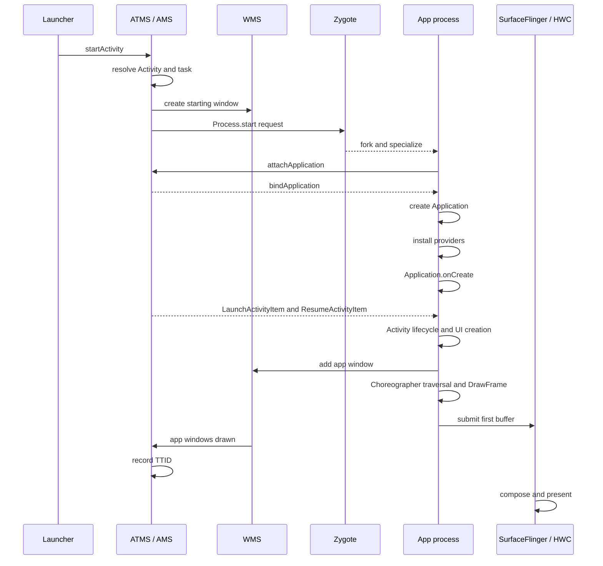

---

status: finalized
title: App 启动全流程
chapter: '8.2'
applicable_versions: Android 8.0 (API 26) - Android 17 (API 37)
last_verified: '2026-04-20'
last_verified_against: AOSP android-15.0.0_r1, AndroidX Activity release notes, Perfetto
  atrace docs, Android Developers baseline profiles docs
confidence: medium
sources:
- type: blog
  path: Cubox/启动优化 ·  基础论 ·  浅析Android启动优化-2022-12-31.md
- type: blog
  path: Cubox/FullyDrawnReporter-一个官方冷启动耗时统计小工具 - 掘金-2023-12-24.md
- type: blog
  path: Cubox/Activity 启动速度分析方法(启动流程分析) - Light.Moon-2022-04-11.md
- type: blog
  path: Cubox/Android 强推的 Baseline Profiles 国内能用吗?我找 Google 工程师求证了! - 掘金-2022-07-17.md
- type: official
  path: developer.android.com/topic/performance/vitals/launch-time
- type: official
  path: https://developer.android.com/jetpack/androidx/releases/activity
- type: official
  path: https://perfetto.dev/docs/getting-started/atrace
- type: official
  path: https://developer.android.com/topic/performance/baselineprofiles
tags:
- cold-start
- warm-start
- hot-start
- TTID
- TTFD
- launch
- startup
- reportFullyDrawn
- baseline-profiles
- app-startup
- contentprovider
- process-creation
related_chapters:
- '8.1'
- '1.2'
- '1.10'
- '2.4'
- '2.5'
- '7.1'
section: '8.2'
pipeline_stage: "ready-to-publish"
task9_state: "reviewed"
task2b_state: fixed
task6_state: "reviewed"
---


# 8.2 App 启动全流程

## 启动性能要回答的三个问题

一次应用启动会经过 Launcher、`system_server`、Zygote、应用进程、SurfaceFlinger 和显示设备。总耗时只能说明启动是否较慢；要找到修复位置，还需要回答三个问题：

1. 本次样本属于冷启动、温启动还是热启动？
2. 测量目标是首帧可见的 TTID，还是主内容可交互的 TTFD？
3. 时间消耗发生在系统调度、进程创建、应用初始化、Activity/UI 创建，还是首帧渲染与合成？

本文以 Android 17 / API 37 的 `android-17.0.0_r1` 为平台源码基线。涉及调度、缺页和存储 I/O 时，内核基线为 `android17-6.18-2026-06_r6`。SDK 初始化、Zygote preload（预加载）以及其他优化手段的收益，都需要在目标设备和实际启动样本上测量。

## 冷启动、温启动与热启动

冷、温、热三种启动类型描述启动前的进程和 Activity 状态，也决定系统需要重新执行哪些工作。

| 类型 | 启动前状态 | 主要工作 | 可复现实验口径 |
| --- | --- | --- | --- |
| 冷启动 | 应用进程不存在 | 创建进程、绑定 Application、创建 Activity、生成首帧 | Macrobenchmark `StartupMode.COLD` |
| 温启动 | 常见口径是进程存活、Activity 需要重建 | 复用进程和 Application，重建 Activity / UI | Macrobenchmark `StartupMode.WARM` |
| 热启动 | 进程和目标 Activity 仍存在 | 将已有 Activity 带回前台，恢复必要状态并更新画面 | Macrobenchmark `StartupMode.HOT` |

官方启动文档对温启动的描述较宽，还包括“进程重建，但可以使用 saved instance state（已保存实例状态）”的情况。Macrobenchmark 为基准测试提供了更窄、可重复的定义：WARM 保留进程并重建 Activity。比较线上数据和实验室数据时，应记录各自采用的定义。

按 Home、按返回键、从 Recents（最近任务）恢复和点击通知，会产生不同的任务栈状态。生命周期日志只能辅助判断，不能单凭出现 `onCreate()` 或 `onResume()` 就推断启动类型。Perfetto 的 Android App Startups、`am start -W` 输出、Macrobenchmark 配置，以及 API 35 及以上版本的 `ApplicationStartInfo.getStartType()` 更适合作为证据。

## Android 17 冷启动时序

下面的时序图省略了权限校验、任务复用、窗口转场和错误分支，只保留影响启动性能的主要步骤：



图中的“app windows drawn”是 Android Framework 记录应用窗口首帧完成的时间边界。这个时间晚于应用生命周期回调返回，但仍早于面板像素完成发光，不能代替面板级光学测量。

### 启动请求、任务解析与 starting window

Launcher 通过 Activity API 发起启动，Binder 请求随后进入 `ActivityTaskManagerService`（ATMS）。系统解析 Intent、权限、后台启动限制，以及 Task 与 Activity 的复用关系，并为本次启动建立计时记录。

冷启动期间，WindowManager 可以先显示 starting window（启动占位窗口）。从 Android 12（API 31）开始，标准路径由 SplashScreen API 统一。starting window 是系统在目标应用首帧之前显示的过渡画面，不会因此提前结束目标 Activity 的 TTID。若再使用专门的 trampoline Activity（只负责跳转的中间 Activity）充当启动页，还会额外增加一次 Activity 创建和窗口转场。

### 进程选择与 Zygote fork

Android 17 的 `ActivityTaskSupervisor.startSpecificActivity()` 会先检查目标进程是否存在，并且是否已经注册了可用的应用线程：

- `WindowProcessController.hasThread()` 为真时，系统可进入 `realStartActivityLocked()`；
- 进程不可用时，系统走 `startProcessAsync()`。

需要创建进程时，调用会继续进入 `ProcessList.startProcessLocked()`，再到 `Process.start()` 和 `ZygoteProcess`。`ZygoteProcess` 通过本地 socket 向匹配目标 ABI 的 Zygote 发送参数。Zygote 通过 fork 复制出子进程，再为它设置 UID、GID、SELinux、运行时参数和入口类；这个过程称为 specialize（专门化）。应用入口通常是 `ActivityThread.main()`。

Zygote 已加载的 Framework 类、资源和部分 native 映射，可以由子进程通过 Copy-on-Write（写时复制）共享：只读时多个进程使用同一物理页，发生写入时才复制。共享页能减少重复加载和内存占用，但不表示应用代码已经完成类加载，也不保证所有共享页在启动时都驻留在内存中。preload 的收益取决于系统版本、厂商列表、内存压力和启动路径，不能用一个固定“覆盖百分比”描述所有设备。

### ActivityThread 与 attachApplication

`ActivityThread.main()` 创建应用主线程环境和主 Looper（消息循环）。`ActivityThread.attach()` 通过 `ActivityManagerService.attachApplication()` 告知系统应用线程已经可用。系统随后向应用侧的 `ApplicationThread` 发送 `bindApplication`，应用主线程处理 `BIND_APPLICATION` 消息并进入 `handleBindApplication()`。

这一阶段在 trace 中通常标为 `BindApplication`，其中包含的工作远多于 `Application.onCreate()`：

- 建立 `LoadedApk`、Context、ClassLoader 和运行时配置；
- 创建并 `attach()` Application；
- 安装系统下发的 ContentProvider；
- 初始化 Instrumentation；
- 调用 `Application.onCreate()`；
- 处理字体、网络安全和图形环境等进程级配置。

Android 17 的 `ActivityThread.handleBindApplication()` 按照以下顺序执行：先调用 `makeApplicationInner()`，再调用 `installContentProviders()`，最后由 `Instrumentation.callApplicationOnCreate()` 进入应用回调。因此，SDK 用于自动初始化的 Provider 会在 `Application.onCreate()` 之前运行；只测量 Application 回调会漏掉这部分开销。

### ClientTransaction 与 Activity 生命周期

进程完成附着后，`ActivityTaskSupervisor` 会构造 `LaunchActivityItem`；如果 Activity 还需要进入前台，则同时附带 `ResumeActivityItem`。这些对象属于 `ClientTransaction`，用于把服务端决定的生命周期操作发送给应用。`LaunchActivityItem.execute()` 调用应用侧的 `handleLaunchActivity()`，随后进入 `performLaunchActivity()`。

`performLaunchActivity()` 创建 Activity 实例和对应的 Activity Context，执行 `Activity.attach()`，再调用 `onCreate()`。`TransactionExecutor` 根据目标生命周期继续执行 `onStart()` 和 `onResume()`。启动 Activity 中常见的首屏工作包括：

- `setContentView()` 中的 XML inflate（解析并创建 View），或 Compose `setContent {}` 后的初始 composition（组合）；
- ViewModel、依赖注入和 saved state 恢复；
- 同步资源解析、主题和 drawable 创建；
- 首屏数据读取与 UI 状态构建。

系统并不要求每个 Activity 都调用 `setContentView()`。无界面、透明、跳板或延迟安装内容的 Activity 都可能采用其他路径，所以“Activity 启动必然 inflate XML”只适用于典型的 View 页面。

### 窗口、遍历与首帧

Activity 进入 resume 阶段后，DecorView 会被加入 WindowManager；应用进程创建 `ViewRootImpl`，并向 WMS 注册窗口。首帧的应用侧路径通常包括：

1. `ViewRootImpl.scheduleTraversals()` 向 Choreographer 请求一次 traversal（界面遍历）；
2. VSync 到来后执行 `performTraversals()`；
3. View 页面完成 measure、layout 和 draw，Compose 页面完成相应的 composition、layout 和 draw；
4. UI Thread 更新渲染节点，RenderThread 执行 `DrawFrame` 并提交 GPU 工作；
5. buffer 提交给 SurfaceFlinger；
6. SurfaceFlinger 选择 buffer、完成合成，并交给 HWC present（提交显示）。

`ActivityRecord.onWindowsDrawn()` 会调用 `ActivityMetricsLogger.notifyWindowsDrawn()`。Android 17 在这里通过 `SystemClock.uptimeNanos()` 记录 `START_TIMESTAMP_FIRST_FRAME`，并结束 Framework 统计的窗口绘制启动区间，这就是 TTID 的平台计量边界。SurfaceFlinger 合成、HWC present 和面板扫描仍可能发生在这个时间点之后。

## TTID 与 TTFD

### TTID：目标 Activity 的首帧

TTID（Time to Initial Display，首帧显示时间）统计从系统收到启动请求，到目标 Activity 首帧完成所用的时间。冷启动包含进程创建、Application 和 Activity 初始化；温启动会跳过部分进程工作；热启动主要反映 Activity 恢复和重新显示。

Logcat 中的 `Displayed` 行和 Android Vitals 的启动时间以 TTID 为主要口径。Android Vitals 把以下 TTID 归为 excessive startup：

- 冷启动达到 5 秒；
- 温启动达到 2 秒；
- 热启动达到 1.5 秒。

这些数值是 Google Play 判定启动过长的告警边界，并非优秀体验的目标。当前 Android 性能度量指南给出的建议更严格：冷启动低于 500 ms、温启动低于 200 ms、热启动低于 150 ms。产品仍应结合设备档位和业务入口，设定 P50、P90、P95、P99 以及超过目标的样本占比。

首帧可能只包含 Splash 之后的页面外壳、骨架屏或空列表，因此 TTID 变短不代表页面内容已经可用。

### TTFD：应用声明的可用状态

TTFD（Time to Full Display，完整显示时间）使用与 TTID 相同的启动起点，终点是应用报告 fully drawn。应用应在主内容已经显示、主要交互已经可用时调用 `reportFullyDrawn()`。如果图片、列表或本地数据属于首屏可用条件，就应纳入这个状态；与首屏无关的预取、埋点上传和后台同步则不应延后 TTFD。

Android 17 的 `ActivityMetricsLogger.notifyFullyDrawn()` 会检查窗口是否已经 drawn（完成首帧绘制）。如果应用过早调用，Framework 会推迟报告，确保 TTFD 不早于 TTID。这项保护无法替应用判断业务是否已经可用；就绪条件定义错误，仍会得到失真的 TTFD。

AndroidX `ComponentActivity` 中的 `FullyDrawnReporter` 可以汇总多个异步就绪条件。下面的示例在等待首屏数据期间增加一个 reporter 计数：

```kotlin
override fun onCreate(savedInstanceState: Bundle?) {
    super.onCreate(savedInstanceState)
    setContentView(R.layout.activity_home)

    fullyDrawnReporter.addReporter()
    lifecycleScope.launch {
        try {
            viewModel.awaitInitialContent()
        } finally {
            fullyDrawnReporter.removeReporter()
        }
    }
}
```

所有 reporter 计数都移除后，`FullyDrawnReporter` 才允许调用 `reportFullyDrawn()`。`finally` 可以保证任务失败或取消时也释放计数；页面还应把错误状态设计成可交互状态，避免 TTFD 一直无法上报。

Compose 页面可以使用 `ReportDrawn`、`ReportDrawnWhen` 或 `ReportDrawnAfter` 表达相同的就绪条件。判断依据应是用户能否使用页面，无须等待所有后台任务结束。

## API 35+：ApplicationStartInfo

Android 15（API 35）引入了 `ApplicationStartInfo`，用于描述进程为何启动、由哪类组件触发、属于哪种启动类型、当前到达什么状态，以及各阶段的 monotonic（单调递增时钟）纳秒时间戳。一条记录可能对应 Activity，也可能由 Service、Provider、Broadcast 或其他原因触发进程启动，因此读取后应先检查 component、reason 和 startup state。

常用字段如下：

| 字段 | 含义 | 读取边界 |
| --- | --- | --- |
| `getStartupState()` | `STARTED`、`ERROR` 或 `FIRST_FRAME_DRAWN` | 返回时记录可能仍在收集中 |
| `getStartType()` | `COLD`、`WARM`、`HOT` 或 `UNSET` | `FIRST_FRAME_DRAWN` 状态才保证已设置 |
| `getStartComponent()` | 触发进程的组件类型 | 不要把 Service start 当成 Activity TTID |
| `getReason()` | Launcher、Job、Provider、Service 等具体原因 | 用于拆分入口 |
| `getStartupTimestamps()` | 各阶段的 monotonic 纳秒时间戳 | 不同状态和启动类型拥有不同 key |

API 只保证部分状态下必定存在对应时间戳，读取时应按以下边界处理：

- `START_TIMESTAMP_LAUNCH` 在 `STARTED` 状态可用；
- `FIRST_FRAME_DRAWN` 状态还保证 bindApplication、Application onCreate 调用点和 first frame 时间戳存在；
- `FULLY_DRAWN` 依赖应用调用 `reportFullyDrawn()`；
- `FORK`、initial RenderThread frame 和 SurfaceFlinger composition complete 都应作为可选 key 读取。

下面的代码只在起止 key 都存在时计算阶段差值，避免把缺失字段误当成零：

```kotlin
@RequiresApi(35)
fun readLatestStart(context: Context): Map<String, Double?> {
    val activityManager = context.getSystemService(ActivityManager::class.java)
    val info = activityManager
        .getHistoricalProcessStartReasons(1)
        .firstOrNull()
        ?: return emptyMap()
    val timestamps = info.startupTimestamps

    fun deltaMs(startKey: Int, endKey: Int): Double? {
        val start = timestamps[startKey] ?: return null
        val end = timestamps[endKey] ?: return null
        return (end - start) / 1_000_000.0
    }

    return mapOf(
        "launch_to_fork_ms" to deltaMs(
            ApplicationStartInfo.START_TIMESTAMP_LAUNCH,
            ApplicationStartInfo.START_TIMESTAMP_FORK,
        ),
        "bind_to_application_onCreate_entry_ms" to deltaMs(
            ApplicationStartInfo.START_TIMESTAMP_BIND_APPLICATION,
            ApplicationStartInfo.START_TIMESTAMP_APPLICATION_ONCREATE,
        ),
        "launch_to_first_frame_ms" to deltaMs(
            ApplicationStartInfo.START_TIMESTAMP_LAUNCH,
            ApplicationStartInfo.START_TIMESTAMP_FIRST_FRAME,
        ),
        "launch_to_sf_composition_ms" to deltaMs(
            ApplicationStartInfo.START_TIMESTAMP_LAUNCH,
            ApplicationStartInfo.START_TIMESTAMP_SURFACEFLINGER_COMPOSITION_COMPLETE,
        ),
    )
}
```

`START_TIMESTAMP_APPLICATION_ONCREATE` 记录的是回调开始点，因此 `bind → onCreate entry` 主要覆盖回调之前的绑定、Application 创建和 Provider 安装，不是 `Application.onCreate()` 自身的执行时长。若要测量回调本身，需要加入自定义 trace section 或进行方法级分析。

同一个 `startupTimestamps` map 中的时间戳可以直接相减。若要把 monotonic 时间戳叠加到 Perfetto，则应使用 trace clock snapshot（时钟快照）转换时钟域，不能假设 API 数值与 trace 主时间轴使用相同零点。`getHistoricalProcessStartReasons()` 还可能返回尚未完成的记录，此时缺少部分字段属于正常状态。

## 四类测量工具

### `adb shell am start -W`

下面的命令会先停止目标应用，再发起启动并等待结果，适合快速检查单次冷启动和 `Displayed` 时间：

```bash
adb shell am start -S -W \
  -a android.intent.action.MAIN \
  -c android.intent.category.LAUNCHER \
  -n com.example.app/.MainActivity
```

`-S` 会在启动前停止目标应用，便于构造冷启动，但也会改变原有现场状态。输出中的 `ThisTime`、`TotalTime` 和 `WaitTime` 分别覆盖不同的等待范围；遇到 trampoline、重定向或多个 Activity 连续启动时，不能默认三者相等。这条命令适合冒烟检查，也就是快速确认功能和大致耗时，不能代替受控的多轮基准测试。

### Logcat

`Displayed package/.Activity: +...` 对应 Framework 记录的 TTID，调用 `reportFullyDrawn()` 后则会出现 `Fully drawn ...`。有些 `Displayed` 行还带有 `total` 字段，可以覆盖在当前 Activity 之前已经启动但尚未显示的 Activity；分析跳板页时应保留这段信息。

Logcat 时间可以帮助定位样本，但记录日志本身会产生一定扰动，而且缺少线程调度、Binder、I/O 和渲染细节。

### Macrobenchmark

Macrobenchmark 可以固定启动类型、编译模式、迭代次数和测试入口，并自动保存 Perfetto trace。下面的测试测量冷启动 TTID；如果应用正确报告 fully drawn，也会同时产生 TTFD：

```kotlin
@get:Rule
val benchmarkRule = MacrobenchmarkRule()

@Test
fun coldStartup() = benchmarkRule.measureRepeated(
    packageName = "com.example.app",
    metrics = listOf(StartupTimingMetric()),
    compilationMode = CompilationMode.Partial(),
    startupMode = StartupMode.COLD,
    iterations = 10,
    setupBlock = {
        pressHome()
    },
) {
    startActivityAndWait()
}
```

`StartupMode.COLD` 会在两次迭代之间终止应用进程；WARM 和 HOT 则按照各自定义保留状态。比较 Baseline Profile 前后结果时，需要固定 `CompilationMode`，否则编译状态差异可能被误认为代码优化收益。

### Perfetto

Perfetto 用于解释启动时间花在了哪个阶段。界面中的 Android App Startups derived metric（派生指标）会给出启动区间和类型，随后可以展开检查：

- `system_server` 的 `launchingActivity#...`、进程创建和 Binder；
- 应用主线程的 `BindApplication`、`activityStart`、class loading、ContentProvider 和自定义 trace；
- View 的 `performTraversals`，Compose 的 composition/layout/draw；
- RenderThread `DrawFrame`、GPU、FrameTimeline；
- SurfaceFlinger、HWC 和厂商 display trace。

较新的 trace processor 标准库可以直接查询启动类型、TTID 和 TTFD。下面的 SQL 会列出指定包的启动记录，并关联首帧和完整显示时间：

```sql
INCLUDE PERFETTO MODULE android.startup.startups;
INCLUDE PERFETTO MODULE android.startup.time_to_display;

SELECT
  s.startup_id,
  s.startup_type,
  s.dur / 1e6 AS startup_slice_ms,
  d.time_to_initial_display / 1e6 AS ttid_ms,
  d.time_to_full_display / 1e6 AS ttfd_ms,
  d.ttid_frame_id,
  d.ttfd_frame_id
FROM android_startups AS s
LEFT JOIN android_startup_time_to_display AS d
  USING (startup_id)
WHERE s.package = 'com.example.app'
ORDER BY s.ts;
```

如果应用没有报告 TTFD，或 trace 没有覆盖对应帧，`ttfd_ms` 可以为空。`startup_slice_ms` 和 TTID 的观测终点也可能不同，分析时应以字段定义和 frame id 为准。

## Application 与 Provider 的启动成本

### ContentProvider 早于 Application.onCreate

应检查 Manifest 合并后出现的所有 Provider。WorkManager、Firebase、图片库、APM（应用性能监控）、广告、推送和自定义 SDK 都可能通过 Provider 自动初始化。Provider 的 `onCreate()` 在应用主线程执行，并且早于 `Application.onCreate()`；同步磁盘、数据库、Binder 或类加载都会延迟 Activity 创建。

检查时应同时查看：

- 应用源 Manifest 与依赖合并后的最终 Manifest；
- `BindApplication` 内 Provider 安装相关 slice；
- SDK 是否提供关闭自动初始化或按需初始化的配置；
- 当前启动入口是否需要这项初始化，例如 Launcher 入口和 push / service 进程可能依赖不同组件。

### Application.onCreate

Application 回调适合建立所有进程入口都需要、且耗时可控的进程级状态。常见风险包括：

- 同步读取 SharedPreferences、文件、数据库或 keystore；
- 主线程等待 Binder、锁、线程池 `Future` 或网络；
- 一次创建完整依赖图和大量单例；
- 初始化当前入口用不到的 SDK；
- 大量反射、序列化、类加载和 native library 加载；
- 为“异步化”同时启动过多任务，争抢启动线程需要的 CPU、I/O 和内存带宽。

将工作移到后台线程只改变了执行位置。如果后台任务占满高性能 CPU 核心、触发大量缺页，或持有主线程需要的锁，TTID 仍可能变差。每项延迟初始化都应明确触发条件、执行线程、依赖、完成时限和失败策略。

### 多 DEX 与 ART

Android 8.0 到 Android 17 的 ART 原生支持多 DEX。Android 5.0 以下版本中 `MultiDex.install()` 的解压和安装问题属于历史兼容路径，不应套用到本文的平台基线。

多 DEX 仍会影响现代 Android 的启动表现：类在 DEX 文件中的布局、页缓存、校验、类加载，以及解释执行、JIT、AOT 等编译状态都会改变启动开销。应通过 class loading slice、文件 I/O、编译过滤器和 Macrobenchmark 的 compilation mode 验证具体原因，不能把所有 DEX 成本都归因于“方法数超过 65536”。

## 首帧 UI 的成本

### View 页面

XML 页面通常依次经历 inflate、measure、layout 和 draw。inflate 包括解析 XML 与主题属性、构造 View 和加载相关资源；measure / layout 的开销取决于树结构、自定义 View、约束和重复测量；draw 还可能触发 drawable 解析、文本布局、bitmap 解码或 GPU 上传。

减少层级只是可以尝试的手段之一。`ConstraintLayout`、嵌套容器和自定义布局中哪一种更快，应由首帧 trace 与基准测试判断。`AsyncLayoutInflater` 也受 View 线程安全限制；如果 Activity 必须等待异步 inflate 完成后才能显示，那么工作虽然换了线程，TTID 却未必缩短。

### Compose 页面

Compose 首帧包含初始 composition、measure / place 和 draw。启动期间读取磁盘、执行复杂集合变换、同步创建图片，或一次组合大量不可见节点，都会延长主线程或 RenderThread 路径。可以根据可见状态进行条件组合，推迟次要 tab、错误详情和屏外内容，但要避免首帧之后立即出现一次耗时更长的重组。

### 图片与资源

首帧只应同步准备当前可见且必需的资源。图片解码、`VectorDrawable` rasterization（栅格化）、字体加载和主题资源解析都可能出现在 trace 中。使用占位内容时应预留真实内容的尺寸，避免资源到达后发生大范围重新布局。减少首帧工作不能以界面无法交互或内容闪烁为代价。

## Profile 优化的三层含义

### Baseline Profile

Baseline Profile 会随应用或库一起交付热点类和方法规则，ART 可以对覆盖路径进行 AOT（安装前 / 安装时）编译，从首次运行开始减少解释执行和 JIT（运行时即时编译）。官方文档给出的“覆盖代码路径约有 30% 执行速度提升”是总体经验值，不表示每个应用的 TTID 都会缩短 30%。

生成 profile 后要确认：

- 启动、通知、深链等主要入口是否被覆盖；
- release 构建经过 R8 后，规则仍被正确重写和打包；
- 目标设备上的安装状态与编译过滤器符合预期；
- `CompilationMode.None`、`Partial` 与 `Full` 的 Macrobenchmark 差异符合解释。

### Startup Profile

Startup Profile 是 Baseline Profile 中用于构建期 DEX layout（文件布局）的规则子集。R8 / D8 根据它安排启动相关类和方法，减少启动期间跨 DEX 读取和页面访问。它解决的是文件布局问题，与运行时 AOT 可以同时使用。规则过多、导致启动代码仍分散到多个 DEX 时，布局收益会下降。

### Cloud Profile

Cloud Profile 由 Google Play 汇总真实用户设备上的热点，再提供给后续安装或更新应用的设备，支持 Android 9（API 28）及更高版本。它需要积累足够样本，可能在版本发布数小时到数天后才开始分发。没有 Google Play 的渠道不能假定存在 Cloud Profile；APK 内的 Baseline Profile、ProfileInstaller 和设备本地 ART 优化仍可独立工作，具体安装行为需要按分发渠道验证。

## AndroidX App Startup

AndroidX App Startup 让多个支持它的组件共享一个 `InitializationProvider`，并通过 `Initializer.dependencies()` 声明初始化顺序。这样可以减少多个独立 Provider 带来的框架开销，也更容易看清组件之间的依赖关系。

下面的 `Initializer` 表示 Telemetry 必须在配置组件完成初始化后才能创建：

```kotlin
class TelemetryInitializer : Initializer<Telemetry> {
    override fun create(context: Context): Telemetry =
        Telemetry.create(context)

    override fun dependencies(): List<Class<out Initializer<*>>> =
        listOf(ConfigInitializer::class.java)
}
```

App Startup 会先初始化 `ConfigInitializer`，再调用 `TelemetryInitializer.create()`。通过 manifest metadata 注册的 `Initializer` 仍在 `InitializationProvider.onCreate()` 中执行，并且早于 `Application.onCreate()`。共享 Provider 不会自动把工作移到后台线程，也不会自动推迟初始化时间。

如果组件无须在首帧前运行，应从 manifest 中移除对应 metadata，再按需调用 `AppInitializer.initializeComponent()`。尚未适配 App Startup 的第三方 Provider 不会被框架自动接管，需要使用 SDK 提供的关闭开关，或向供应方确认其他初始化入口。

## 16 KB page size 的边界

从 Android 15 开始，AOSP 支持使用 16 KB page size（内存页大小）的设备。包含 native library 的应用必须确保 APK zip alignment、ELF segment alignment（压缩包和 ELF 段对齐）、预编译依赖，以及代码中对 page size 的假设都兼容；纯 Java / Kotlin 应用也应在 16 KB 环境中进行回归测试。

Google 的初始测试显示，在系统存在内存压力时，样本中的应用启动时间平均降低 3.16%，部分样本改善更多。这个结果只描述一组受控测试，不能视为所有应用或设备的收益承诺。更大的页会同时改变页表、TLB（地址转换缓存）、页内空间浪费、缺页和 COW 粒度，不能从“页大小变为四倍”直接推出“缺页次数减少四倍”。

比较 4 KB 和 16 KB 环境下的启动表现时，应使用同一设备或等价平台配置，固定 APK、编译状态、缓存、温度和内存压力，并分别查看缺页、I/O、CPU time 和 TTID。只比较 `BindApplication` 之前的一段时间，无法覆盖整个启动过程。

## 诊断顺序

1. 固定入口、账号状态、缓存、启动类型、编译模式和设备状态。
2. 同时记录 TTID 与 TTFD，确认 `reportFullyDrawn()` 语义。
3. 从 Perfetto Android App Startups 区间定位最慢样本。
4. 将时间分为进程启动、BindApplication、Provider、Application、Activity、UI Thread、RenderThread / GPU 和 SurfaceFlinger 等阶段。
5. 对长片段检查线程状态、Binder 对端、锁、I/O、缺页、GC、CPU 频率和温控。
6. 用自定义 trace 缩小应用代码的排查范围，再选择推迟、移除、缓存、并行或 Profile 优化。
7. 在相同测试协议下复测多轮，报告分位数和回归样本。

性能采集本身也会产生额外开销。方法 trace 比系统 trace 更重，适合在排查范围已经缩小后使用。冷缓存、force-stop、重启设备和清除数据代表不同的实验条件，不能全部标成同一种“冷启动”。

## 常见误判

### “冷启动优化等于缩短 Application.onCreate”

Provider、进程创建、类加载、Activity、首帧 UI、RenderThread 和系统合成都可能占据主要时间，`Application.onCreate()` 只是其中一段。

### “Displayed 就是用户已经能操作”

`Displayed` 代表 TTID。首帧可能仍然是骨架屏、空数据或禁用状态，业务可用时间应通过 TTFD 或单独的交互指标表示。

### “reportFullyDrawn 越早越好”

过早上报会让 TTFD 失去原有含义。Framework 只能保证它不早于窗口首帧，无法判断登录数据、列表内容或主要按钮是否已经可用。

### “后台初始化不会影响启动”

后台线程仍会与启动路径共享 CPU、I/O、内存带宽、Binder 线程池和锁，需要验证二者是否发生资源竞争。

### “Baseline Profile 能修复所有启动问题”

Profile 只能优化字节码执行和 DEX 布局。同步网络、慢 Binder、数据库锁、图片解码、复杂布局和 GPU / HWC 瓶颈仍需分别处理。

### “TTID 再加固定的两个 VSync 就是触摸到像素”

启动请求之前的输入路径，以及之后的 SurfaceFlinger 调度、HWC present 和面板扫描，都会随设备与刷新相位变化。API 35 及以上版本的 SurfaceFlinger composition timestamp 可以补充软件侧时间点，面板级结果仍需外部测量。

## 版本边界

- Android 8.0 到 Android 8.1（API 26–27）使用 ART profile-guided compilation，但没有 Google Play Cloud Profile 的 API 28+ 分发口径。
- Android 9（API 28）及更高版本可从 Google Play 获得 Cloud Profile，前提是渠道和样本满足条件。
- Android 12（API 31）统一 SplashScreen，并提供 FrameTimeline 诊断首帧。
- Android 15（API 35）加入 `ApplicationStartInfo`，AOSP 同期开始支持 16 KB page-size 设备。
- Android 17（API 37）是本文核对的平台上限。源码路径和时序以 `android-17.0.0_r1` 为准，厂商私有的启动加速器不属于 AOSP 保证。

## Android 17 源码锚点

- [`ActivityTaskSupervisor.java`](https://android.googlesource.com/platform/frameworks/base/+/android-17.0.0_r1/services/core/java/com/android/server/wm/ActivityTaskSupervisor.java)：进程复用判断、`startSpecificActivity()` 与 `LaunchActivityItem`。
- [`ProcessList.java`](https://android.googlesource.com/platform/frameworks/base/+/android-17.0.0_r1/services/core/java/com/android/server/am/ProcessList.java)：`startProcessLocked()` 与 `Process.start()`。
- [`Process.java`](https://android.googlesource.com/platform/frameworks/base/+/android-17.0.0_r1/core/java/android/os/Process.java)：应用进程启动入口。
- [`ZygoteProcess.java`](https://android.googlesource.com/platform/frameworks/base/+/android-17.0.0_r1/core/java/android/os/ZygoteProcess.java)：Zygote socket 通信。
- [`ActivityThread.java`](https://android.googlesource.com/platform/frameworks/base/+/android-17.0.0_r1/core/java/android/app/ActivityThread.java)：`ActivityThread.main()`、`handleBindApplication()`、Provider 安装和 Activity 生命周期。
- [`LaunchActivityItem.java`](https://android.googlesource.com/platform/frameworks/base/+/android-17.0.0_r1/core/java/android/app/servertransaction/LaunchActivityItem.java)：应用侧 Activity launch transaction。
- [`ViewRootImpl.java`](https://android.googlesource.com/platform/frameworks/base/+/android-17.0.0_r1/core/java/android/view/ViewRootImpl.java)：窗口接入、遍历与首帧调度。
- [`ActivityRecord.java`](https://android.googlesource.com/platform/frameworks/base/+/android-17.0.0_r1/services/core/java/com/android/server/wm/ActivityRecord.java)：窗口 drawn 回调。
- [`ActivityMetricsLogger.java`](https://android.googlesource.com/platform/frameworks/base/+/android-17.0.0_r1/services/core/java/com/android/server/wm/ActivityMetricsLogger.java)：TTID、TTFD 与 ApplicationStartInfo 时间戳。
- [`ApplicationStartInfo.java`](https://android.googlesource.com/platform/frameworks/base/+/android-17.0.0_r1/core/java/android/app/ApplicationStartInfo.java)：启动类型、状态、原因与 timestamp key。

## 官方资料

- [App startup time: TTID, TTFD and startup types](https://developer.android.com/topic/performance/vitals/launch-time)
- [App startup analysis and optimization](https://developer.android.com/topic/performance/appstartup/analysis-optimization)
- [Overview of measuring app performance](https://developer.android.com/topic/performance/measuring-performance)
- [Macrobenchmark overview](https://developer.android.com/topic/performance/benchmarking/macrobenchmark-overview)
- [Macrobenchmark metrics](https://developer.android.com/topic/performance/benchmarking/macrobenchmark-metrics)
- [`ApplicationStartInfo` API](https://developer.android.com/reference/android/app/ApplicationStartInfo)
- [PerfettoSQL Android startup modules](https://perfetto.dev/docs/analysis/stdlib-docs#android-startup-startups)
- [Baseline Profiles overview](https://developer.android.com/topic/performance/baselineprofiles/overview)
- [Startup Profiles and DEX layout](https://developer.android.com/topic/performance/startupprofiles/dex-layout-optimizations)
- [AndroidX App Startup](https://developer.android.com/topic/libraries/app-startup)
- [Support 16 KB page sizes](https://developer.android.com/guide/practices/page-sizes)

## 小结

冷启动从 ATMS 接收启动请求开始，依次经过 Zygote fork、ActivityThread 绑定、Provider 和 Application 初始化、Activity 生命周期，再到首帧绘制、SurfaceFlinger 合成和 HWC present。温启动与热启动复用的状态不同，测量前必须明确采用哪一种定义。

TTID 回答“首帧何时出现”，TTFD 回答“主内容何时可用”。`am start -W` 和 Logcat 适合快速检查，Macrobenchmark 用于可重复对比，`ApplicationStartInfo` 提供结构化时间点，Perfetto 用于逐阶段归因。统一这些测量口径后，启动优化结果才能被复测和解释。
