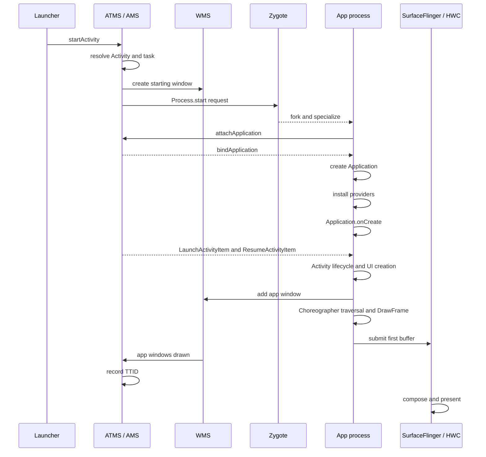

---

status: finalized
title: App 启动全流程
chapter: '8.2'
applicable_versions: Android 8.0 (API 26) - Android 17 (API 37)
last_verified: '2026-04-20'
last_verified_against: AOSP android-15.0.0_r1, AndroidX Activity release notes, Perfetto
  atrace docs, Android Developers baseline profiles docs
confidence: medium
sources:
- type: blog
  path: Cubox/启动优化 ·  基础论 ·  浅析Android启动优化-2022-12-31.md
- type: blog
  path: Cubox/FullyDrawnReporter-一个官方冷启动耗时统计小工具 - 掘金-2023-12-24.md
- type: blog
  path: Cubox/Activity 启动速度分析方法(启动流程分析) - Light.Moon-2022-04-11.md
- type: blog
  path: Cubox/Android 强推的 Baseline Profiles 国内能用吗?我找 Google 工程师求证了! - 掘金-2022-07-17.md
- type: official
  path: developer.android.com/topic/performance/vitals/launch-time
- type: official
  path: https://developer.android.com/jetpack/androidx/releases/activity
- type: official
  path: https://perfetto.dev/docs/getting-started/atrace
- type: official
  path: https://developer.android.com/topic/performance/baselineprofiles
tags:
- cold-start
- warm-start
- hot-start
- TTID
- TTFD
- launch
- startup
- reportFullyDrawn
- baseline-profiles
- app-startup
- contentprovider
- process-creation
related_chapters:
- '8.1'
- '1.2'
- '1.10'
- '2.4'
- '2.5'
- '7.1'
section: '8.2'
drafted_date: '2026-04-01'
drafted_by: openclaw-task2a
reviewed_date: "2026-05-24"
reviewed_by: "openclaw-task6"
polish_count: 1
polish_date: '2026-04-06'
polish_by: task2b-polish
pipeline_stage: "ready-to-publish"
task6_result: "pass-light-edit"
task9_state: "reviewed"
task2b_state: fixed
task2b_result: fixed
last_task2b_at: "2026-06-04T10:50:00+08:00"
task9_reviewed_date: "2026-06-05"
task9_reviewed_by: "openclaw-task9"
last_task9_at: "2026-06-05T18:32:25+08:00"
task9_review_notes: "2026-06-05 Task9 深度复审: pass-tech-review。P0 0 / P1 0 / P2 0；ApplicationStartInfo 常量、16KB page size 数据、Perfetto/TTID 口径核对通过；无 queue pending。"
last_task9_review_log: "logs/deep-review/2026-06-05-18-deep-review.md"
p0: 0
p1: 0
p2: 0
last_task6_at: "2026-05-24T13:10:00+08:00"
last_task6_review_log: "logs/review/2026-05-24-13-review.md"
task6_review_notes: "2026-05-24 13:10 Task6 复审：pass-light-edit。L1/L2 小修 18 处；既有 Task9 P1/P2 pending 队列继续由 Task2B 处理，Task6 未新增回炉。"
last_task9_audit: "2026-05-24"
last_task9_audit_log: "logs/deep-review/2026-05-24-02-audit.md"
task6_reviewed_date: "2026-05-24"
deepseek_cn_review_state: done
last_deepseek_cn_review_at: 2026-06-05
task6_state: "reviewed"
last_task6_audit: "2026-06-23"
---


# 8.2 App 启动全流程

## 启动性能要回答的三个问题

一次应用启动横跨 Launcher、`system_server`、Zygote、应用进程、SurfaceFlinger 和显示设备。把总耗时压成一个数字，只能说明结果慢；修复工作还需要回答三个问题：

1. 本次样本属于冷启动、温启动还是热启动？
2. 目标是首帧可见的 TTID，还是主内容可交互的 TTFD？
3. 时间消耗发生在系统调度、进程创建、应用初始化、Activity/UI 创建，还是首帧渲染与合成？

平台源码锚点为 Android 17 / API 37 / `android-17.0.0_r1`。涉及调度、缺页和存储 I/O 时，内核基线为 `android17-6.18-2026-06_r6`。SDK 初始化、Zygote preload 或其他优化手段的收益都需要结合设备与样本测量。

## 冷启动、温启动与热启动

三种启动类型描述启动前的进程和 Activity 状态。它们决定系统需要重做哪些工作。

| 类型 | 启动前状态 | 主要工作 | 可复现实验口径 |
| --- | --- | --- | --- |
| 冷启动 | 应用进程不存在 | 创建进程、绑定 Application、创建 Activity、生成首帧 | Macrobenchmark `StartupMode.COLD` |
| 温启动 | 常见口径是进程存活、Activity 需要重建 | 复用进程和 Application，重建 Activity/UI | Macrobenchmark `StartupMode.WARM` |
| 热启动 | 进程和目标 Activity 仍存在 | 将已有 Activity 带回前台，恢复必要状态并更新画面 | Macrobenchmark `StartupMode.HOT` |

官方启动文档对温启动的描述较宽，还包含“进程重建但可利用 saved instance state”的情况。Macrobenchmark 为测试提供了更窄且可重复的定义：WARM 保留进程并重建 Activity。线上数据与实验室数据对比时，应记录采用哪一种定义。

按 Home、按返回键、从 Recents 恢复和点击通知会产生不同任务栈状态。生命周期日志只能辅助判断，不能单凭出现 `onCreate()` 或 `onResume()` 就推断启动类型。Perfetto 的 Android App Startups、`am start -W` 输出、Macrobenchmark 配置，以及 API 35+ 的 `ApplicationStartInfo.getStartType()`更适合作为证据。

## Android 17 冷启动时序

下面的时序图省略权限校验、任务复用、窗口转场和错误分支，保留影响启动性能的主路径：



图中的“app windows drawn”是 Android Framework 记录首帧完成的边界。它比应用代码返回更靠后，但仍不能替代面板级光学测量。

### 启动请求、任务解析与 starting window

Launcher 通过 Activity API 发起启动，Binder 请求进入 ActivityTaskManagerService（ATMS）。系统解析 Intent、权限、后台启动限制、Task 与 Activity 复用关系，并为本次启动建立度量状态。

冷启动期间，WindowManager 可以先显示 starting window。Android 12（API 31）起，标准路径由 SplashScreen API 统一。starting window 属于系统提供的过渡画面，目标应用首帧出现前它就可能可见；它不会把目标 Activity 的 TTID 提前结束。使用专门的 trampoline Activity 充当启动页，反而会增加一次 Activity 创建与转场。

### 进程选择与 Zygote fork

Android 17 的 `ActivityTaskSupervisor.startSpecificActivity()` 会先检查目标进程是否存在且已持有应用线程：

- `WindowProcessController.hasThread()` 为真时，系统可进入 `realStartActivityLocked()`；
- 进程不可用时，系统走 `startProcessAsync()`。

进程创建继续进入 `ProcessList.startProcessLocked()`，再调用 `Process.start()` 与 `ZygoteProcess`。`ZygoteProcess` 通过本地 socket 向适配 ABI 的 Zygote 发送参数。Zygote fork 子进程并完成 UID、GID、SELinux、运行时参数和入口类等专门化工作，应用入口通常是 `ActivityThread.main()`。

Zygote 已经加载的 Framework 类、资源与部分 native 映射可由子进程通过 Copy-on-Write 共享。共享页减少重复加载与内存占用，但不代表应用代码已经完成类加载，也不保证所有共享页在启动时都驻留。preload 的收益取决于系统版本、厂商列表、内存压力和启动路径，不存在可移植的“覆盖百分比”。

### ActivityThread 与 attachApplication

`ActivityThread.main()` 创建主线程环境和主 Looper。`ActivityThread.attach()` 通过 ActivityManagerService 的 `attachApplication()` 报告应用线程已经可用。系统随后向应用侧 `ApplicationThread` 发送 `bindApplication`，应用主线程处理 `BIND_APPLICATION` 消息并进入 `handleBindApplication()`。

这一阶段的 trace 里常见 `BindApplication`。它包含的工作远多于 `Application.onCreate()`：

- 建立 `LoadedApk`、Context、ClassLoader 与运行时配置；
- 创建并 `attach()` Application；
- 安装系统下发的 ContentProvider；
- 初始化 Instrumentation；
- 调用 `Application.onCreate()`；
- 处理与字体、网络安全、图形环境等有关的进程级配置。

Android 17 的 `ActivityThread.handleBindApplication()` 源码顺序很明确：`makeApplicationInner()` 之后调用 `installContentProviders()`，再由 `Instrumentation.callApplicationOnCreate()` 进入应用回调。由此可知，SDK 的自动初始化 Provider 会发生在 `Application.onCreate()` 之前；只测 Application 回调会漏掉这部分成本。

### ClientTransaction 与 Activity 生命周期

进程附着后，`ActivityTaskSupervisor` 构造 `LaunchActivityItem`，并在需要前台显示时附带 `ResumeActivityItem`。`LaunchActivityItem.execute()` 调用应用侧 `handleLaunchActivity()`，随后进入 `performLaunchActivity()`。

`performLaunchActivity()` 创建 Activity 实例，建立 Activity Context，执行 `Activity.attach()`，再调用 `onCreate()`。TransactionExecutor 根据目标生命周期补齐 `onStart()` 和 `onResume()`。启动 Activity 中常见的首屏工作包括：

- `setContentView()` 的 XML inflate，或 Compose `setContent {}` 后的初始 composition；
- ViewModel、依赖注入与 saved state 恢复；
- 同步资源解析、主题和 drawable 创建；
- 首屏数据读取与 UI 状态构建。

系统不要求每个 Activity 都调用 `setContentView()`。无界面、透明、跳板或延迟安装内容的 Activity 都可能采用其他路径，因此“Activity 启动必然 inflate XML”只适用于典型 View 页面。

### 窗口、遍历与首帧

Activity 进入 resume 处理后，DecorView 被加入 WindowManager，应用进程创建 `ViewRootImpl` 并向 WMS 注册窗口。首帧的应用侧主路径通常包括：

1. `ViewRootImpl.scheduleTraversals()` 请求 Choreographer traversal；
2. VSync 到来后执行 `performTraversals()`；
3. View 页面完成 measure、layout、draw，Compose 页面完成相应 composition、layout 和 draw；
4. UI Thread 更新渲染节点，RenderThread 执行 `DrawFrame` 并提交 GPU 工作；
5. buffer 提交给 SurfaceFlinger；
6. SurfaceFlinger 选择 buffer、合成并交给 HWC present。

`ActivityRecord.onWindowsDrawn()` 会调用 `ActivityMetricsLogger.notifyWindowsDrawn()`。Android 17 源码在这里用 `SystemClock.uptimeNanos()` 记录 `START_TIMESTAMP_FIRST_FRAME`，并结束 Framework 的窗口绘制启动区间。这是 TTID 的平台计量边界。SurfaceFlinger 合成、HWC present 和面板扫描仍可能位于该时间点之后。

## TTID 与 TTFD

### TTID：目标 Activity 的首帧

TTID（Time To Initial Display）统计系统收到启动请求到目标 Activity 首帧完成的时间。冷启动包含进程创建、Application 与 Activity 初始化；温启动跳过部分进程工作；热启动主要反映恢复和重新显示。

Logcat 中的 `Displayed` 行和 Android Vitals 的启动时间以 TTID 为主要口径。Android Vitals 把以下 TTID 归为 excessive startup：

- 冷启动达到 5 秒；
- 温启动达到 2 秒；
- 热启动达到 1.5 秒。

这些是 Play 的过长告警边界，不是优秀体验目标。当前 Android 性能度量指南给出的建议目标更严格：冷启动低于 500 ms、温启动低于 200 ms、热启动低于 150 ms。产品应结合设备档位和业务入口设定 P50、P90、P95、P99 与超目标占比。

首帧可以只包含 Splash 之后的页面外壳、骨架或空列表。TTID 变短不代表内容已经可用。

### TTFD：应用声明的可用状态

TTFD（Time To Full Display）从同一启动起点延伸到应用报告 fully drawn 的状态。应用需要在主内容已经显示且关键交互可用时调用 `reportFullyDrawn()`。图片、列表或本地数据若属于首屏可用条件，应纳入该状态；与首屏无关的预取、埋点上传和后台同步不应拖住 TTFD。

Android 17 的 `ActivityMetricsLogger.notifyFullyDrawn()` 会检查窗口是否已经 drawn。应用过早调用时，Framework 会推迟报告，使 TTFD 至少不会早于 TTID。这个保护不能替应用定义“业务已经可用”；错误的就绪条件仍会产生失真的 TTFD。

AndroidX `ComponentActivity` 的 `FullyDrawnReporter` 可汇总多个异步就绪条件。下面的示例在首屏数据到达前持有一个 reporter：

```kotlin
override fun onCreate(savedInstanceState: Bundle?) {
    super.onCreate(savedInstanceState)
    setContentView(R.layout.activity_home)

    fullyDrawnReporter.addReporter()
    lifecycleScope.launch {
        try {
            viewModel.awaitInitialContent()
        } finally {
            fullyDrawnReporter.removeReporter()
        }
    }
}
```

reporter 归零后，`FullyDrawnReporter` 才允许调用 `reportFullyDrawn()`。`finally` 保证失败和取消路径也能释放计数；页面还应把错误态设计成可交互状态，避免 TTFD 永远缺失。

Compose 页面可以使用 `ReportDrawn`、`ReportDrawnWhen` 或 `ReportDrawnAfter` 表达同一语义。条件应围绕用户是否能使用页面，而非围绕所有后台任务是否结束。

## API 35+：ApplicationStartInfo

Android 15（API 35）引入 `ApplicationStartInfo`。它描述进程为何启动、由哪类组件启动、启动类型、启动状态和若干 monotonic 纳秒时间戳。记录既可能对应 Activity，也可能对应 Service、Provider、Broadcast 或其他进程启动原因，因此读取后要先检查 component、reason 和 startup state。

常用字段如下：

| 字段 | 含义 | 读取边界 |
| --- | --- | --- |
| `getStartupState()` | `STARTED`、`ERROR` 或 `FIRST_FRAME_DRAWN` | 记录可能仍在收集中 |
| `getStartType()` | `COLD`、`WARM`、`HOT` 或 `UNSET` | `FIRST_FRAME_DRAWN` 状态才保证已设置 |
| `getStartComponent()` | 触发进程的组件类型 | 不要把 Service start 当成 Activity TTID |
| `getReason()` | Launcher、Job、Provider、Service 等具体原因 | 用于拆分入口 |
| `getStartupTimestamps()` | 各阶段 monotonic 纳秒时间戳 | 不同状态和启动类型拥有不同 key |

时间戳的 API 文档保证关系需要保守处理：

- `START_TIMESTAMP_LAUNCH` 在 `STARTED` 状态可用；
- `FIRST_FRAME_DRAWN` 状态额外保证 bindApplication、Application onCreate 调用点和 first frame；
- `FULLY_DRAWN` 依赖应用调用 `reportFullyDrawn()`；
- `FORK`、initial RenderThread frame 与 SurfaceFlinger composition complete 应按可选 key 读取。

下面的代码只在 key 同时存在时计算阶段差值：

```kotlin
@RequiresApi(35)
fun readLatestStart(context: Context): Map<String, Double?> {
    val activityManager = context.getSystemService(ActivityManager::class.java)
    val info = activityManager
        .getHistoricalProcessStartReasons(1)
        .firstOrNull()
        ?: return emptyMap()
    val timestamps = info.startupTimestamps

    fun deltaMs(startKey: Int, endKey: Int): Double? {
        val start = timestamps[startKey] ?: return null
        val end = timestamps[endKey] ?: return null
        return (end - start) / 1_000_000.0
    }

    return mapOf(
        "launch_to_fork_ms" to deltaMs(
            ApplicationStartInfo.START_TIMESTAMP_LAUNCH,
            ApplicationStartInfo.START_TIMESTAMP_FORK,
        ),
        "bind_to_application_onCreate_entry_ms" to deltaMs(
            ApplicationStartInfo.START_TIMESTAMP_BIND_APPLICATION,
            ApplicationStartInfo.START_TIMESTAMP_APPLICATION_ONCREATE,
        ),
        "launch_to_first_frame_ms" to deltaMs(
            ApplicationStartInfo.START_TIMESTAMP_LAUNCH,
            ApplicationStartInfo.START_TIMESTAMP_FIRST_FRAME,
        ),
        "launch_to_sf_composition_ms" to deltaMs(
            ApplicationStartInfo.START_TIMESTAMP_LAUNCH,
            ApplicationStartInfo.START_TIMESTAMP_SURFACEFLINGER_COMPOSITION_COMPLETE,
        ),
    )
}
```

`START_TIMESTAMP_APPLICATION_ONCREATE` 记录回调开始点，`bind → onCreate entry` 主要覆盖回调之前的绑定、Application 创建和 Provider 安装，并不等于 `Application.onCreate()` 执行时长。回调自身需要自定义 trace section 或方法级分析。

同一 `startupTimestamps` map 内部做差最安全。把 monotonic 时间戳叠加到 Perfetto 时，应使用 trace clock snapshot 做时钟域转换；不能假设 API 数值与 trace 主时间轴拥有相同零点。`getHistoricalProcessStartReasons()` 还可能返回进行中的记录，字段缺失属于正常状态。

## 四类测量工具

### `adb shell am start -W`

下面的命令适合快速确认单次冷启动和 `Displayed` 结果：

```bash
adb shell am start -S -W \
  -a android.intent.action.MAIN \
  -c android.intent.category.LAUNCHER \
  -n com.example.app/.MainActivity
```

`-S` 会在启动前停止目标应用，适合构造冷启动，但它也改变了现场状态。输出中的 `ThisTime`、`TotalTime` 和 `WaitTime` 服务于不同等待范围；发生 trampoline、重定向或多 Activity 启动时不要默认三者相等。该命令适合冒烟检查，不适合替代受控的多轮基准。

### Logcat

`Displayed package/.Activity: +...` 对应 Framework 记录的 TTID。调用 `reportFullyDrawn()` 后会出现 `Fully drawn ...`。有些 `Displayed` 行还带 `total` 字段，它可覆盖在当前 Activity 前启动但未显示的 Activity；分析跳板页时要保留这段信息。

Logcat 时间可以帮助定位样本，日志本身会带来扰动，也缺少线程调度、Binder、I/O 和渲染细节。

### Macrobenchmark

Macrobenchmark 能固定启动类型、编译模式、迭代次数和测试入口，并自动保存 Perfetto trace。下面的测试用于测冷启动 TTID；应用正确报告 fully drawn 时也会产生 TTFD：

```kotlin
@get:Rule
val benchmarkRule = MacrobenchmarkRule()

@Test
fun coldStartup() = benchmarkRule.measureRepeated(
    packageName = "com.example.app",
    metrics = listOf(StartupTimingMetric()),
    compilationMode = CompilationMode.Partial(),
    startupMode = StartupMode.COLD,
    iterations = 10,
    setupBlock = {
        pressHome()
    },
) {
    startActivityAndWait()
}
```

`StartupMode.COLD` 会在迭代间终止应用进程；WARM 和 HOT 则采用各自定义的保留状态。比较 Baseline Profile 时要固定 `CompilationMode`，否则编译状态差异会被误认成代码优化收益。

### Perfetto

Perfetto 用于解释启动时间。界面中的 Android App Startups derived metric 会给出启动区间和类型，随后可展开：

- `system_server` 的 `launchingActivity#...`、进程创建和 Binder；
- 应用主线程的 `BindApplication`、`activityStart`、class loading、ContentProvider 与自定义 trace；
- View 的 `performTraversals`，Compose 的 composition/layout/draw；
- RenderThread `DrawFrame`、GPU、FrameTimeline；
- SurfaceFlinger、HWC 与厂商 display trace。

较新的 trace processor 标准库可直接查询启动类型、TTID 和 TTFD。下面的 SQL 用于列出一个包的启动记录：

```sql
INCLUDE PERFETTO MODULE android.startup.startups;
INCLUDE PERFETTO MODULE android.startup.time_to_display;

SELECT
  s.startup_id,
  s.startup_type,
  s.dur / 1e6 AS startup_slice_ms,
  d.time_to_initial_display / 1e6 AS ttid_ms,
  d.time_to_full_display / 1e6 AS ttfd_ms,
  d.ttid_frame_id,
  d.ttfd_frame_id
FROM android_startups AS s
LEFT JOIN android_startup_time_to_display AS d
  USING (startup_id)
WHERE s.package = 'com.example.app'
ORDER BY s.ts;
```

TTFD 未报告或 trace 没有覆盖相关帧时，`ttfd_ms` 可以为空。`startup_slice_ms` 与 TTID 的可观测端点也可能不同，分析时应以列定义和 frame id 为准。

## Application 与 Provider 的启动成本

### ContentProvider 早于 Application.onCreate

Manifest 合并后的所有 Provider 都要审计。常见自动初始化来源包括 WorkManager、Firebase、图片库、APM、广告、推送和自定义 SDK。Provider 的 `onCreate()` 在应用主线程执行，并位于 `Application.onCreate()` 之前；同步磁盘、数据库、Binder 或类加载都会延迟 Activity 创建。

检查时应同时查看：

- 应用源 Manifest 与依赖合并后的最终 Manifest；
- `BindApplication` 内 Provider 安装相关 slice；
- SDK 是否提供关闭自动初始化或按需初始化的配置；
- 初始化是否属于当前启动入口所需，例如 Launcher 与 push/service 进程可能需要不同依赖。

### Application.onCreate

Application 回调适合建立所有入口都必须拥有、耗时可控的进程级状态。常见风险包括：

- 同步读取 SharedPreferences、文件、数据库或 keystore；
- 主线程等待 Binder、锁、线程池 Future 或网络；
- 一次创建完整依赖图和大量单例；
- 初始化当前入口用不到的 SDK；
- 大量反射、序列化、类加载和 native library 加载；
- 为“异步化”同时启动过多任务，争抢启动线程需要的 CPU、I/O 和内存带宽。

将工作移到后台线程只改变执行位置。后台任务若占满大核、触发大量缺页、持有主线程所需锁，TTID 仍可能变差。每项延迟都应明确触发条件、线程、依赖、完成时限和失败策略。

### 多 DEX 与 ART

Android 8.0 到 Android 17 的 ART 原生支持多 DEX。Android 5.0 以下的 `MultiDex.install()` 解压与安装问题属于历史兼容路径，不应套用到当前基线。

多 DEX 仍会影响现代启动：类所在 DEX 的文件布局、页缓存、校验、类加载和解释/JIT/AOT 状态都会改变启动成本。应通过 class loading slice、文件 I/O、编译过滤器和 Macrobenchmark 的 compilation mode 验证，不要把所有 DEX 成本归因于“方法数超过 65536”。

## 首帧 UI 的成本

### View 页面

XML 页面通常经历 inflate、measure、layout 和 draw。inflate 包括 XML 解析、主题属性解析、构造 View 和加载相关资源。measure/layout 的成本取决于树结构、自定义 View、约束和重复测量；draw 还可能触发 drawable 解析、文本布局、bitmap 解码或上传。

减少层级只是候选手段。ConstraintLayout、嵌套容器或自定义布局哪个更快，应由首帧 trace 与基准决定。`AsyncLayoutInflater` 也有 View 线程安全限制；如果 Activity 必须等待异步 inflate 才能显示，它可能只是把工作搬线程，未必缩短 TTID。

### Compose 页面

Compose 首帧包含初始 composition、measure/place 和 draw。启动期间读取磁盘、执行复杂集合变换、同步创建图片或一次组合大量不可见节点，都会延长主线程或 RenderThread 路径。可以按可见状态条件组合，推迟次要 tab、错误详情和屏外内容，但要避免首帧后立刻形成一次更大的重组尖峰。

### 图片与资源

首帧只应同步准备可见且必要的资源。图片解码、VectorDrawable rasterization、字体加载和主题资源解析都可能出现在 trace 中。使用占位内容时要保留尺寸，防止真实资源到达后发生大范围重新布局。首帧轻量化不能以界面不可交互或内容闪烁为代价。

## Profile 优化的三层含义

### Baseline Profile

Baseline Profile 随应用或库交付热点类和方法规则，ART 可对覆盖路径做 AOT 编译，减少解释执行和 JIT。官方文档给出“覆盖代码路径从首次运行起约 30% 的执行速度提升”作为总体经验值；它不是每个应用 TTID 都会缩短 30%。

生成 profile 后要确认：

- 启动、通知、深链等主要入口是否被覆盖；
- release 构建经过 R8 后规则仍被正确重写和打包；
- 目标设备上的安装状态与编译过滤器符合预期；
- `CompilationMode.None`、`Partial` 与 `Full` 的 Macrobenchmark 差异符合解释。

### Startup Profile

Startup Profile 是 Baseline Profile 中面向构建期 DEX layout 的子集。R8/D8 用它安排启动相关类和方法，减少启动期跨 DEX 读取与页访问。它与运行时 AOT 解决不同问题，适合一起使用。规则过多导致启动代码溢出多个 DEX 时，布局收益会下降。

### Cloud Profile

Cloud Profile 由 Google Play 汇总现场热点并提供给后续安装或更新的设备，支持 Android 9（API 28）及更高版本。它需要足够样本，并可能在版本发布数小时到数天后才分发。无 Google Play 渠道不能假设存在 Cloud Profile；APK 内的 Baseline Profile、ProfileInstaller 与设备本地 ART 优化仍可独立工作，具体安装行为要按渠道验证。

## AndroidX App Startup

App Startup 让多个支持它的组件共享一个 `InitializationProvider`，并通过 `Initializer.dependencies()` 明确依赖顺序。它减少多个独立 Provider 的框架开销，也让初始化图更容易审计。

下面的 Initializer 表达 Telemetry 对配置组件的依赖：

```kotlin
class TelemetryInitializer : Initializer<Telemetry> {
    override fun create(context: Context): Telemetry =
        Telemetry.create(context)

    override fun dependencies(): List<Class<out Initializer<*>>> =
        listOf(ConfigInitializer::class.java)
}
```

App Startup 会先初始化 `ConfigInitializer`，再调用 `TelemetryInitializer.create()`。通过 manifest metadata 注册的 Initializer 仍在 `InitializationProvider.onCreate()` 中执行，仍然早于 `Application.onCreate()`；共享 Provider 不会自动把工作移到后台，也不会自动延迟初始化。

不需要首帧前运行的组件，应从 manifest 中移除对应 metadata，再按需调用 `AppInitializer.initializeComponent()`。未适配 App Startup 的第三方 Provider 不能被框架自动接管，必须使用 SDK 提供的关闭开关或与供应方确认替代入口。

## 16 KB page size 的边界

Android 15 起，AOSP 支持配置为 16 KB page size 的设备。使用 native library 的应用必须保证 APK zip alignment、ELF segment alignment、预编译依赖和代码中的 page-size 假设都兼容；纯 Java/Kotlin 应用也应在 16 KB 环境回归测试。

Google 初始测试报告在系统内存压力下，应用启动时间平均降低 3.16%，部分样本改善更高。该数据描述一组受控样本，不构成所有应用或设备的收益承诺。更大的页会改变页表、TLB、内存浪费、缺页和 COW 粒度，不能从“页大小变为四倍”直接推导“缺页次数减少四倍”。

比较 4 KB 与 16 KB 启动时，应使用同一设备或等价平台配置，固定 APK、编译状态、缓存、温度和内存压力，并分别查看缺页、I/O、CPU time 与 TTID。仅比较 `BindApplication` 前的一段时间无法覆盖完整启动收益。

## 诊断顺序

1. 固定入口、账号状态、缓存、启动类型、编译模式和设备状态。
2. 同时记录 TTID 与 TTFD，确认 `reportFullyDrawn()` 语义。
3. 从 Perfetto Android App Startups 区间定位最慢样本。
4. 把时间分为进程启动、BindApplication、Provider、Application、Activity、UI Thread、RenderThread/GPU 和 SurfaceFlinger。
5. 对长片段检查线程状态、Binder 对端、锁、I/O、缺页、GC、CPU 频率和温控。
6. 用自定义 trace 缩小应用代码范围，再选择延迟、移除、缓存、并行或 Profile 优化。
7. 在相同测试协议下复测多轮，报告分位数和回归样本。

性能采集本身会产生扰动。方法 trace 比系统 trace 更重，适合在已经缩小范围后使用。冷缓存、force-stop、重启设备和清除数据代表不同实验条件，不要把它们都标成同一种“冷启动”。

## 常见误判

### “冷启动优化等于缩短 Application.onCreate”

Provider、进程创建、类加载、Activity、首帧 UI、RenderThread 和系统合成都可能占据主要时间。`Application.onCreate()` 只是可见的一段。

### “Displayed 就是用户已经能操作”

`Displayed` 代表 TTID。首帧可能仍是骨架、空数据或禁用状态。业务可用时间应通过 TTFD 或单独的交互指标表达。

### “reportFullyDrawn 越早越好”

过早上报会破坏 TTFD 的含义。Framework 只保证它不会早于窗口首帧，无法判断登录数据、列表内容或关键按钮是否已可用。

### “后台初始化不会影响启动”

后台线程仍共享 CPU、I/O、内存带宽、Binder 线程池与锁。应验证它与启动主路径是否竞争。

### “Baseline Profile 能修复所有启动问题”

Profile 优化字节码执行与 DEX 布局。同步网络、慢 Binder、数据库锁、图片解码、复杂布局和 GPU/HWC 瓶颈需要各自修复。

### “TTID 再加固定的两个 VSync 就是触摸到像素”

启动请求之前的输入路径、SurfaceFlinger 调度、HWC present 和面板扫描会因设备与相位变化。API 35+ 的 SurfaceFlinger composition timestamp 能补充软件时间点，面板级结果仍需外部测量。

## 版本边界

- Android 8.0 到 Android 8.1（API 26–27）使用 ART profile-guided compilation，但没有 Google Play Cloud Profile 的 API 28+ 分发口径。
- Android 9（API 28）及更高版本可从 Google Play 获得 Cloud Profile，前提是渠道和样本满足条件。
- Android 12（API 31）统一 SplashScreen，并提供 FrameTimeline 诊断首帧。
- Android 15（API 35）加入 `ApplicationStartInfo`，AOSP 同期支持 16 KB page-size 设备。
- Android 17（API 37）是平台上限。源码路径和时序以 `android-17.0.0_r1` 为准，不把厂商私有启动加速器当作 AOSP 保证。

## Android 17 源码锚点

- [`ActivityTaskSupervisor.java`](https://android.googlesource.com/platform/frameworks/base/+/android-17.0.0_r1/services/core/java/com/android/server/wm/ActivityTaskSupervisor.java)：进程复用判断、`startSpecificActivity()` 与 `LaunchActivityItem`。
- [`ProcessList.java`](https://android.googlesource.com/platform/frameworks/base/+/android-17.0.0_r1/services/core/java/com/android/server/am/ProcessList.java)：`startProcessLocked()` 与 `Process.start()`。
- [`Process.java`](https://android.googlesource.com/platform/frameworks/base/+/android-17.0.0_r1/core/java/android/os/Process.java)：应用进程启动入口。
- [`ZygoteProcess.java`](https://android.googlesource.com/platform/frameworks/base/+/android-17.0.0_r1/core/java/android/os/ZygoteProcess.java)：Zygote socket 通信。
- [`ActivityThread.java`](https://android.googlesource.com/platform/frameworks/base/+/android-17.0.0_r1/core/java/android/app/ActivityThread.java)：`ActivityThread.main()`、`handleBindApplication()`、Provider 安装和 Activity 生命周期。
- [`LaunchActivityItem.java`](https://android.googlesource.com/platform/frameworks/base/+/android-17.0.0_r1/core/java/android/app/servertransaction/LaunchActivityItem.java)：应用侧 Activity launch transaction。
- [`ViewRootImpl.java`](https://android.googlesource.com/platform/frameworks/base/+/android-17.0.0_r1/core/java/android/view/ViewRootImpl.java)：窗口接入、遍历与首帧调度。
- [`ActivityRecord.java`](https://android.googlesource.com/platform/frameworks/base/+/android-17.0.0_r1/services/core/java/com/android/server/wm/ActivityRecord.java)：窗口 drawn 回调。
- [`ActivityMetricsLogger.java`](https://android.googlesource.com/platform/frameworks/base/+/android-17.0.0_r1/services/core/java/com/android/server/wm/ActivityMetricsLogger.java)：TTID、TTFD 与 ApplicationStartInfo 时间戳。
- [`ApplicationStartInfo.java`](https://android.googlesource.com/platform/frameworks/base/+/android-17.0.0_r1/core/java/android/app/ApplicationStartInfo.java)：启动类型、状态、原因与 timestamp key。

## 官方资料

- [App startup time: TTID, TTFD and startup types](https://developer.android.com/topic/performance/vitals/launch-time)
- [App startup analysis and optimization](https://developer.android.com/topic/performance/appstartup/analysis-optimization)
- [Overview of measuring app performance](https://developer.android.com/topic/performance/measuring-performance)
- [Macrobenchmark overview](https://developer.android.com/topic/performance/benchmarking/macrobenchmark-overview)
- [Macrobenchmark metrics](https://developer.android.com/topic/performance/benchmarking/macrobenchmark-metrics)
- [`ApplicationStartInfo` API](https://developer.android.com/reference/android/app/ApplicationStartInfo)
- [PerfettoSQL Android startup modules](https://perfetto.dev/docs/analysis/stdlib-docs#android-startup-startups)
- [Baseline Profiles overview](https://developer.android.com/topic/performance/baselineprofiles/overview)
- [Startup Profiles and DEX layout](https://developer.android.com/topic/performance/startupprofiles/dex-layout-optimizations)
- [AndroidX App Startup](https://developer.android.com/topic/libraries/app-startup)
- [Support 16 KB page sizes](https://developer.android.com/guide/practices/page-sizes)

## 小结

冷启动的主路径从 ATMS 的启动请求，经过 Zygote fork、ActivityThread 绑定、Provider 与 Application 初始化、Activity 生命周期，延伸到首帧绘制、SurfaceFlinger 合成和 HWC present。温启动与热启动复用的状态不同，测量前必须固定定义。

TTID 回答“首帧何时出现”，TTFD 回答“主内容何时可用”。`am start -W` 和 Logcat 适合快速检查，Macrobenchmark 负责可重复对比，ApplicationStartInfo 提供结构化时间点，Perfetto 负责逐阶段归因。只有在这些口径对齐后，启动优化的收益才可复测、可解释。
