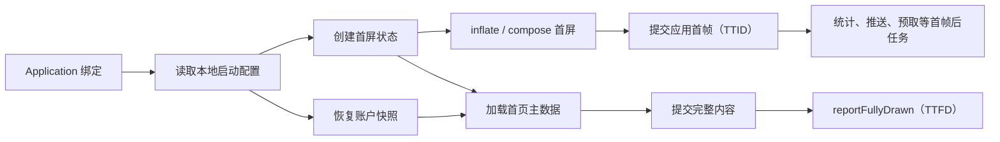

# 启动优化策略

启动优化应围绕用户可见关键路径安排初始化，而不是简单把任务全部异步化。先固定 TTID、TTFD 和业务可用点，再决定哪些工作必须前置、可以懒加载、适合并发，最后用依赖与资源争用验证收益。

## 工程决策边界

[8.2 App 冷启动链路与 Binder Trace 分析](02-app-cold-start-binder-trace.md)解释了 Android 如何创建进程、绑定 `Application`、安装 Provider、创建 Activity 并提交首帧。启动优化要沿着这条时序逐项判断：哪些工作可以删除，哪些可以推迟，哪些适合并发，哪些必须留在主线程，以及怎样验证改动是否有效。

本文以 Android 17 / API 37 的 `android-17.0.0_r1` 为平台源码基线。涉及线程调度、缺页和存储 I/O 时，内核基线为 `android17-6.18-2026-06_r6`；历史版本只用于解释 API 和行为演进。启动收益还会受到设备、构建产物、入口、数据状态和编译状态影响，不能给某个 SDK、布局或优化手段套用一个通用毫秒数。

启动优化可以按下面的顺序推进：

1. 固定测量口径并保存基线。
2. 找到决定 TTID 或 TTFD 的关键路径，也就是从启动起点到对应终点之间耗时最长的依赖链。
3. 删除无效工作，推迟暂不需要的工作。
4. 缩短仍在关键路径上的工作。
5. 只对相互独立且值得并发的任务做调度。
6. 用相同构建、设备和编译状态复测。
7. 通过线上分位数和版本对照，持续确认收益没有回退。

这几步应按顺序执行。把无用初始化移到后台后，它仍会消耗 CPU、I/O 和内存；盲目增加并发，也可能使首帧线程长时间得不到 CPU。

## 从 TTID、TTFD 和关键路径开始

### 两个终点不能混用

TTID（Time to Initial Display，首帧显示时间）的终点，是系统报告应用首帧已经绘制。首帧可以是完整首页，也可以是骨架屏、占位内容或错误页。系统 Splash 已经可见，不表示应用 TTID 已经结束；如果继续保持 Splash，应用首帧也会随之后移。

TTFD（Time to Full Display，完整显示时间）由应用调用 `reportFullyDrawn()` 标记，用来表达“当前入口的主要内容已经可用”。具体边界应由产品和工程团队共同定义。例如，支持离线使用的首页可以在本地数据显示完成后上报，无须等待推荐位、广告和后台同步。应用没有上报时，测量工具可能没有 TTFD 结果，不能自行用 TTID 替代。

`adb shell am start -W`、Perfetto 的 `android_startups`、Macrobenchmark 的 `StartupTimingMetric` 和 Play Android Vitals 使用相关但不完全相同的数据来源。分析前应记录工具、版本、启动类型和终点定义，不能直接把不同工具的数字拼成一条趋势线。

### 给启动工作分三类

逐项检查 `ContentProvider.onCreate()`、`Application.onCreate()`、首个 Activity、首屏 ViewModel 和首屏布局，将工作分为以下三类：

| 类别 | 判断问题 | 常见处理 |
| --- | --- | --- |
| TTID 必需 | 缺少它时，应用能否提交一帧稳定、无错误的界面 | 保留在首帧路径，继续缩短执行时间 |
| TTFD 必需 | 首帧可以出现，但主要内容或主交互尚不可用 | 首帧后继续执行，完成后上报 TTFD |
| 当前入口不需要 | 用户没有进入相关功能时，是否可以一直不执行 | 条件初始化或按需初始化 |

不能只根据 SDK 名称分类。崩溃恢复、加密密钥、用户同意状态和路由规则在某些产品中必须很早准备；图片、网络、统计或推送功能也可能在另一个入口完全用不到。分类依据应是当前入口的依赖和任务失败后的影响。

### 关键路径决定总时长

启动任务可以表示成 DAG（Directed Acyclic Graph，有向无环图）：节点代表任务，箭头代表先后依赖，图中不存在循环依赖。总时长由最长依赖链决定，并非所有任务耗时的简单相加。下图展示了一个简化入口，只保留实际执行依赖。

这张图用于区分首帧与完整可交互内容各自依赖哪些任务：



如果 `D` 是 TTID 关键路径上耗时最长的节点，增加 `F` 与 `G` 的并发度也不会缩短 TTID。如果工作线程继续争用 CPU，TTID 还可能变差。每次修改前，都应在 Perfetto 中标出目标 slice（时间片）、线程状态和前后依赖。

## 延迟、懒加载与异步初始化

延迟、懒加载和异步分别改变初始化的不同属性：

- **延迟初始化**改变开始时间，例如在首帧提交后启动。
- **懒加载**改变触发条件，例如用户进入搜索页时才创建搜索索引。
- **异步初始化**改变执行线程或等待方式，但任务仍可能在启动时立即开始。

异步任务仍可能位于关键路径上。主线程提交后台任务后如果马上 `await`、`join` 或等待锁，依赖链没有缩短，反而增加了调度和同步开销。

### 为每项初始化写出任务契约

大型项目可以用统一描述符记录每项初始化的审计结果。描述符至少应回答以下问题：

| 字段 | 需要写清楚的内容 |
| --- | --- |
| owner | 维护模块与故障联系人 |
| trigger | 进程绑定、首帧后、登录后、页面进入或功能调用 |
| deadline | TTID 前、TTFD 前或无启动期期限 |
| dependencies | 直接依赖及其完成语义 |
| thread affinity | 线程亲和性：必须运行在主线程、CPU worker 还是 I/O worker，是否调用 Looper / Handler |
| resource class | CPU、磁盘、Binder、网络或混合 |
| failure policy | 失败阻断、降级、重试或禁用功能 |
| idempotence | 幂等性：重复调用或进程重建时，是否会得到一致且安全的结果 |
| observability | trace 名称、耗时、结果与失败原因 |

下面的 Kotlin 数据结构只记录任务契约，不包含实际调度逻辑：

```kotlin
enum class StartupDeadline {
    BEFORE_TTID,
    BEFORE_TTFD,
    ON_DEMAND
}

enum class ThreadAffinity {
    MAIN,
    CPU,
    IO
}

data class StartupTaskSpec(
    val name: String,
    val dependencies: Set<String>,
    val deadline: StartupDeadline,
    val affinity: ThreadAffinity,
    val failurePolicy: FailurePolicy,
    val idempotent: Boolean
)
```

有了这些字段，代码评审就能检查任务为何必须提前执行，以及失败会影响谁。真正的执行器仍需另外实现依赖检查、状态管理、线程切换、取消和追踪。

### 推迟到首帧之后

主线程 `post`、协程 `launch` 或生命周期回调只能决定任务何时进入队列，不能保证执行时系统正处于空闲状态。首帧后如果一次性提交过多任务，第二帧和输入响应仍会受到影响。可以采用以下约束：

- 按用户可见价值排序，并限制同一时刻的 CPU 与 I/O 工作量；
- 将大任务分成带有明确检查点的小段，并允许随生命周期取消；
- 页面退出后取消预取、解码和无用网络请求；
- 限制主线程任务每次执行的时长，必要时跨帧继续；
- 缓存与预取失败时允许页面走正常加载路径。

`MessageQueue.IdleHandler` 只会在当前消息队列暂时没有到期消息时获得回调。它不表示 CPU、磁盘或整个进程都处于空闲状态，也不保证很快被调用，因此适合允许延后甚至跳过的维护工作，不适合有明确业务期限的初始化。

### 按需初始化需要状态机

按需初始化可能被多个线程同时触发，因此需要状态机明确当前处于 `UNINITIALIZED`、`INITIALIZING`、`READY` 还是 `FAILED`，并规定失败后能否重试。初始化对象交给其他线程前还要满足内存可见性要求，确保其他线程看到的是完整状态；可以使用语言级同步原语、`Mutex`、`CompletableFuture` 或受控的 `Deferred`。

主线程发现组件仍处于 `INITIALIZING` 时，可以暂时禁用局部操作、缓存事件或显示轻量占位。无条件调用 `CountDownLatch.await()` 会让主线程重新等待后台任务，还可能因锁获取顺序形成死锁。只有业务确实无法降级时才能等待，并且要设置有限期限、取消语义和现场记录。

### 异步任务仍会抢资源

启动期的后台工作仍与主线程共享 CPU 时间、内存带宽、文件缓存、Binder 线程和存储队列。在 `android17-6.18-2026-06_r6` 上，调度器会从可运行任务中选择下一项，但它不知道哪个自定义 SDK 对 TTID 更重要。线程优先级、CPU 集群选择和频率也会受到系统策略影响。

因此，不要按照 CPU 核数直接创建同等数量的启动线程，也不要为每个库单独建立线程池。先查看 Perfetto 中的 `sched`、`thread_state`、CPU frequency、Binder 和 I/O 轨迹，再决定并发上限。并发容量应根据设备实验和任务所消耗的资源类型确定。

## 多线程初始化：DAG 只是起点

### 拓扑排序只给出合法顺序

DAG 中存在 `A → B` 时，B 必须等待 A 达到约定状态。没有依赖边的两个节点可以并发，但执行器还要判断线程亲和性和资源冲突。两个没有依赖关系的磁盘扫描同时运行，可能比顺序执行产生更多随机 I/O；两个 CPU 密集任务也可能争用主线程需要的 CPU。

调度器至少应具备以下能力：

- 在构建期或启动前检测未知依赖、重复名称和循环依赖；
- 对 `MAIN`、`CPU`、`IO` 采用不同执行策略；
- 只在依赖成功或满足降级条件后释放节点；
- 记录排队时间、执行时间、线程、结果和关键路径归属；
- 支持入口条件、用户状态和进程类型过滤；
- 让超时、取消和任务本身的停止动作保持一致；
- 阻止失败任务被无边界地重复提交。

超时通常只表示等待方不再等待，并不会自动终止底层 SDK、Binder 调用或阻塞 I/O。执行器必须知道任务是否支持协作式取消，也就是任务能否主动检查并响应取消信号。不支持取消的任务需要隔离结果，避免稍后写入已经销毁的页面。

### 主线程亲和性不能靠猜

View、许多 AndroidX 组件，以及依赖当前 Looper 的 API，都必须在主线程创建或调用。有些 SDK 的初始化文档也明确要求主线程。把这类代码放进 worker（工作线程），可能暂时通过少量测试，随后却因 Handler、线程局部状态或回调顺序而崩溃。

CPU 任务和阻塞 I/O 也应分开管理。协程的 `Dispatchers.Default` 与 `Dispatchers.IO` 使用不同的调度策略，但使用协程不会自动消除 CPU、锁和 Binder 争用。任务契约应记录调用链中的真实阻塞点，不能只看最外层函数是否标记为 `suspend`。

### 失败降级比“全部完成”更适合启动

如果启动执行器把所有节点汇总到一个全局 `awaitAll` 中，任意一个非必要 SDK 都可能延后首页显示。可以按结果对页面的影响分成三类：

- 首帧门槛：失败时仍能绘制明确的错误或降级界面；
- 完整内容门槛：失败时保留重试入口，并按产品定义决定是否上报 TTFD；
- 附加能力：失败只影响对应功能，同时留下诊断信息。

任务完成状态还应与进程生命周期绑定。Android 可能杀死后台进程，内存中的“已初始化”状态不能跨进程复用；持久化标记也不能证明 SDK 在新进程中的对象已经就绪。

## Jetpack App Startup 的准确边界

Jetpack App Startup 使用一个 `InitializationProvider`，读取 manifest metadata 中注册的 `Initializer`，并通过 `dependencies()` 声明依赖顺序。AndroidX `AppInitializer#doInitialize()` 会先递归完成依赖，再调用 `Initializer.create()`。这项自动注册处理发生在 Provider 安装阶段，通常运行在应用主线程上，并且早于 `Application.onCreate()`。

它可以减少独立 Provider 的数量并统一依赖顺序，但仍有三个边界：

1. 独立 `Initializer` 不会被库自动并行执行。
2. `create()` 的耗时仍计入启动；合并 Provider 不会消除库本身的工作。
3. 自动初始化只适合耗时较短、所有相关进程都需要，并且必须很早可用的组件。

不满足这些条件的组件可以移除对应的 `<meta-data>`，再由 `AppInitializer.initializeComponent()` 在业务触发点执行。手动初始化时仍会递归完成依赖节点，因此迁移时要检查整棵依赖树。

如果 `Initializer.create()` 内部自行发起异步工作并立即返回，就必须明确返回值是否已经可用。其他 `Initializer` 会把这次返回视为依赖已经完成；若返回的只是尚不可用的外壳对象，后续组件可能过早访问它。

## ContentProvider：先发现，再决定是否移除

### Provider 位于 Application.onCreate 之前

Android 17 的 `ActivityThread#handleBindApplication()` 创建 `Application` 后，会先调用 `installContentProviders()`，随后才调用 `Instrumentation.callApplicationOnCreate()`。Provider 的 `onCreate()` 通常在应用主线程执行，因此第三方库通过 Provider 进行的自动初始化会直接进入冷启动路径。

Provider 还可能负责跨进程数据、`FileProvider` URI、数据库、WorkManager、Emoji 或其他功能。数量多不代表它们都没有用途，可以按照以下顺序检查：

1. 从目标 variant（构建变体）的合并 Manifest 中找出 Provider 和 `meta-data`；
2. 追溯来源依赖、authorities、exported、process 和启动逻辑；
3. 查库文档是否支持关闭自动初始化；
4. 为手动初始化选定触发点和失败策略；
5. 覆盖冷启动、后台任务、通知、深链和多进程入口。

下面的命令先生成 release variant 的合并 Manifest，再搜索其中的 Provider 和 metadata：

```bash
./gradlew :app:processReleaseMainManifest
rg -n '<provider|<meta-data' \
  app/build/intermediates/merged_manifests \
  app/build/intermediates/packaged_manifests
```

AGP 版本和模块结构会改变中间目录。Android Studio 的 Merged Manifest 视图可以继续追踪声明来源；如果命令找不到目录，应根据 Gradle task 输出定位该 variant 的实际产物。

### 关闭 App Startup 的单个自动项

下面的 Manifest 片段只移除一个 App Startup metadata 注册项，同时保留公共的 `InitializationProvider`：

```xml
<provider
    android:name="androidx.startup.InitializationProvider"
    android:authorities="${applicationId}.androidx-startup"
    android:exported="false"
    tools:node="merge">

    <meta-data
        android:name="com.example.analytics.AnalyticsInitializer"
        tools:node="remove" />
</provider>
```

移除后，需要在使用分析能力的入口手动初始化，并验证这个 `Initializer` 的依赖是否也被推迟。对于第三方自定义 Provider，只有库文档明确支持时才能使用 `tools:node="remove"`；否则可能破坏启动、备份、分享、后台任务或远程进程。

### 多进程应用要逐进程计算成本

带有 `android:process` 的 Service、Receiver 或 Provider 会运行在独立进程中。每个进程都可能安装对自己可见的 Provider，并创建一份 `Application`。只优化主进程首页，无法改善推送进程或工具进程的冷启动；初始化器应检查当前进程和入口需求，避免所有进程都加载主进程专属组件。

## SplashScreen：控制过渡画面，不隐藏等待

从 Android 12（API 31）开始，系统为冷启动和温启动提供标准 Splash，热启动通常不显示；`androidx.core:core-splashscreen` 将兼容实现带到 API 23。Splash 可以改善启动画面的过渡，但不会减少 `Application`、Provider、Activity 或首帧渲染所消耗的 CPU 时间。

专门创建透明或全屏的 Splash Activity，会增加一次 Activity 生命周期、窗口创建和转场，通常应迁移到启动主题。Splash 颜色应与首屏背景协调，避免退出时闪色；图标和动画应遵循系统的尺寸与时长规范。

### 安装顺序与启动主题

下面的 XML 为启动 Activity 定义 Splash 主题，并通过 `postSplashScreenTheme` 指定退出后使用的常规主题：

```xml
<style name="Theme.App.Starting" parent="Theme.SplashScreen">
    <item name="windowSplashScreenBackground">@color/startup_background</item>
    <item name="windowSplashScreenAnimatedIcon">@drawable/ic_startup</item>
    <item name="postSplashScreenTheme">@style/Theme.App</item>
</style>
```

还需要在 Manifest 中把 `Theme.App.Starting` 配置给启动 Activity。`postSplashScreenTheme` 负责恢复常规主题，其中不能遗漏深色模式、边到边窗口和状态栏配置。

下面的 Activity 代码展示 `installSplashScreen()` 的调用顺序，并且只读取一个已准备好的布尔状态来判断是否短暂保留 Splash：

```kotlin
override fun onCreate(savedInstanceState: Bundle?) {
    val splash = installSplashScreen()
    super.onCreate(savedInstanceState)

    splash.setKeepOnScreenCondition {
        viewModel.blocksFirstDraw.value
    }

    setContentView(R.layout.activity_main)
}
```

`installSplashScreen()` 必须在 `super.onCreate()` 之前调用。保持条件会在绘制路径上频繁执行，因此函数体应快速、无锁、无 I/O，也不应修改状态。耗时工作应在其他位置完成，这里只读取已经安全发布的状态。

### 保持 Splash 会推迟 TTID

如果首屏必须先读取少量本地设置，否则会立即切换主题、改变路由或显示错误内容，可以短暂保持 Splash。等待网络、广告、完整远程配置或大型数据库迁移会直接延长应用首帧，也会让失败后的界面迟迟不出现。更合适的做法是先绘制可用占位、缓存内容或局部错误状态，再异步更新。

保持条件还需要明确的失败出口。数据读取失败、协程取消或页面销毁时，都要将状态更新为允许绘制。超时策略应在状态持有层实现并记录原因，不能在每次条件求值时执行时钟查询、磁盘访问或网络操作。

### 退出动画不能占用主线程做重活

设置 `setOnExitAnimationListener` 接管退出动画后，应用需要在动画结束时调用 `SplashScreenView.remove()`。动画应只修改轻量属性，并考虑系统可能跳过图标动画。需要衔接图标动画时，可以根据 `iconAnimationStart` 和 `iconAnimationDuration` 计算剩余时间，并确保结果不小于零。退出回调不适合启动 SDK，也不适合同步准备首页数据。

## 首屏布局：减少必须创建的节点

### 先确认耗时属于 inflate、measure、layout 还是 draw

XML inflate 包含资源解析、类加载、反射或构造器调用、属性解析和子树创建，之后还要执行 measure、layout、绘制命令记录和 RenderThread 工作。只看到 `setContentView()` 耗时较长，无法判断时间是否全花在 XML 解析上；应在 Perfetto 中结合 `inflate`、`measure / layout`、`DrawFrame`、类加载、GC 和 Binder slice 定位。

布局审计可以从以下位置开始：

- 删除首屏不可见且没有状态作用的节点；
- 避免在 View 构造器和自定义属性解析中做 I/O、Binder 或大对象解码；
- 让列表首批数据和占位数量接近首屏实际需要；
- 检查重复背景、过度绘制和复杂文本测量；
- 对 Compose 检查首次组合读取的状态、同步数据源和耗时较长的 `remember` 计算；
- 把首帧无关页面从导航图的即时构建路径移开。

不能只用布局层级数判断性能。`ConstraintLayout` 可能减少嵌套，也可能因约束规模增大而提高求解成本，最终应以 trace 和 Macrobenchmark 结果为准。

### ViewStub 适合可选 View 子树

下面的 XML 使用 `ViewStub` 占据错误详情的位置，只有真正需要显示时才创建对应布局：

```xml
<ViewStub
    android:id="@+id/error_details_stub"
    android:inflatedId="@+id/error_details"
    android:layout="@layout/view_error_details"
    android:layout_width="match_parent"
    android:layout_height="wrap_content" />
```

`ViewStub` 本身不绘制，measure 结果为零；调用 `inflate()`，或者把可见性设置为 `VISIBLE` / `INVISIBLE` 时，它会被目标布局替换。目标布局不能以 `<merge>` 作为根。替换完成后，原 `ViewStub` 已从父节点移除，代码需要保存新 View 的引用，或通过 `inflatedId` 查找。

`ViewStub` 适合本次首帧大概率不会出现的子树。如果每次启动都会立即 inflate，它只改变了创建时机，还可能额外增加一次查找和状态切换。

### AsyncLayoutInflater 有严格前提

`AsyncLayoutInflater` 适合延后创建、或用户交互后才需要的布局。它的构造和 `inflate()` 调用发生在 UI 线程，View 则在后台线程创建；没有传入 callback executor 时，完成回调会回到 UI 线程。创建出的布局不会自动加入 parent。

下面的示例提前创建一个首帧之后才可能展示的筛选面板，并在回调中把它加入父容器：

```kotlin
val inflater = AsyncLayoutInflater(this)

inflater.inflate(R.layout.view_filter_panel, filterContainer) {
        view, _, parent ->
    parent?.addView(view)
}
```

父容器的 `generateLayoutParams()` 和所有 View 构造过程都必须能在后台线程安全执行；View 不能在构造时创建 Handler 或依赖当前 Looper。普通的 `LayoutInflater.Factory / Factory2` 设置方式和包含 Fragment 的布局不受支持；当前库提供的 `AsyncLayoutFactory` 构造入口需要单独验证适配。后台 inflate 抛出运行时异常时，AndroidX 会回到 UI 线程重试。

如果应用必须等待异步结果才能设置首屏根布局，这项工作仍位于 TTID 关键路径上，线程切换还可能增加开销。它更适合提前准备后续 UI，或让当前 UI 在 inflate 期间保持可响应。选用前应测试主题包装、AppCompat / Material 自定义 View、回调生命周期，以及任务取消后如何丢弃结果。

## Baseline Profile 与 Startup Profile

Baseline Profile 会随 release 产物发布热点类和方法规则，使 ART 能在用户开始使用前对这些代码执行 profile-guided compilation（基于性能画像的编译）。Startup Profile 面向 DEX 布局，让构建工具把启动期类和方法排列到更便于连续读取的位置。两者作用于不同阶段，可以同时使用。

官方资料中“代码执行从首次启动起约有三成改善”是跨样本的概述，不代表每个应用的 TTID 都会改善三成。如果启动瓶颈来自磁盘读取、锁等待、Binder、布局或网络，编译优化能够覆盖的比例就会较小。完整的生成、打包、分发渠道和设备编译状态见 [21.4 Baseline、Startup 与 Cloud Profile 编译优化](../../part5-app/ch21-startup/04-baseline-startup-cloud-profile.md)。

### 用对照实验量化

在同一台物理设备上，使用同一个 release-like APK、入口和数据状态，对比 `CompilationMode.None()` 与强制要求 Baseline Profile 的 `CompilationMode.Partial`。下面的 Macrobenchmark 展示两个实验组共用的测试结构：

```kotlin
@Test
fun coldWithoutProfile() = measureCold(CompilationMode.None())

@Test
fun coldWithBaselineProfile() = measureCold(
    CompilationMode.Partial(
        baselineProfileMode = BaselineProfileMode.Require
    )
)

private fun measureCold(mode: CompilationMode) {
    benchmarkRule.measureRepeated(
        packageName = TARGET_PACKAGE,
        metrics = listOf(StartupTimingMetric()),
        compilationMode = mode,
        startupMode = StartupMode.COLD,
        iterations = 10,
        setupBlock = { pressHome() }
    ) {
        startActivityAndWait()
    }
}
```

`BaselineProfileMode.Require` 会在 profile 缺失时直接暴露配置错误，适合用于验收。示例中的迭代次数不是固定要求；应根据设备噪声和 CI 成本确定样本量，并检查原始分布。模拟器会与宿主机共享资源，不适合用来得出最终的启动性能结论。

需要测量 TTFD 时，应在页面稳定且可交互的业务状态调用 `reportFullyDrawn()`，并让 benchmark 操作等待对应 UI 状态。没有这个标记时，不能把缺失的 TTFD 结果改写成 TTID。还要确认 APK / AAB 内的 profile、设备编译状态和 R8 映射一致，避免文件虽然生成成功，目标产物却没有实际使用。

### 分发路径影响首次体验

Google Play 可以在安装阶段使用随包提供的 Baseline Profile，也可以根据用户设备数据聚合并分发 Cloud Profile。其他渠道能否在安装时编译，取决于安装器和系统；`ProfileInstaller` 可以把随包 profile 写入设备，后续编译仍受系统任务执行时机和设备状态影响。

评估渠道差异时，应检查构建产物和设备编译状态，不能依据地区直接判断 Baseline Profile 是否有效。Cloud Profile 属于 Google Play 的分发能力，与随 APK / AAB 发布的 Baseline Profile 是两条不同路径。

## 观测与回归：把收益变成可维护指标

### 实验室、系统 trace 与线上数据各有职责

| 层级 | 适合回答的问题 | 建议工具 |
| --- | --- | --- |
| 可重复基准 | 某次代码或 profile 改动是否影响指定入口 | Macrobenchmark、物理设备、固定构建与数据 |
| 单次现场 | 时间花在哪个线程、锁、Binder、I/O 或帧阶段 | Perfetto、Android App Startups、FrameTimeline |
| 用户分布 | 哪些设备、版本、入口或启动类型恶化 | Android vitals、应用自有启动事件 |
| 业务完成 | 主内容何时可用，失败和降级占比多少 | `reportFullyDrawn()`、业务状态与 trace ID |

Play Android Vitals 把冷启动 5 秒、温启动 2 秒、热启动 1.5 秒及以上归为 excessive startup（启动时间过长）。这些数值是平台健康阈值，不能代替产品自己的时间预算。团队应按入口和设备层级设置预算，并观察 P50、P90 / P95、超过阈值的比例、失败率和样本量。

线上事件至少带上：

- 应用版本、Android 版本、设备型号和构建类型；
- 冷、温、热启动类型及入口来源；
- 进程启动原因、目标 Activity 和用户登录状态；
- TTID / TTFD 是否存在，以及 `reportFullyDrawn()` 采用的业务条件；
- 初始化任务结果、降级原因和实验分组。

大量高性能设备会掩盖平均值中的慢设备问题。分位数也必须附带样本量；设备构成发生变化时，整体 P90 可能随之变化，即使同一型号的性能没有变化。

### Perfetto 中验证关键路径

Android App Startups 标准库提供启动区间和 TTID 信息。下面的 SQL 列出一份 trace 中的所有应用启动记录及其类型和区间时长：

```sql
INCLUDE PERFETTO MODULE android.startup.startups;

SELECT
    startup_id,
    package,
    startup_type,
    dur / 1e6 AS startup_ms
FROM android_startups
ORDER BY ts;
```

Perfetto 不同版本中的表字段会演进，应以当前 Trace Processor stdlib 文档和 `DESCRIBE` 结果为准。查询得到启动区间后，再检查应用主线程、worker、Binder、`sched`、频率、缺页、I/O、GC、`inflate` 和 FrameTimeline；只看总区间无法确定应修改哪一段。

应用自己的任务应使用 `androidx.tracing.trace` 或平台 trace API 标记稳定名称，避免把用户 ID、URL 等取值数量极多的高基数字段写入 slice 名。在线上采样时还要控制性能开销并保护隐私。

### CI 门禁需要处理噪声

如果 CI 规定“单次慢 5% 就失败”，很容易把温度、后台负载和动态调频造成的测量波动误判为回归。更可靠的门禁应包含：

- 专用或受控物理设备；
- 一致的电量、温度范围、动画和网络数据；
- release-like、可 profile 的 benchmark 目标；
- 固定 startup mode、编译模式和入口；
- 足够迭代与历史基线；
- 同时检查变化幅度、波动范围和连续构建趋势；
- 失败时保存 benchmark JSON、APK 版本和 Perfetto trace。

`android:profileable="true"` 允许 shell 对不可调试应用采集受支持的 profiling 数据。benchmark target 通常由构建插件为性能测试配置；这个属性无法说明 Cloud Profile 是否会生成，也不能简单归结为“release 构建一律关闭”。

## Android 17 与环境边界

### lock-free MessageQueue 是兼容性检查项

Android 17 会为 targetSdk 37 及以上的应用启用新的 lock-free（无锁）`android.os.MessageQueue` 实现，用来减少队列锁竞争和 missed frames（错过截止时间的帧）。私有字段 `mMessages` 为兼容旧实现仍然保留，但在新实现下始终为 null。通过反射读取私有字段或调用私有方法的性能 SDK、测试工具和自研 Hook 都需要迁移。

下面的命令用于在 Android 17 的 debuggable 构建上，按包名开启或关闭新实现，以便进行兼容性对照：

```bash
adb shell am compat enable USE_NEW_MESSAGEQUEUE com.example.app
adb shell am compat disable USE_NEW_MESSAGEQUEUE com.example.app
```

执行任一命令后，都要强制结束目标进程，再重新运行启动和 UI 测试。Espresso 应升级到 3.7.0 或更高版本；Robolectric 应升级到 4.17 或更高版本，并迁移旧 Looper 模式。新队列可能减少某些样本中的锁竞争，但不能据此假定应用启动一定变快，仍需对照 trace 验证。

启动监控应使用 Perfetto、Macrobenchmark、`Looper.setMessageLogging()` 的公开行为或受支持的测试 API。依赖 `MessageQueue` 私有链表布局的实现，在 `android-17.0.0_r1` 中已经没有稳定的结构保证。

### 16 KB 页不是“少写静态字段”规则

支持 16 KB 内存页的设备会改变 native 库对齐、内存页粒度和部分缺页行为。应用需要按照官方 16 KB page-size 指南检查 ELF LOAD 段、打包方式和第三方 native 依赖，并在目标设备上测量启动、内存和兼容性。

“启动时写应用静态字段会按 16 KB 触发 Zygote COW，因此应统一推迟写入”这一推断缺少对象到共享物理页的映射证据，也容易把应用后来创建的类静态存储和 Zygote 共享页混为一谈。诊断 COW（写时复制）应检查 page fault、PSS（进程按共享比例折算后的内存）、映射属性和可复现实验，不能根据字段类型推断物理页归属。

### 内核锚点用于解释系统争用

只有当 trace 显示主线程长时间处于 runnable（可运行但未获得 CPU）、频繁被抢占、等待 I/O 或出现大量缺页时，才需要继续检查 `android17-6.18-2026-06_r6` 中的调度、存储和内存路径。平台侧的 `ActivityThread`、ART、MessageQueue 和 SplashScreen 行为仍以 `android-17.0.0_r1` 为准，不能用内核分支名代替平台源码证据。

## 一套可执行的审计清单

### 建立基线

- 选定冷、温、热启动及通知、深链等业务入口。
- 固定 release-like 产物、设备、数据和编译状态。
- 始终记录 TTID；页面定义了完整可用状态时，再记录 TTFD，并保存 trace。
- 写明 `reportFullyDrawn()` 的业务条件。

### 清点启动工作

- 查看合并 Manifest 中的 Provider 和 App Startup metadata。
- 标记 `Application.onCreate()`、首个 Activity 和首屏数据调用。
- 为每项工作填写 trigger、deadline、执行线程、依赖和失败策略。
- 删除重复、无入口需求或可以由功能触发的初始化。

### 修改关键路径

- TTID 前只保留提交稳定首帧所需的工作。
- TTFD 前只保留主内容和主交互所需的工作。
- 独立任务也要先评估 CPU、I/O、Binder 和锁争用，再决定是否并发。
- 用 ViewStub、条件组合或预创建处理可选 UI。
- 用 Baseline / Startup Profile 改善代码执行和 DEX 布局。
- Splash 只处理过渡和短暂本地准备，不等待无界外部资源。

### 验收与上线

- 用相同 Macrobenchmark 配置做修改前后对照。
- 在 Perfetto 中确认目标 slice 离开关键路径或自身变短。
- 覆盖失败、离线、慢磁盘、进程重建、多进程和页面退出。
- 分批发布，按版本、入口、设备和启动类型观察分位数。
- 回归时保留 trace、构建产物、profile 状态和实验配置。

## 常见误判

### “提交到后台”就算完成优化

后台任务仍会消耗资源；如果主线程还在等待它，关键路径就没有改变。应通过依赖关系和线程状态验证结果。

### Splash 消失得晚，首页就更稳定

保持 Splash 会推迟应用首帧，只适合等待短暂且确定的本地前置条件，并且必须提供失败出口。

### App Startup 会并行没有依赖的 Initializer

AndroidX 只负责统一发现 `Initializer` 并按照依赖顺序执行。自动初始化仍发生在 Provider 路径中，互不依赖的节点也不会自动并发。

### Provider 数量减少就等于初始化耗时消失

统一 Provider 可以减少组件创建和发现开销，但 `Initializer` 中的业务工作仍会执行。实际收益必须通过 trace 测量。

### AsyncLayoutInflater 适合所有首屏布局

它要求 View 构造过程能在后台线程安全执行，不支持包含 Fragment 的布局，失败时还会回到 UI 线程重试。如果首帧必须等待结果，TTID 未必缩短。

### Baseline Profile 有固定启动收益

Profile 只改善被编译代码的执行成本。当关键路径主要由 I/O、锁、Binder 或渲染决定时，收益会明显不同。

## 小结

启动优化针对的是入口关键路径。TTID、TTFD、Splash 可见时间和业务数据就绪时间需要分别定义；删除、推迟、缩短和受控并发也要分别验证。DAG、App Startup、`AsyncLayoutInflater` 和 Baseline Profile 都有各自的适用条件，无法代替 trace 与对照实验。

Android 17 的平台结论以 `android-17.0.0_r1` 为准，系统资源争用分析以 `android17-6.18-2026-06_r6` 为内核基线。面向 targetSdk 37 的项目，还要检查启动 SDK 和测试框架是否兼容 lock-free MessageQueue。

## 参考资料

- [Android Developers：App startup time](https://developer.android.com/topic/performance/vitals/launch-time)
- [Android Developers：App startup analysis and optimization](https://developer.android.com/topic/performance/appstartup/analysis-optimization)
- [Android Developers：Splash screens](https://developer.android.com/develop/ui/views/launch/splash-screen)
- [Android Developers：Migrate your existing splash screen implementation to Android 12](https://developer.android.com/develop/ui/views/launch/splash-screen/migrate)
- [Android Developers：Jetpack App Startup](https://developer.android.com/topic/libraries/app-startup)
- [Android Developers：AsyncLayoutInflater API](https://developer.android.com/reference/androidx/asynclayoutinflater/view/AsyncLayoutInflater)
- [AndroidX：AsyncLayoutInflater source](https://android.googlesource.com/platform/frameworks/support/+/androidx-main/asynclayoutinflater/asynclayoutinflater/src/main/java/androidx/asynclayoutinflater/view/AsyncLayoutInflater.java)
- [AndroidX：AppInitializer source](https://android.googlesource.com/platform/frameworks/support/+/androidx-main/startup/startup-runtime/src/main/java/androidx/startup/AppInitializer.java)
- [Android Developers：ViewStub 按需加载布局](https://developer.android.com/develop/ui/views/layout/improving-layouts/loading-ondemand)
- [AOSP Android 17：ActivityThread.java](https://android.googlesource.com/platform/frameworks/base/+/refs/tags/android-17.0.0_r1/core/java/android/app/ActivityThread.java)
- [AOSP Android 17：ViewStub.java](https://android.googlesource.com/platform/frameworks/base/+/refs/tags/android-17.0.0_r1/core/java/android/view/ViewStub.java)
- [Android Developers：Baseline Profiles overview](https://developer.android.com/topic/performance/baselineprofiles/overview)
- [Android Developers：Benchmark Baseline Profiles](https://developer.android.com/topic/performance/baselineprofiles/measure-baselineprofile)
- [Android Developers：Startup Profiles and DEX layout](https://developer.android.com/topic/performance/startupprofiles/dex-layout-optimizations)
- [Perfetto stdlib：Android startup tables](https://perfetto.dev/docs/analysis/stdlib-docs#android-startup-startups)
- [Android Developers：Android 17 MessageQueue behavior change](https://developer.android.com/about/versions/17/changes/messagequeue)
- [Android Developers：Support 16 KB page sizes](https://developer.android.com/guide/practices/page-sizes)
