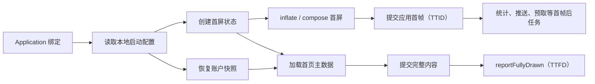

# 8.3 启动优化策略

## 工程决策边界

[8.2 App 启动全流程](02-app-launch.md)解释了 Android 如何创建进程、绑定 `Application`、安装 Provider、创建 Activity 并提交首帧。启动优化需要沿着这条时序判断：哪些工作应删除，哪些应推迟，哪些能够并发，哪些只能留在主线程，以及怎样证明改动有效。

平台源码锚点统一为 Android 17 / API 37 / `android-17.0.0_r1`。涉及线程调度、缺页与存储 I/O 时，内核锚点为 `android17-6.18-2026-06_r6`。历史版本只用于解释 API 和行为演进。启动收益受设备、构建产物、入口、数据状态和编译状态影响，不能为某个 SDK、布局或优化手段套用通用毫秒数。

启动优化可以按下面的顺序推进：

1. 固定测量口径并保存基线。
2. 找到 TTID 或 TTFD 的关键路径。
3. 删除无效工作，推迟暂不需要的工作。
4. 缩短仍在关键路径上的工作。
5. 只对相互独立且值得并发的任务做调度。
6. 用相同构建、设备和编译状态复测。
7. 通过线上分位数和版本对照守住收益。

顺序很重要。把一段无用初始化移到后台，仍会消耗 CPU、I/O 和内存；把任务并发化，也可能让首帧线程拿不到运行时间。

## 从 TTID、TTFD 和关键路径开始

### 两个终点不能混用

TTID（Time To Initial Display）结束于应用首帧被系统报告为已绘制。首帧可以是完整首页，也可以是骨架、占位内容或错误页。系统 Splash 已经可见，不代表应用 TTID 已经结束；若继续保持 Splash，应用首帧也会继续后移。

TTFD（Time To Full Display）由应用调用 `reportFullyDrawn()` 标记。它适合表达“当前入口的主要内容已经可用”，具体边界应由产品和工程团队共同定义。例如，离线可用的首页可以在本地数据完成展示后上报，无需等待推荐位、广告和后台同步。没有上报时，测量工具可能没有 TTFD 结果，不能自行把 TTID 当作 TTFD。

`adb shell am start -W`、Perfetto 的 `android_startups`、Macrobenchmark 的 `StartupTimingMetric` 和 Play Android vitals 观察的是相关但不完全相同的数据管道。分析前要记录工具、版本、启动类型和终点定义，不把不同工具的数字直接拼成一条趋势线。

### 给启动工作分三类

逐项审计 `ContentProvider.onCreate()`、`Application.onCreate()`、首个 Activity、首屏 ViewModel 和首屏布局，把工作归入下面三类：

| 类别 | 判断问题 | 常见处理 |
| --- | --- | --- |
| TTID 必需 | 缺少它时，应用能否提交一帧稳定、无错误的界面 | 保留在首帧路径，继续缩短执行时间 |
| TTFD 必需 | 首帧可以出现，但主要内容或主交互尚不可用 | 首帧后继续执行，完成后上报 TTFD |
| 当前入口不需要 | 用户没有进入相关功能时，是否可以一直不执行 | 条件初始化或按需初始化 |

SDK 名称不能替代分类。崩溃恢复、加密密钥、同意状态和路由规则在某些产品中必须很早准备；图片、网络、统计或推送也可能在另一个入口完全用不到。分类依据应是入口依赖和失败后果。

### 关键路径决定总时长

启动任务可以形成有向无环图。总时长受最长依赖链约束，而非所有任务耗时之和。下图展示一个简化入口；虚线概念由文字表达，图内只保留执行依赖。

这张图用于区分首帧与完整可交互内容的依赖边界：



如果 `D` 是最长节点，增加 `F` 与 `G` 的并发度不会缩短 TTID。若工作线程争用 CPU，TTID 还可能变差。每次修改前应在 Perfetto 中标出目标切片、线程状态和上下游依赖。

## 延迟、懒加载与异步初始化

这三个词处理的是不同问题：

- **延迟初始化**改变开始时间，例如在首帧提交后启动。
- **懒加载**改变触发条件，例如用户进入搜索页时才创建搜索索引。
- **异步初始化**改变执行线程或等待方式，任务仍可能立即开始。

异步不等于脱离关键路径。主线程提交后台任务后若马上 `await`、`join` 或等待锁，依赖链没有缩短，还多了调度与同步开销。

### 为每项初始化写出任务契约

大型项目可以用统一描述符保存审计结果。描述符至少要回答：

| 字段 | 需要写清楚的内容 |
| --- | --- |
| owner | 维护模块与故障联系人 |
| trigger | 进程绑定、首帧后、登录后、页面进入或功能调用 |
| deadline | TTID 前、TTFD 前或无启动期期限 |
| dependencies | 直接依赖及其完成语义 |
| thread affinity | 主线程、CPU worker、I/O worker，是否调用 Looper/Handler |
| resource class | CPU、磁盘、Binder、网络或混合 |
| failure policy | 失败阻断、降级、重试或禁用功能 |
| idempotence | 重入、重复调用和进程重建时的行为 |
| observability | trace 名称、耗时、结果与失败原因 |

下面的 Kotlin 数据结构只表达契约，不负责执行任务：

```kotlin
enum class StartupDeadline {
    BEFORE_TTID,
    BEFORE_TTFD,
    ON_DEMAND
}

enum class ThreadAffinity {
    MAIN,
    CPU,
    IO
}

data class StartupTaskSpec(
    val name: String,
    val dependencies: Set<String>,
    val deadline: StartupDeadline,
    val affinity: ThreadAffinity,
    val failurePolicy: FailurePolicy,
    val idempotent: Boolean
)
```

有了这些字段，代码评审可以检查“为什么必须早做”和“失败时谁负责影响”。执行器仍需另外实现依赖检查、状态管理、线程切换、取消和追踪。

### 推迟到首帧之后

主线程 `post`、协程 `launch` 或生命周期回调只能提供时间点，不能保证系统空闲。首帧后的任务如果一次性提交过多，第二帧和输入响应仍会受到影响。更稳妥的做法是：

- 按用户可见价值排序，并限制同一时刻的 CPU 与 I/O 工作量；
- 大任务拆成有明确检查点的小段，允许生命周期取消；
- 页面退出后取消预取、解码和无用网络请求；
- 主线程任务控制单次执行预算，跨帧续做；
- 缓存与预取失败时允许页面走正常加载路径。

`MessageQueue.IdleHandler` 只表示当前队列暂时没有到期消息。它不代表 CPU、磁盘或整个进程空闲，也不承诺很快被调用，因此适合可丢弃的维护工作，不适合带业务期限的初始化。

### 按需初始化需要状态机

按需入口可能由多个线程同时触发。实现至少应区分 `UNINITIALIZED`、`INITIALIZING`、`READY` 和 `FAILED`，并定义失败是否允许重试。初始化对象发布给其他线程前要满足可见性要求，可使用语言级同步原语、`Mutex`、`CompletableFuture` 或受控的 `Deferred`。

调用方在主线程遇到 `INITIALIZING` 时，优先选择禁用局部操作、缓存事件或显示轻量占位。无条件使用 `CountDownLatch.await()` 会把后台任务重新接回 UI 关键路径，还可能因锁顺序形成死锁。等待只能出现在业务无法降级的边界，并需要有限期限、取消语义和现场记录。

### 异步任务仍会抢资源

启动期的后台工作与主线程共享 CPU 时间、内存带宽、文件缓存、Binder 线程和存储队列。在 `android17-6.18-2026-06_r6` 上，调度器会选择可运行任务，但它无法知道哪个自定义 SDK 对 TTID 更重要。线程优先级、CPU 集群选择和频率也受系统策略影响。

因此不要按 CPU 核数直接创建同等数量的启动线程，也不要给每个库单独建线程池。先看 Perfetto 的 `sched`、`thread_state`、CPU frequency、Binder 和 I/O 轨迹，再决定并发上限。容量应由设备实验和任务资源类型确定。

## 多线程初始化：DAG 只是起点

### 拓扑排序只给出合法顺序

DAG 中存在 `A → B` 时，B 要等 A 达到约定状态。没有依赖边的两个节点可以并发，但执行器还要判断线程亲和性和资源冲突。两个无依赖的磁盘扫描同时运行，可能比顺序执行产生更多随机 I/O；两个 CPU 密集任务也可能挤压主线程。

调度器至少应具备以下能力：

- 构建期或启动前检测未知依赖、重复名称与环；
- 对 `MAIN`、`CPU`、`IO` 采用不同执行策略；
- 只在依赖成功或满足降级条件后释放节点；
- 记录排队时间、执行时间、线程、结果和关键路径归属；
- 支持入口条件、用户状态和进程类型过滤；
- 让超时、取消与任务本身的停止动作一致；
- 阻止失败任务被无边界地重复提交。

超时只代表等待方停止等待，通常不会自动终止底层 SDK、Binder 调用或阻塞 I/O。执行器必须知道任务是否支持协作取消；不支持取消的任务要隔离结果，并避免稍后写入已经销毁的页面。

### 主线程亲和性不能靠猜

View、许多 AndroidX 组件以及依赖当前 Looper 的 API 必须在主线程创建或调用。有些 SDK 的初始化文档也明确要求主线程。把这类代码放进 worker，可能在测试设备上暂时通过，随后因 Handler、线程局部状态或回调顺序崩溃。

CPU 任务和阻塞 I/O 也要分开管理。协程的 `Dispatchers.Default` 与 `Dispatchers.IO` 有各自的调度策略，但使用协程并不会自动消除 CPU、锁和 Binder 争用。任务契约应记录调用链中的阻塞点，而非只看最外层函数是否标记为 `suspend`。

### 失败降级比“全部完成”更适合启动

启动执行器若把所有节点聚合成一个全局 `awaitAll`，任一非必要 SDK 都可能拖住首页。可将结果分成：

- 首帧门槛：失败时仍能绘制明确的错误或降级界面；
- 完整内容门槛：失败时保留重试入口，并按产品定义决定是否上报 TTFD；
- 附加能力：失败只影响对应功能，同时留下诊断信息。

任务的完成状态还要与进程生命周期绑定。Android 可能杀死后台进程，内存中的“已初始化”不能跨进程复用；持久化标记也不能冒充 SDK 进程内对象已经就绪。

## Jetpack App Startup 的准确边界

Jetpack App Startup 用一个 `InitializationProvider` 读取 manifest metadata 中注册的 `Initializer`，并通过 `dependencies()` 规定初始化顺序。AndroidX `AppInitializer#doInitialize()` 会递归完成依赖，再调用 `Initializer.create()`。这项注册处理发生在 Provider 安装阶段，通常位于应用主线程和 `Application.onCreate()` 之前。

它解决了 Provider 数量与依赖顺序问题，但有三个边界：

1. 独立 `Initializer` 不会被库自动并行执行。
2. `create()` 的耗时仍计入启动；合并 Provider 不会消除库本身的工作。
3. 自动初始化适合便宜、所有相关进程都需要、且必须很早可用的组件。

不满足这些条件的组件可以移除对应 `<meta-data>`，再由 `AppInitializer.initializeComponent()` 在业务触发点执行。依赖节点也会随手动初始化递归完成，所以迁移时要审计整棵依赖树。

如果 `Initializer.create()` 内自行发起异步工作并立刻返回，返回值的语义必须写清楚。其他 Initializer 会把它视为依赖已经完成；返回一个尚未可用的外壳对象会制造时序缺口。

## ContentProvider：先发现，再决定是否移除

### Provider 位于 Application.onCreate 之前

Android 17 的 `ActivityThread#handleBindApplication()` 创建 `Application` 后，会调用 `installContentProviders()`，随后调用 `Instrumentation.callApplicationOnCreate()`。Provider 的 `onCreate()` 通常在应用主线程执行，因此第三方库的自动初始化会直接进入冷启动路径。

Provider 还可能负责跨进程数据、FileProvider URI、数据库、WorkManager、Emoji 或其他功能。看到 Provider 多不能直接判定它无用。正确审计顺序是：

1. 从目标 variant 的合并 Manifest 找出 Provider 和 `meta-data`；
2. 追溯来源依赖、authorities、exported、process 与启动逻辑；
3. 查库文档是否支持关闭自动初始化；
4. 为手动初始化选定触发点和失败策略；
5. 覆盖冷启动、后台任务、通知、深链和多进程入口。

下面的命令用于生成并搜索 release variant 的合并 Manifest：

```bash
./gradlew :app:processReleaseMainManifest
rg -n '<provider|<meta-data' \
  app/build/intermediates/merged_manifests \
  app/build/intermediates/packaged_manifests
```

AGP 版本和模块结构会改变中间目录。Android Studio 的 Merged Manifest 视图可以补充来源追踪；命令找不到目录时，应从 Gradle task 输出定位该 variant 的产物。

### 关闭 App Startup 的单个自动项

下面的 Manifest 片段用于移除一个 App Startup metadata 注册项，同时保留公共 `InitializationProvider`：

```xml
<provider
    android:name="androidx.startup.InitializationProvider"
    android:authorities="${applicationId}.androidx-startup"
    android:exported="false"
    tools:node="merge">

    <meta-data
        android:name="com.example.analytics.AnalyticsInitializer"
        tools:node="remove" />
</provider>
```

移除后要在需要分析能力的入口手动初始化，并验证该 Initializer 的依赖是否也被推迟。对第三方自定义 Provider，只有库文档明确支持时才能用 `tools:node="remove"`；否则可能破坏启动、备份、分享、后台任务或远程进程。

### 多进程应用要逐进程计算成本

带 `android:process` 的 Service、Receiver 或 Provider 会创建独立进程，每个进程都可能安装该进程可见的 Provider 并创建 `Application`。只优化主进程首页，无法覆盖推送进程或工具进程的冷启动。初始化器应检查当前进程和入口需求，避免每个进程重复加载主进程专属组件。

## SplashScreen：控制过渡画面，不隐藏等待

Android 12（API 31）起，系统为冷启动和温启动提供标准 Splash；热启动通常不显示。`androidx.core:core-splashscreen` 将兼容体验带到 API 23。它改善启动过渡，不能减少 `Application`、Provider、Activity 或首帧渲染的 CPU 时间。

专门创建一个透明或全屏 Splash Activity 会增加 Activity 生命周期、窗口和转场，通常应迁移到启动主题。Splash 颜色和首屏背景要协调，避免退出时闪色；图标与动画遵循系统尺寸和时长规范。

### 安装顺序与启动主题

下面的 XML 给启动 Activity 配置 Splash 主题，并在退出后切换到常规主题：

```xml
<style name="Theme.App.Starting" parent="Theme.SplashScreen">
    <item name="windowSplashScreenBackground">@color/startup_background</item>
    <item name="windowSplashScreenAnimatedIcon">@drawable/ic_startup</item>
    <item name="postSplashScreenTheme">@style/Theme.App</item>
</style>
```

Manifest 需要把 `Theme.App.Starting` 配给启动 Activity。`postSplashScreenTheme` 负责恢复常规主题，不能遗漏深色模式、边到边窗口和状态栏配置。

下面的 Activity 代码展示安装顺序，以及只用一个廉价布尔值控制短暂的本地准备工作：

```kotlin
override fun onCreate(savedInstanceState: Bundle?) {
    val splash = installSplashScreen()
    super.onCreate(savedInstanceState)

    splash.setKeepOnScreenCondition {
        viewModel.blocksFirstDraw.value
    }

    setContentView(R.layout.activity_main)
}
```

`installSplashScreen()` 要在 `super.onCreate()` 前调用。保持条件会在绘制路径上频繁求值，函数体应快速、无锁、无 I/O、无副作用；耗时工作在别处执行，只把已发布的状态暴露给条件。

### 保持 Splash 会推迟 TTID

适合短暂保持 Splash 的情况，是首屏必须先读取少量本地设置，否则会立即跳主题、跳路由或显示错误内容。等待网络、广告、远程配置全量下载或大数据库迁移，会延长应用首帧并掩盖失效路径。更合适的设计是绘制可用占位、缓存内容或局部错误态，再异步更新。

保持条件还需要明确的失败出口。数据读取失败、协程取消或页面销毁时，都要把状态推进到允许绘制。超时策略应在状态持有层实现并记录原因，不要在每次条件求值时做时钟、磁盘或网络操作。

### 退出动画不能占用主线程做重活

`setOnExitAnimationListener` 接管退出后，应用负责在动画结束时调用 `SplashScreenView.remove()`。动画应只操作轻量属性，并考虑系统可能跳过图标动画。需要接续图标动画时，可用 `iconAnimationStart` 与 `iconAnimationDuration` 计算剩余时间，并把结果限制为不小于零。退出回调不适合启动 SDK 或同步准备首页数据。

## 首屏布局：减少必须创建的节点

### 先确认耗时属于 inflate、measure、layout 还是 draw

XML inflate 包含资源解析、类加载、反射或构造器调用、属性解析和子树创建。随后还有 measure、layout、绘制记录与 RenderThread 工作。只看到 `setContentView()` 耗时，不能断定全由 XML 解析引起；应在 Perfetto 中结合 `inflate`、`measure/layout`、`DrawFrame`、类加载、GC 和 Binder 切片定位。

布局审计可以从以下位置开始：

- 删除首屏不可见且没有状态作用的节点；
- 避免在 View 构造器和自定义属性解析中做 I/O、Binder 或大对象解码；
- 让列表首批数据与占位数量贴近屏幕需要；
- 检查重复背景、过度绘制和复杂文本测量；
- 对 Compose 检查首次组合读取的状态、同步数据源和昂贵 `remember` 计算；
- 把首帧无关页面从导航图的即时构建路径移开。

布局“层级越少越快”不是充分规则。ConstraintLayout 可能减少嵌套，也可能因约束规模增加求解成本。以 trace 和 Macrobenchmark 为准。

### ViewStub 适合可选 View 子树

下面的 XML 把首屏暂时不可见的错误详情延迟到需要时创建：

```xml
<ViewStub
    android:id="@+id/error_details_stub"
    android:inflatedId="@+id/error_details"
    android:layout="@layout/view_error_details"
    android:layout_width="match_parent"
    android:layout_height="wrap_content" />
```

`ViewStub` 自身很轻，不绘制，measure 结果为零；调用 `inflate()`，或把可见性设为 `VISIBLE` / `INVISIBLE` 时，它会被目标布局替换。它不支持 `<merge>` 作为目标根。使用后原 `ViewStub` 已从父节点移除，代码要保存新 View 的引用，或通过 `inflatedId` 查找。

ViewStub 适合“本次首帧大概率不出现”的子树。若每次启动都会立即 inflate，它只改变时序，还可能增加一次查找和状态切换。

### AsyncLayoutInflater 有严格前提

`AsyncLayoutInflater` 面向懒创建或用户交互后的布局。构造和 `inflate()` 调用发生在 UI 线程，后台线程创建 View；未传 callback executor 时，完成回调回到 UI 线程。布局不会自动加入 parent。

下面的示例用于预创建一个首帧后才可能展示的面板：

```kotlin
val inflater = AsyncLayoutInflater(this)

inflater.inflate(R.layout.view_filter_panel, filterContainer) {
        view, _, parent ->
    parent?.addView(view)
}
```

父容器的 `generateLayoutParams()` 和所有 View 构造过程必须可在后台安全执行；View 不能在构造时创建 Handler 或依赖当前 Looper。普通 `LayoutInflater.Factory/Factory2` 设置方式以及包含 Fragment 的布局不受支持；当前库提供的 `AsyncLayoutFactory` 构造入口需要单独验证适配。后台 inflate 抛出运行时异常时，AndroidX 会回到 UI 线程重试。

如果应用必须等待异步结果才能设置首屏根布局，TTID 仍受这项工作约束，线程切换也可能增加成本。它更适合提前准备后续 UI，或让当前 UI 在 inflate 期间保持响应。选用前要覆盖主题包装、AppCompat/Material 自定义 View、回调生命周期和取消后的结果丢弃。

## Baseline Profile 与 Startup Profile

Baseline Profile 随 release 产物发布热点类和方法规则，使 ART 能在用户开始使用前对这些代码执行 profile-guided 编译。Startup Profile 面向 DEX 布局，让构建工具把启动期类放到更有利的区域。两者作用层级不同，可以同时使用。

官方资料中“代码执行从首次启动起约有三成改善”是跨样本概述，不是每个应用的 TTID 承诺。启动瓶颈如果来自磁盘读取、锁等待、Binder、布局或网络，编译优化能覆盖的比例会较小。完整制作、打包、渠道和设备编译状态见 [8.7 Baseline Profiles 与编译优化实践](07-baseline-profiles.md)。

### 用对照实验量化

同一台物理设备、同一 release-like APK、同一入口和数据状态下，对比 `CompilationMode.None()` 与强制要求 Baseline Profile 的 `CompilationMode.Partial`。下面的 Macrobenchmark 只展示两个实验组的共同结构：

```kotlin
@Test
fun coldWithoutProfile() = measureCold(CompilationMode.None())

@Test
fun coldWithBaselineProfile() = measureCold(
    CompilationMode.Partial(
        baselineProfileMode = BaselineProfileMode.Require
    )
)

private fun measureCold(mode: CompilationMode) {
    benchmarkRule.measureRepeated(
        packageName = TARGET_PACKAGE,
        metrics = listOf(StartupTimingMetric()),
        compilationMode = mode,
        startupMode = StartupMode.COLD,
        iterations = 10,
        setupBlock = { pressHome() }
    ) {
        startActivityAndWait()
    }
}
```

`BaselineProfileMode.Require` 会在 profile 缺失时暴露配置错误，适合验收。迭代次数只是示例；应根据设备噪声与 CI 成本确定样本量，并查看原始分布。模拟器共享宿主资源，不适合作为启动性能结论的设备。

需要 TTFD 时，在稳定、可交互的业务边界调用 `reportFullyDrawn()`，并让 benchmark 操作等待对应 UI 状态。没有该标记时，不能把缺失结果改写成 TTID。还要确认 APK/AAB 内 profile、设备编译状态与 R8 映射一致，避免“生成文件成功”却没有被目标产物消费。

### 分发路径影响首次体验

Google Play 可以在安装阶段消费随包 Baseline Profile，并提供基于用户数据聚合的 Cloud Profile。其他渠道能否在安装时编译，取决于安装器和系统；`ProfileInstaller` 可以把随包 profile 写入设备侧，后续编译仍受系统任务时机与状态影响。

评估渠道差异时，应检查产物和设备编译状态，而非依据地区推断 Baseline Profile 无效。Cloud Profile 属于 Play 分发能力，不能与随 APK/AAB 发布的 Baseline Profile 混为同一条路径。

## 观测与回归：把收益变成可维护指标

### 实验室、系统 trace 与线上数据各有职责

| 层级 | 适合回答的问题 | 建议工具 |
| --- | --- | --- |
| 可重复基准 | 某次代码或 profile 改动是否影响指定入口 | Macrobenchmark、物理设备、固定构建与数据 |
| 单次现场 | 时间消耗在哪个线程、锁、Binder、I/O 或帧阶段 | Perfetto、Android App Startups、FrameTimeline |
| 用户分布 | 哪些设备、版本、入口或启动类型恶化 | Android vitals、应用自有启动事件 |
| 业务完成 | 主内容何时可用，失败和降级占比多少 | `reportFullyDrawn()`、业务状态与 trace ID |

Play Android vitals 把冷启动 5 秒、温启动 2 秒、热启动 1.5 秒以上归为 excessive startup。它们是平台健康阈值，不能代替产品自己的预算。团队预算应按入口和设备层级设置，并观察 P50、P90/P95、超阈值率、失败率和样本量。

线上事件至少带上：

- 应用版本、Android 版本、设备型号和构建类型；
- 冷、温、热启动类型及入口来源；
- 进程启动原因、目标 Activity 和用户登录状态；
- TTID/TTFD 是否存在，`reportFullyDrawn()` 采用的业务条件；
- 初始化任务结果、降级原因和实验分组。

平均值容易被大量高性能设备稀释。分位数也要带样本量；设备构成变化时，整体 P90 可能变化，而同型号性能没有变化。

### Perfetto 中验证关键路径

Android App Startups 标准库提供启动区间与 TTID 信息。下面的 SQL 用于列出一次 trace 中的启动，并关联可用的显示时长表：

```sql
INCLUDE PERFETTO MODULE android.startup.startups;

SELECT
    startup_id,
    package,
    startup_type,
    dur / 1e6 AS startup_ms
FROM android_startups
ORDER BY ts;
```

不同 Perfetto 版本的表字段会演进，应以当前 Trace Processor stdlib 文档和 `DESCRIBE` 结果为准。查询给出启动区间后，再检查应用主线程、worker、Binder、`sched`、频率、缺页、I/O、GC、`inflate` 和 FrameTimeline；只看总区间无法确认优化位置。

应用自己的任务应使用 `androidx.tracing.trace` 或平台 trace API 标记稳定名称，避免把用户 ID、URL 等高基数字段写进 slice 名。生产采样要控制开销和隐私。

### CI 门禁需要处理噪声

固定“单次慢 5% 就失败”会把温度、后台负载和调频噪声当成回归。更可靠的门禁包含：

- 专用或受控物理设备；
- 一致的电量、温度范围、动画和网络数据；
- release-like、可 profile 的 benchmark 目标；
- 固定 startup mode、编译模式和入口；
- 足够迭代与历史基线；
- 同时检查效应大小、波动和连续构建趋势；
- 失败时保存 benchmark JSON、APK 版本和 Perfetto trace。

`android:profileable="true"` 允许 shell 在不可调试应用上采集适合的 profiling 数据。benchmark target 通常由构建插件为性能测试配置；不要据此推导 Cloud Profile 是否会生成，也不要把它简单归结为“release 一律关闭”。

## Android 17 与环境边界

### lock-free MessageQueue 是兼容性检查项

Android 17 对 targetSdk 37 及以上应用启用新的 lock-free `android.os.MessageQueue` 实现，目的是降低队列锁竞争和 missed frames。`mMessages` 为兼容仍保留，但在新实现下始终为 null。反射读取私有字段、调用私有方法的性能 SDK、测试工具和自研 Hook 需要迁移。

下面的命令用于在 Android 17 的 debuggable 构建上提前开启或对照关闭新实现：

```bash
adb shell am compat enable USE_NEW_MESSAGEQUEUE com.example.app
adb shell am compat disable USE_NEW_MESSAGEQUEUE com.example.app
```

每条命令后都要强制结束目标进程并重新运行启动与 UI 测试。Espresso 应升级到 3.7.0 或更高版本，Robolectric 应升级到 4.17 或更高版本并迁移旧 Looper 模式。新队列可能降低某些样本的争用，但不能当作应用启动会自动变快的固定收益；仍需对照 trace。

启动监控应使用 Perfetto、Macrobenchmark、`Looper.setMessageLogging()` 的公开行为或受支持的测试 API。依赖 `MessageQueue` 私有链表布局的实现，在 `android-17.0.0_r1` 已没有稳定依据。

### 16 KB 页不是“少写静态字段”规则

支持 16 KB 页的设备会改变 native 库对齐、内存页粒度和部分缺页行为。它需要按官方 16 KB page-size 指南检查 ELF LOAD 段、打包和第三方 native 依赖，并在目标设备测量启动、内存和兼容性。

“启动时写应用静态字段会按 16 KB 触发 Zygote COW，因此统一推迟写入”缺少可操作的对象到共享物理页映射，也容易把应用后创建的类静态存储与 Zygote 共享页混在一起。诊断 COW 应从 page fault、PSS、映射属性和可复现实验出发，不用字段类型推断物理页归属。

### 内核锚点用于解释系统争用

当 trace 显示主线程长时间 runnable、频繁被抢占、I/O wait 或大量缺页时，才需要进入 `android17-6.18-2026-06_r6` 的调度、存储和内存路径。平台 `ActivityThread`、ART、MessageQueue 和 SplashScreen 行为仍以 `android-17.0.0_r1` 为准，不能用内核分支名替代平台源码证据。

## 一套可执行的审计清单

### 建立基线

- 选定冷、温、热启动及通知、深链等业务入口。
- 固定 release-like 产物、设备、数据和编译状态。
- 同时记录 TTID、可用时记录 TTFD，并保存 trace。
- 写明 `reportFullyDrawn()` 的业务条件。

### 清点启动工作

- 查看合并 Manifest 中的 Provider 与 App Startup metadata。
- 标记 `Application.onCreate()`、首个 Activity 和首屏数据调用。
- 为每项工作填写 trigger、deadline、线程、依赖和失败策略。
- 删除重复、无入口需求或可以由功能触发的初始化。

### 修改关键路径

- TTID 前只保留提交稳定首帧所需的工作。
- TTFD 前只保留主内容和主交互所需的工作。
- 对独立任务评估 CPU、I/O、Binder 和锁争用后再并发。
- 用 ViewStub、条件组合或预创建处理可选 UI。
- 用 Baseline/Startup Profile 改善代码执行与 DEX 布局。
- Splash 只处理过渡和短暂本地准备，不等待无界外部资源。

### 验收与上线

- 用相同 Macrobenchmark 配置做修改前后对照。
- 在 Perfetto 中确认目标 slice 离开关键路径或自身变短。
- 覆盖失败、离线、慢磁盘、进程重建、多进程和页面退出。
- 分批发布，按版本、入口、设备和启动类型观察分位数。
- 回归时保留 trace、构建产物、profile 状态和实验配置。

## 常见误判

### “提交到后台”就算完成优化

后台任务仍占资源；主线程等待它时，关键路径没有改变。应验证依赖边和线程状态。

### Splash 消失得晚，首页就更稳定

保持 Splash 会推迟应用首帧。只为短暂且确定的本地前置条件使用，并提供失败出口。

### App Startup 会并行没有依赖的 Initializer

AndroidX 只保证依赖顺序和统一发现。自动初始化仍在 Provider 路径执行，独立节点不会自动并发。

### Provider 数量减少就等于初始化耗时消失

统一 Provider 可以减少组件创建与发现开销，Initializer 中的业务工作仍会执行。收益必须从 trace 取得。

### AsyncLayoutInflater 适合所有首屏布局

它要求 View 构造过程可后台执行，不支持包含 Fragment 的布局，失败时还会回退 UI 线程。首帧必须等待结果时，未必缩短 TTID。

### Baseline Profile 有固定启动收益

Profile 只覆盖被编译代码的执行成本。关键路径由 I/O、锁、Binder 或渲染占主导时，收益会不同。

## 小结

启动优化的对象是入口关键路径。TTID、TTFD、Splash 可见时间和业务数据就绪时间要分别定义；删除、推迟、缩短和受控并发也要分别验证。DAG、App Startup、AsyncLayoutInflater 与 Baseline Profile 都是带前提的工具，任何一个都不能代替 trace 与对照实验。

Android 17 的平台结论以 `android-17.0.0_r1` 为准，系统争用分析以 `android17-6.18-2026-06_r6` 为内核锚点。面向 targetSdk 37 的项目还要把 lock-free MessageQueue 兼容性纳入启动 SDK 和测试框架审计。

## 参考资料

- [Android Developers：App startup time](https://developer.android.com/topic/performance/vitals/launch-time)
- [Android Developers：App startup analysis and optimization](https://developer.android.com/topic/performance/appstartup/analysis-optimization)
- [Android Developers：Splash screens](https://developer.android.com/develop/ui/views/launch/splash-screen)
- [Android Developers：Jetpack App Startup](https://developer.android.com/topic/libraries/app-startup)
- [Android Developers：AsyncLayoutInflater API](https://developer.android.com/reference/androidx/asynclayoutinflater/view/AsyncLayoutInflater)
- [AndroidX：AsyncLayoutInflater source](https://android.googlesource.com/platform/frameworks/support/+/androidx-main/asynclayoutinflater/asynclayoutinflater/src/main/java/androidx/asynclayoutinflater/view/AsyncLayoutInflater.java)
- [AndroidX：AppInitializer source](https://android.googlesource.com/platform/frameworks/support/+/androidx-main/startup/startup-runtime/src/main/java/androidx/startup/AppInitializer.java)
- [Android Developers：ViewStub 按需加载布局](https://developer.android.com/develop/ui/views/layout/improving-layouts/loading-ondemand)
- [AOSP Android 17：ActivityThread.java](https://android.googlesource.com/platform/frameworks/base/+/refs/tags/android-17.0.0_r1/core/java/android/app/ActivityThread.java)
- [AOSP Android 17：ViewStub.java](https://android.googlesource.com/platform/frameworks/base/+/refs/tags/android-17.0.0_r1/core/java/android/view/ViewStub.java)
- [Android Developers：Baseline Profiles overview](https://developer.android.com/topic/performance/baselineprofiles/overview)
- [Android Developers：Benchmark Baseline Profiles](https://developer.android.com/topic/performance/baselineprofiles/measure-baselineprofile)
- [Android Developers：Startup Profiles and DEX layout](https://developer.android.com/topic/performance/startupprofiles/dex-layout-optimizations)
- [Perfetto stdlib：Android startup tables](https://perfetto.dev/docs/analysis/stdlib-docs#android-startup-startups)
- [Android Developers：Android 17 MessageQueue behavior change](https://developer.android.com/about/versions/17/changes/messagequeue)
- [Android Developers：Support 16 KB page sizes](https://developer.android.com/guide/practices/page-sizes)
