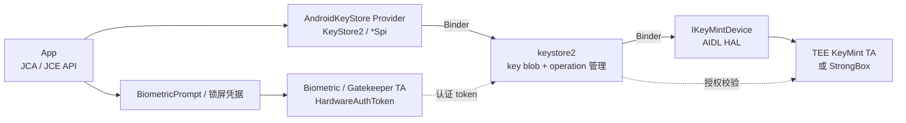
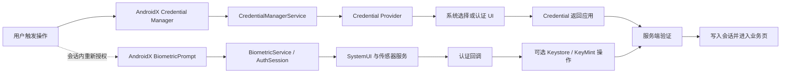
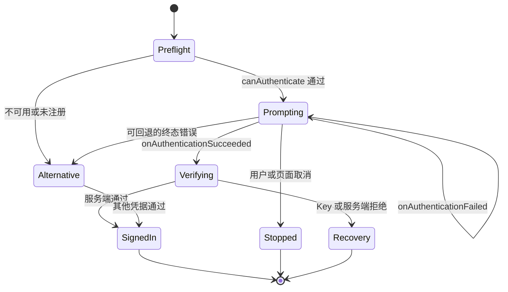

# Keystore、Biometric 与 Credential 登录性能

登录流程中的一次签名或解密，可能依次经过 App、`keystore2`、KeyMint HAL（硬件抽象层），随后进入 TEE（Trusted Execution Environment，可信执行环境）或 StrongBox 安全硬件。若密钥绑定了用户认证，链路中还会出现系统认证 UI、传感器、Gatekeeper 或 biometric TA（运行在安全环境中的可信应用），以及用于证明认证结果的 Hardware Auth Token。

若把这些阶段统称为“Keystore 很慢”，既无法定位瓶颈，也可能让性能改动破坏原有安全约束。

平台源码锚点为 Android 17 / API 37 的 `android-17.0.0_r1`，kernel 侧固定到 `android17-6.18-2026-06_r6`。应用 API 以 Android Developers 文档为准，服务行为与 operation 生命周期则回到 Android 17 的 framework 和 `system/security` 源码核查。这里的 operation 是一次有状态的密码操作会话，从初始化到完成或中止都占用后端资源。

登录链路可能同时访问 Keystore/KeyMint、BiometricPrompt 和 Credential Manager。密钥操作、硬件认证、系统 UI 与网络请求应分段计时，避免把安全等待统一归为接口慢。

## 密钥生成、访问与 KeyMint 延迟

### 调用路径：App、Keystore2、KeyMint 与安全环境

Android Keystore 以 JCA/JCE Provider 的形式接入 Java 密码 API。JCA/JCE 是 Java 的密码体系，Provider 负责实现具体算法和密钥访问。`KeyStore`、`KeyGenerator`、`KeyPairGenerator`、`Cipher`、`Signature` 和 `Mac` 对象在 App 进程中创建；需要使用受保护密钥时，调用才通过 Binder 进入 `keystore2`。

下面的图同时展示密码操作和用户认证两条路径，说明认证结果怎样参与密钥授权；它们并不共享完全相同的执行阶段。



图中的 `keystore2` 保存 KeyMint 返回的加密 key blob（由安全环境封装的不透明密钥数据）和元数据。对于 hardware-backed key（硬件保护密钥），明文密钥材料只在对应安全环境内可用。待签名消息、待加密明文或密文仍会从 App 传到系统进程，再交给 KeyMint 处理，因此不能宣称业务数据“从未离开 App”。

#### 一次操作至少有五段

| 阶段 | 入口示例 | 主要成本 | 可观测性 |
|---|---|---|---|
| 密钥查找（key lookup） | `KeyStore.getKey()`、`getEntry()` | Provider、Binder、数据库/key blob 读取 | App trace marker、Binder、`keystore2` 调度 |
| 密钥生成或导入 | `generateKey()`、`generateKeyPair()` | 随机数、参数校验、安全级别、key blob、证书 | 端到端 trace marker、错误码 |
| operation 初始化 | `Cipher.init()`、`Signature.initSign()` | 密钥查找、KeyMint `begin()`、slot、challenge | App trace marker、Binder、operation 错误 |
| 数据处理与结束 | `update()`、`doFinal()`、`sign()` | 数据传输、硬件计算、认证 token 校验 | payload 大小、端到端耗时 |
| 用户认证 | `BiometricPrompt.authenticate()` | 系统 UI、用户操作、传感器、认证 TA | prompt 回调与认证错误 |

App trace marker 是应用写入时间线的自定义起止标记。认证 UI 的等待时间不属于密码算法耗时；通过网络换取会话 token、由服务端校验 attestation 的时间也不属于本地 KeyMint 耗时。指标必须沿这些边界分段记录。

### `init()` 已经创建 KeyMint operation

Android 17 的 `AndroidKeyStoreCipherSpiBase.engineInit()` 会调用 `ensureKeystoreOperationInitialized()`，后者进入 `KeyStoreSecurityLevel.createOperation()`。`Signature.initSign()`、`Mac.init()` 也遵循相同的 operation 模型。每个 operation 会关联后端句柄并占用一个 slot（可同时存在的操作名额）。若耗时埋点只包住 `doFinal()` 或 `sign()`，就会漏掉 `begin()`、key blob 读取和 slot 分配。

Android 17 源码还给出两个工程约束：

- `engineGenerateKey()` 和多处 `engineInit()` 会调用 `StrictMode.noteSlowCall()`，或标记磁盘读写，表明这些路径可能阻塞调用线程。
- Cipher reset、成功结束和部分错误都会 abort（中止）operation；finalizer 是对象回收前的兜底清理，不能依赖 GC 及时释放硬件 slot。

因此，`Cipher`、`Signature` 或 `Mac` 在 `init` 后应尽快完成。提前数分钟创建对象再等待用户操作，会无谓地延长 operation 和 slot 的占用时间。

#### operation 的完整生命周期

一个 KeyMint operation 从 `begin()` 开始，以下事件都会结束这次会话：

- `finish()` 成功；
- `update()` 或 `finish()` 返回错误；
- 客户端显式 `abort()`；
- operation 对应的 Binder 对象被释放；
- slot 紧张时被 Keystore2 prune，也就是选中并回收。

同一个 operation 代理还有并发保护。Android 17 的 `operation.rs` 在多个线程同时调用同一 operation 时可返回 `OPERATION_BUSY`，因此同一个 `Cipher` 或 `Signature` 实例不能并发使用。

### 密钥生成、签名、解密与 attestation

#### 密钥生成（key generation）

生成密钥通常比读取已有密钥耗时更长。成本可能包括生成安全随机数、创建 key blob、检查硬件能力、持久化，以及为非对称密钥生成证书。若设置 attestation challenge（服务端提供的随机质询），还会生成带 attestation extension（密钥证明扩展）的证书链。

生成动作适合放在：

- 首帧后的明确后台任务；
- 用户启用支付、设备绑定或安全登录的设置流程；
- 注册完成后、进入高频登录之前的准备阶段。

同一用途的密钥不应在每次 App 冷启动、每次登录点击或每个网络请求中重复生成。检查密钥是否存在时，还要处理密钥被删除，以及锁屏重置、biometric enrollment（生物识别模板录入状态）变化或 OTA 系统升级后失效等情况。

#### begin/update/finish

硬件保护的 operation 适合处理密钥、短 challenge、小 token，或执行 data key wrapping（数据密钥封装）。若把大文件、数据库页或长 JSON 直接送入 Keystore，会增加 Binder/KeyMint 往返和数据传输，并长时间占用 operation slot。

大数据加密常采用 envelope encryption（信封加密）：业务数据由临时数据密钥加密，Android Keystore 密钥只负责保护这把数据密钥。

1. 用经过安全审查的密码库生成 data encryption key（DEK，数据加密密钥）。
2. 用 DEK 对业务数据执行 AEAD（带关联数据的认证加密），同时保证机密性和完整性。
3. 用 Android Keystore 密钥包装或保护 DEK。
4. 按协议保存算法版本、nonce（一次性随机数或计数值）、wrapped key（封装后的密钥）和 ciphertext（密文）。

这项设计必须经过威胁模型和密码协议审查。它可以降低安全硬件的数据吞吐压力，但应用不能自行更换算法、复用 nonce 或长期缓存明文 DEK。

#### 密钥证明（attestation）

attestation 用证书链证明密钥的属性及其受保护环境。它应拆成三个指标：

- 本地密钥生成；
- 本地 attestation certificate chain（证明证书链）返回；
- 服务端上传、链验证和策略判断。

若把后两项都放进一个登录网络 span（链路追踪区间），设备侧问题会被网络与服务端耗时掩盖。证书链、challenge 和应用标识也具有安全与隐私属性；日志只记录长度、结果类别和版本，不记录原始内容。

### 认证绑定密钥：per-use 与 time-based 两套流程

`setUserAuthenticationRequired(true)` 让 secret key（对称密钥）或 private key（私钥）的使用受到用户认证约束。API 30 及以上可用 `setUserAuthenticationParameters(timeoutSeconds, authTypes)` 指定授权有效期和允许的认证类型。

| 类型 | `timeout` | 推荐流程 | operation 何时创建 |
|---|---:|---|---|
| per-use（每次使用授权） | `0` | 初始化密码 operation，作为 `CryptoObject` 交给 BiometricPrompt | prompt 前、临近使用时创建 |
| time-based（限时授权） | `> 0` | 先尝试初始化；遇到 `UserNotAuthenticatedException` 后认证，再创建一个新 operation | 有效授权期内创建 |

#### per-use 密钥

下面的 `KeyGenParameterSpec` 配置表示每次签名都需要 Class 3 biometric（Android 定义的强生物识别等级）或设备锁屏凭据授权。

```kotlin
val spec = KeyGenParameterSpec.Builder(
    alias,
    KeyProperties.PURPOSE_SIGN,
)
    .setDigests(KeyProperties.DIGEST_SHA256)
    .setUserAuthenticationRequired(true)
    .setUserAuthenticationParameters(
        0,
        KeyProperties.AUTH_BIOMETRIC_STRONG or
            KeyProperties.AUTH_DEVICE_CREDENTIAL,
    )
    .build()
```

生成密钥后，每次使用都要新建一个 `Signature` 并调用 `initSign()`，再将它包装成 `BiometricPrompt.CryptoObject`。认证成功回调会返回已经获得本次授权的 operation，应用随后在同一对象上完成签名。若在回调前另建一个 `Signature`，新对象对应的是另一项 operation，没有绑定刚才的认证结果。

#### time-based 密钥

time-based 密钥的初始化可能抛出 `UserNotAuthenticatedException`，表示当前没有仍在有效期内的认证授权。此时应展示策略允许的生物识别或设备凭据流程；认证成功后，重新创建并初始化 `Cipher` 或 `Signature`，不再使用初始化失败的旧对象。

BiometricPrompt 等待阶段需要单独记录：

- 从 `prompt_requested` 到 `onAuthenticationSucceeded`、错误或取消回调；
- 认证成功后的密码操作完成时间；
- 登录网络请求及服务端响应。

用户思考或操作的时间、系统 UI 动画和传感器重试都属于 prompt 阶段。KeyMint operation 只覆盖密码操作和授权校验中的一部分，不能用它代表完整的用户认证时长。

#### 密钥永久失效（invalidation）

关闭安全锁屏、强制重置凭据或改变 biometric enrollment，可能让密钥永久失效，并在初始化时抛出 `KeyPermanentlyInvalidatedException`。恢复策略应明确：

- 哪些密钥可以删除后重建；
- 哪些密钥失效后需要重新登录或在服务端解除设备绑定；
- 是否允许 `AUTH_DEVICE_CREDENTIAL`；
- enrollment 变化后密钥是否保持有效。

把“重建密钥”当作通用重试，可能导致旧密钥保护的数据再也无法解密。重建前要确认服务端和本地恢复协议允许这样做。

### StrongBox、TEE 与 security level

Android 9 / API 28 及以上设备可以提供 StrongBox KeyMint。TEE 与 Android 主系统隔离运行，StrongBox 则使用隔离程度更高的安全硬件。StrongBox 面向更高的物理攻击和侧信道风险，但通常速度更慢、资源更少、并发能力更低，因此多数应用无需默认选择。

#### 区分设备能力与业务策略

`FEATURE_STRONGBOX_KEYSTORE` 只说明设备声明了 StrongBox 能力。具体的算法、key size（密钥长度）、digest（摘要算法）、padding（填充方式）或 attestation 参数组合仍可能不受支持。`setIsStrongBoxBacked(true)` 失败时会抛出 `StrongBoxUnavailableException`，平台不会自动改为生成 TEE 密钥。

应用需要预先定义三类策略：

| 策略 | StrongBox 不可用时 | 适合场景 |
|---|---|---|
| required（必须） | 终止流程并提示，或交给服务端处理 | 高价值设备绑定、明确合规要求 |
| preferred（优先） | 记录失败，经安全策略批准后重新生成非 StrongBox 密钥 | 中风险签名、可分级设备 |
| not requested（不要求） | 使用平台选择的普通 Android Keystore 安全级别 | 普通会话和大多数 App |

preferred fallback（首选方案不可用时的后备流程）需要由应用重新发起一次密钥生成。新密钥的安全级别已经改变，应用必须记录这次变化并通知服务端，不能只捕获异常后悄悄继续。

#### 查询生成结果

Android 12 / API 31 及以上可通过 `KeyInfo.getSecurityLevel()` 读取：

- `SECURITY_LEVEL_STRONGBOX`；
- `SECURITY_LEVEL_TRUSTED_ENVIRONMENT`；
- `SECURITY_LEVEL_SOFTWARE`；
- `SECURITY_LEVEL_UNKNOWN_SECURE` / `UNKNOWN`。

埋点既要记录 `strongbox_requested`，也要记录密钥生成后的实际 security level 和 fallback 原因。三者齐全后，才能比较不同安全级别的延迟，并识别请求 StrongBox 后发生了多少次降级。

### operation slot：没有稳定的等待队列

AOSP KeyMint AIDL 自 Android 12 / API 31 起就把 `IKeyMintDevice.begin()` 的最低并发上限写成 32，注释原文为 "IKeyMintDevice implementations must support 32 concurrent operations"。`source.android.com/docs/security/features/keystore/implementer-ref` 上仍写着 16，那是 API 31 之前 KeyMaster 与早期 KeyMint 文档的历史遗留值，不要再当作当前合同。Android 17 的 keystore2 代码本身没有固定配额常量，而是把上限交给 KeyMint HAL 的 AIDL 合同。

`vold` 是 Android 的卷管理守护进程，会使用 KeyMint 支撑存储加密。Keystore2 不在源码里写死为 `vold` 保留一个 slot；如果想给 `vold` 留出余量，应该在自测时直接观察 prune/返回错误，而不是套用旧文档里的“15+1”分配。

不能据 AIDL 合同认定第 32 个 App 请求会进入 FIFO（先进先出）队列等待。Android 17 的处理过程如下：

1. `IKeyMintDevice.begin()` 返回 `TOO_MANY_OPERATIONS`。
2. Keystore2 调用 `OperationDb::prune()`，尝试选中并释放一项已有 operation。
3. `prune()` 用 malus（修剪分）选候选：`malus = 1 + sibling_count + floor(log6(age_in_seconds + 1))`，其中 sibling 指同一 owner（所属客户端 UID）下的其他 operation；分值高者优先被选作修剪目标，老的、最近没动过的 sibling 最容易被回收。
4. 没有合适候选时可能返回 `BACKEND_BUSY`；被 prune 的旧 operation 再次使用时会收到 invalid handle（句柄已失效）类错误。

因此，应用侧应限制并发、缩短 operation 生命周期，并按请求记录 busy、pruned 和 invalid-handle 类错误。旧资料常将策略概括为“中止全局最久未使用的 operation”，这个说法没有包含 Android 17 对 owner 和 sibling operation 数量的考虑；KeyMint AIDL 的 32 是针对整个 HAL 的下限，不等于 App 一次能开多少并发 operation。

#### 容易耗尽 slot 的写法

- 为即将展示的多个列表项提前各建一个 `Cipher`。
- per-use operation 创建后，用户长时间没有响应 BiometricPrompt。
- 批量文件加解密为每个分片同时建立硬件 operation。
- 多个 SDK 各自使用无界线程池访问 Keystore。
- 超时后保留旧 `Cipher`，同时开始新一轮重试。

Keystore 工作线程池应限制最大线程数，通常一到少量线程即可。合适的并发值要分别在 TEE 和 StrongBox 上压测确定，不能直接照搬 CPU 核数。

### 冷启动和登录的线程调度

Android 官方明确建议避免在主线程使用 `AndroidKeyStore`。密钥查找、`init`、生成、签名和 `doFinal` 都可能等待 Binder、数据库或安全硬件；Android 17 Provider 源码也通过 StrictMode 标出了多处慢调用。在主线程执行这些操作，会直接阻塞界面绘制和输入处理。

#### 时机表

| 时机 | 可安排的工作 | 应避开的工作 |
|---|---|---|
| 首帧前 | 读取不依赖 Keystore 的轻量登录状态 | 密钥生成、attestation、StrongBox operation、批量解密 |
| 首帧后 | 检查密钥能力、预生成允许提前创建的密钥 | 创建 per-use operation 后长期等待 |
| 登录点击后 | 在有界后台执行器中创建本次密码 operation | 在主线程串行执行密码操作、JSON 处理和网络请求 |
| prompt 阶段 | 展示认证 UI，处理取消和错误 | 同时启动多个备用 operation |
| 认证成功后 | 完成本次短签名/解密，发起网络换票 | 解密大文件或大数据库 |

下面的 Kotlin 示例在专用 Dispatcher 上执行一次短签名。这个 Dispatcher 使用固定大小的线程池，trace 区间覆盖 `initSign` 和 `sign`，因此不会漏掉 operation 初始化时间。

```kotlin
private val keystoreDispatcher =
    Executors.newFixedThreadPool(2).asCoroutineDispatcher()

suspend fun signChallenge(alias: String, challenge: ByteArray): ByteArray =
    withContext(keystoreDispatcher) {
        Trace.beginSection("Keystore:sign")
        try {
            val store = KeyStore.getInstance("AndroidKeyStore").apply {
                load(null)
            }
            val privateKey = store.getKey(alias, null) as PrivateKey
            Signature.getInstance("SHA256withECDSA").run {
                initSign(privateKey)
                update(challenge)
                sign()
            }
        } finally {
            Trace.endSection()
        }
    }
```

示例适用于无需通过 `CryptoObject` 单独授权的密钥。per-use 密钥应先在后台初始化 `Signature`，再回到主线程将它交给 BiometricPrompt；认证成功后，把回调返回的同一对象转移到后台完成签名。整个过程中不能并发使用该对象。若 Dispatcher 隶属于有明确生命周期的组件，应在组件销毁时关闭它，避免线程泄漏。

#### 超时与取消

JCA Keystore API 没有统一的 per-operation deadline（单次操作截止时间）。`withTimeout`、`Future.get(timeout)` 或业务计时器可以让上层停止等待，并让 UI 进入备用登录流程；但如果调用已经进入 Binder/KeyMint，这些计时机制不保证底层操作会立即停止。

处理超时应遵守：

- 旧 worker（工作线程）尚未结束时，不复用同一个密码对象；
- 将晚到结果标记为过期，不写入当前会话；
- BiometricPrompt 取消只按其 API 取消认证 UI；
- worker 返回后释放对象引用，让 Provider 完成 finish 或 abort；
- 连续超时后进入退避等待或备用登录，不做没有并发上限的重试。

### 观测：分阶段、分安全级别、保护敏感数据

#### 应记录的字段

| 字段 | 示例 | 用途 |
|---|---|---|
| `scene` | `session_restore`、`biometric_login`、`payment_confirm` | 对齐用户流程 |
| `phase` | `get_key`、`generate`、`begin`、`prompt_wait`、`finish`、`attestation` | 找到耗时阶段 |
| `primitive` | `AES_GCM`、`HMAC_SHA256`、`ECDSA_P256` | 区分密码原语或算法组合 |
| `purpose` | encrypt、decrypt、sign、verify、agree | 区分授权 |
| `security_level` | TEE、StrongBox、Software、Unknown | 比较实现 |
| `strongbox_requested` | true / false | 对照策略 |
| `auth_policy` | none、per-use、duration、credential | 区分授权方式 |
| `payload_bucket` | 0—64 B、65—512 B、513 B—4 KiB | 用区间记录输入大小，避免暴露精确长度 |
| `thread` | main / keystore-worker | 暴露 UI 阻塞 |
| `duration_ms` | 单次值，服务端计算 P50/P90/P99 | 保留耗时分布，而非只看平均值 |
| `result_class` | ok、not-authenticated、invalidated、unavailable、busy | 归类失败 |
| `device/build/app` | 型号、Build、版本 | 识别设备聚集 |

不要记录 key alias（密钥别名）、明文、密文、签名原文、认证 token、attestation challenge 或完整证书链。alias 常包含账号或业务含义，也不适合作为日志标签。

#### Perfetto 能看到什么

在能够稳定复现问题的设备上，采集应用 trace marker、sched（线程调度）、Binder、CPU frequency（CPU 频率）和磁盘 I/O，可以回答：

- App 主线程是否同步等待；
- Binder 调用发往 `keystore2` 的起止和调度延迟；
- `keystore2` 线程是 Running、Runnable、Sleeping，还是运行过程中被其他线程抢占；
- key 数据库访问是否伴随 I/O；
- 多个请求是否在同一时间窗内竞争 operation。

TEE/StrongBox 内部阶段通常不会出现在普通 Perfetto trace 中。若时间线只能看到 `keystore2` 进入 KeyMint，无法看到安全环境内部的细分轨道，结论应写成“耗时位于 KeyMint/HAL/安全环境区间”，再结合厂商日志或 HAL instrumentation（HAL 内部插桩）继续定位。时间线上的空白不足以证明某个密码算法本身很慢。

#### 测试组合

每个关键 primitive（密码原语或算法组合）至少覆盖以下测试条件：

- key 首次生成与既有 key；
- 4 KB 和更小的 payload，避免只测试空消息；
- TEE 与 StrongBox 的实际 security level；
- 单 operation、少量并发，以及接近 slot 上限的受控压力测试；
- 冷机、热机、锁屏后，以及 biometric enrollment 变化后；
- 成功、用户取消、认证失败、密钥失效和 StrongBox 不可用；
- 设备型号、Android 版本、厂商 Build。

“StrongBox 比 TEE 慢多少毫秒”没有适用于所有设备的固定答案。测试时要保存条件和分位数，并在同一设备上使用相同密钥类型、算法、payload 和认证策略对照。

### 治理：性能动作不能改变安全策略

| 动作 | 性能收益 | 安全边界 |
|---|---|---|
| 首帧后预生成 | 移出冷启动和点击路径 | 只预生成已获同意、允许提前存在的 key |
| 有界后台执行 | 避免主线程卡顿 | 线程切换不改变密钥授权条件 |
| just-in-time `init`（临用时初始化） | 缩短 slot 占用 | per-use operation 要与 prompt 绑定 |
| envelope encryption | 减少安全硬件处理大 payload 的时间 | 协议、AEAD、nonce 与数据密钥生命周期需审查 |
| StrongBox preferred fallback | 提高设备覆盖 | 记录降级，并让服务端接受变化后的 security level |
| 超时或备用登录 | 让 UI 可以继续响应 | 上层超时不代表 operation 已取消 |
| 能力缓存 | 减少重复探测 | 系统升级、锁屏和 enrollment 变化后失效 |

可以缓存设备能力结果、密钥是否存在的非敏感状态和服务端策略版本。解密后的 refresh token（刷新令牌）不应仅为缩短 Keystore 耗时而缓存；明文缓存扩大了数据可能暴露的位置，必须单独进行安全评审。

### Passkey / Credential Manager 的边界

Credential Manager 是初始登录的统一凭据入口，也支持后续重新授权。普通 relying-party App（依赖凭据完成登录的业务应用）请求 passkey 时，私钥通常由 credential provider（凭据提供方）管理。用户创建 passkey，并不代表业务 App 自己新增了一个 `AndroidKeyStore` alias。

性能指标应分开：

- Credential Manager 发出请求到 provider UI 出现；
- 用户选择/认证；
- provider 返回 credential（凭据）；
- App 与服务端完成 assertion（认证断言）验证；
- App 自己用于会话缓存的 Keystore 解密。

只有应用自行生成 Android Keystore 密钥，或应用本身实现 credential provider 并管理相应密钥时，才需要把这些密钥纳入 alias、operation 与 security-level 清单。

### Android 6—17 的版本边界

| 版本 | 相关能力 |
|---|---|
| Android 6 / API 23 | `KeyGenParameterSpec` 与认证绑定密钥的现代应用基线 |
| Android 9 / API 28 | StrongBox API 与 `StrongBoxUnavailableException` |
| Android 11 / API 30 | `setUserAuthenticationParameters()` 明确认证有效期与 auth type |
| Android 12 / API 31 | Keystore2 + KeyMint 架构；`KeyInfo.getSecurityLevel()` |
| Android 13 / API 33 | KeyMint v2 增加 Curve25519 等能力 |
| Android 17 / API 37 | 本文源码锚点；Keystore2 operation、Provider 和 AIDL KeyMint 主线按固定 tag 核查 |

平台版本表只描述 API 和架构边界。StrongBox 支持情况、算法组合、可用 operation 数和安全环境耗时仍由具体设备实现决定。

### Android 17 与 kernel 源码入口

Android 17 可从以下固定源码继续追踪：

- [`KeyStore2.java`](https://android.googlesource.com/platform/frameworks/base/+/android-17.0.0_r1/keystore/java/android/security/KeyStore2.java)：App Provider 到 `IKeystoreService` 的 Binder 客户端。
- [`AndroidKeyStoreKeyGeneratorSpi.java`](https://android.googlesource.com/platform/frameworks/base/+/android-17.0.0_r1/keystore/java/android/security/keystore2/AndroidKeyStoreKeyGeneratorSpi.java)：security level 选择、密钥生成与 StrongBox 错误映射。
- [`AndroidKeyStoreCipherSpiBase.java`](https://android.googlesource.com/platform/frameworks/base/+/android-17.0.0_r1/keystore/java/android/security/keystore2/AndroidKeyStoreCipherSpiBase.java)：`engineInit()`、operation 创建及 finish/abort。
- Keystore2 [`security_level.rs`](https://android.googlesource.com/platform/system/security/+/android-17.0.0_r1/keystore2/src/security_level.rs)：KeyMint `begin()`、`TOO_MANY_OPERATIONS` 与 prune 重试。
- Keystore2 [`operation.rs`](https://android.googlesource.com/platform/system/security/+/android-17.0.0_r1/keystore2/src/operation.rs)：operation 生命周期、并发保护和 pruning 算法。
- [`IKeyMintDevice.aidl`](https://android.googlesource.com/platform/hardware/interfaces/+/android-17.0.0_r1/security/keymint/aidl/android/hardware/security/keymint/IKeyMintDevice.aidl)：KeyMint HAL 的 generate/import/begin 接口。

App 到 `keystore2`，以及 `keystore2` 到 Binderized KeyMint HAL（通过 Binder 暴露的 KeyMint 服务）都经过 Binder。kernel `android17-6.18-2026-06_r6` 可固定查看 [`drivers/android/binder.c`](https://android.googlesource.com/kernel/common/+/refs/tags/android17-6.18-2026-06_r6/drivers/android/binder.c)。TEE/StrongBox 的 transport（通信通道）和 driver 多由设备厂商实现，不在 common kernel 中；没有设备内核与 HAL 源码时，应明确说明这部分无法继续归因。

### 与其他章节的关系

- [8.2 App 冷启动链路与 Binder Trace 分析](02-app-cold-start-binder-trace.md)：首帧、TTID/TTFD 与初始化时机。
- [8.3 启动优化策略](03-launch-optimization.md)：延迟初始化、线程调度和回归。
- [§8.5 BiometricPrompt 与 Credential Manager](05-keystore-biometric-credential-login.md)：认证 UI、凭据选择与登录流程。
- [§20.9 Keystore 配额与登录稳定性](../../part5-app/ch20-stability/09-keystore-quota-login-stability.md)：alias 增长、配额和账号生命周期。
- [§26.1 性能指标采集](../../part5-app/ch26-observability/01-app-observability-performance-collection.md)：端侧指标、采样与上报。

### 结论

Keystore 延迟要按密钥查找、生成、operation 初始化、update/finish、认证 UI 等待、attestation 和网络验证分段。`Cipher.init()` 已经可能占用 KeyMint slot；per-use 密钥必须把同一个 `CryptoObject` 交给认证流程；time-based 密钥在认证成功后创建新的 operation。

StrongBox 是安全策略选择，不以高性能为目标，失败时也不会自动回退。应用应采用有并发上限的后台执行器、短生命周期 operation、小 payload 和分阶段指标；遇到超时、prune、密钥失效或设备差异时，登录流程仍要提供明确且安全的恢复路径，并保持服务端认可的安全级别。

## 生物认证、凭据选择与登录完成

密钥可用后，认证 UI 和凭据提供方还会引入 Binder、硬件和用户交互等待。最终登录完成时间应与密钥阶段分开归因。

如果登录页只记录一个 `login_cost_ms`（登录总耗时），出现慢登录时几乎无法判断时间花在哪里。一次凭据登录可能包含 Credential Provider 查询、系统凭据选择器、用户操作、传感器认证、passkey assertion（通行密钥生成的认证断言）、服务端验证和会话初始化；会话内的重新授权则可能只经过 `BiometricPrompt`、Keystore 与业务操作。两个流程都会显示系统认证界面，但调用者、数据边界和可观测信号并不相同。

平台源码基线为 Android 17（API 37）的 `android-17.0.0_r1`，内核基线为 `android17-6.18-2026-06_r6`。应用初次登录优先使用 Credential Manager；已登录会话内确认敏感操作时，可以使用 Credential Manager 或 AndroidX `BiometricPrompt`。这一分工来自当前 [Android 生物认证指南](https://developer.android.com/identity/sign-in/biometric-auth)，也能避免应用自行实现账号选择与认证界面。

### 两条流程，两个责任边界

登录与重新授权可以共享同一种 `flow_id`（一次用户意图的短期关联 ID）规则，但应使用各自的阶段名称。下图中的实线表示 Credential Manager 登录，虚线表示会话内重新授权：



图中两条路径最终都要回到业务验证。Credential Manager 返回的 `Credential` 仍需由应用和服务端验证。`BiometricPrompt` 的成功回调只说明平台接受了本次认证；应用仍要自行推进账号会话，服务端也仍要验证 passkey assertion。

性能拆分建议使用下列口径：

| 阶段 | 应用入口或完成点 | 应用能直接观测什么 | 不应从该阶段推断什么 |
|---|---|---|---|
| 凭据请求 | `getCredential()` 开始到返回或抛出异常 | 请求类型、总等待、结果类型、异常类 | 各 provider 的查询时长、候选总数、系统 UI 出现时间 |
| 生物认证请求 | `authenticate()` 开始到成功或终态错误 | 请求时间、认证类型、错误码、调用方取消原因 | 对话框精确出现时间、实际使用的指纹或人脸传感器 |
| 加密操作 | `Cipher.init`、`Signature.initSign`、`doFinal`、`sign` | 每次调用耗时、异常家族、密钥策略 | 用户停留时间、服务端耗时 |
| 凭据验证 | Credential 返回到服务端响应 | 网络耗时、HTTP 类别、验证或风控结果 | SystemUI 或传感器性能 |
| 会话就绪 | 服务端通过到目标页面首帧 | 本地写入、数据加载、首帧时间 | 前面认证阶段的耗时 |

`CredentialManager.getCredential()` 的等待时间包含用户在系统 UI 上查看和选择凭据的时间。`BiometricPrompt` 从发起请求到收到回调的区间也包含用户操作。没有平台专用观测能力时，应用只能将这些指标命名为“请求到结果”，不能将整段时间标成“provider 查询耗时”或“传感器识别耗时”。

### BiometricPrompt：从应用调用到系统回调

AndroidX `BiometricPrompt` 是应用侧推荐使用的封装。Android 9（API 28）及以上使用系统认证界面；AndroidX 还处理版本兼容和配置变更后的回调接续。平台文档说明，`BiometricPrompt.authenticate()` 会触发准备生物识别硬件、显示系统对话框和开始扫描等后续工作；该方法返回时，界面不一定已经可见。

Android 17 源码把这段工作分到多个进程和对象：

1. Framework 的 [`BiometricPrompt.java`](https://android.googlesource.com/platform/frameworks/base/+/android-17.0.0_r1/core/java/android/hardware/biometrics/BiometricPrompt.java) 在 `authenticateInternal()` 中调用 `IBiometricService.authenticate()`，并把 `CancellationSignal` 连接到返回的请求 ID。
2. `system_server` 中的 [`BiometricService.java`](https://android.googlesource.com/platform/frameworks/base/+/android-17.0.0_r1/services/core/java/com/android/server/biometrics/BiometricService.java) 接收 Binder 请求后，将 `handleAuthenticate()` 投递到服务 Handler（串行处理消息的线程队列）。请求会经过权限、前台状态、认证器可用性和注册状态检查。
3. [`AuthSession.java`](https://android.googlesource.com/platform/frameworks/base/+/android-17.0.0_r1/services/core/java/com/android/server/biometrics/AuthSession.java) 保存一次认证会话的状态，并通过状态栏服务请求 SystemUI 显示认证界面。
4. SystemUI 的 [`AuthController.java`](https://android.googlesource.com/platform/frameworks/base/+/android-17.0.0_r1/packages/SystemUI/src/com/android/systemui/biometrics/AuthController.java) 实现 `showAuthenticationDialog()`，处理界面展示、消失和结果回传。
5. 每个生物传感器有自己的 [`BiometricScheduler.java`](https://android.googlesource.com/platform/frameworks/base/+/android-17.0.0_r1/services/core/java/com/android/server/biometrics/sensors/BiometricScheduler.java) 实例。它维护当前操作和待处理队列，再由具体的 sensor service（传感器系统服务）与厂商 HAL 交互。

这条调用路径跨越应用进程、`system_server`、SystemUI、传感器服务和厂商 HAL。应用主线程 trace 只能覆盖调用方看到的部分，无法细分这些系统组件各自的耗时。

#### 应用没有公开的 prompt-onShown 回调

AndroidX 公开的 `AuthenticationCallback` 只提供成功、终态错误和本次样本未识别三类结果，没有“对话框已显示”回调。埋点名称要反映这个限制：

- `biometric_request_start`：调用 `authenticate()` 前；
- `biometric_rejected`：收到 `onAuthenticationFailed()`；
- `biometric_terminal`：收到 `onAuthenticationSucceeded()` 或 `onAuthenticationError()`；terminal 表示本次认证会话已经结束；
- `biometric_client_cancel`：应用调用 `cancelAuthentication()` 前记录自身原因。

`request_to_terminal_ms` 是应用可以稳定记录的口径。只有测试环境通过录屏、UI 自动化、Perfetto 或平台内部日志取得界面实际显示时间后，`prompt_show_ms` 才有依据。线上若直接把调用 `authenticate()` 的时间当作 prompt 出现时间，就会把 Binder 调度、预检查和 SystemUI 调度一并误算为界面展示耗时。

#### 配置变更不会要求重启认证

当前 [AndroidX `BiometricPrompt` API 参考](https://developer.android.com/reference/androidx/biometric/BiometricPrompt) 明确说明，旋转等配置变更导致 Activity 或 Fragment 重建时，认证界面默认继续保留。应用应在新的 `onCreate()` 早期重新构造 `BiometricPrompt`，让新实例的 callback 接收正在进行的会话；此时无需再次调用 `authenticate()`，也不应调用 `cancelAuthentication()`。

同一个 Activity 或 Fragment 创建多个 `BiometricPrompt` 时，只有最近创建实例的 callback 会被保存。登录页应只维护一个 prompt 实例，并用业务状态阻止重复点击。应用离开前台后，系统可能因安全策略关闭 prompt；这类终止要与旋转重建分别统计。

以下代码骨架演示怎样维持单次认证会话，并区分非终态与终态回调。`LoginViewModel` 和 `LoginMetrics` 代表业务自己的状态与埋点接口：

```kotlin
class LoginActivity : FragmentActivity() {
    private val loginViewModel: LoginViewModel by viewModels()
    private lateinit var biometricPrompt: BiometricPrompt

    override fun onCreate(savedInstanceState: Bundle?) {
        super.onCreate(savedInstanceState)

        biometricPrompt = BiometricPrompt(
            this,
            ContextCompat.getMainExecutor(this),
            object : BiometricPrompt.AuthenticationCallback() {
                override fun onAuthenticationFailed() {
                    LoginMetrics.rejected(loginViewModel.requireAttemptId())
                }

                override fun onAuthenticationError(
                    errorCode: Int,
                    errString: CharSequence
                ) {
                    loginViewModel.finishWithError(errorCode)
                }

                override fun onAuthenticationSucceeded(
                    result: BiometricPrompt.AuthenticationResult
                ) {
                    loginViewModel.finishWithSuccess(result.authenticationType)
                }
            }
        )
    }

    fun requestReauthentication(promptInfo: BiometricPrompt.PromptInfo) {
        if (!loginViewModel.beginAttempt()) return
        LoginMetrics.requestStarted(loginViewModel.requireAttemptId())
        biometricPrompt.authenticate(promptInfo)
    }
}
```

重建后的 Activity 会注册新的 callback，正在显示的认证会话继续运行。`beginAttempt()` 负责拒绝重复点击；`onAuthenticationFailed()` 只记录一次样本未识别，不结束业务状态。成功或错误回调才会结束本次 attempt。

#### 三种回调的状态含义

| 回调 | 会话状态 | 处理方式 |
|---|---|---|
| `onAuthenticationFailed()` | 非终态；本次生物样本未识别 | 记录一次 reject（未识别），继续等待系统允许的下一次尝试 |
| `onAuthenticationSucceeded()` | 终态；当前会话不会再有事件 | 读取 `authenticationType`，进入加密操作或业务验证 |
| `onAuthenticationError()` | 终态；当前会话不会再有事件 | 按 error code 分类，释放一次性业务状态 |

`ERROR_USER_CANCELED` 表示用户主动关闭认证界面；`ERROR_NEGATIVE_BUTTON` 表示用户点击了应用配置的负按钮；`ERROR_CANCELED` 多用于用户切换、设备锁定、传感器不可用或另一个请求造成的系统取消。三者的原因不同，不能合并为一个“用户取消”。`ERROR_LOCKOUT`、`ERROR_LOCKOUT_PERMANENT`、`ERROR_HW_UNAVAILABLE` 和 `ERROR_SECURITY_UPDATE_REQUIRED` 也要分别归类。厂商错误文本可能随设备和版本变化，不适合作为稳定聚合键；线上可以按标准错误码、是否存在 vendor code（厂商扩展码）及设备分组聚合。

#### 认证类型不等于传感器形态

`AuthenticationResult.getAuthenticationType()` 能区分 biometric（生物识别）、device credential（设备 PIN、图案或密码）和部分旧版本上的 unknown。它不公开本次使用的是指纹、人脸还是虹膜，也不公开具体是哪一个传感器。普通应用也没有可靠 API 读取本次生物认证的 modality（传感器形态）。

实验室设备清单可以标注 UDFPS（屏下指纹传感器）、侧边指纹、后置指纹、2D face 或 3D face，用来解释设备组差异；线上事件不能声称记录到了本次使用的 sensor 类型。设备同时支持多种 modality 时，按机型猜测尤其容易失真。

调用前应把 `PromptInfo` 使用的认证器组合原样传给 `BiometricManager.canAuthenticate()`。返回值只是调用当时的能力快照，设备状态随后仍可能变化，因此不能省略终态错误处理。`PromptInfo` 一旦允许 `DEVICE_CREDENTIAL`，就不能再设置 `setNegativeButtonText()`；设备凭据入口由系统管理。

### Credential Manager：应用方和 provider 方要分开

Credential Manager 这套体系包含 Jetpack API、平台服务、系统 UI 和 Credential Provider（凭据提供方）。这些角色的发布节奏、权限和可见数据不同：

| 角色 | 典型 API 或组件 | 能掌握的数据 |
|---|---|---|
| 依赖方应用 | `androidx.credentials.CredentialManager` | 自己提交的 option（凭据选项）、返回的 credential 类型、异常与总等待 |
| Jetpack 适配层 | AndroidX Credentials | 按平台版本和 provider 能力选择实现 |
| Android 14+ 平台服务 | `CredentialManagerService` | 启用的 provider、request session（一次应用请求）和 provider session（面向单个 provider 的子会话）及取消信号 |
| Credential Provider | `CredentialProviderService`、entry、`PendingIntent` | 自己查询到的凭据、自己生成的 entry（供系统展示的候选项）、provider 内部耗时 |
| 服务端 | WebAuthn / 密码 / 联合身份验证 | challenge、assertion、账号和风控结果 |

业务 App 通常属于依赖方。它调用 `getCredential()`，却不能直接读取系统选择器中的候选总数，也不知道每个 provider 的查询耗时。凭据提供方可以统计自己返回的候选和内部时延，但它看不到其他 provider，因而不能把自己的数量当作系统候选总数。

Android 17 的 [`CredentialManagerService.java`](https://android.googlesource.com/platform/frameworks/base/+/android-17.0.0_r1/services/credentials/java/com/android/server/credentials/CredentialManagerService.java) 展示了平台侧结构：`executeGetCredential()` 创建请求级 `GetRequestSession`，为各 provider 准备子会话并启动查询；`executePrepareGetCredential()` 创建 `PrepareGetRequestSession`，同样准备 provider session，并返回后续请求所需的 handle（继续这次预取的句柄）。一次 API 调用可以包含多个 provider session，而依赖方应用只能收到最终 response 或 exception。

#### `prepareGetCredential()` 的适用边界

AndroidX [`prepareGetCredential()`](https://developer.android.com/reference/kotlin/androidx/credentials/CredentialManager#prepareGetCredential%28androidx.credentials.GetCredentialRequest%29) 需要 Android 14（API 34）及以上。它只预取凭据查询所需的信息，不显示 UI；返回的 `PendingGetCredentialHandle` 必须传给后续的 `getCredential()`，才能完成选择、授权和凭据返回。

预取可以把部分 provider 准备工作移到用户点击前，但要同时满足三个条件：

- 请求内容已经确定，其中的 passkey challenge 仍在服务端规定的有效期内；
- 页面退出、账号切换或请求失效时能够取消或丢弃旧 handle；
- 完成阶段使用 Activity context，使系统 UI 依附于当前页面所在的任务栈。

Kotlin 挂起版 `getCredential()` 会随 coroutine scope（协程作用域）取消。需要让请求跨旋转继续时，可以使用 `viewModelScope` 等生命周期跨越配置变更的作用域；页面已结束或账号已切换时，应主动使请求失效。回调版则通过 `CancellationSignal` 传递取消信号。

预取事件可以记录 `prepare_start`、`prepare_result`、`resume_start` 和 `get_result`，从而比较准备阶段与完成阶段的耗时。即使使用预取，依赖方应用仍然拿不到 prompt 出现时间或各 provider 的独立查询时间。

### Android 15 single tap：provider 侧的集成能力

Android 15（API 35）加入 Credential Manager single tap（单击登录）：在单账号场景下，凭据信息可以直接显示在 Biometric Prompt 中，同时保留“更多选项”入口。一个账号即使同时拥有 passkey 和密码等多种凭据，仍可满足单账号条件；存在多个账号时，系统会回到标准选择流程。到 Android 17（API 37）为止，这个边界没有改变，详见 [single tap 官方指南](https://developer.android.com/identity/sign-in/single-tap-biometric)。

`BiometricPromptData` 是 AndroidX Credentials 1.5.0 增加的 provider 侧 API。凭据提供方把它放入 `CreateEntry` 或 `PublicKeyCredentialEntry` 后，系统才获得内嵌认证所需的信息。普通依赖方应用不构造这个对象，也拿不到 provider 侧的 `biometricPromptResult`。

provider 集成时有四条硬约束：

1. 显式设置 `allowedAuthenticators`。当前 single tap 指南的创建部分与 [`BiometricPromptData` API 参考](https://developer.android.com/reference/androidx/credentials/provider/BiometricPromptData) 对默认值的描述不一致，代码不应依赖默认值。
2. `cryptoObject` 非空时，`allowedAuthenticators` 必须精确设置为 `BIOMETRIC_STRONG`；若传入组合值，会触发 `IllegalArgumentException`。
3. 设备配置要求使用 PIN、图案或密码时，系统采用标准 Credential Manager 流程，provider 收到的 `biometricPromptResult` 为 `null`。
4. provider 必须处理 result 为成功、错误和 `null` 三种情况；`null` 表示这次没有走 provider 内嵌的生物认证结果，不能记成生物认证失败。

因此，依赖方应用只能稳定记录本次返回的 credential 类型、总耗时和 exception 类型。只有平台或 provider 提供了直接信号时，才能上报 `single_tap_used`；仅因总耗时较短就推测使用了 single tap，会让指标失真。

### CryptoObject：相似名字下有两套约束

旧实现常把“允许 device credential 时不能传 `CryptoObject`”写成适用于所有场景的规则。当前 API 要结合密钥类型、Android 版本和调用方角色判断：

| 形态 | 认证器配置 | `CryptoObject` 用法 | 版本或角色边界 |
|---|---|---|---|
| AndroidX `BiometricPrompt`，只确认用户 | `BIOMETRIC_STRONG`、`BIOMETRIC_WEAK`、`DEVICE_CREDENTIAL` 或支持的组合 | 不传 | 调用前用同一组合执行 `canAuthenticate()` |
| AndroidX `BiometricPrompt`，auth-per-use key（每次使用均需授权的密钥） | `BIOMETRIC_STRONG`，Android 11+ 也可按密钥策略允许 `DEVICE_CREDENTIAL` | 初始化操作后，把同一个对象传给 `authenticate()` | Android 10 及以下不支持 crypto 与 device credential 的组合 |
| time-based key（认证后限时可用的密钥） | 密钥设置认证有效期，可允许 strong biometric 或 device credential | prompt 不带对象；认证后在有效期内新建加密操作 | 超出有效期时会遇到 `UserNotAuthenticatedException` |
| provider single tap 的 `BiometricPromptData` | 有对象时必须精确为 `BIOMETRIC_STRONG` | provider 把对象放入 entry metadata | AndroidX Credentials provider API，不能套用普通 App 的组合规则 |

当前 [Android 生物认证指南的 auth-per-use 章节](https://developer.android.com/identity/sign-in/biometric-auth#auth-per-use-keys) 给出的密钥策略允许 `AUTH_BIOMETRIC_STRONG | AUTH_DEVICE_CREDENTIAL`；AndroidX `BiometricPrompt.authenticate(info, crypto)` 参考文档还说明了 Android 11 之前的兼容限制。指南中“不带 `CryptoObject`”的说明位于 time-based key 流程，不能套用到 Android 11+ 的 auth-per-use key。

密钥授权条件还要与 prompt 策略一致。若密钥只允许 strong biometric，即使 prompt 同时提供 device credential，PIN 也不能授权使用这把密钥。密钥允许两种认证器时，调用方仍需处理密钥失效、认证 token 不匹配和安全级别差异。完整的初始化顺序、KeyMint operation 与异常分类见 [§8.5 Keystore/KeyMint 调用链延迟](05-keystore-biometric-credential-login.md)。

性能埋点至少拆成这些时间段：

| 字段 | 起止点 | 解释 |
|---|---|---|
| `crypto_init_ms` | `Cipher.init` / `Signature.initSign` 调用 | 可能已经进入 Keystore、`keystore2` 与 KeyMint |
| `auth_request_to_terminal_ms` | `authenticate()` 到成功或终态错误 | 包含系统调度、UI、用户操作与 sensor 工作 |
| `crypto_finish_ms` | `doFinal` / `sign` 调用 | 反映授权后的 KeyMint 操作，不含网络 |
| `credential_request_ms` | `getCredential()` 到 response / exception | 包含 provider 查询、系统 UI 与用户操作 |
| `server_verify_ms` | 发出验证请求到服务端响应 | 反映网络、后端验证与风控 |

`onAuthenticationSucceeded()` 的时间和 `sign()` 返回时间要分别记录。若把两者合称为“指纹耗时”，StrongBox、TEE 或 KeyMint 队列延迟会被错误归因给传感器。

### 取消、失败与回退

是否切换到其他登录方式，应由终态决定。`onAuthenticationFailed()` 只表示本次样本未识别，不能每收到一次就再弹一个 prompt。一个稳定的状态流如下：



这张状态图将样本未识别、终态错误和业务验证失败放在不同状态，便于避免重复弹窗和错误归因。

| 信号 | 含义 | 合适的动作 |
|---|---|---|
| `onAuthenticationFailed()` | 当前样本未识别，会话仍在运行 | 留在系统 prompt，按区间记录 reject 次数 |
| `ERROR_USER_CANCELED` / negative button | 用户选择离开当前认证方式 | 回到当前页面，展示密码或其他凭据入口 |
| `ERROR_LOCKOUT` | 临时锁定 | 告知等待时间，允许 device credential 或其他登录方式 |
| `ERROR_LOCKOUT_PERMANENT` | 需要设备凭据解除 | 引导设备凭据，不自动循环生物认证 |
| `GetCredentialCancellationException` | 用户退出 Credential Manager | 保持登录页可操作，不转成“无凭据” |
| `NoCredentialException` | 请求范围内没有可用凭据 | 提供注册、密码或联合身份入口 |
| key invalid / auth required | 密钥状态或授权不满足 | 进入密钥恢复流程，参见 §20.3 |
| assertion 或风控拒绝 | 服务端不接受本次凭据 | 进入账号安全流程，不归到平台认证性能 |

应用主动取消时，要在调用取消 API 前记录 `cancel_source`，例如页面关闭、账号切换、请求过期或新请求替换旧请求。系统返回的 error code 只能描述平台终态，无法还原应用为何发起取消。

### 一套不越权的线上事件

建议为一次用户意图生成 `flow_id`，每次重试再生成新的 `attempt_id`（单次尝试 ID）。事件只记录应用能够直接观测的时间点：

| 事件 | 时间点 | 推荐字段 |
|---|---|---|
| `credential_request_start` | 调用 Credential Manager 前 | `flow_id`、`attempt_id`、`api_level`、`option_types`、`prepared` |
| `credential_request_end` | response 或 exception | `credential_type`、`exception_family`、`duration_ms` |
| `biometric_request_start` | 调用 `authenticate()` 前 | `authenticator_policy`、`crypto_mode`、`can_authenticate_result` |
| `biometric_rejected` | `onAuthenticationFailed()` | `reject_count_bucket` |
| `biometric_terminal` | success 或 error | `result`、`authentication_type`、`error_code`、`duration_ms` |
| `crypto_operation` | init 或 finish 返回 | `operation_phase`、`security_level`、`duration_ms`、`error_family` |
| `server_verify_end` | 服务端响应 | `duration_ms`、`network_class`、`http_family`、`decision_family` |
| `login_ready` | 目标页面首帧 | `final_method`、`fallback_reason`、`total_ms` |

依赖方应用不应上报 `candidate_count`、`provider_query_ms`、`prompt_shown_ms` 或 biometric modality，除非它获得了相应的直接信号。设备型号可以在满足合规要求的前提下映射为受控设备分组，避免自由文本产生大量不同取值，也就是高基数字段。

认证数据的采集边界更严格。不要上传生物样本、PIN、图案、密码、passkey assertion 原文、challenge、credential ID、AAGUID（认证器型号标识）原值、RP ID（依赖方域名标识）或明文账号。关联排查使用短期 `flow_id`、凭据类型、错误家族和账号匿名分组。任何能够长期识别账号或凭据的摘要都需要安全与隐私评审；哈希处理后的值仍可能被关联，不能自动视为匿名数据。

### OEM 差异如何验证

SystemUI 和 Framework API 为应用提供一致接口，但 sensor HAL、屏幕协作、锁定行为和错误分布仍会因设备而异。UDFPS 需要屏幕局部高亮、触控和指纹传感器协作；被动人脸认证还受光线、摄像头启动和是否要求用户确认等因素影响。`setConfirmationRequired(false)` 只是应用向系统表达“不要求额外确认”的偏好，系统可以根据设备设置忽略它。

实验室测试至少覆盖：

- Android 版本、厂商系统版本和升级路径；
- strong / weak biometric（强/弱生物识别）与 device credential 策略；
- 冷启动后的首次请求、会话内再次授权、刚解锁设备、熄屏恢复；
- 旋转重建、切到后台、锁屏、用户切换和重复点击；
- 正常识别、连续 reject、临时锁定、永久锁定、硬件不可用；
- 单账号、多账号、多 provider、无可用凭据和 passkey challenge 过期。

实验室可以根据设备硬件清单解释 UDFPS 或人脸认证的差异；线上则按设备组和公开 error code 统计 P50、P90、P99。若固定规定“超过 800 ms 就是 sensor 异常”，用户操作时间和 SystemUI 调度也会被算入传感器问题。观察耗时分位数时，还要同时看切换到其他登录方式后的完成率。

### Android 17 源码与内核锚点

源码排查按责任范围进入：

| 层级 | Android 17 固定入口 | 能回答的问题 |
|---|---|---|
| Framework API | [`BiometricPrompt.java`](https://android.googlesource.com/platform/frameworks/base/+/android-17.0.0_r1/core/java/android/hardware/biometrics/BiometricPrompt.java) | 参数校验、Binder 请求、取消和 callback 分发 |
| 生物认证仲裁 | [`BiometricService.java`](https://android.googlesource.com/platform/frameworks/base/+/android-17.0.0_r1/services/core/java/com/android/server/biometrics/BiometricService.java) | 预检查、请求 ID、Handler 调度和会话生命周期 |
| 认证会话 | [`AuthSession.java`](https://android.googlesource.com/platform/frameworks/base/+/android-17.0.0_r1/services/core/java/com/android/server/biometrics/AuthSession.java) | SystemUI 显示请求、sensor 状态、成功与错误转换 |
| Sensor 调度 | [`BiometricScheduler.java`](https://android.googlesource.com/platform/frameworks/base/+/android-17.0.0_r1/services/core/java/com/android/server/biometrics/sensors/BiometricScheduler.java) | 每个 sensor 当前执行的操作与待处理队列 |
| SystemUI | [`AuthController.java`](https://android.googlesource.com/platform/frameworks/base/+/android-17.0.0_r1/packages/SystemUI/src/com/android/systemui/biometrics/AuthController.java) | 认证对话框显示、关闭和前台状态 |
| Credential 平台服务 | [`CredentialManagerService.java`](https://android.googlesource.com/platform/frameworks/base/+/android-17.0.0_r1/services/credentials/java/com/android/server/credentials/CredentialManagerService.java) | get / prepare session、provider session 与取消传递 |
| GKI Binder | [`drivers/android/binder.c`](https://android.googlesource.com/kernel/common/+/android17-6.18-2026-06_r6/drivers/android/binder.c) | `BC_TRANSACTION` 到 `binder_transaction()` 的跨进程传输 |

内核锚点只覆盖 Binder IPC。生物传感器驱动和厂商实现通常位于设备专用或 vendor 代码中，认证策略与会话状态则位于 Framework、系统服务和 HAL。common kernel 的 `binder.c` 只能帮助验证跨进程等待和 Binder 调度是否异常，不能用来推断指纹采集耗时。

普通线上应用进程没有权限读取完整系统 trace。实验室可以结合 Perfetto、SystemUI 日志、`system_server` 轨迹和厂商 HAL 日志定位；线上能够收集哪些证据、需要什么权限，见 [§26.6 版本化诊断](../../part5-app/ch26-observability/06-application-exit-versioned-diagnostics.md)。

### 与稳定性和观测章节的分工

[§20.9 Keystore 配额与登录稳定性](../../part5-app/ch20-stability/09-keystore-quota-login-stability.md) 负责密钥生命周期、配额、失效与恢复。这里仅将这些结果视为登录阶段的一类终态。

[§26.6 版本化诊断](../../part5-app/ch26-observability/06-application-exit-versioned-diagnostics.md) 负责系统 trace、`ApplicationExitInfo`、`ProfilingManager` 与诊断权限。[§26.9 Android Vitals 与 Play Console](../../part5-app/ch26-observability/09-android-vitals-play-console-quality.md) 负责 ANR、Crash、LMK、启动和功耗等外部质量口径。Vitals 没有“生物识别登录慢”专用指标，内部 `flow_id`、版本与页面信息要能和发布批次对应。

### 结论

Credential Manager 登录和 `BiometricPrompt` 重新授权是两条不同的调用路径。依赖方应用可以稳定观测请求、回调、异常、加密操作、服务端响应和页面就绪；prompt 出现时间、provider 查询时间、候选总数和具体 biometric modality 则需要额外权限或 provider 侧信号。

Android 17 源码把生物认证请求分配给 `BiometricService`、`AuthSession`、SystemUI 和每个 sensor 的 `BiometricScheduler`；Credential Manager 则用 request session 协调多个 provider。性能指标要沿这些责任边界命名。遇到 device credential 与 `CryptoObject` 时，还要区分普通 AndroidX prompt、time-based key、auth-per-use key 和 provider `BiometricPromptData`，避免把某一种 API 的限制套用到所有登录流程。

## 版本与实现边界

| 版本 | 相关变化或限制 |
|---|---|
| Android 9 / API 28 | 平台 `BiometricPrompt` 引入；AndroidX 在该版本使用系统认证界面 |
| Android 10 / API 29 及以下 | `DEVICE_CREDENTIAL` 与 `BIOMETRIC_STRONG \| DEVICE_CREDENTIAL` 的部分组合不受支持；密码操作与 device credential 的组合也受限 |
| Android 11 / API 30 | AndroidX crypto-based authentication（绑定密码操作的认证）可按密钥策略使用 device credential；生物认证要参与 Keystore 操作，仍需 strong biometric |
| Android 14 / API 34 | 平台 Credential Manager 服务与 `prepareGetCredential()` handle（预取句柄）流程可用 |
| Android 15 / API 35 | provider 可接入 passkey single tap，登录限定为单账号场景 |
| Android 17 / API 37 | 平台源码基线为 `android-17.0.0_r1`，上述职责边界继续适用 |

Jetpack 库版本和平台 API level 要分别记录。`BiometricPromptData` 来自 AndroidX Credentials 1.5.0；设备即使运行 Android 15，provider 也不一定已经采用该 API。

## 参考资料

- [Android Keystore system](https://developer.android.com/privacy-and-security/keystore)
- [BiometricPrompt authentication](https://developer.android.com/identity/sign-in/biometric-auth)
- [`KeyGenParameterSpec.Builder`](https://developer.android.com/reference/android/security/keystore/KeyGenParameterSpec.Builder)
- [`KeyInfo`](https://developer.android.com/reference/android/security/keystore/KeyInfo)
- [Hardware-backed Keystore architecture](https://source.android.com/docs/security/features/keystore)
- [KeyMint functions and operation contract](https://source.android.com/docs/security/features/keystore/implementer-ref)
- [Keystore/KeyMint feature set](https://source.android.com/docs/security/features/keystore/features)
