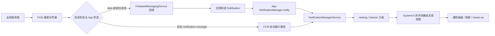

# 推送通知管线性能：FCM 投递延迟与 NotificationManagerService 渲染

“推送慢”至少可能指五件事：业务服务端发出请求晚、FCM 传输晚、设备收到回调晚、应用发布通知晚，或 SystemUI 显示晚。FCM（Firebase Cloud Messaging）是消息传输服务，SystemUI 则负责通知抽屉、锁屏通知等系统界面。这条链路跨越云端、Google Play services、应用进程、`system_server` 和 SystemUI，没有一个公开 API 能用同一时钟记录全部阶段。

平台源码基线为 Android 17（API 37）的 `android-17.0.0_r1`，内核基线为 `android17-6.18-2026-06_r6`。FCM 的设备端实现包含闭源组件，因此本文只依据 Firebase 公开契约描述这部分行为；Android 平台部分则用固定版本的 NMS（NotificationManagerService，通知管理系统服务）、`RemoteViews` 和 SystemUI 源码核查。

## 先定义“到达”和“显示”

业务服务端拿到 FCM 成功响应，只说明消息已被 FCM 接受，尚不能证明设备收到消息。设备 SDK 收到消息，也不代表通知已经进入 NMS。即使 `NotificationManager.notify()` 已经返回，SystemUI 仍可能尚未创建通知视图。通知最终能否被用户看到，还取决于通知权限、channel（通知渠道）、锁屏、勿扰模式和 SystemUI 状态。



图中的“FCM 自动展示路径”表示应用无需在业务 `onMessageReceived()` 中构造通知，但不代表所有设备实现都会绕过应用进程。高优先级 notification message 还可能由 Google Play services 代理展示。仅凭应用进程当时是否存在，无法推断消息类型或实际展示路径。

工程指标应使用不同名称：

| 时间点 | 含义 | 是否等于用户可见 |
|---|---|---|
| `fcm_accepted_at` | 服务端请求被 FCM 接受 | 否 |
| `sdk_callback_at` | 应用进入 `onMessageReceived()` 回调 | 否 |
| `notify_start/end` | 应用进入和离开同步 `notify()` 调用 | 否 |
| `nms_posted` | 平台已接受并分发 notification record（通知记录） | 否；普通应用没有直接回调 |
| `systemui_applied` | SystemUI 已 apply / reapply，即创建或复用通知视图 | 接近显示准备完成，仍受界面状态影响 |
| `impression` | Firebase 或产品定义的展示事件 | 取决于消息形态和采集能力 |

## FCM 消息形态决定应用是否参与

当前 [FCM Android 接收文档](https://firebase.google.com/docs/cloud-messaging/android/receive-messages) 给出的行为如下：

| payload（消息负载）与 App 状态 | 到达时的公开行为 | 应用能控制什么 |
|---|---|---|
| notification message，前台 | 调用 `onMessageReceived()` | 解析消息并决定是否发布通知 |
| notification message，后台 | FCM SDK 处理展示，不调用业务 `onMessageReceived()` | 用户点击后处理启动 Intent |
| data message，前台或后台 | 调用 `onMessageReceived()` | 构造通知、更新数据或安排后续工作 |
| notification + data，后台 | FCM SDK 处理 notification，data 放入启动 Activity 的 Intent extras（附加参数） | 用户点击后读取 data |
| notification + data，前台 | 两部分都交给 `onMessageReceived()` | 由应用决定 UI 和数据处理 |

不能把“后台 notification message 更快”当作固定结论。这种消息不执行应用的业务 callback，但展示仍要经过 FCM 设备端组件、NMS 和 SystemUI；代理展示、权限和设备状态也会改变实际路径。data message 让应用自行控制处理和展示，同时也可能把进程启动、`Application.onCreate()` 与通知构造的耗时计入用户等待时间。

如果应用进程不存在，Android 会先创建进程并执行 `Application.onCreate()`，然后才能创建 `FirebaseMessagingService`。若进程处于 cached/frozen（缓存或冻结）状态，系统可能先将它解冻再继续工作。

Android 没有为这些状态规定固定延迟，因此线上分析不能套用“缓存进程固定增加 100 ms”一类常量；应比较同一设备组在不同进程状态下的回调时间分布。

## high priority 是传输提示，不构成交付承诺

FCM 的 Android 下行消息分为 normal（普通）和 high（高）两种优先级。设备进入 Doze（深度休眠节电状态）后，normal 消息可能被延迟；high 消息会尝试尽快交付，必要时唤醒休眠设备，并为应用提供有限的处理时间。网络离线、TTL（消息有效期）、设备限制和服务状态仍可能造成等待或丢弃。

[FCM priority 文档](https://firebase.google.com/docs/cloud-messaging/android-message-priority) 对高优先级还有一组可验证规则：

- high 应用于时间敏感、面向用户的通知；
- FCM 会根据每个 App 实例最近 7 天的行为，决定是否把 high 降为 normal，或交给 Google Play services 代理展示；
- 单条消息可比较 `RemoteMessage.getOriginalPriority()` 与 `getPriority()`；
- 项目级趋势可从 FCM Aggregate Delivery Data API（聚合交付数据接口）读取 deprioritized（降级）和 proxy（代理展示）相关比例；
- 通知权限被关闭后，高优先级消息无法形成用户可见通知，也会增加降级风险。

`dumpsys deviceidle` 可以确认设备是否处于 idle（空闲节电）状态，以及是否在白名单或临时豁免中，却不能显示 FCM 对该 App 实例的优先级判定。排查高优先级降级时，应读取消息自身的原始优先级和交付优先级，并结合 FCM Data API 分析。

下列因素要分开统计：

| 因素 | 影响 | 可用证据 |
|---|---|---|
| 设备离线 | 消息留在 FCM，受 TTL 约束 | FCM Data API 的 delayed（延迟）/ dropped（丢弃）原因 |
| normal + Doze | 可能等到维护窗口或退出 Doze | 发送优先级、设备 idle 状态、聚合交付数据 |
| collapse key | 多条可折叠消息只保留一条代表项 | 服务端 payload 与 BigQuery 导出 |
| TTL 到期 | 过期消息不再投递 | 服务端 TTL 与 FCM 交付结果 |
| high 被降级 | 交付行为按 normal 处理 | original priority 与 delivered priority |
| Play services 代理 | notification 可由代理路径显示 | Proxy Notification Insights；普通 GA（Google Analytics）指标可能出现缺口 |
| 权限或 channel 被阻止 | 消息到设备但通知不可见 | `areNotificationsEnabled()`、channel importance、权限状态 |

## `onMessageReceived()` 的时间预算

Firebase 文档说明，`onMessageReceived()` 在独立工作线程调用，而且只提供数秒级的处理窗口；high 通常比 normal 稍长，但没有承诺固定秒数。回调内适合校验少量字段、构造通知并立即发布。若在其中执行额外网络请求、图片下载或长事务，回调结束后，系统可能不再保证进程继续运行，结果可能是通知延迟或未发布。

后续工作按交付优先级安排：

- high 且需要附加工作：在 callback 后立即安排 expedited WorkManager job（加急后台任务）；FCM 为紧邻 high callback 创建的这类任务提供短暂配额豁免。
- normal：安排普通 `WorkRequest`，接受系统根据资源和电量状态调度。
- 只为补充 App 内数据：可以先发布 payload 中已有的通知内容，再在后台同步。
- 必须长时间运行，且工作本身符合 FGS（Foreground Service，前台服务）使用场景：评估前台服务类型、权限和后台启动豁免。

Android 12（API 31）起，交付后仍为高优先级的 FCM 消息，是允许应用从后台启动 FGS 的豁免场景之一。这项豁免持续时间很短，且只在交付优先级仍为 high 时成立。启动前要检查 `RemoteMessage.getPriority()`；若消息已经降级，调用 `startForegroundService()` 可能抛出 `ForegroundServiceStartNotAllowedException`。当前边界见 [后台启动 FGS 限制](https://developer.android.com/develop/background-work/services/fgs/restrictions-bg-start)。

下面的 data message 代码骨架只记录应用能够直接观测的时间点，并在短回调内完成通知构造与发布：

```kotlin
override fun onMessageReceived(message: RemoteMessage) {
    val callbackStartNs = SystemClock.elapsedRealtimeNanos()
    var outcome = "success"
    Trace.beginSection("Push:onMessageReceived")
    try {
        val notification = trace("Push:build") {
            buildNotificationFromPayload(message.data)
        }
        trace("Push:notify") {
            notificationManager.notify(stableNotificationId(message), notification)
        }
    } catch (error: Exception) {
        outcome = failureFamily(error)
        throw error
    } finally {
        val callbackCostMs =
            (SystemClock.elapsedRealtimeNanos() - callbackStartNs) / 1_000_000
        Trace.endSection()
        PushMetrics.recordCallback(
            originalPriority = message.originalPriority,
            deliveredPriority = message.priority,
            outcome = outcome,
            callbackCostMs = callbackCostMs
        )
    }
}
```

`trace()` 指 AndroidX Tracing 的同名函数，用来在 Perfetto 中生成应用自定义区间。`buildNotificationFromPayload()` 不应暗中执行网络请求或从磁盘解码大图，`failureFamily()` 则要把异常归入数量有限的类别。比较 `message.originalPriority` 和 `message.priority`，可以判断单条 high 消息是否被降级；三个 trace section 分别覆盖整个 callback、通知构造和同步 Binder 调用。

## `notify()` 返回前后分别发生什么

Android 17 的 [`NotificationManager.java`](https://android.googlesource.com/platform/frameworks/base/+/android-17.0.0_r1/core/java/android/app/NotificationManager.java) 在 `notifyAsUser()` 中先执行 `fixNotification()`，再同步调用 `INotificationManager.enqueueNotificationWithTag()`。应用侧的同步工作包括补充 context 字段、校验 small icon（状态栏小图标）、执行 `reduceImageSizes()` 缩减图片，以及移除不必跨进程传输的内容。

`system_server` 中的 [`NotificationManagerService.java`](https://android.googlesource.com/platform/frameworks/base/+/android-17.0.0_r1/services/core/java/com/android/server/notification/NotificationManagerService.java) 在 Binder 入口继续执行：

1. 校验调用 UID、包名、user 与 allowlist token（白名单授权令牌）；
2. 处理 FGS / UIJ policy；UIJ 是 user-initiated job，即用户发起的数据传输任务；
3. 查询 channel，创建 `NotificationRecord`；
4. 检查权限、数量、更新速率等拒绝条件；
5. 把 `EnqueueNotificationRunnable` 投递到 NMS Handler 队列。

第五步完成后 Binder 调用才返回应用。后续的通知排序、listener（通知监听器）分发和 SystemUI 内容创建都不在 `notify()` 的同步等待范围内。因此：

- `notify_call_ms` 覆盖对象传输、Binder 等待和 NMS 入队前检查；
- `notify()` 很快返回，不能证明通知已经显示；
- `notify()` 变慢时，应检查调用线程、Parcel 内容、Binder wait 与 `system_server`；
- SystemUI 卡顿时，应用调用常常早已返回。

在 `BroadcastReceiver.onReceive()` 中发布已经构造好的通知是常见用法，无需一律禁止。不过，接收器仍有执行时间限制，图片读取、数据库迁移或网络请求应移出同步 callback。FCM callback 即使运行在工作线程，也没有无限处理时间。

## NMS 限速：源码默认值 5.0 不等于固定“每秒五次”

`android-17.0.0_r1` 的 NMS 定义了 `DEFAULT_MAX_NOTIFICATION_ENQUEUE_RATE = 5f`，并允许 `Settings.Global.MAX_NOTIFICATION_ENQUEUE_RATE` 覆盖。限速判断使用 [`RateEstimator.java`](https://android.googlesource.com/platform/frameworks/base/+/android-17.0.0_r1/core/java/android/service/notification/RateEstimator.java) 计算 EWMA（指数加权移动平均）到达率，而非简单统计最近一秒内调用了多少次。

限速并不作用于每一次 `notify()`。`checkDisqualifyingFeatures()` 只在已有相同 key 的通知、更新前后 `progressState` 相同，且通知不属于自动分组时检查 enqueue rate。进度从 ongoing（进行中）变为 complete（完成）等状态切换不会命中这项检查。超过阈值时，NMS 会记录 over-rate 并返回 false；调用方既没有 posted callback（发布成功回调），也不会收到异常。

同一源码还限制普通 App 尚未清理的通知数量，默认最多 50 条；FGS、UIJ 和部分聚合通知适用单独规则。更新速率限制和通知数量上限解决的是两类问题，指标也要分别记录。

进度或指标通知可采用以下发布策略：

- 使用稳定的 tag / ID 更新同一条通知；
- 按有意义的进度变化与最长等待时间合并更新；
- 对中间值使用 `setOnlyAlertOnce(true)`，避免每次更新都打扰用户；
- 完成、失败、暂停等状态变化立即发布；
- 记录 attempted update（尝试更新）和业务状态，不把 `notify()` 返回当成“已显示确认”。

固定 500 ms 或 1 s 的更新间隔只能作为设备测试后选定的产品节奏。平台使用 EWMA，OEM 也可以改变阈值；应用还要为同一包名下的其他通知留出更新余量。

### `timeoutAfter` 由 AlarmManager 驱动

Android 17 的 [`TimeToLiveHelper.java`](https://android.googlesource.com/platform/frameworks/base/+/android-17.0.0_r1/services/core/java/com/android/server/notification/TimeToLiveHelper.java) 以 elapsed realtime（不受墙钟调整影响的设备运行时间）保存超时项，并用 `AlarmManager.setExactAndAllowWhileIdle()` 安排最近一次到期处理。更新相同 key 的通知会重新安排超时，主动取消则会移除对应项。

`setTimeoutAfter()` 适合内容过时后就没有展示价值的通知，但它不能替代 FCM TTL。FCM TTL 控制消息可以在传输层保留多久；notification timeout 控制已进入 NMS 的通知保留多久。两项配置位于不同阶段，要分别记录。

## RemoteViews 与 SystemUI 的真实成本

标准 notification style 也会生成 `RemoteViews`，系统模板并没有一条完全绕过 `RemoteViews` 的通用捷径。Android 17 的 [`RemoteViews.java`](https://android.googlesource.com/platform/frameworks/base/+/android-17.0.0_r1/core/java/android/widget/RemoteViews.java) 会保存 `ArrayList<Action> mActions`，跨进程时将其序列化进 Parcel；应用到 View 树时，再执行 inflate（创建视图）和各项 action（属性更新操作）。

SystemUI 的 [`NotificationRowContentBinderImpl.kt`](https://android.googlesource.com/platform/frameworks/base/+/android-17.0.0_r1/packages/SystemUI/src/com/android/systemui/statusbar/notification/row/NotificationRowContentBinderImpl.kt) 使用异步 inflation executor（视图创建执行器）来创建和应用内容。若新旧 `RemoteViews` 的 package 与 layout ID 相同，且旧视图没有禁止复用的标记，SystemUI 可以调用 `reapplyAsync()` 复用现有 View；否则会通过 `applyAsync()` 创建新 View。

性能成本主要来自这些内容特征：

| 特征 | App / Binder 侧 | SystemUI 侧 |
|---|---|---|
| 大 bitmap 或多张图片 | 缩放、复制、Parcel 体积 | preload（预加载）、解码、内存与绘制 |
| 深层自定义布局 | action 与资源描述更多 | inflate、measure、layout 成本更高 |
| 高频更新 | 多次同步 Binder 与 NMS 检查 | 反复 apply / reapply、排序和界面刷新 |
| 稳定系统模板 | 结构和 action 受平台控制 | 更容易保持稳定 layout ID 并尝试 reapply 复用 |
| style 或 layout 改变 | 传输完整的新描述 | 更可能重新 inflate |

无法为 `MediaStyle`、自定义 `RemoteViews` 和 `ProgressStyle` 排出适用于所有通知的固定耗时顺序。内容大小、图片、action 数量、是否成功复用以及 SystemUI 状态都会改变结果。实验时应固定 payload 和设备，分别比较 `Push:build`、`Push:notify` 与 SystemUI inflation 耗时。

### ProgressStyle、MetricStyle 与 Live Update

Android 16（API 36）的 `Notification.ProgressStyle` 和 Android 17（API 37）的 [`Notification.MetricStyle`](https://developer.android.com/develop/ui/views/notifications/metric-style) 都是系统模板。`MetricStyle` 最多展示三个 metric（数值指标），适合健身、计时和出行；模板只负责内容表达与渲染，应用仍要调用 `notify()` 更新数值，NMS 限速也继续适用。

Live Update 是一种获得系统突出展示的资格，并不等同于某个 notification style。当前 [Live Update 文档](https://developer.android.com/develop/ui/views/notifications/live-update) 要求通知使用标准 style、`BigTextStyle`、`CallStyle`、`ProgressStyle` 或 `MetricStyle`，声明 `POST_PROMOTED_NOTIFICATIONS`，请求 promoted ongoing（提升展示的持续通知），并满足 ongoing、content title、channel 等通用条件。

自定义 `customContentView`、group summary（通知组摘要）和 `IMPORTANCE_MIN` 不符合资格；用户和 OEM 还可以将其降级或设置额外条件。

`MetricStyle` 文档还说明了 promoted 状态下的 title fallback（标题缺失时的后备展示），其文字与通用清单并不完全一致。在 API 37 上，应同时调用 `Notification.hasPromotableCharacteristics()` 和 `NotificationManager.canPostPromotedNotifications()`，根据运行时结果判断资格，不能只凭 style 推测。

Android 17 的 Semantic Coloring API 为安全、警示、危险和中性信息提供系统定义的语义色。它用于保持不同系统界面的颜色含义一致，不能代替降低更新频率或控制图片成本。

## channel importance 只控制打扰程度

`NotificationChannel` importance（渠道重要程度）控制声音、震动、状态栏和 heads-up（横幅通知）等展示行为。它不改变 FCM 传输优先级，也不会提高 App 发往 NMS 的 Binder 请求调度优先级。Android 8（API 26）起，channel 创建后应用不能修改其打扰行为，但用户可以随时调整。

heads-up 通常需要 high importance，还会受到设备是否解锁、勿扰模式、用户设置和 OEM policy 的影响。它没有适用于所有设备的固定动画时长或驻留秒数。是否使用高 importance 应由业务紧急程度决定，不能用它缩短 FCM 传输时间。

Android 13（API 33）起，普通通知需要 `POST_NOTIFICATIONS` 运行时权限。用户拒绝后，非豁免通知不会出现在 notification drawer（通知抽屉）；FGS 仍要提供通知，但相关提示可能只出现在 Task Manager（活动应用管理界面）中。发送端若继续大量发送 high 消息，却无法形成用户可见通知，还可能触发 FCM 降级。

通知分组用于组织信息和控制重复提醒。`setGroup()` 不保证减少 SystemUI 创建的 child row（子通知视图），也不会让 NMS 跳过每条通知的 ranking（排序与策略计算）。消息类场景可以使用 `MessagingStyle`、稳定 ID、group summary 和 `setGroupAlertBehavior(GROUP_ALERT_SUMMARY)` 控制通知数量与重复提示；每个 child 仍应能够独立表达内容。

## 端到端观测：每段使用自己的时钟

建议用同一个 `message_trace_id`（单条消息的关联 ID）连接服务端和设备事件，但不要上传 registration token（设备注册令牌）、完整 payload 或用户消息正文。发送 FCM 请求时，可额外设置不含个人信息的 analytics label 或服务端批次字段，用来和 BigQuery 导出或 Aggregate Delivery Data（聚合交付数据）的分组维度对齐。

聚合交付数据不能按单条 `message_trace_id` 反查设备链路。

| 阶段 | 推荐字段 | 时钟说明 |
|---|---|---|
| 服务端发送 | `fcm_request_start/end`、priority、TTL、collapse key、analytics label、FCM 响应 message ID | 服务端单调时钟计算请求耗时，墙钟用于跨系统粗略关联 |
| FCM 传输 | delivered、pending、dropped、delay reason、proxy / deprioritized ratio；启用 BigQuery 导出时的消息事件 | FCM 侧数据使用 Firebase / Google Play services 口径；聚合数据按批次或维度对齐，不是单条端侧 trace |
| SDK callback | `RemoteMessage.sentTime`、original / delivered priority、callback wall time | 只覆盖会进入 callback 的消息 |
| App 发布 | build、notify duration、process state bucket、permission / channel state | 设备内阶段使用 `elapsedRealtime` 单调时钟 |
| SystemUI | apply / reapply、row inflation、主线程和 inflation executor 状态 | 需要 Perfetto、平台日志或 userdebug 调试版本能力 |
| 用户行为 | impression、tap、dismiss | 必须说明事件来源和适用消息形态 |

FCM BigQuery 中的 `MESSAGE_DELIVERED` 表示消息已交给设备上的 FCM SDK，不能证明通知已经显示。Aggregate Delivery Data 经过抽样和聚合，并且延迟提供，只适合观察比例和趋势，不能替代单设备 trace。代理 notification 在普通 FCM / GA 指标中可能形成缺口，应结合 Proxy Notification Insights 查看。

后台 notification message 不进入业务 `onMessageReceived()`，因此应用无法在消息到达时写入自定义 callback 埋点。若产品必须取得应用处理和自定义展示的证据，可以选择 data message，但应用也要自行满足进程生命周期与后台执行约束。这项选择会同时影响可靠性、功耗和用户体验。

## Perfetto：只关联有共同键或共同时间窗的证据

下面的 SQL 用来列出前述三个应用自定义 trace section 及其所属进程、线程和耗时。查询结果只覆盖应用侧区间，不能据此认定 SystemUI 已经完成显示：

```sql
SELECT
  p.name AS process_name,
  t.name AS thread_name,
  s.name,
  s.ts / 1e6 AS ts_ms,
  s.dur / 1e6 AS dur_ms
FROM slice AS s
JOIN thread_track AS tt ON s.track_id = tt.id
JOIN thread AS t ON tt.utid = t.utid
LEFT JOIN process AS p ON t.upid = p.upid
WHERE s.name IN (
  'Push:onMessageReceived',
  'Push:build',
  'Push:notify'
)
ORDER BY s.ts;
```

查询按照 `slice -> thread_track -> thread -> process` 逐层关联。若把所有 FCM slice 与所有 SystemUI `inflate` slice 直接 join（连接），就会产生笛卡尔积，也就是每条 FCM 记录都与每条 SystemUI 记录组合；这样算出的延迟没有单条事件对应关系。

Android 17 AOSP 的 SystemUI 提供 `NotificationContentInflater.AsyncInflationTask#doInBackground` trace section，也记录 apply / reapply 路径。OEM 可以改变类名、线程名和 trace 埋点。实验室排查时可在同一时间窗口观察：

1. App 的 `Push:notify` 是否处于 Binder wait；
2. `system_server` 是否在 NMS 入口或 Handler 队列等待；
3. SystemUI inflation executor、主线程和 RenderThread（渲染线程）是否繁忙；
4. 同一时间窗口是否伴随大量通知、图片解码、锁屏动画或 panel（通知面板）更新。

没有 notification key（通知唯一键）或平台日志时，这些现象只能说明时间上相关，不能宣称已经建立单条通知的因果关系。

## Android 17 平台与内核锚点

| 层级 | 固定入口 | 能验证的边界 |
|---|---|---|
| App API | [`NotificationManager.java`](https://android.googlesource.com/platform/frameworks/base/+/android-17.0.0_r1/core/java/android/app/NotificationManager.java) | `fixNotification()` 与同步 Binder 调用 |
| Notification 数据 | [`Notification.java`](https://android.googlesource.com/platform/frameworks/base/+/android-17.0.0_r1/core/java/android/app/Notification.java) | timeout、style、progress state 与 MetricStyle |
| NMS | [`NotificationManagerService.java`](https://android.googlesource.com/platform/frameworks/base/+/android-17.0.0_r1/services/core/java/com/android/server/notification/NotificationManagerService.java) | 校验、channel、限速、数量上限和异步入队 |
| 更新速率 | [`RateEstimator.java`](https://android.googlesource.com/platform/frameworks/base/+/android-17.0.0_r1/core/java/android/service/notification/RateEstimator.java) | EWMA 到达率计算 |
| 通知超时 | [`TimeToLiveHelper.java`](https://android.googlesource.com/platform/frameworks/base/+/android-17.0.0_r1/services/core/java/com/android/server/notification/TimeToLiveHelper.java) | elapsed realtime 与 AlarmManager |
| RemoteViews | [`RemoteViews.java`](https://android.googlesource.com/platform/frameworks/base/+/android-17.0.0_r1/core/java/android/widget/RemoteViews.java) | action、Parcel 序列化、apply / reapply |
| SystemUI | [`NotificationRowContentBinderImpl.kt`](https://android.googlesource.com/platform/frameworks/base/+/android-17.0.0_r1/packages/SystemUI/src/com/android/systemui/statusbar/notification/row/NotificationRowContentBinderImpl.kt) | 异步内容创建、缓存与复用 |
| GKI Binder | [`drivers/android/binder.c`](https://android.googlesource.com/kernel/common/+/android17-6.18-2026-06_r6/drivers/android/binder.c) | `BC_TRANSACTION` 到 `binder_transaction()` 的 IPC 传输 |

common kernel 的 Binder 代码只能解释 App、NMS 与 SystemUI 之间的 IPC 等待。FCM 云端接收、Google Play services 的优先级判断和通知代理都不属于 AOSP common kernel，因此不能从 `binder.c` 推断云端投递时延。

## 版本边界

| Android 版本 | 相关变化 |
|---|---|
| Android 12 / API 31 | 后台启动 FGS 受限；交付后仍为 high 的 FCM 消息是短暂豁免之一 |
| Android 13 / API 33 | `POST_NOTIFICATIONS` 运行时权限影响普通通知可见性 |
| Android 14 / API 34 | target 34+ 的 FGS 需要声明适用类型和对应权限 |
| Android 16 / API 36 | `Notification.ProgressStyle` 与 promoted ongoing / Live Update 能力 |
| Android 17 / API 37 | `Notification.MetricStyle`、Live Update Semantic Coloring；平台源码基线 `android-17.0.0_r1` |

FCM SDK、Google Play services 和 Android 平台版本要分别记录。即使设备都运行 Android 17，其 Firebase Messaging SDK 与 Play services 版本仍可能不同，不能只用 `api_level` 代表三者。

## 交叉引用

- [§9.5 Notification 性能与 ANR](../ch09-anr/05-notification-performance-anr.md)：`notify()` 同步边界、NLS 回调和通知 ANR。
- [8.2 App 冷启动链路与 Binder Trace 分析](02-app-cold-start-binder-trace.md)：进程创建与 `Application.onCreate()`。
- [§25.3 WorkManager 实战](../../part5-app/ch25-power-size/03-wakelock-alarm-workmanager.md)：regular / expedited work 与后台调度。
- [§25.2 前台服务类型执行模型](../../part5-app/ch25-power-size/02-background-power-foreground-service.md)：FGS 类型、超时、Job 配额与恢复。
- [§4.3 Cached App Freezer](../../part1-fundamentals/ch04-memory/03-lmkd-freezer-memory-pressure.md)：缓存冻结与解冻边界。
- [§1.3 Binder IPC](../../part1-fundamentals/ch01-architecture/03-ipc-binder-performance.md)：同步 Binder 与线程等待。

## 参考资料

- [FCM Android 消息接收](https://firebase.google.com/docs/cloud-messaging/android/receive-messages)
- [FCM Android 消息优先级与降级](https://firebase.google.com/docs/cloud-messaging/android-message-priority)
- [FCM 交付数据口径](https://firebase.google.com/docs/cloud-messaging/understand-delivery)
- [Android 通知 channel](https://developer.android.com/develop/ui/views/notifications/channels)
- [Android 通知运行时权限](https://developer.android.com/develop/ui/views/notifications/notification-permission)
- [Android 17 MetricStyle](https://developer.android.com/develop/ui/views/notifications/metric-style)
- [Live Update 通知](https://developer.android.com/develop/ui/views/notifications/live-update)

## 小结

推送性能要按责任边界分析。FCM 负责在云端接受消息并向设备传输；应用在 data message 或前台路径中处理 callback；NMS 同步完成校验和入队前工作；SystemUI 随后异步创建或复用通知内容。`notify()` 返回、FCM 记录 `MESSAGE_DELIVERED` 和用户看到通知，是三个不同事件。

Android 17 的 NMS 使用可配置的 EWMA 限制更新速率，SystemUI 支持异步 apply / reapply `RemoteViews`，`MetricStyle` 与 Live Update 则增加了系统模板和突出展示资格。要让推送稳定及时，需要发送用户可见内容、合理设置 priority、缩短 callback、合并高频更新，并按阶段保留证据；固定毫秒常量和未公开的 Play services 内部行为都不能作为可靠依据。
