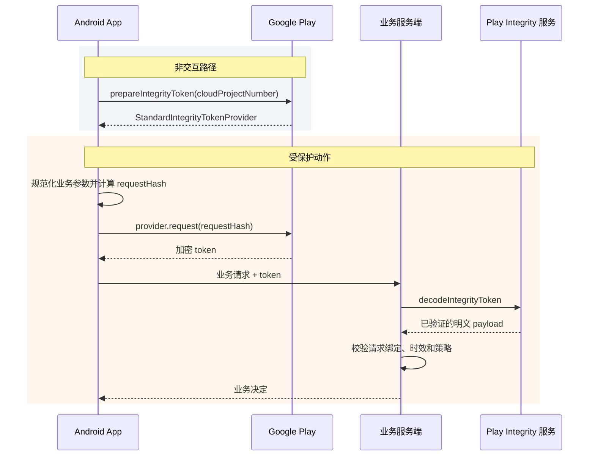

# Play Integrity API 性能与集成延迟

Play Integrity API 向业务服务端提供应用完整性、Play 账号授权、设备环境和可选风险信号。它适合保护登录、支付提交、兑换、排行榜上报等需要服务端处理的动作。API 返回的是一组 verdict（风险判定字段），并不直接替业务做“允许或拒绝”的决定；服务端仍要结合账号、交易和行为信息制定处置规则。

这套校验也会增加交互等待：客户端先向 Google Play 申请加密 token（完整性令牌），业务服务端再把 token 交给 Google 解密和验证。优化时应把可以提前完成的 provider 准备移出用户交互路径，并分别记录其余阶段。若只记录一个“Play Integrity 总耗时”，慢请求发生时就无法判断问题在客户端、接入网络、Google 解密接口还是业务服务端。

本文覆盖到 Android 17 / API 37 / `android-17.0.0_r1`。Play Integrity 的判定实现在闭源 Google Play 组件和 Google 服务端中，AOSP 不包含 verdict 生成源码；文末列出的 AOSP 与 kernel 锚点只用于解释 IPC、调度和网络承载边界，不能证明闭源组件的内部步骤。

## 1. 先把接口定位说清

SafetyNet Attestation API 已弃用，官方替代接口是 Play Integrity API。两者的客户端类型、token 格式、服务端验证接口和响应字段不同；迁移后不能继续使用 SafetyNet JWS（JSON Web Signature，带签名的 JSON 结构）解析器处理新 token。

Play Integrity 与 Key Attestation（密钥证明）解决的问题也不同：

- Play Integrity 返回 Google Play 对应用版本、Play 授权状态、设备环境和可选风险项的判定。
- Key Attestation 证明某把密钥及其生成环境的属性，常用于设备绑定密钥、签名或密钥交换。
- Key Attestation 不会给出 `PLAY_RECOGNIZED`、`LICENSED` 等 Play 分发信号，也不能当作“没有 Play Store 时的等价 Play Integrity 接口”。
- 是否同时使用两类信号取决于威胁模型，也就是业务需要防范哪些攻击。组合使用会增加客户端集成与服务端校验成本，并非所有支付或反作弊场景都必须如此。

### 1.1 服务端会看到哪些主要判定

应用授权字段 `appLicensingVerdict` 有三个值。这里的“授权”指当前 Play 账号是否拥有这款应用，并不等同于业务账号登录状态：

| 值 | 官方语义 | 业务解读边界 |
|---|---|---|
| `LICENSED` | 当前 Google Play 账号拥有此应用的授权，应用曾由 Google Play 安装或更新 | 不能单独证明设备安全，也不能替代业务账号登录 |
| `UNLICENSED` | 当前账号没有该应用授权，例如侧载或从其他商店取得应用 | 可引导用户通过官方修复对话框获取 Play 版本 |
| `UNEVALUATED` | 前置条件缺失，授权状态未被评估 | 不能当成 `UNLICENSED`，应保留“未知”语义 |

应用完整性字段 `appRecognitionVerdict` 也要独立判断：

| 值 | 官方语义 |
|---|---|
| `PLAY_RECOGNIZED` | 包名和证书与 Google Play 分发记录匹配 |
| `UNRECOGNIZED_VERSION` | 证书或包名与 Google Play 记录不匹配 |
| `UNEVALUATED` | 应用完整性没有得到评估 |

`PLAY_RETAIL` 不是 `appLicensingVerdict` 的有效值。应用识别与 Play 账号授权是两个独立字段；同一个请求可能在其中一个字段得到明确结果，另一个字段仍为 `UNEVALUATED`（未评估）。

### 1.2 设备标签不能简化成“root / 未 root”

`deviceRecognitionVerdict` 是标签数组，设备同时满足多级条件时可以返回多个标签。默认配置会返回 `MEETS_DEVICE_INTEGRITY`；若业务还需要 `MEETS_BASIC_INTEGRITY` 或 `MEETS_STRONG_INTEGRITY`，必须先在 Play Console 中选择接收。

| 标签 | Android 17 范围内的官方语义 |
|---|---|
| `MEETS_BASIC_INTEGRITY` | 通过基础系统完整性检查。bootloader（引导加载程序）可以锁定或解锁，启动状态可以是 verified 或 unverified，设备也可能没有通过 Google Play 认证 |
| `MEETS_DEVICE_INTEGRITY` | 运行于真实、通过认证的 Android 设备；Android 13 及以上还要求硬件支持的证据表明 bootloader 已锁定，并加载认证厂商镜像 |
| `MEETS_STRONG_INTEGRITY` | Android 13 及以上要求满足 `MEETS_DEVICE_INTEGRITY`，且 Android OS、vendor 等设备分区的安全更新都在最近一年内 |

Android 12 及以下的 `MEETS_STRONG_INTEGRITY` 不要求近期安全更新，只要求硬件支持的启动完整性证据。若策略覆盖旧系统，应同时读取可选的 `deviceAttributes.sdkVersion`，按 Android 版本解释同名标签，避免误用 Android 13 及以上的更新要求。

标签数组为空也不能精确诊断为“设备已 root”。API hooking（运行时拦截或替换 API）、系统受损、未通过检查的模拟环境或技术故障，都可能导致没有设备标签。面向用户时应提供修复路径或较宽泛的环境提示，不能把内部风险信号表述成已经确认的入侵结论。

## 2. Standard 与 Classic 是两套调用方式

当前官方文档建议大多数应用使用 Standard 请求。Standard 先准备可复用的 token provider，再为每个业务动作申请新 token；Classic 不做预先准备，每次重新计算判定，因此成本更高，适合少量、高价值且强调本次计算新鲜度的动作。

| 维度 | Standard API | Classic API |
|---|---|---|
| 客户端入口 | `StandardIntegrityManager` | `IntegrityManager` |
| 请求前准备 | 需要异步 prepare provider（令牌提供器） | 不需要 provider |
| 业务绑定字段 | `requestHash`，最长 500 字节 | URL-safe、no-wrap Base64 `nonce` |
| 防重放 | Google Play 自动缓解 token 被重复提交 | 业务服务端维护唯一值和使用状态 |
| 官方延迟量级 | token 请求通常为数百毫秒 | 请求通常为数秒 |
| 每实例公开频控 | prepare 最多 5 次/分钟；token 没有公开的低频上限，但仍有防滥用限制 | token 最多 5 次/分钟 |
| 适用请求 | 可按需保护频繁的服务端动作 | 偶发的高价值或高敏感动作 |
| verdict 计算 | Google Play 在设备上缓存部分证明材料并加以保护 | 每次重新计算；应用不应缓存结果 |

表中的时间只是官方给出的量级，不能当作业务 SLA（服务等级目标）。设备负载、Play 组件版本、网络、Google 服务状态和业务服务部署位置都会影响尾延迟。固定写成“Standard 50–150 ms”或“Classic 慢 3–5 倍”，都缺少能够跨设备和地区成立的证据。

下面的时序图划分 Standard 请求中可以单独测量的阶段，并标出 provider 准备位于非交互路径：



prepare 会访问服务端，通常需要数秒，多数请求在 10 秒内完成；官方建议为长尾预留更长的调用超时，例如 1 分钟。它适合在应用打开后异步启动，但“异步”只表示不必阻塞当前线程，不能因此让首页或登录按钮一直等待 prepare 完成。

## 3. Standard API 的正确集成

### 3.1 prepare 得到 provider，不会提前生成业务 token

Standard 请求分成两个动作，二者的生命周期不同：

1. 用 Cloud project number（Google Cloud 项目编号）调用 `prepareIntegrityToken()`，得到保存在进程内存中的 `StandardIntegrityTokenProvider`。
2. 用户执行受保护动作时，计算该动作的 `requestHash`，再通过 provider 为这次动作申请一个新 token。

下面的 Kotlin 片段用来展示两阶段 API 的类型边界：`prepare()` 更新 provider，`requestToken()` 只从已经准备好的 provider 申请 token。生产代码还要在应用数据层补充错误处理、并发保护和生命周期管理。

```kotlin
class IntegrityTokenSource(
    context: Context,
    private val cloudProjectNumber: Long,
) {
    private val manager =
        IntegrityManagerFactory.createStandard(context.applicationContext)

    @Volatile
    private var provider:
        StandardIntegrityManager.StandardIntegrityTokenProvider? = null

    fun prepare():
        Task<StandardIntegrityManager.StandardIntegrityTokenProvider> {
        val request =
            StandardIntegrityManager.PrepareIntegrityTokenRequest.builder()
                .setCloudProjectNumber(cloudProjectNumber)
                .build()

        return manager.prepareIntegrityToken(request)
            .addOnSuccessListener { prepared ->
                provider = prepared
            }
    }

    fun requestToken(
        requestHash: String,
    ): Task<StandardIntegrityManager.StandardIntegrityToken> {
        val prepared = checkNotNull(provider) {
            "Integrity token provider is not ready"
        }
        val request =
            StandardIntegrityManager.StandardIntegrityTokenRequest.builder()
                .setRequestHash(requestHash)
                .build()

        return prepared.request(request)
    }

    fun clearProvider() {
        provider = null
    }
}
```

`IntegrityTokenSource` 只保存 provider，不保存可复用 token。若请求返回 `INTEGRITY_TOKEN_PROVIDER_INVALID`，provider 可能已经过期，或 Play Store 数据已被清除；此时应丢弃旧引用并重新 prepare。每个业务动作前都调用 prepare 会增加延迟，还可能触及单个应用实例每分钟 5 次的 prepare 上限。

### 3.2 `requestHash` 要绑定当前动作

`requestHash` 是业务请求内容的摘要，用来让服务端确认 token 确实对应当前处理的那次动作。建议流程如下：

1. 定义稳定的请求规范化格式，使相同业务数据总能产生相同字节序列；明确字段顺序、空值、字符编码、金额单位和版本号。
2. 纳入所有会改变安全决定的字段，例如账号 ID、服务端下发的 action ID、订单 ID、金额、币种和动作类型。
3. 对规范化后的字节计算 SHA-256，再用约定的编码生成 `requestHash`。
4. 业务服务端按相同规则重新计算摘要，并与解密 payload 中的 `requestDetails.requestHash` 做常量时间比较；这种比较方式避免根据第一个不同字节的位置提前返回，减少时序侧信道。

下面的示例只演示怎样先得到无歧义的固定格式，再计算哈希。字符串长度也写入输入，可以区分字段边界，避免简单拼接造成不同字段组合产生相同文本。

```kotlin
fun integrityRequestHash(
    actionId: String,
    accountId: String,
    amountMinor: Long,
    currency: String,
): String {
    val canonical = buildString {
        append("v1\n")
        append(actionId.length).append(':').append(actionId).append('\n')
        append(accountId.length).append(':').append(accountId).append('\n')
        append(amountMinor).append('\n')
        append(currency.uppercase(Locale.ROOT))
    }.toByteArray(StandardCharsets.UTF_8)

    val digest = MessageDigest.getInstance("SHA-256").digest(canonical)
    return Base64.encodeToString(
        digest,
        Base64.URL_SAFE or Base64.NO_WRAP or Base64.NO_PADDING,
    )
}
```

服务端必须实现同一份 `v1` 规范，并把版本号纳入哈希输入。示例没有放入姓名、手机号或原始 token 等敏感数据；官方要求不要把敏感信息以明文写进 `requestHash`。即使两个动作得到相同摘要，token 也不能复用，每次受保护动作仍要申请并提交自己的 token。

### 3.3 服务端校验顺序

客户端拿到的是加密 token，不能在客户端自行读取 verdict。常规做法是由业务服务端使用关联 Cloud project 的 service account（服务账号）访问以下端点：

```text
POST https://playintegrity.googleapis.com/v1/{packageName}:decodeIntegrityToken
```

这个端点返回已经由 Google 解密并验证的 payload。调用成功只完成了 token 层校验，业务服务端还要依次检查：

- `requestDetails.requestPackageName` 等于预期包名；
- `requestHash` 或 Classic 的 `nonce` 与当前业务动作匹配；
- `timestampMillis` 位于业务定义的有效窗口内；
- `appRecognitionVerdict`、`appLicensingVerdict` 和所需设备标签符合该动作的规则；
- 可选的 `deviceAttributes`、近期设备活动、应用访问风险或 Play Protect 信号是否参与本次策略；
- 该 action ID、订单或会话没有被业务系统重复消费，也就是业务操作具备幂等保护。

Standard token 带有 Google Play 的自动重放缓解：同一个 token 被反复解密时，后续结果会被清空或降为 `UNEVALUATED`。服务端仍要检查业务幂等性和新鲜度，因为“同一笔订单使用不同 token 提交两次”属于业务重放，不在同一 token 重复解密的保护范围内。

服务账号密钥、Cloud access token 和 verdict 解析逻辑都不能放进 APK。客户端进程本身就是被评估对象，攻击者可以篡改客户端输出，因此最终授权决定必须由服务端作出。

## 4. Classic 请求的使用边界

Classic 使用 `IntegrityManagerFactory.create()`、`IntegrityTokenRequest` 和 `nonce`。nonce 是每次动作唯一、不可预测的值，用于将 token 与这次请求绑定并防止重放。Classic 没有 prepare 阶段，每次请求都会重新计算 verdict，官方建议只用于偶发的高价值动作。

下面的代码展示 Classic API 的入口和返回类型，便于与 Standard 的 prepare + request 两阶段调用区分：

```kotlin
val integrityManager =
    IntegrityManagerFactory.create(applicationContext)

val request =
    IntegrityTokenRequest.builder()
        .setNonce(serverBoundNonce)
        .build()

integrityManager.requestIntegrityToken(request)
    .addOnSuccessListener { response ->
        sendBusinessRequest(response.token())
    }
    .addOnFailureListener { error ->
        recordClassicRequestFailure(error)
    }
```

对于通过 Google Play 分发的应用，若 Cloud project 已在 Play Console 关联，请求中通常无需再次设置 project number；只有官方列出的站外分发应用或 SDK 场景才按文档设置。这里的 `serverBoundNonce` 必须每次变化，不能使用硬编码常量。

Classic 的 nonce 既要防止业务字段被篡改，也要防止旧请求被重放：

- 由服务端生成至少 128 bit、不可预测的唯一值，或使用具有同等唯一性的服务端 action ID；
- 把唯一值与当前业务字段放入规范化消息，再计算摘要；
- 按 URL-safe、no-wrap Base64 编码，满足官方长度限制；
- 服务端解密后重新计算摘要，并确认这个唯一值从未被消费；
- nonce 中不要直接或间接携带个人信息。

缓存 Classic verdict 或 token 会扩大凭据被窃取和重放的风险。若调用频率已经高到需要复用结果，应重新评估是否改用 Standard，并继续为每次动作申请独立 token。

## 5. 延迟该怎样拆

### 5.1 官方量级只用于初始容量估算

官方当前给出的量级是：

- Standard prepare 通常为数秒，多数在 10 秒内；因为包含服务端请求，示例超时预算为 1 分钟。
- provider 准备完成后，Standard token 请求通常为数百毫秒。
- Classic 请求通常为数秒，多数在 10 秒内；官方同样给出覆盖长尾的 1 分钟超时示例。
- Google 服务端解密请求通常为几十毫秒，官方比较表标注 three-nines availability（99.9% 可用性）。

这些数字不能替代本应用在目标国家、网络、机型和 Play 组件版本上测得的分位值，也不足以证明 Standard token 请求“完全不访问网络”。官方只说明设备侧会缓存部分证明材料，并明确指出 prepare 包含服务端访问；具体何时刷新、怎样刷新并未公开。

### 5.2 一次业务请求至少记录五段

建议把时间拆成：

| 阶段 | 起止点 | 常见影响因素 |
|---|---|---|
| `provider_prepare` | 调用 prepare 到成功或失败 | 网络、Play 组件状态、设备负载 |
| `token_request` | 调用 provider.request 到 `Task` 完成 | provider 有效性、设备负载、Play 内部状态 |
| `app_to_backend` | 发出业务请求到服务端收到 | 接入网络、TLS、请求体大小 |
| `google_decode` | 服务端调用 decode 到收到 payload | 服务端出口网络、连接复用、Google 服务 |
| `policy_and_business` | payload 到达到业务响应 | JSON 处理、账号或交易查询、策略服务 |

客户端收到最终响应的总时间包含多个阶段，不能用它反推 `google_decode`。业务服务端应分别记录 DNS 查询、建立连接、是否复用连接、请求等待和 HTTP 状态，并把一次请求的 trace ID（链路关联 ID）回传给客户端。

### 5.3 关键路径优化

登录、支付和游戏动作可以采用这些安排：

- 应用打开后异步 prepare provider，首页或登录页无需等它完成才开始绘制。
- provider 保存在进程内，由一个并发安全的组件集中管理，避免多个页面同时 prepare。
- 用户确认动作后再申请 token。可提前准备 provider，不能提前缓存业务 token。
- 在业务数据不会变化且安全规则允许时，token 请求可以与本地参数校验、凭据读取或 UI 动画并行。
- 把业务数据与 token 放进同一次业务上行，避免客户端先上传 token、等服务端确认后再上传业务请求。
- 服务端访问 Google 时应复用 HTTP 客户端和连接，并设置连接池容量、超时及熔断监控；熔断是在依赖持续失败时暂时停止继续请求，防止故障扩散。不要为每次业务请求重新创建客户端。
- 分开观察冷启动后第一次 prepare、provider 重建、普通 Standard 请求与 Classic 请求。

用户通常会在支付页停留一段时间，因此可以进入页面后就 prepare provider；订单金额和 action ID 仍要等用户确认后再写入 `requestHash`。游戏可以在首个可交互界面出现后准备 provider，到匹配、兑换或成绩上报等受保护动作发生时再申请 token。

## 6. 超时、重试与业务处置

### 6.1 三种结果必须分开

服务端策略至少区分：

1. **API 调用失败**：客户端没有拿到 token，或服务端调用 decode 接口失败。
2. **未评估**：token 有效，但某个 verdict 字段为 `UNEVALUATED` 或标签缺失。
3. **明确的风险结果**：例如 `UNRECOGNIZED_VERSION`、`UNLICENSED`，或业务要求的设备标签没有出现。

网络错误不代表设备受损，`UNEVALUATED` 也不代表已经得到明确失败结果。另一方面，支付、转账、密钥恢复等高价值动作也不能因网络超时就自动放行。服务端要按动作配置允许、追加验证、延迟处理、限制额度或拒绝等处置方式。

### 6.2 按错误类别重试

官方把错误分为可重试和不可自动重试两组：

| 类别 | 例子 | 处理 |
|---|---|---|
| 瞬态 | `NETWORK_ERROR`、`TOO_MANY_REQUESTS`、`GOOGLE_SERVER_UNAVAILABLE`、`CLIENT_TRANSIENT_ERROR`、内部错误 | 检查网络，采用有次数上限的指数退避，并加入随机抖动，避免大量客户端同时重试 |
| provider 失效 | `INTEGRITY_TOKEN_PROVIDER_INVALID` | 清除旧 provider，重新 prepare |
| 环境或配置 | `API_NOT_AVAILABLE`、`PLAY_STORE_NOT_FOUND`、Play 服务或 Play Store 版本过旧 | 停止自动重试，提示修复环境或检查控制台配置 |
| 可疑调用环境 | `APP_NOT_INSTALLED`、`APP_UID_MISMATCH` | 按完整性检查失败处理 |
| 参数错误 | nonce 长度、编码或 Cloud project number 错误 | 修复输入或发布配置；原样重试相同错误参数不会成功 |

后台动作可以参考官方示例，从 5 秒开始指数退避，并以最大次数作为退出条件。前台交互不适合照搬 5、10、20 秒的等待序列；可以结束当前 UI 请求，把重试交给下一次用户动作或后台任务。连续三次仍失败时，官方建议按客户端未通过完整性检查处置。

超时值应依据本应用的延迟分布和风险预算设定。Standard prepare 与 Classic 请求的官方示例都允许约 1 分钟覆盖长尾，但用户无需在前台等待整整 1 分钟。UI 愿意等待多久、底层网络调用何时停止，以及服务端在无判定结果时怎样处置，是三项独立配置，不能全部塞进一个硬编码的 `withTimeout(3000)`。

### 6.3 给用户可修复的出口

Play Integrity 提供 `GET_INTEGRITY`、`GET_STRONG_INTEGRITY`、`GET_LICENSED` 等 remediation dialog（修复对话框），可处理 Play 服务缺失或过旧、网络连接、应用未授权等部分问题。服务端先解析 verdict，再指示客户端展示对应类型的对话框；修复流程完成后，客户端重新申请 token。

没有官方 Play Store 或 Play 服务的设备无法完成这套 Google Play 判定。产品要明确各分发渠道支持哪些能力，并为相应用户设计独立的账号和风险策略。Key Attestation 可以提供密钥属性证据，但不能生成 Play 授权或应用识别字段。

## 7. 配额与流量模型

默认配额绑定到关联的 Cloud project number，并分别限制客户端请求与服务端解密：

- token 请求每日 10,000 次，Classic 请求与 Standard prepare 共享；
- Google 服务端 token 解密每日 10,000 次，Standard 与 Classic 共享；
- Standard 单实例 prepare 最多 5 次/分钟；
- Classic 单实例 token 最多 5 次/分钟；
- Standard token 请求没有公开的低频上限，但高流量仍会受到未公开的防滥用限制。

这里容易混淆的一点是：普通 Standard token 请求不计入文档所说的“Classic + prepare”每日 token 生成配额，但每个送到 Google 解密的 token 仍会消耗服务端解密配额。上线前要根据日活用户数、每人受保护动作次数、重试率和峰值放大系数，分别估算客户端与服务端用量，并在 Cloud Console 设置告警。需要提高配额时，应先关联 Play Console 与 Cloud project，再提交官方申请，并逐步增加流量，避免突然放量触发限流。

## 8. 可观测性：Perfetto 只能看到应用这一侧

Play Integrity 库和 Google Play 内部没有向应用公开稳定的 Perfetto slice。应用可以用异步 trace 标记 token 请求的端到端等待，服务端阶段则依赖后端 tracing（分布式链路追踪）。

下面的代码为一次跨回调、可能跨线程的 Standard token 请求增加 Perfetto async slice，并用 `traceCookie` 配对开始和结束事件：

```kotlin
fun requestWithTrace(
    provider: StandardIntegrityManager.StandardIntegrityTokenProvider,
    requestHash: String,
    traceCookie: Int,
): Task<StandardIntegrityManager.StandardIntegrityToken> {
    val section = "play_integrity_standard_token"
    Trace.beginAsyncSection(section, traceCookie)

    val request =
        StandardIntegrityManager.StandardIntegrityTokenRequest.builder()
            .setRequestHash(requestHash)
            .build()

    return provider.request(request)
        .addOnCompleteListener {
            Trace.endAsyncSection(section, traceCookie)
        }
}
```

async slice 可以跨线程覆盖 `Task` 的整个等待区间。它显示从应用发起请求到收到完成回调的 wall time（墙上时钟时间），其中包含运行与等待；它无法证明 Google Play 内部使用了哪个线程，也不能用来计算 Binder 或网络往返次数。

客户端和服务端建议记录：

- 请求模式、库版本、Android SDK、应用版本和 Play 组件错误码；
- prepare、token、业务上行、decode、策略各阶段的成功率与 P50/P90/P99；
- provider 失效及重建比例；
- 超时、主动取消、退避重试和限流次数；
- verdict 各类别占比，但不能把 token、nonce、`requestHash` 原文或用户敏感数据写入日志；
- 从 token 申请到服务端消费的年龄，以及 action ID 重复消费次数。

按网络类型、地区、机型和应用冷暖状态拆分数据，通常比一条总体 P95 更容易定位问题。对照组还应保留“不调用 Integrity 时的业务耗时”，防止把数据库或账号服务变慢误归因给 Play Integrity。

## 9. Android 17 / API 37 的源码边界

截至 `android-17.0.0_r1`，AOSP 不包含 `StandardIntegrityManager`、verdict 计算或 Google decode 服务实现。Android 17 在这条路径中只提供进程、包身份、Binder、网络和调度等通用能力；Google Play 组件怎样组织调用属于可更新的闭源实现，无法通过 AOSP 源码行数证明其缓存窗口、线程数或 IPC 次数。

可用于排查通用机制的锚点包括：

- AOSP `android-17.0.0_r1` [`android.os.Binder`](https://android.googlesource.com/platform/frameworks/base/+/refs/tags/android-17.0.0_r1/core/java/android/os/Binder.java)：应用侧 Binder API、调用身份与阻塞调用语义。
- AOSP `android-17.0.0_r1` [`IPCThreadState.cpp`](https://android.googlesource.com/platform/frameworks/native/+/refs/tags/android-17.0.0_r1/libs/binder/IPCThreadState.cpp)：native Binder 命令写入、等待和响应处理。
- kernel `android17-6.18-2026-06_r6` [`drivers/android/binder.c`](https://android.googlesource.com/kernel/common/+/refs/tags/android17-6.18-2026-06_r6/drivers/android/binder.c)：Binder 驱动中的事务、等待队列与线程调度承载。

这些锚点可以帮助解释应用线程为何在同步 IPC 上等待，或系统负载为何放大 IPC 尾延迟。它们不能证明某次 Integrity 请求固定发生两次 Binder 事务，也不能说明 Google Play 是否访问网络。排查 Android 17 设备上的异常时，应使用同一个 request ID 关联应用 trace、Play Integrity 错误码、网络记录和服务端 decode trace。

## 10. 检查清单

- 使用 Standard API 时，代码是否调用 `createStandard()`，并分离 prepare 与按动作申请 token？
- provider 是否在进程内集中管理，失效后能重新 prepare，且没有每次操作都 prepare？
- token 与 Classic verdict 是否不缓存、不跨动作复用？
- `requestHash` 或 nonce 是否绑定当前业务字段，服务端是否重算并校验？
- 服务端是否检查包名、timestamp、应用识别、授权、设备标签和业务幂等？
- 是否将 `UNEVALUATED`、请求错误和明确风险判定分开处理？
- 高价值动作是否避免网络错误后一律放行？
- Standard 与 Classic 的配额、重试和峰值是否进入容量评估？
- 客户端、业务服务端、Google decode 是否拥有可关联的分段耗时？
- 结论是否限制在公开文档和可观察数据范围内，没有猜测闭源 Play 组件的缓存时长或内部调用次数？

## 参考资料

- [Play Integrity API 概览](https://developer.android.com/google/play/integrity/overview)
- [发起 Standard API 请求](https://developer.android.com/google/play/integrity/standard)
- [发起 Classic API 请求](https://developer.android.com/google/play/integrity/classic)
- [Integrity verdict 字段与语义](https://developer.android.com/google/play/integrity/verdicts)
- [配置、SDK 与使用配额](https://developer.android.com/google/play/integrity/setup)
- [错误码与重试建议](https://developer.android.com/google/play/integrity/error-codes)
- [修复对话框](https://developer.android.com/google/play/integrity/remediation)
- [SafetyNet API 弃用说明](https://developer.android.com/privacy-and-security/safetynet)

## 交叉引用

- **8.5 Keystore / KeyMint 调用延迟**：设备密钥与 Key Attestation 的耗时和信任边界
- **8.5 BiometricPrompt 与 Credential Manager 登录链路**：登录 UI、凭据获取与服务端认证的阶段划分
- **8.6 推送通知管线性能**：跨进程与服务端路径的分段观测方法
- **12.1 网络性能优化**：移动网络、连接复用与尾延迟
- **12.1 Android 网络安全与 TLS 性能**：业务上行与服务端出站连接的安全和性能边界
