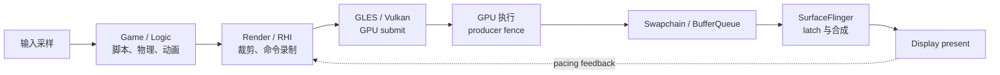

---

title: "Android 游戏性能与 Game Mode/State API"
chapter: "8.9"
section: "8.9"
status: "finalized"
applicable_versions: "Android 12 (API 31) - Android 17 (API 37)"
drafted_date: "2026-04-08"
drafted_by: "openclaw-task2a"
last_verified: "2026-07-13"
last_verified_against: "Android Developers Game SDK Performance Tuner + GameActivity text input docs, AOSP GameManagerService, Perfetto gpu.renderstages proto"
confidence: medium
sources:
  - type: official
    path: "https://developer.android.com/games/optimize/adpf/gamemode/about-API-and-interventions"
  - type: official
    path: "https://developer.android.com/games/optimize/adpf/gamemode/gamemode-api"
  - type: official
    path: "https://developer.android.com/games/optimize/adpf/gamemode/gamestate-api"
  - type: official
    path: "https://developer.android.com/games/optimize/adpf/gamemode/gamemode-interventions"
  - type: official
    path: "https://developer.android.com/reference/android/app/GameManager"
  - type: official
    path: "https://developer.android.com/reference/android/app/GameState"
  - type: official
    path: "https://developer.android.com/reference/android/os/health/SystemHealthManager"
  - type: official
    path: "https://developer.android.com/games/sdk/performance-tuner"
  - type: official
    path: "https://developer.android.com/games/agdk/game-activity/get-started"
  - type: official
    path: "https://developer.android.com/games/agdk/game-activity/use-text-input"
  - type: aosp
    path: "frameworks/base/core/java/android/app/GameManager.java"
  - type: aosp
    path: "frameworks/base/core/java/android/app/GameState.java"
  - type: aosp
    path: "frameworks/base/services/core/java/com/android/server/app/GameManagerService.java"
  - type: aosp
    path: "external/perfetto/protos/perfetto/config/data_source_config.proto"
  - type: research
    path: "intake/research-feeds/2026-04-08-19-android-adpf-agdk-game-mode-thermal-performance.md"
tags: [game, gamemode, gamestate, agdk, frame-pacing, adpf, gaming-performance, thermal]
related_chapters: ["2.17", "5.9", "5.5", "7.1", "7.9", "14.10"]
created_by: "task2a-knowledge-gap"
created_date: "2026-04-08"
gap_source: "官方文档+读者需求+研究素材"
pipeline_stage: ready-to-publish
task6_state: reviewed
task9_state: reviewed
task2b_state: fixed
task2b_result: fixed-lite
reviewed_by: openclaw-task6
reviewed_date: 2026-06-05
task6_result: pass-light-edit
task9_result: auto-fixed
task9_reviewed_by: "openclaw-task9"
task9_reviewed_date: "2026-06-05"
last_task9_at: "2026-06-05T07:20:00+08:00"
last_task2b_at: "2026-05-09T08:43:58+08:00"
review_notes: "2026-05-11 task6 review (revisiting→reviewed): pass-light-edit。L1/L2 修正 4 处，L3/L4 问题 6 个写入 queue.json。"
last_task6_at: "2026-06-05T09:06:00+08:00"
last_task6_audit: "2026-07-12"
last_task2b_lite_at: 2026-07-13
task6_review_notes: "2026-06-05 Task6 revisiting-review #3：L1 修正 2 处否定-纠正结构（黑盒式句式、Game Mode 万能开关句式）；无新增 B 类问题。task9_result=auto-fixed，queue 无 pending，自动晋升 finalized。"
last_task9_autofix_at: "2026-06-05"
last_task9_review_log: logs/deep-review/2026-06-05-07-deep-review.md
task9_review_notes: "2026-06-05 Task9 deep review: auto-fixed。修复 GameManagerService AOSP tag、ADPF codelab/AOSP 源码路径混写；回到 Task6 复审。"
deepseek_cn_review_state: done
last_deepseek_cn_review_at: 2026-06-05
---

# 8.9 Android 游戏性能与 Game Mode/State API

游戏优化面对的是一条持续运转的生产线。输入、逻辑、动画、物理、渲染准备、GPU 执行、BufferQueue、SurfaceFlinger 和显示控制器共同决定用户何时看到一帧。某一段提前结束，不等于整帧已经显示；平均 FPS 达标，也可能同时存在周期性长帧和较高的输入延迟。

平台源码锚点为 Android 17 / API 37、`android-17.0.0_r1`，kernel 侧固定到 `android17-6.18-2026-06_r6`。Game Mode、Game State、ADPF 和 System Health API 的版本边界按公开 SDK 说明，系统动作则回到 Android 17 AOSP 源码核查。Unity、Unreal、Cocos、Swappy 等组件有独立发布周期，排查时还要记录引擎版本、渲染后端和 frame pacing 配置。

## 游戏性能的特殊性：持续满帧与按需渲染

普通界面经常停在静止状态，游戏 loop 则会持续推进 simulation 和画面。目标 60 fps 时，相邻显示帧的周期约为 16.67 ms；90 fps 约为 11.11 ms；120 fps 约为 8.33 ms。这个数字表示目标呈现节拍，不能直接当作“逻辑耗时 + Render Thread 耗时 + GPU 耗时”的串行总和。

现代引擎通常让多帧并行处于不同阶段：CPU 准备第 N+1 帧时，GPU 可能仍在执行第 N 帧，SurfaceFlinger 同时处理更早一帧。优化对象因此有两类：

- **关键路径**：某一帧从输入采样到 display present 的依赖链。
- **稳态吞吐**：连续帧能否按目标节拍交付，队列里积压了多少帧。

下面的图用于区分一帧的生产、排队与显示阶段。



CPU submit 返回时，GPU 可能仍在工作。producer fence 表示消费者何时能够读取 buffer，present fence 描述显示侧的 present 完成点，release fence 则约束旧 buffer 何时可复用。分析时应保留这些时间点的区别。

### 四个容易混在一起的指标

| 指标 | 回答的问题 | 常见误用 |
|---|---|---|
| FPS / present interval | 屏幕多久收到一张新画面 | 用平均值掩盖长帧簇 |
| 单帧关键路径 | 哪段依赖导致该帧晚到 | 把并行阶段全部相加 |
| in-flight frame 数 | 输入到显示之间压了多少帧 | 只追求吞吐，不查延迟 |
| 长时稳态 | 温度上升后能维持什么档位 | 只测冷机前几十秒 |

游戏持续占用 CPU、GPU 和内存带宽，热约束对它的影响更显著。频率降低、帧率下降和 thermal 状态变化若在同一时间窗内出现，才构成热限制的证据。单凭“逐渐掉帧”或“突然掉到 30 fps”无法确定原因；引擎限帧、FPS intervention、队列阻塞和场景切换都可能产生相似曲线。

Frame pacing 还会影响输入延迟。生产者一味尽快 present，可能填满 BufferQueue；render thread 随后阻塞在 acquire、swap 或 present 上，表面上像自动限速，队列中却保留了更多旧帧。Swappy 或引擎自带的 pacing 等待有时是在主动限制 in-flight 深度，不能仅按等待 slice 的长短判定卡顿。

## Game Mode API：读取用户的游戏偏好

Game Mode API 从 Android 12 / API 31 提供。它让用户为某个游戏选择 `STANDARD`、`PERFORMANCE` 或 `BATTERY` 等模式，游戏读取选择后调整自己的画质、目标帧率或资源策略。模式名称没有承诺固定效果：`PERFORMANCE` 不等于 120 fps，`BATTERY` 也不等于 30 fps。设备刷新率、场景负载、温度和游戏支持的档位共同决定可用策略。

### 声明游戏身份和配置文件

应用先在 Manifest 中声明游戏类别，并引用 Game Mode 配置。

```xml
<application
    android:appCategory="game"
    ...>
    <meta-data
        android:name="android.game_mode_config"
        android:resource="@xml/game_mode_config" />
</application>
```

`android:appCategory="game"` 是推荐的游戏识别方式。旧应用也可能使用 `android:isGame="true"`，新工程应优先使用 `appCategory`。

如果游戏准备自行适配 Performance 和 Battery 模式，`res/xml/game_mode_config.xml` 可以这样声明。

```xml
<?xml version="1.0" encoding="utf-8"?>
<game-mode-config
    xmlns:android="http://schemas.android.com/apk/res/android"
    android:supportsPerformanceGameMode="true"
    android:supportsBatteryGameMode="true" />
```

`supportsPerformanceGameMode` 或 `supportsBatteryGameMode` 设为 `true`，表示该模式由游戏自己处理。平台会避免再对同一模式套用对应的 OEM Game Mode interventions。只有经过实机验证的模式才应声明支持。

### 每次回到前台都重新读取

公开 SDK 没有 Game Mode 变化监听器。官方要求应用在 `onResume()` 中重新读取，因为用户可能在 Game Dashboard 或设备面板里改过选择。

下面的 Kotlin 示例把系统模式交给游戏自己的策略层，没有写死帧率和画质档位。

```kotlin
override fun onResume() {
    super.onResume()

    if (Build.VERSION.SDK_INT >= Build.VERSION_CODES.S) {
        applyGameMode(getSystemService(GameManager::class.java).gameMode)
    }
}

@RequiresApi(Build.VERSION_CODES.S)
private fun applyGameMode(mode: Int) {
    when {
        mode == GameManager.GAME_MODE_PERFORMANCE -> {
            gamePolicy.usePerformanceProfile()
        }
        mode == GameManager.GAME_MODE_BATTERY -> {
            gamePolicy.useBatteryProfile()
        }
        Build.VERSION.SDK_INT >= Build.VERSION_CODES.UPSIDE_DOWN_CAKE &&
            mode == GameManager.GAME_MODE_CUSTOM -> {
            // CUSTOM 由平台管理，游戏保持兼容的默认策略。
            gamePolicy.useDefaultProfile()
        }
        else -> {
            // STANDARD、UNSUPPORTED 和未知值都走兼容路径。
            gamePolicy.useDefaultProfile()
        }
    }
}
```

`GAME_MODE_CUSTOM` 在 API 34 加入，供平台管理自定义模式；它不属于游戏在 XML 中声明并自行优化的 Performance/Battery 模式。面向 API 33 及以下的应用在系统处于 Custom 模式时会收到兼容后的 `STANDARD`。分支还要容纳未知值，避免未来扩展破坏默认路径。

### `GameManagerService` 提供了什么

`GameManagerService` 位于 `system_server`。在 Android 17 源码中，它负责模式配置、Game State 处理、statsd 记录和 intervention 管理。`getGameMode()` 本身不会向应用承诺绑核、锁频或固定的调度优先级。

这里应分开看三层行为：

| 层次 | 输入 | 可验证的输出 |
|---|---|---|
| 游戏策略 | `getGameMode()` 返回值 | 引擎自行改变 target FPS、render scale、LOD 等 |
| AOSP 服务 | mode、Game State、配置 | 状态保存、statsd、加载期 power mode、intervention 管理 |
| OEM 策略 | Power HAL、设备配置、游戏面板 | 设备相关的频率、触控、驱动或后台策略 |

同一个模式在两台设备上可能产生不同结果。评估时要检查游戏配置是否变化、系统是否启用 intervention，以及频率、温度和 present interval 是否随之变化。

## Game State API：报告当前场景

Game State API 从 Android 13 / API 33 公开。`GameManager#setGameState(GameState)` 向系统报告当前是否加载，以及内容属于哪一类。它描述当前场景，不提供通用的绑核或锁频接口。

公开的 mode 包括：

- `MODE_NONE`：当前没有 active gameplay，例如大厅或菜单。
- `MODE_GAMEPLAY_INTERRUPTIBLE`：可暂停或可中断的玩法。
- `MODE_GAMEPLAY_UNINTERRUPTIBLE`：实时对战、竞速等不适合中断的玩法。
- `MODE_CONTENT`：视频、广告、Web 内容等非 gameplay 内容。
- `MODE_UNKNOWN`：调用方无法给出更具体分类。

`isLoading` 与 `mode` 相互独立。加载资源时可以保持原有 gameplay mode，并把 `isLoading` 设为 `true`。

下面的辅助方法用于在场景切换时发送一条状态，而不是依次发送所有示例状态。

```kotlin
private fun reportGameState(isLoading: Boolean, mode: Int) {
    if (Build.VERSION.SDK_INT >= Build.VERSION_CODES.TIRAMISU) {
        val manager = getSystemService(GameManager::class.java)
        manager.setGameState(GameState(isLoading, mode))
    }
}

// 进入资源加载阶段
reportGameState(
    isLoading = true,
    mode = GameState.MODE_NONE,
)

// 进入实时对局
reportGameState(
    isLoading = false,
    mode = GameState.MODE_GAMEPLAY_UNINTERRUPTIBLE,
)
```

两参数构造器足以表达 loading 和内容类型。四参数构造器中的 `label`、`quality` 是开发者定义的整数标签，默认值为 `-1`；它们不是系统统一的画质枚举。

### Android 17 的 loading boost 边界

Android 17 的 `GameManagerService#setGameState()` 会记录状态变化。当当前 Game Mode 为 `PERFORMANCE` 且 `isLoading=true` 时，服务可调用 `PowerManagerInternal.setPowerMode(Mode.GAME_LOADING, true)`。配置没有给出更短时长时，AOSP 使用 `LOADING_BOOST_MAX_DURATION = 5 * 1000` 作为上限；`isLoading=false` 或超时都会关闭该 power mode。

这个源码路径只证明系统发出了 `GAME_LOADING` power mode。CPU、GPU 或内存如何响应由设备的 Power HAL 决定，不能把 5 秒写成固定频率或固定性能收益。加载超过该时间时，游戏仍应依靠异步 I/O、资源分批解压、shader/pipeline cache 和内存管理来缩短关键路径。

### Game Mode、Game State、ADPF 与 intervention 的边界

| 机制 | 时间尺度 | 表达的信息 | 不保证的结果 |
|---|---|---|---|
| Game Mode | 用户会话 | 用户偏好性能、标准或续航 | 固定 FPS、固定频率 |
| Game State | 场景切换 | loading、玩法是否可中断、内容类型 | 任意场景持续 boost |
| ADPF Hint Session | 每个工作周期 | 线程组、目标时长、完成时长 | 锁核、锁频 |
| CPU/GPU headroom | 低频控制周期 | 当前可用算力余量估计 | 直接改变资源 |
| OEM intervention | 模式配置 | downscale、FPS override、ANGLE 等 | 所有设备一致 |
| Swappy / 引擎 pacing | 每帧 | 提交节拍和 in-flight 控制 | 提高场景本身的计算能力 |

这些信号应进入不同的控制器。Game Mode 适合选择用户策略；Game State 适合场景标注；ADPF 描述周期工作；headroom 和 thermal headroom 用来决定是否降档；Swappy 控制 present 节拍。

## ADPF：把周期工作告诉系统

ADPF Performance Hint Session 绑定一组操作系统线程 ID，并持续接收 target duration 与 actual duration。它向系统描述 workload，资源决策仍由调度器和 Power HAL 完成。

平台版本有两个容易混淆的入口：

- Java `PerformanceHintManager` 的基本 Hint Session API 从 API 31 提供。
- NDK `APerformanceHint_*` 基本接口从 API 33 提供；`APerformanceHint_setThreads()` 从 API 34 提供。

原生 game loop 可在稳定线程上建立 session，并在每个周期报告测得的工作时长。下面的 C++ 片段展示基本调用顺序。

```cpp
#include <android/performance_hint.h>
#include <chrono>
#include <unistd.h>

class GameLoopHint {
public:
    bool initialize(int64_t targetNs) {
#if __ANDROID_API__ >= 33
        manager_ = APerformanceHint_getManager();
        const int32_t tid = static_cast<int32_t>(gettid());
        session_ = APerformanceHint_createSession(
                manager_, &tid, 1, targetNs);
        return session_ != nullptr;
#else
        return false;
#endif
    }

    void beginWork() {
        begin_ = std::chrono::steady_clock::now();
    }

    void endWork() {
#if __ANDROID_API__ >= 33
        if (session_ == nullptr) return;
        const auto elapsed = std::chrono::steady_clock::now() - begin_;
        const int64_t actualNs =
                std::chrono::duration_cast<std::chrono::nanoseconds>(
                        elapsed).count();
        APerformanceHint_reportActualWorkDuration(session_, actualNs);
#endif
    }

    ~GameLoopHint() {
#if __ANDROID_API__ >= 33
        if (session_ != nullptr) {
            APerformanceHint_closeSession(session_);
        }
#endif
    }

private:
    APerformanceHintManager* manager_ = nullptr;
    APerformanceHintSession* session_ = nullptr;
    std::chrono::steady_clock::time_point begin_;
};
```

`steady_clock` 与 ADPF 要求的单调时钟语义一致。actual duration 应按每个工作周期报告；省略大部分帧或只在超时帧报告，会让系统收到失真的 workload。target duration 在目标帧率、流水线划分或质量档位变化时更新。

### 线程 ID 与 Kotlin 协程

Hint Session 绑定 Linux TID。Java/Kotlin 中应使用 `Process.myTid()` 获取当前 Linux 线程 ID；`Thread.currentThread().id` 是 Java 线程标识，不能代替 native TID。

`Dispatchers.Default`、`Dispatchers.IO` 等线程池允许协程在挂起后由另一条线程恢复。ADPF 不跟踪“协程身份”，因此工程上要选择以下一种策略：

- 把每帧关键工作放到生命周期稳定的 game/render worker，并绑定这些 TID。
- API 34 及以上在线程集合变化时调用 `setThreads()`，更新 session 的完整线程列表。
- API 33 在线程集合频繁变化的场景中避免反复关闭和重建 session；可把提示放在稳定的帧循环线程，协程池负责非关键吞吐任务。

`setThreads()` 适合线程池成员发生结构变化时调用，不适合每次协程恢复都更新。NDK 头文件也说明 Hint Session 方法不是线程安全的，调用侧应串行化 session 更新。

Android 15 / API 35 增加更细的 work duration 报告和 power-efficiency 偏好。Android 16 / API 36 又增加 session 配置、surface/graphics pipeline 关联及 workload increase 等能力。使用这些能力前应查询支持状态，并保留基本 Hint Session 路径。Android 17 / API 37 的基线以 `android-17.0.0_r1` 中的 `performance_hint.h` 为准。

## AGDK 工具链：每个工具回答不同问题

AGDK 组件、平台 API 和桌面工具的发布节奏互不相同。下面按职责选择工具，避免把它们都当作“帧率优化开关”。

| 组件 | 适用任务 | 证据或输出 |
|---|---|---|
| GameActivity | native 引擎接入生命周期、输入和窗口 | Activity / native glue 边界 |
| Swappy | GLES/Vulkan frame pacing、swap interval、in-flight 控制 | present 节拍、pacing wait |
| Android Performance Tuner | 线上聚合 frame time、加载数据和质量配置 | Play Console 的机型/规格/注解分组 |
| Android GPU Inspector | 单帧 GPU 捕获、shader、render pass、资源与 counter | GPU 帧级证据 |
| Perfetto | 调度、CPU/GPU 频率、thermal、SurfaceFlinger、Hint Session | 跨子系统时间轴 |

### GameActivity

GameActivity 负责 native 游戏与 Android 生命周期、输入、窗口和文本输入之间的接缝。它不会替引擎完成 frame pacing，也不会替 GameManager 选择策略。渲染线程仍应在窗口创建、暂停、恢复、Surface 重建和焦点变化时正确处理 swapchain 生命周期。

### Swappy 与 queue-stuffing

Swappy 的 GLES 路径用 `SwappyGL_swap()` 包装 `eglSwapBuffers()`，Vulkan 路径用 `SwappyVk_queuePresent()` 处理 present。它结合显示时序和 fence 调整提交节拍，并限制不合理的排队。

看到 Swappy wait 时应一起检查：

- 目标 FPS 与显示刷新率是否匹配；
- 相邻 present 的间隔是否稳定；
- acquire/present 阻塞是否伴随 pending buffer 增加；
- GPU completion fence 是否晚；
- 输入采样到 display present 是否积压多帧。

缩短 pacing wait 可能重新填满队列。改动前后都要比较吞吐、1% low、in-flight 数和输入延迟。

### Android Performance Tuner

Performance Tuner 运行于游戏内，并在 Play Console 聚合真实设备上的 frame time 与 loading 信息。它支持 annotation、fidelity parameters、加载阶段与加载放弃等数据，并可按设备型号或规格分组观察。它适合找线上分布和高风险机型；单次卡顿的线程依赖、GPU job 和 fence 仍要交给 Perfetto 或 AGI。

## Android 16 CPU/GPU headroom：放进低频控制回路

`SystemHealthManager#getCpuHeadroom()` 和 `getGpuHeadroom()` 都从 Android 16 / API 36 提供。返回值在 0 到 100 之间，数值越低表示可用余量越少。服务暂时无法计算时可能返回 `NaN`，设备不支持时可能抛出 `UnsupportedOperationException`。

每次有效查询至少涉及一次同步 Binder 调用，耗时可能超过 1 ms。渲染关键线程不应直接等待。应用应读取 `getCpuHeadroomMinIntervalMillis()` / `getGpuHeadroomMinIntervalMillis()`，在独立执行器上按不短于该间隔的周期采样，并缓存结果。

下面的 Java 示例展示了返回值和不支持路径的处理方式；调度周期应由调用方按设备给出的最小间隔设置。

```java
void sampleHeadroom(SystemHealthManager healthManager) {
    try {
        float cpu = healthManager.getCpuHeadroom(null);
        float gpu = healthManager.getGpuHeadroom(null);

        if (!Float.isNaN(cpu) && !Float.isNaN(gpu)) {
            headroomCache.update(cpu, gpu);
        }
    } catch (UnsupportedOperationException unsupported) {
        headroomCache.markUnsupported();
    }
}
```

这组数值适合质量控制器做趋势判断，不能单次采样后立刻上下切档。动态分辨率、阴影、后处理、simulation rate 和目标 FPS 应设置滞回区间与最短保持时间。热趋势则通过 `PowerManager#getThermalHeadroom()` 单独观测；CPU/GPU headroom 与 thermal headroom 回答的是不同问题。

## Perfetto：建立游戏帧的证据链

游戏 trace 的准备工作与分析同等重要。每轮记录以下环境：

- 设备型号、Build、温度、充电状态、亮度和网络条件；
- 游戏版本、引擎版本、GLES/Vulkan 后端、render pipeline；
- display mode、目标 FPS、render scale、HDR、最大 in-flight frame 数；
- Game Mode、OEM 游戏面板、`game_overlay`、Swappy 和 ADPF 状态；
- 可复现的场景、起止时间与操作脚本。

### 先录一份可用的系统 trace

Perfetto 仓库提供的 `record_android_trace` 脚本适合快速采集调度、频率、图形和 Power 相关数据。下面的命令把 trace 保存到主机当前目录。

```bash
tools/record_android_trace \
  -o game.perfetto-trace \
  -t 30s \
  -b 64mb \
  sched freq idle am wm gfx view binder_driver hal power
```

基础配置用于定位 CPU 调度、频率、SurfaceFlinger 和 Hint Session 等系统轨迹。设备支持的 GPU 数据源差异较大；`gpu.renderstages` 可能带硬件专用后缀，`gpu.counters` 也需要设备对应的 counter ID 或名称。采集前先用 Perfetto 的 data source 查询能力确认注册名称，不能照搬另一台设备的配置。

`android.game_interventions` 数据源只在 userdebug 构建上可用。量产 user build 看不到它时，应通过 `cmd game`、`device_config`、游戏内日志和前后对照实验确认配置，不能把轨迹缺失解释为 intervention 未生效。

### FrameTimeline 的适用范围

FrameTimeline 从 Android 12 提供 `Expected` 与 `Actual` frame。它适合支持该机制的 UI 渲染路径，能给出 present type、jank type 和 frame duration。Perfetto 官方文档同时注明 `SurfaceView` 当前不受 FrameTimeline 支持，而大量 native 游戏正是通过 `SurfaceView` / `ANativeWindow` 出图。

因此，native 游戏应先确认自己的 Surface 是否出现在 FrameTimeline：

- 有数据时，可用 FrameTimeline 做 frame token 和 jank 分类。
- 没有数据时，改用引擎 trace marker、Swappy 统计、应用 layer、SurfaceFlinger、GPU job、fence 与 display present 组成时间线。
- `Choreographer#doFrame` 只代表 Choreographer 驱动的 UI 段，不等于 native swapchain 的显示帧。

下面的 SQL 用于支持 FrameTimeline 的路径，按进程、layer 和 jank 类型汇总 Actual frame。

```sql
SELECT
    process.name AS process_name,
    layer_name,
    jank_type,
    present_type,
    COUNT(*) AS frames,
    ROUND(AVG(dur) / 1e6, 3) AS avg_ms,
    ROUND(MAX(dur) / 1e6, 3) AS max_ms
FROM actual_frame_timeline_slice
LEFT JOIN process USING (upid)
WHERE process.name = 'com.example.game'
GROUP BY process.name, layer_name, jank_type, present_type
ORDER BY frames DESC;
```

查询结果为空时，先检查 SurfaceView 限制和进程名，不要转而把 `Choreographer#doFrame` 当作等价口径。均值也应与长帧分位数、连续长帧簇和 present-to-present 间隔一起分析。

### 按逐帧时间线分责

| 观察结果 | 下一步证据 | 可能的方向 |
|---|---|---|
| Game/Logic thread 晚 | sched、锁、脚本/物理 marker、CPU profile | 调度延迟、锁竞争、场景计算 |
| Render/RHI thread 晚 | worker 依赖、driver 调用、command recording marker | 裁剪、资源更新、命令录制 |
| CPU 较早 submit，GPU fence 晚 | GPU stage/counter、频率、带宽、thermal | shader、overdraw、带宽、同步 bubble |
| acquire/swap/present 周期性等待 | pending buffer、release fence、Swappy 节拍 | queue-stuffing 或主动 pacing |
| buffer ready，display present 仍晚 | layer、SF、composition、HWC、display mode | latch、CLIENT composition、刷新率切换 |
| FPS 稳定，输入仍发飘 | input timestamp、frame ID、in-flight 数 | 输入采样过早或排队过深 |

Vulkan 降低了一部分 driver 隐式工作，并提供更明确的同步控制，但 draw-call preparation、pipeline 创建、barrier、render target 切换和资源上传仍可能成为瓶颈。仅凭“用了 Vulkan”不能排除 CPU 或 driver 成本。结论要由 CPU marker、GPU render stage、counter 和 fence 共同支持。

### `power.hint_session` 怎么读

启用 ADPF 后，将 `power.hint_session` 与 game/render thread 的 sched slice、target duration、actual duration 和场景 marker 放在同一时间窗内。

- actual duration 连续超过 target，说明引擎报告的周期没有满足目标；原因仍需在调度和工作量中查。
- 场景或目标 FPS 已变化，target duration 仍停在旧值，说明 session 更新滞后。
- worker 集合变化后，新线程没有进入 session，说明 TID 管理需要修正。
- trace 有 hint 事件，只能证明调用路径发生过；频率和调度是否响应，要另看 Power HAL、sched 和 devfreq。

## 游戏卡顿分析方法

### 1. 选定一张帧并画出依赖链

从异常 present 向前追溯 producer buffer、GPU completion、submit、Render/RHI、Logic 和 input sample。不要从某个长 slice 直接跳到结论。长 slice 可能是主动 pacing、等待前置依赖或等待可复用 buffer。

### 2. 区分 CPU、GPU、queue 和 display

CPU bound 的常见证据是关键线程晚、GPU 队列出现空洞；GPU bound 的常见证据是 CPU 较早提交、GPU job 和 producer fence 持续晚；queue-stuffing 会伴随更深的 in-flight 队列和 acquire/present 等待；display 侧问题要求 buffer 已 ready 后仍错过 latch 或 present。

降低分辨率主要作用于像素、带宽和部分 GPU workload。减少 draw call 更偏向 CPU/driver 工作。两种手段的收益方向不同，测试结果应回到对应证据。

### 3. 检查内存分配与 GC

Java/Kotlin 参与每帧逻辑的游戏要查看 `art::gc`、heap task、allocation stall 和线程 suspend 相关轨迹。主线程处于 `RUNNABLE` 却没有执行，常见原因也包括调度等待，不能单凭空洞判定 GC。

确认 GC 与长帧重叠后，再处理高频临时对象、装箱、字符串拼接和跨 JNI 分配。资源加载期可预分配稳定对象与 native buffer，但要控制峰值内存，避免把帧抖动换成 LMKD 或 reclaim 压力。

### 4. 观察热稳态

冷机短测适合找单帧热点，持续性能必须覆盖温度稳定后的区间。每轮同时记录：

- frame time 分布和连续长帧；
- CPU/GPU 频率与利用率；
- thermal status / thermal headroom；
- CPU/GPU headroom；
- 当前画质、render scale 和 target FPS。

频率、thermal 和帧时间同向变化时，再做降低 GPU 像素成本、减少 CPU simulation、调整目标 FPS等对照实验。质量控制要有滞回，避免临界点附近频繁切换造成 shader、资源和帧时间抖动。

### 5. 评估输入到显示

FPS 只覆盖输出节拍。动作游戏还要把 InputReader/InputDispatcher timestamp、引擎读取输入的帧、simulation、GPU、buffer queue 和 display present 对齐。减少 in-flight frame 往往能降低延迟，也可能牺牲吞吐稳定性，应按玩法和设备做权衡。

## OEM 游戏模式与 Game Mode intervention

OEM 游戏面板可能同时改变触控策略、后台限制、驱动、分辨率、帧率和 Power HAL 行为。Game Mode API 返回的用户模式与 OEM 面板不是同一个实验变量，测试时要拆开。

### 平台公开的 intervention

Android 官方文档列出的 Game Mode interventions 包括：

- WindowManager backbuffer resize，以 `downscaleFactor` 降低游戏渲染尺寸；
- Android 13 及以上的 FPS throttling；
- 由设备配置选择的 ANGLE/driver 相关替换。

游戏可以在 `game_mode_config.xml` 中分别拒绝 downscaling 和 FPS override。下面的配置只表达这两个选择。

```xml
<?xml version="1.0" encoding="utf-8"?>
<game-mode-config
    xmlns:android="http://schemas.android.com/apk/res/android"
    android:allowGameDownscaling="false"
    android:allowGameFpsOverride="false" />
```

这两个属性与 `supportsPerformanceGameMode` / `supportsBatteryGameMode` 的含义不同。前者是拒绝特定 intervention，后者是声明游戏自行处理某个用户模式。

### 四轮对照实验

| 轮次 | Game Mode | `game_overlay` | OEM 面板 | 用途 |
|---|---|---|---|---|
| A | Standard | 保持基线 | 关闭 | 建立游戏自身基线 |
| B | 逐个切换 | 保持基线 | 关闭 | 验证游戏对用户模式的响应 |
| C | 固定模式 | 单独改变 | 关闭 | 验证 intervention |
| D | 固定前面条件 | 固定 | 打开 | 识别 OEM 私有增量 |

切换用户模式使用 `cmd game`。下面的命令只改变选择，不写 `game_overlay`。

```bash
adb shell cmd game mode standard com.example.game
adb shell cmd game mode performance com.example.game
adb shell cmd game mode battery com.example.game
```

每次切换后让 Activity 重新进入 `onResume()`，并在游戏内记录实际采用的策略。

读取与设置 intervention 使用 `device_config` 的 `game_overlay` namespace。下面是官方格式的 downscale 对照示例。

```bash
adb shell device_config get game_overlay com.example.game

adb shell device_config put game_overlay com.example.game \
  "mode=2,downscaleFactor=0.9:mode=3,downscaleFactor=0.5"
```

写入前要保存第一条命令的原值，实验结束后按原值恢复。downscale 等窗口级配置通常还要求重启游戏进程，不能只切前后台后立即读结论。若游戏已声明自己处理对应模式，系统可能跳过该模式的 intervention；测试 intervention 时应使用专门的测试构建调整支持声明。

每轮保持设备温度、亮度、刷新率、电源、场景和操作脚本一致。记录游戏内部 target FPS/render scale 以及系统侧的 present interval、频率和 thermal，才能判断改变发生在哪一层。

## Android 12—17 的版本边界

| Android 版本 | API | 相关公开能力 |
|---|---:|---|
| Android 12 | 31 | Game Mode；Java Performance Hint Session；FrameTimeline |
| Android 13 | 33 | Game State；NDK Performance Hint 基本接口；FPS throttling intervention |
| Android 14 | 34 | `GAME_MODE_CUSTOM`；NDK `setThreads()` |
| Android 15 | 35 | 更细的 ADPF work duration 与 power-efficiency 能力 |
| Android 16 | 36 | CPU/GPU headroom；ADPF session 与 graphics/surface 关联能力扩展 |
| Android 17 | 37 | 平台锚点；按 `android-17.0.0_r1` 核查 framework、native 与服务实现 |

这些版本号描述平台 API。GameActivity、Swappy、Performance Tuner、Unity 和 Unreal 按各自的库或引擎版本发布，不能用 Android API level 推断具体功能。

## Android 17 与 kernel 源码锚点

Android 17 平台侧可从以下入口核查调用链：

- [`GameManager.java`](https://android.googlesource.com/platform/frameworks/base/+/android-17.0.0_r1/core/java/android/app/GameManager.java) 与 [`GameState.java`](https://android.googlesource.com/platform/frameworks/base/+/android-17.0.0_r1/core/java/android/app/GameState.java)：公开 framework API。
- [`GameManagerService.java`](https://android.googlesource.com/platform/frameworks/base/+/android-17.0.0_r1/services/core/java/com/android/server/app/GameManagerService.java)：mode、state、loading boost 与 intervention 服务逻辑。
- [`performance_hint.h`](https://android.googlesource.com/platform/frameworks/native/+/android-17.0.0_r1/include/android/performance_hint.h)：NDK ADPF 的 API level 标记和调用约束。
- [`Surface.cpp`](https://android.googlesource.com/platform/frameworks/native/+/android-17.0.0_r1/libs/gui/Surface.cpp) 与 Vulkan [`swapchain.cpp`](https://android.googlesource.com/platform/frameworks/native/+/android-17.0.0_r1/vulkan/libvulkan/swapchain.cpp)：ANativeWindow、BufferQueue 与 Vulkan WSI 接缝。
- [`SurfaceFlinger.cpp`](https://android.googlesource.com/platform/frameworks/native/+/android-17.0.0_r1/services/surfaceflinger/SurfaceFlinger.cpp)：layer latch、合成和 display 调度主线。

kernel `android17-6.18-2026-06_r6` 中，游戏 buffer 仍通过 dma-buf 共享，跨设备同步通过 dma-fence / sync_file 传递。可固定查看 [`dma-buf.c`](https://android.googlesource.com/kernel/common/+/refs/tags/android17-6.18-2026-06_r6/drivers/dma-buf/dma-buf.c)、[`sync_file.c`](https://android.googlesource.com/kernel/common/+/refs/tags/android17-6.18-2026-06_r6/drivers/dma-buf/sync_file.c) 和 [`dma-fence.h`](https://android.googlesource.com/kernel/common/+/refs/tags/android17-6.18-2026-06_r6/include/linux/dma-fence.h)。GPU scheduler、devfreq、thermal 和 display tracepoint 多由 SoC vendor 实现，设备分析要补充对应内核和驱动证据。

## 常见误判

| 说法 | 更可靠的检查 |
|---|---|
| Performance 模式固定到 120 fps | 读取游戏生效策略和实际 present interval |
| Battery 模式固定到 30 fps | 检查游戏配置、intervention 与显示模式 |
| Custom 是游戏自定义画质档 | 按平台管理模式处理，游戏使用兼容默认策略 |
| `setGameState(isLoading=true)` 可覆盖整个加载 | Android 17 AOSP 的 `GAME_LOADING` 有受限时长，OEM 响应另查 |
| Hint Session 可以锁核或锁频 | 对照 Power HAL、sched、freq 和实际帧时 |
| Swappy wait 都是卡顿 | 检查 pacing 目标、queue depth、fence 和输入延迟 |
| Vulkan 一定消除 CPU 瓶颈 | 检查命令准备、pipeline、barrier、driver 与 worker 依赖 |
| Native 游戏都能用 FrameTimeline 统计 | 先确认 Surface 类型；SurfaceView 当前不受支持 |
| 帧率逐渐下降就能确认热降频 | 同时要求 thermal、频率和帧时证据 |
| `vkQueueSubmit()` 返回表示 GPU 已完成 | 查看 GPU job 与 producer fence |

## 与其他章节的关系

- [§2.17 Frame Pacing Library](../../part1-fundamentals/ch02-rendering/17-frame-pacing.md)：Swappy、提交节拍和队列深度。
- [§5.9 ADPF](../../part1-fundamentals/ch05-cpu-power/09-adpf.md)：Hint Session、thermal 与调度反馈。
- [§5.5 Thermal 管控](../../part1-fundamentals/ch05-cpu-power/05-thermal.md)：系统热状态与应用侧降级。
- [§7.1 卡顿定义与分类](../ch07-smoothness/01-jank-definition.md)：帧超时、呈现和卡顿口径。
- [§18.16 游戏引擎出图](../ch18-rendering-pipelines/16-game-engine.md)：game loop、swapchain、BufferQueue、fence 与 SurfaceFlinger。
- [§25.11 ADPF 与协程线程迁移](../../part5-app/ch25-power-size/11-adpf-coroutine-thread-migration.md)：TID、线程池和 session 更新策略。
- [§13.3 Perfetto View](../../part3-tools/ch13-perfetto/03-perfetto-view.md)：系统轨迹采集与时间线分析。

## 参考资料

- [Game Mode API 与 interventions 概览](https://developer.android.com/games/optimize/adpf/gamemode/about-API-and-interventions)
- [接入 Game Mode API](https://developer.android.com/games/optimize/adpf/gamemode/gamemode-api)
- [Game State API](https://developer.android.com/games/optimize/adpf/gamemode/gamestate-api)
- [Game Mode interventions](https://developer.android.com/games/optimize/adpf/gamemode/gamemode-interventions)
- [`GameManager` API reference](https://developer.android.com/reference/android/app/GameManager)
- [`GameState` API reference](https://developer.android.com/reference/android/app/GameState)
- [`SystemHealthManager` API reference](https://developer.android.com/reference/android/os/health/SystemHealthManager)
- [ADPF 指南](https://developer.android.com/games/optimize/adpf)
- [Frame Pacing Library / Swappy](https://developer.android.com/games/sdk/frame-pacing)
- [Android Performance Tuner](https://developer.android.com/games/sdk/performance-tuner)
- [GameActivity 入门](https://developer.android.com/games/agdk/game-activity/get-started)
- [Perfetto FrameTimeline](https://perfetto.dev/docs/data-sources/frametimeline)
- [Perfetto Android tracing](https://perfetto.dev/docs/quickstart/android-tracing)

## 小结

游戏性能要同时分析逐帧关键路径、连续吞吐、队列深度、输入延迟和热稳态。Game Mode 传递用户偏好，Game State 描述当前场景，ADPF 报告周期 workload，headroom 提供低频反馈，Swappy 管理提交节拍；每个接口都只有明确的一段职责。

排障时从 input、Game/Logic、Render/RHI、GPU submit、fence、BufferQueue、SurfaceFlinger 追到 display present。对 `SurfaceView` 原生游戏，FrameTimeline 可能没有数据，需要用引擎 marker、Swappy、Surface layer、GPU 与 fence 补齐证据。Android 17 的 framework 与 native 结论固定到 `android-17.0.0_r1`，kernel 同步与 buffer 语义固定到 `android17-6.18-2026-06_r6`。
