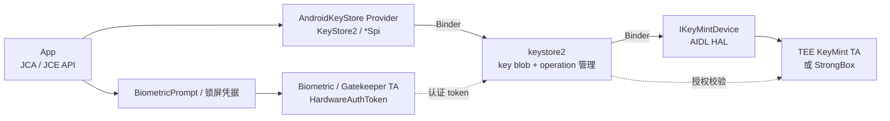

# 8.9 Keystore/KeyMint 调用延迟与登录链路性能

登录流程中的一次签名或解密，可能跨越 App、`keystore2`、KeyMint HAL、TEE 或 StrongBox。若密钥绑定用户认证，还会加入系统认证 UI、传感器、Gatekeeper/biometric TA 和 Hardware Auth Token。把这些阶段合并成一个“Keystore 很慢”，既无法定位瓶颈，也容易用性能优化改变原有安全语义。

平台源码锚点为 Android 17 / API 37 的 `android-17.0.0_r1`，kernel 侧固定到 `android17-6.18-2026-06_r6`。应用 API 以 Android Developers 文档为准，服务与 operation 生命周期回到 Android 17 的 framework 和 `system/security` 源码核查。

## 调用路径：App、Keystore2、KeyMint 与安全环境

Android Keystore 向应用暴露 JCA/JCE Provider。`KeyStore`、`KeyGenerator`、`KeyPairGenerator`、`Cipher`、`Signature` 和 `Mac` 在 App 进程创建对象，涉及受保护 key 的操作再通过 Binder 进入 `keystore2`。

下面的图把应用调用与用户认证的两条路径放在一起。



`keystore2` 保存的是 KeyMint 返回的加密 key blob 和元数据。硬件背书 key 的明文材料只在对应安全环境中可用；待签名消息、明文或密文仍会从 App 传到系统进程并交给 KeyMint 处理，业务数据本身不能因此视为“从未离开 App”。

### 一次操作至少有五段

| 阶段 | 入口示例 | 主要成本 | 可观测性 |
|---|---|---|---|
| key lookup | `KeyStore.getKey()`、`getEntry()` | Provider、Binder、数据库/key blob 读取 | App marker、Binder、`keystore2` 调度 |
| key generation/import | `generateKey()`、`generateKeyPair()` | 随机数、参数校验、安全级别、key blob、证书 | 端到端 marker、错误码 |
| operation begin | `Cipher.init()`、`Signature.initSign()` | key lookup、KeyMint `begin()`、slot、challenge | App marker、Binder、operation 错误 |
| update/finish | `update()`、`doFinal()`、`sign()` | 数据传输、硬件计算、认证 token 校验 | payload、端到端耗时 |
| user authentication | `BiometricPrompt.authenticate()` | 系统 UI、用户、传感器、认证 TA | prompt callback 与认证错误 |

认证 UI 等待不属于密码算法耗时。网络换 token、服务端 attestation 校验也不属于本地 KeyMint 耗时。指标必须在这些边界处分段。

## `init()` 已经创建 KeyMint operation

Android 17 的 `AndroidKeyStoreCipherSpiBase.engineInit()` 会调用 `ensureKeystoreOperationInitialized()`，后者进入 `KeyStoreSecurityLevel.createOperation()`。`Signature.initSign()`、`Mac.init()` 也遵循相同的 operation 模型。耗时埋点只包 `doFinal()` 或 `sign()` 会漏掉 `begin()`、key blob 读取和 slot 分配。

Android 17 源码还给出两个工程约束：

- `engineGenerateKey()` 和多处 `engineInit()` 会调用 `StrictMode.noteSlowCall()` 或 disk read/write 标记。
- Cipher reset、成功结束和部分错误会 abort operation；finalizer 只是兜底，不能依赖 GC 及时释放硬件 slot。

由此可得一条实用规则：`Cipher`、`Signature` 或 `Mac` 在 `init` 后应尽快完成，不要提前几分钟创建再等待用户操作。

### operation 的完整生命周期

一个 KeyMint operation 从 `begin()` 开始，以下事件都会结束它：

- `finish()` 成功；
- `update()` 或 `finish()` 返回错误；
- 客户端显式 `abort()`；
- operation Binder 被释放；
- slot 紧张时被 Keystore2 prune。

同一个 operation 代理还有并发保护。Android 17 `operation.rs` 在并发调用同一 operation 时可返回 `OPERATION_BUSY`，所以同一个 `Cipher` / `Signature` 实例不能被多条线程同时使用。

## 密钥生成、签名、解密与 attestation

### key generation

生成密钥通常比读取既有 key 更重。成本可能包括安全随机数、key blob 创建、硬件能力检查、持久化，以及非对称 key 的证书生成。若设置 attestation challenge，还会生成带 attestation extension 的证书链。

生成动作适合放在：

- 首帧后的明确后台任务；
- 用户启用支付、设备绑定或安全登录的设置流程；
- 注册完成后、进入高频登录之前的准备阶段。

不应在每次 App 冷启动、每次登录点击或每个网络请求中重复生成同一用途的 key。key 是否存在的检查也要处理删除、锁屏重置、biometric enrollment 和 OTA 后失效等异常。

### begin/update/finish

硬件背书 operation 适合处理 key、短 challenge、小 token 或 data key wrapping。大文件、数据库页和长 JSON 直接送入 Keystore，会放大 Binder/KeyMint 往返并占用 operation slot。

大数据加密常采用 envelope encryption：

1. 用普通、经过审查的 crypto library 生成 data encryption key。
2. 用 data key 对业务数据执行 AEAD。
3. 用 Android Keystore key 包装或保护 data key。
4. 将算法版本、nonce、wrapped key 和 ciphertext 按协议保存。

这项设计必须经过威胁模型和密码协议审查。它降低安全硬件的数据吞吐压力，但不能自行更换算法、复用 nonce 或缓存明文 data key。

### attestation

attestation 应拆成三个指标：

- 本地 key generation；
- 本地 attestation certificate chain 返回；
- 服务端上传、链验证和策略判断。

后两项合在登录网络 span 中会掩盖设备侧问题。证书链、challenge 和应用标识也具有安全与隐私属性，日志中只记录长度、结果类别和版本，不记录原始内容。

## 认证绑定密钥：per-use 与 time-based 是两套流程

`setUserAuthenticationRequired(true)` 让 secret/private key 的使用受用户认证约束。API 30 及以上可用 `setUserAuthenticationParameters(timeoutSeconds, authTypes)` 指定授权窗口和认证类型。

| 类型 | `timeout` | 推荐流程 | operation 何时创建 |
|---|---:|---|---|
| per-use | `0` | 初始化 crypto operation，作为 `CryptoObject` 交给 BiometricPrompt | prompt 前、就近创建 |
| time-based | `> 0` | 先尝试初始化；遇到 `UserNotAuthenticatedException` 后认证，再创建一个新 operation | 有效授权窗口内创建 |

### per-use key

下面的 spec 表示每次签名都需要 Class 3 biometric 或设备凭据授权。

```kotlin
val spec = KeyGenParameterSpec.Builder(
    alias,
    KeyProperties.PURPOSE_SIGN,
)
    .setDigests(KeyProperties.DIGEST_SHA256)
    .setUserAuthenticationRequired(true)
    .setUserAuthenticationParameters(
        0,
        KeyProperties.AUTH_BIOMETRIC_STRONG or
            KeyProperties.AUTH_DEVICE_CREDENTIAL,
    )
    .build()
```

生成 key 后，每次使用都要新建并 `initSign()` 一个 `Signature`，再把它包装成 `BiometricPrompt.CryptoObject`。认证成功回调返回的是已经授权的 operation；应用随后在同一对象上完成签名。不要在 callback 前另建一个 `Signature`，那会得到没有绑定本次认证的另一项 operation。

### time-based key

time-based key 的初始化可能抛出 `UserNotAuthenticatedException`。此时展示允许的 biometric/device credential 流程；认证成功后重新创建并初始化 `Cipher` 或 `Signature`。旧的失败对象不应继续使用。

prompt 等待需要单独记录：

- `prompt_requested` 到 `onAuthenticationSucceeded` / error / cancel；
- 认证成功后的 crypto finish；
- 登录网络请求及服务端响应。

用户停留时间、系统 UI 动画和传感器重试都属于 prompt 阶段。KeyMint operation 只覆盖密码操作与授权校验的一部分。

### invalidation

关闭安全锁屏、强制重置凭据或改变 biometric enrollment 可能让 key 永久失效，并在初始化时抛出 `KeyPermanentlyInvalidatedException`。策略应明确：

- 哪些 key 可以删除后重建；
- 哪些 key 的失效需要重新登录或服务端解绑；
- 是否允许 `AUTH_DEVICE_CREDENTIAL`；
- enrollment 变化后是否保持有效。

把“重建 key”当作通用重试会丢失旧 key 保护的数据。重建前要确认服务端与本地恢复协议。

## StrongBox、TEE 与 security level

Android 9 / API 28 及以上设备可以提供 StrongBox KeyMint。StrongBox 面向更高的物理攻击和侧信道风险，官方文档同时说明它更慢、资源更少、并发能力更低；多数应用无需默认选择。

### capability 与 policy 要分开

`FEATURE_STRONGBOX_KEYSTORE` 只说明设备声明了 StrongBox。具体算法、key size、digest、padding 或 attestation 组合仍可能不受支持。`setIsStrongBoxBacked(true)` 失败时会抛出 `StrongBoxUnavailableException`，平台不会静默改成 TEE key。

应用需要预先定义三类策略：

| 策略 | StrongBox 不可用时 | 适合场景 |
|---|---|---|
| required | 失败关闭并提示或交给服务端处理 | 高价值设备绑定、明确合规要求 |
| preferred | 记录失败，经安全策略批准后重新生成非 StrongBox key | 中风险签名、可分级设备 |
| not requested | 使用平台选择的普通 Android Keystore 安全级别 | 普通会话和大多数 App |

preferred fallback 是应用发起的新一轮 key generation。它会创建安全语义不同的 key，必须记录并让服务端知道，不能只把异常吞掉。

### 查询生成结果

Android 12 / API 31 及以上可通过 `KeyInfo.getSecurityLevel()` 读取：

- `SECURITY_LEVEL_STRONGBOX`；
- `SECURITY_LEVEL_TRUSTED_ENVIRONMENT`；
- `SECURITY_LEVEL_SOFTWARE`；
- `SECURITY_LEVEL_UNKNOWN_SECURE` / `UNKNOWN`。

埋点应记录生成后的 security level，而不是只记录 `strongbox_requested`。请求、结果和 fallback 原因三者齐全，才能比较不同安全级别的延迟。

## operation slot：没有稳定的等待队列

AOSP KeyMint implementer contract 要求实现至少支持 16 个并发 operation。Keystore 使用最多 15 个，为 `vold` 的密码加密保留一个。

这条“15+1”描述的是最低实现契约，不表示第 16 个 App 请求会在 FIFO 队列中安静等待。Android 17 的行为是：

1. `IKeyMintDevice.begin()` 返回 `TOO_MANY_OPERATIONS`。
2. Keystore2 调用 `OperationDb::prune()` 尝试释放一项 operation。
3. 当前算法综合 owner 的 sibling operation 数与最近使用时间选择候选。
4. 没有合适候选时可能返回 `BACKEND_BUSY`；被 prune 的旧 operation 再次使用会得到 invalid handle 类错误。

因此，应用侧应限制并发、缩短 operation 生命周期，并按请求记录 busy/pruned/invalid-handle 类错误。旧资料中“总是 abort 全局最久未使用 operation”的说法不足以描述 Android 17 的 Keystore2 策略。

### 容易耗尽 slot 的写法

- 为即将展示的多个列表项提前各建一个 `Cipher`。
- per-use operation 创建后，用户长时间没有响应 prompt。
- 批量文件加解密为每个分片同时建立硬件 operation。
- 多个 SDK 各自使用无界线程池访问 Keystore。
- timeout 后保留旧 `Cipher`，同时开始新一轮重试。

Keystore 工作线程池应是有界的，通常一到少量线程即可。并发值要通过 TEE/StrongBox 分层压测确定，不能照搬 CPU 核数。

## 冷启动和登录的线程调度

Android 官方明确建议不要在主线程使用 `AndroidKeyStore`。key lookup、`init`、generate、sign 和 `doFinal` 都可能发生 Binder、数据库或安全硬件等待；Android 17 Provider 源码也用 StrictMode 标注了多处慢调用。

### 时机表

| 时机 | 可安排的工作 | 应避开的工作 |
|---|---|---|
| 首帧前 | 读取不依赖 Keystore 的轻量登录状态 | key generation、attestation、StrongBox operation、批量解密 |
| 首帧后 | 检查 key 能力、预生成允许提前创建的 key | 创建 per-use operation 后长期等待 |
| 登录点击后 | 在有界后台执行器中创建本次 crypto operation | 主线程串行 crypto、JSON、网络 |
| prompt 阶段 | 展示认证 UI，处理取消和错误 | 同时启动多个备用 operation |
| 认证成功后 | 完成本次短签名/解密，发起网络换票 | 解密大文件或大数据库 |

下面的 Kotlin 示例在专用 dispatcher 上执行短签名，并给 `initSign` 与 `sign` 留下统一的 trace 区间。

```kotlin
private val keystoreDispatcher =
    Executors.newFixedThreadPool(2).asCoroutineDispatcher()

suspend fun signChallenge(alias: String, challenge: ByteArray): ByteArray =
    withContext(keystoreDispatcher) {
        Trace.beginSection("Keystore:sign")
        try {
            val store = KeyStore.getInstance("AndroidKeyStore").apply {
                load(null)
            }
            val privateKey = store.getKey(alias, null) as PrivateKey
            Signature.getInstance("SHA256withECDSA").run {
                initSign(privateKey)
                update(challenge)
                sign()
            }
        } finally {
            Trace.endSection()
        }
    }
```

示例适用于不需要本次 `CryptoObject` 授权的 key。per-use key 应先在后台初始化 `Signature`，回主线程交给 BiometricPrompt，认证成功后再把同一对象转移到后台完成签名；整个过程中不能并发使用该对象。dispatcher 属于长生命周期组件时要在组件销毁时关闭。

### timeout 与 cancellation

JCA Keystore API 没有统一的 per-operation deadline。`withTimeout`、`Future.get(timeout)` 或业务计时器可以停止等待并让 UI 走降级路径，却不保证已经进入 Binder/KeyMint 的调用立即停止。

处理超时应遵守：

- 不在旧 worker 尚未结束时复用同一 crypto 对象；
- 将晚到结果标记为过期，不写入当前会话；
- BiometricPrompt 取消只按其 API 取消认证 UI；
- worker 返回后释放对象引用，让 Provider 完成 finish/abort；
- 连续 timeout 进入退避或备用登录，不做无界并发重试。

## 观测：分阶段、分安全级别、保护敏感数据

### 应记录的字段

| 字段 | 示例 | 用途 |
|---|---|---|
| `scene` | `session_restore`、`biometric_login`、`payment_confirm` | 对齐用户流程 |
| `phase` | `get_key`、`generate`、`begin`、`prompt_wait`、`finish`、`attestation` | 找到耗时阶段 |
| `primitive` | `AES_GCM`、`HMAC_SHA256`、`ECDSA_P256` | 区分算法 |
| `purpose` | encrypt、decrypt、sign、verify、agree | 区分授权 |
| `security_level` | TEE、StrongBox、Software、Unknown | 比较实现 |
| `strongbox_requested` | true / false | 对照策略 |
| `auth_policy` | none、per-use、duration、credential | 区分授权方式 |
| `payload_bucket` | 0—64 B、65—512 B、513 B—4 KiB | 避免记录敏感长度细节 |
| `thread` | main / keystore-worker | 暴露 UI 阻塞 |
| `duration_ms` | 单次值，服务端算 P50/P90/P99 | 保留分布 |
| `result_class` | ok、not-authenticated、invalidated、unavailable、busy | 归类失败 |
| `device/build/app` | 型号、Build、版本 | 识别设备聚集 |

不要记录 key alias、明文、密文、签名原文、认证 token、attestation challenge 或完整证书链。alias 常含账号或业务含义，也不适合作为日志标签。

### Perfetto 能看到什么

在可复现设备上，采集应用 marker、sched、Binder、CPU frequency 和磁盘 I/O：

- App 主线程是否同步等待；
- Binder 调用发往 `keystore2` 的起止和调度延迟；
- `keystore2` 线程是否 runnable、sleep 或被抢占；
- key 数据库访问是否伴随 I/O；
- 多个请求是否在同一时间窗内竞争 operation。

TEE/StrongBox 内部阶段通常对普通 Perfetto trace 不透明。`keystore2` 已返回 Binder 调用但安全环境内部没有细轨，结论只能写成“KeyMint/HAL/安全环境区间”，再结合厂商日志或 HAL instrumentation。不能从空白时间直接断言某个密码算法慢。

### 测试组合

每个关键 primitive 至少覆盖：

- key 首次生成与既有 key；
- 4KB / 小 payload，避免一次只测空消息；
- TEE 与 StrongBox 的实际 security level；
- 单 operation、少量并发、接近 slot 压力的受控测试；
- 冷机、热机、锁屏后、biometric enrollment 变化后；
- 成功、用户取消、认证失败、key invalidated、StrongBox unavailable；
- 设备型号、Android 版本、厂商 Build。

固定“StrongBox 比 TEE 慢多少毫秒”没有跨设备意义。应保存测试条件和分位数，并用相同 key、算法、payload 与认证策略做设备内对照。

## 治理：性能动作不能改变安全策略

| 动作 | 性能收益 | 安全边界 |
|---|---|---|
| 首帧后预生成 | 移出冷启动和点击路径 | 只预生成已获同意、允许提前存在的 key |
| 有界后台执行 | 避免主线程卡顿 | 线程切换不改变 key authorization |
| just-in-time `init` | 缩短 slot 占用 | per-use operation 要与 prompt 绑定 |
| envelope encryption | 减少硬件处理大 payload | 协议、AEAD、nonce 与 data key 生命周期需审查 |
| StrongBox preferred fallback | 提高设备覆盖 | 记录降级，并让服务端接受不同 security level |
| timeout/备用登录 | 保持 UI 可恢复 | timeout 不等于 operation 已取消 |
| 能力缓存 | 减少重复探测 | 系统升级、锁屏和 enrollment 变化后失效 |

可缓存能力结果、key 是否存在的非敏感状态和服务端策略版本，不要缓存解密后的 refresh token 来“优化 Keystore”。明文缓存改变攻击面，必须单独评审。

## Passkey / Credential Manager 的边界

Credential Manager 是初始登录的统一入口，也支持后续重新授权。普通 relying-party App 请求 passkey 时，私钥通常由 credential provider 管理；不能从“用户创建了一个 passkey”推导出本 App 新增了一个 `AndroidKeyStore` alias。

性能指标应分开：

- Credential Manager request 到 provider UI；
- 用户选择/认证；
- provider 返回 credential；
- App 与服务端完成 assertion 验证；
- App 自己用于会话缓存的 Keystore 解密。

只有应用自行生成 Android Keystore key，或应用本身实现 credential provider 并管理相应 key 时，这些 key 才进入 alias、operation 与 security-level 清单。

## Android 6—17 的版本边界

| 版本 | 相关能力 |
|---|---|
| Android 6 / API 23 | `KeyGenParameterSpec` 与认证绑定 key 的现代应用基线 |
| Android 9 / API 28 | StrongBox API 与 `StrongBoxUnavailableException` |
| Android 11 / API 30 | `setUserAuthenticationParameters()` 明确 timeout 与 auth type |
| Android 12 / API 31 | Keystore2 + KeyMint 架构；`KeyInfo.getSecurityLevel()` |
| Android 13 / API 33 | KeyMint v2 增加 Curve25519 等能力 |
| Android 17 / API 37 | 源码锚点；Keystore2 operation、Provider 和 AIDL KeyMint 主线按固定 tag 核查 |

平台版本表只描述 API/架构边界。StrongBox、算法组合、operation 数和安全环境耗时仍由设备实现决定。

## Android 17 与 kernel 源码入口

Android 17 可从以下固定源码继续追踪：

- [`KeyStore2.java`](https://android.googlesource.com/platform/frameworks/base/+/android-17.0.0_r1/keystore/java/android/security/KeyStore2.java)：App Provider 到 `IKeystoreService` 的 Binder 客户端。
- [`AndroidKeyStoreKeyGeneratorSpi.java`](https://android.googlesource.com/platform/frameworks/base/+/android-17.0.0_r1/keystore/java/android/security/keystore2/AndroidKeyStoreKeyGeneratorSpi.java)：security level 选择、generate 与 StrongBox 错误映射。
- [`AndroidKeyStoreCipherSpiBase.java`](https://android.googlesource.com/platform/frameworks/base/+/android-17.0.0_r1/keystore/java/android/security/keystore2/AndroidKeyStoreCipherSpiBase.java)：`engineInit()`、create operation、finish/abort。
- Keystore2 [`security_level.rs`](https://android.googlesource.com/platform/system/security/+/android-17.0.0_r1/keystore2/src/security_level.rs)：KeyMint `begin()`、`TOO_MANY_OPERATIONS` 与 prune 重试。
- Keystore2 [`operation.rs`](https://android.googlesource.com/platform/system/security/+/android-17.0.0_r1/keystore2/src/operation.rs)：operation lifecycle、并发保护和 pruning 算法。
- [`IKeyMintDevice.aidl`](https://android.googlesource.com/platform/hardware/interfaces/+/android-17.0.0_r1/security/keymint/aidl/android/hardware/security/keymint/IKeyMintDevice.aidl)：KeyMint HAL 的 generate/import/begin 能力。

App 到 `keystore2`、`keystore2` 到 Binderized KeyMint HAL 都经过 Binder。kernel `android17-6.18-2026-06_r6` 可固定查看 [`drivers/android/binder.c`](https://android.googlesource.com/kernel/common/+/refs/tags/android17-6.18-2026-06_r6/drivers/android/binder.c)。TEE/StrongBox 的 transport 和 driver 多由 vendor 实现，不在 common kernel 中；没有设备内核与 HAL 源码时，应保留这一证据缺口。

## 与其他章节的关系

- [§8.2 App 启动全流程](02-app-launch.md)：首帧、TTID/TTFD 与初始化时机。
- [§8.3 启动优化策略](03-launch-optimization.md)：延迟初始化、线程调度和回归。
- [§8.10 BiometricPrompt 与 Credential Manager](10-biometric-credential-login-performance.md)：认证 UI、凭据选择与登录流程。
- [§20.14 Keystore 配额与登录稳定性](../../part5-app/ch20-stability/14-keystore-quota-login-stability.md)：alias 增长、配额和账号生命周期。
- [§26.3 性能指标采集](../../part5-app/ch26-observability/03-performance-collection.md)：端侧指标、采样与上报。

## 参考资料

- [Android Keystore system](https://developer.android.com/privacy-and-security/keystore)
- [BiometricPrompt authentication](https://developer.android.com/identity/sign-in/biometric-auth)
- [`KeyGenParameterSpec.Builder`](https://developer.android.com/reference/android/security/keystore/KeyGenParameterSpec.Builder)
- [`KeyInfo`](https://developer.android.com/reference/android/security/keystore/KeyInfo)
- [Hardware-backed Keystore architecture](https://source.android.com/docs/security/features/keystore)
- [KeyMint functions and operation contract](https://source.android.com/docs/security/features/keystore/implementer-ref)
- [Keystore/KeyMint feature set](https://source.android.com/docs/security/features/keystore/features)

## 小结

Keystore 延迟要按 key lookup、generation、operation begin、update/finish、prompt wait、attestation 和网络验证分段。`Cipher.init()` 已经可能占用 KeyMint slot；per-use key 必须把同一 CryptoObject 交给认证流程；time-based key 在认证后创建新 operation。

StrongBox 是安全策略选择，不是高性能默认项，也不会在失败时静默回退。应用应使用有界后台执行、短 operation、小 payload 和分层指标，在 timeout、prune、失效与设备差异下保持登录流程可恢复，同时保留服务端认可的安全级别。
