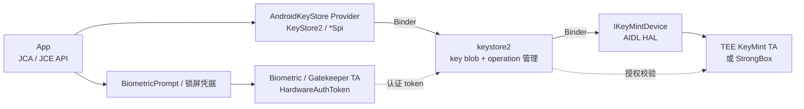

# 8.9 Keystore/KeyMint 调用延迟与登录链路性能

登录流程中的一次签名或解密，可能依次经过 App、`keystore2`、KeyMint HAL（硬件抽象层），最后进入 TEE（Trusted Execution Environment，可信执行环境）或 StrongBox 安全硬件。若密钥绑定了用户认证，链路中还会出现系统认证 UI、传感器、Gatekeeper 或 biometric TA（运行在安全环境中的可信应用），以及用于证明认证结果的 Hardware Auth Token。若把这些阶段统称为“Keystore 很慢”，既无法定位瓶颈，也可能让性能改动破坏原有安全约束。

平台源码锚点为 Android 17 / API 37 的 `android-17.0.0_r1`，kernel 侧固定到 `android17-6.18-2026-06_r6`。应用 API 以 Android Developers 文档为准，服务行为与 operation 生命周期则回到 Android 17 的 framework 和 `system/security` 源码核查。这里的 operation 是一次有状态的密码操作会话，从初始化到完成或中止都占用后端资源。

## 调用路径：App、Keystore2、KeyMint 与安全环境

Android Keystore 以 JCA/JCE Provider 的形式接入 Java 密码 API。JCA/JCE 是 Java 的密码体系，Provider 负责实现具体算法和密钥访问。`KeyStore`、`KeyGenerator`、`KeyPairGenerator`、`Cipher`、`Signature` 和 `Mac` 对象在 App 进程中创建；需要使用受保护密钥时，调用才通过 Binder 进入 `keystore2`。

下面的图同时展示密码操作和用户认证两条路径，目的是说明认证结果怎样参与密钥授权；它们并不共享完全相同的执行阶段。



图中的 `keystore2` 保存 KeyMint 返回的加密 key blob（由安全环境封装的不透明密钥数据）和元数据。对于 hardware-backed key（硬件保护密钥），明文密钥材料只在对应安全环境内可用。待签名消息、待加密明文或密文仍会从 App 传到系统进程，再交给 KeyMint 处理，因此不能宣称业务数据“从未离开 App”。

### 一次操作至少有五段

| 阶段 | 入口示例 | 主要成本 | 可观测性 |
|---|---|---|---|
| 密钥查找（key lookup） | `KeyStore.getKey()`、`getEntry()` | Provider、Binder、数据库/key blob 读取 | App trace marker、Binder、`keystore2` 调度 |
| 密钥生成或导入 | `generateKey()`、`generateKeyPair()` | 随机数、参数校验、安全级别、key blob、证书 | 端到端 trace marker、错误码 |
| operation 初始化 | `Cipher.init()`、`Signature.initSign()` | 密钥查找、KeyMint `begin()`、slot、challenge | App trace marker、Binder、operation 错误 |
| 数据处理与结束 | `update()`、`doFinal()`、`sign()` | 数据传输、硬件计算、认证 token 校验 | payload 大小、端到端耗时 |
| 用户认证 | `BiometricPrompt.authenticate()` | 系统 UI、用户操作、传感器、认证 TA | prompt 回调与认证错误 |

App trace marker 是应用写入时间线的自定义起止标记。认证 UI 的等待时间不属于密码算法耗时；通过网络换取会话 token、由服务端校验 attestation 的时间也不属于本地 KeyMint 耗时。指标必须沿这些边界分段记录。

## `init()` 已经创建 KeyMint operation

Android 17 的 `AndroidKeyStoreCipherSpiBase.engineInit()` 会调用 `ensureKeystoreOperationInitialized()`，后者进入 `KeyStoreSecurityLevel.createOperation()`。`Signature.initSign()`、`Mac.init()` 也遵循相同的 operation 模型。每个 operation 会关联后端句柄并占用一个 slot（可同时存在的操作名额）。若耗时埋点只包住 `doFinal()` 或 `sign()`，就会漏掉 `begin()`、key blob 读取和 slot 分配。

Android 17 源码还给出两个工程约束：

- `engineGenerateKey()` 和多处 `engineInit()` 会调用 `StrictMode.noteSlowCall()`，或标记磁盘读写，表明这些路径可能阻塞调用线程。
- Cipher reset、成功结束和部分错误都会 abort（中止）operation；finalizer 是对象回收前的兜底清理，不能依赖 GC 及时释放硬件 slot。

因此，`Cipher`、`Signature` 或 `Mac` 在 `init` 后应尽快完成。提前数分钟创建对象再等待用户操作，会无谓地延长 operation 和 slot 的占用时间。

### operation 的完整生命周期

一个 KeyMint operation 从 `begin()` 开始，以下事件都会结束这次会话：

- `finish()` 成功；
- `update()` 或 `finish()` 返回错误；
- 客户端显式 `abort()`；
- operation 对应的 Binder 对象被释放；
- slot 紧张时被 Keystore2 prune，也就是选中并回收。

同一个 operation 代理还有并发保护。Android 17 的 `operation.rs` 在多个线程同时调用同一 operation 时可返回 `OPERATION_BUSY`，因此同一个 `Cipher` 或 `Signature` 实例不能并发使用。

## 密钥生成、签名、解密与 attestation

### 密钥生成（key generation）

生成密钥通常比读取已有密钥耗时更长。成本可能包括生成安全随机数、创建 key blob、检查硬件能力、持久化，以及为非对称密钥生成证书。若设置 attestation challenge（服务端提供的随机质询），还会生成带 attestation extension（密钥证明扩展）的证书链。

生成动作适合放在：

- 首帧后的明确后台任务；
- 用户启用支付、设备绑定或安全登录的设置流程；
- 注册完成后、进入高频登录之前的准备阶段。

同一用途的密钥不应在每次 App 冷启动、每次登录点击或每个网络请求中重复生成。检查密钥是否存在时，还要处理密钥被删除，以及锁屏重置、biometric enrollment（生物识别模板录入状态）变化或 OTA 系统升级后失效等情况。

### begin/update/finish

硬件保护的 operation 适合处理密钥、短 challenge、小 token，或执行 data key wrapping（数据密钥封装）。若把大文件、数据库页或长 JSON 直接送入 Keystore，会增加 Binder/KeyMint 往返和数据传输，并长时间占用 operation slot。

大数据加密常采用 envelope encryption（信封加密）：业务数据由临时数据密钥加密，Android Keystore 密钥只负责保护这把数据密钥。

1. 用经过安全审查的密码库生成 data encryption key（DEK，数据加密密钥）。
2. 用 DEK 对业务数据执行 AEAD（带关联数据的认证加密），同时保证机密性和完整性。
3. 用 Android Keystore 密钥包装或保护 DEK。
4. 按协议保存算法版本、nonce（一次性随机数或计数值）、wrapped key（封装后的密钥）和 ciphertext（密文）。

这项设计必须经过威胁模型和密码协议审查。它可以降低安全硬件的数据吞吐压力，但应用不能自行更换算法、复用 nonce 或长期缓存明文 DEK。

### 密钥证明（attestation）

attestation 用证书链证明密钥的属性及其受保护环境。它应拆成三个指标：

- 本地密钥生成；
- 本地 attestation certificate chain（证明证书链）返回；
- 服务端上传、链验证和策略判断。

若把后两项都放进一个登录网络 span（链路追踪区间），设备侧问题会被网络与服务端耗时掩盖。证书链、challenge 和应用标识也具有安全与隐私属性；日志只记录长度、结果类别和版本，不记录原始内容。

## 认证绑定密钥：per-use 与 time-based 两套流程

`setUserAuthenticationRequired(true)` 让 secret key（对称密钥）或 private key（私钥）的使用受到用户认证约束。API 30 及以上可用 `setUserAuthenticationParameters(timeoutSeconds, authTypes)` 指定授权有效期和允许的认证类型。

| 类型 | `timeout` | 推荐流程 | operation 何时创建 |
|---|---:|---|---|
| per-use（每次使用授权） | `0` | 初始化密码 operation，作为 `CryptoObject` 交给 BiometricPrompt | prompt 前、临近使用时创建 |
| time-based（限时授权） | `> 0` | 先尝试初始化；遇到 `UserNotAuthenticatedException` 后认证，再创建一个新 operation | 有效授权期内创建 |

### per-use 密钥

下面的 `KeyGenParameterSpec` 配置表示每次签名都需要 Class 3 biometric（Android 定义的强生物识别等级）或设备锁屏凭据授权。

```kotlin
val spec = KeyGenParameterSpec.Builder(
    alias,
    KeyProperties.PURPOSE_SIGN,
)
    .setDigests(KeyProperties.DIGEST_SHA256)
    .setUserAuthenticationRequired(true)
    .setUserAuthenticationParameters(
        0,
        KeyProperties.AUTH_BIOMETRIC_STRONG or
            KeyProperties.AUTH_DEVICE_CREDENTIAL,
    )
    .build()
```

生成密钥后，每次使用都要新建一个 `Signature` 并调用 `initSign()`，再将它包装成 `BiometricPrompt.CryptoObject`。认证成功回调会返回已经获得本次授权的 operation，应用随后在同一对象上完成签名。若在回调前另建一个 `Signature`，新对象对应的是另一项 operation，没有绑定刚才的认证结果。

### time-based 密钥

time-based 密钥的初始化可能抛出 `UserNotAuthenticatedException`，表示当前没有仍在有效期内的认证授权。此时应展示策略允许的生物识别或设备凭据流程；认证成功后，重新创建并初始化 `Cipher` 或 `Signature`，不再使用初始化失败的旧对象。

BiometricPrompt 等待阶段需要单独记录：

- 从 `prompt_requested` 到 `onAuthenticationSucceeded`、错误或取消回调；
- 认证成功后的密码操作完成时间；
- 登录网络请求及服务端响应。

用户思考或操作的时间、系统 UI 动画和传感器重试都属于 prompt 阶段。KeyMint operation 只覆盖密码操作和授权校验中的一部分，不能用它代表完整的用户认证时长。

### 密钥永久失效（invalidation）

关闭安全锁屏、强制重置凭据或改变 biometric enrollment，可能让密钥永久失效，并在初始化时抛出 `KeyPermanentlyInvalidatedException`。恢复策略应明确：

- 哪些密钥可以删除后重建；
- 哪些密钥失效后需要重新登录或在服务端解除设备绑定；
- 是否允许 `AUTH_DEVICE_CREDENTIAL`；
- enrollment 变化后密钥是否保持有效。

把“重建密钥”当作通用重试，可能导致旧密钥保护的数据再也无法解密。重建前要确认服务端和本地恢复协议允许这样做。

## StrongBox、TEE 与 security level

Android 9 / API 28 及以上设备可以提供 StrongBox KeyMint。TEE 与 Android 主系统隔离运行，StrongBox 则使用隔离程度更高的安全硬件。StrongBox 面向更高的物理攻击和侧信道风险，但通常速度更慢、资源更少、并发能力更低，因此多数应用无需默认选择。

### 区分设备能力与业务策略

`FEATURE_STRONGBOX_KEYSTORE` 只说明设备声明了 StrongBox 能力。具体的算法、key size（密钥长度）、digest（摘要算法）、padding（填充方式）或 attestation 参数组合仍可能不受支持。`setIsStrongBoxBacked(true)` 失败时会抛出 `StrongBoxUnavailableException`，平台不会自动改为生成 TEE 密钥。

应用需要预先定义三类策略：

| 策略 | StrongBox 不可用时 | 适合场景 |
|---|---|---|
| required（必须） | 终止流程并提示，或交给服务端处理 | 高价值设备绑定、明确合规要求 |
| preferred（优先） | 记录失败，经安全策略批准后重新生成非 StrongBox 密钥 | 中风险签名、可分级设备 |
| not requested（不要求） | 使用平台选择的普通 Android Keystore 安全级别 | 普通会话和大多数 App |

preferred fallback（首选方案不可用时的后备流程）需要由应用重新发起一次密钥生成。新密钥的安全级别已经改变，应用必须记录这次变化并通知服务端，不能只捕获异常后悄悄继续。

### 查询生成结果

Android 12 / API 31 及以上可通过 `KeyInfo.getSecurityLevel()` 读取：

- `SECURITY_LEVEL_STRONGBOX`；
- `SECURITY_LEVEL_TRUSTED_ENVIRONMENT`；
- `SECURITY_LEVEL_SOFTWARE`；
- `SECURITY_LEVEL_UNKNOWN_SECURE` / `UNKNOWN`。

埋点既要记录 `strongbox_requested`，也要记录密钥生成后的实际 security level 和 fallback 原因。三者齐全后，才能比较不同安全级别的延迟，并识别请求 StrongBox 后发生了多少次降级。

## operation slot：没有稳定的等待队列

AOSP KeyMint implementer contract（实现方约定）要求后端至少支持 16 个并发 operation。Keystore 最多使用其中 15 个，为 `vold` 保留一个；`vold` 是 Android 的卷管理守护进程，需要使用 KeyMint 支持存储加密。

“15+1”描述的是最低实现约定，无法据此认定第 16 个 App 请求会进入 FIFO（先进先出）队列等待。Android 17 的处理过程如下：

1. `IKeyMintDevice.begin()` 返回 `TOO_MANY_OPERATIONS`。
2. Keystore2 调用 `OperationDb::prune()`，尝试选中并释放一项已有 operation。
3. 当前算法综合 owner（所属客户端）的 sibling operation（同一 owner 的其他 operation）数量和最近使用时间选择候选。
4. 没有合适候选时可能返回 `BACKEND_BUSY`；被 prune 的旧 operation 再次使用时会收到 invalid handle（句柄已失效）类错误。

因此，应用侧应限制并发、缩短 operation 生命周期，并按请求记录 busy、pruned 和 invalid-handle 类错误。旧资料常将策略概括为“中止全局最久未使用的 operation”，这个说法没有包含 Android 17 对 owner 和 sibling operation 数量的考虑。

### 容易耗尽 slot 的写法

- 为即将展示的多个列表项提前各建一个 `Cipher`。
- per-use operation 创建后，用户长时间没有响应 BiometricPrompt。
- 批量文件加解密为每个分片同时建立硬件 operation。
- 多个 SDK 各自使用无界线程池访问 Keystore。
- 超时后保留旧 `Cipher`，同时开始新一轮重试。

Keystore 工作线程池应限制最大线程数，通常一到少量线程即可。合适的并发值要分别在 TEE 和 StrongBox 上压测确定，不能直接照搬 CPU 核数。

## 冷启动和登录的线程调度

Android 官方明确建议避免在主线程使用 `AndroidKeyStore`。密钥查找、`init`、生成、签名和 `doFinal` 都可能等待 Binder、数据库或安全硬件；Android 17 Provider 源码也通过 StrictMode 标出了多处慢调用。在主线程执行这些操作，会直接阻塞界面绘制和输入处理。

### 时机表

| 时机 | 可安排的工作 | 应避开的工作 |
|---|---|---|
| 首帧前 | 读取不依赖 Keystore 的轻量登录状态 | 密钥生成、attestation、StrongBox operation、批量解密 |
| 首帧后 | 检查密钥能力、预生成允许提前创建的密钥 | 创建 per-use operation 后长期等待 |
| 登录点击后 | 在有界后台执行器中创建本次密码 operation | 在主线程串行执行密码操作、JSON 处理和网络请求 |
| prompt 阶段 | 展示认证 UI，处理取消和错误 | 同时启动多个备用 operation |
| 认证成功后 | 完成本次短签名/解密，发起网络换票 | 解密大文件或大数据库 |

下面的 Kotlin 示例在专用 Dispatcher 上执行一次短签名。这个 Dispatcher 使用固定大小的线程池，trace 区间覆盖 `initSign` 和 `sign`，因此不会漏掉 operation 初始化时间。

```kotlin
private val keystoreDispatcher =
    Executors.newFixedThreadPool(2).asCoroutineDispatcher()

suspend fun signChallenge(alias: String, challenge: ByteArray): ByteArray =
    withContext(keystoreDispatcher) {
        Trace.beginSection("Keystore:sign")
        try {
            val store = KeyStore.getInstance("AndroidKeyStore").apply {
                load(null)
            }
            val privateKey = store.getKey(alias, null) as PrivateKey
            Signature.getInstance("SHA256withECDSA").run {
                initSign(privateKey)
                update(challenge)
                sign()
            }
        } finally {
            Trace.endSection()
        }
    }
```

示例适用于本次使用不需要通过 `CryptoObject` 单独授权的密钥。per-use 密钥应先在后台初始化 `Signature`，再回到主线程将它交给 BiometricPrompt；认证成功后，把回调返回的同一对象转移到后台完成签名。整个过程中不能并发使用该对象。若 Dispatcher 隶属于有明确生命周期的组件，应在组件销毁时关闭它，避免线程泄漏。

### 超时与取消

JCA Keystore API 没有统一的 per-operation deadline（单次操作截止时间）。`withTimeout`、`Future.get(timeout)` 或业务计时器可以让上层停止等待，并让 UI 进入备用登录流程；但如果调用已经进入 Binder/KeyMint，这些计时机制不保证底层操作会立即停止。

处理超时应遵守：

- 旧 worker（工作线程）尚未结束时，不复用同一个密码对象；
- 将晚到结果标记为过期，不写入当前会话；
- BiometricPrompt 取消只按其 API 取消认证 UI；
- worker 返回后释放对象引用，让 Provider 完成 finish 或 abort；
- 连续超时后进入退避等待或备用登录，不做没有并发上限的重试。

## 观测：分阶段、分安全级别、保护敏感数据

### 应记录的字段

| 字段 | 示例 | 用途 |
|---|---|---|
| `scene` | `session_restore`、`biometric_login`、`payment_confirm` | 对齐用户流程 |
| `phase` | `get_key`、`generate`、`begin`、`prompt_wait`、`finish`、`attestation` | 找到耗时阶段 |
| `primitive` | `AES_GCM`、`HMAC_SHA256`、`ECDSA_P256` | 区分密码原语或算法组合 |
| `purpose` | encrypt、decrypt、sign、verify、agree | 区分授权 |
| `security_level` | TEE、StrongBox、Software、Unknown | 比较实现 |
| `strongbox_requested` | true / false | 对照策略 |
| `auth_policy` | none、per-use、duration、credential | 区分授权方式 |
| `payload_bucket` | 0—64 B、65—512 B、513 B—4 KiB | 用区间记录输入大小，避免暴露精确长度 |
| `thread` | main / keystore-worker | 暴露 UI 阻塞 |
| `duration_ms` | 单次值，服务端计算 P50/P90/P99 | 保留耗时分布，而非只看平均值 |
| `result_class` | ok、not-authenticated、invalidated、unavailable、busy | 归类失败 |
| `device/build/app` | 型号、Build、版本 | 识别设备聚集 |

不要记录 key alias（密钥别名）、明文、密文、签名原文、认证 token、attestation challenge 或完整证书链。alias 常包含账号或业务含义，也不适合作为日志标签。

### Perfetto 能看到什么

在能够稳定复现问题的设备上，采集应用 trace marker、sched（线程调度）、Binder、CPU frequency（CPU 频率）和磁盘 I/O，可以回答：

- App 主线程是否同步等待；
- Binder 调用发往 `keystore2` 的起止和调度延迟；
- `keystore2` 线程是 Running、Runnable、Sleeping，还是运行过程中被其他线程抢占；
- key 数据库访问是否伴随 I/O；
- 多个请求是否在同一时间窗内竞争 operation。

TEE/StrongBox 内部阶段通常不会出现在普通 Perfetto trace 中。若时间线只能看到 `keystore2` 进入 KeyMint，无法看到安全环境内部的细分轨道，结论应写成“耗时位于 KeyMint/HAL/安全环境区间”，再结合厂商日志或 HAL instrumentation（HAL 内部插桩）继续定位。时间线上的空白不足以证明某个密码算法本身很慢。

### 测试组合

每个关键 primitive（密码原语或算法组合）至少覆盖以下测试条件：

- key 首次生成与既有 key；
- 4 KB 和更小的 payload，避免只测试空消息；
- TEE 与 StrongBox 的实际 security level；
- 单 operation、少量并发，以及接近 slot 上限的受控压力测试；
- 冷机、热机、锁屏后，以及 biometric enrollment 变化后；
- 成功、用户取消、认证失败、密钥失效和 StrongBox 不可用；
- 设备型号、Android 版本、厂商 Build。

“StrongBox 比 TEE 慢多少毫秒”没有适用于所有设备的固定答案。测试时要保存条件和分位数，并在同一设备上使用相同密钥类型、算法、payload 和认证策略对照。

## 治理：性能动作不能改变安全策略

| 动作 | 性能收益 | 安全边界 |
|---|---|---|
| 首帧后预生成 | 移出冷启动和点击路径 | 只预生成已获同意、允许提前存在的 key |
| 有界后台执行 | 避免主线程卡顿 | 线程切换不改变密钥授权条件 |
| just-in-time `init`（临用时初始化） | 缩短 slot 占用 | per-use operation 要与 prompt 绑定 |
| envelope encryption | 减少安全硬件处理大 payload 的时间 | 协议、AEAD、nonce 与数据密钥生命周期需审查 |
| StrongBox preferred fallback | 提高设备覆盖 | 记录降级，并让服务端接受变化后的 security level |
| 超时或备用登录 | 让 UI 可以继续响应 | 上层超时不代表 operation 已取消 |
| 能力缓存 | 减少重复探测 | 系统升级、锁屏和 enrollment 变化后失效 |

可以缓存设备能力结果、密钥是否存在的非敏感状态和服务端策略版本。解密后的 refresh token（刷新令牌）不应仅为缩短 Keystore 耗时而缓存；明文缓存扩大了数据可能暴露的位置，必须单独进行安全评审。

## Passkey / Credential Manager 的边界

Credential Manager 是初始登录的统一凭据入口，也支持后续重新授权。普通 relying-party App（依赖凭据完成登录的业务应用）请求 passkey 时，私钥通常由 credential provider（凭据提供方）管理。用户创建 passkey，并不代表业务 App 自己新增了一个 `AndroidKeyStore` alias。

性能指标应分开：

- Credential Manager 发出请求到 provider UI 出现；
- 用户选择/认证；
- provider 返回 credential（凭据）；
- App 与服务端完成 assertion（认证断言）验证；
- App 自己用于会话缓存的 Keystore 解密。

只有应用自行生成 Android Keystore 密钥，或应用本身实现 credential provider 并管理相应密钥时，才需要把这些密钥纳入 alias、operation 与 security-level 清单。

## Android 6—17 的版本边界

| 版本 | 相关能力 |
|---|---|
| Android 6 / API 23 | `KeyGenParameterSpec` 与认证绑定密钥的现代应用基线 |
| Android 9 / API 28 | StrongBox API 与 `StrongBoxUnavailableException` |
| Android 11 / API 30 | `setUserAuthenticationParameters()` 明确认证有效期与 auth type |
| Android 12 / API 31 | Keystore2 + KeyMint 架构；`KeyInfo.getSecurityLevel()` |
| Android 13 / API 33 | KeyMint v2 增加 Curve25519 等能力 |
| Android 17 / API 37 | 本文源码锚点；Keystore2 operation、Provider 和 AIDL KeyMint 主线按固定 tag 核查 |

平台版本表只描述 API 和架构边界。StrongBox 支持情况、算法组合、可用 operation 数和安全环境耗时仍由具体设备实现决定。

## Android 17 与 kernel 源码入口

Android 17 可从以下固定源码继续追踪：

- [`KeyStore2.java`](https://android.googlesource.com/platform/frameworks/base/+/android-17.0.0_r1/keystore/java/android/security/KeyStore2.java)：App Provider 到 `IKeystoreService` 的 Binder 客户端。
- [`AndroidKeyStoreKeyGeneratorSpi.java`](https://android.googlesource.com/platform/frameworks/base/+/android-17.0.0_r1/keystore/java/android/security/keystore2/AndroidKeyStoreKeyGeneratorSpi.java)：security level 选择、密钥生成与 StrongBox 错误映射。
- [`AndroidKeyStoreCipherSpiBase.java`](https://android.googlesource.com/platform/frameworks/base/+/android-17.0.0_r1/keystore/java/android/security/keystore2/AndroidKeyStoreCipherSpiBase.java)：`engineInit()`、operation 创建及 finish/abort。
- Keystore2 [`security_level.rs`](https://android.googlesource.com/platform/system/security/+/android-17.0.0_r1/keystore2/src/security_level.rs)：KeyMint `begin()`、`TOO_MANY_OPERATIONS` 与 prune 重试。
- Keystore2 [`operation.rs`](https://android.googlesource.com/platform/system/security/+/android-17.0.0_r1/keystore2/src/operation.rs)：operation 生命周期、并发保护和 pruning 算法。
- [`IKeyMintDevice.aidl`](https://android.googlesource.com/platform/hardware/interfaces/+/android-17.0.0_r1/security/keymint/aidl/android/hardware/security/keymint/IKeyMintDevice.aidl)：KeyMint HAL 的 generate/import/begin 接口。

App 到 `keystore2`，以及 `keystore2` 到 Binderized KeyMint HAL（通过 Binder 暴露的 KeyMint 服务）都经过 Binder。kernel `android17-6.18-2026-06_r6` 可固定查看 [`drivers/android/binder.c`](https://android.googlesource.com/kernel/common/+/refs/tags/android17-6.18-2026-06_r6/drivers/android/binder.c)。TEE/StrongBox 的 transport（通信通道）和 driver 多由设备厂商实现，不在 common kernel 中；没有设备内核与 HAL 源码时，应明确说明这部分无法继续归因。

## 与其他章节的关系

- [§8.2 App 启动全流程](02-app-launch.md)：首帧、TTID/TTFD 与初始化时机。
- [§8.3 启动优化策略](03-launch-optimization.md)：延迟初始化、线程调度和回归。
- [§8.10 BiometricPrompt 与 Credential Manager](10-biometric-credential-login-performance.md)：认证 UI、凭据选择与登录流程。
- [§20.14 Keystore 配额与登录稳定性](../../part5-app/ch20-stability/14-keystore-quota-login-stability.md)：alias 增长、配额和账号生命周期。
- [§26.3 性能指标采集](../../part5-app/ch26-observability/03-performance-collection.md)：端侧指标、采样与上报。

## 参考资料

- [Android Keystore system](https://developer.android.com/privacy-and-security/keystore)
- [BiometricPrompt authentication](https://developer.android.com/identity/sign-in/biometric-auth)
- [`KeyGenParameterSpec.Builder`](https://developer.android.com/reference/android/security/keystore/KeyGenParameterSpec.Builder)
- [`KeyInfo`](https://developer.android.com/reference/android/security/keystore/KeyInfo)
- [Hardware-backed Keystore architecture](https://source.android.com/docs/security/features/keystore)
- [KeyMint functions and operation contract](https://source.android.com/docs/security/features/keystore/implementer-ref)
- [Keystore/KeyMint feature set](https://source.android.com/docs/security/features/keystore/features)

## 小结

Keystore 延迟要按密钥查找、生成、operation 初始化、update/finish、认证 UI 等待、attestation 和网络验证分段。`Cipher.init()` 已经可能占用 KeyMint slot；per-use 密钥必须把同一个 `CryptoObject` 交给认证流程；time-based 密钥在认证成功后创建新的 operation。

StrongBox 是安全策略选择，不以高性能为目标，失败时也不会自动回退。应用应采用有并发上限的后台执行器、短生命周期 operation、小 payload 和分阶段指标；遇到超时、prune、密钥失效或设备差异时，登录流程仍要提供明确且安全的恢复路径，并保持服务端认可的安全级别。
