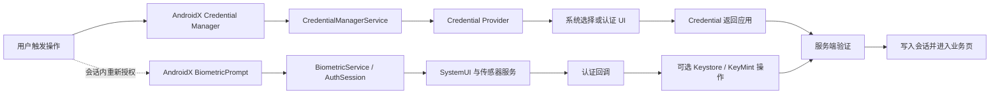
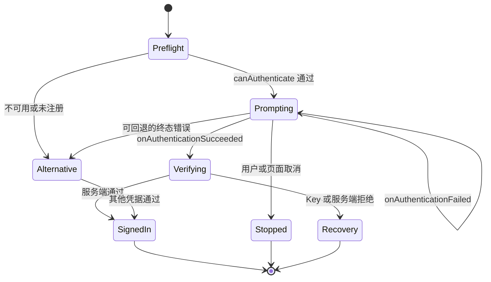

# 8.10 BiometricPrompt 与 Credential Manager 登录链路性能

登录页只记录一个 `login_cost_ms`，排查时几乎没有方向。一次凭据登录可能包含 provider 查询、系统选择器、用户停留、传感器认证、passkey assertion、服务端验证和会话初始化；一次会话内重新授权又可能只经过 `BiometricPrompt`、Keystore 与业务操作。两个流程都会出现系统认证界面，调用者、数据边界和可观测信号却不同。

平台源码基线为 Android 17（API 37）的 `android-17.0.0_r1`，内核基线为 `android17-6.18-2026-06_r6`。应用初次登录优先使用 Credential Manager；会话内的敏感操作确认可以使用 Credential Manager 或 AndroidX `BiometricPrompt`。这一分工来自当前 [Android 生物认证指南](https://developer.android.com/identity/sign-in/biometric-auth)，也能避免应用自行拼装账号选择与认证界面。

## 两条流程，两个责任边界

登录与重新授权可以共享同一个 `flow_id` 体系，但不要共享同一组阶段名称。下图中的实线是 Credential Manager 登录，虚线是会话内重新授权：



Credential Manager 返回的 `Credential` 仍需由应用和服务端完成业务验证。`BiometricPrompt` 的成功回调只说明平台接受了本次认证；它不会替应用建立账号会话，也不会替服务端验证 passkey assertion。

性能拆分建议使用下列口径：

| 阶段 | 应用入口或完成点 | 应用能直接观测什么 | 不应从该阶段推断什么 |
|---|---|---|---|
| 凭据请求 | `getCredential()` 开始到返回或抛出异常 | 请求类型、总等待、结果类型、异常类 | provider 查询时长、候选数量、系统 UI 出现时间 |
| 生物认证请求 | `authenticate()` 开始到成功或终态错误 | 请求时间、认证类型、错误码、调用方取消原因 | 对话框精确出现时间、具体指纹或人脸传感器 |
| 加密操作 | `Cipher.init`、`Signature.initSign`、`doFinal`、`sign` | 每次调用耗时、异常家族、密钥策略 | 用户停留时间、服务端耗时 |
| 凭据验证 | Credential 返回到服务端响应 | 网络耗时、HTTP 类别、验证或风控结果 | SystemUI 或传感器性能 |
| 会话就绪 | 服务端通过到目标页面首帧 | 本地写入、数据加载、首帧时间 | 前面认证阶段的耗时 |

`CredentialManager.getCredential()` 的等待包含用户在系统 UI 上的操作。`BiometricPrompt` 的请求到回调也包含用户停留。没有平台专用观测能力时，应用只能把它们命名为“请求到结果”，不能命名为“provider 查询耗时”或“传感器识别耗时”。

## BiometricPrompt：从应用调用到系统回调

AndroidX `BiometricPrompt` 是应用侧推荐封装。Android 9（API 28）及以上使用系统认证界面；AndroidX 还处理兼容版本与生命周期接续。平台 `BiometricPrompt.authenticate()` 的文档说明，该调用会准备生物识别硬件、显示系统对话框并开始扫描；“调用返回”不表示界面已经可见。

Android 17 源码把这段工作分到多个进程和对象：

1. Framework 的 [`BiometricPrompt.java`](https://android.googlesource.com/platform/frameworks/base/+/android-17.0.0_r1/core/java/android/hardware/biometrics/BiometricPrompt.java) 在 `authenticateInternal()` 中调用 `IBiometricService.authenticate()`，并把 `CancellationSignal` 连接到返回的请求 ID。
2. `system_server` 中的 [`BiometricService.java`](https://android.googlesource.com/platform/frameworks/base/+/android-17.0.0_r1/services/core/java/com/android/server/biometrics/BiometricService.java) 接收 Binder 请求后，将 `handleAuthenticate()` 投递到服务 Handler。请求会经过权限、前台状态、认证器可用性和注册状态检查。
3. [`AuthSession.java`](https://android.googlesource.com/platform/frameworks/base/+/android-17.0.0_r1/services/core/java/com/android/server/biometrics/AuthSession.java) 保存一次认证会话的状态，并通过状态栏服务请求 SystemUI 显示认证界面。
4. SystemUI 的 [`AuthController.java`](https://android.googlesource.com/platform/frameworks/base/+/android-17.0.0_r1/packages/SystemUI/src/com/android/systemui/biometrics/AuthController.java) 实现 `showAuthenticationDialog()`，处理界面展示、消失和结果回传。
5. 每个生物传感器有自己的 [`BiometricScheduler.java`](https://android.googlesource.com/platform/frameworks/base/+/android-17.0.0_r1/services/core/java/com/android/server/biometrics/sensors/BiometricScheduler.java) 实例。它维护当前操作与待处理操作队列，再由具体 sensor service 与 HAL 交互。

这条调用路径包含应用进程、`system_server`、SystemUI、传感器服务和厂商 HAL。单看应用主线程 trace 无法区分其中每一段。

### 应用没有公开的 prompt-onShown 回调

AndroidX 的公开回调只有成功、不可恢复错误和未识别三类认证结果，没有“对话框已显示”回调。埋点名称应反映这个限制：

- `biometric_request_start`：调用 `authenticate()` 前；
- `biometric_rejected`：收到 `onAuthenticationFailed()`；
- `biometric_terminal`：收到 `onAuthenticationSucceeded()` 或 `onAuthenticationError()`；
- `biometric_client_cancel`：应用调用 `cancelAuthentication()` 前记录自身原因。

`request_to_terminal_ms` 是可靠的应用口径。`prompt_show_ms` 只有在测试环境通过录屏、UI 自动化、Perfetto 或平台内部日志得到界面时间点后才成立。线上直接把 `authenticate()` 时间当作 prompt 出现时间，会把 Binder 调度、预检查和 SystemUI 调度都算错。

### 配置变更不会要求重启认证

当前 [AndroidX `BiometricPrompt` API 参考](https://developer.android.com/reference/androidx/biometric/BiometricPrompt) 明确说明：认证界面默认跨配置变更保留。Activity 或 Fragment 重建时，应在 `onCreate()` 早期重新构造 `BiometricPrompt`，让新实例的 callback 接收正在进行的会话；此时不要再次调用 `authenticate()`，也不要调用 `cancelAuthentication()`。

同一个 Activity 或 Fragment 创建多个 `BiometricPrompt` 时，只有最近创建实例的 callback 会被保存。登录页应维持一个 prompt 实例，并用业务状态阻止重复点击。应用离开前台后，系统出于安全原因会关闭 prompt；这类关闭要和旋转重建分开统计。

以下骨架演示单会话约束和回调终态。`LoginViewModel` 与 `LoginMetrics` 代表业务自己的状态与埋点接口：

```kotlin
class LoginActivity : FragmentActivity() {
    private val loginViewModel: LoginViewModel by viewModels()
    private lateinit var biometricPrompt: BiometricPrompt

    override fun onCreate(savedInstanceState: Bundle?) {
        super.onCreate(savedInstanceState)

        biometricPrompt = BiometricPrompt(
            this,
            ContextCompat.getMainExecutor(this),
            object : BiometricPrompt.AuthenticationCallback() {
                override fun onAuthenticationFailed() {
                    LoginMetrics.rejected(loginViewModel.requireAttemptId())
                }

                override fun onAuthenticationError(
                    errorCode: Int,
                    errString: CharSequence
                ) {
                    loginViewModel.finishWithError(errorCode)
                }

                override fun onAuthenticationSucceeded(
                    result: BiometricPrompt.AuthenticationResult
                ) {
                    loginViewModel.finishWithSuccess(result.authenticationType)
                }
            }
        )
    }

    fun requestReauthentication(promptInfo: BiometricPrompt.PromptInfo) {
        if (!loginViewModel.beginAttempt()) return
        LoginMetrics.requestStarted(loginViewModel.requireAttemptId())
        biometricPrompt.authenticate(promptInfo)
    }
}
```

重建后的 Activity 会注册新的 callback，正在显示的认证会话继续运行。`beginAttempt()` 负责拒绝双击；`onAuthenticationFailed()` 只记录一次未识别，不结束业务状态。

### 三种回调的状态含义

| 回调 | 会话状态 | 处理方式 |
|---|---|---|
| `onAuthenticationFailed()` | 非终态；本次生物样本未识别 | 记录一次 reject，可继续等待系统重试 |
| `onAuthenticationSucceeded()` | 终态；当前会话不会再有事件 | 读取 `authenticationType`，进入加密操作或业务验证 |
| `onAuthenticationError()` | 终态；当前会话不会再有事件 | 按 error code 分类，释放一次性业务状态 |

`ERROR_USER_CANCELED` 表示用户关闭操作；`ERROR_NEGATIVE_BUTTON` 表示自定义负按钮；`ERROR_CANCELED` 多用于用户切换、设备锁定、传感器不可用或另一个请求阻塞等系统取消。三者不能合成一个“用户取消”。`ERROR_LOCKOUT`、`ERROR_LOCKOUT_PERMANENT`、`ERROR_HW_UNAVAILABLE` 和 `ERROR_SECURITY_UPDATE_REQUIRED` 也需要独立家族。厂商错误文本不适合作为稳定聚合键，线上按标准错误码、vendor code 是否存在和设备分组聚合即可。

### 认证类型不等于传感器形态

`AuthenticationResult.getAuthenticationType()` 能区分 biometric、device credential 和部分旧版本上的 unknown。它不公开本次使用了指纹、人脸、虹膜或哪一个传感器。普通应用也没有可靠 API 读取本次生物认证 modality。

实验室设备清单可以标注 UDFPS、侧边指纹、后置指纹、2D face 或 3D face，用于解释设备组差异；线上事件不要声称记录了本次 sensor 类型。拥有多种 modality 的设备会让这种推断失真。

调用前应把 `PromptInfo` 使用的认证器组合原样传给 `BiometricManager.canAuthenticate()`。这个结果只是调用时的能力快照，不能替代终态错误处理。`PromptInfo` 一旦允许 `DEVICE_CREDENTIAL`，就不能再设置 `setNegativeButtonText()`；设备凭据入口由系统管理。

## Credential Manager：应用方和 provider 方要分开

Credential Manager 这个名称覆盖了 Jetpack API、平台服务、系统 UI 与凭据提供方。它们的发布节奏和权限不同：

| 角色 | 典型 API 或组件 | 能掌握的数据 |
|---|---|---|
| 依赖方应用 | `androidx.credentials.CredentialManager` | 自己提交的 option、返回的 credential 类型、异常与总等待 |
| Jetpack 适配层 | AndroidX Credentials | 按平台版本和 provider 能力选择实现 |
| Android 14+ 平台服务 | `CredentialManagerService` | 启用的 provider、request session、provider session 与取消信号 |
| Credential Provider | `CredentialProviderService`、entry、`PendingIntent` | 自己查询到的凭据、自己生成的 entry、provider 内部耗时 |
| 服务端 | WebAuthn / 密码 / 联合身份验证 | challenge、assertion、账号和风控结果 |

业务 App 通常是依赖方。它调用 `getCredential()`，不能直接读取系统选择器中的候选总数，也不能知道每个 provider 的查询耗时。凭据提供方可以统计自己的候选和内部时延，但不能把自己的计数当作系统全部候选。

Android 17 的 [`CredentialManagerService.java`](https://android.googlesource.com/platform/frameworks/base/+/android-17.0.0_r1/services/credentials/java/com/android/server/credentials/CredentialManagerService.java) 展示了平台侧结构：`executeGetCredential()` 创建请求级 `GetRequestSession`，准备 provider sessions 并启动查询；`executePrepareGetCredential()` 创建 `PrepareGetRequestSession`，同样准备 provider sessions，并返回后续请求所需的 handle。一次 API 调用中存在多个 provider session，应用侧只有最终 response 或 exception。

### `prepareGetCredential()` 的适用边界

AndroidX [`prepareGetCredential()`](https://developer.android.com/reference/kotlin/androidx/credentials/CredentialManager#prepareGetCredential%28androidx.credentials.GetCredentialRequest%29) 需要 Android 14（API 34）及以上。它只做准备工作，不显示 UI；返回的 `PendingGetCredentialHandle` 要传给另一个 `getCredential()` 才能完成选择、授权和凭据返回。

预取能把部分 provider 准备工作移到用户点击前，但要同时满足三个条件：

- 请求内容已经确定，包含的 passkey challenge 仍在服务端有效期内；
- 页面退出、账号切换或请求失效时能够取消或丢弃旧 handle；
- 完成阶段使用 Activity context，让系统 UI 位于当前任务栈。

Kotlin 挂起版 `getCredential()` 会随 coroutine scope 取消。需要跨旋转保留请求时，可使用 `viewModelScope` 等覆盖配置变更的 scope；页面已结束或账号已切换时，应主动让请求失效。回调版则通过 `CancellationSignal` 传递取消。

预取事件可以记录 `prepare_start`、`prepare_result`、`resume_start` 和 `get_result`。它仍不能给依赖方应用提供 prompt 出现时间或各 provider 的独立查询时间。

## Android 15 single tap：这是 provider 集成能力

Android 15（API 35）加入 Credential Manager single tap：单账号场景下，凭据信息可以直接显示在 Biometric Prompt 中，并保留“更多选项”入口。一个账号拥有 passkey 和密码等多种凭据时仍可满足单账号条件；多个账号会回到标准选择流程。版本到 Android 17（API 37）时，这个边界没有改变，详见 [single tap 官方指南](https://developer.android.com/identity/sign-in/single-tap-biometric)。

`BiometricPromptData` 是 AndroidX Credentials 1.5.0 增加的 provider 侧 API。凭据提供方把它放入 `CreateEntry` 或 `PublicKeyCredentialEntry`，系统才有用于内嵌认证的信息。普通依赖方应用不构造这个对象，也拿不到 provider 的 `biometricPromptResult`。

provider 集成时有四条硬约束：

1. 显式设置 `allowedAuthenticators`。当前 single tap 指南的创建段与 [`BiometricPromptData` API 参考](https://developer.android.com/reference/androidx/credentials/provider/BiometricPromptData) 对默认值的文字不一致，代码不应依赖默认值。
2. `cryptoObject` 非空时，`allowedAuthenticators` 必须精确设置为 `BIOMETRIC_STRONG`；组合值会触发 `IllegalArgumentException`。
3. 设备配置要求使用 PIN、图案或密码时，系统采用标准 Credential Manager 流程，provider 收到的 `biometricPromptResult` 为 `null`。
4. provider 必须处理 result 为成功、错误和 `null` 三种情况；`null` 不能记成生物认证失败。

因此，依赖方应用的指标只能记录“本次返回了什么 credential、耗时多久、出现了什么 exception”。`single_tap_used` 只有在平台或 provider 提供可信信号时才能上报；仅凭总耗时较短进行猜测会污染数据。

## CryptoObject：相似名字下有两套约束

旧实现常把“允许 device credential 时不能传 `CryptoObject`”写成通用规则。当前 API 需要按密钥类型、Android 版本和调用方角色判断：

| 形态 | 认证器配置 | `CryptoObject` 用法 | 版本或角色边界 |
|---|---|---|---|
| AndroidX `BiometricPrompt`，只确认用户 | `BIOMETRIC_STRONG`、`BIOMETRIC_WEAK`、`DEVICE_CREDENTIAL` 或支持的组合 | 不传 | 调用前用同一组合执行 `canAuthenticate()` |
| AndroidX `BiometricPrompt`，auth-per-use key | `BIOMETRIC_STRONG`，Android 11+ 也可按密钥策略允许 `DEVICE_CREDENTIAL` | 初始化操作后，把同一个对象传给 `authenticate()` | Android 10 及以下不支持 crypto 与 device credential 的组合 |
| time-based key | 密钥设置认证有效期，可允许 strong biometric 或 device credential | prompt 不带对象；认证后在有效期内新建加密操作 | 超出有效期时会遇到 `UserNotAuthenticatedException` |
| provider single tap 的 `BiometricPromptData` | 有对象时必须精确为 `BIOMETRIC_STRONG` | provider 把对象放入 entry metadata | AndroidX Credentials provider API，不能套用普通 App 的组合规则 |

当前 [Android 生物认证指南的 auth-per-use 章节](https://developer.android.com/identity/sign-in/biometric-auth#auth-per-use-keys) 给出的密钥策略允许 `AUTH_BIOMETRIC_STRONG | AUTH_DEVICE_CREDENTIAL`；AndroidX `BiometricPrompt.authenticate(info, crypto)` 的参考文档补充了 Android 11 之前的兼容限制。指南中“不带 `CryptoObject`”的说明位于 time-based key 流程，不能外推到 Android 11+ 的 auth-per-use key。

密钥授权还要与 prompt 策略一致。密钥只允许 strong biometric 时，prompt 允许 device credential 并不能让 PIN 解锁这把密钥。密钥允许两种认证器时，调用方仍需处理 key 失效、认证 token 不匹配和安全级别差异。完整的初始化顺序、KeyMint operation 与异常分类见 [§8.9 Keystore/KeyMint 调用链延迟](09-keystore-keymint-latency.md)。

性能埋点至少拆成这些时间段：

| 字段 | 起止点 | 解释 |
|---|---|---|
| `crypto_init_ms` | `Cipher.init` / `Signature.initSign` 调用 | 可能已经进入 Keystore、`keystore2` 与 KeyMint |
| `auth_request_to_terminal_ms` | `authenticate()` 到成功或终态错误 | 包含系统调度、UI、用户停留与 sensor 工作 |
| `crypto_finish_ms` | `doFinal` / `sign` 调用 | 反映授权后的 KeyMint 操作，不含网络 |
| `credential_request_ms` | `getCredential()` 到 response / exception | 包含 provider、系统 UI 与用户操作 |
| `server_verify_ms` | 发出验证请求到服务端响应 | 反映网络、后端验证与风控 |

`onAuthenticationSucceeded()` 的时间和 `sign()` 返回时间要分别记录。把两者合为“指纹耗时”会让 StrongBox、TEE 或 KeyMint 队列延迟看起来像传感器问题。

## 取消、失败与回退

回退策略应由终态驱动，不能在每一次 `onAuthenticationFailed()` 后再弹一个 prompt。一个稳定的状态流包括：



这张状态图把未识别、终态错误和业务失败放在不同状态，避免重复弹窗与错误归因。

| 信号 | 含义 | 合适的动作 |
|---|---|---|
| `onAuthenticationFailed()` | 当前样本未识别，会话仍在运行 | 留在系统 prompt，记录 reject 次数分桶 |
| `ERROR_USER_CANCELED` / negative button | 用户选择离开当前认证方式 | 回到当前页面，展示密码或其他凭据入口 |
| `ERROR_LOCKOUT` | 临时锁定 | 告知等待时间，允许 device credential 或其他登录方式 |
| `ERROR_LOCKOUT_PERMANENT` | 需要设备凭据解除 | 引导设备凭据，不自动循环生物认证 |
| `GetCredentialCancellationException` | 用户退出 Credential Manager | 保持登录页可操作，不转成“无凭据” |
| `NoCredentialException` | 请求范围内没有可用凭据 | 提供注册、密码或联合身份入口 |
| key invalid / auth required | 密钥状态或授权不满足 | 进入 key 恢复流程，参见 §20.16 |
| assertion 或风控拒绝 | 服务端不接受本次凭据 | 进入账号安全流程，不归到平台认证性能 |

应用主动取消时，要在调用取消 API 之前记录 `cancel_source`，例如页面关闭、账号切换、请求过期或业务替换。系统返回的 error code 无法复原应用自身的产品原因。

## 一套不越权的线上事件

建议以一次用户意图生成 `flow_id`，重试产生新的 `attempt_id`。事件只写应用拥有的时间点：

| 事件 | 时间点 | 推荐字段 |
|---|---|---|
| `credential_request_start` | 调用 Credential Manager 前 | `flow_id`、`attempt_id`、`api_level`、`option_types`、`prepared` |
| `credential_request_end` | response 或 exception | `credential_type`、`exception_family`、`duration_ms` |
| `biometric_request_start` | 调用 `authenticate()` 前 | `authenticator_policy`、`crypto_mode`、`can_authenticate_result` |
| `biometric_rejected` | `onAuthenticationFailed()` | `reject_count_bucket` |
| `biometric_terminal` | success 或 error | `result`、`authentication_type`、`error_code`、`duration_ms` |
| `crypto_operation` | init 或 finish 返回 | `operation_phase`、`security_level`、`duration_ms`、`error_family` |
| `server_verify_end` | 服务端响应 | `duration_ms`、`network_class`、`http_family`、`decision_family` |
| `login_ready` | 目标页面首帧 | `final_method`、`fallback_reason`、`total_ms` |

依赖方应用不应上报 `candidate_count`、`provider_query_ms`、`prompt_shown_ms` 或 biometric modality，除非它拥有对应的直接信号。设备型号可以在合规前提下转换成受控设备分组，避免自由文本制造高基数字段。

认证数据的采集边界更严格。不要上传生物样本、PIN、图案、密码、passkey assertion 原文、challenge、credential ID、AAGUID 原值、RP ID 与明文账号。关联排查使用短期 `flow_id`、凭据类型、错误家族和账号匿名分桶。任何可稳定识别账号或凭据的摘要都需要安全与隐私评审，哈希不自动等于匿名。

## OEM 差异如何验证

SystemUI 和 Framework API 提供一致的应用接口，sensor HAL、显示协作、锁定行为与错误分布仍会因设备而变。UDFPS 涉及屏幕高亮、触控与 sensor 协作；被动人脸还受光线、摄像头启动和确认策略影响。平台允许 `setConfirmationRequired(false)` 作为提示，系统可以依据设备设置忽略它。

实验室测试至少覆盖：

- Android 版本、厂商系统版本和升级路径；
- strong / weak biometric 与 device credential 策略；
- 冷启动后的首次请求、会话内再次授权、刚解锁设备、熄屏恢复；
- 旋转重建、切到后台、锁屏、用户切换和重复点击；
- 正常识别、连续 reject、临时锁定、永久锁定、硬件不可用；
- 单账号、多账号、多 provider、无凭据和 passkey challenge 过期。

实验室可以按设备硬件清单解释 UDFPS 或 face 的差异；线上只按设备组和公开 error code 建立 P50、P90、P99。固定的“超过 800 ms 即 sensor 异常”会把用户停留和系统 UI 调度混入 sensor 判断，分位数基线也应与回退转化率一起观察。

## Android 17 源码与内核锚点

源码排查按责任范围进入：

| 层级 | Android 17 固定入口 | 能回答的问题 |
|---|---|---|
| Framework API | [`BiometricPrompt.java`](https://android.googlesource.com/platform/frameworks/base/+/android-17.0.0_r1/core/java/android/hardware/biometrics/BiometricPrompt.java) | 参数校验、Binder 请求、取消和 callback 分发 |
| 生物认证仲裁 | [`BiometricService.java`](https://android.googlesource.com/platform/frameworks/base/+/android-17.0.0_r1/services/core/java/com/android/server/biometrics/BiometricService.java) | 预检查、请求 ID、Handler 调度和会话生命周期 |
| 认证会话 | [`AuthSession.java`](https://android.googlesource.com/platform/frameworks/base/+/android-17.0.0_r1/services/core/java/com/android/server/biometrics/AuthSession.java) | SystemUI 显示请求、sensor 状态、成功与错误转换 |
| Sensor 调度 | [`BiometricScheduler.java`](https://android.googlesource.com/platform/frameworks/base/+/android-17.0.0_r1/services/core/java/com/android/server/biometrics/sensors/BiometricScheduler.java) | 每个 sensor 的当前操作与待处理队列 |
| SystemUI | [`AuthController.java`](https://android.googlesource.com/platform/frameworks/base/+/android-17.0.0_r1/packages/SystemUI/src/com/android/systemui/biometrics/AuthController.java) | 认证对话框显示、关闭和前台状态 |
| Credential 平台服务 | [`CredentialManagerService.java`](https://android.googlesource.com/platform/frameworks/base/+/android-17.0.0_r1/services/credentials/java/com/android/server/credentials/CredentialManagerService.java) | get / prepare session、provider session 与取消传递 |
| GKI Binder | [`drivers/android/binder.c`](https://android.googlesource.com/kernel/common/+/android17-6.18-2026-06_r6/drivers/android/binder.c) | `BC_TRANSACTION` 到 `binder_transaction()` 的跨进程传输 |

内核锚点只覆盖 Binder IPC。生物传感器驱动和厂商实现通常位于设备或 vendor 代码，认证策略与会话状态位于 Framework、系统服务和 HAL。不能依据 common kernel 的 `binder.c` 推断指纹采集耗时；它能帮助验证跨进程等待和 Binder 调度是否异常。

普通线上进程没有权限读取完整系统 trace。实验室可以结合 Perfetto、SystemUI 日志、`system_server` 轨迹和厂商 HAL 日志定位；线上证据能力与权限分级见 [§26.12 版本化诊断](../../part5-app/ch26-observability/12-versioned-diagnostics.md)。

## 版本边界

| 版本 | 相关变化或限制 |
|---|---|
| Android 9 / API 28 | 平台 `BiometricPrompt` 引入；AndroidX 在该版本使用系统认证界面 |
| Android 10 / API 29 及以下 | `DEVICE_CREDENTIAL` 与 `BIOMETRIC_STRONG \| DEVICE_CREDENTIAL` 的部分组合不受支持；crypto 与 device credential 组合也受限 |
| Android 11 / API 30 | AndroidX crypto-based authentication 可按密钥策略使用 device credential；仍需 strong biometric 才能让生物认证参与 Keystore 操作 |
| Android 14 / API 34 | 平台 Credential Manager 服务与 `prepareGetCredential()` handle 流程可用 |
| Android 15 / API 35 | provider 可接入 passkey single tap，登录限定为单账号场景 |
| Android 17 / API 37 | 平台源码基线为 `android-17.0.0_r1`，上述职责边界继续适用 |

Jetpack 库版本和平台 API level 要分别记录。`BiometricPromptData` 来自 AndroidX Credentials 1.5.0；设备运行 Android 15 并不保证 provider 已采用该 API。

## 与稳定性和观测章节的分工

[§20.14 Keystore 配额与登录稳定性](../../part5-app/ch20-stability/14-keystore-quota-login-stability.md) 负责 key 生命周期、配额、失效与恢复。这里仅将这些结果视为登录阶段的一类终态。

[§26.12 版本化诊断](../../part5-app/ch26-observability/12-versioned-diagnostics.md) 负责系统 trace、`ApplicationExitInfo`、`ProfilingManager` 与诊断权限。[§26.15 Android Vitals 与 Play Console](../../part5-app/ch26-observability/15-android-vitals-play-console-quality.md) 负责 ANR、Crash、LMK、启动和功耗等外部质量口径。Vitals 没有“生物识别登录慢”专用指标，内部 `flow_id`、版本与页面信息要能和发布批次对应。

## 小结

Credential Manager 登录和 `BiometricPrompt` 重新授权是两条不同的调用路径。依赖方应用只能稳定观测请求、回调、异常、加密操作、服务端响应和页面就绪；prompt 出现时间、provider 查询时间、候选总数与具体 biometric modality 都需要额外权限或 provider 侧信号。

Android 17 源码把生物认证请求分配给 `BiometricService`、`AuthSession`、SystemUI 和每个 sensor 的 `BiometricScheduler`，Credential Manager 则以 request session 协调多个 provider。性能治理应沿这些边界命名指标。遇到 device credential 与 `CryptoObject` 时，还要区分普通 AndroidX prompt、time-based key、auth-per-use key 和 provider `BiometricPromptData`，避免把某一种 API 的限制套到所有登录流程。
