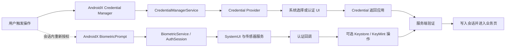
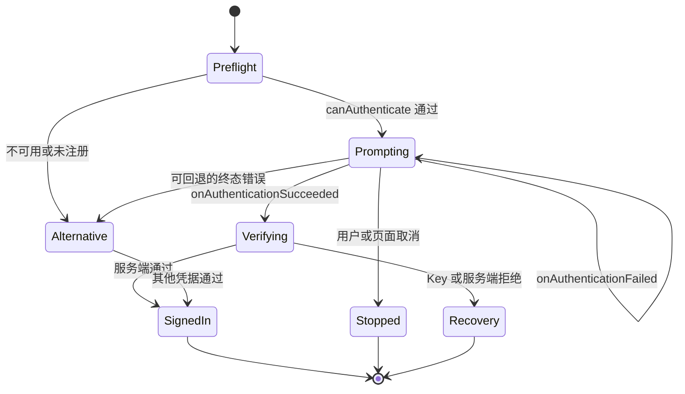

# 8.10 BiometricPrompt 与 Credential Manager 登录链路性能

如果登录页只记录一个 `login_cost_ms`（登录总耗时），出现慢登录时几乎无法判断时间花在哪里。一次凭据登录可能包含 Credential Provider 查询、系统凭据选择器、用户操作、传感器认证、passkey assertion（通行密钥生成的认证断言）、服务端验证和会话初始化；会话内的重新授权则可能只经过 `BiometricPrompt`、Keystore 与业务操作。两个流程都会显示系统认证界面，但调用者、数据边界和可观测信号并不相同。

平台源码基线为 Android 17（API 37）的 `android-17.0.0_r1`，内核基线为 `android17-6.18-2026-06_r6`。应用初次登录优先使用 Credential Manager；已登录会话内确认敏感操作时，可以使用 Credential Manager 或 AndroidX `BiometricPrompt`。这一分工来自当前 [Android 生物认证指南](https://developer.android.com/identity/sign-in/biometric-auth)，也能避免应用自行实现账号选择与认证界面。

## 两条流程，两个责任边界

登录与重新授权可以共享同一种 `flow_id`（一次用户意图的短期关联 ID）规则，但应使用各自的阶段名称。下图中的实线表示 Credential Manager 登录，虚线表示会话内重新授权：



图中两条路径最终都要回到业务验证。Credential Manager 返回的 `Credential` 仍需由应用和服务端验证。`BiometricPrompt` 的成功回调只说明平台接受了本次认证；应用仍要自行推进账号会话，服务端也仍要验证 passkey assertion。

性能拆分建议使用下列口径：

| 阶段 | 应用入口或完成点 | 应用能直接观测什么 | 不应从该阶段推断什么 |
|---|---|---|---|
| 凭据请求 | `getCredential()` 开始到返回或抛出异常 | 请求类型、总等待、结果类型、异常类 | 各 provider 的查询时长、候选总数、系统 UI 出现时间 |
| 生物认证请求 | `authenticate()` 开始到成功或终态错误 | 请求时间、认证类型、错误码、调用方取消原因 | 对话框精确出现时间、实际使用的指纹或人脸传感器 |
| 加密操作 | `Cipher.init`、`Signature.initSign`、`doFinal`、`sign` | 每次调用耗时、异常家族、密钥策略 | 用户停留时间、服务端耗时 |
| 凭据验证 | Credential 返回到服务端响应 | 网络耗时、HTTP 类别、验证或风控结果 | SystemUI 或传感器性能 |
| 会话就绪 | 服务端通过到目标页面首帧 | 本地写入、数据加载、首帧时间 | 前面认证阶段的耗时 |

`CredentialManager.getCredential()` 的等待时间包含用户在系统 UI 上查看和选择凭据的时间。`BiometricPrompt` 从发起请求到收到回调的区间也包含用户操作。没有平台专用观测能力时，应用只能将这些指标命名为“请求到结果”，不能将整段时间标成“provider 查询耗时”或“传感器识别耗时”。

## BiometricPrompt：从应用调用到系统回调

AndroidX `BiometricPrompt` 是应用侧推荐使用的封装。Android 9（API 28）及以上使用系统认证界面；AndroidX 还处理版本兼容和配置变更后的回调接续。平台文档说明，`BiometricPrompt.authenticate()` 会触发准备生物识别硬件、显示系统对话框和开始扫描等后续工作；该方法返回时，界面不一定已经可见。

Android 17 源码把这段工作分到多个进程和对象：

1. Framework 的 [`BiometricPrompt.java`](https://android.googlesource.com/platform/frameworks/base/+/android-17.0.0_r1/core/java/android/hardware/biometrics/BiometricPrompt.java) 在 `authenticateInternal()` 中调用 `IBiometricService.authenticate()`，并把 `CancellationSignal` 连接到返回的请求 ID。
2. `system_server` 中的 [`BiometricService.java`](https://android.googlesource.com/platform/frameworks/base/+/android-17.0.0_r1/services/core/java/com/android/server/biometrics/BiometricService.java) 接收 Binder 请求后，将 `handleAuthenticate()` 投递到服务 Handler（串行处理消息的线程队列）。请求会经过权限、前台状态、认证器可用性和注册状态检查。
3. [`AuthSession.java`](https://android.googlesource.com/platform/frameworks/base/+/android-17.0.0_r1/services/core/java/com/android/server/biometrics/AuthSession.java) 保存一次认证会话的状态，并通过状态栏服务请求 SystemUI 显示认证界面。
4. SystemUI 的 [`AuthController.java`](https://android.googlesource.com/platform/frameworks/base/+/android-17.0.0_r1/packages/SystemUI/src/com/android/systemui/biometrics/AuthController.java) 实现 `showAuthenticationDialog()`，处理界面展示、消失和结果回传。
5. 每个生物传感器有自己的 [`BiometricScheduler.java`](https://android.googlesource.com/platform/frameworks/base/+/android-17.0.0_r1/services/core/java/com/android/server/biometrics/sensors/BiometricScheduler.java) 实例。它维护当前操作和待处理队列，再由具体的 sensor service（传感器系统服务）与厂商 HAL 交互。

这条调用路径跨越应用进程、`system_server`、SystemUI、传感器服务和厂商 HAL。应用主线程 trace 只能覆盖调用方看到的部分，无法细分这些系统组件各自的耗时。

### 应用没有公开的 prompt-onShown 回调

AndroidX 公开的 `AuthenticationCallback` 只提供成功、终态错误和本次样本未识别三类结果，没有“对话框已显示”回调。埋点名称要反映这个限制：

- `biometric_request_start`：调用 `authenticate()` 前；
- `biometric_rejected`：收到 `onAuthenticationFailed()`；
- `biometric_terminal`：收到 `onAuthenticationSucceeded()` 或 `onAuthenticationError()`；terminal 表示本次认证会话已经结束；
- `biometric_client_cancel`：应用调用 `cancelAuthentication()` 前记录自身原因。

`request_to_terminal_ms` 是应用可以稳定记录的口径。只有测试环境通过录屏、UI 自动化、Perfetto 或平台内部日志取得界面实际显示时间后，`prompt_show_ms` 才有依据。线上若直接把调用 `authenticate()` 的时间当作 prompt 出现时间，就会把 Binder 调度、预检查和 SystemUI 调度一并误算为界面展示耗时。

### 配置变更不会要求重启认证

当前 [AndroidX `BiometricPrompt` API 参考](https://developer.android.com/reference/androidx/biometric/BiometricPrompt) 明确说明，旋转等配置变更导致 Activity 或 Fragment 重建时，认证界面默认继续保留。应用应在新的 `onCreate()` 早期重新构造 `BiometricPrompt`，让新实例的 callback 接收正在进行的会话；此时无需再次调用 `authenticate()`，也不应调用 `cancelAuthentication()`。

同一个 Activity 或 Fragment 创建多个 `BiometricPrompt` 时，只有最近创建实例的 callback 会被保存。登录页应只维护一个 prompt 实例，并用业务状态阻止重复点击。应用离开前台后，系统可能因安全策略关闭 prompt；这类终止要与旋转重建分别统计。

以下代码骨架演示怎样维持单次认证会话，并区分非终态与终态回调。`LoginViewModel` 和 `LoginMetrics` 代表业务自己的状态与埋点接口：

```kotlin
class LoginActivity : FragmentActivity() {
    private val loginViewModel: LoginViewModel by viewModels()
    private lateinit var biometricPrompt: BiometricPrompt

    override fun onCreate(savedInstanceState: Bundle?) {
        super.onCreate(savedInstanceState)

        biometricPrompt = BiometricPrompt(
            this,
            ContextCompat.getMainExecutor(this),
            object : BiometricPrompt.AuthenticationCallback() {
                override fun onAuthenticationFailed() {
                    LoginMetrics.rejected(loginViewModel.requireAttemptId())
                }

                override fun onAuthenticationError(
                    errorCode: Int,
                    errString: CharSequence
                ) {
                    loginViewModel.finishWithError(errorCode)
                }

                override fun onAuthenticationSucceeded(
                    result: BiometricPrompt.AuthenticationResult
                ) {
                    loginViewModel.finishWithSuccess(result.authenticationType)
                }
            }
        )
    }

    fun requestReauthentication(promptInfo: BiometricPrompt.PromptInfo) {
        if (!loginViewModel.beginAttempt()) return
        LoginMetrics.requestStarted(loginViewModel.requireAttemptId())
        biometricPrompt.authenticate(promptInfo)
    }
}
```

重建后的 Activity 会注册新的 callback，正在显示的认证会话继续运行。`beginAttempt()` 负责拒绝重复点击；`onAuthenticationFailed()` 只记录一次样本未识别，不结束业务状态。成功或错误回调才会结束本次 attempt。

### 三种回调的状态含义

| 回调 | 会话状态 | 处理方式 |
|---|---|---|
| `onAuthenticationFailed()` | 非终态；本次生物样本未识别 | 记录一次 reject（未识别），继续等待系统允许的下一次尝试 |
| `onAuthenticationSucceeded()` | 终态；当前会话不会再有事件 | 读取 `authenticationType`，进入加密操作或业务验证 |
| `onAuthenticationError()` | 终态；当前会话不会再有事件 | 按 error code 分类，释放一次性业务状态 |

`ERROR_USER_CANCELED` 表示用户主动关闭认证界面；`ERROR_NEGATIVE_BUTTON` 表示用户点击了应用配置的负按钮；`ERROR_CANCELED` 多用于用户切换、设备锁定、传感器不可用或另一个请求造成的系统取消。三者的原因不同，不能合并为一个“用户取消”。`ERROR_LOCKOUT`、`ERROR_LOCKOUT_PERMANENT`、`ERROR_HW_UNAVAILABLE` 和 `ERROR_SECURITY_UPDATE_REQUIRED` 也要分别归类。厂商错误文本可能随设备和版本变化，不适合作为稳定聚合键；线上可以按标准错误码、是否存在 vendor code（厂商扩展码）及设备分组聚合。

### 认证类型不等于传感器形态

`AuthenticationResult.getAuthenticationType()` 能区分 biometric（生物识别）、device credential（设备 PIN、图案或密码）和部分旧版本上的 unknown。它不公开本次使用的是指纹、人脸还是虹膜，也不公开具体是哪一个传感器。普通应用也没有可靠 API 读取本次生物认证的 modality（传感器形态）。

实验室设备清单可以标注 UDFPS（屏下指纹传感器）、侧边指纹、后置指纹、2D face 或 3D face，用来解释设备组差异；线上事件不能声称记录到了本次使用的 sensor 类型。设备同时支持多种 modality 时，按机型猜测尤其容易失真。

调用前应把 `PromptInfo` 使用的认证器组合原样传给 `BiometricManager.canAuthenticate()`。返回值只是调用当时的能力快照，设备状态随后仍可能变化，因此不能省略终态错误处理。`PromptInfo` 一旦允许 `DEVICE_CREDENTIAL`，就不能再设置 `setNegativeButtonText()`；设备凭据入口由系统管理。

## Credential Manager：应用方和 provider 方要分开

Credential Manager 这套体系包含 Jetpack API、平台服务、系统 UI 和 Credential Provider（凭据提供方）。这些角色的发布节奏、权限和可见数据不同：

| 角色 | 典型 API 或组件 | 能掌握的数据 |
|---|---|---|
| 依赖方应用 | `androidx.credentials.CredentialManager` | 自己提交的 option（凭据选项）、返回的 credential 类型、异常与总等待 |
| Jetpack 适配层 | AndroidX Credentials | 按平台版本和 provider 能力选择实现 |
| Android 14+ 平台服务 | `CredentialManagerService` | 启用的 provider、request session（一次应用请求）和 provider session（面向单个 provider 的子会话）及取消信号 |
| Credential Provider | `CredentialProviderService`、entry、`PendingIntent` | 自己查询到的凭据、自己生成的 entry（供系统展示的候选项）、provider 内部耗时 |
| 服务端 | WebAuthn / 密码 / 联合身份验证 | challenge、assertion、账号和风控结果 |

业务 App 通常属于依赖方。它调用 `getCredential()`，却不能直接读取系统选择器中的候选总数，也不知道每个 provider 的查询耗时。凭据提供方可以统计自己返回的候选和内部时延，但它看不到其他 provider，因而不能把自己的数量当作系统候选总数。

Android 17 的 [`CredentialManagerService.java`](https://android.googlesource.com/platform/frameworks/base/+/android-17.0.0_r1/services/credentials/java/com/android/server/credentials/CredentialManagerService.java) 展示了平台侧结构：`executeGetCredential()` 创建请求级 `GetRequestSession`，为各 provider 准备子会话并启动查询；`executePrepareGetCredential()` 创建 `PrepareGetRequestSession`，同样准备 provider session，并返回后续请求所需的 handle（继续这次预取的句柄）。一次 API 调用可以包含多个 provider session，而依赖方应用只能收到最终 response 或 exception。

### `prepareGetCredential()` 的适用边界

AndroidX [`prepareGetCredential()`](https://developer.android.com/reference/kotlin/androidx/credentials/CredentialManager#prepareGetCredential%28androidx.credentials.GetCredentialRequest%29) 需要 Android 14（API 34）及以上。它只预取凭据查询所需的信息，不显示 UI；返回的 `PendingGetCredentialHandle` 必须传给后续的 `getCredential()`，才能完成选择、授权和凭据返回。

预取可以把部分 provider 准备工作移到用户点击前，但要同时满足三个条件：

- 请求内容已经确定，其中的 passkey challenge 仍在服务端规定的有效期内；
- 页面退出、账号切换或请求失效时能够取消或丢弃旧 handle；
- 完成阶段使用 Activity context，使系统 UI 依附于当前页面所在的任务栈。

Kotlin 挂起版 `getCredential()` 会随 coroutine scope（协程作用域）取消。需要让请求跨旋转继续时，可以使用 `viewModelScope` 等生命周期跨越配置变更的作用域；页面已结束或账号已切换时，应主动使请求失效。回调版则通过 `CancellationSignal` 传递取消信号。

预取事件可以记录 `prepare_start`、`prepare_result`、`resume_start` 和 `get_result`，从而比较准备阶段与完成阶段的耗时。即使使用预取，依赖方应用仍然拿不到 prompt 出现时间或各 provider 的独立查询时间。

## Android 15 single tap：provider 侧的集成能力

Android 15（API 35）加入 Credential Manager single tap（单击登录）：在单账号场景下，凭据信息可以直接显示在 Biometric Prompt 中，同时保留“更多选项”入口。一个账号即使同时拥有 passkey 和密码等多种凭据，仍可满足单账号条件；存在多个账号时，系统会回到标准选择流程。到 Android 17（API 37）为止，这个边界没有改变，详见 [single tap 官方指南](https://developer.android.com/identity/sign-in/single-tap-biometric)。

`BiometricPromptData` 是 AndroidX Credentials 1.5.0 增加的 provider 侧 API。凭据提供方把它放入 `CreateEntry` 或 `PublicKeyCredentialEntry` 后，系统才获得内嵌认证所需的信息。普通依赖方应用不构造这个对象，也拿不到 provider 侧的 `biometricPromptResult`。

provider 集成时有四条硬约束：

1. 显式设置 `allowedAuthenticators`。当前 single tap 指南的创建部分与 [`BiometricPromptData` API 参考](https://developer.android.com/reference/androidx/credentials/provider/BiometricPromptData) 对默认值的描述不一致，代码不应依赖默认值。
2. `cryptoObject` 非空时，`allowedAuthenticators` 必须精确设置为 `BIOMETRIC_STRONG`；若传入组合值，会触发 `IllegalArgumentException`。
3. 设备配置要求使用 PIN、图案或密码时，系统采用标准 Credential Manager 流程，provider 收到的 `biometricPromptResult` 为 `null`。
4. provider 必须处理 result 为成功、错误和 `null` 三种情况；`null` 表示这次没有走 provider 内嵌的生物认证结果，不能记成生物认证失败。

因此，依赖方应用只能稳定记录本次返回的 credential 类型、总耗时和 exception 类型。只有平台或 provider 提供了直接信号时，才能上报 `single_tap_used`；仅因总耗时较短就推测使用了 single tap，会让指标失真。

## CryptoObject：相似名字下有两套约束

旧实现常把“允许 device credential 时不能传 `CryptoObject`”写成适用于所有场景的规则。当前 API 要结合密钥类型、Android 版本和调用方角色判断：

| 形态 | 认证器配置 | `CryptoObject` 用法 | 版本或角色边界 |
|---|---|---|---|
| AndroidX `BiometricPrompt`，只确认用户 | `BIOMETRIC_STRONG`、`BIOMETRIC_WEAK`、`DEVICE_CREDENTIAL` 或支持的组合 | 不传 | 调用前用同一组合执行 `canAuthenticate()` |
| AndroidX `BiometricPrompt`，auth-per-use key（每次使用均需授权的密钥） | `BIOMETRIC_STRONG`，Android 11+ 也可按密钥策略允许 `DEVICE_CREDENTIAL` | 初始化操作后，把同一个对象传给 `authenticate()` | Android 10 及以下不支持 crypto 与 device credential 的组合 |
| time-based key（认证后限时可用的密钥） | 密钥设置认证有效期，可允许 strong biometric 或 device credential | prompt 不带对象；认证后在有效期内新建加密操作 | 超出有效期时会遇到 `UserNotAuthenticatedException` |
| provider single tap 的 `BiometricPromptData` | 有对象时必须精确为 `BIOMETRIC_STRONG` | provider 把对象放入 entry metadata | AndroidX Credentials provider API，不能套用普通 App 的组合规则 |

当前 [Android 生物认证指南的 auth-per-use 章节](https://developer.android.com/identity/sign-in/biometric-auth#auth-per-use-keys) 给出的密钥策略允许 `AUTH_BIOMETRIC_STRONG | AUTH_DEVICE_CREDENTIAL`；AndroidX `BiometricPrompt.authenticate(info, crypto)` 参考文档还说明了 Android 11 之前的兼容限制。指南中“不带 `CryptoObject`”的说明位于 time-based key 流程，不能套用到 Android 11+ 的 auth-per-use key。

密钥授权条件还要与 prompt 策略一致。若密钥只允许 strong biometric，即使 prompt 同时提供 device credential，PIN 也不能授权使用这把密钥。密钥允许两种认证器时，调用方仍需处理密钥失效、认证 token 不匹配和安全级别差异。完整的初始化顺序、KeyMint operation 与异常分类见 [§8.9 Keystore/KeyMint 调用链延迟](09-keystore-keymint-latency.md)。

性能埋点至少拆成这些时间段：

| 字段 | 起止点 | 解释 |
|---|---|---|
| `crypto_init_ms` | `Cipher.init` / `Signature.initSign` 调用 | 可能已经进入 Keystore、`keystore2` 与 KeyMint |
| `auth_request_to_terminal_ms` | `authenticate()` 到成功或终态错误 | 包含系统调度、UI、用户操作与 sensor 工作 |
| `crypto_finish_ms` | `doFinal` / `sign` 调用 | 反映授权后的 KeyMint 操作，不含网络 |
| `credential_request_ms` | `getCredential()` 到 response / exception | 包含 provider 查询、系统 UI 与用户操作 |
| `server_verify_ms` | 发出验证请求到服务端响应 | 反映网络、后端验证与风控 |

`onAuthenticationSucceeded()` 的时间和 `sign()` 返回时间要分别记录。若把两者合称为“指纹耗时”，StrongBox、TEE 或 KeyMint 队列延迟会被错误归因给传感器。

## 取消、失败与回退

是否切换到其他登录方式，应由终态决定。`onAuthenticationFailed()` 只表示本次样本未识别，不能每收到一次就再弹一个 prompt。一个稳定的状态流如下：



这张状态图将样本未识别、终态错误和业务验证失败放在不同状态，便于避免重复弹窗和错误归因。

| 信号 | 含义 | 合适的动作 |
|---|---|---|
| `onAuthenticationFailed()` | 当前样本未识别，会话仍在运行 | 留在系统 prompt，按区间记录 reject 次数 |
| `ERROR_USER_CANCELED` / negative button | 用户选择离开当前认证方式 | 回到当前页面，展示密码或其他凭据入口 |
| `ERROR_LOCKOUT` | 临时锁定 | 告知等待时间，允许 device credential 或其他登录方式 |
| `ERROR_LOCKOUT_PERMANENT` | 需要设备凭据解除 | 引导设备凭据，不自动循环生物认证 |
| `GetCredentialCancellationException` | 用户退出 Credential Manager | 保持登录页可操作，不转成“无凭据” |
| `NoCredentialException` | 请求范围内没有可用凭据 | 提供注册、密码或联合身份入口 |
| key invalid / auth required | 密钥状态或授权不满足 | 进入密钥恢复流程，参见 §20.16 |
| assertion 或风控拒绝 | 服务端不接受本次凭据 | 进入账号安全流程，不归到平台认证性能 |

应用主动取消时，要在调用取消 API 前记录 `cancel_source`，例如页面关闭、账号切换、请求过期或新请求替换旧请求。系统返回的 error code 只能描述平台终态，无法还原应用为何发起取消。

## 一套不越权的线上事件

建议为一次用户意图生成 `flow_id`，每次重试再生成新的 `attempt_id`（单次尝试 ID）。事件只记录应用能够直接观测的时间点：

| 事件 | 时间点 | 推荐字段 |
|---|---|---|
| `credential_request_start` | 调用 Credential Manager 前 | `flow_id`、`attempt_id`、`api_level`、`option_types`、`prepared` |
| `credential_request_end` | response 或 exception | `credential_type`、`exception_family`、`duration_ms` |
| `biometric_request_start` | 调用 `authenticate()` 前 | `authenticator_policy`、`crypto_mode`、`can_authenticate_result` |
| `biometric_rejected` | `onAuthenticationFailed()` | `reject_count_bucket` |
| `biometric_terminal` | success 或 error | `result`、`authentication_type`、`error_code`、`duration_ms` |
| `crypto_operation` | init 或 finish 返回 | `operation_phase`、`security_level`、`duration_ms`、`error_family` |
| `server_verify_end` | 服务端响应 | `duration_ms`、`network_class`、`http_family`、`decision_family` |
| `login_ready` | 目标页面首帧 | `final_method`、`fallback_reason`、`total_ms` |

依赖方应用不应上报 `candidate_count`、`provider_query_ms`、`prompt_shown_ms` 或 biometric modality，除非它获得了相应的直接信号。设备型号可以在满足合规要求的前提下映射为受控设备分组，避免自由文本产生大量不同取值，也就是高基数字段。

认证数据的采集边界更严格。不要上传生物样本、PIN、图案、密码、passkey assertion 原文、challenge、credential ID、AAGUID（认证器型号标识）原值、RP ID（依赖方域名标识）或明文账号。关联排查使用短期 `flow_id`、凭据类型、错误家族和账号匿名分组。任何能够长期识别账号或凭据的摘要都需要安全与隐私评审；哈希处理后的值仍可能被关联，不能自动视为匿名数据。

## OEM 差异如何验证

SystemUI 和 Framework API 为应用提供一致接口，但 sensor HAL、屏幕协作、锁定行为和错误分布仍会因设备而异。UDFPS 需要屏幕局部高亮、触控和指纹传感器协作；被动人脸认证还受光线、摄像头启动和是否要求用户确认等因素影响。`setConfirmationRequired(false)` 只是应用向系统表达“不要求额外确认”的偏好，系统可以根据设备设置忽略它。

实验室测试至少覆盖：

- Android 版本、厂商系统版本和升级路径；
- strong / weak biometric（强/弱生物识别）与 device credential 策略；
- 冷启动后的首次请求、会话内再次授权、刚解锁设备、熄屏恢复；
- 旋转重建、切到后台、锁屏、用户切换和重复点击；
- 正常识别、连续 reject、临时锁定、永久锁定、硬件不可用；
- 单账号、多账号、多 provider、无可用凭据和 passkey challenge 过期。

实验室可以根据设备硬件清单解释 UDFPS 或人脸认证的差异；线上则按设备组和公开 error code 统计 P50、P90、P99。若固定规定“超过 800 ms 就是 sensor 异常”，用户操作时间和 SystemUI 调度也会被算入传感器问题。观察耗时分位数时，还要同时看切换到其他登录方式后的完成率。

## Android 17 源码与内核锚点

源码排查按责任范围进入：

| 层级 | Android 17 固定入口 | 能回答的问题 |
|---|---|---|
| Framework API | [`BiometricPrompt.java`](https://android.googlesource.com/platform/frameworks/base/+/android-17.0.0_r1/core/java/android/hardware/biometrics/BiometricPrompt.java) | 参数校验、Binder 请求、取消和 callback 分发 |
| 生物认证仲裁 | [`BiometricService.java`](https://android.googlesource.com/platform/frameworks/base/+/android-17.0.0_r1/services/core/java/com/android/server/biometrics/BiometricService.java) | 预检查、请求 ID、Handler 调度和会话生命周期 |
| 认证会话 | [`AuthSession.java`](https://android.googlesource.com/platform/frameworks/base/+/android-17.0.0_r1/services/core/java/com/android/server/biometrics/AuthSession.java) | SystemUI 显示请求、sensor 状态、成功与错误转换 |
| Sensor 调度 | [`BiometricScheduler.java`](https://android.googlesource.com/platform/frameworks/base/+/android-17.0.0_r1/services/core/java/com/android/server/biometrics/sensors/BiometricScheduler.java) | 每个 sensor 当前执行的操作与待处理队列 |
| SystemUI | [`AuthController.java`](https://android.googlesource.com/platform/frameworks/base/+/android-17.0.0_r1/packages/SystemUI/src/com/android/systemui/biometrics/AuthController.java) | 认证对话框显示、关闭和前台状态 |
| Credential 平台服务 | [`CredentialManagerService.java`](https://android.googlesource.com/platform/frameworks/base/+/android-17.0.0_r1/services/credentials/java/com/android/server/credentials/CredentialManagerService.java) | get / prepare session、provider session 与取消传递 |
| GKI Binder | [`drivers/android/binder.c`](https://android.googlesource.com/kernel/common/+/android17-6.18-2026-06_r6/drivers/android/binder.c) | `BC_TRANSACTION` 到 `binder_transaction()` 的跨进程传输 |

内核锚点只覆盖 Binder IPC。生物传感器驱动和厂商实现通常位于设备专用或 vendor 代码中，认证策略与会话状态则位于 Framework、系统服务和 HAL。common kernel 的 `binder.c` 只能帮助验证跨进程等待和 Binder 调度是否异常，不能用来推断指纹采集耗时。

普通线上应用进程没有权限读取完整系统 trace。实验室可以结合 Perfetto、SystemUI 日志、`system_server` 轨迹和厂商 HAL 日志定位；线上能够收集哪些证据、需要什么权限，见 [§26.10 版本化诊断](../../part5-app/ch26-observability/10-versioned-diagnostics.md)。

## 版本边界

| 版本 | 相关变化或限制 |
|---|---|
| Android 9 / API 28 | 平台 `BiometricPrompt` 引入；AndroidX 在该版本使用系统认证界面 |
| Android 10 / API 29 及以下 | `DEVICE_CREDENTIAL` 与 `BIOMETRIC_STRONG \| DEVICE_CREDENTIAL` 的部分组合不受支持；密码操作与 device credential 的组合也受限 |
| Android 11 / API 30 | AndroidX crypto-based authentication（绑定密码操作的认证）可按密钥策略使用 device credential；生物认证要参与 Keystore 操作，仍需 strong biometric |
| Android 14 / API 34 | 平台 Credential Manager 服务与 `prepareGetCredential()` handle（预取句柄）流程可用 |
| Android 15 / API 35 | provider 可接入 passkey single tap，登录限定为单账号场景 |
| Android 17 / API 37 | 平台源码基线为 `android-17.0.0_r1`，上述职责边界继续适用 |

Jetpack 库版本和平台 API level 要分别记录。`BiometricPromptData` 来自 AndroidX Credentials 1.5.0；设备即使运行 Android 15，provider 也不一定已经采用该 API。

## 与稳定性和观测章节的分工

[§20.14 Keystore 配额与登录稳定性](../../part5-app/ch20-stability/14-keystore-quota-login-stability.md) 负责密钥生命周期、配额、失效与恢复。这里仅将这些结果视为登录阶段的一类终态。

[§26.10 版本化诊断](../../part5-app/ch26-observability/10-versioned-diagnostics.md) 负责系统 trace、`ApplicationExitInfo`、`ProfilingManager` 与诊断权限。[§26.12 Android Vitals 与 Play Console](../../part5-app/ch26-observability/12-android-vitals-play-console-quality.md) 负责 ANR、Crash、LMK、启动和功耗等外部质量口径。Vitals 没有“生物识别登录慢”专用指标，内部 `flow_id`、版本与页面信息要能和发布批次对应。

## 小结

Credential Manager 登录和 `BiometricPrompt` 重新授权是两条不同的调用路径。依赖方应用可以稳定观测请求、回调、异常、加密操作、服务端响应和页面就绪；prompt 出现时间、provider 查询时间、候选总数和具体 biometric modality 则需要额外权限或 provider 侧信号。

Android 17 源码把生物认证请求分配给 `BiometricService`、`AuthSession`、SystemUI 和每个 sensor 的 `BiometricScheduler`；Credential Manager 则用 request session 协调多个 provider。性能指标要沿这些责任边界命名。遇到 device credential 与 `CryptoObject` 时，还要区分普通 AndroidX prompt、time-based key、auth-per-use key 和 provider `BiometricPromptData`，避免把某一种 API 的限制套用到所有登录流程。
