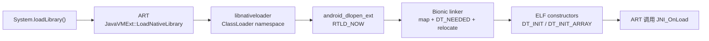

# 8.11 Native 库加载与动态链接性能

`System.loadLibrary()` 看起来只有一行，调用期间却会跨过 ART、`libnativeloader`、Bionic linker 和内核内存管理。ELF 映射、依赖搜索、符号重定位、ELF 构造器与 `JNI_OnLoad` 都可能占用调用线程。若它发生在 `ContentProvider`、`Application.onCreate()` 或首个 Activity 的主线程上，这段耗时会直接进入冷启动关键路径。

平台源码锚点为 Android 17 / API 37 的 `android-17.0.0_r1`，kernel 侧固定到 `android17-6.18-2026-06_r6`。历史版本用于说明 Linker Namespace 和 16KB page size 的演进；Android 17 的主要结论均以固定 tag 复核。

## 从 `System.loadLibrary()` 到 `JNI_OnLoad`

先把一次 Java/Kotlin 加载拆成可测量的阶段。下面的图对应 Android 17 源码中的主调用关系。



`libnativeloader` 按调用方 ClassLoader 找到对应的 linker namespace，再以 `RTLD_NOW` 打开库。Bionic 负责 ELF 和依赖库的装载、重定位及构造器。`dlopen` 成功返回后，ART 才查找 `JNI_OnLoad` 并调用它。`JNI_OnLoad` 不属于 linker 的工作，二者需要分别归因和优化。

### 四段成本要分别归因

| 阶段 | 典型工作 | 常见证据 |
|---|---|---|
| ART / NativeLoader | ClassLoader、namespace、重复加载协调 | Java/native 调用栈、ART 日志 |
| Bionic 映射与链接 | ELF 校验、`PT_LOAD`、`DT_NEEDED`、符号查找、重定位、RELRO | `dlopen:` trace、采样栈、`mmap`/page fault |
| ELF 构造器 | `DT_INIT`、`DT_INIT_ARRAY` 中的进程级初始化 | native marker、采样栈、库源码 |
| `JNI_OnLoad` | 注册 native 方法及 SDK 自定义初始化 | `JNI_OnLoad` marker、采样栈、SDK 源码 |

外层 `System.loadLibrary()` 耗时包含整张表。只看到一个 40 ms 的调用，仍无法判断是重定位、缺页、构造器，还是 SDK 在 `JNI_OnLoad` 里读配置和建线程。

## Native 库加载在启动链路里的位置

常见触发点可以按“是否要求首帧前完成”分类：

- **进程自动初始化**：`ContentProvider`、App Startup initializer、`Application` 或静态初始化块加载崩溃、监控、音视频等库。
- **框架运行时创建**：React Native、Flutter、Unity、Unreal 等在创建 VM、engine 或 bridge 时加载多组库。
- **首个 native 调用前**：业务入口延迟到第一次使用 JNI 功能时加载。
- **动态功能入口**：相机、编辑器、端侧推理或通话模块在用户进入页面后加载。

类的静态初始化也会隐藏加载点。某个 Kotlin `object` 或 Java `static {}` 只要在冷启动被首次访问，就可能把 native 加载带进主线程。排查时应从 APK 内所有 `System.loadLibrary` / `System.load` 调用出发，再补上三方 SDK 自动初始化和引擎入口。

### 给每个可控加载点加名称

下面的 Kotlin 辅助方法为加载调用增加应用侧 trace section。

```kotlin
private fun loadNativeLibrary(name: String) {
    Trace.beginSection("NativeLoad:$name")
    try {
        System.loadLibrary(name)
    } finally {
        Trace.endSection()
    }
}
```

这段 marker 能回答“哪个调用阻塞了当前线程、总共多久”。它不能自动拆出构造器和 `JNI_OnLoad`，所以自有库还应在这两个位置增加 native trace marker。库名不要含用户数据，section 名也应保持短且稳定。

加载点移出冷启动后，还要测首次功能入口。把 30 ms 从启动转移到用户点击后，只是换了发生位置；更合适的做法通常是在有明确空闲窗口时预热，并保留超时与失败处理。

## Android 17 Bionic linker 的加载流程

Android 17 的 `do_dlopen()` 会建立名为 `dlopen: <name>` 的 scoped trace，然后进入查找和链接流程。`find_libraries()` 处理目标库与 `DT_NEEDED` 依赖；`ElfReader` 读取 ELF header/program header 并保留地址空间；`LoadSegments()` 映射 `PT_LOAD`；linker 完成 prelink、符号查找和 relocation；成功后调用 `soinfo::call_constructors()`。

可以把性能成本理解为五组：

1. **发现与打开文件**：按 namespace 的搜索路径、soname 和已加载库集合寻找目标。
2. **地址空间与 segment**：为 ELF 保留虚拟地址，映射代码、只读数据、可写数据与 BSS。
3. **依赖图**：解析 `DT_NEEDED`，加载尚未存在的依赖。
4. **重定位**：`RTLD_NOW` 要在返回前完成所需符号解析和 relocation。
5. **初始化函数**：按依赖顺序调用 ELF constructors。

共享库从 APK 中直接映射或从安装目录映射时，`mmap()` 本身可能很快，后续首次取指和读数据才触发缺页。仅统计系统调用耗时会漏掉 file-backed page fault；应把主线程调度、major/minor fault、I/O 和采样栈放在同一时间窗内。

### 可观测边界

| 观察手段 | 能确认 | 仍需补充 |
|---|---|---|
| 应用 trace marker | 每个调用点的墙钟耗时与线程 | linker 内部分段 |
| Bionic `dlopen:` slice | 目标库和 Bionic 调用区间 | constructor 内部业务语义 |
| Perfetto / simpleperf callstack | CPU 时间集中在哪些符号 | 采样间隔内没有命中的短事件 |
| page fault、block I/O、调度轨迹 | 等待是否来自缺页、存储或抢占 | 哪个业务模块触发 |
| `/proc/<pid>/maps` | 已映射路径和地址范围 | 过去的加载耗时 |
| `/proc/<pid>/smaps` | PSS、file-backed/anonymous 页等驻留结果 | relocation 和构造器耗时 |
| `logcat` / tombstone | alignment、namespace、缺符号等失败原因 | 正常路径的性能分布 |

测量 release 构建时要保留 native 符号文件和 Build ID。设备上的 `.so` 可以 strip，分析端依靠匹配的未剥离符号还原调用栈。没有匹配符号时，`__dl__` 附近的大块 CPU 时间很难继续分责。

## Linker Namespace：ClassLoader 的 native 可见范围

Android 7 / API 24 引入应用侧 native library 限制。Android Runtime 为 ClassLoader 关联 linker namespace；`libnativeloader` 在该 namespace 内调用 `android_dlopen_ext()`。这样既限制应用访问平台私有库，也阻止一个 APK 随意加载其他 APK 的 JNI 库。

Android 17 `android_namespace_t::is_accessible()` 对 isolated namespace 的路径检查包括：

- `allowed_libs_` 是否允许该 basename；
- 文件是否位于 `ld_library_paths_`；
- 文件是否位于 `default_library_paths_`；
- 文件是否位于 `permitted_paths_`。

namespace 之间还可通过显式 link 暴露一组 shared libraries。某台设备碰巧能加载某个 vendor 或 system 私有库，不构成应用 API；OTA、APEX 更新或另一家 ROM 都可能改变结果。

### 先区分“拒绝加载”和“加载很慢”

典型 namespace 错误会包含 `is not accessible for the namespace`。这属于可见性失败，处理方向是：

- 改用公开 NDK/SDK API；
- 更新依赖并移除平台私有库；
- 检查库是否被错误放入另一个 split、ClassLoader 或安装路径；
- 对系统 App / APEX 按对应 linker config 修正镜像配置。

反复修改绝对路径或扫描 `/system/lib64` 无法建立稳定兼容性。`dlopen` 能找到文件，也可能因 namespace、ABI、缺少 `DT_NEEDED` 或未定义符号而失败，错误文本要完整保留。

## 16KB page size：检查 ELF、APK 和运行时假设

16KB 支持至少包含三项，缺一项都可能在安装或加载时失败：

| 层次 | 检查对象 | 合格条件 |
|---|---|---|
| ELF | 每个 ABI 下每个 `.so` 的 `PT_LOAD` | segment alignment 至少 16KB |
| APK/AAB | 未压缩 `.so` 在 zip 中的起始位置 | 16KB zip alignment |
| 代码 | `mmap`、`mprotect`、allocator、Hook 等 | 不写死 4096，按运行时 page size 对齐 |

Google Play 的要求已从 2025 年 11 月 1 日起生效：面向 Android 15 / API 35 及以上设备的新 App 和更新，若提交到 Google Play，需要支持 16KB page size。这里的 target 描述来自 Play 规则，不能简化成“所有 targetSdk 35 应用在任何分发渠道都由系统拒绝安装”。

### 构建工具边界

官方当前建议使用 AGP 8.5.1 及以上、NDK r28 及以上，并确保所有预编译依赖也兼容 16KB：

- NDK r28 及以上默认输出 16KB-aligned ELF。
- NDK r27 及以下需要显式传入 `max-page-size` 和 `common-page-size`。
- 未压缩 native library 需要 AGP 8.5.1 及以上提供正确的 16KB zip alignment。
- AGP 8.3—8.5 的本地 APK 可能看起来正常，AAB 经旧版 bundletool 生成的 Play APK 仍可能缺少 16KB zip alignment。

旧 NDK 的 CMake target 可以显式添加以下链接参数。

```cmake
target_link_options(your_native_target PRIVATE
    "-Wl,-z,max-page-size=16384"
    "-Wl,-z,common-page-size=16384"
)
```

参数只影响当前重新链接的 target。AAR、Prefab、游戏插件或其他预编译 `.so` 不会自动改变，仍要逐个更新或替换。

### 检查最终交付物

下面这组命令分别检查设备 page size、ELF segment、APK zip alignment 和 AAB 对齐配置。

```bash
adb shell getconf PAGE_SIZE

llvm-objdump -p lib/arm64-v8a/libexample.so | grep -A4 LOAD

zipalign -c -P 16 -v 4 app-release.apk

bundletool dump config --bundle=app-release.aab | grep alignment
```

16KB 设备的第一条输出应为 `16384`；ELF 的 `LOAD` alignment 应达到 `2**14`；AAB 配置应显示 `PAGE_ALIGNMENT_16K`。这些静态检查通过后，还要在 16KB 设备上覆盖启动、动态功能、native plugin 和低内存场景。

### Android 17 的 backcompat 与 fail-fast

当 16KB 内核发现 4KB-aligned ELF 或 4KB zip-aligned 的未压缩 ELF 时，Package Manager 可以为应用启用 16KB backcompat。Android 17 Bionic 的 `CompatMapSegment()` 说明了代价来源：4KB ELF 无法按 16KB page 直接 file-map，linker 会把 segment 读入 anonymous RW mapping，再设置对应保护。

兼容模式可能让旧库运行，但它不能替代 16KB 构建与发布验证。anonymous mapping 会改变共享页和驻留内存形态，额外读取也可能影响加载时间；影响幅度要用目标设备测量。

Android 17 还提供 `fatal` 模式，让不兼容 ELF 立即终止，适合实验室设备上的发布前验证。下面的命令会改变整台测试设备的临时 linker/Package Manager 行为。

```bash
adb shell setprop bionic.linker.16kb.app_compat.enabled fatal
adb shell setprop pm.16kb.app_compat.disabled true
```

只在隔离的 16KB 测试设备上使用，并在测试后重启设备恢复临时属性。Manifest 的 `android:pageSizeCompat` 可以为单个应用启用或禁用 backcompat，也会抑制启动警告；它依然不等于 ELF 和 zip 已合规。

## 三方 SDK、React Native 与游戏引擎

三方依赖应按最终产物审计。Gradle 坐标不能说明某个 ABI 最终打进了哪一版 `.so`，CMake 顶层参数也不能证明 Prefab 或预编译插件已经用相同参数重建。

建议为每个交付库保存以下清单：

| 字段 | 用途 |
|---|---|
| APK/AAB 内路径与 ABI | 找到所有副本和 split |
| 来源组件、版本、许可证 | 追到负责团队或供应商 |
| Build ID、NDK/引擎版本 | 匹配符号和构建工具 |
| `DT_NEEDED` 与导出符号 | 评估依赖和重定位范围 |
| ELF / zip alignment | 验证 16KB |
| 首次加载阶段与调用线程 | 判断启动或交互影响 |
| 4KB/16KB、MTE 测试结果 | 固化兼容性证据 |

React Native、Flutter、Unity、Unreal 和 Cocos 都可能同时包含引擎库、C++ runtime、脚本 VM 与应用插件。采用引擎官方已支持 16KB 的版本只是起点，最终 APK/AAB 仍要扫描所有 ABI。旧插件可能覆盖引擎给出的正确 linker flags。

遇到 `WriteProtected mprotect ... Invalid argument` 等已知签名时，要核对准确的 NDK、静态/动态 C++ runtime 和产生该库的构建任务。一个特定 NDK issue 不能推导为整代工具链的所有库都会失败。

## Hook 与监控 SDK 的风险边界

PLT/GOT hook、inline hook 和已加载 ELF 扫描可能绕开“重新打开目标私有库”这一步，却没有获得平台私有 ABI 的稳定性。它们还要同时处理：

- 运行时 page size 与 `mprotect()` 覆盖范围；
- W^X、BTI/PAC、指令缓存和 trampoline；
- 目标库 Build ID、指令变化及 APEX/OTA 更新；
- 多线程修改期间的原子性与重入；
- MTE、signal handler 和现有崩溃处理器的交互。

写死 `0x1000` 的页对齐在 16KB 设备上可能扩大或错置保护区间。内存页操作应使用 `getpagesize()` 或 `sysconf(_SC_PAGESIZE)`，并对长度、起始地址和溢出做检查。

### MTE

MTE 的分配标签粒度是 16 bytes，不等于系统 page size。自定义 allocator 若要让自己的映射参与 MTE，需要按官方要求使用 `PROT_MTE`，并维护 allocation tag。page alignment、MTE granule 和对象 alignment 是三组不同约束。

监控 SDK 上线前应覆盖 4KB/16KB、MTE 同步/异步模式、release 优化、主流 ABI 与厂商版本。某个 hook 在当前测试机成功，只能证明该二进制组合通过，不能扩展成 Android 平台保证。

## 优化策略

### 1. 移出不必要的首帧工作

先列出首帧前加载的库及其调用者。登录后才使用的音视频、编辑、通话、地图或推理能力，通常可以移到明确的预热窗口或功能入口。崩溃采集等要求极早生效的库则要保留，并缩短自身初始化。

### 2. 让 `JNI_OnLoad` 保持小而确定

`JNI_OnLoad` 适合校验 VM、注册 native 方法和建立少量只读状态。文件 I/O、网络、设备枚举、大对象构造和大量线程创建应转移到可观测、可取消的显式初始化 API。这样既缩短 `System.loadLibrary()`，也能给业务控制执行线程和时机。

### 3. 减少没有价值的依赖和导出

检查 `DT_NEEDED`、动态符号表和 relocation 数量。移除未使用依赖、收窄默认 symbol visibility、使用 version script，可以降低搜索范围和 accidental ABI。合并 `.so` 有时能减少加载次数，也可能迫使更多代码提前映射；要用真实启动 trace 决定。

### 4. 避免盲目并发加载

依赖顺序、ELF constructors 和 SDK 全局状态常带有隐含约束。把多个 `System.loadLibrary()` 扔进线程池，不保证缩短关键路径，还可能增加锁等待和难复现的初始化竞态。可并行的是已经证明互不依赖、又不阻塞首帧的预热任务。

### 5. 同时看 CPU、I/O 和驻留内存

优化前后保留：

- 冷启动 TTID / TTFD；
- 每个库的加载墙钟时间与调用线程；
- `dlopen`、constructor、`JNI_OnLoad` 的 CPU 栈；
- major/minor fault 与 block I/O；
- 进程 PSS，以及目标库 file-backed/anonymous 页；
- 延迟加载后首次功能入口的帧时间。

只看 APK 体积无法预测加载时间。较大的 file-backed 库可能只按需 fault；较小的库也可能包含大量 relocation 和重构造器。

## CI：从源码参数检查转向产物检查

CI 应扫描每个 release APK/AAB，而非只检查 App 模块的 CMake 配置。下面的 shell 骨架假设 APK 已解包到临时目录，并逐个报告 arm64 库的 `LOAD` alignment。

```bash
set -eu

for so_file in unpacked-apk/lib/arm64-v8a/*.so; do
  echo "$so_file"
  llvm-objdump -p "$so_file" | grep -A4 LOAD
done

zipalign -c -P 16 -v 4 app-release.apk
bundletool dump config --bundle=app-release.aab | grep PAGE_ALIGNMENT_16K
```

生产脚本还要遍历所有交付 ABI、处理无匹配文件、返回明确错误码，并保存库来源和 Build ID。静态检查之后，用 16KB 设备运行 smoke test；Android 17 的 `fatal` 模式可把 backcompat 掩盖的问题转成明确失败。

## Android 7—17 的版本边界

| 版本 | 相关变化 |
|---|---|
| Android 7 / API 24 | 应用 native library 可见性受 Linker Namespace 和 public native library 约束 |
| Android 15 / API 35 | 平台开始支持 16KB page size 设备；应用需同时修正构建、打包和运行时假设 |
| Android 17 / API 37 | 源码锚点；16KB backcompat 增加 `fatal` fail-fast 测试方式 |

Linker Namespace 的约束在后续版本持续演进，16KB backcompat 也属于迁移辅助。应用侧稳定边界仍是公开 NDK API、合规 ELF/zip alignment 和不依赖固定 page size 的代码。

## Android 17 与 kernel 源码入口

Android 17 平台侧可固定查看：

- ART [`java_vm_ext.cc`](https://android.googlesource.com/platform/art/+/android-17.0.0_r1/runtime/jni/java_vm_ext.cc)：`LoadNativeLibrary()`、`OpenNativeLibrary()` 返回后的 `JNI_OnLoad` 调用。
- [`libnativeloader/native_loader.cpp`](https://android.googlesource.com/platform/art/+/android-17.0.0_r1/libnativeloader/native_loader.cpp)：ClassLoader namespace 与 `android_dlopen_ext(..., RTLD_NOW, ...)`。
- Bionic [`linker.cpp`](https://android.googlesource.com/platform/bionic/+/android-17.0.0_r1/linker/linker.cpp)：`do_dlopen()`、`find_libraries()`、link 和 constructor 主线。
- Bionic [`linker_phdr.cpp`](https://android.googlesource.com/platform/bionic/+/android-17.0.0_r1/linker/linker_phdr.cpp)：地址空间、`PT_LOAD` 和 segment 映射。
- Bionic [`linker_phdr_16kib_compat.cpp`](https://android.googlesource.com/platform/bionic/+/android-17.0.0_r1/linker/linker_phdr_16kib_compat.cpp)：4KB ELF 在 16KB backcompat 下的 segment 读取与权限设置。
- Bionic [`linker_namespaces.cpp`](https://android.googlesource.com/platform/bionic/+/android-17.0.0_r1/linker/linker_namespaces.cpp)：isolated namespace 的可访问性判断。

动态共享库由用户空间 linker 发起 `mmap()`，后续映射、缺页和页表建立进入 kernel。`android17-6.18-2026-06_r6` 可固定查看 [`mm/mmap.c`](https://android.googlesource.com/kernel/common/+/refs/tags/android17-6.18-2026-06_r6/mm/mmap.c) 和 [`mm/memory.c`](https://android.googlesource.com/kernel/common/+/refs/tags/android17-6.18-2026-06_r6/mm/memory.c)。进程初始 ELF 由 [`fs/binfmt_elf.c`](https://android.googlesource.com/kernel/common/+/refs/tags/android17-6.18-2026-06_r6/fs/binfmt_elf.c) 处理；`dlopen` 的 DSO 装载主体仍在 Bionic，不能把两条路径混写。

## 与其他章节的关系

- [§1.15 JNI/NDK 性能](../../part1-fundamentals/ch01-architecture/15-jni-ndk-performance.md)：跨语言调用、引用、拷贝和线程附着。
- [§4.6 16 KB Page Size](../../part1-fundamentals/ch04-memory/06-16kb-page-size.md)：页表、TLB、ELF 和系统级影响。
- [§8.2 App 启动全流程](02-app-launch.md)：native load 在进程启动和首帧中的位置。
- [§8.3 启动优化策略](03-launch-optimization.md)：TTID/TTFD、初始化编排和回归。
- [§14.13 Hook 基础设施](../../part3-tools/ch14-other-tools/13-hook-infrastructure.md)：PLT、inline hook 与平台保护边界。
- [§13.3 Perfetto View](../../part3-tools/ch13-perfetto/03-perfetto-view.md)：trace 与调用栈分析。

## 参考资料

- [16KB page size 支持与验证](https://developer.android.com/guide/practices/page-sizes)
- [Android NDK libdl reference](https://developer.android.com/ndk/reference/group/libdl)
- [Android NDK MTE guide](https://developer.android.com/ndk/guides/arm-mte)
- [NDK ABI 稳定性说明](https://developer.android.com/ndk/guides/stable_apis)
- [Native libraries 平台访问限制](https://developer.android.com/about/versions/nougat/android-7.0-changes#ndk)

## 小结

一次 `System.loadLibrary()` 至少包含 NativeLoader/namespace、Bionic 映射与重定位、ELF constructors、ART `JNI_OnLoad` 四段。只有把 marker 和源码边界对齐，才能判断优化目标位于 linker、存储、库构造器还是 SDK 初始化。

16KB 支持要检查每个 `.so` 的 ELF alignment、APK/AAB 的 zip alignment，以及代码中的 page size 假设。Android 17 backcompat 能帮助旧库迁移，`fatal` 模式适合在测试设备暴露不兼容产物；发布基线仍应是 16KB-aligned 交付物和 4KB/16KB 实机回归。
