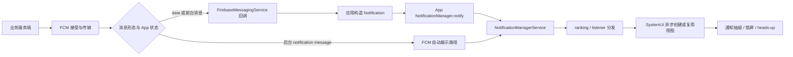

# 8.11 推送通知管线性能：FCM 投递延迟与 NotificationManagerService 渲染

“推送慢”至少可能指五件事：服务端请求晚、FCM 传输晚、设备回调晚、应用发布通知晚、SystemUI 显示晚。它们跨越云端、Google Play services、应用进程、`system_server` 与 SystemUI，没有一个公开 API 能给出全部阶段的同一时钟。

平台源码基线为 Android 17（API 37）的 `android-17.0.0_r1`，内核基线为 `android17-6.18-2026-06_r6`。FCM 的设备端实现含有闭源组件，相关结论只采用 Firebase 公开契约；Android 平台部分使用固定标签下的 NMS、`RemoteViews` 和 SystemUI 源码验证。

## 先定义“到达”和“显示”

服务端拿到 FCM 成功响应，只说明消息被 FCM 接受。设备 SDK 收到消息，也不等于通知已经进入 NMS。`NotificationManager.notify()` 返回时，SystemUI 仍可能尚未创建通知视图。用户看到通知还会受权限、channel、锁屏、勿扰模式和 SystemUI 状态影响。



图中的“FCM 自动展示路径”是公开行为边界，不代表所有设备都跳过应用进程。高优先级 notification message 还可能由 Google Play services 代理展示。不要用进程是否存在去反推消息类型。

工程指标应使用不同名称：

| 时间点 | 含义 | 是否等于用户可见 |
|---|---|---|
| `fcm_accepted_at` | 服务端请求被 FCM 接受 | 否 |
| `sdk_callback_at` | 应用进入 `onMessageReceived()` | 否 |
| `notify_start/end` | 应用进入和离开同步 `notify()` 调用 | 否 |
| `nms_posted` | 平台已接受并分发 notification record | 否；普通应用没有直接回调 |
| `systemui_applied` | SystemUI 已 apply / reapply 通知内容 | 接近显示准备完成，仍受界面状态影响 |
| `impression` | Firebase 或产品定义的展示观测 | 取决于消息形态和采集能力 |

## FCM 消息形态决定应用是否参与

当前 [FCM Android 接收文档](https://firebase.google.com/docs/cloud-messaging/android/receive-messages) 给出的行为如下：

| payload 与 App 状态 | 到达时的公开行为 | 应用能控制什么 |
|---|---|---|
| notification message，前台 | 调用 `onMessageReceived()` | 解析消息并决定是否发布通知 |
| notification message，后台 | FCM SDK 处理展示，不调用业务 `onMessageReceived()` | 用户点击后处理启动 Intent |
| data message，前台或后台 | 调用 `onMessageReceived()` | 构造通知、更新数据或安排后续工作 |
| notification + data，后台 | FCM SDK 处理 notification，data 放入启动 Activity 的 Intent extras | 用户点击后读取 data |
| notification + data，前台 | 两部分都交给 `onMessageReceived()` | 由应用决定 UI 和数据处理 |

“后台 notification message 更快”不能写成固定结论。它避开了应用自己的业务 callback，但展示仍要经过 FCM 设备端组件、NMS 和 SystemUI；代理展示、权限和设备状态也会改变路径。data message 给应用更多控制，同时把进程启动、`Application.onCreate()` 和通知构造成本带入用户等待。

如果应用进程不存在，Android 在创建 `FirebaseMessagingService` 前会建立进程并执行 `Application.onCreate()`。缓存进程可能由系统解冻后继续工作。Android 没有为这些状态提供固定延迟，线上不能使用“缓存固定增加 100 ms”一类常量；同一设备组的进程状态与回调时间分布更有参考价值。

## high priority 是传输提示，不是交付承诺

FCM 的 Android 下行优先级分为 normal 和 high。normal 消息在设备进入 Doze 后可能延迟；high 消息会尝试尽快交付，必要时唤醒休眠设备，并提供有限的处理时间。网络离线、TTL、设备限制和服务状态仍可能造成等待或丢弃。

[FCM priority 文档](https://firebase.google.com/docs/cloud-messaging/android-message-priority) 对高优先级还有一组可验证规则：

- high 应用于时间敏感、面向用户的通知；
- FCM 按每个 App 实例最近 7 天的行为决定是否降为 normal 或交给 Google Play services 代理；
- 单条消息可比较 `RemoteMessage.getOriginalPriority()` 与 `getPriority()`；
- 项目级趋势可从 FCM Aggregate Delivery Data API 读取 deprioritized 与 proxy 相关比例；
- 通知权限被关闭后，高优先级消息无法形成用户可见通知，也会增加降级风险。

`dumpsys deviceidle` 可以确认设备是否在 idle、白名单和临时豁免状态，不能显示 FCM 对该 App 实例的优先级判定。排查高优先级降级时，应读取消息自身的原始/交付优先级，并结合 FCM Data API。

下列因素要分开统计：

| 因素 | 影响 | 可用证据 |
|---|---|---|
| 设备离线 | 消息留在 FCM，受 TTL 约束 | FCM Data API 的 delayed / dropped 原因 |
| normal + Doze | 可能等到维护窗口或退出 Doze | 发送优先级、设备 idle 状态、聚合交付数据 |
| collapse key | 多条可折叠消息只保留代表项 | 服务端 payload 与 BigQuery 导出 |
| TTL 到期 | 过期消息不再投递 | 服务端 TTL 与 FCM 交付结果 |
| high 被降级 | 交付行为按 normal 处理 | original priority 与 delivered priority |
| Play services 代理 | notification 可由代理路径显示 | Proxy Notification Insights；普通 GA 指标可能缺口 |
| 权限或 channel 被阻止 | 消息到设备但通知不可见 | `areNotificationsEnabled()`、channel importance、权限状态 |

## `onMessageReceived()` 的时间预算

Firebase 文档明确说明，`onMessageReceived()` 在独立工作线程调用，并且只有几秒的处理窗口；high 比 normal 略多，但没有面向应用的固定秒数合同。回调内适合校验轻量字段、构造通知并立即发布。额外网络请求、图片下载或长事务会让进程离开有效生命周期后仍有工作未完成，结果可能是延迟或漏通知。

后续工作按交付优先级安排：

- high 且需要附加工作：在 callback 后立即安排 expedited WorkManager job；FCM 为这种紧邻 high callback 的 expedited job 提供短暂配额豁免。
- normal：安排普通 `WorkRequest`，接受系统调度。
- 只为补充 App 内数据：可以先发布 payload 中已有的通知内容，再在后台同步。
- 必须运行长时间、且工作本身符合 FGS 使用场景：评估 foreground service 类型、权限和后台启动豁免。

Android 12（API 31）起，高优先级 FCM 是后台启动 FGS 的豁免之一。该豁免很短，而且只有交付优先级仍为 high 时成立。启动前要检查 `RemoteMessage.getPriority()`；消息已经降级时调用 `startForegroundService()` 可能抛出 `ForegroundServiceStartNotAllowedException`。当前边界见 [后台启动 FGS 限制](https://developer.android.com/develop/background-work/services/fgs/restrictions-bg-start)。

这段 data message 骨架只记录应用拥有的时间点，并把通知显示放在短回调内：

```kotlin
override fun onMessageReceived(message: RemoteMessage) {
    val callbackStartNs = SystemClock.elapsedRealtimeNanos()
    var outcome = "success"
    Trace.beginSection("Push:onMessageReceived")
    try {
        val notification = trace("Push:build") {
            buildNotificationFromPayload(message.data)
        }
        trace("Push:notify") {
            notificationManager.notify(stableNotificationId(message), notification)
        }
    } catch (error: Exception) {
        outcome = failureFamily(error)
        throw error
    } finally {
        val callbackCostMs =
            (SystemClock.elapsedRealtimeNanos() - callbackStartNs) / 1_000_000
        Trace.endSection()
        PushMetrics.recordCallback(
            originalPriority = message.originalPriority,
            deliveredPriority = message.priority,
            outcome = outcome,
            callbackCostMs = callbackCostMs
        )
    }
}
```

`trace()` 指 AndroidX Tracing 的同名函数。`buildNotificationFromPayload()` 不应隐藏网络或磁盘大图解码，`failureFamily()` 应把异常映射到有限集合。`message.originalPriority` 与 `message.priority` 能识别单条 high 消息是否降级；三个 trace section 则用于 Perfetto 中拆分 callback、构造和同步 Binder 调用。

## `notify()` 返回前后分别发生什么

Android 17 的 [`NotificationManager.java`](https://android.googlesource.com/platform/frameworks/base/+/android-17.0.0_r1/core/java/android/app/NotificationManager.java) 在 `notifyAsUser()` 中先执行 `fixNotification()`，再同步调用 `INotificationManager.enqueueNotificationWithTag()`。应用侧同步工作包括补充 context 字段、校验 small icon、`reduceImageSizes()` 和裁剪可省略的传输内容。

`system_server` 中的 [`NotificationManagerService.java`](https://android.googlesource.com/platform/frameworks/base/+/android-17.0.0_r1/services/core/java/com/android/server/notification/NotificationManagerService.java) 在 Binder 入口继续执行：

1. 校验调用 UID、包名、user 与 allowlist token；
2. 处理 FGS / UIJ policy 并修正 notification；
3. 查询 channel，创建 `NotificationRecord`；
4. 检查权限、数量、更新速率等拒绝条件；
5. 把 `EnqueueNotificationRunnable` 投递到 NMS Handler。

第五步完成后 Binder 才返回应用。后续排序、listener 分发和 SystemUI 内容创建不在 `notify()` 的同步等待范围内。因此：

- `notify_call_ms` 能覆盖对象传输、Binder 等待和 NMS 入队前检查；
- `notify()` 很快返回不能证明通知已经显示；
- `notify()` 变慢时，应检查调用线程、Parcel 内容、Binder wait 与 `system_server`；
- SystemUI 卡顿时，应用调用常常早已返回。

在 `BroadcastReceiver.onReceive()` 中发布一个已经构造好的通知是常见用法，无需一律禁止。接收器仍受执行预算约束，图片读取、数据库迁移或网络请求应移出同步 callback。FCM 的 callback 本身位于工作线程，也不代表可以无限延长处理。

## NMS 限速：5.0 是源码默认值，不是“每秒五次”合同

`android-17.0.0_r1` 的 NMS 定义 `DEFAULT_MAX_NOTIFICATION_ENQUEUE_RATE = 5f`，并允许 `Settings.Global.MAX_NOTIFICATION_ENQUEUE_RATE` 覆盖。判断使用 [`RateEstimator.java`](https://android.googlesource.com/platform/frameworks/base/+/android-17.0.0_r1/core/java/android/service/notification/RateEstimator.java) 的指数加权到达率，不是对一秒窗口做简单计数。

限速条件也比“所有 notify 都会被丢”更窄。`checkDisqualifyingFeatures()` 只在已有同 key 通知、前后 `progressState` 相同且不属于自动分组时检查 enqueue rate。进度从 ongoing 变为 complete 等状态切换不会命中这一条 rate check。超过阈值时 NMS 记录 over-rate 并返回 false，调用方没有 posted callback，也不会收到异常。

同一源码还限制普通 App 的未清理通知数量，默认最多 50 条；FGS、UIJ 和部分聚合通知有单独规则。这两个限制分别解决高频更新和通知堆积，不要混成一个指标。

进度或指标通知可采用以下发布策略：

- 使用稳定的 tag / id 更新同一条通知；
- 按有意义的进度变化与最长等待时间合并更新；
- 对中间值使用 `setOnlyAlertOnce(true)`，避免每次更新都打扰用户；
- 完成、失败、暂停等状态变化立即发布；
- 记录 attempted update 和业务状态，不把 `notify()` 返回当成“已显示确认”。

固定 500 ms 或 1 s 只能作为经过设备测试后的产品节奏。平台采用 EWMA，OEM 也能改变阈值；业务还要为同包的其他通知留出余量。

### `timeoutAfter` 走 AlarmManager

Android 17 的 [`TimeToLiveHelper.java`](https://android.googlesource.com/platform/frameworks/base/+/android-17.0.0_r1/services/core/java/com/android/server/notification/TimeToLiveHelper.java) 按 elapsed realtime 保存超时项，并用 `AlarmManager.setExactAndAllowWhileIdle()` 安排最早到期通知。更新同 key 通知会重排超时，主动取消会移除对应项。

`setTimeoutAfter()` 适合“过时后没有展示价值”的通知，不能替代 FCM TTL。FCM TTL 控制消息在传输层保留多久；notification timeout 控制已经进入 NMS 的通知保留多久。两者要分别记录。

## RemoteViews 与 SystemUI 的真实成本

标准 notification style 也会生成 `RemoteViews`，并不存在“系统模板完全不走 RemoteViews”的通用捷径。Android 17 的 [`RemoteViews.java`](https://android.googlesource.com/platform/frameworks/base/+/android-17.0.0_r1/core/java/android/widget/RemoteViews.java) 保存 `ArrayList<Action> mActions`，跨进程时 parcelize；应用到 View 树时执行 inflate 与 action。

SystemUI 的 [`NotificationRowContentBinderImpl.kt`](https://android.googlesource.com/platform/frameworks/base/+/android-17.0.0_r1/packages/SystemUI/src/com/android/systemui/statusbar/notification/row/NotificationRowContentBinderImpl.kt) 使用异步 inflation executor 创建和应用内容。新旧 `RemoteViews` 的 package 与 layout ID 相同，且旧视图没有禁止复用标记时，SystemUI 可走 `reapplyAsync()`；否则走 `applyAsync()` 创建新 View。

性能成本主要来自这些内容特征：

| 特征 | App / Binder 侧 | SystemUI 侧 |
|---|---|---|
| 大 bitmap 或多个图片 | 缩放、复制、Parcel 体积 | preload、解码、内存与绘制 |
| 深层自定义布局 | action 与资源描述更多 | inflate、measure、layout 成本更高 |
| 高频更新 | 多次同步 Binder 与 NMS 检查 | 反复 apply / reapply、排序和界面刷新 |
| 稳定系统模板 | 结构和 action 受平台控制 | 更容易保持稳定 layout ID 并尝试 reapply |
| style 或 layout 改变 | 传输完整的新描述 | 更可能重新 inflate |

不能给 `MediaStyle`、自定义 `RemoteViews`、`ProgressStyle` 排一个适用于所有通知的固定耗时顺序。内容大小、图片、action 数量、复用命中和 SystemUI 状态都会改变结果。实验时应固定 payload 和设备，分别比较 `Push:build`、`Push:notify` 与 SystemUI inflation。

### ProgressStyle、MetricStyle 与 Live Update

Android 16（API 36）的 `Notification.ProgressStyle` 和 Android 17（API 37）的 [`Notification.MetricStyle`](https://developer.android.com/develop/ui/views/notifications/metric-style) 都是系统模板。`MetricStyle` 最多展示三个 metric，适合健身、计时和出行；模板只负责表达与渲染，应用仍需调用 `notify()` 更新值，NMS 限速继续适用。

Live Update 是展示资格，不等同于 style。当前 [Live Update 文档](https://developer.android.com/develop/ui/views/notifications/live-update) 要求通知使用标准 style、`BigTextStyle`、`CallStyle`、`ProgressStyle` 或 `MetricStyle`，声明 `POST_PROMOTED_NOTIFICATIONS`，请求 promoted ongoing，并满足 ongoing、content title、channel 等通用条件。自定义 `customContentView`、group summary 和 `IMPORTANCE_MIN` 不符合资格；用户和 OEM 还可以降级或增加条件。

`MetricStyle` 文档另有 promoted 状态下的 title fallback 说明，与通用清单的文字并不完全一致。API 37 应同时调用 `Notification.hasPromotableCharacteristics()` 与 `NotificationManager.canPostPromotedNotifications()`，以运行时结果判断资格，不能只根据 style 猜测。

Android 17 的 Semantic Coloring API 给安全、警示、危险和中性信息提供系统语义色。它解决的是跨系统表面的表达一致性，不能替代更新节流或图片治理。

## channel importance 只控制打扰程度

`NotificationChannel` importance 控制声音、震动、状态栏和 heads-up 等展示行为，不改变 FCM 传输优先级，也不会把 App 的 NMS Binder 请求放到更高调度优先级。Android 8（API 26）起 channel 创建后，应用不能修改其打扰行为，用户可以随时调整。

heads-up 通常需要 high importance，且还受设备是否解锁、勿扰模式、用户设置和 OEM policy 影响。不要假设固定动画时长或固定驻留秒数。高 importance 应由业务紧急程度决定，不能作为缩短 FCM 延迟的手段。

Android 13（API 33）起，普通通知需要 `POST_NOTIFICATIONS` 运行时权限。用户拒绝后，非豁免通知不会出现在 notification drawer；FGS 仍要提供通知，但相关提示可能只在 Task Manager 中出现。发送端若继续大量发送 high 消息，却无法形成用户可见通知，还可能触发 FCM 降级。

通知分组同样是信息结构和打扰控制能力。`setGroup()` 不保证减少 SystemUI 创建的 child row，也不让 NMS 批量跳过 ranking。消息类场景可以使用 `MessagingStyle`、稳定 ID、group summary 和 `setGroupAlertBehavior(GROUP_ALERT_SUMMARY)` 控制通知数量与重复提示；每个 child 仍应能独立表达其内容。

## 端到端观测：每段使用自己的时钟

建议把服务端、FCM 聚合数据和设备事件放在同一个 `message_trace_id` 下，但不要上传 registration token、完整 payload 或用户消息正文。

| 阶段 | 推荐字段 | 时钟说明 |
|---|---|---|
| 服务端发送 | `fcm_request_start/end`、priority、TTL、collapse key、analytics label | 服务端单调时钟用于请求耗时，墙钟用于跨系统关联 |
| FCM 传输 | accepted、delivered、pending、dropped、delay reason、proxy / deprioritized ratio | 使用 FCM Data API 或 BigQuery export |
| SDK callback | `RemoteMessage.sentTime`、original / delivered priority、callback wall time | 只覆盖会进入 callback 的消息 |
| App 发布 | build、notify duration、process state bucket、permission / channel state | 设备内阶段使用 `elapsedRealtime` |
| SystemUI | apply / reapply、row inflation、主线程和 inflation executor 状态 | 需要 Perfetto、平台日志或 userdebug 能力 |
| 用户行为 | impression、tap、dismiss | 必须说明事件来源和适用消息形态 |

FCM BigQuery 的 `MESSAGE_DELIVERED` 表示消息交给设备上的 FCM SDK，不代表通知已经显示。Aggregate Delivery Data 是抽样、聚合且延迟提供的数据，也不能替代单设备 trace。代理 notification 在普通 FCM / GA 指标中可能形成缺口，应读取 Proxy Notification Insights。

后台 notification message 不进入业务 `onMessageReceived()`，因此应用无法在到达时写自定义 callback 埋点。若产品必须获得应用侧处理与自定义展示证据，应选择 data message，并负责进程与后台执行约束；这项选择同时影响可靠性、功耗和用户体验。

## Perfetto：只关联有共同键或共同时间窗的证据

应用自定义 trace section 可以用下列 SQL 取出。它不会声称已经找到 SystemUI 显示完成：

```sql
SELECT
  p.name AS process_name,
  t.name AS thread_name,
  s.name,
  s.ts / 1e6 AS ts_ms,
  s.dur / 1e6 AS dur_ms
FROM slice AS s
JOIN thread_track AS tt ON s.track_id = tt.id
JOIN thread AS t ON tt.utid = t.utid
LEFT JOIN process AS p ON t.upid = p.upid
WHERE s.name IN (
  'Push:onMessageReceived',
  'Push:build',
  'Push:notify'
)
ORDER BY s.ts;
```

这条查询使用正确的 `slice -> thread_track -> thread -> process` 关系。旧式做法若把所有 FCM slice 与所有 SystemUI `inflate` slice 直接 join，会产生笛卡尔积，所得延迟没有事件对应关系。

Android 17 AOSP 的 SystemUI 有 `NotificationContentInflater.AsyncInflationTask#doInBackground` trace section，也有 apply / reapply 路径。OEM 可改变类名、线程名和打桩。实验室排查时按时间窗观察：

1. App 的 `Push:notify` 是否处于 Binder wait；
2. `system_server` 是否在 NMS 入口或 Handler 队列等待；
3. SystemUI inflation executor、主线程和 RenderThread 是否繁忙；
4. 同一时窗是否伴随大量通知、图片解码、锁屏动画或 panel 更新。

没有 notification key 或平台日志时，只能把这些证据写成相关性，不能宣称完成了单条通知的因果关联。

## Android 17 平台与内核锚点

| 层级 | 固定入口 | 能验证的边界 |
|---|---|---|
| App API | [`NotificationManager.java`](https://android.googlesource.com/platform/frameworks/base/+/android-17.0.0_r1/core/java/android/app/NotificationManager.java) | `fixNotification()` 与同步 Binder 调用 |
| Notification 数据 | [`Notification.java`](https://android.googlesource.com/platform/frameworks/base/+/android-17.0.0_r1/core/java/android/app/Notification.java) | timeout、style、progress state 与 MetricStyle |
| NMS | [`NotificationManagerService.java`](https://android.googlesource.com/platform/frameworks/base/+/android-17.0.0_r1/services/core/java/com/android/server/notification/NotificationManagerService.java) | 校验、channel、限速、数量上限和异步入队 |
| 更新速率 | [`RateEstimator.java`](https://android.googlesource.com/platform/frameworks/base/+/android-17.0.0_r1/core/java/android/service/notification/RateEstimator.java) | EWMA 到达率计算 |
| 通知超时 | [`TimeToLiveHelper.java`](https://android.googlesource.com/platform/frameworks/base/+/android-17.0.0_r1/services/core/java/com/android/server/notification/TimeToLiveHelper.java) | elapsed realtime 与 AlarmManager |
| RemoteViews | [`RemoteViews.java`](https://android.googlesource.com/platform/frameworks/base/+/android-17.0.0_r1/core/java/android/widget/RemoteViews.java) | action、Parcel、apply / reapply |
| SystemUI | [`NotificationRowContentBinderImpl.kt`](https://android.googlesource.com/platform/frameworks/base/+/android-17.0.0_r1/packages/SystemUI/src/com/android/systemui/statusbar/notification/row/NotificationRowContentBinderImpl.kt) | 异步内容创建、缓存与复用 |
| GKI Binder | [`drivers/android/binder.c`](https://android.googlesource.com/kernel/common/+/android17-6.18-2026-06_r6/drivers/android/binder.c) | `BC_TRANSACTION` 到 `binder_transaction()` 的 IPC 传输 |

common kernel 的 Binder 代码只能解释 App、NMS 与 SystemUI 之间的 IPC 等待。FCM 云端接受、Google Play services 的优先级判断和通知代理不属于 AOSP common kernel；不能从 `binder.c` 推断云端投递时延。

## 版本边界

| Android 版本 | 相关变化 |
|---|---|
| Android 12 / API 31 | 后台启动 FGS 受限；交付后仍为 high 的 FCM 消息是短暂豁免之一 |
| Android 13 / API 33 | `POST_NOTIFICATIONS` 运行时权限影响普通通知可见性 |
| Android 14 / API 34 | target 34+ 的 FGS 需要声明适用类型和对应权限 |
| Android 16 / API 36 | `Notification.ProgressStyle` 与 promoted ongoing / Live Update 能力 |
| Android 17 / API 37 | `Notification.MetricStyle`、Live Update Semantic Coloring；平台源码基线 `android-17.0.0_r1` |

FCM SDK、Google Play services 和 Android 平台版本要分别记录。Android 17 设备仍可能运行不同版本的 Firebase Messaging SDK 与 Play services，三者不能只用 `api_level` 代表。

## 交叉引用

- [§9.6 Notification 性能与 ANR](../ch09-anr/06-notification-performance-anr.md)：`notify()` 同步边界、NLS 回调和通知 ANR。
- [§8.2 App 启动流程](02-app-launch.md)：进程创建与 `Application.onCreate()`。
- [§25.4 WorkManager 实战](../../part5-app/ch25-power-size/04-workmanager-practice.md)：regular / expedited work 与后台调度。
- [§25.15 前台服务类型执行模型](../../part5-app/ch25-power-size/15-foreground-service-execution-model.md)：FGS 类型、超时、Job 配额与恢复。
- [§4.11 Cached App Freezer](../../part1-fundamentals/ch04-memory/11-cached-app-freezer-gc-boundary.md)：缓存冻结与解冻边界。
- [§1.4 Binder IPC](../../part1-fundamentals/ch01-architecture/04-binder.md)：同步 Binder 与线程等待。

## 参考资料

- [FCM Android 消息接收](https://firebase.google.com/docs/cloud-messaging/android/receive-messages)
- [FCM Android 消息优先级与降级](https://firebase.google.com/docs/cloud-messaging/android-message-priority)
- [FCM 交付数据口径](https://firebase.google.com/docs/cloud-messaging/understand-delivery)
- [Android 通知 channel](https://developer.android.com/develop/ui/views/notifications/channels)
- [Android 通知运行时权限](https://developer.android.com/develop/ui/views/notifications/notification-permission)
- [Android 17 MetricStyle](https://developer.android.com/develop/ui/views/notifications/metric-style)
- [Live Update 通知](https://developer.android.com/develop/ui/views/notifications/live-update)

## 小结

推送性能只能按责任边界分析。FCM 负责云端接受与设备传输，应用在 data / 前台路径中处理 callback，NMS 同步完成校验与入队前工作，SystemUI 再异步创建或复用通知内容。`notify()` 返回、FCM `MESSAGE_DELIVERED` 和用户看到通知是三个不同事件。

Android 17 的 NMS 采用可配置的 EWMA 更新限速，SystemUI 支持 `RemoteViews` 异步 apply / reapply，`MetricStyle` 与 Live Update 又增加了系统模板和展示资格。稳定方案依赖可见内容、合理 priority、短 callback、合并更新和分阶段证据，不能依赖固定毫秒数或未公开的 Play services 内部实现。
