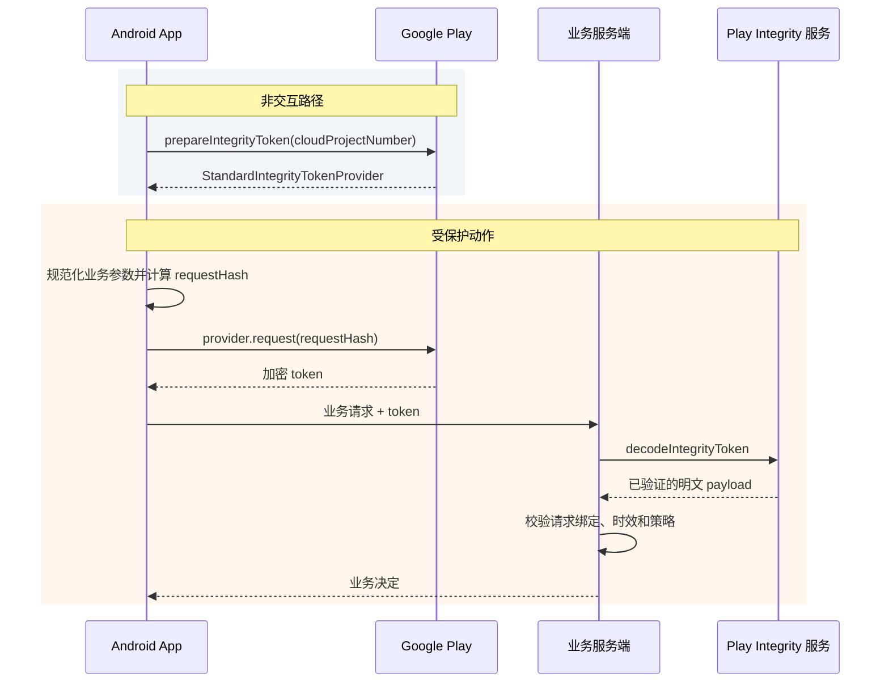

# 8.12 Play Integrity API 性能与集成延迟

Play Integrity API 给业务服务端提供应用、账号授权、设备环境以及可选风险信号。它适合保护登录、支付提交、兑换、排行榜上报等会到达服务端的动作。返回结果是一组风险输入，业务仍要结合账号、交易和行为信息制定处置规则。

它也会给交互增加等待：客户端要向 Google Play 申请加密 token，业务服务端还要把 token 交给 Google 解密和验证。优化目标应当是把可提前完成的 provider 准备移出交互路径，并对剩余阶段分别计时。用一个未经测量的“Play Integrity 总耗时”解释慢请求，很难找到该改客户端、网络还是服务端。

平台上限为 Android 17 / API 37 / `android-17.0.0_r1`。Play Integrity 的判定实现位于闭源的 Google Play 组件和 Google 服务端，AOSP 没有 verdict 生成源码；文末列出的 AOSP 与 kernel 锚点只用于解释 IPC、调度和网络承载边界。

## 1. 先把接口定位说清

SafetyNet Attestation API 已弃用，官方替代接口是 Play Integrity API。两者的客户端类型、token 格式、服务端验证接口和响应字段不同，迁移时不能继续沿用 SafetyNet JWS 解析器。

Play Integrity 与 Key Attestation 解决的问题也不同：

- Play Integrity 返回 Google Play 对应用版本、Play 授权状态、设备环境及可选风险项的判定。
- Key Attestation 证明某个密钥及其生成环境的属性，常用于设备绑定密钥、签名或密钥交换。
- Key Attestation 不会给出 `PLAY_RECOGNIZED`、`LICENSED` 等 Play 分发信号，也不能当作“没有 Play Store 时的等价 Play Integrity 接口”。
- 是否同时使用两类信号取决于威胁模型。组合使用会增加集成和服务端校验成本，不应写成所有支付或反作弊场景的固定要求。

### 1.1 服务端会看到哪些主要判定

应用授权字段 `appLicensingVerdict` 有三个值：

| 值 | 官方语义 | 业务解读边界 |
|---|---|---|
| `LICENSED` | 当前 Google Play 账号拥有此应用的授权，应用曾由 Google Play 安装或更新 | 不能单独证明设备安全，也不能代替账号登录 |
| `UNLICENSED` | 当前账号没有该应用授权，例如侧载或从其他商店取得应用 | 可引导用户通过官方修复对话框获取 Play 版本 |
| `UNEVALUATED` | 前置条件缺失，授权状态未被评估 | 不能当成 `UNLICENSED`，应保留“未知”语义 |

应用完整性字段 `appRecognitionVerdict` 也要独立判断：

| 值 | 官方语义 |
|---|---|
| `PLAY_RECOGNIZED` | 包名和证书与 Google Play 分发记录匹配 |
| `UNRECOGNIZED_VERSION` | 证书或包名与 Google Play 记录不匹配 |
| `UNEVALUATED` | 应用完整性没有得到评估 |

`PLAY_RETAIL` 不是 `appLicensingVerdict` 的有效值。应用识别与账号授权是两个字段；同一个请求可能在其中一个字段得到明确结果，另一个字段仍为 `UNEVALUATED`。

### 1.2 设备标签不能简化成“root / 未 root”

`deviceRecognitionVerdict` 是标签数组，设备满足多级条件时可以同时返回多个标签。默认配置会返回 `MEETS_DEVICE_INTEGRITY`；`MEETS_BASIC_INTEGRITY` 与 `MEETS_STRONG_INTEGRITY` 需要在 Play Console 选择接收。

| 标签 | Android 17 范围内的官方语义 |
|---|---|
| `MEETS_BASIC_INTEGRITY` | 通过基础系统完整性检查。bootloader 可以锁定或解锁，启动状态可以 verified 或 unverified，设备也可能没有通过 Google Play 认证 |
| `MEETS_DEVICE_INTEGRITY` | 运行于真实、通过认证的 Android 设备；Android 13 及以上还要求硬件支持的证据表明 bootloader 已锁定，加载的是认证厂商镜像 |
| `MEETS_STRONG_INTEGRITY` | Android 13 及以上要求满足 `MEETS_DEVICE_INTEGRITY`，且 Android OS、vendor 等设备分区的安全更新都在最近一年内 |

Android 12 及以下的 `MEETS_STRONG_INTEGRITY` 不要求最近安全更新，只要求硬件支持的启动完整性证据。若策略覆盖旧系统，应同时读取可选的 `deviceAttributes.sdkVersion`，避免让同名标签跨版本负责不同策略含义。

标签数组为空也不是一条精确的“设备已 root”诊断。API hooking、系统受损、未通过检查的模拟环境或技术问题都可能导致没有设备标签。面向用户时应给修复路径或较宽泛的环境提示，不要把内部风险信号翻译成确定的入侵结论。

## 2. Standard 与 Classic 是两套调用方式

当前官方文档建议大多数应用使用 Standard 请求。Classic 计算代价更高，适合少量、价值很高且需要其计算新鲜度特征的动作。

| 维度 | Standard API | Classic API |
|---|---|---|
| 客户端入口 | `StandardIntegrityManager` | `IntegrityManager` |
| 请求前准备 | 需要异步 prepare provider | 不需要 provider |
| 业务绑定字段 | `requestHash`，最长 500 字节 | URL-safe、no-wrap Base64 `nonce` |
| 防重放 | Google Play 自动缓解 token 重放 | 业务服务端维护唯一值和使用状态 |
| 官方延迟量级 | token 请求通常为数百毫秒 | 请求通常为数秒 |
| 每实例公开频控 | prepare 最多 5 次/分钟；token 没有公开的低频上限，但仍有防御性限制 | token 最多 5 次/分钟 |
| 适用请求 | 可按需保护频繁的服务端动作 | 偶发的高价值或高敏感动作 |
| verdict 缓存 | Google Play 在设备上缓存部分证明材料并做保护 | 每次重新计算，不建议缓存结果 |

这张表中的时间是官方给出的量级，不是业务 SLA。设备负载、Play 组件版本、网络、Google 服务、业务服务部署位置都会改变尾延迟。固定写成“Standard 50–150 ms”或“Classic 慢 3–5 倍”都缺少可移植的证据。

下面的时序图划分了 Standard 请求中可以单独测量的阶段。



prepare 会访问服务端，通常需要数秒，多数请求在 10 秒内完成；官方建议预留能覆盖长尾的超时，例如 1 分钟。它适合在应用打开后异步启动，不能因为调用是异步的就把首帧或登录按钮锁住等待它。

## 3. Standard API 的正确集成

### 3.1 准备的是 provider，不是业务 token

Standard 请求分成两个动作：

1. 用 Cloud project number 调用 `prepareIntegrityToken()`，得到保存在内存中的 `StandardIntegrityTokenProvider`。
2. 用户执行受保护动作时，计算该动作的 `requestHash`，再通过 provider 申请一个新的 token。

下面的 Kotlin 片段用于展示两阶段 API 的类型边界；错误处理和生命周期归属应由应用自己的数据层补齐。

```kotlin
class IntegrityTokenSource(
    context: Context,
    private val cloudProjectNumber: Long,
) {
    private val manager =
        IntegrityManagerFactory.createStandard(context.applicationContext)

    @Volatile
    private var provider:
        StandardIntegrityManager.StandardIntegrityTokenProvider? = null

    fun prepare():
        Task<StandardIntegrityManager.StandardIntegrityTokenProvider> {
        val request =
            StandardIntegrityManager.PrepareIntegrityTokenRequest.builder()
                .setCloudProjectNumber(cloudProjectNumber)
                .build()

        return manager.prepareIntegrityToken(request)
            .addOnSuccessListener { prepared ->
                provider = prepared
            }
    }

    fun requestToken(
        requestHash: String,
    ): Task<StandardIntegrityManager.StandardIntegrityToken> {
        val prepared = checkNotNull(provider) {
            "Integrity token provider is not ready"
        }
        val request =
            StandardIntegrityManager.StandardIntegrityTokenRequest.builder()
                .setRequestHash(requestHash)
                .build()

        return prepared.request(request)
    }

    fun clearProvider() {
        provider = null
    }
}
```

`IntegrityTokenSource` 只持有 provider，没有持有可复用 token。若请求返回 `INTEGRITY_TOKEN_PROVIDER_INVALID`，provider 可能已过期，或 Play Store 数据被清除；此时应丢弃旧引用并重新 prepare。不要在每个业务动作前 prepare，单个应用实例的 prepare 上限是每分钟 5 次。

### 3.2 `requestHash` 要绑定当前动作

`requestHash` 的目的，是让服务端确认 token 对应正在处理的那份业务数据。建议流程如下：

1. 定义稳定的请求规范化格式，明确字段顺序、空值、字符编码、金额单位和版本号。
2. 纳入所有会改变安全决定的字段，例如账号 ID、服务端下发的 action ID、订单 ID、金额、币种和动作类型。
3. 对规范化字节计算 SHA-256，再以约定编码写入 `requestHash`。
4. 业务服务端按同一规则重算摘要，与解密 payload 中的 `requestDetails.requestHash` 做常量时间比较。

下面的示例只演示“固定格式后再哈希”，防止直接拼接字符串造成歧义。

```kotlin
fun integrityRequestHash(
    actionId: String,
    accountId: String,
    amountMinor: Long,
    currency: String,
): String {
    val canonical = buildString {
        append("v1\n")
        append(actionId.length).append(':').append(actionId).append('\n')
        append(accountId.length).append(':').append(accountId).append('\n')
        append(amountMinor).append('\n')
        append(currency.uppercase(Locale.ROOT))
    }.toByteArray(StandardCharsets.UTF_8)

    val digest = MessageDigest.getInstance("SHA-256").digest(canonical)
    return Base64.encodeToString(
        digest,
        Base64.URL_SAFE or Base64.NO_WRAP or Base64.NO_PADDING,
    )
}
```

服务端必须实现同一份 `v1` 规范，并把版本写进被哈希内容。示例没有放姓名、手机号、原始 token 等敏感数据；官方要求不要把敏感信息以明文写进 `requestHash`。相同摘要也不表示 token 可以复用，每个受保护动作仍应申请和提交自己的 token。

### 3.3 服务端校验顺序

客户端拿到的是加密 token，不能在客户端自行读取 verdict。常规方式是由业务服务端使用关联 Cloud project 的服务账号访问以下端点：

```text
POST https://playintegrity.googleapis.com/v1/{packageName}:decodeIntegrityToken
```

这个端点返回已解密、已验证的 payload。业务服务端还要检查：

- `requestDetails.requestPackageName` 等于预期包名；
- `requestHash` 或 Classic 的 `nonce` 与当前业务动作匹配；
- `timestampMillis` 位于业务定义的有效窗口内；
- `appRecognitionVerdict`、`appLicensingVerdict` 和所需设备标签符合该动作的规则；
- 可选的 `deviceAttributes`、近期设备活动、应用访问风险或 Play Protect 信号是否参与本次策略；
- 该 action ID、订单或会话没有被业务系统重复消费。

Standard token 自带 Google Play 的自动重放缓解：同一个 token 被反复解密时，后续结果会被清空或降为 `UNEVALUATED`。服务端仍要做业务幂等和新鲜度检查，因为“同一笔订单提交两次”属于业务重放，范围超出了 token 解密次数保护。

不要把服务账号密钥、Cloud access token 或 verdict 解析逻辑放进 APK。客户端进程处在被评估环境中，客户端输出不能作为最终授权决定。

## 4. Classic 请求的使用边界

Classic 使用 `IntegrityManagerFactory.create()`、`IntegrityTokenRequest` 和 `nonce`。它没有 prepare 阶段，每次请求都会重新计算 verdict，官方建议限制在偶发的高价值动作。

下面的代码用于辨认 Classic API，避免把它误写成 Standard 调用。

```kotlin
val integrityManager =
    IntegrityManagerFactory.create(applicationContext)

val request =
    IntegrityTokenRequest.builder()
        .setNonce(serverBoundNonce)
        .build()

integrityManager.requestIntegrityToken(request)
    .addOnSuccessListener { response ->
        sendBusinessRequest(response.token())
    }
    .addOnFailureListener { error ->
        recordClassicRequestFailure(error)
    }
```

对 Google Play 分发的应用，Cloud project 已在 Play Console 关联时，请求中通常不必再设置 project number；仅在官方列出的站外分发应用或 SDK 场景中按文档设置。这里的 `serverBoundNonce` 不能是可重复常量。

Classic 的 nonce 应同时覆盖篡改和重放：

- 由服务端生成至少 128 bit、不可预测的唯一值，或使用具备同等唯一性的服务端 action ID；
- 把唯一值与当前业务字段放入规范化消息，再计算摘要；
- 按 URL-safe、no-wrap Base64 编码，满足官方长度限制；
- 服务端解密后重算摘要，并确认唯一值从未被消费；
- nonce 中不要直接或间接携带个人信息。

缓存 Classic verdict 或 token 会放大窃取与重放风险。若调用频率已经高到需要复用结果，应重新评估能否改用 Standard 按动作申请 token。

## 5. 延迟该怎样拆

### 5.1 官方量级只能用于初始容量估算

官方当前给出的量级是：

- Standard prepare 通常为数秒，多数在 10 秒内；因为包含服务端请求，示例超时预算为 1 分钟。
- provider 准备完成后，Standard token 请求通常为数百毫秒。
- Classic 请求通常为数秒，多数在 10 秒内；官方同样给出覆盖长尾的 1 分钟超时示例。
- Google 服务端解密请求通常为几十毫秒，官方比较表标注 three-nines availability。

这些数字不能替代本应用在目标国家、网络、机型和 Play 组件版本上的分位值。也不能据此断言 Standard token 请求“没有网络”：官方只承诺设备侧缓存部分证明材料，prepare 本身明确包含服务端访问，具体内部刷新策略没有公开。

### 5.2 一次业务请求至少记录五段

建议把时间拆成：

| 阶段 | 起止点 | 常见影响因素 |
|---|---|---|
| `provider_prepare` | 调用 prepare 至成功或失败 | 网络、Play 组件状态、设备负载 |
| `token_request` | 调用 provider.request 至 `Task` 完成 | provider 有效性、设备负载、Play 内部状态 |
| `app_to_backend` | 发出业务请求至服务端收到 | 接入网络、TLS、请求体大小 |
| `google_decode` | 服务端调用 decode 至收到 payload | 服务端出口、连接复用、Google 服务 |
| `policy_and_business` | payload 到达至业务响应 | JSON 处理、账号/交易查询、策略服务 |

不要用客户端收到最终响应的总时间推算 `google_decode`。服务端应分别记录 DNS、建连、连接复用、请求等待和 HTTP 状态，并把一次请求的 trace ID 回传给客户端。

### 5.3 关键路径优化

登录、支付和游戏动作可以采用这些安排：

- 应用打开后异步 prepare provider，不等待 prepare 才绘制首页或登录页。
- provider 保存在进程内，由一个并发安全的组件管理；避免多个页面同时 prepare。
- 用户确认动作后再申请 token。可提前准备 provider，不能提前缓存业务 token。
- 在数据不会变化且安全语义允许时，token 请求可与本地参数校验、凭据读取或 UI 动画并行。
- 把业务数据与 token 放进同一次业务上行，避免客户端先上传 token、等服务端确认后再上传业务请求。
- 服务端到 Google 的 HTTP 客户端复用连接，设置容量、超时和熔断监控；不要在每次请求中重建客户端。
- 分开观察冷启动后第一次 prepare、provider 重建、普通 Standard 请求与 Classic 请求。

支付页停留时间较长时，可以在进入页面后 prepare provider；订单金额和 action ID 仍要等用户确认后写入 `requestHash`。游戏启动可以在首个可交互界面出现后准备 provider，在需要保护的匹配、兑换或成绩上报点申请 token。

## 6. 超时、重试与业务处置

### 6.1 三种结果必须分开

服务端策略至少区分：

1. **API 调用失败**：客户端没有拿到 token，或服务端 decode 失败。
2. **未评估**：token 有效，但某字段为 `UNEVALUATED` 或标签缺失。
3. **明确的风险结果**：例如 `UNRECOGNIZED_VERSION`、`UNLICENSED`，或所需设备标签没有出现。

网络错误不等价于设备受损，`UNEVALUATED` 也不等价于明确失败。反过来，支付、转账、密钥恢复等高价值动作也不应因网络超时自动放行。每个动作应在服务端配置允许、追加验证、延迟处理、限制额度或拒绝等处置。

### 6.2 按错误类别重试

官方把错误分为可重试和不可自动重试两组：

| 类别 | 例子 | 处理 |
|---|---|---|
| 瞬态 | `NETWORK_ERROR`、`TOO_MANY_REQUESTS`、`GOOGLE_SERVER_UNAVAILABLE`、`CLIENT_TRANSIENT_ERROR`、内部错误 | 检查网络，采用有次数上限的指数退避并加入抖动 |
| provider 失效 | `INTEGRITY_TOKEN_PROVIDER_INVALID` | 清除旧 provider，重新 prepare |
| 环境或配置 | `API_NOT_AVAILABLE`、`PLAY_STORE_NOT_FOUND`、Play 服务或 Play Store 版本过旧 | 停止自动重试，提示修复环境或检查控制台配置 |
| 可疑调用环境 | `APP_NOT_INSTALLED`、`APP_UID_MISMATCH` | 按完整性检查失败处理 |
| 参数错误 | nonce 长度、编码或 Cloud project number 错误 | 修复输入或发布配置，重试同一错误参数没有收益 |

后台动作可参考官方示例，从 5 秒开始指数退避，并以最大次数作为退出条件。前台交互不适合照搬 5、10、20 秒的等待序列；可以结束当前 UI 请求，把重试交给新一次用户动作或后台任务。连续三次仍失败时，官方建议按客户端未通过完整性检查处置。

超时值应来自本应用的分位数据和风险预算。Standard prepare 与 Classic 请求的官方示例都允许约 1 分钟覆盖长尾，这不代表用户必须在前台等待 1 分钟。UI 截止时间、网络调用截止时间和服务端风控决定是三项配置，不要挤进一个硬编码的 `withTimeout(3000)`。

### 6.3 给用户可修复的出口

Play Integrity 提供 `GET_INTEGRITY`、`GET_STRONG_INTEGRITY`、`GET_LICENSED` 等修复对话框，可处理 Play 服务缺失或过旧、网络连接、未授权应用等部分问题。服务端应先解析 verdict，再让客户端展示指定类型的对话框；对话框完成后重新申请 token。

没有官方 Play Store 或 Play 服务的设备不能完成这套 Google Play 判定。产品需要明确该分发渠道支持哪些能力，并为相应用户设计独立的账号与风险策略。Key Attestation 可以提供密钥属性证据，却不能伪造 Play 授权或应用识别字段。

## 7. 配额与流量模型

默认配额绑定关联的 Cloud project number：

- token 请求每日 10,000 次，Classic 请求与 Standard prepare 共享；
- Google 服务端 token 解密每日 10,000 次，Standard 与 Classic 共享；
- Standard 单实例 prepare 最多 5 次/分钟；
- Classic 单实例 token 最多 5 次/分钟；
- Standard token 请求没有公开的低频上限，但高流量仍受未公开的防御性限制。

这组配额有一个容易漏掉的细节：普通 Standard token 请求不计入“Classic + prepare”的每日 token 生成配额描述，但每次送到 Google 解密仍消耗服务端解密配额。上线前要按日活、受保护动作次数、重试率和峰值放大系数估算两侧用量，并在 Cloud Console 设置告警。需要提额时，应先关联 Play Console 与 Cloud project，提交官方申请，并渐进增加流量，避免突发峰值触发限流。

## 8. 可观测性：Perfetto 只能看到应用这一侧

Play Integrity 库与 Google Play 内部没有向应用公开稳定的 Perfetto slice。应用可以使用异步 trace 标记 token 请求，服务端阶段则依赖后端 tracing。

下面的片段用于给一次跨回调的 Standard token 请求增加 Perfetto async slice。

```kotlin
fun requestWithTrace(
    provider: StandardIntegrityManager.StandardIntegrityTokenProvider,
    requestHash: String,
    traceCookie: Int,
): Task<StandardIntegrityManager.StandardIntegrityToken> {
    val section = "play_integrity_standard_token"
    Trace.beginAsyncSection(section, traceCookie)

    val request =
        StandardIntegrityManager.StandardIntegrityTokenRequest.builder()
            .setRequestHash(requestHash)
            .build()

    return provider.request(request)
        .addOnCompleteListener {
            Trace.endAsyncSection(section, traceCookie)
        }
}
```

async slice 能跨线程覆盖 `Task` 的等待区间。它显示的是从应用发起到回调完成的墙钟时间，不能证明 Google Play 在哪个线程执行，也不能据此数出 Binder 次数或网络往返次数。

客户端和服务端建议记录：

- 请求模式、库版本、Android SDK、应用版本和 Play 组件错误码；
- prepare、token、业务上行、decode、策略各阶段的成功率与 P50/P90/P99；
- provider 失效及重建比例；
- timeout、主动取消、退避重试和限流次数；
- verdict 各类别占比，但不要把 token、nonce、`requestHash` 原文或用户敏感数据写入日志；
- 从 token 申请到服务端消费的年龄，以及 action ID 重复消费次数。

按网络类型、地区、机型和应用冷暖状态切分数据，往往比一条总体 P95 更有诊断价值。对照组还应保留“未调用 Integrity 的业务耗时”，防止把数据库或账号服务变慢归到 Play Integrity。

## 9. Android 17 / API 37 的源码边界

截至 `android-17.0.0_r1`，AOSP 没有 `StandardIntegrityManager`、verdict 计算或 Google decode 服务实现。Android 17 在这条路径中提供进程、包身份、Binder、网络和调度等通用能力；Google Play 组件如何组织调用属于可更新、闭源实现，不能用 AOSP 行数证明其缓存窗口、线程数或 IPC 次数。

可用于排查通用机制的锚点包括：

- AOSP `android-17.0.0_r1` [`android.os.Binder`](https://android.googlesource.com/platform/frameworks/base/+/refs/tags/android-17.0.0_r1/core/java/android/os/Binder.java)：应用侧 Binder API、调用身份与阻塞调用语义。
- AOSP `android-17.0.0_r1` [`IPCThreadState.cpp`](https://android.googlesource.com/platform/frameworks/native/+/refs/tags/android-17.0.0_r1/libs/binder/IPCThreadState.cpp)：native Binder 命令写入、等待和响应处理。
- kernel `android17-6.18-2026-06_r6` [`drivers/android/binder.c`](https://android.googlesource.com/kernel/common/+/refs/tags/android17-6.18-2026-06_r6/drivers/android/binder.c)：Binder 驱动中的事务、等待队列与线程调度承载。

这些锚点能帮助解释“应用线程为何在同步 IPC 上等待”或“系统负载为何放大 IPC 尾延迟”。它们不能证明某次 Integrity 请求一定发生两次 Binder 事务，也不能说明 Google Play 是否访问网络。遇到 Android 17 设备上的异常，应把应用 trace、Play Integrity 错误码、网络记录和服务端 decode trace 放在同一个 request ID 下分析。

## 10. 检查清单

- 使用 Standard API 时，代码是否调用 `createStandard()`，并分离 prepare 与按动作申请 token？
- provider 是否在进程内集中管理，失效后能重新 prepare，且没有每次操作都 prepare？
- token 与 Classic verdict 是否从不缓存、从不跨动作复用？
- `requestHash` 或 nonce 是否绑定当前业务字段，服务端是否重算并校验？
- 服务端是否检查包名、timestamp、应用识别、授权、设备标签和业务幂等？
- 是否把 `UNEVALUATED`、请求错误和明确风险判定分开处理？
- 高价值动作是否避免网络错误后一律放行？
- Standard 与 Classic 的配额、重试和峰值是否进入容量评估？
- 客户端、业务服务端、Google decode 是否拥有可关联的分段耗时？
- 结论是否停留在公开文档和可观察数据范围内，没有猜测闭源 Play 组件的缓存时长或内部调用次数？

## 参考资料

- [Play Integrity API 概览](https://developer.android.com/google/play/integrity/overview)
- [发起 Standard API 请求](https://developer.android.com/google/play/integrity/standard)
- [发起 Classic API 请求](https://developer.android.com/google/play/integrity/classic)
- [Integrity verdict 字段与语义](https://developer.android.com/google/play/integrity/verdicts)
- [配置、SDK 与使用配额](https://developer.android.com/google/play/integrity/setup)
- [错误码与重试建议](https://developer.android.com/google/play/integrity/error-codes)
- [修复对话框](https://developer.android.com/google/play/integrity/remediation)
- [SafetyNet API 弃用说明](https://developer.android.com/privacy-and-security/safetynet)

## 交叉引用

- **8.9 Keystore / KeyMint 调用延迟**：设备密钥与 Key Attestation 的耗时和信任边界
- **8.10 BiometricPrompt 与 Credential Manager 登录链路**：登录 UI、凭据获取与服务端认证的阶段划分
- **8.11 推送通知管线性能**：跨进程与服务端路径的分段观测方法
- **12.1 网络性能优化**：移动网络、连接复用与尾延迟
- **12.2 Android 网络安全与 TLS 性能**：业务上行与服务端出站连接的安全和性能边界
