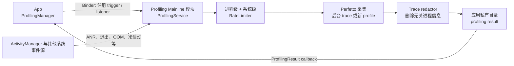

# 8.16 ProfilingManager 系统触发式性能追踪

<!-- outline-start -->
## 要点

### 🔸 ProfilingManager 概念与用途
系统触发式性能追踪机制在 Android 中的作用与定位

### 🔸 AOSP 标准实现路径
frameworks/base/services/core/java/com/android/server/am/ProfilingManager.java

### 🔸 厂商定制实现差异
Samsung、Xiaomi、Huawei 等主流厂商的实现特点

### 🔸 降级方案兼容层
在不支持 ProfilingManager 的设备上的性能替代方案

### 🔸 与 ActivityManagerService 交互
触发机制、权限控制、生命周期回调

### 🔸 实际使用场景分析
哪些性能问题最适合用系统触发式追踪方法

### 🔸 工具集成与调试
Perfetto、Systrace 与 ProfilingManager 的协作方式

## 扩展

### 🔸 厂商实现源码对比
主流厂商如何实现自己的系统性能追踪工具

### 🔸 跨版本兼容性问题
不同 Android 版本间的 API 变更与适配

### 🔸 性能影响评估
系统级追踪机制对设备性能的实际影响分析

<!-- outline-end -->

## 1. 这套 API 解决什么问题

`android.os.ProfilingManager` 是面向普通应用的公开系统服务。Android 15 / API 35 提供应用主动请求 profile 的能力；Android 16 / API 36 加入系统事件触发；Android 17 / API 37 扩大了触发类型。它的目标是在公开版本应用和真实用户设备上，以受限、经过隐私处理的方式收集性能证据。

这个定位与开发机上的 Android Studio Profiler、`adb` + Perfetto 不同。开发工具适合工程师手动复现，能取得更完整的系统信息；`ProfilingManager` 适合低频采样线上偶发问题，返回的 system trace 会经过 redactor，其他无关进程的信息会被删除。

现稿曾出现两个相反结论：正文使用不存在的 `ProfilingConfig`、`FrameRateFeature` 等类，补充部分又声称 Android 17 没有 `ProfilingManager`。两者都不符合 `android-17.0.0_r1`。公开入口就是 `Context.getSystemService(ProfilingManager::class.java)`；Android 17 的 framework 与服务实现位于 `packages/modules/Profiling` Mainline 模块。

### 1.1 主动请求与系统触发

两种采集方式共享结果模型，但启动条件不同：

| 方式 | 谁决定开始 | 适合的问题 | 结果监听 |
|---|---|---|---|
| App-driven | 应用调用 `requestProfiling()` | 已知业务区间、可安排采样的慢操作 | 请求专用 listener 或全局 listener |
| Trigger-based | 已注册的系统事件发生 | ANR、冷启动、OOM、进程退出等难以提前预测的问题 | 只能通过全局 listener |

主动请求支持四类数据：

- system trace：线程调度、频率、frame timeline 与应用自定义 slice；
- Java heap dump：对象引用关系与泄漏分析；
- heap profile：分配热点与内存行为；
- stack sampling：CPU 调用栈采样。

系统触发返回哪种 artifact 由触发类型决定，应用不能为 ANR 触发自由拼装 Perfetto 配置。触发注册也不保证一定产出文件，系统会受采样窗口、rate limit、并发 profile、存储空间和内部错误影响。

## 2. Android 17 的版本边界

| 平台 | 公开能力 |
|---|---|
| Android 8–14 / API 26–34 | 没有 `ProfilingManager`；只能采用开发机工具、线上指标和应用自定义埋点 |
| Android 15 / API 35 | `ProfilingManager`、`requestProfiling()`、四类 app-driven profile、全局结果 listener |
| Android 16 / API 36 | `ProfilingTrigger`、`APP_FULLY_DRAWN`、`ANR`，以及增删 trigger 的接口 |
| Android 16 的 API 36.1 minor release | 请求当前后台 trace、force-stop、Recents 移除、Task Manager 停止等触发能力 |
| Android 17 / API 37 | 增加 OOM、通用 anomaly、过量 CPU 杀进程、cold start、app compatibility 触发 |

若应用的 `minSdk` 低于 35，类加载与调用都要放在版本隔离代码中。AndroidX Core 的 builder 能减少原始 `Bundle` 参数错误，但底层平台仍需 API 35；它不会在旧系统上模拟系统 profile。在 Android 16 上调用 36.1 新增接口时，应比较 `Build.VERSION.SDK_INT_FULL` 与 `Build.VERSION_CODES_FULL.BAKLAVA_1`，只判断 `SDK_INT == 36` 无法区分 36.0 和 36.1。Android 17 已包含这些接口。

## 3. Android 17 的触发类型

Android 17 / API 37 的公开 `ProfilingTrigger` 包含以下事件：

| 触发常量 | 事件与 artifact |
|---|---|
| `TRIGGER_TYPE_APP_FULLY_DRAWN` | 冷启动调用 `Activity.reportFullyDrawn()` 后，尝试保存正在运行的后台 system trace 快照 |
| `TRIGGER_TYPE_ANR` | 系统识别 ANR 后、尝试杀进程前，保存后台 system trace 快照；触发不表示进程一定因 ANR 被杀 |
| `TRIGGER_TYPE_APP_REQUEST_RUNNING_TRACE` | 应用调用 `requestRunningSystemTrace()`，尝试保存当前后台 trace；必须预先注册该触发 |
| `TRIGGER_TYPE_KILL_FORCE_STOP` | 用户在应用信息页点“强行停止”时保存 system trace 快照 |
| `TRIGGER_TYPE_KILL_RECENTS` | 用户从最近任务移除应用并导致进程结束时保存 system trace 快照 |
| `TRIGGER_TYPE_KILL_TASK_MANAGER` | 用户在 Task Manager 停止应用时保存 system trace 快照 |
| `TRIGGER_TYPE_OOM` | 未捕获 `OutOfMemoryError` 时提供 Java heap dump |
| `TRIGGER_TYPE_ANOMALY` | 系统检测到异常行为，artifact 类型由异常决定，附加信息位于结果 tag |
| `TRIGGER_TYPE_KILL_EXCESSIVE_CPU_USAGE` | 因过量 CPU 使用、以 `REASON_EXCESSIVE_RESOURCE_USAGE` 结束进程时保存 system trace 快照 |
| `TRIGGER_TYPE_COLD_START` | cold start 尽早启动新的 system trace 与 stack sampling，持续到 `reportFullyDrawn()`，未调用时默认约 5 秒 |
| `TRIGGER_TYPE_APP_COMPAT` | 系统发现将来版本不再支持的应用行为，artifact 类型由兼容性问题决定 |

OOM 触发有一个容易漏掉的条件：自定义 `Thread.UncaughtExceptionHandler` 必须继续调用系统默认 handler，否则系统触发路径收不到该未捕获异常。应用仍可主动申请 heap dump，但那是另一条调用路径。

`TRIGGER_TYPE_COLD_START` 使用 discard buffer。缓冲区满后会丢弃新事件，以保留最早的启动信息；普通后台 trace 快照使用 ring buffer，缓冲区满后覆盖旧事件，以保留触发前最近一段历史。分析文件时要先确认采集模式，不能把缺失区间当作应用没有执行。

## 4. 触发式采集为什么可能没有文件

为捕获事件发生前的历史，系统会在随机时段启动后台 trace。它不会为每个已注册应用持续录制。事件发生时只有恰好存在可用后台 trace、配额允许且后处理成功，才可能交付 profile。

下面的架构图展示 Android 17 中注册、事件和结果交付的分工。



图中的 ActivityManager 是部分事件来源和协作点，Profiling 服务本身不在 AMS 的 `AppProfiler` 中。`AppProfiler`、`ProfilerInfo` 主要服务于传统调试/profile 启动路径，不能替代公开 `ProfilingManager` API。

## 5. 正确注册 trigger 与全局 listener

trigger 产生的文件只会交给 `registerForAllProfilingResults()` 注册的全局 listener。应用进程在采集期间死亡时，系统可以暂存结果；应用下次启动并重新注册全局 listener 后，系统会尝试再次交付。

下面的 Android 17 示例注册 fully-drawn、ANR 与 cold-start 三类事件，并给每类事件设置应用自己的冷却时间。

```kotlin
@RequiresApi(37)
class ProductionProfiling(
    context: Context,
    private val resultExecutor: Executor,
    private val profileSink: ProfileSink,
) {
    private val manager =
        context.getSystemService(ProfilingManager::class.java)

    private val resultListener = Consumer<ProfilingResult> { result ->
        if (result.errorCode == ProfilingResult.ERROR_NONE) {
            val path = result.resultFilePath ?: return@Consumer
            profileSink.enqueue(
                file = File(path),
                triggerType = result.triggerType,
                tag = result.tag,
            )
        } else {
            profileSink.recordFailure(
                errorCode = result.errorCode,
                message = result.errorMessage,
            )
        }
    }

    fun register() {
        manager.registerForAllProfilingResults(
            resultExecutor,
            resultListener,
        )

        manager.addProfilingTriggers(
            listOf(
                ProfilingTrigger.Builder(
                    ProfilingTrigger.TRIGGER_TYPE_APP_FULLY_DRAWN,
                ).setRateLimitingPeriodHours(24).build(),
                ProfilingTrigger.Builder(
                    ProfilingTrigger.TRIGGER_TYPE_ANR,
                ).setRateLimitingPeriodHours(24).build(),
                ProfilingTrigger.Builder(
                    ProfilingTrigger.TRIGGER_TYPE_COLD_START,
                ).setRateLimitingPeriodHours(24).build(),
            ),
        )
    }

    fun unregisterListener() {
        manager.unregisterForAllProfilingResults(resultListener)
    }
}
```

`ProfileSink` 是业务自定义接口，不属于 Android SDK。它应在后台线程检查文件大小、做隐私审批、持久化上传任务，并在服务器确认接收后处理本地文件。不要在 callback 中同步解析大型 Perfetto 文件，也不要硬编码 `/data/user/0/...`；路径应始终取自 `ProfilingResult.getResultFilePath()`。

每个 trigger 类型同时只保留一份注册配置，再次添加同类型 trigger 会覆盖旧配置。`setRateLimitingPeriodHours()` 添加的是应用自定义冷却时间，系统自己的配额仍然生效；值为 24 小时也不承诺每天一定收到一份文件。

## 6. App-driven profile 仍有独立价值

系统 trigger 适合不可预测事件。若应用知道要观察的业务区间，例如进入结算页后执行的一段复杂计算，可以主动开始 system trace，再用 `CancellationSignal` 在区间结束时停止。连续 profile 类型可能延迟启动，官方建议在目标区间前发起请求。

AndroidX Core 提供类型安全的 builder，避免直接构造平台 `Bundle`。下面的示例创建一个最长 15 秒、采用 ring buffer 的 system trace 请求。

```kotlin
@RequiresApi(35)
fun requestCheckoutTrace(
    context: Context,
    executor: Executor,
    listener: Consumer<ProfilingResult>,
): CancellationSignal {
    val cancellation = CancellationSignal()
    val request = SystemTraceRequestBuilder()
        .setTag("checkout")
        .setDurationMs(15_000)
        .setBufferSizeKb(4_096)
        .setBufferFillPolicy(BufferFillPolicy.RING_BUFFER)
        .setCancellationSignal(cancellation)
        .build()

    Profiling.requestProfiling(
        context,
        request,
        executor,
        listener,
    )
    return cancellation
}
```

业务区间提前结束时调用 `cancellation.cancel()`，系统会停止采集并在可用时返回结果。若同时设置 duration 和 `CancellationSignal`，先到的停止条件生效。若两者都不设置，系统使用默认时长。直接调用平台 `requestProfiling()` 时，未知参数会得到 `ERROR_FAILED_INVALID_REQUEST`，越界值可能被系统收敛到支持范围，因此优先采用 AndroidX builder。

应用自己的 `Trace.beginSection()`、`Trace.endSection()` 或 AndroidX tracing slice 会出现在 system trace 中。自定义 slice 名称应稳定、低基数、避免用户信息，这样线上多份 trace 才能用统一 PerfettoSQL 查询。

## 7. 结果、错误与文件生命周期

`ProfilingResult` 的处理应先看 `errorCode`：

| 错误 | 含义 | 建议处理 |
|---|---|---|
| `ERROR_NONE` | profile 成功，`resultFilePath` 可用 | 异步消费文件 |
| `ERROR_FAILED_RATE_LIMIT_PROCESS` | 当前应用成本配额已用尽 | 降低请求或 trigger 频率 |
| `ERROR_FAILED_RATE_LIMIT_SYSTEM` | 全系统共享配额已用尽 | 不要立即重试，记录采样缺口 |
| `ERROR_FAILED_PROFILING_IN_PROGRESS` | 已有 profile 正在运行 | 去重并发请求 |
| `ERROR_FAILED_EXECUTING` | 执行阶段失败 | 记录设备与请求类型，按低频策略重试 |
| `ERROR_FAILED_POST_PROCESSING` | 后处理失败，结果已丢弃 | 记录失败，不假设存在可读取文件 |
| `ERROR_FAILED_NO_DISK_SPACE` | 存储空间不足 | 停止重试并清理应用可控文件 |
| `ERROR_FAILED_INVALID_REQUEST` | 请求参数或类型无效 | 修复代码，不做原样重试 |
| `ERROR_UNKNOWN` | 未分类失败 | 记录上下文并控制重试次数 |

rate limiter 按不同 profile 类型计算成本，并同时维护每小时、每天、每周三个时间窗。应用级和全系统级限制彼此独立，具体成本与额度由系统配置，不应在业务代码中假设“每小时可抓 N 次”。trigger 自定义冷却只能进一步减少采集，不能绕过系统限制。

成功的 system trace 会经过 trace redactor。它与开发机手动抓取的完整 Perfetto trace 可查询范围不同：无关进程信息被移除，部分依赖全系统数据的标准库表或 SQL 查询无法工作。分析平台应标记 profile 来源，避免用同一组查询静默处理两种文件。

## 8. 与 ActivityManagerService、Perfetto 和 kernel 的关系

Android 17 的调用路径可以从源码分成五层：

1. `ProfilingFrameworkInitializer` 把 `ProfilingManager` 注册为 Context system service。
2. `ProfilingManager` 保存 listener，通过 `IProfilingService` Binder 接口发送请求、trigger 配置和取消操作。
3. Mainline 模块中的 `ProfilingService` 校验包名与 UID、执行 rate limit、管理队列和文件交付。
4. 服务启动 Perfetto 采集；system trace 结束后运行 trace redactor，再把结果复制到应用私有文件。
5. framework 收到 Binder callback，构造 `ProfilingResult` 并投递到应用指定的 `Executor`。

ANR trigger 在 Android 17 还会通过 `ActivityManager.registerAnrWarningListener()` 写入包含 ANR ID 与超时信息的应用 trace slice，使 redactor 保留这段关联信息。这是 ProfilingManager 与 ActivityManager 的协作点，不代表采集服务归 AMS 管理。

可复核的 Android 17 源码锚点如下：

- [`ProfilingManager.java`](https://android.googlesource.com/platform/packages/modules/Profiling/+/refs/tags/android-17.0.0_r1/framework/java/android/os/ProfilingManager.java)：公开 framework wrapper、listener、trigger 与 Binder callback。
- [`ProfilingTrigger.java`](https://android.googlesource.com/platform/packages/modules/Profiling/+/refs/tags/android-17.0.0_r1/framework/java/android/os/ProfilingTrigger.java)：API 37 trigger 常量、builder 与可用性判断。
- [`IProfilingService.aidl`](https://android.googlesource.com/platform/packages/modules/Profiling/+/refs/tags/android-17.0.0_r1/aidl/android/os/IProfilingService.aidl)：framework 与模块服务之间的 Binder 合约。
- [`ProfilingService.java`](https://android.googlesource.com/platform/packages/modules/Profiling/+/refs/tags/android-17.0.0_r1/service/java/com/android/os/profiling/ProfilingService.java)：rate limit、Perfetto 进程、redaction、队列和结果复制。
- [`RateLimiter.java`](https://android.googlesource.com/platform/packages/modules/Profiling/+/refs/tags/android-17.0.0_r1/service/java/com/android/os/profiling/RateLimiter.java)：应用级和系统级采样成本控制。
- kernel `android17-6.18-2026-06_r6` [`include/trace/events/sched.h`](https://android.googlesource.com/kernel/common/+/refs/tags/android17-6.18-2026-06_r6/include/trace/events/sched.h)：system trace 中调度事件的 kernel tracepoint 定义。

kernel 锚点只能说明 Perfetto 能采集哪些调度事件，不能用来推导 ProfilingManager 的采样概率、配额或 redaction 策略；这些策略由 Profiling 模块配置。

## 9. 厂商差异该怎样验证

没有公开、可复核的证据支持“Samsung 使用某套类、Xiaomi 降低某触发优先级、Huawei 改用另一接口”这类品牌化结论。Android 17 的标准实现位于可更新的 Profiling Mainline 模块，应用应依赖公开 API 与 `ProfilingResult`，不要反射模块服务或读取内部 flag。

设备差异仍可能出现在：

- 模块与系统补丁版本；
- 可用 Perfetto data source 和硬件 counter；
- 系统负载、温控、存储与后台 trace 抽样命中率；
- OEM 对进程结束、Recents 行为和资源策略的实现；
- 某些 trigger 对应的 artifact 是否可生成。

设备覆盖表应记录 Build fingerprint、SDK、Profiling 模块版本、trigger 类型、结果错误码和文件 schema。若某品牌的成功率偏低，先用这些数据定位，再给出厂商结论。

## 10. Android 8–14 的降级方案

旧系统没有等价的 production profile API。降级时要根据目标拆开处理：

| 目标 | 可用方案 |
|---|---|
| 本地复现 system trace | Android Studio CPU Profiler、Perfetto `record_android_trace`、Macrobenchmark |
| 启动与帧耗时线上分布 | Play Vitals、应用自己的启动阶段计时、FrameMetrics 或 JankStats |
| 业务慢操作 | 稳定的 `Trace` slice、结构化耗时、采样日志 |
| 崩溃与 ANR | Play Console / Android vitals、`ApplicationExitInfo`（支持版本内）、崩溃平台 |
| 内存问题 | 本地 heap dump、线上内存水位与 OOM/退出原因统计 |

`Trace.beginSection()` 只添加事件，自己不会启动或保存 system trace。普通应用也不能在用户设备上通过 shell 命令静默抓取完整 Perfetto 数据。旧系统降级的目标应是保留可比较的指标和复现线索，不要伪装成同等能力。

## 11. 本地调试与 Perfetto 分析

本地验证 trigger 时，官方提供 `device_config` 测试开关。下面命令只应在测试设备上执行。

```bash
adb shell device_config put profiling_testing \
  system_triggered_profiling.testing_package_name com.example.app

adb shell device_config put profiling_testing \
  rate_limiter.disabled true

adb shell device_config put profiling_testing \
  delete_temporary_results.disabled true
```

第一项为指定包强制维持测试用后台 trace，第二项关闭应用级和系统级 rate limiter，第三项保留临时目录中的未 redacted 文件。测试结束后应删除这些 DeviceConfig 覆盖，生产代码不能依赖它们。

分析时使用 Perfetto UI 或 Trace Processor。先检查 trace bounds、进程和线程是否存在，再运行 frame timeline、scheduler、CPU frequency 或自定义 slice 查询。ProfilingManager trace 已被裁剪，查询为空可能表示数据被 redactor 删除，也可能表示采集窗口没有覆盖目标区间。

Systrace 是旧的前端和输出格式称呼，新工作流应以 Perfetto 为主。已有 Systrace 分析经验可以继续用于理解线程状态与 slice，但采集、SQL 和自动化分析应迁移到 Perfetto 工具。

## 12. 性能与隐私检查表

- 是否在 API 35/36/37 的正确版本边界内调用对应接口？
- trigger 结果是否只由全局 listener 接收，且 listener 在应用启动时尽早注册？
- callback 是否运行在独立 executor，没有在主线程解析或上传大型文件？
- 是否为高频 trigger 设置业务冷却，并统计 process/system rate limit？
- 是否接受“请求或事件发生但没有 profile”这一正常结果？
- cold-start 与 fully-drawn trigger 是否配合准确的 `reportFullyDrawn()`？
- 自定义 OOM handler 是否继续调用默认 handler？
- 是否从 `ProfilingResult` 读取路径、错误码、tag 和 trigger type，没有猜测固定目录？
- 服务端是否区分 redacted production trace 与本地完整 Perfetto trace？
- profile 上传是否经过用户授权、脱敏、保留周期和访问权限审查？

## 参考资料

- [ProfilingManager API reference](https://developer.android.com/reference/android/os/ProfilingManager)
- [ProfilingTrigger API reference](https://developer.android.com/reference/android/os/ProfilingTrigger)
- [ProfilingResult API reference](https://developer.android.com/reference/android/os/ProfilingResult)
- [App-driven profiling](https://developer.android.com/topic/performance/tracing/profiling-manager/how-to-capture)
- [Trigger-based profiling](https://developer.android.com/topic/performance/tracing/profiling-manager/trigger-based-capture)
- [Profiling limitations and rate limiting](https://developer.android.com/topic/performance/tracing/profiling-manager/will-my-profile-always-be-collected)
- [Query ProfilingManager profiles](https://developer.android.com/topic/performance/tracing/profiling-manager/querying-profiles)
- [Perfetto tracing documentation](https://perfetto.dev/docs/)

## 交叉引用

- **1.4 Binder IPC 机制与性能影响**：`ProfilingManager` 与 Mainline 服务之间的 Binder 请求和 callback
- **13.1 Perfetto 简介与演进**：trace 采集、Trace Processor 与 PerfettoSQL
- **8.2 应用启动**：cold start、`reportFullyDrawn()` 与启动阶段划分
- **9.2 ANR 分析**：ANR 触发时机、trace 与其他 ANR 证据的联合分析
