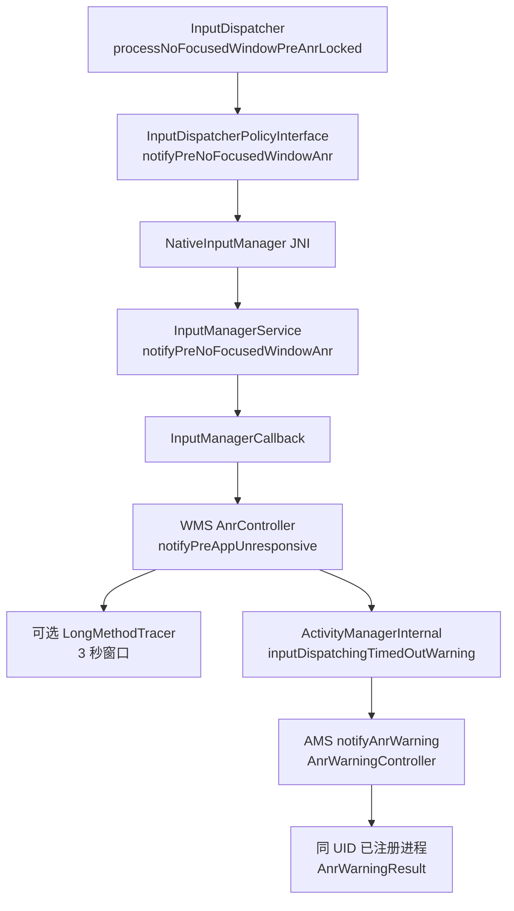

# Android 17 ANR 预警与 Input pre-ANR

Android 17 / API 37 增加了公开的 ANR warning（预警）API。应用可以向 `ActivityManager` 注册 listener（监听器），在部分 ANR 检测路径接近 deadline（完成期限）时收到 `AnrWarningResult`。

这个信号有三个边界：

- warning 表示“某个计时条件已进入预警点”，系统尚未宣告 ANR；
- 阻塞条件可能在 deadline 前恢复，因此 warning 后未必有 ANR；
- 回调按 best-effort（尽力而为、不保证到达）方式投递；系统可能来不及调用，也可能在 executor（执行器）排队期间到达 deadline。

warning 不会暂停或延长原计时器。它适合记录轻量状态，并关联 warning 与事后退出记录；不适合在回调里临时执行全线程 dump、同步写盘或网络上传。

本章的平台实现以 `android-17.0.0_r1` 为核对版本。ANR 的 timeout 与报告流程见 [9.1 ANR 机制、类型与触发条件](01-anr-mechanism-types-triggers.md)，线程转储和 Perfetto 联合分析见 [§9.2 ANR 与 Kernel Trace 联合诊断](02-anr-kernel-trace-diagnosis.md)。

Android 17 在正式 ANR 之前增加了可选 warning 信号。公开回调描述应用可见的结果，Input pre-ANR 路径描述 InputDispatcher、WMS 和 AMS 如何产生并转发预警。

## 公开回调、类型与交付约束

### 1. 公开 API 在 `android.app`

Android 17 的相关类型位于 `android.app`：

| API | 作用 |
|---|---|
| `AnrTypes` | 结构化 ANR 类型常量 |
| `AnrWarningResult` | warning 的 Parcelable（可跨 Binder 序列化）载荷 |
| `ActivityManager.registerAnrWarningListener()` | 注册 executor 与 listener |
| `ActivityManager.unregisterAnrWarningListener()` | 用同一个 listener 对象注销 |

`IAnrWarningCallback.aidl` 是 ActivityManager 与 AMS（ActivityManagerService）之间的 hidden（隐藏）Binder 接口，应用不需要直接实现它。`ActivityManager` 会在当前进程注册第一个 listener 时创建一个 Binder stub（接收系统跨进程调用的入口）；同一进程后续注册的 listener 会复用这条系统回调。

这些 API 都在 API 37 加入。公开文档没有要求 `targetSdkVersion >= 37`；应用需要使用 API 37 SDK 编译，并在运行时检查设备版本。`android-17.0.0_r1` 源码还保留 `@FlaggedApi` 注解：`AnrTypes` 与 `ApplicationExitInfo.AnrInfo` 对应 `Flags.FLAG_INCLUDE_ANR_INFO`，warning callback 相关类与注册方法对应 `Flags.FLAG_ENABLE_ANR_WARNING_CALLBACK`。在 AOSP 派生或厂商调试 build 上，应把源码 flag 状态和运行平台版本一起纳入兼容性验证。

### 2. `AnrTypes` 的完整枚举

`AnrTypes` 使用 `@IntDef`，也就是由注解约束取值范围的一组整数常量，并非 Java/Kotlin `enum`。Android 17 定义了 11 个常量：

| 值 | 常量 | 含义 |
|---:|---|---|
| 0 | `ANR_TYPE_OTHER` | 无法归入其他类型 |
| 1 | `ANR_TYPE_INPUT_DISPATCH_NO_FOCUSED_WINDOW` | 输入派发期间没有 focused window（焦点窗口） |
| 2 | `ANR_TYPE_INPUT_DISPATCH` | 输入事件响应超时 |
| 3 | `ANR_TYPE_BROADCAST_OF_INTENT` | BroadcastReceiver 处理超时 |
| 4 | `ANR_TYPE_START_FOREGROUND_SERVICE` | 前台服务没有按期进入 foreground（前台状态） |
| 5 | `ANR_TYPE_EXECUTE_SERVICE` | Service `onCreate`、`onStartCommand` 或 `onBind` 执行超时 |
| 6 | `ANR_TYPE_CONTENT_PROVIDER_NOT_RESPONDING` | 已连接 ContentProvider 的受监控调用超时 |
| 7 | `ANR_TYPE_APP_TRIGGERED` | 应用主动请求触发 ANR |
| 8 | `ANR_TYPE_FOREGROUND_SHORT_SERVICE_TIMEOUT` | short service 没有按期响应 `onTimeout()` |
| 9 | `ANR_TYPE_JOB_SERVICE_START` | JobService 启动响应超时 |
| 10 | `ANR_TYPE_APPLICATION_START` | 应用启动超时 |

这些常量还用于 Android 17 的 `ApplicationExitInfo.AnrInfo`。类型集合覆盖 ANR 分类，但不表示每一种类型都已经接入 warning producer（产生预警的系统路径）。

#### 2.1 枚举覆盖与预警覆盖要分开

在已核对的 `android-17.0.0_r1` 实现中，明确发出 warning 的路径有：

| warning producer | `AnrTypes` | 预警点 |
|---|---|---|
| InputDispatcher 等待 focused window | `INPUT_DISPATCH_NO_FOCUSED_WINDOW` | 剩余窗口取 timeout 一半与平台默认 pre-ANR window（预警窗口）中的较长者 |
| Broadcast delivery timer | `BROADCAST_OF_INTENT` | `BroadcastAnrTimer` 运行到 50% split point |
| Service execution timer | `EXECUTE_SERVICE` | `AnrTimer` 运行到 50% split point（计时分割点） |
| short FGS timer | `FOREGROUND_SHORT_SERVICE_TIMEOUT` | `AnrTimer` 运行到 50% split point |
| start-foreground timer | `START_FOREGROUND_SERVICE` | `AnrTimer` 运行到 50% split point |

InputDispatcher 的 `processPreAnrsLocked()` 在该 tag（源码版本）中只调用 `processNoFocusedWindowPreAnrLocked()`。普通 input connection timeout（输入连接超时）没有沿这段代码发送 warning。ContentProvider call detector、JobService、application start 和 app-triggered ANR 也不能因为存在对应常量，就推断系统已经投递 warning。

warning 覆盖还受 feature flag（功能开关）与计时器实现影响。生产统计应同时保留“最终 ANR 无 warning”和“warning 后恢复”两类记录，不能把 listener 收到的数量当作全量 ANR 分母。

### 3. `AnrWarningResult` 只有五项数据

Android 17 的载荷字段已经在源码和公开 API 中确定：

| getter | 语义 |
|---|---|
| `getAnrId()` | 该类型下的 ANR event id（事件标识） |
| `getAnrType()` | `AnrTypes` 中的类型值 |
| `getConsumedMillis()` | warning 生成时已经消耗的时长，时钟为 `SystemClock.uptimeMillis()`（不计深度睡眠的开机时长） |
| `getTimeoutMillis()` | 系统为该次计时使用的总期限 |
| `getDescription()` | 短诊断描述，格式不稳定 |

载荷没有 PID、UID、包名、进程名、组件对象、线程栈、锁状态或 Binder 队列深度。`description` 可能包含 Service component（组件名）等提示，但 API 明确声明格式可变；它可以用于人工分析或辅助聚类，不能解析成稳定协议。

`anrId` 只保证“在每个 `anrType` 内唯一”。持久化 key（记录键）应至少使用 `(anrType, anrId)`，还应带上用户、应用版本、设备 boot/session（本次开机或应用会话）和本地进程名，避免跨重启或多进程数据混在一起。

### 4. 注册与注销

下面的 Kotlin 示例使用专用单线程 executor，把 warning 复制成小型内存记录。示例避免在回调里遍历全部线程或访问网络：

```kotlin
class AnrWarningRecorder(
    private val context: Context
) : Closeable {
    private val executor =
        Executors.newSingleThreadExecutor { task ->
            Thread(task, "anr-warning-recorder")
        }

    private val lastWarning =
        AtomicReference<WarningSnapshot?>()

    private val listener =
        Consumer<AnrWarningResult> { result ->
            lastWarning.set(
                WarningSnapshot(
                    type = result.anrType,
                    id = result.anrId,
                    consumedMs = result.consumedMillis,
                    timeoutMs = result.timeoutMillis,
                    description = result.description,
                    callbackUptimeMs = SystemClock.uptimeMillis(),
                    receiverProcess = Application.getProcessName()
                )
            )
        }

    fun start() {
        if (Build.VERSION.SDK_INT >= 37) {
            context.getSystemService(ActivityManager::class.java)
                .registerAnrWarningListener(executor, listener)
        }
    }

    override fun close() {
        if (Build.VERSION.SDK_INT >= 37) {
            context.getSystemService(ActivityManager::class.java)
                .unregisterAnrWarningListener(listener)
        }
        executor.shutdown()
    }
}
```

`WarningSnapshot` 是应用自定义的不可变数据类。若 recorder（记录器）与进程同寿命，可以在 `Application` 初始化时注册并长期保留；若它属于短生命周期组件，必须用原 listener 实例注销，随后关闭 executor。

官方文档要求 executor 不要使用应用主线程。主线程可能正是被监视的阻塞线程，把回调再次排到主线程会失去预警机会。executor 也不应与容易排满的业务线程池共用。

### 5. 系统如何投递

#### 5.1 应用进程内

`ActivityManager` 在进程内维护 listener 到 executor 的映射，类型为 `Consumer<AnrWarningResult> → Executor`：

1. 第一个 listener 注册时，向 AMS 注册一个 `IAnrWarningCallback`；
2. AMS 调用 hidden AIDL 方法 `onAnrImminent(result)`；`imminent` 表示 ANR 即将发生；
3. `ActivityManager` 遍历本进程 listener，把任务提交给各自 executor；
4. 多个 listener 的通知顺序没有保证；
5. 本进程移除全部 listener 后，系统 Binder callback（回调对象）也会注销。

重复注册同一个 listener 对象不会增加第二条记录。注销一个从未注册的 listener 会直接返回。

#### 5.2 system_server 内

`AnrWarningController` 按 calling UID（注册方的应用身份）保存 callback 列表，并为每个 Binder callback 注册 death recipient（进程死亡通知）。producer 调用 `ActivityManagerService.notifyAnrWarning()` 时，AMS 先用 `anrId` 获取或创建 error id，再交给 controller。controller 会执行以下步骤：

1. 若该 UID 有 callback，发出 `debug.anr` category 的 `AnrWarningDetected` Perfetto instant（瞬时事件）；
2. 构造 `AnrWarningResult`；
3. 通过 oneway AIDL（无需等待接收方返回的异步 Binder 调用）通知该 UID 下的每个已注册进程；
4. 记录 ANR warning API 的统计事件。

注册范围由 calling UID 决定。应用不能监听其他 UID 的 warning。

#### 5.3 多进程应用会收到重复通知

AMS 的 callback 表按 UID 分组。一个包的主进程和 `:remote` 进程都注册 listener 后，同一 UID 的 warning 会投递到两个进程，而载荷中没有目标 PID。

多进程应用应：

- 在记录中加入 `Application.getProcessName()`；
- 以 `(type, id, boot/session)` 去重上传；
- 预先决定由哪个进程持久化；
- 不从“收到回调的进程”推断“发生阻塞的进程”。

同 UID 多包场景也要按 UID 语义处理。warning API 没有提供 package selector。

### 6. warning 发生在 deadline 前

旧式 ANR 线程转储在 deadline 到期后才开始，容易遇到取样变旧。Android 17 warning 的时序更早：

```text
计时器开始
    │
    ├── warning split point
    │      └── AMS → onAnrImminent() → app executor
    │
    ├── 阻塞解除：timer cancel，本次不产生 ANR
    │
    └── deadline 到期：进入对应 timeout/ANR 处理
```

图中的 app executor 任务可能晚于 Binder 回调执行。`getConsumedMillis()` 表示系统生成 warning 时的计时进度，`callbackUptimeMs` 才是应用代码开始处理的本地时间；二者不能混写。

#### 6.1 Service timer

`AnrTimer.Args.anrWarning(true)` 会在 native timer 中加入 50% split point。到点后，`AnrTimer` 把 `timerId`、关联对象和 elapsed time（已经经过的时间）送回相应 Handler，再由 `ActiveServices` 生成 type、timeout 和 description。

这一过程发生在 timer 到期之前。系统负载、Handler 延迟和 executor 排队会缩短应用可用的剩余时间。

#### 6.2 No-focused-window input

InputDispatcher 为 no-focused-window（没有焦点窗口）状态维护独立的 pre-ANR 标记。pre-ANR window 取“总 timeout 的一半”与平台默认预警窗口中的较大值，再从 deadline 反推 warning 时刻。状态恢复、focused application（当前应获得焦点的应用）改变或已经出现 focused window 时，最终 ANR 可以取消。

该实现路径使用 `ANR_TYPE_INPUT_DISPATCH_NO_FOCUSED_WINDOW`。不能把它扩展解释为全部输入派发超时已有预警。

### 7. warning 与最终 ANR 如何关联

Android 17 为 `ApplicationExitInfo` 增加了 `getAnrInfo()`。当退出原因为 `REASON_ANR` 且系统保留结构化信息时，`ApplicationExitInfo.AnrInfo` 提供：

- `getAnrId()`；
- `getAnrType()`；
- `getTimeoutMillis()`；
- `isUserPerceptible()`。

warning 的 `anrId` 会关联到最终 `ApplicationExitInfo.AnrInfo` 中的 id。下面的 Kotlin 代码用于在应用下次启动后匹配已经保存的 warning key：

```kotlin
if (Build.VERSION.SDK_INT >= 37) {
    val activityManager =
        context.getSystemService(ActivityManager::class.java)

    val anrExits =
        activityManager.getHistoricalProcessExitReasons(
            context.packageName,
            0,
            32
        ).filter { it.reason == ApplicationExitInfo.REASON_ANR }

    anrExits.forEach { exit ->
        val info = exit.anrInfo ?: return@forEach
        val key = "${info.anrType}:${info.anrId}"
        Log.i(
            "AnrCorrelation",
            "key=$key timeout=${info.timeoutMillis} " +
                "userPerceptible=${info.isUserPerceptible}"
        )
    }
}
```

若 warning 后条件恢复，不会出现匹配的 ANR exit。若有 ANR exit 却没有 warning，可能是该类型未接入 producer、功能开关关闭、回调投递失败、executor 未运行或应用当时没有注册。

`isUserPerceptible()` 表示系统记录的用户可感知性，不能据此认定进程一定展示了某种固定样式的对话框。后台 silent ANR 与设备 UI 策略仍由最终 ANR 处理流程决定。

### 8. 回调里适合记录什么

高价值且成本可控的数据包括：

- `(anrType, anrId)`、consumed/timeout；
- callback 的 uptime（开机时长）与 wall clock（日期时间）；
- 当前 receiver process（接收回调的进程）；
- 当前 Activity、业务阶段、最近一次输入或生命周期事件；
- 已经维护在内存中的主线程消息、Binder 调用和锁等待 breadcrumbs（最近事件轨迹）；
- 内存压力、thermal 等已有快照的索引。

下面这些动作风险较高：

- `Thread.getAllStackTraces()` 对全部线程做临时转储；
- 同步写大文件、压缩或执行数据库 transaction（事务）；
- 直接发网络请求；
- 主线程 `runOnUiThread()` 并等待结果；
- 临时启动完整 heap dump（堆转储）、长时间 CPU profile 或高频 trace。

应用无法通过公开 API 在回调中读取 Binder 驱动队列深度，也无法枚举 JVM 中的全部锁持有关系。需要这些信息时，应在平时维护开销较低的 breadcrumbs，或依赖系统 Perfetto snapshot（快照）与 ANR trace。

### 9. 与 ProfilingManager 的关系

Android 16（API 36）的 `ProfilingTrigger.TRIGGER_TYPE_ANR` 会在系统识别 ANR 时，请求一份正在后台运行的 system trace 快照。Android 17 的 `ProfilingManager` 只有在应用同时具备以下条件时，才会在内部调用 `ActivityManager.registerAnrWarningListener()`：

- 通过 `registerForAllProfilingResults()` 提供的 executor；
- 已注册 `TRIGGER_TYPE_ANR` 或 all triggers（所有触发类型）。

`android-17.0.0_r1` 中，内部注册由 `registerAnrWarningListenerIfNeeded()` 完成；它会在 `registerForAllProfilingResults()` 和 `addProfilingTriggers()` 路径后检查上述条件。`addAllProfilingTriggers()` 会记录 all triggers 状态，但该方法自身没有立即调用这个 helper。若只依赖 all triggers 来获得内部 warning trace 标记，保守顺序是先设置 all triggers，再注册全局 profiling result listener；或者直接通过 `addProfilingTriggers()` 注册 `TRIGGER_TYPE_ANR`。

注册的 listener 会写入一个短 trace section（自定义 trace 区间）：

```text
ANR Warning ANR-Id: <id> consumedMs= <value> timeoutMs=<value>
```

这段标记提供 warning 时间戳与 ANR id，并帮助 trace redactor（trace 脱敏裁剪器）保留相关 slice（带起止时间的事件片段）。应用使用 `ProfilingManager` 的 ANR trigger 时，不需要为了这条内部标记再注册第二个 warning listener。

warning listener 本身不会启动系统 trace，也无法补回注册前的历史。`TRIGGER_TYPE_ANR` 是否返回产物，仍受后台 trace、buffer（缓冲区）、系统限流和设备配置影响。

在 warning 回调里临时调用 `requestProfiling()`，也不能保证赶在 deadline 前产出结果。需要 prehistory（预警前历史）的诊断，应依靠系统环形 trace、平时记录的 breadcrumbs，或预先开启且经过开销验证的采集。

### 10. 与 Perfetto 对齐

Android 17 的 `AnrWarningController` 在目标 UID 已经注册 callback 时发出：

- category：`debug.anr`；
- instant name：`AnrWarningDetected`；
- args（事件参数）：`anrId`、`errorId`、`anrTimeoutMs`、`consumedTimeMs`。

最终 ANR 处理中，`ProcessErrorStateRecord` 还可以发出 `ANR Detected` instant（瞬时事件）。抓取配置需要启用 `debug.anr` Track Event category，详细配置见 [§9.2](02-anr-kernel-trace-diagnosis.md#3-android-17-中可用的数据源)。

分析时可按下面的时间关系核对：

1. `AnrWarningDetected`；
2. 应用自定义 warning breadcrumb（时间线标记）；
3. `ANR Detected`；
4. early dump（优先线程转储）与完整 ANR trace；
5. 最终退出或恢复事件。

若只有 warning instant，没有最终 ANR instant，应检查阻塞条件是否已经恢复。若应用 breadcrumb 缺失而系统 instant 存在，应检查 Binder 投递、进程 callback、executor 和进程存活状态。

### 11. `description` 与类型的使用方式

`anrType` 适合做稳定分组，`description` 适合保留原文供人工查看。存储模型可以包含以下字段：

| 字段 | 用途 |
|---|---|
| `warning_key` | type + id + boot/session，用于唯一标识记录 |
| `type` | 稳定分类 |
| `description_raw` | 原始提示，不作为协议解析 |
| `consumed_ms` / `timeout_ms` | 计时进度 |
| `system_warning_uptime_estimate` | 根据 callback uptime 与投递延迟估算的系统预警时刻，并标明误差 |
| `receiver_process` | 说明哪个进程接收 |
| `matched_exit` | 是否匹配到最终 `ApplicationExitInfo.AnrInfo` |
| `evidence_refs` | trace、breadcrumb、日志文件的索引 |

warning 对恢复样本也有价值。若同一业务阶段出现大量 warning 后恢复，说明该阶段经常接近 deadline，适合在产生用户可感知 ANR 前优化耗时。

### 12. 常见误解

#### 收到 warning 就一定会 ANR

计时对象可以在 deadline 前完成，producer 会取消 timer。记录中应把 warning 标为“可能发生 ANR 的事件”，不能标为已发生 ANR。

#### 所有 `AnrTypes` 都会触发 listener

类型集合比 Android 17 当前 producer 覆盖范围更广。统计平台要按实际收到的 type 记录覆盖率。

#### listener 收到 warning 的进程就是目标进程

AMS 按 UID 分发。同 UID 的多个已注册进程都可能收到同一 warning。

#### warning 载荷带线程栈和组件

载荷只有 id、type、consumed、timeout 和 description。组件可能出现在不稳定的 description 中。

#### 回调能给 ANR deadline 续时

原计时器继续运行。回调耗时不会改变 timeout。

#### `targetSdkVersion` 决定能否注册

公开 API 的版本门槛是运行平台 API 37；官方签名没有 target SDK 条件。feature flag 和设备实现仍可能影响 warning producer。

### 13. 接入检查表

- 用 API 37 SDK 编译，并用 `SDK_INT >= 37` 保护调用；
- executor 与主线程、容易排满的业务线程池隔离；
- 保存同一个 listener 实例用于注销；
- 记录 `(type, id)`，加入 boot/session 和 receiver process；
- 回调只复制轻量内存状态；
- 多进程按 UID 投递语义去重；
- warning 与 `ApplicationExitInfo.AnrInfo` 双向匹配；
- 单独统计 recovered warning（预警后恢复）、matched ANR（匹配到最终 ANR）和 ANR-without-warning（没有预警的 ANR）；
- 对 description 只做原文保留或容错聚类；
- 在目标 build（系统构建版本）上验证 feature flag、覆盖类型和剩余窗口。

### 版本与实现边界

Android 17 / API 37 把 ANR 类型、预警载荷和 listener 注册做成公开 API。它在 deadline 前提供 best-effort 信号，也让 warning id 能与事后的 `ApplicationExitInfo.AnrInfo` 对齐。

这项能力适合补充已有监控：平时维护轻量 breadcrumbs，收到 warning 时复制一份小型状态快照，ANR 后再与 system trace 和退出记录合并。它没有取代系统 ANR trace，也没有覆盖 Android 17 中的每一种 ANR 类型。

## InputDispatcher 到 AMS 的预警路径

应用接入方式明确后，还要沿 native producer、WMS 和 AMS 调用关系确认预警何时产生，以及它与正式 ANR deadline 的区别。

本章以 Android 17 / API 37 / `android-17.0.0_r1` 为源码核对版本。先明确 InputDispatcher 的 pre-ANR（ANR 到期前预警）覆盖范围：

- Android 17 的 InputDispatcher pre-ANR 目前只覆盖 **no focused window（没有焦点窗口）**；
- 已有窗口迟迟不确认输入事件的 **window unresponsive（窗口无响应）** 路径没有对应的 InputDispatcher pre-ANR producer（产生预警的系统路径）；
- pre-ANR 受 feature flag（功能开关）控制，是到期前按 best-effort（尽力而为、不保证到达）方式投递的 warning；
- 正式 ANR 仍由原 deadline（完成期限）、WMS（WindowManagerService）责任判断，以及 AMS（ActivityManagerService）/AnrHelper 处理流程决定。

所以，“输入 ANR 都会在 50% 处收到预警”“收到预警的进程一定成为 ANR 责任方”都不成立。

### 1. 两类输入 ANR 要分开

InputDispatcher 处理的两类超时都表现为“输入没有按期完成”，但计时对象不同。

| 路径 | 开始条件 | 计时状态 | 到期对象 | Android 17 pre-ANR |
|---|---|---|---|---|
| no focused window | 有 focused application（当前应获得焦点的应用），没有 focused window，并出现需要焦点目标的事件 | `mNoFocusedWindowAnrState` | `InputApplicationHandle` | 有，flag 开启时生效 |
| window unresponsive | 事件已发给窗口或 input monitor（输入事件观察者），连接 wait queue（已派发、待完成的事件队列）长时间没有完成 | `mAnrTracker` + `Connection.waitQueue` | window/input monitor connection | 当前实现没有 |

#### 1.1 no focused window

`findFocusedWindowTargetLocked()` 只有在事件需要焦点目标时才启动这次倒计时。源码注释以 KeyEvent 为例。若 focused application 和 focused window 都为空，事件直接失败；若窗口已存在，则走正常派发。

状态首次建立时保存：

- 输入事件的 `eventTime`（发生时间）与 `eventId`（事件标识）；
- 当前 focused application；
- `timeoutEndTime`；
- 本次实际 `timeoutDuration`（超时时长）；
- `notifiedPreAnr = false`。

实际 timeout 来自 `focusedApplicationHandle->getDispatchingTimeout(DEFAULT_INPUT_DISPATCHING_TIMEOUT)`，因此不能假设每次都是 5 秒。应用焦点改变、窗口出现或其他重置条件发生时，InputDispatcher 会清除这次等待。

#### 1.2 window unresponsive

窗口已有 connection（输入连接）后，InputDispatcher 把等待确认的 `DispatchEntry`（一次事件派发记录）放进 wait queue，并用 `mAnrTracker` 快速找到最近的 deadline。到期后，它取 connection wait queue 中最老的事件来构造诊断 reason（原因描述）。

源码特意说明：最老事件未必就是最早达到 deadline 的事件，因为窗口 timeout 可能变化；但应用通常按顺序处理输入，用最老事件解释现场更有诊断价值。因此，reason 中的 event 与精确触发 deadline 的 entry 可能不是同一条记录。

### 2. `dispatchOnce()` 里的两次检查

Android 17 在每次 dispatcher loop 末尾计算下一次唤醒时刻。相关源码结构如下：

```cpp
nextWakeupTime = std::min({
        nextWakeupTime,
        processPreAnrsLocked(),
        processAnrsLocked()
});
```

这里的一次迭代不是 UI frame（界面帧）。两个函数会在一次 `dispatchOnce()` 循环中、持有 dispatcher lock（InputDispatcher 内部锁）时执行，返回值用于决定 `pollOnce()` 下一次何时醒来。

`processPreAnrsLocked()` 当前只有一个具体分支：

```cpp
nsecs_t InputDispatcher::processPreAnrsLocked() {
    if (!mAnrWarningCallbackInputDispatcherEnabled) {
        return LLONG_MAX;
    }
    return std::min(
            nsecs_t{LLONG_MAX},
            processNoFocusedWindowPreAnrLocked());
}
```

这段实现为未来增加其他 pre-ANR 类型保留了入口，但 `android-17.0.0_r1` 没有 window-unresponsive pre-ANR helper（辅助函数）。`mAnrWarningCallbackInputDispatcherEnabled` 的初始值来自 `enable_anr_warning_callback_input_dispatcher` flag。

### 3. pre-ANR 时间公式

no-focused-window 的 warning 时刻由下面的公式决定：

```text
pre_window = max(actual_timeout / 2, 2000 ms × HwTimeoutMultiplier)
warning_at = timeout_end - pre_window
consumed   = actual_timeout - (timeout_end - now)
```

`IInputConstants.aidl` 把未乘硬件系数的最小 pre-ANR window 定为 **2000 ms**。默认 dispatch timeout 是 **5000 ms**。两项 fallback（默认备用）常量都会乘 `HwTimeoutMultiplier()`，该值来自产品配置属性 `ro.hw_timeout_multiplier`。

`max` 选出更长的“deadline 前剩余窗口”，因此 warning 会更早发出。默认情况下，它保证留给诊断的时间不少于 2 秒，并不会推迟 warning。

以 `HwTimeoutMultiplier = 1` 为例：

| 实际 timeout | `timeout / 2` | 最小 pre window | warning 已消耗时间 |
|---:|---:|---:|---:|
| 5000 ms | 2500 ms | 2000 ms | 2500 ms |
| 3000 ms | 1500 ms | 2000 ms | 1000 ms |
| 1000 ms | 500 ms | 2000 ms | 首次检查时立即满足 |

默认 5 秒路径恰好在一半附近发出 warning。自定义 timeout 较短时，warning 会早于 50% 进度；若计算出的 `warning_at` 已经过去，InputDispatcher 会立即排队通知。

`notifiedPreAnr` 保证同一 `mNoFocusedWindowAnrState` 只排队一次。状态被重置后，新事件可以开始新的预警周期。

### 4. pre-ANR 会直接到达公开 warning API

旧资料常把 Native pre-ANR 和 `ActivityManager.registerAnrWarningListener()` 写成两套无关机制。Android 17 源码给出了直接调用关系，其中 JNI（Java Native Interface）负责连接 native 与 Java 层。



这里要区分两个 flag 边界。Native producer 由 `enable_anr_warning_callback_input_dispatcher` 控制；Java 公开接入也带 `@FlaggedApi(Flags.FLAG_ENABLE_ANR_WARNING_CALLBACK)`，覆盖 `ActivityManager.registerAnrWarningListener()`、`unregisterAnrWarningListener()` 和 `AnrWarningResult`。因此，平台集成时要分别确认 InputDispatcher producer 与 framework API 暴露状态；App 端即使用 API 37 编译，也要把 API/flag 不可用、无 warning 投递作为正常分支。

`AnrTypes` 和 `ApplicationExitInfo.AnrInfo` 又由 `FLAG_INCLUDE_ANR_INFO` 标注。Android 17 `AnrTypes` 共 11 个取值（含 `ANR_TYPE_OTHER`），但本章这条 no-focused-window producer 只发送 `ANR_TYPE_INPUT_DISPATCH_NO_FOCUSED_WINDOW`。

`AnrController.notifyPreAppUnresponsive()` 先解析 `InputApplicationHandle` 对应的 Activity。Activity 不存在、已经 stopped（停止）或没有进程时，部分动作会被跳过。存在进程时，AMS warning 使用以下数据：

- UID：候选 Activity 所属应用的身份编号；
- `anrId`：Native 输入事件 id；
- type：`ANR_TYPE_INPUT_DISPATCH_NO_FOCUSED_WINDOW`；
- consumed time：InputDispatcher 计算的已消耗时间；
- timeout：本次实际 timeout；
- description：Android 17 该调用点传空字符串。

`AnrWarningController` 再向该 UID 下已经注册 listener（监听器）的进程投递。warning payload（载荷）没有 PID 或 Activity token（系统识别 Activity 的句柄）；多进程应用应按 `(type, id, boot/session)` 去重，其中 boot/session 表示本次开机或应用会话。

公开 API、类型清单和载荷字段见 [9.7 Android 17 ANR 预警与 Input pre-ANR](07-android17-anr-prewarning.md)。

### 5. warning 时可选的 Long Method Trace

WMS 的 `enableInputDispatcherLongMethodTracing` flag 开启时，pre-ANR 还会尝试调用 `LongMethodTracer.trigger(pid, 3000)`。`LongMethodTracer` 自身又受 `com.android.server.utils` 的 `longMethodTrace` flag 控制，因此只有两个开关都启用时，系统才会尝试这项诊断，结果仍不保证成功。

目标 PID 的选择有两种：

1. 当前 focus holder（焦点持有者）已经持有焦点至少一个 dispatch timeout 时，WMS 可以把它视为阻碍焦点切换的候选目标；
2. 没有这样的 focus target（焦点目标）时，使用缺少 focused window 的 Activity 进程。

`LongMethodTracer` 通过 native signal-based mechanism（基于信号的 native 机制）请求固定时长的方法追踪。类注释写明，若目标进程在 tracing window（追踪窗口）内或之后发生 ANR，采集信息会进入 ANR report。触发返回 `false`、进程退出或 flag 关闭，都可能导致产物缺失。

warning callback 与 Long Method Trace 是相互独立的动作。应用收到 callback 不表示追踪已经成功，追踪成功也不保证应用注册了 listener。

### 6. 到期路径仍有两条

#### 6.1 no focused window 到期

`processAnrsLocked()` 发现当前时间达到 `mNoFocusedWindowAnrState.timeoutEndTime` 后，会重新检查：

- 当前 focused application 是否仍为等待中的 application；
- focused window 是否仍为空。

条件仍成立才调用 `onAnrLocked(application)`。随后 Native policy 回调携带 `eventId`、原事件 `eventTime` 和配置 timeout 进入 Java。

#### 6.2 window unresponsive 到期

`mAnrTracker.firstTimeout()` 到期后，InputDispatcher 会执行以下步骤：

1. 取得对应 connection；
2. 标记 `connection->responsive = false`；
3. 从 tracker 移除 token，避免继续为这条连接安排唤醒；
4. 在 `onAnrLocked(connection)` 中确认 wait queue 仍不为空；
5. 保存 `mLastAnrState`；
6. 通知 policy，并取消该 connection 的 ANR 事件。

这一路没有经过 `processNoFocusedWindowPreAnrLocked()`，所以不能期待 API 37 input warning。

### 7. 正式回调如何进入 AMS

两条到期路径都经过 NativeInputManager JNI 回到 `InputManagerService`：

| Java 入口 | `TimeoutRecord` kind | 附带对象 |
|---|---|---|
| `notifyNoFocusedWindowAnr()` | `INPUT_DISPATCH_NO_FOCUSED_WINDOW` | application handle |
| `notifyWindowUnresponsive()` | `INPUT_DISPATCH_WINDOW_UNRESPONSIVE` | input token、可选 PID、reason |

`InputManagerService.timeoutMessage()` 还会用 `SurfaceControl.getStalledTransactionInfo(pid)` 检查关联 surface（图形缓冲区提交目标）是否因 unsignaled fence（尚未发出完成信号的图形同步栅栏）卡住。命中时，reason 会补充 layer（图层）、buffer id 和 frame number，提示可能存在 GPU hang（GPU 长时间没有完成工作）。这些信息仍只是诊断上下文，WMS/AMS 还要继续解析责任进程。

### 8. `TimeoutRecord` 与 `ExpiredTimer` 的准确关系

Android 17 在 `includeAnrInfo` flag 开启时，对两条正式输入 ANR 路径执行：

```java
AnrTimer.ExpiredTimer expiredTimer =
        new AnrTimer.ExpiredTimer(
                eventId,
                eventTimeNs / 1_000_000,
                timeoutDurationMs);
timeoutRecord.setExpiredTimer(expiredTimer);
```

这里复用了 `AnrTimer.ExpiredTimer` 作为只承载三个字段的数据对象：

- `mTimerId`：输入 event id；
- `mStartMs`：输入 event time 转为毫秒；
- `mDurationMs`：本次传入的 timeout duration。

输入 deadline 仍由 InputDispatcher 的 `mNoFocusedWindowAnrState` 或 `mAnrTracker` 驱动，Java `AnrTimer` 没有为它启动 native timer。

两条路径的 duration 口径也不同：

- no focused window 传入配置的 timeout threshold（超时阈值）；
- window unresponsive 传入 wait queue 最老 entry（队列项）截至 `onAnrLocked()` 的实际等待时长。

后续 `ProcessErrorStateRecord.createAnrInfo()` 读取这个对象，生成 API 37 `ApplicationExitInfo.AnrInfo`。`includeAnrInfo` 关闭时不影响 ANR 检测，只会失去这份结构化关联数据。

### 9. WMS 归因可能改变责任进程

no-focused-window warning 会先投给候选 Activity UID。到期后，`AnrController.notifyAppUnresponsive()` 还会查看当前 input focus（输入焦点）。

若当前 focus target 的 focus request age（等待焦点请求的时间）已经达到其 dispatch timeout，WMS 会尝试把正式 window-unresponsive 责任交给该 focus target；否则仍按原 Activity 处理。pre-ANR 的可选 long method trace 也用相同规则挑选候选 PID。

这带来一个平台关联边界：

- warning 的 `(type, id)` 属于原 Activity UID；
- 正式 ANR 可能归到另一个 PID/UID；
- 同 UID 内可用 `ApplicationExitInfo.AnrInfo` 关联；
- 跨 UID 改归因时，普通 App 端无法读取另一方退出历史。

系统/OEM 平台应保留 event id、原 application token、focus target 和责任判断过程。普通应用的 APM（应用性能监控）只能把未匹配 warning 标成 recovered（已恢复）、unmatched（未匹配）或 possible-reattribution（可能改判责任方），不能强行关联到本进程。

### 10. AMS 与 AnrHelper

WMS 解析出 Activity 或 PID 后，调用 `ActivityManagerInternal.inputDispatchingTimedOut()`。AMS：

- 要求调用方具有 `FILTER_EVENTS`；
- 按 PID 查 `ProcessRecord`；
- 调试中的进程不进入标准 ANR；
- active instrumentation（正在控制该应用的测试或调试框架）会收到取消结果；
- 其他有效进程交给 `mAnrHelper.appNotResponding()`。

普通 persistent process（常驻系统进程）没有“天然跳过输入 ANR”的通用分支。是否显示 UI、是否静默终止进程、栈转储范围和 DropBox（系统诊断报告存储）处理，会在更后面的 `ProcessErrorStateRecord` 中决定。

这部分完整时序见 [9.1 ANR 机制、类型与触发条件](01-anr-mechanism-types-triggers.md)；线程转储与报告入口见 [9.2 ANR 与 Kernel Trace 联合诊断](02-anr-kernel-trace-diagnosis.md)。

### 11. 一条正确的时序

默认 timeout 5 秒、硬件乘数 1、feature flag 全部开启时，no-focused-window 的理想时序是：

```text
T0       发现 focused application 存在，但 focused window 为空
T0+2.5s  InputDispatcher 排队 pre-ANR
          ├─ WMS 可选触发 3s Long Method Trace
          └─ AMS 向已注册 UID 投递 AnrWarningResult
T0+5.0s  InputDispatcher 重新检查 application 与 window
          └─ 条件仍成立才进入正式 ANR 归因
T0+5.0s+ WMS / AMS / AnrHelper 处理栈、报告、UI 或 kill
```

实际时间可能偏离上面的理想值，误差主要来自四处：

- dispatcher 或 `system_server` 调度延迟；
- JNI、WMS global lock 和 Binder 回调耗时；
- App listener executor 排队；
- 自定义 timeout 值和硬件乘数。

若系统在 `warning_at` 之后才得到运行机会，pre-warning 与正式 ANR 可能非常接近。公开回调没有“至少剩余 N 毫秒”的 SLA（服务级别保证）。

### 12. `2s / 5s / 10s` 不是三级 ANR

Android 17 源码附近还有两个常量：

- `SLOW_EVENT_PROCESSING_WARNING_TIMEOUT = 2s`；
- `STALE_EVENT_TIMEOUT = 10s × HwTimeoutMultiplier()`。

它们不能和 5 秒 dispatch timeout 排成“2 秒预警、5 秒 ANR、10 秒丢弃”的统一状态机，因为三者监视的对象不同：

- slow-event warning 用于记录事件处理过慢的日志；
- pre-ANR 的 2 秒指 deadline 前最小剩余 window；
- stale-event timeout 判断进入 dispatcher 的事件是否已经陈旧；
- 正式 dispatch timeout 可来自 window/application 配置，不固定为 5 秒。

名称相近不代表同一计时对象。

### 13. Trace 与日志如何对齐

Android 17 在这些位置留下系统 trace 标记：

- Native policy JNI 回调使用 `ATRACE_CALL()`；
- WMS pre 路径使用 `notifyPreAppUnresponsive()` trace section（自定义 trace 区间）；
- `LongMethodTracer.trigger()` 使用 ActivityManager trace tag；
- AMS 正式路径使用 `inputDispatchingTimedOut()`；
- 有目标 callback 时，`AnrWarningController` 还会发出带 id 的 Perfetto instant（瞬时事件）。

分析时按以下顺序对齐：

1. 找 warning 的 `(anrType, anrId)` 与 callback uptime；
2. 找 WMS `notifyPreAppUnresponsive()` 和可选的 long-method trace（长方法追踪）；
3. 检查 T0 到 deadline 期间 focused application/window 的变化；
4. 找 `inputDispatchingTimedOut()` 与 ANR report 的 ErrorId（错误标识）；
5. 用 main thread（主线程）、Binder、fence、CPU 和 I/O 时间轴判断为何窗口没有出现。

Perfetto 不会自动生成固定的 `/data/anr` 产物。需要预先配置持续 trace、triggered trace（按事件触发的 trace）或 Profiling trigger，详见 [9.2 ANR 与 Kernel Trace 联合诊断](02-anr-kernel-trace-diagnosis.md)。

### 14. 工程接入建议

#### 普通 App

- 用 API 37 SDK 编译，用 `SDK_INT >= 37` 保护 warning listener，并把 API/flag 不可用当成正常分支；
- listener 使用独立 executor，只复制小型内存快照；
- 用 `(type, id, boot/session)` 去重多进程回调；
- 记录 callback 到达时间，不能把它当作 Native warning 精确时刻；
- 下次启动读取 `ApplicationExitInfo.AnrInfo`，允许 warning 无 exit、exit 无 warning；
- 保留 Activity、页面和启动阶段的 breadcrumbs（最近事件轨迹），帮助解释 no-focused-window。

#### 系统与 OEM

- 分别验证 input warning、long method tracing 和 `includeAnrInfo` 三组 flag（功能开关）；
- 在事件日志中保存 original activity（最初 Activity）、focus target 和最终 blamed target（被归责目标）；
- 记录 warning 生成、AMS 投递、listener 接收的三段延迟；
- 测试自定义 dispatch timeout、硬件乘数和锁竞争；
- 对 trace 失败、PID 已退出和跨 UID 改归因保留明确状态。

#### 测试用例

至少覆盖：

- Activity 已成为 focused application，但延迟添加窗口；
- 窗口在 warning 后、deadline 前出现；
- focused application 在倒计时期间切换；
- 当前 focus holder 长时间阻碍新 focus；
- 已有窗口不确认输入事件，确认不会收到 no-focus warning；
- warning listener 多进程重复；
- flag 分别关闭；
- deadline 前 `system_server` 被 CPU 或锁延迟；
- `ApplicationExitInfo.AnrInfo` 存在与缺失两条分支。

### 版本与实现边界

| 平台 | 已核对结论 |
|---|---|
| Android 14—16 | 不能从对应 release tag（发布版本标签）找到这套 `processPreAnrsLocked()` / no-focus warning 实现 |
| Android 17 / API 37 | 增加 InputDispatcher no-focus pre-ANR、公开 warning 投递、可选 long method tracing 与 input `AnrInfo` 载荷 |

输入 timeout、WMS 归因和 ANR 主路径在更早版本已经存在，但 Android 17 的 pre-warning 行为不能倒推到 Android 14—16。

## 结论

Android 17 为 no-focused-window 输入 ANR 增加了一次 deadline 前的观测机会：

1. InputDispatcher 根据实际 timeout 计算 warning_at；
2. warning 经 JNI 和 WMS 直接进入 AMS 的公开 warning 流程；
3. WMS 可按 flag 触发 3 秒 Long Method Trace；
4. deadline 到期后重新检查焦点状态，再决定正式 ANR；
5. `TimeoutRecord` 携带 input event id，支持后续 `ApplicationExitInfo.AnrInfo` 关联。

这套机制没有覆盖 window-unresponsive pre-warning，也不保证 callback 领先 deadline 固定时长。诊断系统应把 warning、可选 trace、正式责任判断和退出记录视为四份各自可能缺失的证据。

## 参考资料

- [Android Developers：ActivityManager.registerAnrWarningListener](https://developer.android.com/reference/android/app/ActivityManager#registerAnrWarningListener(java.util.concurrent.Executor,%20java.util.function.Consumer))
- [Android Developers：AnrWarningResult](https://developer.android.com/reference/android/app/AnrWarningResult)
- [Android Developers：AnrTypes](https://developer.android.com/reference/android/app/AnrTypes)
- [Android Developers：ApplicationExitInfo.getAnrInfo](https://developer.android.com/reference/android/app/ApplicationExitInfo#getAnrInfo())
- [AOSP android-17.0.0_r1：ActivityManager warning API](https://android.googlesource.com/platform/frameworks/base/+/refs/tags/android-17.0.0_r1/core/java/android/app/ActivityManager.java)
- [AOSP android-17.0.0_r1：AnrTypes](https://android.googlesource.com/platform/frameworks/base/+/refs/tags/android-17.0.0_r1/core/java/android/app/AnrTypes.java)
- [AOSP android-17.0.0_r1：AnrWarningResult](https://android.googlesource.com/platform/frameworks/base/+/refs/tags/android-17.0.0_r1/core/java/android/app/AnrWarningResult.java)
- [AOSP android-17.0.0_r1：IAnrWarningCallback](https://android.googlesource.com/platform/frameworks/base/+/refs/tags/android-17.0.0_r1/core/java/android/app/IAnrWarningCallback.aidl)
- [AOSP android-17.0.0_r1：AnrWarningController](https://android.googlesource.com/platform/frameworks/base/+/refs/tags/android-17.0.0_r1/services/core/java/com/android/server/am/AnrWarningController.java)
- [AOSP android-17.0.0_r1：AnrTimer](https://android.googlesource.com/platform/frameworks/base/+/refs/tags/android-17.0.0_r1/services/core/java/com/android/server/utils/AnrTimer.java)
- [AOSP android-17.0.0_r1：ActiveServices warning producers](https://android.googlesource.com/platform/frameworks/base/+/refs/tags/android-17.0.0_r1/services/core/java/com/android/server/am/ActiveServices.java)
- [AOSP android-17.0.0_r1：BroadcastQueueImpl warning producer](https://android.googlesource.com/platform/frameworks/base/+/refs/tags/android-17.0.0_r1/services/core/java/com/android/server/am/BroadcastQueueImpl.java)
- [AOSP android-17.0.0_r1：InputDispatcher pre-ANR](https://android.googlesource.com/platform/frameworks/native/+/refs/tags/android-17.0.0_r1/services/inputflinger/dispatcher/InputDispatcher.cpp)
- [AOSP android-17.0.0_r1：WindowManager AnrController](https://android.googlesource.com/platform/frameworks/base/+/refs/tags/android-17.0.0_r1/services/core/java/com/android/server/wm/AnrController.java)
- [AOSP android-17.0.0_r1：ProfilingManager](https://android.googlesource.com/platform/packages/modules/Profiling/+/refs/tags/android-17.0.0_r1/framework/java/android/os/ProfilingManager.java)
- [9.1 ANR 机制、类型与触发条件](01-anr-mechanism-types-triggers.md)
- [§9.2 ANR 分析方法](02-anr-kernel-trace-diagnosis.md)
- [§9.2 ANR 与 Kernel Trace 联合诊断](02-anr-kernel-trace-diagnosis.md)

- [AOSP `InputDispatcher.cpp`（android-17.0.0_r1）](https://android.googlesource.com/platform/frameworks/native/+/refs/tags/android-17.0.0_r1/services/inputflinger/dispatcher/InputDispatcher.cpp)
- [AOSP `InputDispatcher.h`（android-17.0.0_r1）](https://android.googlesource.com/platform/frameworks/native/+/refs/tags/android-17.0.0_r1/services/inputflinger/dispatcher/InputDispatcher.h)
- [AOSP `InputDispatcherPolicyInterface.h`（android-17.0.0_r1）](https://android.googlesource.com/platform/frameworks/native/+/refs/tags/android-17.0.0_r1/services/inputflinger/dispatcher/include/InputDispatcherPolicyInterface.h)
- [AOSP `IInputConstants.aidl`（android-17.0.0_r1）](https://android.googlesource.com/platform/frameworks/native/+/refs/tags/android-17.0.0_r1/libs/input/android/os/IInputConstants.aidl)
- [AOSP `ActivityManager.java`（android-17.0.0_r1）](https://android.googlesource.com/platform/frameworks/base/+/refs/tags/android-17.0.0_r1/core/java/android/app/ActivityManager.java)
- [AOSP `AnrWarningResult.java`（android-17.0.0_r1）](https://android.googlesource.com/platform/frameworks/base/+/refs/tags/android-17.0.0_r1/core/java/android/app/AnrWarningResult.java)
- [AOSP `AnrTypes.java`（android-17.0.0_r1）](https://android.googlesource.com/platform/frameworks/base/+/refs/tags/android-17.0.0_r1/core/java/android/app/AnrTypes.java)
- [AOSP NativeInputManager JNI（android-17.0.0_r1）](https://android.googlesource.com/platform/frameworks/base/+/refs/tags/android-17.0.0_r1/services/core/jni/com_android_server_input_InputManagerService.cpp)
- [AOSP `InputManagerService.java`（android-17.0.0_r1）](https://android.googlesource.com/platform/frameworks/base/+/refs/tags/android-17.0.0_r1/services/core/java/com/android/server/input/InputManagerService.java)
- [AOSP WMS `InputManagerCallback.java`（android-17.0.0_r1）](https://android.googlesource.com/platform/frameworks/base/+/refs/tags/android-17.0.0_r1/services/core/java/com/android/server/wm/InputManagerCallback.java)
- [AOSP WMS `AnrController.java`（android-17.0.0_r1）](https://android.googlesource.com/platform/frameworks/base/+/refs/tags/android-17.0.0_r1/services/core/java/com/android/server/wm/AnrController.java)
- [AOSP `ActivityManagerService.java`（android-17.0.0_r1）](https://android.googlesource.com/platform/frameworks/base/+/refs/tags/android-17.0.0_r1/services/core/java/com/android/server/am/ActivityManagerService.java)
- [AOSP `ApplicationExitInfo.java`（android-17.0.0_r1）](https://android.googlesource.com/platform/frameworks/base/+/refs/tags/android-17.0.0_r1/core/java/android/app/ApplicationExitInfo.java)
- [AOSP `TimeoutRecord.java`（android-17.0.0_r1）](https://android.googlesource.com/platform/frameworks/base/+/refs/tags/android-17.0.0_r1/core/java/com/android/internal/os/TimeoutRecord.java)
- [AOSP `LongMethodTracer.java`（android-17.0.0_r1）](https://android.googlesource.com/platform/frameworks/base/+/refs/tags/android-17.0.0_r1/services/core/java/com/android/server/utils/LongMethodTracer.java)
- [Android Developers：`ActivityManager.registerAnrWarningListener()`](<https://developer.android.com/reference/android/app/ActivityManager#registerAnrWarningListener(java.util.concurrent.Executor,java.util.function.Consumer)>)
