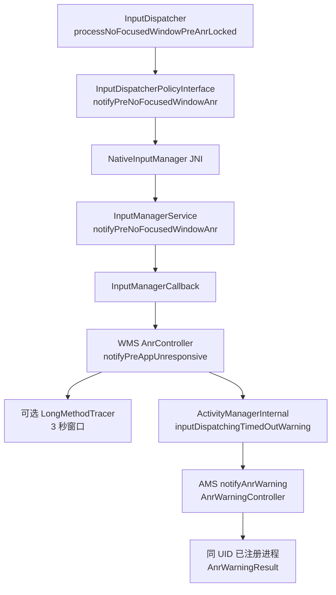

# 9.10 Android 17 Input ANR 与 pre-ANR 实现

源码锚点为 Android 17 / API 37 / `android-17.0.0_r1`。InputDispatcher 的 pre-ANR 覆盖范围需要先明确：

- Android 17 的 InputDispatcher pre-ANR 目前只覆盖 **no focused window**；
- 已有窗口迟迟不确认输入事件的 **window unresponsive** 路径没有对应的 InputDispatcher pre-ANR producer；
- pre-ANR 受 feature flag 控制，是到期前的 best-effort warning；
- 正式 ANR 仍由原 deadline、WMS 归因和 AMS/AnrHelper 管线决定。

所以，“输入 ANR 都会在 50% 处收到预警”“收到预警的进程一定成为 ANR 责任方”都不成立。

## 1. 两类输入 ANR 要分开

InputDispatcher 处理的两类超时共享“输入没有按期完成”这个表象，计时对象却不同。

| 路径 | 开始条件 | 计时状态 | 到期对象 | Android 17 pre-ANR |
|---|---|---|---|---|
| no focused window | 有 focused application，没有 focused window，并出现需要焦点目标的事件 | `mNoFocusedWindowAnrState` | `InputApplicationHandle` | 有，flag 开启时生效 |
| window unresponsive | 事件已发给窗口或 input monitor，连接 wait queue 长时间没有完成 | `mAnrTracker` + `Connection.waitQueue` | window/input monitor connection | 当前实现没有 |

### 1.1 no focused window

`findFocusedWindowTargetLocked()` 只有在事件需要焦点目标时才启动这次倒计时。源码注释以 KeyEvent 为例。若 focused application 和 focused window 都为空，事件直接失败；若窗口已存在，则走正常派发。

状态首次建立时保存：

- 输入事件的 `eventTime` 与 `eventId`；
- 当前 focused application；
- `timeoutEndTime`；
- 本次实际 `timeoutDuration`；
- `notifiedPreAnr = false`。

实际 timeout 来自 `focusedApplicationHandle->getDispatchingTimeout(DEFAULT_INPUT_DISPATCHING_TIMEOUT)`，所以不能假设每次都是 5 秒。应用焦点改变、窗口出现或其他重置条件发生时，InputDispatcher 会清除这次等待。

### 1.2 window unresponsive

窗口已有 connection 后，InputDispatcher 把等待确认的 `DispatchEntry` 放进 wait queue，并用 `mAnrTracker` 快速找到最近 deadline。到期后，它取 connection wait queue 的最老事件来构造诊断 reason。

源码特意说明：最老事件未必就是最早达到 deadline 的事件，因为窗口 timeout 可能变化；但应用通常按顺序处理输入，用最老事件解释现场更有诊断价值。因此 reason 中的 event 与精确触发 deadline 的 entry 不一定相同。

## 2. `dispatchOnce()` 里的两次检查

Android 17 在每次 dispatcher loop 末尾计算下一次唤醒时刻。相关源码结构如下：

```cpp
nextWakeupTime = std::min({
        nextWakeupTime,
        processPreAnrsLocked(),
        processAnrsLocked()
});
```

这不是 UI frame 概念。两个函数在一次 `dispatchOnce()` 迭代中、持有 dispatcher lock 时执行，返回值用于决定 `pollOnce()` 何时醒来。

`processPreAnrsLocked()` 当前只有一个具体分支：

```cpp
nsecs_t InputDispatcher::processPreAnrsLocked() {
    if (!mAnrWarningCallbackInputDispatcherEnabled) {
        return LLONG_MAX;
    }
    return std::min(
            nsecs_t{LLONG_MAX},
            processNoFocusedWindowPreAnrLocked());
}
```

这段实现提供未来增加其他 pre-ANR 类型的入口，但 `android-17.0.0_r1` 没有 window-unresponsive pre-ANR helper。`mAnrWarningCallbackInputDispatcherEnabled` 的初始值来自 `enable_anr_warning_callback_input_dispatcher` flag。

## 3. pre-ANR 时间公式

no-focused-window 的 warning 时刻由下面的公式决定：

```text
pre_window = max(actual_timeout / 2, 2000 ms × HwTimeoutMultiplier)
warning_at = timeout_end - pre_window
consumed   = actual_timeout - (timeout_end - now)
```

`IInputConstants.aidl` 把未乘硬件系数的最小 pre-ANR window 定为 **2000 ms**。默认 dispatch timeout 是 **5000 ms**。两项 fallback 常量都乘 `HwTimeoutMultiplier()`，该值来自产品配置的 `ro.hw_timeout_multiplier`。

`max` 选出更长的“deadline 前剩余窗口”，因此 warning 会更早。它保证默认情况下留出的诊断时间不少于 2 秒，并不用于推迟 warning。

以 `HwTimeoutMultiplier = 1` 为例：

| 实际 timeout | `timeout / 2` | 最小 pre window | warning 已消耗时间 |
|---:|---:|---:|---:|
| 5000 ms | 2500 ms | 2000 ms | 2500 ms |
| 3000 ms | 1500 ms | 2000 ms | 1000 ms |
| 1000 ms | 500 ms | 2000 ms | 首次检查时立即满足 |

默认 5 秒路径恰好在一半附近发 warning。自定义 timeout 较短时，warning 比 50% 更早；计算出的 `warning_at` 已经过期时，InputDispatcher 会立即排队通知。

`notifiedPreAnr` 保证同一 `mNoFocusedWindowAnrState` 只排队一次。状态被重置后，新事件可以开始新的预警周期。

## 4. pre-ANR 会直接到达公开 warning API

旧资料常把 Native pre-ANR 和 `ActivityManager.registerAnrWarningListener()` 写成两套无关机制。Android 17 源码给出了直接调用关系。



`AnrController.notifyPreAppUnresponsive()` 先解析 `InputApplicationHandle` 对应的 Activity。Activity 不存在、已 stopped 或没有进程时，部分动作会被跳过。存在进程时，AMS warning 使用：

- UID：候选 Activity 的 UID；
- `anrId`：Native 输入事件 id；
- type：`ANR_TYPE_INPUT_DISPATCH_NO_FOCUSED_WINDOW`；
- consumed time：InputDispatcher 计算的已消耗时间；
- timeout：本次实际 timeout；
- description：Android 17 该调用点传空字符串。

`AnrWarningController` 再向该 UID 下已经注册 listener 的进程投递。warning payload 没有 PID 或 Activity token；多进程 App 应按 `(type, id, boot/session)` 去重。

公开 API、11 个类型和载荷字段见 [9.9 Android 17 ANR 预警回调](09-android17-anr-warning-callback.md)。

## 5. warning 时可选的 Long Method Trace

WMS 的 `enableInputDispatcherLongMethodTracing` flag 开启时，pre-ANR 还会尝试调用 `LongMethodTracer.trigger(pid, 3000)`。`LongMethodTracer` 自身又受 `com.android.server.utils` 的 `longMethodTrace` flag 控制，所以这是双重条件下的 best-effort 诊断。

目标 PID 的选择有两种：

1. 当前 focus holder 已持有焦点至少一个 dispatch timeout 时，WMS 可把它视为阻碍焦点切换的候选目标；
2. 没有这样的 focus target 时，使用缺少 focused window 的 Activity 进程。

`LongMethodTracer` 通过 native signal-based mechanism 请求固定时长的方法追踪。类注释写明，若目标进程在 tracing window 内或之后发生 ANR，采集信息会进入 ANR report。触发返回 `false`、进程退出或 flag 关闭都可能让产物缺失。

warning callback 与 Long Method Trace 是并列动作。应用收到 callback 不表示追踪已经成功，追踪成功也不保证 App listener 存在。

## 6. 到期路径仍有两条

### 6.1 no focused window 到期

`processAnrsLocked()` 发现当前时间达到 `mNoFocusedWindowAnrState.timeoutEndTime` 后，会重新检查：

- 当前 focused application 是否仍为等待中的 application；
- focused window 是否仍为空。

条件仍成立才调用 `onAnrLocked(application)`。随后 Native policy 回调携带 `eventId`、原事件 `eventTime` 和配置 timeout 进入 Java。

### 6.2 window unresponsive 到期

`mAnrTracker.firstTimeout()` 到期后，InputDispatcher：

1. 取得对应 connection；
2. 标记 `connection->responsive = false`；
3. 从 tracker 移除 token，避免继续为它唤醒；
4. 在 `onAnrLocked(connection)` 中确认 wait queue 仍不为空；
5. 保存 `mLastAnrState`；
6. 通知 policy，并取消该 connection 的 ANR 事件。

这一路没有经过 `processNoFocusedWindowPreAnrLocked()`，所以不能期待 API 37 input warning。

## 7. 正式回调如何进入 AMS

两条到期路径都经过 NativeInputManager JNI 回到 `InputManagerService`：

| Java 入口 | `TimeoutRecord` kind | 附带对象 |
|---|---|---|
| `notifyNoFocusedWindowAnr()` | `INPUT_DISPATCH_NO_FOCUSED_WINDOW` | application handle |
| `notifyWindowUnresponsive()` | `INPUT_DISPATCH_WINDOW_UNRESPONSIVE` | input token、可选 PID、reason |

`InputManagerService.timeoutMessage()` 还会用 `SurfaceControl.getStalledTransactionInfo(pid)` 检查关联 surface 是否因 unsignaled fence 卡住。命中时，reason 会补充 layer、buffer id 和 frame number，提示可能存在 GPU hang。这仍是诊断上下文，WMS/AMS 要继续完成责任进程解析。

## 8. `TimeoutRecord` 与 `ExpiredTimer` 的准确关系

Android 17 在 `includeAnrInfo` flag 开启时，对两条正式输入 ANR路径执行：

```java
AnrTimer.ExpiredTimer expiredTimer =
        new AnrTimer.ExpiredTimer(
                eventId,
                eventTimeNs / 1_000_000,
                timeoutDurationMs);
timeoutRecord.setExpiredTimer(expiredTimer);
```

这里复用了 `AnrTimer.ExpiredTimer` 作为三字段数据载体：

- `mTimerId`：输入 event id；
- `mStartMs`：输入 event time 转为毫秒；
- `mDurationMs`：本次传入的 timeout duration。

输入 deadline 仍由 InputDispatcher 的 `mNoFocusedWindowAnrState` 或 `mAnrTracker` 驱动，不是由 Java `AnrTimer` 启动的 native timer。

两条路径的 duration 口径也不同：

- no focused window 传配置的 timeout threshold；
- window unresponsive 传 wait queue 最老 entry 截止 `onAnrLocked()` 的实际等待时长。

后续 `ProcessErrorStateRecord.createAnrInfo()` 读取这个对象，生成 API 37 `ApplicationExitInfo.AnrInfo`。`includeAnrInfo` 关闭时不影响 ANR 检测，只会失去这份结构化关联数据。

## 9. WMS 归因可能改变责任进程

no-focused-window warning 先投给候选 Activity UID。到期后，`AnrController.notifyAppUnresponsive()` 还会查看当前 input focus。

若当前 focus target 的 focus request age 已达到其 dispatch timeout，WMS 会尝试把正式 window-unresponsive 责任交给该 focus target；否则沿原 Activity 处理。pre-ANR 的可选 long method trace 也使用相同方向挑选候选 PID。

这带来一个平台关联边界：

- warning 的 `(type, id)` 属于原 Activity UID；
- 正式 ANR 可能归到另一个 PID/UID；
- 同 UID 内可用 `ApplicationExitInfo.AnrInfo` 关联；
- 跨 UID 改归因时，普通 App 端无法读取另一方退出历史。

系统/OEM 平台应保留 event id、原 application token、focus target 和归因决策。普通 App APM 只能把未匹配 warning 标成 recovered、unmatched 或 possible-reattribution，不能强制配给本进程。

## 10. AMS 与 AnrHelper

WMS 解析出 Activity 或 PID 后，调用 `ActivityManagerInternal.inputDispatchingTimedOut()`。AMS：

- 要求调用方具有 `FILTER_EVENTS`；
- 按 PID 查 `ProcessRecord`；
- 调试中的进程不进入标准 ANR；
- active instrumentation 会收到取消结果；
- 其他有效进程交给 `mAnrHelper.appNotResponding()`。

普通 persistent process 没有“天然跳过输入 ANR”的通用分支。是否显示 UI、是否静默杀进程、栈转储范围和 DropBox 处理在更后面的 `ProcessErrorStateRecord` 中决定。

这部分完整时序见 [9.1 ANR 设计思想](01-anr-design.md)；线程转储与报告入口见 [9.3 ANR 分析](03-anr-analysis.md)。

## 11. 一条正确的时序

默认 timeout 5 秒、硬件乘数 1、feature flag 全部开启时，no-focused-window 的理想时序是：

```text
T0       发现 focused application 存在，但 focused window 为空
T0+2.5s  InputDispatcher 排队 pre-ANR
          ├─ WMS 可选触发 3s Long Method Trace
          └─ AMS 向已注册 UID 投递 AnrWarningResult
T0+5.0s  InputDispatcher 重新检查 application 与 window
          └─ 条件仍成立才进入正式 ANR 归因
T0+5.0s+ WMS / AMS / AnrHelper 处理栈、报告、UI 或 kill
```

这条时间线有四个误差来源：

- dispatcher 或 system_server 调度延迟；
- JNI、WMS global lock 和 Binder 回调耗时；
- App listener executor 排队；
- timeout 自定义值和硬件乘数。

若系统在 warning_at 之后才得到运行机会，pre warning 与正式 ANR 可以非常接近。公开回调没有“至少剩余 N 毫秒”的 SLA。

## 12. `2s / 5s / 10s` 不是三级 ANR

Android 17 源码附近还有两个常量：

- `SLOW_EVENT_PROCESSING_WARNING_TIMEOUT = 2s`；
- `STALE_EVENT_TIMEOUT = 10s × HwTimeoutMultiplier()`。

它们不能和 5 秒 dispatch timeout 排成“2 秒预警、5 秒 ANR、10 秒丢弃”的统一状态机：

- slow-event warning 用于记录事件处理过慢的日志；
- pre-ANR 的 2 秒指 deadline 前最小剩余 window；
- stale-event timeout 判断进入 dispatcher 的事件是否已经太旧；
- 正式 dispatch timeout 可来自 window/application 配置，不固定为 5 秒。

名称相近不代表同一计时对象。

## 13. Trace 与日志如何对齐

Android 17 在这些位置留下系统 trace 标记：

- Native policy JNI 回调使用 `ATRACE_CALL()`；
- WMS pre 路径使用 `notifyPreAppUnresponsive()` trace section；
- `LongMethodTracer.trigger()` 使用 ActivityManager trace tag；
- AMS 正式路径使用 `inputDispatchingTimedOut()`；
- 有目标 callback 时，`AnrWarningController` 还会发出带 id 的 Perfetto instant。

分析时按以下顺序对齐：

1. 找 warning 的 `(anrType, anrId)` 与 callback uptime；
2. 找 WMS `notifyPreAppUnresponsive()` 和可选 long-method trace；
3. 检查 T0 到 deadline 期间 focused application/window 的变化；
4. 找 `inputDispatchingTimedOut()` 与 ANR report 的 ErrorId；
5. 用 main thread、Binder、fence、CPU 和 I/O 时间轴判断为何窗口没有出现。

Perfetto 没有固定的 `/data/anr` 自动产物。需要预配置持续 trace、triggered trace 或 Profiling trigger，详见 [9.7 ANR 与 Kernel Trace 联合诊断](07-anr-kernel-trace-joint-diagnosis.md)。

## 14. 工程接入建议

### 普通 App

- 用 API 37 SDK 编译，并用 `SDK_INT >= 37` 保护 warning listener；
- listener 使用独立 executor，只复制小型内存快照；
- 用 `(type, id, boot/session)` 去重多进程回调；
- 记录 callback 到达时间，不能把它当作 Native warning 精确时刻；
- 下次启动读取 `ApplicationExitInfo.AnrInfo`，允许 warning 无 exit、exit 无 warning；
- 保留 Activity/页面/启动阶段 breadcrumbs，帮助解释 no-focused-window。

### 系统与 OEM

- 分别验证 input warning、long method tracing 和 `includeAnrInfo` 三组 flag；
- 在事件日志中保存 original activity、focus target、最终 blamed target；
- 记录 warning 生成、AMS 投递、listener 接收的三段延迟；
- 测试自定义 dispatch timeout、硬件乘数和锁拥塞；
- 对 trace 失败、PID 已退出和跨 UID 改归因保留明确状态。

### 测试用例

至少覆盖：

- Activity 已成为 focused application，但延迟添加窗口；
- 窗口在 warning 后、deadline 前出现；
- focused application 在倒计时期间切换；
- 当前 focus holder 长时间阻碍新 focus；
- 已有窗口不确认输入事件，确认不会收到 no-focus warning；
- warning listener 多进程重复；
- flag 分别关闭；
- deadline 前 system_server 被 CPU 或锁延迟；
- `ApplicationExitInfo.AnrInfo` 存在与缺失两条分支。

## 15. 版本边界

| 平台 | 已核对结论 |
|---|---|
| Android 14—16 | 不能从对应 release tag 找到这套 `processPreAnrsLocked()` / no-focus warning 实现 |
| Android 17 / API 37 | 增加 InputDispatcher no-focus pre-ANR、公开 warning 投递、可选 long method tracing 与 input `AnrInfo` 载荷 |

输入 timeout、WMS 归因和 ANR 主路径在更早版本已经存在，但 Android 17 的 pre-warning 行为不能倒推到 Android 14—16。

## 16. 结论

Android 17 给 no-focused-window 输入 ANR 增加了一次 deadline 前机会：

1. InputDispatcher 根据实际 timeout 计算 warning_at；
2. warning 经 JNI 和 WMS 直接进入 AMS 公开 warning 管线；
3. WMS 可按 flag 触发 3 秒 Long Method Trace；
4. deadline 到期后重新检查焦点状态，再决定正式 ANR；
5. `TimeoutRecord` 携带 input event id，支持后续 `ApplicationExitInfo.AnrInfo` 关联。

这套机制没有覆盖 window-unresponsive pre-warning，也不保证 callback 领先 deadline 固定时长。诊断系统应把 warning、可选 trace、正式归因和退出记录看作四份可缺失证据。

## 参考资料

- [AOSP `InputDispatcher.cpp`（android-17.0.0_r1）](https://android.googlesource.com/platform/frameworks/native/+/refs/tags/android-17.0.0_r1/services/inputflinger/dispatcher/InputDispatcher.cpp)
- [AOSP `InputDispatcher.h`（android-17.0.0_r1）](https://android.googlesource.com/platform/frameworks/native/+/refs/tags/android-17.0.0_r1/services/inputflinger/dispatcher/InputDispatcher.h)
- [AOSP `InputDispatcherPolicyInterface.h`（android-17.0.0_r1）](https://android.googlesource.com/platform/frameworks/native/+/refs/tags/android-17.0.0_r1/services/inputflinger/dispatcher/include/InputDispatcherPolicyInterface.h)
- [AOSP `IInputConstants.aidl`（android-17.0.0_r1）](https://android.googlesource.com/platform/frameworks/native/+/refs/tags/android-17.0.0_r1/libs/input/android/os/IInputConstants.aidl)
- [AOSP NativeInputManager JNI（android-17.0.0_r1）](https://android.googlesource.com/platform/frameworks/base/+/refs/tags/android-17.0.0_r1/services/core/jni/com_android_server_input_InputManagerService.cpp)
- [AOSP `InputManagerService.java`（android-17.0.0_r1）](https://android.googlesource.com/platform/frameworks/base/+/refs/tags/android-17.0.0_r1/services/core/java/com/android/server/input/InputManagerService.java)
- [AOSP WMS `InputManagerCallback.java`（android-17.0.0_r1）](https://android.googlesource.com/platform/frameworks/base/+/refs/tags/android-17.0.0_r1/services/core/java/com/android/server/wm/InputManagerCallback.java)
- [AOSP WMS `AnrController.java`（android-17.0.0_r1）](https://android.googlesource.com/platform/frameworks/base/+/refs/tags/android-17.0.0_r1/services/core/java/com/android/server/wm/AnrController.java)
- [AOSP `ActivityManagerService.java`（android-17.0.0_r1）](https://android.googlesource.com/platform/frameworks/base/+/refs/tags/android-17.0.0_r1/services/core/java/com/android/server/am/ActivityManagerService.java)
- [AOSP `TimeoutRecord.java`（android-17.0.0_r1）](https://android.googlesource.com/platform/frameworks/base/+/refs/tags/android-17.0.0_r1/core/java/com/android/internal/os/TimeoutRecord.java)
- [AOSP `LongMethodTracer.java`（android-17.0.0_r1）](https://android.googlesource.com/platform/frameworks/base/+/refs/tags/android-17.0.0_r1/services/core/java/com/android/server/utils/LongMethodTracer.java)
- [Android Developers：`ActivityManager.registerAnrWarningListener()`](<https://developer.android.com/reference/android/app/ActivityManager#registerAnrWarningListener(java.util.concurrent.Executor,java.util.function.Consumer)>)
