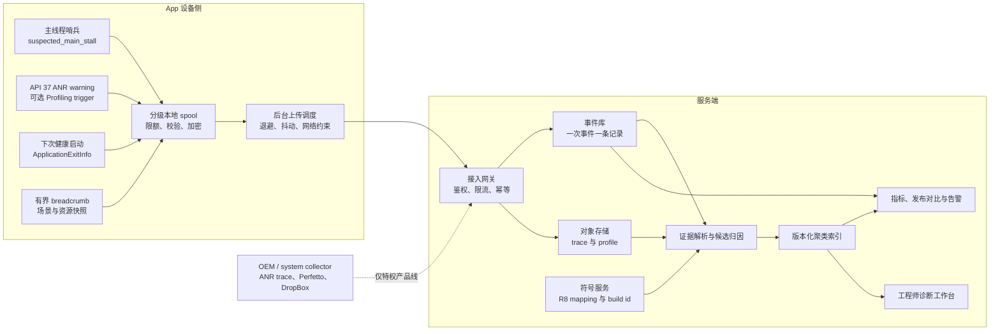

# 9.11 企业级 ANR 监控平台架构设计


平台源码固定在 Android 17 / API 37 / `android-17.0.0_r1`。Android 8—17 都能使用低成本主线程哨兵和应用内 breadcrumbs；系统确认、退出历史和触发式 profiling 必须按 API 与权限分层。

企业级平台最容易犯的错误，是把“应用观察到主线程迟迟没有响应”“system_server 宣告 ANR”“进程因 ANR 退出”记成同一种事件。三者的时刻、证据强度和覆盖范围都不同。数据模型若不保留来源，后端再复杂也无法恢复事实边界。

## 1. 先定义平台要回答的问题

一套可维护的 ANR 平台应回答五类问题：

1. 哪个版本、设备、进程和业务场景的 ANR 率发生变化？
2. 事件由系统确认，还是端侧哨兵推测？
3. 主线程在超时窗口内执行、排队或等待什么？
4. 消耗者、受害者和依赖方分别是谁？
5. 修复发布后，同口径事件率和原签名是否下降？

平台不承诺仅凭一份静态主线程栈自动给出代码根因。锁持有者、Binder 服务端、CPU 争用、I/O 和 GPU 阻塞往往位于另一个线程或进程。平台应输出证据、候选解释和缺失材料，让工程师知道下一次取证要补什么。

## 2. 四级采集能力必须分开

| 能力层级 | 可用信号 | 能确认什么 | 权限与版本边界 |
|---|---|---|---|
| 普通 App，Android 8—17 | 主线程哨兵、受控栈采样、breadcrumb、StrictMode、业务 trace section | App 进程内出现长消息或主线程迟滞 | 只能标记疑似卡顿；没有 system_server 的超时原因 |
| 普通 App，Android 11+ | `ApplicationExitInfo`、可能存在的 ANR trace | 进程退出原因、退出时间、进程名及系统保留的 trace | API 30+；trace 可能为空或被覆盖；未退出的 ANR 不一定形成记录 |
| 普通 App，Android 17 | ANR warning、`ApplicationExitInfo.AnrInfo`；预注册的 Profiling trigger | 部分计时器的 deadline 前 warning、结构化 ANR 类型和关联 id | API 37；受 feature flag、producer 覆盖和系统限流影响 |
| system/OEM、root 或 userdebug | `/data/anr`、DropBox、完整 logcat、statsd、bugreport、持续 Perfetto | 系统级依赖、其他 UID、调度/I/O/Binder 现场 | 需要平台签名、SELinux 策略、`DUMP` 等权限或调试环境 |

设备所有者、工作资料管理员或 MDM Agent 不会因为“企业管理”身份自动取得 `DUMP`、跨 UID logcat 或 `/data/anr` 读取权限。若产品要求完整系统现场，需要 OEM 系统组件和明确的 SELinux/权限设计，不能把这项能力藏在普通 SDK 接口后面。

## 3. Android 17 上三类官方入口

### 3.1 `ProcessErrorStateInfo` 是瞬时状态

`ActivityManager.ProcessErrorStateInfo` 在 Android 17 只有这些有效字段：

| 字段 | 语义 |
|---|---|
| `condition` | `NO_ERROR`、`CRASHED` 或 `NOT_RESPONDING` |
| `processName`、`pid`、`uid` | 当前错误进程身份 |
| `tag` | 相关 Activity，可能为空 |
| `shortMsg`、`longMsg` | 人类可读错误描述 |
| `stackTrace` | 可能为空；AOSP ANR 路径生成该对象时传入 `null` |
| `crashData` | Android 17 始终为空，注释已标记待废弃 |

它没有 `state`、`startTime`、`importance`、`oomAdj`、`foregroundActivities`、`crashInfo`、`threadStats` 或主线程对象。解析器访问这些字段无法通过 Android SDK 编译。

`getProcessesInErrorState()` 只返回调用时仍处于错误状态的进程，正常时返回 `null`。Android 13 / API 33 起，普通 App 只能看到本 UID 的进程；持有 `DUMP` 的系统组件才能跨 UID。轮询还会反复读到同一次 ANR，并可能错过很快恢复或被杀的进程，所以它适合作为补充信号，不适合作为唯一事件账本。

### 3.2 `ApplicationExitInfo` 是退出历史

Android 11 / API 30 起，`ActivityManager.getHistoricalProcessExitReasons()` 返回最近的进程退出记录。`REASON_ANR` 是系统给出的强证据，记录还提供：

- `processName`、PID、UID 与退出时间；
- 退出前最近一次采样的 importance、PSS 和 RSS；
- 人类可读的 `description`；
- App 预先写入的最多 128 字节 `processStateSummary`；
- 可能存在的 `getTraceInputStream()`。

PSS/RSS 可能为 0，也不代表退出瞬间值。`description` 的格式没有稳定保证，只能保留原文或做容错辅助分类。ANR trace 位于系统全局循环存储中，可能被后来的事件覆盖。

还有一个容易遗漏的边界：进程发生 ANR 后恢复，稍后因其他原因退出时，退出记录仍可能带着早先的 ANR trace。因此 `trace != null` 不能覆盖 `getReason()`；平台需要分别保存 `exit_reason` 和 `artifact_kind`。

下面的 Kotlin 代码只查询本包最近的系统 ANR 退出，并使用复合 key 避免把 PID 当成永久身份：

```kotlin
@RequiresApi(Build.VERSION_CODES.R)
data class AnrExitKey(
    val timestampMs: Long,
    val processName: String,
    val pid: Int,
    val reason: Int,
)

@RequiresApi(Build.VERSION_CODES.R)
fun queryNewAnrExits(
    context: Context,
    recentKeys: Set<AnrExitKey>,
): List<Pair<AnrExitKey, ApplicationExitInfo>> {
    val activityManager =
        context.getSystemService(ActivityManager::class.java)

    return activityManager
        .getHistoricalProcessExitReasons(context.packageName, 0, 32)
        .asSequence()
        .filter { it.reason == ApplicationExitInfo.REASON_ANR }
        .map { info ->
            AnrExitKey(
                timestampMs = info.timestamp,
                processName = info.processName,
                pid = info.pid,
                reason = info.reason,
            ) to info
        }
        .filter { (key, _) -> key !in recentKeys }
        .toList()
}
```

查询应在后台线程执行。平台要先把字段和复合 key 写入有界本地存储，再推进游标；反过来会在进程再次退出时丢事件。trace stream 也应在后台按字节上限复制，读取失败或返回 `null` 都属于正常分支。

### 3.3 Android 17 warning 与结构化 `AnrInfo`

Android 17 的 `ActivityManager.registerAnrWarningListener()` 能在部分 ANR 计时器接近 deadline 时通知同 UID 的已注册进程。warning 是 best-effort 预警，不是系统已经判定 ANR。多进程 App 还可能收到多份同一 warning，应至少按 `(anrType, anrId, boot/session)` 去重。

当 API 37 的 `include_anr_info` 能力可用时，`ApplicationExitInfo.getAnrInfo()` 提供：

- `anrId`；
- `anrType`；
- `timeoutMillis`；
- `isUserPerceptible`。

它能把 warning 与退出记录关联起来。类型和生产者覆盖、注册代码及 `ProfilingManager` 关系见 [9.10 Android 17 ANR 预警回调](10-android17-anr-warning-callback.md)。没有 `AnrInfo` 时，平台保留 `unknown`，不要从 description 文本硬造官方类型。

## 4. 正确的主线程哨兵

ANR 不会以 Java `Throwable` 进入 `UncaughtExceptionHandler`。把 ANR 交给 crash handler 检测，结果只会漏报。监测主线程响应通常由后台线程向主 Looper 投递哨兵，再检查回执延迟。

下面的骨架展示一个时刻只保留一个未确认哨兵，避免主线程卡住时继续堆积消息：

```kotlin
class MainThreadSentinel(
    private val mainHandler: Handler,
    private val scheduler: ScheduledExecutorService,
    private val onSuspectedStall: (durationMs: Long, stack: List<StackTraceElement>) -> Unit,
    private val now: () -> Long = SystemClock::uptimeMillis,
) {
    private val pending = AtomicBoolean(false)

    fun start(
        heartbeatMs: Long,
        stallThresholdMs: Long,
        maxStackDepth: Int,
    ) {
        scheduler.scheduleWithFixedDelay({
            if (pending.compareAndSet(false, true)) {
                val postedAt = now()

                mainHandler.post {
                    pending.set(false)
                }

                scheduler.schedule({
                    if (pending.get()) {
                        val stack = mainHandler.looper.thread
                            .stackTrace
                            .take(maxStackDepth)
                        onSuspectedStall(now() - postedAt, stack)
                    }
                }, stallThresholdMs, TimeUnit.MILLISECONDS)
            }
        }, 0, heartbeatMs, TimeUnit.MILLISECONDS)
    }
}
```

这段代码没有在主线程中休眠，也没有无界投递。生产实现还要补前后台门控、启动/停止生命周期、单次事件的有限重复栈、调试器暂停识别、采样开销计数和异常隔离。`onSuspectedStall` 只应向有界内存队列写一个小对象，不能同步序列化、落盘或上传。

哨兵延迟可能来自：

- 主线程正在执行长消息；
- 主线程处于 monitor、Binder、futex 或 I/O 等待；
- 进程整体没有得到 CPU；
- GC、调试器暂停、设备休眠边界或采集器线程延迟。

因此事件名应使用 `suspected_main_stall` 一类弱语义。只有后续匹配到系统 warning、`ProcessErrorStateInfo.NOT_RESPONDING`、`ApplicationExitInfo.REASON_ANR`、Vitals 或 OEM 事件，才提升证据等级。

## 5. Looper 与 Method Trace 的边界

### 5.1 `Looper.setMessageLogging()`

公开 API `Looper.setMessageLogging(Printer)` 能看到每个 message dispatch 的开始和结束，适合在受控样本中记录长消息。它有三项限制：

- Looper 只保存一个 `Printer`，SDK 之间可能互相覆盖；
- 每条消息都经过回调，日志拼接和对象分配会增加主线程开销；
- 它只能解释 message dispatch，无法覆盖 RenderThread、Binder 对端、CPU 调度和 GPU。

SDK 没有公开 getter 可安全取得并链接已有 Printer。量产接入应由宿主统一安装，或限定在内测、采样 cohort 和远程开关中。反射 `Looper` 私有字段或 Hook `dispatchMessage()` 会撞上 hidden API 限制，也会随 ART/framework 实现变化。

### 5.2 栈采样

后台线程调用主线程的 `getStackTrace()` 可以提供低频快照，但它是观察点，不是持续时间证明。相同栈连续出现，可能表示同一函数长期运行，也可能表示线程多次回到同一等待点。

平台应为每个样本保留：

- `elapsedRealtime` 或 `uptimeMillis` 时间；
- 采样间隔与丢样数量；
- Java/ART 状态和可用的 native 状态；
- 栈截断深度；
- 同时段 warning、退出记录或 trace 引用。

持续时间由多个时间点或调度 Trace 确定，不能用“连续五份相同栈”直接计算某个方法执行了五秒。

### 5.3 Method Trace

`Debug.startMethodTracing()` 会显著扰动 VM；官方注释明确提醒 tracing 开启后 VM 运行会变慢。`startMethodTracingSampling()` 开销较低，但仍会占用 buffer、CPU 和存储。二者适合可复现问题、内测或严格限量的远程诊断，不适合全量常开。

Android 15+ 的 `ProfilingManager`、Android 16+ 的系统 trigger 以及 Android 17 的 ANR warning 组合，更适合受系统预算和 redaction 控制的线上取证。产物仍可能因 rate limit、buffer 或设备配置缺失，平台必须接受“有事件但无 profile”。

## 6. 端到端架构

下面的图把弱信号、系统证据、原始附件和服务端派生结论分开：



设备侧只完成有界采集、短期保存和受控上传。服务端保存原始事实，再做符号化、聚类和候选解释。特权采集器是一条显式可选路径，不能影响普通 App schema 的可用性。

## 7. 设备侧要为故障峰值设计

ANR 发生时，主线程已经不可依赖，进程也可能很快被杀。采集器应在平稳期维护小型 ring buffer，记录最近的业务阶段、页面、生命周期、Binder 请求摘要、资源水位和配置版本；故障时只冻结索引和少量元数据。

推荐按证据价值分级：

| 优先级 | 示例 | 存储策略 |
|---|---|---|
| P0 系统证据 | ANR exit、warning key、系统 trace、profile manifest | 独立配额；durable write 成功后才推进游标 |
| P1 疑似事件 | 主线程哨兵与有限重复栈 | 每个进程/场景限频，合并同一 episode |
| P2 上下文 | breadcrumb、资源趋势、普通性能样本 | 环形覆盖；拥塞时优先丢弃 |

上传应在下一次健康启动或系统允许的后台窗口执行。使用 at-least-once 传输和服务端幂等，设备收到成功确认后再删除本地文件。固定整点重试会让大量设备同时请求；退避必须加入随机抖动。

本地 spool 还需要：

- 总容量、单文件大小、文件数和保留时长上限；
- 临时文件到完整文件的提交标记或原子重命名；
- checksum、schema version 和截断恢复；
- 多进程单写者或每进程独立目录；
- 存储不足、密钥不可用和升级失败时的降级策略；
- SDK 自身写入量、CPU、内存、队列高水位和丢弃计数。

通用端侧实现可参考 [19.27 千万级 DAU 的 APM 端侧架构](../../part3-tools/ch19-apm/27-apm-client-architecture.md)；这里仅强调 ANR 的证据优先级。

## 8. 事件 schema 先区分事实与推断

下面是一份最小事件 envelope，用 `authority` 明确证据来源：

```json
{
  "schema_version": 4,
  "event_id": "deterministic-id",
  "event_kind": "system_anr_exit",
  "authority": "application_exit_info",
  "observed_at_ms": 1785380000000,
  "process": {
    "name": "com.example:worker",
    "pid": 24155,
    "importance": 100
  },
  "build": {
    "version_code": 42017,
    "mapping_id": "r8-map-id",
    "platform_tag": "android-17.0.0_r1"
  },
  "anr": {
    "exit_reason": 6,
    "warning_key": "2:1842",
    "user_perceptible": true
  },
  "evidence": [
    {
      "kind": "anr_trace",
      "sha256": "artifact-digest",
      "truncated": false
    }
  ],
  "derived": {
    "cluster_revision": null,
    "hypotheses": []
  }
}
```

`derived` 由服务端版本化任务填写，不能覆盖原字段。`event_kind` 至少要区分：

- `system_anr_exit`；
- `system_anr_current_state`；
- `anr_warning`；
- `suspected_main_stall`；
- `play_vitals_aggregate`；
- `oem_system_anr`。

这些来源可能描述同一事故。关联后仍保留各自记录，通过 `incident_id` 组合展示，避免把 warning、watchdog 和 exit 三次计入系统 ANR 数。

## 9. 去重分成三个层次

### 9.1 传输幂等

同一端侧 envelope 重试时使用稳定 `event_id`。接入网关按租户和 event id 幂等写入；附件以 digest 去重。HTTP 成功响应丢失时，设备可以安全重传。

### 9.2 事故关联

Android 17 warning 与 `ApplicationExitInfo.AnrInfo` 优先用 `(anrType, anrId)` 关联，同时加入 boot/session、UID、版本和时间约束。没有结构化 id 的版本，可用安装实例、进程名、PID、时间邻域和 reason 做概率关联，并保存匹配分数。

watchdog 样本与系统 ANR 匹配后，仍标为端侧采样。它可补充 ANR 前的多份栈，却不能升级为系统生成的 trace。

### 9.3 问题聚类

“同一次事故”和“同一类问题”是两件事。聚类前应完成：

- Java/Kotlin 栈用对应 versionCode 的 R8 mapping 还原；
- native 栈按 ELF build id 选符号；
- 记录主线程卡点、锁持有者或 Binder 服务端；
- 按官方 ANR type、进程角色和前后台分组；
- 对行号、匿名类编号等不稳定字段做有限归一化。

聚类签名要版本化。规则变化时生成 `cluster_revision`，不要静默改写历史数量。过度归一化会把不同锁、不同 Binder 服务或不同业务阶段合在一起；只取栈顶一帧也会把所有 `BinderProxy.transact()` 归成一个问题。

## 10. 候选归因必须携带证据

静态规则可以先做低风险筛选：

| 候选解释 | 支持材料 | 常见反证 |
|---|---|---|
| 主线程计算热点 | 主线程多次处于 Running，CPU 样本集中在同一函数 | 单份栈停在该函数；全机仍有调度延迟 |
| monitor 竞争 | 主线程 `Blocked`，能找到持有者及其栈 | 只有 `Object.wait()`，没有持有关系 |
| Binder 慢调用 | 主线程 Binder wait，flow 指向慢服务端 | 只有 `BinderProxy.transact()` 栈，没有 transaction/reply 时间 |
| I/O 或 reclaim | D 状态区间、I/O/memory PSI、文件系统或 block 事件重合 | 只有 iowait 或 fault 计数 |
| CPU 争用 | 主线程 Runnable 延迟、同 cpuset 消耗者、CPU PSI | 只看 load average |
| GPU/渲染阻塞 | BufferQueue/fence/RenderThread/SurfaceFlinger 时间轴 | 只有主线程空闲栈 |

每条 hypothesis 至少保存 `supporting_evidence[]`、`contradictions[]`、`missing_evidence[]` 和置信度版本。工程师修正候选后，可以把结果变成带审计记录的标签。

机器学习应放在已有稳定 schema、符号化和人工标签之后。训练前要处理版本泄漏、同一事故重复样本、类别不均衡和线上分布漂移。模型适合给候选排序或发现新簇，不应直接修改工单归属、自动回滚或生成未经审查的代码修复。

## 11. 指标与告警口径

自建平台与 Google Play Android vitals 的数据来源和分母不同，不能合成一条“ANR 率”。至少分别维护：

- 系统确认 ANR 的 occurrence rate；
- 受影响用户率；
- user-perceived ANR 率；
- warning 后恢复率；
- suspected stall 率；
- trace/profile 可用率；
- 符号化成功率；
- 事件到达延迟和重复率。

告警应同时考虑基线差异、样本量、发布 cohort 和新签名影响范围。一个新版本只有几十个会话时，单个事件的百分比波动很大；一个成熟版本总率稳定，也可能出现影响支付或启动的新 P0 签名。

推荐告警条件由四部分组成：

1. 同口径率相对历史或对照版本发生变化；
2. 受影响用户、会话或关键业务量达到最小样本；
3. 变化集中在明确版本、设备、进程或 cluster；
4. 证据质量足以支持分派，或告警文本明确列出待补材料。

告警通知只是入口。工作台应展示原始字段、符号化栈、时间关系、相似版本、关联 warning/exit/trace 和分析器版本，让值班人员能复核。

## 12. 服务端可靠性与容量

平台可采用队列、流处理、列式分析库和对象存储，但组件名称应由流量、查询与团队运维能力决定。ANR 数据的可靠性依赖契约：

- 接入网关校验 schema、租户、大小、压缩格式和 digest；
- 消息消费允许重复，写入使用幂等 key；
- 原始附件写对象存储，事件库只保存 manifest；
- 符号服务按 mapping id/build id 查找，不按版本名猜测；
- 解析失败进入可重放队列，保留 parser version 和原始输入；
- 聚类、指标和告警都能按版本重算；
- 租户配额和背压不能让一个异常 App 挤占其他团队容量。

跨区域部署前应定义 RPO、RTO、数据驻留、密钥边界和故障时的功能等级。告警查询可以暂时降级到较旧快照；原始事件接入和 durable spool 通常优先级更高。对象附件丢失与指标延迟也要成为平台自身告警。

## 13. 隐私、安全与远程诊断

ANR trace、breadcrumb、URL、文件路径、Intent、数据库语句和线程名都可能包含用户或业务敏感信息。采集前要完成字段级分类：

- 设备侧尽量只保存枚举化 scene id，服务端再映射名称；
- URL 去除 query、fragment 和用户路径段；
- 不上传输入文本、账号、token、完整 Intent extras；
- `setProcessStateSummary()` 只有 128 字节，也不得写 PII；
- R8 mapping、native symbols 和原始 trace 使用独立访问权限；
- 设置保留周期、删除流程、下载审计和工单授权。

远程诊断配置需要签名、版本号、TTL、目标 cohort、采样上限、文件上限和总 CPU/存储预算。客户端只执行预编译 allowlist 能力，不能接受任意 shell、任意文件路径或反射类名。配置服务不可用时使用本地安全默认值，并保留总 kill switch。

TLS 版本、密钥轮换和数据驻留应跟随产品最低 Android 版本及组织安全规范配置，不宜在架构文档中用一个固定数字替代兼容性测试。

## 14. 验证组合

平台上线前需要一个可重复的故障 App，覆盖：

| 用例 | 要核对的结果 |
|---|---|
| 主线程 CPU 循环 | watchdog 样本、system ANR、CPU/Perfetto 证据能否关联 |
| 主线程 monitor 等待 | 是否找到持有者，避免只报 `Blocked` |
| 同步 Binder 等待 | 客户端与服务端是否进入同一 incident |
| 文件 I/O、swap/reclaim 压力 | PSI、D 状态和 I/O 事件是否同窗 |
| 广播、Service、ContentProvider 超时 | 主线程哨兵缺失时，系统类型仍能入库 |
| ANR 后恢复 | warning/watchdog 保留，退出历史可能暂时没有 REASON_ANR |
| ANR 后被杀 | `ApplicationExitInfo`、trace 可空分支和游标恢复 |
| 多进程 App | warning 重复、processName、独立 spool 和事故去重 |
| 离线与上传响应丢失 | 本地保留、退避、幂等和附件 digest |
| trace 被环形存储覆盖 | 事件仍可查询，证据缺口明确显示 |

版本组合至少包含 API 26、29、30、33、37，设备组合覆盖低内存、不同页大小、主流厂商 user build 和一台 userdebug。调试器连接会改变 ANR 行为，正式用例不能只在 Android Studio debugger 下执行。

SDK 自身还要测：

- 主线程入口的 P50/P95/P99.9；
- 空闲与故障期间的 CPU、分配、线程、wakeups、I/O 和流量；
- spool 损坏恢复、磁盘满、密钥失效和升级；
- 与 crash SDK、Looper Printer、ProfilingManager listener 的共存；
- 远程配置失效、撤销和极端采样指令；
- 平台 SDK 引入后的 crash、ANR、OOM 和耗电回归。

## 15. 建设顺序

工程上可按证据价值推进：

1. 定义 authority、event id、版本和隐私字段，建立原始事件库。
2. Android 11+ 接入 `ApplicationExitInfo`；Android 8—10 保持未知退出边界。
3. 加入有界 breadcrumb 与主线程哨兵，只产出疑似事件。
4. 完成 R8/native 符号服务、复合去重和版本化聚类。
5. 接入 Android vitals 与发布维度，建立同口径回归告警。
6. Android 17 加入 warning/`AnrInfo`，Android 16+ 按预算加入 Profiling trigger。
7. 有 OEM 权限的产品线再接系统 trace、DropBox 和 Perfetto，并使用独立 capability 标记。
8. 积累人工确认标签后评估候选排序模型。

这个顺序让每一阶段都能提供可复核价值，也避免在原始事件和符号化尚不稳定时投入预测模型。

## 16. 结论

企业级 ANR 平台的可靠性来自三项约束：

- 普通 App、API 37 新能力和 OEM 特权采集严格分层；
- 系统事实、端侧疑似信号和服务端推断分别存储；
- 每条归因都能回到对应时间窗、栈、调度或依赖证据。

`ProcessErrorStateInfo` 适合观察当前状态，`ApplicationExitInfo` 适合恢复退出历史，Android 17 warning 适合提前冻结轻量上下文，Perfetto/Profiling 适合补时间轴。它们相互补充，没有单一入口覆盖全部 ANR。

更完整的 ANR 捕获边界见 [19.24 崩溃与 ANR 捕获机制](../../part3-tools/ch19-apm/24-crash-anr-internals.md)，系统触发和分析路径见 [9.1 ANR 设计思想](01-anr-design.md)、[9.3 ANR 分析](03-anr-analysis.md)、[9.8 Kernel Trace 联合诊断](08-anr-kernel-trace-joint-diagnosis.md) 与 [9.13 CPU 数据分析](13-anr-log-cpu-analysis-methodology.md)。

## 参考资料

- [Android Developers：`ApplicationExitInfo`](https://developer.android.com/reference/android/app/ApplicationExitInfo)
- [Android Developers：`ActivityManager.getHistoricalProcessExitReasons()`](<https://developer.android.com/reference/android/app/ActivityManager#getHistoricalProcessExitReasons(java.lang.String,int,int)>)
- [Android Developers：ANR 与 Android vitals](https://developer.android.com/topic/performance/vitals/anr)
- [Android Developers：`Looper.setMessageLogging()`](https://developer.android.com/reference/android/os/Looper#setMessageLogging(android.util.Printer))
- [Android Developers：sampling method trace](<https://developer.android.com/reference/android/os/Debug#startMethodTracingSampling(java.lang.String,int,int)>)
- [AOSP `ActivityManager.java`（android-17.0.0_r1）](https://android.googlesource.com/platform/frameworks/base/+/refs/tags/android-17.0.0_r1/core/java/android/app/ActivityManager.java)
- [AOSP `ActivityManagerService.java`（android-17.0.0_r1）](https://android.googlesource.com/platform/frameworks/base/+/refs/tags/android-17.0.0_r1/services/core/java/com/android/server/am/ActivityManagerService.java)
- [AOSP `ApplicationExitInfo.java`（android-17.0.0_r1）](https://android.googlesource.com/platform/frameworks/base/+/refs/tags/android-17.0.0_r1/core/java/android/app/ApplicationExitInfo.java)
- [AOSP `ProcessErrorStateRecord.java`（android-17.0.0_r1）](https://android.googlesource.com/platform/frameworks/base/+/refs/tags/android-17.0.0_r1/services/core/java/com/android/server/am/ProcessErrorStateRecord.java)
- [AOSP `Looper.java`（android-17.0.0_r1）](https://android.googlesource.com/platform/frameworks/base/+/refs/tags/android-17.0.0_r1/core/java/android/os/Looper.java)
- [AOSP `Debug.java`（android-17.0.0_r1）](https://android.googlesource.com/platform/frameworks/base/+/refs/tags/android-17.0.0_r1/core/java/android/os/Debug.java)
- [AOSP Profiling `ProfilingManager.java`（android-17.0.0_r1）](https://android.googlesource.com/platform/packages/modules/Profiling/+/refs/tags/android-17.0.0_r1/framework/java/android/os/ProfilingManager.java)
