# Bluetooth 扫描与连接功耗分析

“蓝牙开着”只描述了开关状态，无法解释一次功耗异常。Bluetooth controller（蓝牙控制器，通常包含芯片和固件）可以处于 idle（空闲），也可能正在扫描、广播、建立链路、传输音频或反复重连。应用进程的回调频率、系统为 UID（应用用户标识）记录的扫描时间、controller 的 Tx/Rx（发送/接收）时间和整机电量，是四种不同证据。

源码锚点为 Android 17 / API 37 和 AOSP `android-17.0.0_r1`，分析沿 BLE（Bluetooth Low Energy，低功耗蓝牙）扫描与 GATT（Generic Attribute Profile，通用属性配置文件）连接两条路径展开。诊断目标是回答五个问题：谁发起、持续多久、系统采用了什么扫描或连接参数、controller 是否持续工作、应用在业务结束后是否停止活动。

## 11.4.1 先确定哪类 Bluetooth 活动在耗电

Bluetooth 相关活动至少分为五类：

| 活动 | 主要成本 | 常见应用问题 | 优先证据 |
|---|---|---|---|
| BR/EDR（经典蓝牙）发现与连接 | inquiry/page（发现/寻呼）、profile（功能协议）连接、ACL/SCO（普通数据/同步音频） | 反复 discovery、连接失败后立即重试 | Bluetooth dump、HCI snoop（主机控制接口协议日志）、controller activity（控制器活动统计） |
| BLE 扫描 | controller 接收窗口、active scan（主动扫描）请求、主机回调 | 无过滤、长时 `LOW_LATENCY`、页面退出后未停止 | `AppScanStats`、BatteryStats、应用日志 |
| BLE 广播 | 广播间隔、connectable（可连接）状态、payload（载荷）更新 | 过短间隔、业务结束后仍广播 | Bluetooth dump、controller activity |
| GATT 连接与数据 | 连接事件、PHY（物理层）、ATT（属性协议）事务、重传 | 轮询 characteristic（特征值）、长期高优先级、重连风暴 | GATT 状态、回调时序、HCI snoop |
| A2DP（立体声音频）/ HFP（免提通话）/ LE Audio | controller、Codec（编解码器）、audio DSP（音频数字信号处理器）、CPU、传感器 | 把整条媒体处理链都归到 Bluetooth | audio dump、Bluetooth dump、Perfetto、power rails（电源轨） |

BLE 连接空闲时的成本通常低于持续扫描，但“已连接”不等于“低功耗”。连接间隔很短、notification（外围设备主动通知）很密、链路质量差导致重传，或者应用持续发起 ATT 读写时，controller 仍会频繁进入 active（工作）状态。

## 11.4.2 BLE 扫描成本由哪些参数决定

一次扫描的能耗要区分 controller 与 host（运行蓝牙协议栈的主机系统）两部分：

- **Controller 侧**：扫描窗口占用接收机；active scan 还可能发送 scan request（扫描请求）并等待 scan response（扫描响应）。
- **Bluetooth 进程侧**：过滤、组装 `ScanResult`、维护 scanner（扫描客户端）与统计。
- **应用进程侧**：Binder 回调、对象分配、业务判断、日志和网络上报。
- **系统侧归因**：BatteryStats 根据 WorkSource（工作归属信息）、扫描类型和 controller activity 估算 UID 与组件成本。

### Scan mode 控制接收 duty cycle

Android 17 的 `ScanUtil.kt` 为常规模式提供以下 AOSP 默认参数：

| Scan mode | 默认 window / interval（窗口/间隔） | 近似 duty cycle（占空比） | 用途 |
|---|---:|---:|---|
| `SCAN_MODE_LOW_POWER` | 140 ms / 1400 ms | 10% | 默认模式、后台低频发现 |
| `SCAN_MODE_BALANCED` | 183 ms / 730 ms | 25% | 前台但不要求即时发现 |
| `SCAN_MODE_LOW_LATENCY` | 100 ms / 100 ms | 100% | 用户正等待配对的短窗口 |
| `SCAN_MODE_OPPORTUNISTIC` | 不单独启动扫描 | 取决于其他 scanner | 只消费现有扫描结果 |

这些数字是 AOSP 17 默认值，不属于 SDK 的公开行为保证。`Settings.Global`、DeviceConfig、feature flag（功能开关）、controller 能力和 OEM（设备厂商）配置都可能改变运行参数。应用应依赖 mode 的语义，不应依赖某组固定毫秒数。

Android 17 栈还使用内部 screen-off scan mode（熄屏扫描模式）。无过滤扫描会在屏幕关闭时暂停；部分可继续的扫描会被降低到更稀疏的内部参数。应用不能借此推断每台设备的屏幕关闭功耗。

### Filter 主要减少结果与主机唤醒

`ScanFilter` 可以匹配 service UUID（服务唯一标识）、manufacturer data（厂商数据）、service data（服务数据）、设备地址等字段。controller 支持硬件 offload（由控制器直接处理）且资源充足时，过滤可以在较低层完成；资源不足时，部分处理会回到 host。

过滤条件不会自动缩短 controller 的扫描窗口。它常见的收益是减少无关结果上送、Binder 回调和应用进程工作。若目标是降低射频接收时间，还要缩短扫描时长或选用较低 duty cycle。

`FIRST_MATCH` / `MATCH_LOST` 适合“目标出现或离开”的事件模型，但依赖非空 filter（过滤条件）、controller 跟踪资源和平台支持。普通配网（为外围设备配置网络）页面仍可使用 `ALL_MATCHES`，只要扫描窗口短且找到目标后立即停止。

### Batch 降低回调频率

`ScanSettings.Builder.setReportDelay()` 让结果批量上送，主要减少 host 与应用唤醒。硬件 batch storage（批量结果存储）的容量和能力取决于设备。

Android 14 / API 34 新增 `CALLBACK_TYPE_ALL_MATCHES_AUTO_BATCH`：屏幕关闭时按 batch（批量）方式投递，亮屏时恢复逐条回调；`reportDelayMillis` 至少为 `AUTO_BATCH_MIN_REPORT_DELAY_MILLIS`，即 10 分钟。它适合能容忍延迟的观察任务，不适合用户等待中的配网。

## 11.4.3 把扫描绑定到业务生命周期

配网页面的扫描应使用稳定 filter，设置明确的最长扫描时间，让重复调用 stop 不产生额外副作用，并在页面退出时停止。下面的示例只展示扫描生命周期；权限请求和 Bluetooth 开关引导应在调用前完成。

```kotlin
private const val SCAN_TIMEOUT_MS = 10_000L

class PairingScanner(
    private val adapter: BluetoothAdapter,
    private val serviceUuid: UUID,
    private val callback: ScanCallback,
    private val handler: Handler = Handler(Looper.getMainLooper()),
) {
    private var activeScanner: BluetoothLeScanner? = null
    private val timeout = Runnable { stop() }

    @RequiresPermission(Manifest.permission.BLUETOOTH_SCAN)
    fun start() {
        if (activeScanner != null) return

        val scanner = adapter.bluetoothLeScanner ?: return
        val filters = listOf(
            ScanFilter.Builder()
                .setServiceUuid(ParcelUuid(serviceUuid))
                .build()
        )
        val settings = ScanSettings.Builder()
            .setScanMode(ScanSettings.SCAN_MODE_LOW_LATENCY)
            .setCallbackType(ScanSettings.CALLBACK_TYPE_ALL_MATCHES)
            .build()

        scanner.startScan(filters, settings, callback)
        activeScanner = scanner
        handler.postDelayed(timeout, SCAN_TIMEOUT_MS)
    }

    @RequiresPermission(Manifest.permission.BLUETOOTH_SCAN)
    fun stop() {
        val scanner = activeScanner ?: return
        activeScanner = null
        handler.removeCallbacks(timeout)
        scanner.stopScan(callback)
    }
}
```

调用方应在找到目标、`onStop()`、Bluetooth 关闭和权限撤销时调用 `stop()`。生产代码还要处理 `SecurityException`、扫描注册失败和 adapter 状态变化。`LOW_LATENCY` 只覆盖用户等待的短区间，扫描结束后不保留定时重启。

## 11.4.4 后台发现、权限与进程存活

后台问题要区分“界面不可见”和“进程不存在”。官方文档允许进程存活的应用在不可见时继续使用 `BluetoothLeScanner`，系统仍会应用扫描降级、屏幕状态和后台执行策略。若进程可能被回收，可使用 `PendingIntent`（由系统代应用投递的预封装操作）扫描，或 Companion Device Manager（配套设备管理器）。

### Android 12+ 权限

| 操作 | targetSdk 31+ 权限 | 位置边界 |
|---|---|---|
| 扫描附近设备 | `BLUETOOTH_SCAN` | 从结果推导位置时还需相应位置权限 |
| 与已配对设备通信 | `BLUETOOTH_CONNECT` | 与扫描位置声明分开 |
| 让本机广播 | `BLUETOOTH_ADVERTISE` | 与扫描位置声明分开 |

这三个权限属于 Nearby devices（附近设备）运行时权限组。兼容 Android 11 及以下时，旧 `BLUETOOTH`、`BLUETOOTH_ADMIN` 和位置权限要按官方清单配置 `maxSdkVersion`。

`neverForLocation` 是数据用途声明。应用确认不会从扫描结果推导物理位置时，可为 `BLUETOOTH_SCAN` 设置该 flag（标志）；平台可能过滤部分 BLE beacon（信标）结果。它不会改变扫描 duty cycle，也不应被当成省电参数。

### PendingIntent 扫描

下面的示例使用显式 BroadcastReceiver（广播接收器）和同一个 mutable（内容可由系统补充）`PendingIntent` 启停扫描，便于系统在进程不常驻时投递匹配结果。

```kotlin
private const val BLE_SCAN_ACTION = "com.example.ble.SCAN_RESULT"
private const val SCAN_START_SUCCESS = 0

@RequiresPermission(Manifest.permission.BLUETOOTH_SCAN)
fun startPresenceScan(
    context: Context,
    scanner: BluetoothLeScanner,
    serviceUuid: UUID,
): PendingIntent {
    val intent = Intent(context, BleScanReceiver::class.java)
        .setAction(BLE_SCAN_ACTION)
    val pendingIntent = PendingIntent.getBroadcast(
        context,
        0,
        intent,
        PendingIntent.FLAG_UPDATE_CURRENT or PendingIntent.FLAG_MUTABLE,
    )
    val filters = listOf(
        ScanFilter.Builder()
            .setServiceUuid(ParcelUuid(serviceUuid))
            .build()
    )
    val settings = ScanSettings.Builder()
        .setScanMode(ScanSettings.SCAN_MODE_LOW_POWER)
        .setCallbackType(ScanSettings.CALLBACK_TYPE_FIRST_MATCH)
        .build()

    val result = scanner.startScan(filters, settings, pendingIntent)
    check(result == SCAN_START_SUCCESS) {
        "BLE scan registration failed: $result"
    }
    return pendingIntent
}

@RequiresPermission(Manifest.permission.BLUETOOTH_SCAN)
fun stopPresenceScan(
    scanner: BluetoothLeScanner,
    pendingIntent: PendingIntent,
) {
    scanner.stopScan(pendingIntent)
    pendingIntent.cancel()
}
```

Bluetooth 栈需要向 Intent 填充扫描 extras（附加数据），因此这里使用 mutable flag；显式 Receiver 则限制投递目标。Receiver 收到结果后应快速校验并安排短任务。Android 12+ 的后台 FGS（Foreground Service，前台服务）启动限制仍然生效，`PendingIntent` 扫描不会给应用无限后台执行权。

不要使用 AlarmManager 或 WorkManager 周期启动扫描来模拟“设备出现”事件。外围设备不在附近时，这种设计仍会唤醒进程。穿戴、配件和 IoT（物联网）产品若存在稳定关联关系，可评估 Companion Device Manager 的 presence API（设备出现/离开事件接口）；它对 filter 和随机 MAC（定期变化的设备地址）的支持有边界，配件广播协议也要一起评估。

## 11.4.5 Android 17 的 BLE 扫描源码路径

Android 17 已把扫描实现集中到 `packages/modules/Bluetooth/android/app/src/com/android/bluetooth/le_scan/`。以下函数与默认参数均取自 `android-17.0.0_r1` 的实际路径，不沿用旧目录结构或历史 master 分支行号。

下图标出回调扫描和 `PendingIntent` 扫描共享的主要路径。

```mermaid
sequenceDiagram
    participant App as App
    participant API as BluetoothLeScanner
    participant Binder as IBluetoothScan / ScanBinder
    participant Controller as ScanController
    participant Stats as AppScanStats
    participant Manager as ScanManager
    participant Native as ScanNativeInterface
    participant Chip as Bluetooth controller

    App->>API: startScan(filters, settings, callback / PendingIntent)
    API->>Binder: registerAndStartScan / registerPiAndStartScan
    Binder->>Controller: 在 scan thread 注册请求
    Controller->>Stats: recordScanStart()
    Controller->>Manager: startScan(ScanClient)
    Manager->>Native: 配置 filter、window、interval
    Native->>Chip: HCI / vendor command
    Chip-->>Controller: scan result
    Controller->>Stats: addResults()
    Controller-->>App: callback / PendingIntent
    App->>API: stopScan()
    API->>Controller: stop + unregister
    Controller->>Stats: recordScanStop()
```



这个调用顺序会影响诊断：`ScanController` 在 `ScanManager.startScan()` 之前调用 `AppScanStats.recordScanStart()`。某个逻辑扫描随后因熄屏、位置关闭或 system suspend（整机挂起）被暂停时，Bluetooth dump 能记录 suspended duration（暂停时长）；BatteryStats 的 start/stop 区间仍可能覆盖整个逻辑请求，不能把它当作 controller 连续接收数据包的时间。

### 注册频率限制

`AppScanStats.isScanningTooFrequently()` 读取可由 DeviceConfig 调整的 quota（配额）。AOSP 17 默认保留最近 5 次已结束扫描；若其中最早一次的开始时间仍处于 30 秒窗口内，后续非特权注册会收到 `SCAN_FAILED_SCANNING_TOO_FREQUENTLY`。

这里的 5 次和 30 秒是默认配置，不属于应用可依赖的公开保证。连续 start/stop 来提高发现概率，会更容易触发拒绝，也会增加 Binder（进程间通信）与 controller 配置开销。注册失败后应停止循环，并等待业务事件或退避计时器。

### 熄屏与位置关闭时的暂停

`ScanUtil.requiresScreenOn()` 对非 opportunistic（机会式）且没有非空 filter 的扫描返回 true。屏幕关闭后，`ScanManager` 把这类 client（扫描客户端）移到 `mSuspendedScanClients`，亮屏且条件满足时恢复。

`ScanUtil.requiresLocationOn()` 对未声明 disavowed location（声明扫描不用于位置）且没有非空 filter 的扫描返回 true。位置关闭时，这类扫描同样暂停。位置状态检查与 `BLUETOOTH_SCAN` 运行时授权是两层独立检查。

无过滤扫描受这些规则保护，不代表应用可以故意依赖自动暂停。逻辑请求仍存在，系统配置和 OEM 行为也可能变化。业务离开扫描场景时仍要显式 stop。

### 长时间扫描降级

AOSP 17 的 legacy scan timeout（旧扫描超时）默认为 10 分钟，可由 DeviceConfig 调整。opportunistic 和 first-match（首次匹配）扫描不受这条 timeout 影响；其余长时扫描会发生以下变化：

- 无 filter：改成 opportunistic，不再单独驱动 controller 扫描。
- 有 filter：扫描 mode 被限制到不高于 `SCAN_MODE_LOW_POWER`。

Android 17 还包含由 feature flag 控制的 scan allowance throttling（扫描额度限速）。该模式启用时，系统会跳过 legacy timeout 路径，由 `ScanThrottler` 按 UID 记录加权扫描额度；AOSP 默认每 1 小时补充 6 分钟额度，耗尽后降到内部 screen-off mode（熄屏扫描模式）。该机制属于平台实现与可配置策略，应用不能据此安排任务时限。

### BatteryStats 归因

`ScanMetricsReporter.recordScanStart()` 计算：

`isUnoptimized = !(isFilterScan || isBackgroundScan || isOpportunisticScan)`

这里的 `isBackgroundScan` 指 `FIRST_MATCH` callback（回调）类型，与 Activity 是否在后台无关。这个命名很容易被误读。

Bluetooth 进程通过 `BatteryStatsManager.reportBleScanStarted()` 和 `reportBleScanStopped()` 记录 WorkSource。扫描结果每累计 100 个上报一次，stop 时再上报余数。这是系统归因模型，应用不能直接调用需要 `UPDATE_DEVICE_STATS` 权限的入口来改写自身统计。

BatteryStats 的 BLE scan 时间、controller 的 Tx/Rx/idle 时间和电量估算不能互相替代。`source.android.com` 还说明，batch scan（批量扫描）的成本可能归到 Bluetooth 应用，而非发起 UID。看到 UID 时间较短时，应继续检查 Bluetooth 组件与 controller activity。

## 11.4.6 GATT 连接的功耗控制

扫描结束后，功耗主因会转向连接事件与数据传输。GATT 连接的常见浪费包括：

- 已知设备仍从无过滤扫描开始。
- 设备不在附近时持续 direct connect（直接连接）。
- characteristic 可以使用 notification，却由应用每秒轮询。
- 大量小包分散发送，连接长期保持高优先级。
- `BluetoothGatt` 已不使用，但没有 `disconnect()` 和 `close()`。
- 失败重试没有随机错开和次数上限，多台设备同时进入重连。

### Android 17 的连接入口

API 37 新增 `BluetoothGattConnectionSettings`，并弃用多组旧 `connectGatt(Context, boolean, ...)` overload（重载）。下面的 Android 17 示例显式选择 LE transport（低功耗蓝牙传输）、direct connect 和自动 MTU（最大传输单元）协商。

```kotlin
@RequiresApi(37)
@RequiresPermission(Manifest.permission.BLUETOOTH_CONNECT)
fun connectForForegroundTransfer(
    device: BluetoothDevice,
    executor: Executor,
    callback: BluetoothGattCallback,
): BluetoothGatt? {
    val settings = BluetoothGattConnectionSettings.Builder()
        .setTransport(BluetoothDevice.TRANSPORT_LE)
        .setAutoConnectEnabled(false)
        .setAutomaticMtuEnabled(true)
        .setOpportunisticEnabled(false)
        .build()

    return device.connectGatt(settings, executor, callback)
}
```

Direct connect 适合用户正在等待的首次连接；已知设备的长期 presence（在场检测）场景可评估 auto connect（自动连接）或 Companion Device presence。API 37 的 opportunistic GATT client（机会式客户端）不维持底层连接，其他 client 都离开后它会自动断开，只适合愿意复用现有连接的观察者。

### 连接参数要随业务阶段变化

| 控制项 | 高吞吐阶段 | 空闲或低频通知阶段 | 约束 |
|---|---|---|---|
| Connection priority（连接优先级） | `CONNECTION_PRIORITY_HIGH` | `BALANCED` 或协议允许时 `LOW_POWER` | 只向 controller / peripheral（外围设备）发出请求 |
| 数据模型 | 批量读写 | notification / indication（通知/指示） | 避免固定周期轮询 |
| MTU | 减少 ATT 分片可能有利 | 无持续流量时收益有限 | Android 14+ 首个 MTU 请求会请求 517 |
| PHY | 良好信号下 2M 可缩短空口占用时间 | Coded PHY（编码物理层）可改善远距离可靠性 | 最省电选择取决于 RSSI（接收信号强度）、重传和两端能力 |
| LE subrate（降低连接事件频率的机制） | 传输期使用较低 subrate | 支持时提高 subrate | SDK extension（SDK 扩展）36.1；还需特权或 Companion Device 关联 |

`requestConnectionPriority(HIGH)` 只应覆盖批量传输窗口，完成后恢复 `BALANCED`。方法返回 true 只说明请求已提交，远端设备和 controller 仍可能选择其他参数。

Android 14 起，首个 GATT client 调用 `requestMtu()` 时，Android 栈会请求 ATT MTU 517，并忽略后续 client 的 MTU 请求。API 37 的 `setAutomaticMtuEnabled(true)` 默认为连接后自动协商。应用仍要在 `onMtuChanged()` 中读取结果，按协商 MTU 分片，不能假定链路一定使用 517。

对于周期状态更新，启用 characteristic notification 后，由外围设备在数据变化时发送，比主机固定周期调用 `readCharacteristic()` 更适合低功耗。通知频率仍受配件固件控制；配件每几十毫秒发送一次无变化数据时，手机侧无法单独消除这部分成本。

### 重连状态机

重连策略至少应包含以下状态：

1. 用户前台触发 direct connect，并设置较短超时。
2. 已知设备暂时离线时进入带 jitter（随机扰动）的指数退避，避免多台设备同时重试。
3. 达到重试上限后停止主动尝试，等待扫描匹配、Companion presence 或用户动作。
4. Bluetooth 关闭、权限撤销、用户解绑和业务完成时取消 pending retry（待执行重试）。
5. 每次放弃一个 `BluetoothGatt` 实例时调用 `close()`；需要主动断链时先调用 `disconnect()`。

`autoConnect=true` 会让系统在设备可用时尝试连接，适合已知外围设备。它不保证进程永久存活；进程被终止后，应用仍需使用官方后台方案恢复工作。

## 11.4.7 诊断：把请求、归因和硬件证据对齐

建议准备固定复现场景：清除统计，启动一次扫描或连接，记录操作开始与结束时间，停止业务并等待设备回到稳定状态。测试时固定屏幕、位置、Wi-Fi、蜂窝信号、外围设备距离和固件版本。

下面的命令收集当前 Bluetooth 状态、当前充电周期内的统计与完整 bugreport（系统诊断包）。

```bash
adb shell dumpsys bluetooth_manager > bluetooth-manager.txt
adb shell dumpsys batterystats --charged > batterystats.txt
adb bugreport bluetooth-power.zip
```

`bluetooth-manager.txt` 可能含设备地址、名称和应用信息，离开受控环境前要脱敏。不同构建的 dump 字段会变化，自动化脚本应以目标版本样本为依据。

### 三层证据分别回答什么

| 证据 | 能回答 | 不能单独回答 |
|---|---|---|
| 应用日志与 trace marker（跟踪标记） | 业务何时 start/stop、filter、mode、结果数、重试原因 | controller 是否按请求参数工作 |
| `dumpsys bluetooth_manager` / `AppScanStats` | scanner UID、ongoing/last scan、screen-on/off 结果、suspended、timeout、callback 或 PI（PendingIntent） | 精确 mAh（毫安时） |
| `dumpsys batterystats` / Battery Historian | UID BLE scan 归因、Bluetooth controller 时间、wake lock/job/alarm 的时间关系 | 设备电源轨实测 |
| Perfetto | 进程调度、Binder、CPU idle、wake lock 与受支持的 power rail | 所有机型都有 Bluetooth 独立 rail |
| HCI snoop | scan/connection 参数、重试、ATT 事务与协议时序 | 整机电量；日志还包含敏感数据 |
| 外接电源分析仪或 ODPM（设备端功耗测量） | 场景级电流或 rail 能量变化 | 单凭波形定位发起 UID |

在 `dumpsys bluetooth_manager` 中，优先查 `Ongoing scans`、`Last scans`、scanner id、UID、callback / PI、filter、scan mode、suspended、forced/timeout 和 screen-off result。字段名由版本与 OEM 决定，缺少某个字段不代表活动不存在。

BatteryStats 的 controller 数据依赖 Bluetooth controller activity reporting（活动上报）与设备 `power_profile`（功耗估算参数）。AOSP 的 Bluetooth 功耗模型使用 `bluetooth.controller.idle/rx/tx/voltage` 等值；mAh 属于估算。硬件支持 ODPM 时，Perfetto 的 `android.power` 可采集 power rails；rail 名称和归属由设备厂商定义。

### 实验设计

对比扫描策略时，至少保留以下样本：

- 短时 `LOW_LATENCY` + filter，目标设备在场。
- 相同时间的 `LOW_POWER` + filter。
- 无 filter，用于验证熄屏暂停与归因边界，只在测试设备执行。
- `PendingIntent` + `FIRST_MATCH`，进程起始状态固定。
- GATT 轮询与 notification 两种固件/应用配置。
- 高优先级传输后恢复 `BALANCED`，对比未恢复的版本。

每组重复多次，并记录系统版本、build fingerprint（系统构建标识）、外围设备距离、RSSI、数据量和连接参数。USB 供电会改变电池计数器；需要精确测量时，应使用能断开充电的测试夹具或外接电源分析仪。

## 11.4.8 版本边界

| 版本 | 相关变化 |
|---|---|
| Android 7 / API 24 | 系统开始收集 LE scan 与 Bluetooth controller activity 归因 |
| Android 8 / API 26 | 后台执行限制生效；Companion Device Manager 可用于伴随设备发现 |
| Android 10 / API 29 | 后台 Activity 限制；旧权限模型下后台扫描涉及后台位置权限 |
| Android 12 / API 31 | `BLUETOOTH_SCAN`、`ADVERTISE`、`CONNECT` 拆分；后台 FGS 启动受限 |
| Android 13 / API 33 | GATT 的内存安全读写 callback / overload（回调/重载）逐步替代旧接口 |
| Android 14 / API 34 | auto-batch callback（自动批量回调）；首个 GATT MTU 请求改为请求 517 |
| Android 15 / API 35 | `GATT_CONNECTION_TIMEOUT` 对连接超时提供明确状态 |
| Android 17 / API 37 | `BluetoothGattConnectionSettings` 与新 `connectGatt()`；旧 Context overload 废弃；Bluetooth 扫描实现以 `le_scan` 包为主 |

版本表只描述平台公开行为和 AOSP 17 实现。OEM 可调整 scan quota、timeout、window/interval、feature flag 和后台策略；涉及产品承诺时必须在目标设备上验证。

## 11.4.9 BLE Audio、空间音频与头动追踪

LE Audio 播放时，Bluetooth 只是媒体功耗的一部分。还要同时观察：

- controller 的 ISO（等时数据流）/ ACL（异步数据链路）活动与链路质量；
- audio HAL（音频硬件抽象层）、Codec 和 DSP 的 active 时间；
- AudioTrack、混音与效果处理线程；
- 头动追踪传感器的采样、SensorService（传感器系统服务）投递与渲染更新；
- 屏幕、网络流媒体缓存和应用 CPU 工作。

若 Bluetooth rail 上升而 audio DSP rail 保持稳定，才有理由继续检查无线链路。设备没有独立 rail 时，可用 A/B 场景控制变量：保持音量、Codec、媒体内容、屏幕状态和网络缓存相同，只改变耳机链路或头动追踪开关。媒体处理链细节见 8.2，整机功耗模型见 11.1。

## 11.4.10 工程检查清单

### 扫描

- [ ] 有非空 `ScanFilter`，且广播协议提供稳定可过滤字段。
- [ ] 用户找到目标、页面退出、权限撤销、Bluetooth 关闭时调用 stop。
- [ ] `LOW_LATENCY` 只覆盖用户等待的短窗口。
- [ ] 后台 presence 使用 `PendingIntent` 或 Companion Device API。
- [ ] 不用周期 Job/Alarm 反复启动扫描。
- [ ] 处理 `SCAN_FAILED_SCANNING_TOO_FREQUENTLY`，不立即重试。
- [ ] 日志脱敏 MAC、设备名和 manufacturer payload（厂商载荷）。

### 连接

- [ ] 已知设备不重复执行无过滤扫描。
- [ ] direct connect、auto connect 与 opportunistic connection 的场景分开。
- [ ] characteristic 变化使用 notification / indication，减少轮询。
- [ ] 高 connection priority 在传输完成后恢复。
- [ ] MTU、PHY 和 subrate 以 callback 与实机结果为准。
- [ ] 重连有 jitter、上限和取消条件。
- [ ] 不再使用的 `BluetoothGatt` 调用 `close()`。

### 诊断

- [ ] 同时保留业务时间戳、Bluetooth dump 与 BatteryStats。
- [ ] 把逻辑 scan duration、active/suspended duration 和 controller activity 分开。
- [ ] mAh 结论由 power rail、外接仪器或受控电池实验支撑。
- [ ] OEM 差异标出 build fingerprint 与设备型号。

## 小结

Bluetooth 功耗优化应先确定活动类型。BLE 扫描要限制 duty cycle、持续时间和回调量；GATT 连接要控制轮询、连接优先级、数据批次和重试。Android 17 的 Bluetooth 栈已经提供 quota、熄屏暂停、长时降级和按 UID 限速，但这些保护不能代替应用的生命周期管理。

系统归因、controller activity 与硬件能量是三类证据。把它们放到同一时间轴，才能区分“应用逻辑请求仍存在”“controller 正在收发”和“整机电量增加”。

## 参考资料

- [Find BLE devices](https://developer.android.com/develop/connectivity/bluetooth/ble/find-ble-devices)
- [Communicate in the background](https://developer.android.com/develop/connectivity/bluetooth/ble/background)
- [Bluetooth permissions](https://developer.android.com/develop/connectivity/bluetooth/bt-permissions)
- [ScanSettings API reference](https://developer.android.com/reference/android/bluetooth/le/ScanSettings)
- [BluetoothGatt API reference](https://developer.android.com/reference/android/bluetooth/BluetoothGatt)
- [BluetoothGattConnectionSettings API reference](https://developer.android.com/reference/android/bluetooth/BluetoothGattConnectionSettings)
- [Measure power values](https://source.android.com/docs/core/power/values)
- [Perfetto power data sources](https://perfetto.dev/docs/data-sources/battery-counters)
- [BluetoothLeScanner.java — android-17.0.0_r1](https://android.googlesource.com/platform/packages/modules/Bluetooth/+/refs/tags/android-17.0.0_r1/framework/java/android/bluetooth/le/BluetoothLeScanner.java)
- [ScanBinder.kt — android-17.0.0_r1](https://android.googlesource.com/platform/packages/modules/Bluetooth/+/refs/tags/android-17.0.0_r1/android/app/src/com/android/bluetooth/le_scan/ScanBinder.kt)
- [ScanController.java — android-17.0.0_r1](https://android.googlesource.com/platform/packages/modules/Bluetooth/+/refs/tags/android-17.0.0_r1/android/app/src/com/android/bluetooth/le_scan/ScanController.java)
- [ScanManager.java — android-17.0.0_r1](https://android.googlesource.com/platform/packages/modules/Bluetooth/+/refs/tags/android-17.0.0_r1/android/app/src/com/android/bluetooth/le_scan/ScanManager.java)
- [AppScanStats.kt — android-17.0.0_r1](https://android.googlesource.com/platform/packages/modules/Bluetooth/+/refs/tags/android-17.0.0_r1/android/app/src/com/android/bluetooth/le_scan/AppScanStats.kt)
- [ScanMetricsReporter.kt — android-17.0.0_r1](https://android.googlesource.com/platform/packages/modules/Bluetooth/+/refs/tags/android-17.0.0_r1/android/app/src/com/android/bluetooth/le_scan/ScanMetricsReporter.kt)
- [ScanThrottler.kt — android-17.0.0_r1](https://android.googlesource.com/platform/packages/modules/Bluetooth/+/refs/tags/android-17.0.0_r1/android/app/src/com/android/bluetooth/le_scan/ScanThrottler.kt)
- [ScanUtil.kt — android-17.0.0_r1](https://android.googlesource.com/platform/packages/modules/Bluetooth/+/refs/tags/android-17.0.0_r1/android/app/src/com/android/bluetooth/le_scan/ScanUtil.kt)
- [BluetoothGattConnectionSettings.java — android-17.0.0_r1](https://android.googlesource.com/platform/packages/modules/Bluetooth/+/refs/tags/android-17.0.0_r1/framework/java/android/bluetooth/BluetoothGattConnectionSettings.java)
- [BluetoothDevice.java — android-17.0.0_r1](https://android.googlesource.com/platform/packages/modules/Bluetooth/+/refs/tags/android-17.0.0_r1/framework/java/android/bluetooth/BluetoothDevice.java)
- [BluetoothGatt.java — android-17.0.0_r1](https://android.googlesource.com/platform/packages/modules/Bluetooth/+/refs/tags/android-17.0.0_r1/framework/java/android/bluetooth/BluetoothGatt.java)
